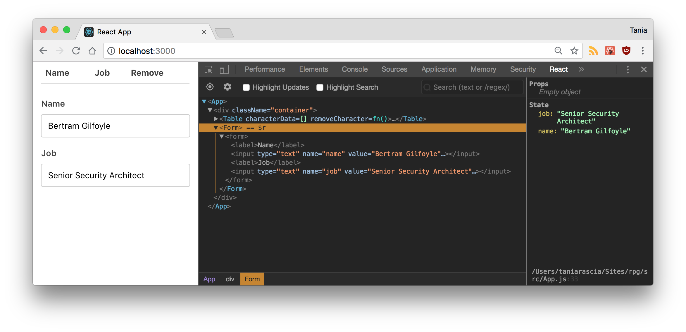
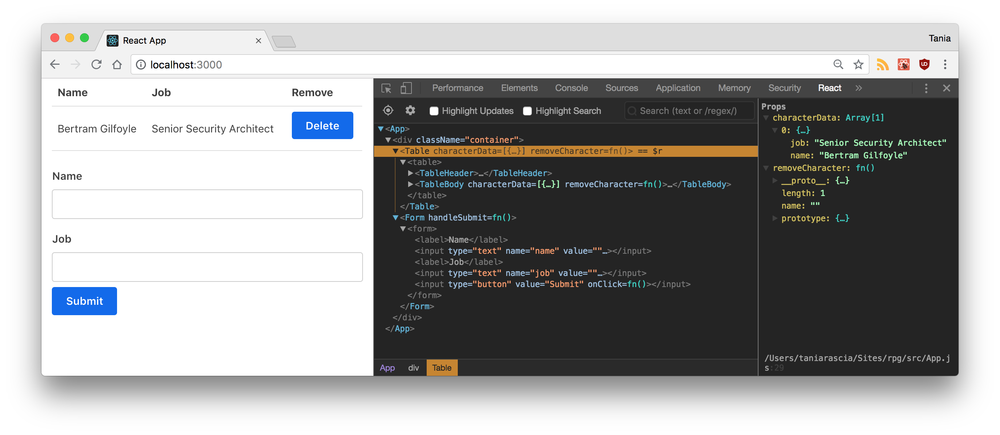

Immer mal wieder habe ich in eine [SPA](https://de.wikipedia.org/wiki/Single-Page-Webanwendung) hineingeschnuppert. Unter anderem habe ich mir [React](https://de.reactjs.org/) angesehen. Auf den ersten Blick hat es mich abgeschreckt. Zum einen wirkte es kompliziert. Ich habe im Studium objektorientiert Java und deklarativ Haskell gelernt. Als ich dann in der Praxis gezwungen war PHP zu nutzen, war ich nicht vollends begeistert --- aber die Einfachheit hat mir gefallen. Außerdem hatte ich den Eindruck, dass in React HTML, CSS und JavaScript vermischt werden. Das ist genau das, was ich vermeide. Bei der Suche nach einem statischen Websitegenerator bin ich auf [Gatsby](https://www.gatsbyjs.org/) gestoßen und so habe ich mir die Frage erneut gestellt: _Warum ist React so populär_?

Instead, I focused on just learning vanilla JavaScript and working with jQuery in a professional setting. After a few frustrated, failed attempts to get started with React, I finally started to get it, and I began to see why I might want to use React instead of vanilla JS or jQuery.

I tried to condense everything I've learned into a nice introduction to share with you, so here it is.

#### Voraussetzungen

Es gibt einige Dinge, die dir das Herumspielen mit React vereinfachen. Wenn JavaScript oder DOM Fremdwörter für dich sind, lerne diese besser zuerst kennen.

Hilfreich sind zusätzlich:

- Grundlegende HTML & CSS Kenntnisse
- Grundkenntnisse in JavaScript
- Ein grundlegendes Verständnis für das DOM
- Kenntnisse der ES6-Syntax und -Funktionen
- Node.js und npm

#### Ziel

- Erfahre mehr über wichtige React-Konzepte und verwandte Begriffe wie Babel, Webpack, JSX, Komponenten, Eigenschaften (Props), Status und Lebenszyklus.
- Erstelle eine React-App, die die oben genannten Konzepte veranschaulicht.

Sieh dir hier den Code und eine Demo des Endergebnisses an.

- [Quellcode auf GitHub anzeigen](https://github.com/astridx/react-tutorial)
- [Projekt Demo ansehen](https://astridx.github.io/react-tutorial/)

## Was ist React?

Laut [Wikipedia](https://de.wikipedia.org/wiki/React) ist React eine JavaScript-Softwarebibliothek, die ein Grundgerüst für die Ausgabe von User-Interface-Komponenten von Webseiten zur Verfügung stellt (Webframework). Ich bin der Meinung, wir sehen uns das besser praktisch an.

## Einrichtung und Installation

Es gibt verschiedene Möglichkeiten, React einzurichten --- ich zeige dir zwei.

### 1. Statische HTML-Datei

Diese erste Methode ist nicht die beste. Ich zeige sie dir, weil sie leicht zu verstehen ist und deshalb einen schnellen Einstieg ermöglicht. Insbesondere, wenn du nicht mit Webpack und Node.js vertraut bist.

Als Erstes erstellen wir die Datei `index.html`. Wir werden zwei [CDNs für React](https://reactjs.org/docs/cdn-links.html) im Header laden - React und React DOM. Beachte die ID namens `root`, diese ist wichtig. Benutzerdefinierten Code legen wir in einem separaten `script`-Tag am Ende der Site ab.

<div class="filename">index.html</div>

```html
<!DOCTYPE html>
<html>
  <head>
    <meta charset="utf-8" />

    <title>Hallo React!</title>

    <script src="https://unpkg.com/react@16/umd/react.development.js"></script>
    <script src="https://unpkg.com/react-dom@16/umd/react-dom.development.js"></script>
    <script src="https://unpkg.com/babel-standalone@6.26.0/babel.js"></script>
  </head>

  <body>
    <div id="root"></div>

    <script>
      // Dein benutzerdefinierter React-Code
    </script>
  </body>
</html>
```

Ich lade zum Zeitpunkt dieses Schreibens die neuesten stabilen Versionen der Bibliotheken.

- [React](https://reactjs.org/docs/react-api.html) - die React Top Level API
- [React DOM](https://reactjs.org/docs/react-dom.html) - fügt DOM-spezifische Methoden hinzu
- [Babel](https://babeljs.io/) - Ein JavaScript-Compiler, mit dem wir ES6+ in Browsern verwenden können.

Der Einstiegspunkt für unsere App ist das div-Element `root`.

Schreiben wir unseren ersten React-Code. Wir werden ES6-Klassen verwenden, um eine React-Komponente namens `App` zu erstellen.

<div class="filename">index.html</div>

```jsx
class App extends React.Component {
  //...
}
```

Jetzt fügen wir [`render()`](https://de.reactjs.org/docs/react-component.html#render) hinzu, die einzige erforderliche Methode in einer Klassenkomponente, die zum Rendern von DOM-Knoten verwendet wird.

<div class="filename">index.html</div>

```jsx
class App extends React.Component {
  render() {
      return (
          //...
      );
  }
}
```
Mit `return` werden wir ein HTML-Element zurückgeben. Beachte, dass wir hier keine Zeichenfolge/String zurückgeben. Verwende daher keine Anführungszeichen. Wir nutzen `JSX` und was das ist, wirst du bald erfahren.

<div class="filename">index.html</div>

```jsx
class App extends React.Component {
  render() {
    return <h1>Hallo Welt!</h1>
  }
}
```

Schließlich verwenden wir die `render()`-Methode, um die `App` Klasse im `root` div zu rendern.

Finally, we're going to use the React DOM `render()` method to render the `App` class we created into the `root` div in our HTML.

<div class="filename">index.html</div>

```jsx
ReactDOM.render(<App />, document.getElementById('root'))
```

Hier siehst du den vollständigen Code für die `index.html`.

<div class="filename">index.html</div>

```html
<!DOCTYPE html>
<html>
  <head>
    <meta charset="utf-8" />

    <title>Hallo React!</title>

    <script src="https://unpkg.com/react@16/umd/react.development.js"></script>
    <script src="https://unpkg.com/react-dom@16/umd/react-dom.development.js"></script>
    <script src="https://unpkg.com/babel-standalone@6.26.0/babel.js"></script>
  </head>

  <body>
    <div id="root"></div>

    <script type="text/babel">
      class App extends React.Component {
        render() {
          return <h1>Hallo Welt!</h1>
        }
      }

      ReactDOM.render(<App />, document.getElementById('root'))
    </script>
  </body>
</html>
```

Voilà! Wenn du die `index.html` jetzt im Browser aufrufst, wird das `h1`-Tag im DOM gerendert.


Das ist eingängig, oder? 

Diese Methode, mit der wir JavaScript-Bibliotheken in eine statische HTML-Seite laden und React und Babel im laufenden Betrieb rendern, ist nicht effizient und schwer zu warten.

Ich habe dieses Beispiel in erster Linie zu Motivationszwecken gewählt und um dir zu zeigen, was geht. 

### 2. Die Create React App

Jetzt werden wir eine andere Methode verwenden: Die *Create React App*.

Glücklicherweise hat Facebook die [React App erstellen](https://github.com/facebook/create-react-app) erstellt. Eine Umgebung, die mit allem vorkonfiguriert ist, was du zum Erstellen einer React App benötigst: 

- Ein Live-Entwicklungsserver wird erstellt.
- Mit Webpack werden automatisch React-, JSX- und ES6-Dateien kompiliert.
- CSS-Dateien werden automatisch vorangestellt. 
- Fehler werden mit ESLint im Code gefunden.

Konzentrieren dich so voll und ganz auf React.

Rufe zum Einrichten der `create-react-app` den folgenden Code über deine Befehlzeile auf. Wähle für den Aufruf das Verzeichnis, in dem du das Projekt anlegst. Stelle sicher, dass du [Node.js](https://nodejs.org/de/) installiest hat.

```bash
npx create-react-app react-tutorial
```

Wechsele nach Abschluss der Installation in das neu erstellte Verzeichnis und starte das Projekt.

```bash
cd react-tutorial
npm start
```

Sobald du diesen Befehl aufrufst, wird unter `localhost:3000` ein neues Fenster mit der neuen React-App angezeigt.


Wenn du dir die Projektstruktur ansiehst, siehst du ein Verzeichnis "/public" und "/src" sowie die Dateien `node_modules`, `.gitignore`, `README.md`, und `package.json`.

In `/public` findest du die `index.html`, welche der zuvor angelegten statischen Datei `index.html` sehr ähnlich ist. Du siehst nur ein div mit der ID `root`. Dieses Mal werden keine Bibliotheken oder Skripte geladen. Das Verzeichnis `/src` enthält unseren gesamten React-Code.

Um zu überprüfen, ob der Code automatisch kompiliert und aktualisiert wird, suche die folgende Zeile in `/src/App.js` und ersetze diese mit anderem Text:

```html
Edit <code>src/App.js</code> and save to reload.
```

Sobald du die Datei gespeichert hast, wirst du feststellen, dass `localhost:3000` mit den neuen Daten kompiliert und aktualisiert wird. Im Browser wird jetzt der von dir geänderte Text angezeigt.

Lösche alle Dateien aus dem Verzeichnis `/src`. Vieles würde nur verwirren. Wir erstellen unsere eigene Anwendung. Wir behalten nur `index.css` und `index.js`.

In die `index.css` habe ich die CSS-Datei von [Bootstrap](https://getbootstrap.com/docs/4.5/getting-started/download/)  Ich finde es sieht formatiert nach mehr aus. Du kannst hier deine eigenen Style einfügen.

Jetzt importieren wir in `index.js` React, ReactDOM und die CSS-Datei.

<div class="filename">src/index.js</div>

```jsx
import React from 'react'
import ReactDOM from 'react-dom'
import './index.css'
```

Erstellen wir die `App`-Komponente neu. Vorher hatten wir ein `<h1>`. Jetzt füge ich ein div-Element mit einer Klasse hinzu. Ich nutze `className` anstelle von `class`. Dies ist der erster Hinweis darauf, dass JSX schreibe, auch wenn es wie HTML aussieht!

<div class="filename">src/index.js</div>

```jsx
class App extends React.Component {
  render() {
    return (
      <div className="App">
        <h1>Hallo, React!</h1>
      </div>
    )
  }
}
```

Schließlich rendern wir die `App`. Kommt dir dieser Aufruf bekannt vor? Es ist derselbe, den wir zuvor in der statischen Datei verwendeten.

<div class="filename">src/index.js</div>

```js
ReactDOM.render(<App />, document.getElementById('root'))
```

Hier ist die vollständiger `index.js`. Dieses Mal importieren wir die `Component` direkt, sodass wir `React.Component` nicht mehr erweitern müssen.

<div class="filename">src/index.js</div>

```jsx
import React, { Component } from 'react'
import ReactDOM from 'react-dom'
import './index.css'

class App extends Component {
  render() {
    return (
      <div className="App">
        <h1>Hallo, React!</h1>
      </div>
    )
  }
}

ReactDOM.render(<App />, document.getElementById('root'))
```

Wenn zu `localhost:3000` zurückkehrst, wird "Hallo, React!" angezeigt. So wie vorher. Das ist der Anfang unserer React-App.

### React Developer Tools

Es gibt Werkzeuge, die das Leben eines React Developers vereinfachen. Installiere beispielsweise für Firefox das Addon [react-devtools](https://addons.mozilla.org/en-US/firefox/addon/react-devtools/). 

Mit diesem ist es dir möglich einen React-Baum zu untersuchen. Du verschaffst dir so einen Überblick über die Komponentenhierarchie, die Eigenschaften (Props), den Status und mehr. Öffne zunächst die [Entwicklerwerkzeuge in Firefox](https://developer.mozilla.org/de/docs/Tools/Keyboard_shortcuts#%C3%96ffnen_und_Schlie%C3%9Fen_von_Werkzeugen) und wechsel zur Registerkarte "Komponenten" oder "Profiler".


Jetzt haben wir alle Tools und Einstellungen, die wir benötigen, um mit React zu arbeiten.

> Falls du einen anderen Browser verwendest, findest du weitere Informationen in diesem [Blogbeitrag](https://de.reactjs.org/blog/2015/09/02/new-react-developer-tools.html#installation) oder bei [chrome.google.com](https://chrome.google.com/webstore/detail/react-developer-tools/fmkadmapgofadopljbjfkapdkoienihi) oder
[microsoftedge.microsoft.com](https://microsoftedge.microsoft.com/addons/detail/react-developer-tools/gpphkfbcpidddadnkolkpfckpihlkkil)

## JSX: JavaScript + XML

Wie du gesehen hast, haben wir in unserem React-Code HTML verwendet, aber es ist nicht HTML. Dies ist **JSX**, was für JavaScript + XML steht.

JSX wirkt wie HTML aus. Es ist möglich eigene XML-ähnlichen Tags zu erstellen. So sieht JSX aus, wenn es einer Variablen zugewiesen ist.

<div class="filename">JSX</div>

```jsx
const heading = <h1 className="site-heading">Hallo, React</h1>
```

Die Verwendung von JSX ist nicht zwingend. Unter der Haube wird `createElement` aufgerufen. Der folgende Code hat die gleiche Ausgabe wie der obige JSX.

<div class="filename">No JSX</div>

```jsx
import React, { Component } from "react";
import ReactDOM from "react-dom";
import "./index.css";

const heading = React.createElement(
  "h1",
  { className: "site-heading" },
  "Hallo, React!"
);

class App extends Component {
  render() {
    return <div>{heading}</div>;
  }
}

ReactDOM.render(<App />, document.getElementById("root"));
```

JSX ist eigentlich näher an JavaScript als an HTML, daher sind Unterschiede zu beachten.

- `className` wird anstelle von `class` zum Hinzufügen von CSS-Klassen verwendet, da `class` ein reserviertes Schlüsselwort in JavaScript ist.
- Eigenschaften und Methoden in JSX sind camelCase --- `onclick` wird zu `onClick`.
- Selbstschließende Tags enden in einem Schrägstrich --- beispielsweise ``

JavaScript-Ausdrücke werden in geschweiften Klammern in JSX eingebettet --- einschließlich Variablen, Funktionen und Eigenschaften.

```jsx
const name = 'Astrid'
const heading = <h1>Hallo, {name}</h1>
```

JSX ist einfacher zu schreiben und zu verstehen als viele Elemente in Vanille-JavaScript und einer der Gründe, warum Menschen React so lieben.

## Komponenten

Bisher haben wir eine Komponente erstellt --- die App`-Komponente. Fast alles in React besteht aus Komponenten, welches **Klassenkomponenten** oder **Funktionskomponenten** sein können.

> Sieh dir das [Kapitel *Legacy-React*](https://github.com/the-road-to-learn-react/the-road-to-react-german/blob/master/manuscript/react-legacy/class-components.md) im Buch *The Road to React* an um mehr über die Entwicklung er Komponenten in React zu lernen.

Die meisten React-Apps haben viele kleine Komponenten, und alles wird über die Hauptkomponente `App` geladen. Komponenten erhalten häufig auch eine eigene Datei. So bleibt das Projekt übersichtlich.

Entferne die `App`-Klasse aus `index.js`:

<div class="filename">src/index.js</div>

```jsx
import React from 'react'
import ReactDOM from 'react-dom'
import App from './App'
import './index.css'

ReactDOM.render(<App />, document.getElementById('root'))
```
Dies führt zunächst zu einer Fehlermeldung, weil die App nicht gefunden wird. Wir werden eine neue Datei namens `App.js` erstellen und die Komponente dort einfügen.

<div class="filename">src/App.js</div>

```jsx
import React, { Component } from 'react'

class App extends Component {
  render() {
    return (
      <div className="App">
        <h1>Hallo, React!</h1>
      </div>
    )
  }
}

export default App
```

Wir exportieren die Komponente als `App` und importieren sie in `index.js`. Es ist nicht zwingend erforderlich, Komponenten in Dateien zu trennen, aber eine Anwendung wird andernfalls unhandlich und außer Kontrolle geraten.

> Sieh dir das [Kapitel *Projektstruktur*](https://github.com/the-road-to-learn-react/the-road-to-react-german/blob/master/manuscript/react-maintenance/project-structure.md) im Buch *The Road to React* an.

### Klassenkomponenten

Lasse uns eine weitere Komponente erstellen. Wir werden eine Tabelle anlegen. Nenne die Datei `Table.js` und fülle sie mit wie folgt. `className="table table-striped"` sind [Booststrap Klassen](https://getbootstrap.com/docs/4.5/content/tables/#striped-rows) die dafür sorgen, dass die Tabelle formatiert wird.


<div class="filename">src/Table.js</div>

```jsx
import React, { Component } from 'react'

class Table extends Component {
  render() {
    return (
      <table className="table table-striped">
        <thead>
          <tr>
            <th>Name</th>
            <th>Aufgabe</th>
          </tr>
        </thead>
        <tbody>
          <tr>
            <td>Uschi</td>
            <td>Grundstück bewachen</td>
          </tr>
          <tr>
            <td>Elmar</td>
            <td>Müll entsorgen</td>
          </tr>
          <tr>
            <td>Astrid </td>
            <td>Buch lesen</td>
          </tr>
          <tr>
            <td>Tim</td>
            <td>Staubsauen</td>
          </tr>
        </tbody>
      </table>
    )
  }
}

export default Table
```

`Table` ist eine benutzerdefinierte Klassenkomponente. Wir verwenden diese, um sie von normalen HTML-Elementen zu unterscheiden. Zurück in `App.js` können wir die Tabelle laden, indem wir sie zuerst importieren:

<div class="filename">src/App.js</div>

```jsx
import Table from './Table'
```

Lade die Tabelle dann in der Funktion `render()` der App-Komponente. 

<div class="filename">src/App.js</div>

```jsx
import React, { Component } from 'react'
import Table from './Table'

class App extends Component {
  render() {
    return (
      <div>
        <Table />
      </div>
    )
  }
}

export default App
```

Sieh es dir im Brwoser an, die Tabelle `Table` wird geladen.


Du hast gesehen, was eine benutzerdefinierte Klassenkomponente ist. Verwende diese an beliebigen Stellen. Das nachfolgene Beispiel zeigt die Tabelle zweimal hintereinander an. Das ist nicht sinnvoll. Es geht nur ims Prinzip.

<div class="filename">src/App.js</div>

```jsx
import React, { Component } from 'react'
import Table from './Table'

class App extends Component {
  render() {
    return (
      <div>
        <Table />
        <Table />
      </div>
    )
  }
}

export default App
```

Die Daten sind momentan fest codiert. Dies ist in der Regel nicht allzu nützlich. Meist arbeiten wir mit dynamischen Daten.

### Funktionskomponenten

Die andere Art von Komponente in React ist die **Funktionskomponente**. Diese verwendet nicht das Schlüsselwort `class`. Nehmen wir unsere `Table` Tabelle und erstellen zwei Funktionskomponenten - einen Tabellenkopf und einen Tabellenkörper.

Wir werden ES6-Pfeilfunktionen verwenden, um diese Komponenten knapp und präzise zu erstellen. Zuerst die Tabellenüberschrift.

<div class="filename">src/Table.js</div>

```jsx
const TableHeader = () => {
  return (
    <thead>
      <tr>
        <th>Name</th>
        <th>Aufgabe</th>
      </tr>
    </thead>
  )
}
```

Dann der Körper.

<div class="filename">src/Table.js</div>

```jsx
const TableBody = () => {
  return (
    <tbody>
      <tr>
        <td>Uschi</td>
        <td>Grundstück bewachen</td>
      </tr>
      <tr>
        <td>Elmar</td>
        <td>Müll entsorgen</td>
      </tr>
      <tr>
        <td>Astrid </td>
        <td>Buch lesen</td>
      </tr>
      <tr>
        <td>Tim</td>
        <td>Staubsaugen</td>
      </tr>
    </tbody>
  )
}
```

Jetzt sieht unsere `Table`-Datei wie folgt aus. Die drei Punkte sind Platzhalter für die zuvor beschriebenen Funktionskomponenten. Beachte, dass sich `TableHeader` und `TableBody` in derselben Datei befinden und von der Klassenkomponente `Table` verwendet werden.

<div class="filename">src/Table.js</div>

```jsx
const TableHeader = () => { ... }
const TableBody = () => { ... }

class Table extends Component {
  render() {
    return (
      <table className="table table-striped">
        <TableHeader />
        <TableBody />
      </table>
    )
  }
}
```

Im Frontend hat sich nichts geändert. Wie du bemerkst, ist es möglich, Komponenten in anderen zu verschachteln und Fuktionskomponenten und Klassenkomponenten zu mischen.

> Eine Klassenkomponente muss `render()` enthalten.

Zum Abschluss vergleichen wir eine Funktionskomponente mit einer Klassenkomponente.

<div class="filename">Funktionskomponente</div>

```jsx
const FunktionsKomponente = () => {
  return <div>Beispieltext</div>
}
```

<div class="filename">Klassenkomponente</div>

```jsx
class KlassenKomponente extends Component {
  render() {
    return <div>Beispieltext</div>
  }
}
```

Beachte, dass, wenn `return` in einer Zeile steht, keine Klammern erforderlich sind.

## Eigenschaften (Props)

Im Moment haben wir eine `Table`-Komponente in der die Daten fest codiert sind. Eine der großen Herausforderungen bei React ist der Umgang mit dynamischen Daten. Verwende hiezu [Eigenschaften (Props)](https://de.reactjs.org/docs/components-and-props.html) und [Status](https://de.reactjs.org/docs/state-and-lifecycle.html).

Entfernen wir zunächst alle Daten aus unserer `TableBody`-Komponente.

<div class="filename">src/Table.js</div>

```jsx
...
const TableBody = () => {
  return <tbody />
}
...
```
Verschieben wir diese in ein Array. Wir erstellen dieses Array in der Methode `render()` der App.

<div class="filename">src/App.js</div>

```jsx
...
class App extends Component {
  render() {
    const listeneintraege = [
      {
        name: 'Uschi',
        aufgabe: 'Grundstück bewachen',
      },
      {
        name: 'Elmar',
        aufgabe: 'Müll entworgen',
      },
      {
        name: 'Astrid',
        aufgabe: 'Buch lesen',
      },
      {
        name: 'Tim',
        aufgabe: 'Staubsaugen',
      },
    ]

    return (
      <div>
        <Table />
      </div>
    )
  }
}
...
```

Jetzt werden wir die Daten mittels Eigenschaften (Props) an die untergeordnete Komponente (`Table`) weiterleiten, so wie du Daten mithilfe von `data-`Attributen weitergibst. Der Name ist beliebig solange du kein reserviertes Schlüsselwort wählst. Ich wähle `TodoDaten`. Die Variabel selbst nenne ich `listeneintraege`. Ich setze diese in geschweifte Klammern, da es sich um einen JavaScript-Ausdruck handelt.

<div class="filename">src/App.js</div>

```jsx
...
return (
  <div>
    <Table TodoDaten={listeneintraege} />
  </div>
)
...
```

Die Daten werden nun an die Tabelle `Table` übergeben. Diese muss sie jetzt annehmen.

<div class="filename">src/Table.js</div>

```jsx
...
class Table extends Component {
  render() {
    const { TodoDaten } = this.props

    return (
      <table className="table table-striped">
        <TableHeader />
        <TableBody TodoDaten={TodoDaten} />
      </table>
    )
  }
}
...
```

Wenn du das React Entwicklertool öffnest und die Komponente „Tabelle“ untersuchst, wird das Datenarray in den Eigenschaften angezeigt. Die hier gespeicherten Daten werden als ** virtuelles DOM ** bezeichnet. Dies ist eine schnelle und effiziente Methode zum Synchronisieren von Daten mit dem tatsächlichen DOM.

If you open up React DevTools and inspect the `Table` component, you'll see the array of data in the property. The data that's stored here is known as the **virtual DOM**, which is a fast and efficient way of syncing data with the actual DOM.


Diese Daten befinden sich jedoch noch nicht im eigentlichen DOM. In `Table` können wir über` this.props` auf alle Eigenschaften (Props) zugreifen. Wir geben nur eine Eigenschaft durch, TodoDaten, also verwenden wir „this.props.TodoDaten“, um diese Daten abzurufen.

Ich werde die Kurzform der ES6-Eigenschaft verwenden, um eine Variable zu erstellen, die `this.props.TodoDaten` enthält.

This data is not in the actual DOM yet, though. In `Table`, we can access all props through `this.props`. We're only passing one props through, TodoDaten, so we'll use `this.props.TodoDaten` to retrieve that data.

I'm going to use the ES6 property shorthand to create a variable that contains `this.props.TodoDaten`.

```jsx
...
const { TodoDaten } = this.props
...
```

Da unsere "Table" -Komponente tatsächlich aus zwei kleineren einfachen Komponenten besteht, werde ich sie noch einmal über Requisiten an den "TableBody" weiterleiten.

Since our `Table` component actually consists of two smaller simple components, I'm going to pass it through to the `TableBody`, once again through props.

<div class="filename">src/Table.js</div>

```jsx
...
class Table extends Component {
  render() {
    const { TodoDaten } = this.props

    return (
      <table className="table table-striped">
        <TableHeader />
        <TableBody TodoDaten={TodoDaten} />
      </table>
    )
  }
}
...
```

Derzeit akzeptiert `TableBody` keine Parameter und gibt ein einzelnes Tag zurück.
Right now, `TableBody` takes no parameters and returns a single tag.

<div class="filename">src/Table.js</div>

```jsx
const TableBody = () => {
  return <tbody />
}
```

Wir werden die Requisiten als Parameter übergeben und [durch das Array zuordnen](https://developer.mozilla.org/de-DE/docs/Web/JavaScript/Reference/Global_Objects/Array/map) an Gibt für jedes Objekt im Array eine Tabellenzeile zurück. Diese Zuordnung wird in der Variablen "Zeilen" enthalten sein, die wir als Ausdruck zurückgeben.

We're going to pass the props through as a parameter, and [map through the array](https://developer.mozilla.org/en-US/docs/Web/JavaScript/Reference/Global_Objects/Array/map) to return a table row for each object in the array. This map will be contained in the `rows` variable, which we'll return as an expression.

<div class="filename">src/Table.js</div>

```jsx
...
const TableBody = props => {
  const rows = props.TodoDaten.map((row, index) => {
    return (
      <tr key={index}>
        <td>{row.name}</td>
        <td>{row.aufgabe}</td>
      </tr>
    )
  })

  return <tbody>{rows}</tbody>
}
...
```

If you view the front end of the app, all the data is loading in now.

You'll notice I've added a key index to each table row. You should always use [keys](https://reactjs.org/docs/lists-and-keys.html#keys) when making lists in React, as they help identify each list item. We'll also see how this is necessary in a moment when we want to manipulate list items.

Props are an effective way to pass existing data to a React component, however the component cannot change the props - they're read-only. In the next section, we'll learn how to use state to have further control over handling data in React.

> Sieh dir das [Kapitel *Eigenschaften (Props) in React*](https://github.com/the-road-to-learn-react/the-road-to-react-german/blob/master/manuscript/react-modern/props.md) im Buch *The Road to React* an um weitere Beispiele für die Verwendung von Eigenschaften zu erkunden.

## Status

Im Moment speichern wir die Listeneinträge in einem Array in einer Variablen und geben sie als Eigenschaft weiter. Dies ist ein Anfang. Stelle dir vor, wir löschen ein Element aus dem Array. Mit Eigenschaften haben wir einen Einweg-Datenfluss, aber mit Status ist es möglich, dass wir Daten von einer Komponente aktualisieren.

Stelle dir den Status als alle Daten vor, die gespeichert und geändert werden, ohne dass sie unbedingt zu einer Datenbank hinzugefügt werden müssen. Sie können beispielsweise Artikel hinzufügen und aus einem Warenkorb entfernen, bevor der Kauf abgeschlossen wird.

Zu Beginn erstellen wir ein `state`-Objekt.

Right now, we're storing our listeneintrag data in an array in a variable, and passing it through as props. This is good to start, but imagine if we want to be able to delete an item from the array. With props, we have a one way data flow, but with state we can update private data from a component.

You can think of state as any data that should be saved and modified without necessarily being added to a database - for example, adding and removing items from a shopping cart before confirming your purchase.

To start, we're going to create a `state` object.

<div class="filename">src/App.js</div>

```jsx
...
class App extends Component {
  state = {}
}
...
```

Das Objekt enthält Eigenschaften für alles, was du im Status speichern möchtest. In unserem Fall ist dies die Variable `listeneintraege`.

<div class="filename">src/App.js</div>

```jsx
class App extends Component {
  state = {
    listeneintraege: [],
  }
}
```

Verschiebe das gesamte zuvor erstellte Array von Objekten in `state.listeneintraege`.
Move the entire array of objects we created earlier into `state.listeneintraege`.

<div class="filename">src/App.js</div>

```jsx
...
class App extends Component {
  state = {
    listeneintraege: [
      {
        name: 'Uschi',
        // Die restlichen Daten
      },
    ],
  }
  ...
}
...
```

Unsere Daten sind offiziell im Status enthalten. Da wir ein Zeichen aus der Tabelle entfernen möchten, erstellen wir eine Methode `removeListeneintrag` für die übergeordnete Klasse `App`.

Um den Status abzurufen, erhalten wir `this.state.listeneintraege` mit derselben ES6-Methode wie zuvor. Um den Status zu aktualisieren, verwenden wir "this.setState ()", eine integrierte Methode zum Bearbeiten des Status. Wir [filtern das Array] (https://developer.mozilla.org/de-DE/docs/Web/JavaScript/Reference/Global_Objects/Array/filter) basierend auf einem `index`, den wir durchlaufen, und kehren zurück das neue Array.

> Sie müssen `this.setState ()` verwenden, um ein Array zu ändern. Das einfache Anwenden eines neuen Werts auf "this.state.property" funktioniert nicht.

Our data is officially contained in the state. Since we want to be able to remove a listeneintrag from the table, we're going to create a `removeListeneintrag` method on the parent `App` class.

To retrieve the state, we'll get `this.state.listeneintraege` using the same ES6 method as before. To update the state, we'll use `this.setState()`, a built-in method for manipulating state. We'll [filter the array](https://developer.mozilla.org/en-US/docs/Web/JavaScript/Reference/Global_Objects/Array/filter) based on an `index` that we pass through, and return the new array.

> You must use `this.setState()` to modify an array. Simply applying a new value to `this.state.property` will not work.

<div class="filename">src/App.js</div>

```jsx
...
removeListeneintrag = index => {
  const { listeneintraege } = this.state

  this.setState({
    listeneintraege: listeneintraege.filter((listeneintrag, i) => {
      return i !== index
    }),
  })
}
...
```

`filter` mutiert nicht, sondern erstellt ein neues Array und ist eine bevorzugte Methode zum Ändern von Arrays in JavaScript. Diese spezielle Methode testet einen Index mit allen Indizes im Array und gibt alle außer dem Index zurück, der durchlaufen wird.

Jetzt müssen wir diese Funktion an die Komponente übergeben und neben jedem Zeichen, das die Funktion aufrufen kann, eine Schaltfläche rendern. Wir werden die Funktion `removeListeneintrag` als Eigenschaft (Props) an `Table` übergeben.

`filter` does not mutate but rather creates a new array, and is a preferred method for modifying arrays in JavaScript. This particular method is testing an index vs. all the indices in the array, and returning all but the one that is passed through.

Now we have to pass that function through to the component, and render a button next to each listeneintrag that can invoke the function. We'll pass the `removeListeneintrag` function through as a prop to `Table`.

<div class="filename">src/App.js</div>

```jsx
...
render() {
  const { listeneintraege } = this.state

  return (
    <div>
      <Table TodoDaten={listeneintraege} removeListeneintrag={this.removeListeneintrag} />
    </div>
  )
}
...
```

Da wir es von `Table` an `TableBody` weitergeben, müssen wir es erneut als Eigenschadt (Prop) weitergeben, genau wie wir es mit den Listeneinträgen getan haben.

Da sich herausstellt, dass die einzigen Komponenten mit eigenen Zuständen in unserem Projekt `App` und `Form` sind, ist es außerdem empfehlenswert, `Table` aus der aktuellen Klassenkomponente in eine Funktionskomponente umzuwandeln.

Since we're passing it down to `TableBody` from `Table`, we're going to have to pass it through again as a prop, just like we did with the listeneintrag data.

In addition, since it turns out that the only components having their own states in our project are `App` and `Form`, it would be best practice to transform `Table` into a simple component from the class component it currently is.

<div class="filename">src/Table.js</div>

```jsx
...
const Table = (props) => {
  const { TodoDaten, removeListeneintrag } = props;

  return (
    <table className="table table-striped">
      <TableHeader />
      <TableBody TodoDaten={TodoDaten} removeListeneintrag={removeListeneintrag} />
    </table>
  );
}
...
```

Hier kommt der Index ins Spiel, den wir in der Methode `removeListeneintrag()` definiert haben. In der Komponente `TableBody` übergeben wir diesen als Parameter, damit die Filterfunktion weiß, welches Element entfernt werden soll. Wir erstellen eine Schaltfläche mit einem `onClick` Ereignis und geben dieses weiter.

<div class="filename">src/Table.js</div>

```jsx
...
<tr key={index}>
  <td>{row.name}</td>
  <td>{row.aufgabe}</td>
  <td>
    <button onClick={() => props.removeListeneintrag(index)}>Delete</button>
  </td>
</tr>
...
```

> Die Funktion `onClick` muss eine Funktion durchlaufen, die die Methode `removeListeneintrag()` zurückgibt. Andernfalls wird versucht, sie automatisch auszuführen.

Genial. Jetzt haben wir Schaltflächen zum Löschen und ändern den Status durch Löschen eines Eintrags.


Astrid hat das Buch gelesen, ich habe den Eintrag gelöscht.

Jetzt ist dir klar, wie der Status initialisiert wird und wie er geändert wird, richtig.

> Sieh dir das [Kapitel *Status in React*](https://github.com/the-road-to-learn-react/the-road-to-react-german/blob/master/manuscript/react-modern/state.md) im Buch *The Road to React* an. 

## Senden von Formulardaten

Jetzt haben wir Daten im Status gespeichert und können jedes Element aus dem Status entfernen. Was aber, wenn neue Daten zum Status hinzuzufügen? In einer realen Anwendung beginnst du in der Regel mit einem leeren Status und fügest Elemente hinzu.

Entfernen wir vor allem alle fest codierten Daten aus `state.listeneintraege`, da wir dies jetzt über das Formular aktualisieren werden.

<div class="filename">src/App.js</div>

```jsx
class App extends Component {
  state = {
    listeneintraege: [],
  }
}
```

Lasse uns nun eine `Form`-Komponente in einer neuen Datei mit dem Namen `Form.js` erstellen. Wir werden eine Klassenkomponente erstellen und darin einen Konstruktor `constructor()` verwenden, was wir bisher noch nicht getan haben. Wir benötigen den Konstruktor, um `this` zu verwenden und die Eigenschaften `props` des Elternteils zu erhalten.

Wir werden den Anfangszustand des Formulars `Form` als Objekt mit einigen leeren Eigenschaften festlegen und diesen Anfangszustand `this.state` zuweisen.

<div class="filename">src/Form.js</div>

```jsx
import React, { Component } from 'react'

class Form extends Component {
  constructor(props) {
    super(props)

    this.initialState = {
      name: '',
      aufgabe: '',
    }

    this.state = this.initialState
  }
}
```

Unser Ziel für dieses Formular ist es, den Status von `Form` jedes Mal zu aktualisieren, wenn ein Feld im Formular geändert wird. Wenn wir es senden, werden alle diese Daten in den Status von `App` übertragen, der dann `Table` aktualisiert .

Zuerst erstellen wir die Funktion, die jedes Mal ausgeführt wird, wenn eine Änderung an einer Eingabe vorgenommen wird. Das Ereignis `event` wird durchlaufen, und wir setzen den Status von `Form` so, dass `name` (Schlüssel) und der `value` (Wert) der Eingaben angezeigt werden.

<div class="filename">src/Form.js</div>

```jsx
handleChange = event => {
  const { name, value } = event.target

  this.setState({
    [name]: value,
  })
}
```

Let's get this working before we move on to submitting the form. In the render, let's get our two properties from state, and assign them as the values that correspond to the proper form keys. We'll run the `handleChange()` method as the `onChange` of the input, and finally we'll export the `Form` component.

<div class="filename">src/Form.js</div>

```jsx
render() {
  const { name, aufgabe } = this.state;

  return (
    <form>
      <label for="name">Name</label>
      <input
        type="text"
        name="name"
        id="name"
        value={name}
        onChange={this.handleChange} />
      <label for="aufgabe">aufgabe</label>
      <input
        type="text"
        name="aufgabe"
        id="aufgabe"
        value={aufgabe}
        onChange={this.handleChange} />
    </form>
  );
}

export default Form;
```

In `App.js` können wir das Formular unter der Tabelle rendern.

<div class="filename">src/App.js</div>

```jsx
return (
  <div>
    <Table TodoDaten={listeneintraege} removeListeneintrag={this.removeListeneintrag} />
    <Form />
  </div>
)
```

Wenn wir jetzt zum Frontend unserer App gehen, sehen wir ein Formular, für das noch keine Übermittlung vorliegt. Wenn Sie einige Felder aktualisieren, wird der lokale Status von `Form` aktualisiert.

Now if we go to the front end of our app, we'll see a form that doesn't have a submit yet. Update some fields and you'll see the local state of `Form` being updated.



Cool. Last step is to allow us to actually submit that data and update the parent state. We'll create a function called `handleSubmit()` on `App` that will update the state by taking the existing `this.state.listeneintraege` and adding the new `listeneintrag` parameter, using the [ES6 spread operator](https://developer.mozilla.org/en-US/docs/Web/JavaScript/Reference/Operators/Spread_syntax).

<div class="filename">src/App.js</div>

```jsx
handleSubmit = listeneintrag => {
  this.setState({ listeneintraege: [...this.state.listeneintraege, listeneintrag] })
}
```

Stellen wir sicher, dass wir das als Parameter in `Form` durchgeben.

```jsx
<Form handleSubmit={this.handleSubmit} />
```

Jetzt erstellen wir in "Form" eine Methode namens `submitForm()`, die diese Funktion aufruft, und übergeben den Status `Form` als den zuvor definierten `listeneintrag`-Parameter. Außerdem wird der Status auf den ursprünglichen Status zurückgesetzt, um das Formular nach dem Senden zu löschen.

<div class="filename">src/Form.js</div>

```jsx
submitForm = () => {
  this.props.handleSubmit(this.state)
  this.setState(this.initialState)
}
```

Schließlich fügen wir eine Schaltfläche zum Senden hinzu, um das Formular zu senden. Wir verwenden einen `onClick` anstelle eines "onSubmit", da wir nicht die Standard-Submit-Funktionalität verwenden. Der Klick ruft das soeben erstellte `submitForm` auf.

```jsx
<input type="button" value="Submit" onClick={this.submitForm} />
```

Und das ist es! Die App ist vollständig. Wir können Listeneinträge erstellen, hinzufügen und aus unserer Tabelle entfernen. Da `Table` und `TableBody` bereits aus dem Status gezogen wurden, wird es akutell angezeigt.



If you got lost anywhere along the way, you can view [the complete source on GitHub](https://github.com/astridx/react-tutorial).

## API-Daten abrufen

Eine sehr häufige Verwendung von React ist das Abrufen von Daten aus einer API. Wenn Sie nicht wissen, was eine API ist oder wie Sie eine Verbindung zu einer API herstellen, empfehlen wir Ihnen, [So stellen Sie mit JavaScript eine Verbindung zu einer API her] zu lesen (/ How-to-Connect-to-a-API-with-Javascript /) ), die Sie durch die APIs und deren Verwendung mit Vanille-JavaScript führt.

Als kleinen Test können wir eine neue "Api.js" -Datei erstellen und dort eine neue "App" erstellen. Eine öffentliche API, mit der wir testen können, ist die [Wikipedia-API] (https://en.wikipedia.org/w/api.php), und ich habe hier einen [URL-Endpunkt] (https: //en.wikipedia. org / w / api.php? action = opensearch & search = Seona + Tanzen & format = json & origin = *) für eine zufällige \ * Suche. Sie können zu diesem Link gehen, um die API anzuzeigen - und sicherstellen, dass [JSONView] (https://chrome.google.com/webstore/detail/jsonview/chklaanhfefbnpoihckbnefhakgolnmc) in Ihrem Browser installiert ist.

Wir werden [den integrierten JavaScript-Abruf] (/ Verwendung der JavaScript-Abruf-API zum Abrufen von JSON-Daten /) verwenden, um die Daten von diesem URL-Endpunkt zu sammeln und anzuzeigen. Sie können zwischen der von uns erstellten App und dieser Testdatei wechseln, indem Sie einfach die URL in "index.js" ändern - "App importieren von" ./Api ";".

Ich werde diesen Code nicht zeilenweise erklären, da wir bereits gelernt haben, eine Komponente zu erstellen, zu rendern und über ein Statusarray zuzuordnen. Der neue Aspekt dieses Codes ist "componentDidMount ()", eine React-Lebenszyklusmethode. ** Lebenszyklus ** ist die Reihenfolge, in der Methoden in React aufgerufen werden. ** Montage ** bezieht sich auf ein Element, das in das DOM eingefügt wird.

Wenn wir API-Daten abrufen, möchten wir "componentDidMount" verwenden, da wir sicherstellen möchten, dass die Komponente in das DOM gerendert wurde, bevor wir die Daten einbringen. Im folgenden Ausschnitt sehen Sie, wie wir Daten aus der Wikipedia-API einbringen und auf der Seite anzeigen

---

Pulling in API Data

One very common usage of React is pulling in data from an API. If you're not familiar with what an API is or how to connect to one, I would recommend reading [How to Connect to an API with JavaScript](/how-to-connect-to-an-api-with-javascript/), which will walk you through what APIs are and how to use them with vanilla JavaScript.

As a little test, we can create a new `Api.js` file, and create a new `App` in there. A public API we can test with is the [Wikipedia API](https://en.wikipedia.org/w/api.php), and I have a [URL endpoint right here](https://en.wikipedia.org/w/api.php?action=opensearch&search=Seona+Dancing&format=json&origin=*) for a random\* search. You can go to that link to see the API - and make sure you have [JSONView](https://chrome.google.com/webstore/detail/jsonview/chklaanhfefbnpoihckbnefhakgolnmc) installed on your browser.

We're going to use [JavaScript's built-in Fetch](/how-to-use-the-javascript-fetch-api-to-get-json-data/) to gather the data from that URL endpoint and display it. You can switch between the app we created and this test file by just changing the URL in `index.js` - `import App from './Api';`.

I'm not going to explain this code line-by-line, as we've already learned about creating a component, rendering, and mapping through a state array. The new aspect to this code is `componentDidMount()`, a React lifecycle method. **Lifecycle** is the order in which methods are called in React. **Mounting** refers to an item being inserted into the DOM.

When we pull in API data, we want to use `componentDidMount`, because we want to make sure the component has rendered to the DOM before we bring in the data. In the below snippet, you'll see how we bring in data from the Wikipedia API, and display it on the page

---

<div class="filename">Api.js</div>

```jsx
import React, { Component } from "react";

class Api extends Component {
  state = {
    data: [],
  };

  componentDidMount() {
    const url = "https://hn.algolia.com/api/v1/search?query=React";

    fetch(url)
      .then((result) => result.json())
      .then((result) => {
        this.setState({
          data: result.hits,
        });
      });
  }

  render() {
    const { data } = this.state;

    const result = data.map((item, key) => (
      <tr>
        <td><a href={item.url}>{item.title}</a></td>
      </tr>
    ));

    return (
      <div className="container">
        <hr />
        <hr />
        <hr />
        <h1>Hacker News</h1>
        <table className="table">{result}</table>
      </div>
    );
  }
}

export default Api;
```

Sobald du diese Datei auf dem lokalen Server gespeichert hast, sie in App.js importiert hast und hier rendert, werden die Hacker News-API-Daten im DOM angezeigt.


There are other lifecycle methods, but going over them will be beyond the scope of this article. You can [read more about React components here](https://reactjs.org/docs/react-component.html).

_\*Wikipedia search choice may not be random. It might be an article that I spearheaded back in 2005._

## Erstellen und Bereitstellen einer React-App

Alles, was wir bisher getan haben, war in einer Entwicklungsumgebung. Wir haben im laufenden Betrieb kompiliert, im laufenden Betrieb neu geladen und aktualisiert. Für die Produktion möchten wir statische Dateien laden. Wir können dies tun, indem wir einen Build erstellen und bereitstellen.

Wenn Sie nur den gesamten React-Code kompilieren und irgendwo im Stammverzeichnis eines Verzeichnisses ablegen möchten, müssen Sie nur die folgende Zeile ausführen:

```bash
npm run build
```

Dadurch wird ein `build`-Ordner erstellt, der die App enthält. Lege den Inhalt dieses Ordners an eine beliebige Stelle, und du bist fertig!

Wir können auch noch einen Schritt weiter gehen. `npm` übernimmt das Bereitstellen, wenn wir die `package.json` entsprechend konfigurieeren. Wir werden GitHub-Seiten erstellen, daher ist es gut, wenn du mit Git vertraut bist und deinen Code auf GitHub bereitstellen.

Stelle sicher, dass du deine lokale React-Umgebung verlassen hast, damit der Code derzeit nicht ausgeführt wird. Zuerst fügen wir in der `package.json` ein` homepage` Feld hinzu, das die URL für unser Projekt enthält.

<div class="filename">package.json</div>

```js
"homepage": "https://astridx.github.io/react-tutorial",
```

Füge diese beiden Zeilen zur Eigenschaft `scripts` hinzufügen.

```js
"scripts": {
  // ...
  "predeploy": "npm run build",
  "deploy": "gh-pages -d build"
}
```

In deinem Projekt füge `gh-pages` zu den `devDependencies` hinzu.

```bash
npm install --save-dev gh-pages
```

Wir erstellen den `build`, der alle kompilierten statischen Dateien enthält.

```bash
npm run build
```

Schließlich werden wir auf `gh-pages` bereitstellen.

```bash
npm run deploy
```
> Im [Kapitel *Formulare in React*](https://github.com/the-road-to-learn-react/the-road-to-react-german/blob/master/manuscript/react-modern/forms.md) des Buch *The Road to React* findest du weitere Informationen. 

Und wir sind fertig! Die App ist jetzt live verfügbar: [https:/astridx.github.io/react-tutorial](https://astridx.github.io/react-tutorial).

## Mein Fazit

Dieser Artikel hat das Ziel eine Einführung in React zu sein, Funktions- und Klassenkomponenten, Status, Eigenschaften (Props), Arbeiten mit Formulardaten, Abrufen von Daten aus einer API und Bereitstellen einer App geben. Es gibt mehr zu lernen und mit React zu tun, aber ich hoffe, du fühlst dich sicher, jetzt mit React selbst zu experimentieren.

- [Quellcode auf GitHub anzeigen](https://github.com/astridx/react-tutorial)
- [Projekt Demo ansehen](https://astridx.github.io/react-tutorial/)

Bitte lasse mich wissen, wenn etwas falsch oder unklar war oder, wenn du noch etwas in diesem oder einem nachfolgenden Artikel lesen möchtest.