Das Anwenden von CSS ist wie das Sprechen einer gesprochenen Sprache - es gibt viele Wörter, von denen Du nur eine kleine Teilmenge täglich verwendst. Und: Genau wie das Lesen eines Wörterbuchs kein effizienter Weg ist, um eine Sprache zu lernen, ist das Betrachten einer [Liste von Eigenschaften](https://www.w3.org/Style/CSS/all-properties.en.html) nicht hilfreich, um CSS zu verstehen.

Manche Leute denken, CSS sei schwierig und es ist zu mühsam, es zu lernen. Andere wiederum meinen, dass es keine Programmiersprache ist und es so unkompliziert ist, sie es erst gar nicht lernen brauchen. Letztendlich hat CSS eine Menge zu bieten. Wenn du ein paar Schlüsselbegriffe kennst, fühlst du dich sicher. Du betrachtest ein Design und überlegst, wie du es in die Realität umsetzt.

Hier im Artikel sehe ich Teilbereiche von CSS an, die meiner Meinung nach wichtig sind. Ich werde Tipps und Tricks geben, die ich im Laufe der Jahre gelernt habe.

> Wenn Sie nur ein paar Tipps wünschen, wie Sie Ihr Design ansprechend oder konsistent gestalten, lesen Sie [todo](). Ich denke, dass [selfhtml.org](https://wiki.selfhtml.org/wiki/CSS) eine gelungene Einführung in die Konzepte des Webdesigns für Anfänger bietet.

#### Für wen ist dieser Artikel?

Wenn du ein erfahrener Front-End-Entwickler bist, alles über CSS weißt, schließe diesen Tab sofort. Wenn du bisher nicht von CSS gehört oder CSS verwendet hast und nicht weißt, wie CSS in eine HTML-Seite geladen wird, ist dieser Text ebenfalls nicht für dich geeignet.

Dieser Artikel richtet sich an Leute, die hier und da ein paar Mal CSS nutzten, aber letztendlich nicht das Gefühl haben, dass das was sie tun korrekt ist. Außerdem gibt der Text Tipps zur Erstellung grundlegender Layouts.

## HTML Fundamentals

Just as a recap, we'll be talking about how CSS applies to HTML a lot, so make sure you're familiar with what everything is referring to in HTML.

- **Tag** - Elementname (_Beispiel:_ `a`)
- **Attribute** - HTML-Modifikatoren (_Beispiel:_ `href`)
- **Value** - Wert, der auf ein Attribut angewendet wird (_Beispiel:_ `https://astrid-guenther.de/`)
- **Element** - alles im HTML-Tag - Attribute, Werte und Inhalt.


Beispiel:

```html
<tag attribute="value">Elementinhalt</tag>
```

Ein echtes Beispiel:

```html
<a href="https://astrid-guenther.de/">Astrids Website</a>
```

### HTML-Referenz

| Syntax    | Beispiel                                                   |
| --------- | --------------------------------------------------------- |
| Tag       | `a`, `img`, `h1`                                          |
| Attribute | `href`, `src`, `alt`                                      |
| Value     | `https://astrid-guenther.de`, `bild.png`, `Some alt text` |
| Element   | ``                                    |

Jetzt können wir zu CSS übergehen.

## CSS-Grundlagen

Kurz und knackig findest du in diesem Abschnitt Grundlagen von CSS - Syntax, Selektoren und Spezifität.

## CSS-Syntax

Es gibt drei Hauptteile von CSS - Selektoren, Eigenschaften und Werte.

- **Selektoren** - das/die ausgewählte(n) Element(e)
- **Eigenschaften** - Die Eigenschaft des zu gestaltenden Elements
- **Werte** - Der angewendete Stil

Beispiel:

```css
selektor {
  property: value;
}
```

Ein echtes Beispiel:

```css
h1 {
  color: red;
}
```

Dadurch werden alle "h1"-Elemente, also alle Überschriften ersten Grades, rot.

## CSS-Selektoren

Von **am wenigsten spezifischen** bis **am meisten spezifischen** - mehr dazu weiter unten - sind hier die Haupttypen von Selektoren:

- [**Universalselektor**](https://developer.mozilla.org/de/docs/Web/CSS/Universal_selectors) - zielt auf alle Element
- [**Typeselektor**](https://developer.mozilla.org/de/docs/Web/CSS/Type_selectors) - zielt auf alle Elemente eines HTML-Tags (beinhaltet [Pseudoelemente](https://developer.mozilla.org/de/docs/Web/CSS/Pseudo-elements))
- [**Klassenselektor**](https://developer.mozilla.org/de/docs/Web/CSS/Class_selectors), [**Attributselektor**](https://developer.mozilla.org/de/docs/Web/CSS/Attribute_selectors) - zielt auf alle Elemente einer Klasse beziehungsweise eines Attributtypes (beinhaltet [Pseudoelemente](https://developer.mozilla.org/de/docs/Web/CSS/Pseudo-classes))
- [**ID-Selektor**](https://developer.mozilla.org/de/docs/Web/CSS/ID_selectors) - zielt auf ein Element mit der ID

```css
* {
  /* Universalselektor */
}

tag {
  /* Typeselektor */
}

tag::before {
  /* Typeselektor (Pseudoelement) */
}

.class {
  /* Klassenselektor */
}

.class:hover {
  /* Klassenselektor (Pseudoklasse) */
}

[attr] {
  /* Attributeselektor */
}

#id {
  /* ID-Selektor */
}
```

> **Pseudoelemente** haben zwei Doppelpunkte (`::` oder `:: vor`) und **Pseudoklassen** haben einen Doppelpunkt (`:` oder `: hover`).

### CSS and JavaScript

Das Erlernen von Selektoren erleichtert das Schreiben von reinem (vanilla) Javascript, da die DOM-Selektoren in einer Javascript Anweisung identisch sind.

Diese JavaScript-Anweisung zielt auf alle Element ab, die dem Selektor `h2` entsprechen:

<div class="filename">.js</div>

```js
document.querySelectorAll('h2')
```

Diese CSS-Anweisung zielt auf alle Element ab, die dem Selektor `h2` entsprechen:

<div class="filename">.css</div>

```css
article h2 {
}
```

> Hinweis: Alle Selektoren zielen auf mehrere Elemente, mit Ausnahme von IDs, die nur für ein bestimmtes Element gelten. Eine ID darf nur einmal in einem HTML-Dokument vorkommen. 

### Ein Leerzeichen mit Bedeutung

Kennst du den Unterschied zwischen diesen beiden Selektoren?

- `.foo.bar`
- `.foo .bar`

Der erste Selektor zielt auf `foo` and `bar` in dem gleichen Element.

<div class="filename">.foo.bar Beispiel</div>

```css
.foo.bar {
  /* ohne ein Leerzeichen */
}
```

```html
<div class="foo bar">I'm targeted</div>
```
Der zweite Selektor zielt auf ein `bar`-Element, das Kind eines `foo`-Elementes ist.

<div class="filename">.foo .bar Beispiel</div>

```css
.foo .bar {
  /* mit Leerzeichen */
}
```

```html
<div class="foo">
  <div class="bar">I'm targeted</div>
</div>
```

Es gibt weitere Zeichen zum Kombinieren eines Selektors, zum Beispiel `>`, `+`, und `~`. Diese haben alle unterschiedliche Bedeutungen. Sie werden selten verwendet und sind deshalb unbekannt. Es lohnt sich aber meiner Meinung nach, diese [Kombinatoren](https://developer.mozilla.org/de/docs/Web/CSS/CSS_Selectors#Kombinatoren) genauer anzuschauen.

#### Kombinatoren

##### Angrenzende Geschwisterselektoren

Der `+`-Kombinator wählt Knoten aus, die direkt dem davor angegebenen Element folgen.

```css
.foo + .bar {
  /* mit Pluszeichen */
}
```
Beispiel:  
`.foo + .bar` matcht jedes `.bar`, das direkt einem `.foo` folgt.
`h2 + p` matcht jedes `<p>`, das direkt einem `<h2>` folgt.

##### Allgemeine Geschwisterselektoren

Der `~`-Kombinator wählt Knoten aus, die dem davor angegeben Element (nicht zwingend direkt) folgen, falls sie sich dasselbe Elternelement teilen.

```css
.foo ~ .bar {
  /* mit Tilde */
}
```
Beispiel: `.foo ~ .bar` matcht alle `.bar`, die einem `.foo` innerhalb desselben Elements folgen.


##### Kindselektoren

Der `>`-Kombinator wählt Knoten aus, die direkte Kinder des davor angegebenen Elements sind.

```css
.foo > .bar {
  /* mit Größerzeichen */
}
```
Beispiel:  
`.foo > .bar` matcht alle `.bar`, die innerhalb eines `.foo` Element sind.
`ul > li` matcht alle `<li>` Elemente, die innerhalb eines `<ul>` Element sind.

##### Nachfahrenselektoren

Der ` `-Kombinator wählt Knoten aus, die (nicht zwangsweise direkte) Kinder des davor angegebenen Elements sind.
    Syntax: A B
    Beispiel: div span matcht jedes <span> Element, das innerhalb eines <div> Elements ist. 

### Selektor Referenze

| Selektor           | Targets                 | Beispiele                                           |
| ------------------ | ----------------------- | --------------------------------------------------- |
| Universalselektor  | Alle Elemente           | `*`                                                 |
| Typeselektor       | Tags, Pseudoelemente    | `h1`, `div`, `li::before`                           |
| Klassenselektor    | Klassen, Pseudoklassen  | `.page-header`, `.page-content`, `.list-item:hover` |
| Attributselektor   | Attribute               | `[alt]`, `[type="text"]`, `[lang="de"]`             |
| ID-Selektor        | IDs                     | `#toggle`, `#getting-started`, `#about`             |

## CSS-Spezifität

Was bedeutet spezifisch im Kontext im Sinne von CSS?

### Reihenfolge

Die Reihenfolge ist egal, in der du zwei Selektoren im Stylesheet verwendst. Wenn du eine CSS-Datei mit zwei Klassen hast

<div class="filename">Vergleich zweier gleich gewichteter Selektoren</div>

```css
.foo {
  color: red;
}

.bar {
  color: blue;
}
```

und, du hast beide auf dem gleichen Element

<div class="filename">Ein Beispiel bei dem ein Element beide Selektoren anwendet</div>

```html
<div class="foo bar">Welche Farbe habe ich?</div>
```

dann gewinnt der Selektor, der weiter unten im Text eingefügt ist. In diesem Fall ist die Farbe blau, da `.bar` nach `.foo` eingetragen ist und `.bar` die Farbe Blau zugewiesen ist.

### Berechnung der Spezifität

CSS verwendet drei Werte, um die Spezifität zu bestimmen. Du kannst [diesen Spezifitätsrechner](https://specificity.keegan.st/) verwenden, um zu sehen, welchen Wert dein Element besitzt. Ich finde es aber wichtig, selbst zu wissen wie dieser Wert berechnet ist. So ist man unabhängig und hat einen besseres Verständnis für die Sache.

Wie wir wissen, gibt es drei Selektortypen: `ID`, `Klasse` und `Type`. Zu Beginn wir allen als Wert `0` zugewiesen.

| ID  | Klasse | Type |
| --- | -----  | ---- |
| 0   | 0      | 0    |

Jedes Mal, wenn dein Element einen der Selektoren enthält, erhöhst du den Wert um 1.

Füge einen Typ-Selektor hinzu.

<div class="filename">Only a type selektor</div>

```css
h1 {
  /* 001 */
}
```

| ID  | Klasse | Type |
| --- | -----  | ---- |
| 0   | 0      | 1    |

Füge einen Klassenselektor hinzu.

<div class="filename">Type selektor plus class selektor</div>

```css
.container h1 {
  /* 011 */
}
```

| ID  | Klasse | Type |
| --- | -----  | ---- |
| 0   | 1      | 1    |

Füge einen ID-Selektor hinzu.

<div class="filename">Type, Klasse, und ID-Selektor</div>

```css
#landing-page .container h1 {
  /* 111 */
}
```

| ID  | Klasse | Type |
| --- | -----  | ---- |
| 1   | 1      | 1    |

Stelle dir diese Skala wie ein Dezimalsystem vor. 
Ein Tag steht für den Einerwert `1`. 
Eine Klasse steht für den Zehnerwert `10`. 
Eine ID steht für den Hunderterwert `100`. 
Eine ID, eine Klasse und ein Tag beinhalten Einer-, Zehner- und Hunderterwert `111`.

> Wenn du mehr als 10 Elemente hast, beispielsweise `1`-ID, `15`-Klassen und `25`-Typen, funktioniert diese Analogie nicht. `1.15.25` gibt es im Dezimalsystem nicht. Aber, wenn du so viele Selektoren verwendest, ist höchstwahrscheinlich das ganze Konzept überdenkenswert.

Dies bedeutet, dass eine Klasse spezifischer als ein Typ ist, und eine ID ist spezifischer als eine Klasse.

Mit anderen Worten, wenn du zwei IDs und 0 Klassen gegenüber 1 ID und 20 Klassen hast, gewinnt die ID. Zum Beispiel:

Dieser Selektor ist genauer: (`200`, oder zweihundert)

<div class="filename">Two ID selektors</div>

```css
#landing-page #about-section {
  /* 200 */
}
```

| ID  | Class | Type |
| --- | ----- | ---- |
| 2   | 0     | 0    |

Dieser Selektor ist weniger spezifisch: (`140`, oder hundertvierzig)

<div class="filename">Ein ID-Selektor und viele Klassenselektoren</div>

```css
#landing-page .foo.bar.baz.box {
  /* 140 */
}
```

| ID  | Klasse | Type |
| --- | -----  | ---- |
| 1   | 4      | 0    |

#### Inline-Stil

Ein Inline-Stil ist stärker als jede Kombination aus ID, Klasse oder Typ.

<div class="filename">Inline-Stil</div>

```html
<div style="color: red;">Ich bin rot! Kein Selektor kann mich überschreiben!</div>
```

### Important!

Mit Ausnahme eines `!important`-Schlüsselworts für eine Eigenschaft kann sogar das außer Kraft gesetzt werden ...

<div class="filename">Important keyword overriding inline styles on an element</div>

```css
div {
  color: blue !important;
}
```

```html
<div style="color: red;">Ich wurde überschrieben! Ich bin jetzt blau!</div>
```

Bitte nutze `important` nur im Ausnahmefall! Es wie immer, wenn es eine Ausnahme zu einer Regel gibt. Die Ausnahmen verursachen oft unvorhergesehenes Verhalten.

Zusammenfassend ist jede Hierarchieebene von Typ, ID, Klasse bis hin zu `!important` etwas, um eine Größenordnung stärker als die vorherige zu machen. Während `!important` der stärkste Spezifitätsmodifikator ist, überschreibt ein `!important` durch ein anderes `!important` , das ansonsten höher ist. Beispielsweise ist `!important` plus ID stärker als `!important` plus Klasse)..

### Spezifitätshierarchie

Von am wenigsten spezifisch bis am Spezifischsten:

| Selektor                   | Beispiel                           | Spezifität         |
| -------------------------- | ---------------------------------- | ------------------ |
| Typeselektor               | `h1`                               | `0 0 0 1`          |
| Klasse, Attribut Selektors | `.class`, `[type="text"]`          | `0 0 1 0`          |
| ID-Selektor                | `#contact`                         | `0 1 0 0`          |
| Inline-Style               | `<div style="background: purple">` | `1 0 0 0`          |
| `!important`-Keyword       | `div { color: green !important }`  | Überschreibt alles |

## CSS Properties

Hier habe ich für dich eine Liste aller Eigenschaften zusammengefasst, die meiner Meinung nach für die Kenntnis von CSS unbedingt erforderlich sind. Das Äquivalent zu den grundlegendsten Verben und Substantiven der deutschen Sprache, die du tagtäglich nutzt.

Das Minimum:

- `padding`, `margin`, `border`
- `background`
- `color`, `font-family`, `font-weight`, `font-size`, `line-height`
- `width`, `height`, `max-width`, `max-height`

Layout-Grundlagen:

- `position`, `z-index`, `top`, `right`, `bottom`, `left`
- `display`, `flex`, `align-items`, `justify-content`
- `@media`

Gut zu wissen, aber nicht ganz so wichtig:

- `grid`, `grid-template-columns`, `grid-template-rows`
- `transform`, `transition`

Ich werde gleich mehr zu den Eigenschaften schreiben. Jetzt haben wir genug Grundlagen, um praktisch darauf aufzubauen.

## Abstand: Polsterung (Padding) und Ränder (Margins)

Um deine Elemente relativ zueinander zu positionieren reichen `padding` und `margin` aus.

- [**Padding**](https://developer.mozilla.org/de/docs/Web/CSS/padding) verwendest du, um die Innenseite eines Elements (_inside of the border_) aufzufüllen – den Bereich zwischen deinem Element und dem Rand.
- [**Margin**](https://developer.mozilla.org/de/docs/Web/CSS/margin) trennst du die Elemente voneinander –  *Margin* steht für Bereich zwischen dem eigenen Rand und der Außengrenze eines anderen Elements
- [**Padding**](https://developer.mozilla.org/en-US/docs/Web/CSS/padding) is used to pad the inside of an element (_inside of the border_)
- [**Margin**](https://developer.mozilla.org/en-US/docs/Web/CSS/margin) is used to separate elements (_outside of the border_)

> In den Entwicklertools wird der Inhalt mit Blau, das Auffüllen mit Grün und die Ränder mit Orange gekennzeichnet.


Die Reihenfolge der Verschachtelung für ein Element von innen nach außen:

- Element Inhalt -> `padding` -> `border` -> `margin`

Wenn ich ein Element erstelle, ein Quadrat mit Abstand und Rändern, sieht dies beispeilweise so aus:

```css
.quadrat {
  border: 1px solid gray;
  padding: 10px;
  margin: 10px;
  height: 50px;
  width: 50px;
}
```

Einige wichtige Hinweise:

- **Margin** ist immer transparent; **padding** kann eine Hintergrundfarbe haben
- **Margins** verschemelzen ineinander; **padding** stacks on top of each other
- **Margin** kann negative Werte haben; **padding** darf keine negativen Werte haben
- **Padding** vergrößert den Bereich eines Elements, auf das geklickt werden kann. **margin** nicht
- **Padding** (and border) erhöhen die Gesamtgröße eines Elements; **margin** nicht

Was bedeutet dies konkret? Es bedeute: *Margins* überlappen einander. *Paddings* überlappen niemals. Ich zeige dir nachfolgend einen konkreten Anwendungsfall, welcher häufig bei der Formatierung von Überschriften und Absätzen vorkommt.

Beispiel: Wie groß ist der Rand, der die beiden Elemente im nächsten Beispiel trennt - also, wenn man eine Überschrift `h2` mit einem `10px` unteren Rand versieht und im Anschluss einen Absatz `p` mit einem `10px` oberen Rand verwendet?

```html
<!doctype html>
<html lang="de">
    <head>

    </head>
    <body>
        <h2 style="margin-bottom: 10px;">Überschrift</h2>
        <p style="margin-top: 10px;">Absatz</p>
    </body>
</html>
```

Sieh dir in den Entwicklertools an, dass zwischen der Überschrift und dem Absatz ein Gesamtabstand von 10 Pixel und nicht von 20 Pixel liegt. 

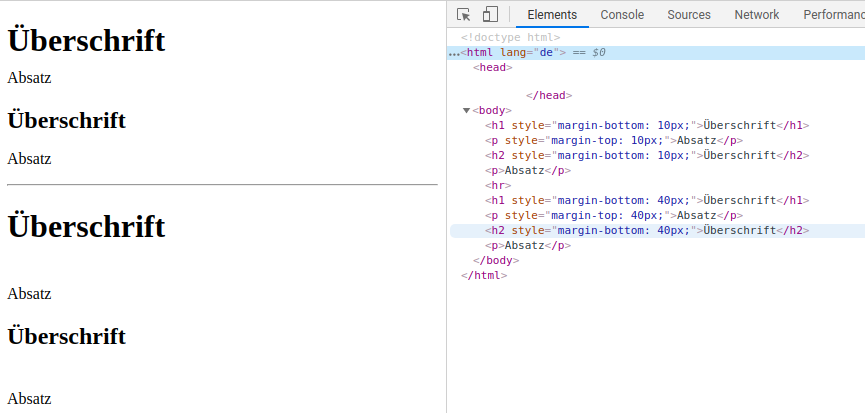

### Padding vs. margin

| Merkmal           | Margin             | Padding                              |
| ----------------- | ------------------ | ------------------------------------ |
| Hintergrundfarbe  | Immer transparent  | Hintergrundfarbe des Elements        |
| Verschmelzen      | Ja                 | Nein                                 |
| Negative Werte    | Erlaubt            | Nicht erlaubt                        |
| Anklickbar        | Nein               | Ja                                   |

## CSS Boxmodel

[CSS Boxmodel](https://developer.mozilla.org/de/docs/Web/CSS/box-sizing)! Die `box-sizing` CSS-Eigenschaft verwendest du, um das Standard CSS Boxmodell zu verändern. Das Boxmodell berechnet  die Breiten und Höhen von Elementen. Nutze diese Eigenschaft dazu, um das Verhalten bestimmter Browser nachzuahmen, die die CSS Boxmodell Spezifikation nicht erwartungsgemäß unterstützen.

- **Border box** Rahmen und Abstände sind Teil der Größe eines Elements!
- **Content box** Rahmen und Abstände sind __nicht__ Teil der Größe eines Elements!

Meine Empfehlung? Setze `box-sizing` auf `border-box` für alles (`*`). Immer. Denk nicht einmal darüber nach! In seltenen Fällen muss etwas `content-box` sein. Das überschreibst du dann. 

### border-box vs. content-box?

Verwenden wir unser Quadrat Beispiel oben. Mit `content-box` beträgt die Gesamtgröße des Elements` 72px * 72px`:

<div class="filename">content-box</div>

```
50px für den Inhalt
2px (x) und 2px (y) für vier 1px-Ränder
20px für 10px rundum Polsterung
= 72px Quadrat
```

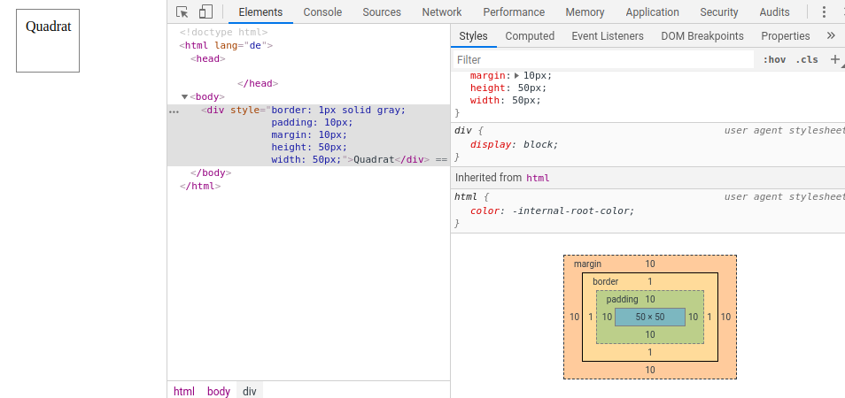

Mit der Option `border-box` beträgt die Gesamtgröße des Elements `50px * 50px`.


<div class="filename">border-box</div>
```
28px für den Inhalt
2px (x) und 2px (y) für vier 1px-Ränder
20px für 10px rundum Polsterung
= 50px Quadrat
```

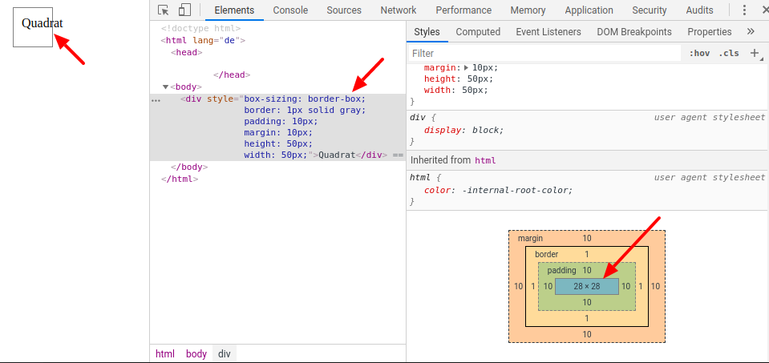

Wenn du einem Element eine Höhe `height` und eine Breite `width` von jeweils 50 Pixel `50px` gibst, erwartest du, dass das Element 50 Pixel hoch und 50 Pixel breit ist, oder? Du rechnest nicht damit, dass es 72 Pixel breit ist. Die Maße sind wichtig, wenn du Layouts erstellst, die in Prozent festgelegt werden.

Wende `border-box` auf __alle__ Elemente wie folgt an:

```css
* {
  box-sizing: border-box;
}
```

## Eigenschaften zusammenfassen

Du siehst im nächsten Beispiel, wie ich `padding: 5px` und `margin: 5px` verwende. Die Eigenschaft `padding` steht für die vier einzelnen Eigenschaften:

```css
/* Eigenschaften zusammenfassen */
div {
  padding: 5px;
}

/* Alle Eigenschaften */
div {
  padding-top: 5px;
  padding-right: 5px;
  padding-bottom: 5px;
  padding-left: 5px;
}
```
- **ein** Wert gilt für alle vier Seiten (`padding: 5px`)
- **zwei** Werte gelten jeweils für vertikal (oben und unten) und horizontal (links und rechts) (`padding: 5px 0`)
- **vier** Werte werden von oben links **im Uhrzeigersinn** angewendet (`padding: 1px 5px 3px 4px`)

Dies gilt sowohl für `padding` und `margin`. Die häufigste Verwendung einer einzelnen Eigenschaft ist, wenn du etwas überschreibst. Zum Beispiel existiert ein Element mit `padding: 5px` und du wünschst dir ausschließlich für `padding-bottom` einen anderen Wert als `5px`.

Die nächsthäufigste Möglichkeit Eigenschaften zusammenzufassen findest du bei der Eigenscahft `border`:

```css
div {
  border: border-width border-style border-color;
}
```

Diese können auch einzeln ausgeschrieben werden.

```css
div {
  border: 1px solid black;
}

/* Can also be written individually */
div {
  border-color: red;
  border-width: 2px;
  border-style: solid;
}
```
Und genau wie `padding` und `margin` kann jede dieser Eigenschaften auf eine spezielle Seite angewendet werden.

```css
div {
  border-bottom-color: green;
  border-bottom-width: 1px;
  border-bottom-style: dashed;
}
```

Wenn du `border: 1px solid black` schreibst, fasst du 12 Eigenschaften zusammen.

## Layouts: Anzeige

Es gibt viele `display`-Eigenschaften ([siehe diese Liste] (https://developer.mozilla.org/de/docs/Web/CSS/display)). Die am häufigsten verwendeten und wichtigsten sind meiner Meinung nach `block`, `inline`, `inline-block`, `flex` und `none`.

Die meisten Elemente sind standardmäßig `block`,` inline` oder `inline-block`. Das Standard-Block-Element `block` ist ein div-Element und das Standard-Inline-Element `inline` ist ein span-Element.

Beispiele:

- **Inline**: `span`, `strong`, `em`, `img`
- **Inline-block**: `button`, `select`, (Chrome: `textarea`, `input`)
- **Block**: `div`, `p`, `nav`, `section`

> Es gibt einige andere spezifische Elemente, wie zum Beispiel das `table`-Elemente mit `table` und `li` mit der Anzeige `list-item`.

#### Inline-Elemente

**Inline** -Elemente basieren auf der Textformatierung: Zum Beispeil `b` oder `strong`, wodurch der Text fett dargestellt wird, oder `i` und `em`, was den Text kursiv ausgibt. Der Inline-Text ist in derselben Zeile - für ein Inline Element beginnt keine neue Zeile. Inline-Elemente sind normalerweise in Blockelementen verschachtelt. Horizontale und vertikale `padding` und `margin` werden wie erwartet angewendet, vertikale Ränder werden überhaupt nicht angewendet, und vertikale `padding` werden von anderen Elementen ignoriert.

<div class="filename">Verhalten von Inline-Elementen</div>

```html
<!doctype html>
<html lang="de">
	<head>
	</head>
	<body>
		<div style="border:solid">Ich bin das 
			<span style="display:inline;padding:20px;margin:20px">
				schöne
			</span> 
		Block-Element.</div>
	</body>
</html>
```
Wie dieses Beispiel im Browser angezeigt wird, siehst du im nächsten Bild.

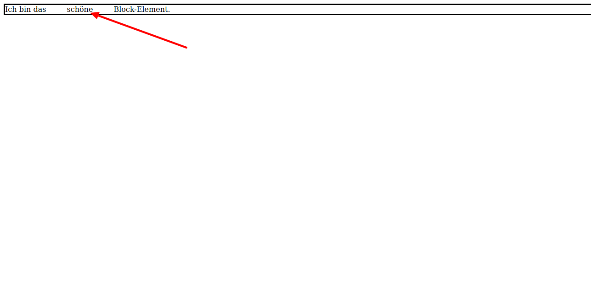

Inline-Elemente werden zur Textformatierung verwendet.

#### Inline-Block-Elemente

**Inline-Block** Elemente verhalten sind wie Inline-Elemente, außer dass sie vertikale und horizontale Abstände und Ränder beachten. Sie werden standardmäßig nebeneinander angezeigt und nicht in einer neuen Zeile..

```html
<!doctype html>
<html lang="de">
	<head>
	</head>
	<body>
		<div style="border:solid">Ich bin das 
			<span style="display:inline-block;padding:20px;margin:20px">
				schöne
			</span> 
		Block-Element.</div>
	</body>
</html>
```
Wie dieses Beispiel im Browser angezeigt wird, siehst du im nächsten Bild.

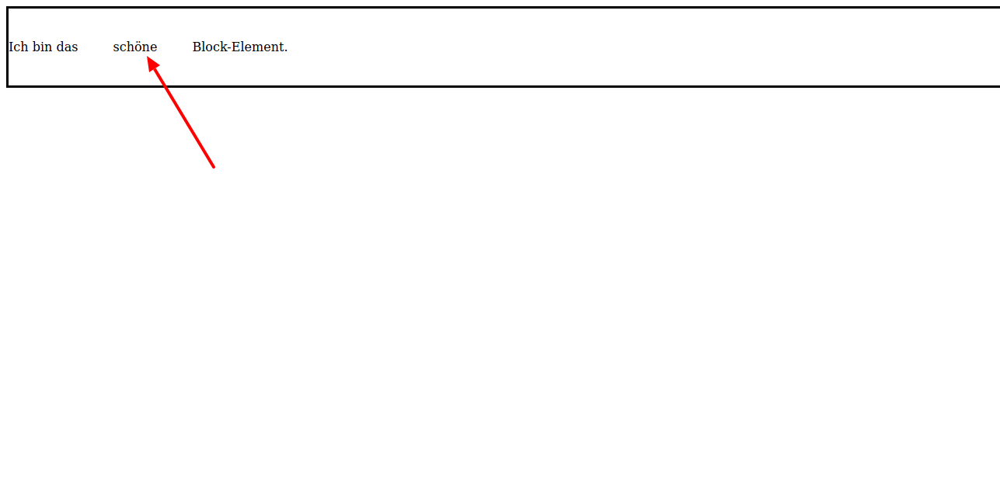

#### Block-Elemente

**Block** Elemente erstrecken sich über die gesamte Breite ihres enthaltenen Elements und werden deshalb immer in einer neuen Zeile eingefügt.

<div class="filename">Verhalten von Block-Elementen</div>

```html
<!doctype html>
<html lang="de">
	<head>
	</head>
	<body>
		<div style="border:solid">Ich bin das 
			<span style="display:block;padding:20px;margin:20px">
				schöne
			</span> 
		Block-Element.</div>
	</body>
</html>
```

Wie dieses Beispiel im Browser angezeigt wird, siehst du im nächsten Bild.

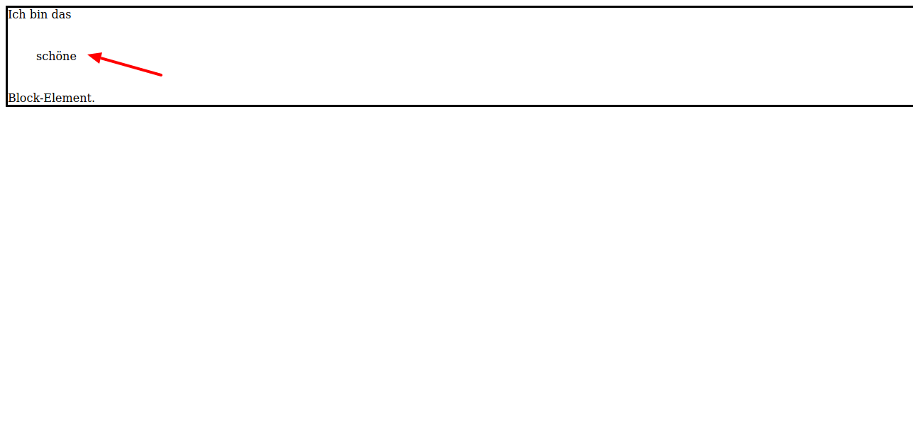

#### None

Ein Element, auf das **none** angewendet wurde, wird nicht angezeigt. 

### Display Reference

| Anzeigeeigenschaft | Verhalten                                                                    |
| ------------------ | ---------------------------------------------------------------------------- |
| `inline`           | für die Textformatierung und wird horizontal nebeneinander angezeigt         |
| `inline-block`     | erscheinen horizontal nebeneinander und beachtet vertikale und horizontale Abstände und Ränder |
| `block`            | erstreckt sich über die gesamte Breite des Containers                        |
| `none`             | wird im Dokument nicht angezeigt                                             |

## Layouts: Positionierung

Die Eigenschaft `position` ist zwar wichtig, verwende sie aber mit Bedacht. Ändere die Eigenschaft `position` von ihrem Standardwert `static` in einen anderen Wert nur für wenige ausgesuchte Situationen. Es gibt drei Eigenschaften, die hauptsächlich verwendet werden: 
- `fixed`, 
- `absolute` und 
- `relative`.  

Ein positioniertes Element wird durch `top`, `left`, `right`, `bottom` und `z-index` beeinflusst.

### Normaler Flow

Wenn Sie die Position eines Elements nicht ändern, bezieht sich alles auf den [normalen Flow](https://developer.mozilla.org/de/docs/Learn/CSS/CSS_layout/Normal_Flow) des Dokuments. Dies bedeutet:

- Blockelemente nehmen die **volle** Breite ihres **Containers** und die Höhe ihres Inhalts ein
- Blocknelemente werden vertikal von oben nach unten nacheinander eingefügt
- Inline-Elemente sind so hoch und breit wie ihr Inhalt
- Die Ränder aller Elemente verschmelzen

### Static

Der Standardzustand von `position` ist` static`. Dies bedeutet, dass dein Element im normalen Flow des Dokuments bleibt. Wenn du drei statische `div` nebeneinander im HTML-Markup schreibst, werden diese untereinander im Browser angezeigt.


```html
<!doctype html>
<html lang="de">
	<head>
		<style>
			div {
				border: 1px solid red;
				padding: 10px;
				margin: 10px;
			}
		</style>
	</head>
	<body>
		<div>Eins</div>
		<div>Zwei</div>
		<div>Drei</div>
	</body>
</html>
```

Wie dieses Beispiel im Browser angezeigt wird, siehst du im nächsten Bild.

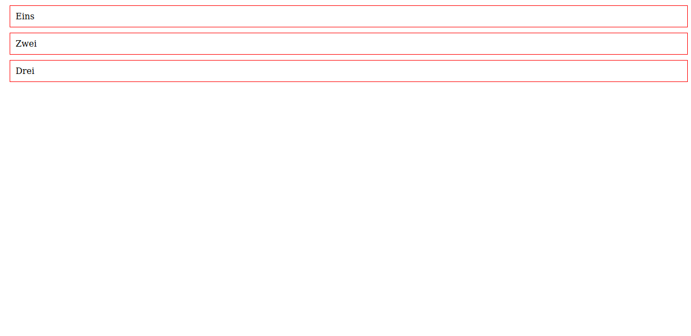

`Statische` Elemente sind nicht positionierbar und werden daher nicht von` top`, `left`,` right`, `bottom` oder` z-index` beeinflusst.

> **Hinweis:** Nur weil Elemente eine statische Position haben, bedeutet dies nicht immer, dass sie untereinander angeezeigt werden. Die `display`-Eigenschaft kann dies mit `inline-block`, `grid`oder `flex` ändern. Sie sind jedoch weiterhin Teil des regulären Dokumentenflusses und andere Elemente erkennen sie.

### Fixed/Fest

Ein festes `fixed` Element ist am einfachsten zu verstehen: Es ist immer sichtbar und entsprechend dem Ansichtsfenster positioniert.

Gebräuchliche Verwendungen der `fixed` Positionierung:

- Ein **Popup-Modal**, das sich in der Mitte des Ansichtsfensters befindet
- Eine Schaltfläche **Zurück nach oben** unten rechts auf dem Bildschirm
- eine Stick-to-Top **Navigationsleiste**


```css
nav {
  position: fixed;
}
```

Ein paar Dinge, die du über `fixed` Elemente wissen solltest:

- Ihre Position auf dem Bildschirm wird durch die Eigenschaften `top`, `left`, `right` und `bottom` bestimmt. `top: 0` bedeutet, dass das Element oben im Ansichtsfenster bleibt, und` top: 10px` bedeutet, dass es mit einem Abstand von `10px` zum oberen Rand im Ansichtsfenster dargestellt wird.
- Andere Elemente sind sich der Existenz eines `fixed` Elements **nicht bewusst**. 
- `fixed` Elemente sind nicht länger Teil des normalen Flusses. 

Das bedeutet, wenn wir unser `nav` ohne andere Eigenschaften auf fixed setzen, wird nicht die gesamte Breite des Ansichtsfensters vergrößert.

```html
<!doctype html>
<html lang="de">
	<head>
		<style>
			div {
				border: 1px solid black;
				padding: 15px;
				margin: 15px;
				background: white;
			}

			nav {
				position: fixed;
				background: gray;
			}		
		</style>
	</head>
	<body>
		<nav>Nav</nav>
		<div>Div</div>
		<div>Div</div>
	</body>
</html>
```

Wie dieses Beispiel im Browser angezeigt wird, siehst du im nächsten Bild.

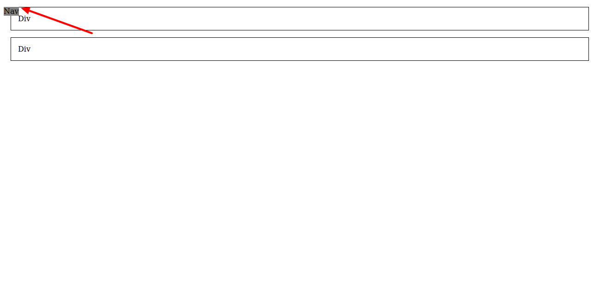

So können wir das `nav`-Element in der vollen Breite links oben im Ansichtsfenster anzeigen.

```css
nav {
  position: fixed;
  top: 0;
  left: 0;
  padding: 20px;
  width: 100%;
  background: gray;
  z-index: 2;
}
```

Wie dieses Beispiel im Browser angezeigt wird, siehst du im nächsten Bild.

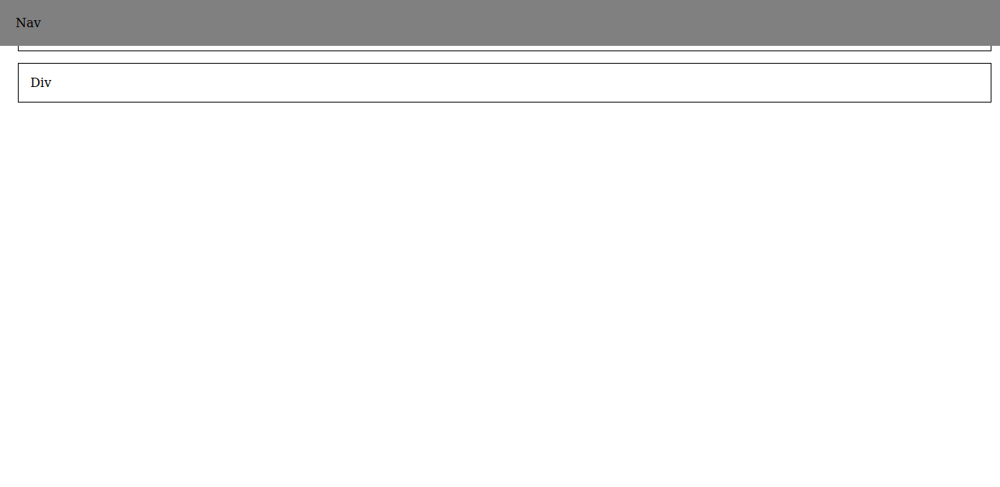

Wir fügen die Eigenschaft `z-index` hinzu, die sich auf die z-Achse des Elements auswirkt. Wir möchten, dass dieses Element immer vollständig sichtbar ist. Deshalb geben wir ihm einen `z-index` größer `0`. Damit stellen wir sicher, dass es über jedem anderen Element in unserem Dokument liegt. Wie wir sehen, gibt es ein letztes Problem: Das `nav` überlappt den Inhalt. Wie schon erwähnt, wissen die Elemente im normalen Flow nichts von einem festen Element. Du hast die Aufgabe, Platz für dieses zu schaffen. Das Hinzufügen eines `margin-bottom` zum `nav`-Element hat keine Auswirkung.

```html
<!doctype html>
<html lang="de">
	<head>
		<style>
			div {
				border: 1px solid black;
				padding: 15px;
				margin: 15px;
				background: white;
			}

			nav {
				position: fixed;
				top: 0;
				left: 0;
				padding: 20px;
				width: 100%;
				background: gray;
				z-index: 2;
			}
			
			.erstesElement{
				margin-top:80px;				
			}
		</style>
	</head>
	<body>
		<nav>Nav</nav>
		<div class="erstesElement">Div</div>
		<div>Div</div>
	</body>
</html>
```

```css
section {
  margin-top: 80px;
}
```

Wie dieses Beispiel im Browser angezeigt wird, siehst du im nächsten Bild.

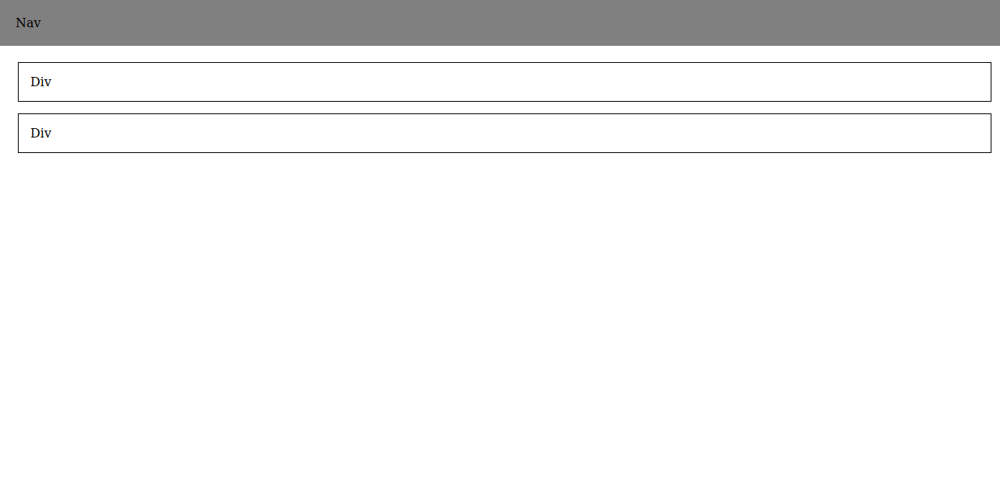

So machen feste Positionierung Sinn, oder?

### Absolut und relativ

`absolute` und `relative` Positionen gehen Hand in Hand. Nimm alles, was du über `fixed` Elemente gelernt hast und wende es auf `absolute` Elemente an. Sie verhalten sich fast genauso: Andere Elemente kennen sich mit „absoluten“ Elementen nicht aus, sie werden von den Richtungseigenschaften und dem `z-index` beeinflusst. Der Unterschied besteht darin, dass sie nicht relativ zum Ansichtsfenster (Browserfenster) positioniert sind, sondern relativ zum nächsten Element, das nicht `static` ist - also ein `fixed`, `absolute`, or `relative` Element.

`relative` Elemente verhalten sich dagegen fast genauso wie `static` „Elemente“ - sie sind Teil des Dokumentflusses, und wenn du `relative` für ein Element festlegst, ändert sich das Erscheinungsbild überhaupt nicht. Der Unterschied ist: Ein `relative` Element kann die Richtungseigenschaften `top`, `left`, `right` und `bottom` verwenden.

Die häufigste Verwendung von `relative` und `absolute` ist jedoch, dass ein `relative` Element als `static` behandelt wird, jedoch als **Ankerpunkt** für ein anderes `absolute` Element.

Ich mache ein Beispiel mit einem `section`-Element (rot), das ein verschachteltes `div` (blau) hat.

```html
<!doctype html>
<html lang="de">
	<head>
		<style>
		</style>
	</head>
	<body>
		<section>
			section
			<div>div</div>
		</section>
	</body>
</html>
```

Wenn keine Positionierung angewendet wird, ist das `div`-Element innerhalb des `section`-Elements.


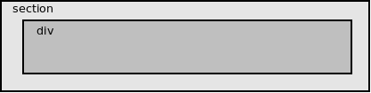

Stelle dir vor, du hasst eine Reihe von Kartenelementen, die unabhängig vom Inhalt `100px` groß sind, und es ist dir wichtig, dass eine Schaltfläche immer an derselben Stelle unten rechts vorhanden ist. Mit `relative` und` absolute` verwendest ist das `div` auf jeder Karte immer am selben Ort.


```css
section {
  position: relative;
  height: 100px;
}

div {
  position: absolute;
  bottom: 15px;
  right: 15px;
}
```

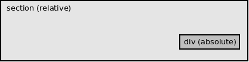

Verwende `relative`, um etwas in einem Element zu verankern. Verwende `absolute` für das zu verankernde Etwas. Eine übliche Verwendung hierfür sind Karten.

Der nachfolgende Programmcode ist ein Beispiel dafür, wie du sicherstellst, das die Schaltflächen in einer Linie liegen obwohl der Inhalt nicht immer die gleiche Größe hat.

```
<!DOCTYPE html>
<html>
<head>
<style>
div.relative {
  position: relative;
  display: inline-block;
  height: 150px;
  width: 30%;
  border: 3px solid #73AD21;
} 
div.absolute1 {
  position: absolute;
  top: 15px;
  left: 15px;
}
div.absolute2 {
  position: absolute;
  bottom: 15px;
  right: 15px;
  border: 3px solid #73AD21;
}
</style>
</head>
<body>
<div class="relative">
  <div class="absolute1"></div>
  <div class="absolute2">Mehr lesen</div>
</div>

<div class="relative">
  <div class="absolute1">Kurze Einleitung</div>
  <div class="absolute2">Mehr lesen</div>
</div>

<div class="relative">
  <div class="absolute1">Eine ganz lange und ausfürhliche Anleitung</div>
  <div class="absolute2">Mehr lesen</div>
</div>
</body>
</html>
```

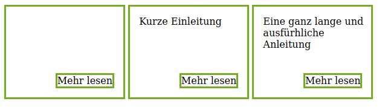

### Zusammenfassung: Positionsreferenz

| Position   | Behavior                                                                            | In Document Flow |
| ---------- | ----------------------------------------------------------------------------------- | ---------------- |
| `static`   | Standardwert. Das Element ist im normalen Fluss. Die Eigenschaften `top`, `right`, `bottom` oder `left` haben keine Auswirkungen.               | Yes              |
| `relative` | Das Element wird vom normalen Fluss aus verschoben und hat keinen Einfluss auf andere Elemente.                            | Yes              |
| `fixed`    | Die Verschiebung orientiert sich am Viewport. Das Element wird aus dem normalen Fluss gelöst und bleibt auch beim Scrollen an seiner fest definierten Position.                                                 | No               |
| `absolute` | Das Element wird aus dem normalen Fluss gelöst und unabhängig verschoben. Dabei können andere Elemente verdeckt werden. | No               |

## Layouts: Flex

Die Anzeigetypen `block`, `inline-block` und `inline` gelten jeweils für das Element selbst. [Flexbox] (https://developer.mozilla.org/de/docs/Web/CSS/CSS_Flexible_Box_Layout) ist anders, da es für Elemente gilt, die in dem Element verschachtelt sind, das `display: flex` als Eigenschaft hat. Ich werde dir hier die grundlegenden Dinge erklären.

### Historisch gewachsen

Zu Beginn waren HTML-Dokumente im Grunde genommen die gleichen wie MS Word-Dokumente: Sie hatten Überschriften, Absätze und gelegentlich Bilder. Dann kamen fortschrittlichere Layouts, dazu nutzte man zunächste Tabellen. Da der Zweck von Tabellen darin bestand (und besteht), Daten anzuzeigen, boten sie nicht genug Funktionen um auf lange Sicht schöne Layouts zu erstellen.

Irgendwann entdeckte jemand, dass er die Eigenschaft `float` verwenden konnte, um Dinge anstelle von Tabellen nach links und rechts auf der Seite zu verschieben. So wurde das Markup ein wenig übersichtlicher und verständlicher, aber dies war ein weiterer Versuch, etwas für einen Zweck zu nutzen, für den es nie entwickelt wurde. CSS-Floats waren (und sind) für das „Floaten“ von Bildern in einem Artikel nach links oder rechts - nicht für das Erstellen eines Layouts.

Heute haben wir Flexbox und CSS-Grid zum Erstellen von Layouts. Wir benötigen floatnicht mehr – außer für den ursprünglichen Zweck.

### Flex-Container erstellen

Wir wissen bereits, dass eine Reihe von Standardblockelementen übereinander angezeigt werden:

<div class="filename">Element</div>

```html
<!DOCTYPE html>
<html>
<head>
<style>
div{
  border: solid;
}
</style>
</head>
<body>
<section>
  <div>div</div>
  <div>div</div>
  <div>div</div>
</section></body>
</html>
```

Das sieht dann so aus:

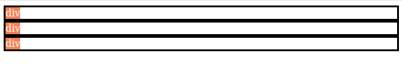

Wie können wir Elemente nbeneinander darstellen? Wir können den Außenbehälter zu einem flexiblen Behälter machen.

<div class="filename">Elements in a default flex container</div>

```html
<!DOCTYPE html>
<html>
<head>
<style>
div{
  border: solid;
}
</style>
</head>
<body>
<section style="display: flex;">
  <div>div</div>
  <div>div</div>
  <div>div</div>
</section></body>
</html>
```
Mit `style="display: flex;"` sieht das Beispiel so aus:

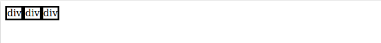

Und so werden alle inneren Elemente horizontal hintereinander gestapelt. Standardmäßig ist ein Flex-Container auf `flex-direction: row` oder „Flex-Richtung: Zeile“ eingestellt. Beachte, dass nur die erste Ebene von Elementen flexible Elemente sind - Elemente, die weiter in ihnen verschachtelt sind, verhalten sich normal. Du kannst `flex-direction: column` oder „Flex-Richtung: Spalte“ nutzen und die Elemente werden untereinander angezeigt.

Ideen für Flex:

- Elemente mühelos vertikal ausrichten
- Gegenstände voneinander trennen oder leicht zusammenfassen
- Erstelle sich wiederholende Gitter

### Ausrichtung: Erstelle eine Navigationsleiste mit Flex

Lasse uns anhand eines praktischen Beispiels demonstrieren, wozu Flex in der Lage ist: eine Navigationsleiste. So soll die Leiste aussehen:

- Markenname auf der linken Seite
- Links auf der rechten Seite
- Alle Artikel vertikal zentriert

<div class="filename">navbar.html</div>

```html
<!DOCTYPE html>
<html>
<head>
<style>
nav {
  background: lightgray;
  height: 80px;
}
</style>
</head>
<body>
<nav>
  <div>Brand name</div>
  <div>
    <a href="#!">Über uns</a>
    <a href="#!">Kontakt</a>
  </div>
</nav>
</body>
</html>
```

So sieht es aus, ohne Rücksicht auf das angewendete Layout.


Wir werden die Navigationsleiste flexibel mache, so dass der Markenname und die Navigationslinks horizontal ausgerichtet sind. Dazu ergänzen wir:

```css
nav {
  display: flex;
}
```

Das vollständige Beispiel sieht so aus:

```html
<!DOCTYPE html>
<html>
<head>
<style>
nav {
  background: lightgray;
  height: 80px;
  display: flex;
}
</style>
</head>
<body>
<nav>
  <div>Brand name</div>
  <div>
    <a href="#!">Über uns</a>
    <a href="#!">Kontakt</a>
  </div>
</nav>
</body>
</html>
```


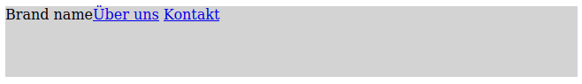

Jetzt wollen wir, dass alles vertikal ausgerichtet ist. Mit `align-items: center` können wir Elemente in einem flexiblen Container vertikal ausrichten.

```css
nav {
  display: flex;
  align-items: center;
}
```

```html
<!DOCTYPE html>
<html>
<head>
<style>
nav {
  background: lightgray;
  height: 80px;
  display: flex;
}
</style>
</head>
<body>
<nav>
  <div>Brand name</div>
  <div>
    <a href="#!">Über uns</a>
    <a href="#!">Kontakt</a>
  </div>
</nav>
</body>
</html>
```

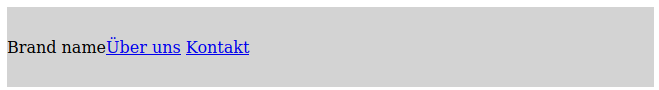

Jetzt möchten wir, dass sich die Marke und die Links an den entgegengesetzten Enden der Navigationsleiste befinden. Mit `justify-content: space-between` können wir festlegen, dass die Elemente im Flex-Container so weit wie möglich voneinander entfernt sind.

```css
nav {
  display: flex;
  align-items: center;
  justify-content: space-between;
}
```

```html
<!DOCTYPE html>
<html>
<head>
<style>
nav {
  background: lightgray;
  height: 80px;
  display: flex;
  align-items: center;
  justify-content: space-between;
}
</style>
</head>
<body>
<nav>
  <div>Brand name</div>
  <div>
    <a href="#!">Über uns</a>
    <a href="#!">Kontakt</a>
  </div>
</nav>
</body>
</html>
```

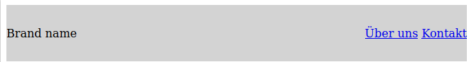

Dann füge ein wenig `padding` hinzu und du hast eine akzeptable Navigationsleiste.


Ich glaube, ohne etwas anderes über Flex zu wissen, kommt man mit genau diesen Eigenschaften schon weit.

- `align-items` bezieht sich auf die **vertikale Ausrichtung**: `flex-start` wäre die Oberseite, `flex-end` wäre die Unterseite und `center` ist vertikal ausgerichtet.
- `justify-content` oder „Inhalt ausrichten“ bezieht sich auf den **horizontalen Abstand**: `start` sind alle Elemente links, `end` sind alle Elemente rechts, `center` ist alles in der Mitte und bei `space-between` hat alles den gleichen Abstand.

> **Hinweis:** mit Flex ist es möglich die Reihenfolge von Zeilen und Spalten umzukehren. Zusätzlich zu `flex-direction: row` und `flex-direction: column` gibt es `row-reverse` und `column-reverse`. Dies kehrt die Reihenfolge von `align-items` und `justify-content` ebenfalls umkehren. Zum Beispiel wäre `justify-content: start` rechts von einem `row-reverse` flex container.

**Weiterführende Informationen**: [Flexbox bei Selfhtml](https://wiki.selfhtml.org/wiki/CSS/Tutorials/Flexbox) ist ein Tutorial zum Erlernen von Flexbox.

### Flex Container Reference

| Property          | Values                                                                    |
| ----------------- | ------------------------------------------------------------------------- |
| `flex-direction`  | `row`, `column`, `row-reverse`, `column-reverse`                          |
| `flex-wrap`       | `wrap`, `nowrap`                                                          |
| `align-items`     | `flex-start`, `flex-end`, `center`, `stretch`, `baseline`                 |
| `justify-content` | `start`, `center`, `end`, `space-between`, `space-around`, `space-evenly` |

### Wrapping: Erstelle ein sich wiederholendes Raster

In einer Galerie befinden sich häufig mehrere Karten oder Bilder in einem sich wiederholenden Raster. Standardmäßig werden bei einem flexiblen Container die horizontalen Elemente weiterhin horizontal fortgesetzt. Es wird keine neue Zeile begonnen.

```html
<!DOCTYPE html>
<html>
<head>
<style>
.flex-container {
  display: flex;
}
div {
  border:solid;
}
</style>
</head>
<body>
<section class="flex-container">
  <div>div</div>
  <div>div</div>
  <div>div</div>
  <div>div</div>
  <div>div</div>
  <div>div</div>
  <div>div</div>
  <div>div</div>
  <div>div</div>
  ...
</section>
</body>
```

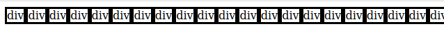

Mit `flex-wrap` können wir das Raster in beliebig viele Zeilen wiederholen lassen.

```css
.flex-container {
  display: flex;
  flex-wrap: wrap;
}
```

```html
<!DOCTYPE html>
<html>
<head>
<style>
.flex-container {
  display: flex;
  flex-wrap: wrap;
}
div {
  border:solid;
}
</style>
</head>
<body>
<section class="flex-container">
  <div>div</div>
  <div>div</div>
  <div>div</div>
  <div>div</div>
  <div>div</div>  
  <div>div</div>
  <div>div</div>
  ...
</section>
</body>
</html>
```

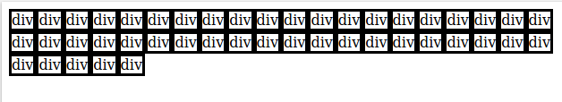

Das ist toll. Aber warte ... es funktioniert nur, wenn die Elemente keinen oder den gleichen Inhalt haben. Was ist, wenn ich sie mit unterschiedlichem Text fülle?

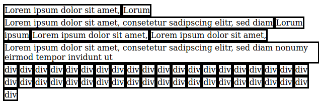

Nun, das scheint ziemlich nutzlos zu sein. Aber mit ein bisschen Flexmagie können wir es zurück in ein Gitter oder Raster verwandeln:

```css
div {
  flex: 1;
}
```
Das vollständige Beispiel sieht so aus:

```html
<!DOCTYPE html>
<html>
<head>
<style>
.flex-container {
  display: flex;
  flex-wrap: wrap;
}
div {
  border:solid;
  flex: 1;
}
</style>
</head>
<body>
<section class="flex-container">
  <div>Lorem ipsum dolor sit amet,</div>
  <div>Lorum</div>
  <div>Lorem ipsum dolor sit amet, consetetur sadipscing elitr, sed diam</div>
  <div>Lorum</div>
  <div>ipsum</div>
  <div>Lorem ipsum dolor sit amet,</div>
  <div>Lorem ipsum dolor sit amet,</div>
  <div>Lorem ipsum dolor sit amet, consetetur sadipscing elitr, sed diam nonumy eirmod tempor invidunt ut</div>
  <div>div</div>  
  <div>div</div>
  <div>div</div>
  ...
</section>
</body>
```

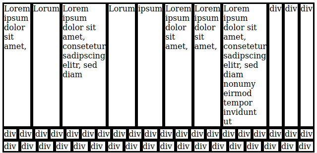

Was macht `flex: 1`? Es weist alle flexiblen Elemente in einem Container an, automatisch die gleiche Höhe und Breite zu haben, sofern sie alle angewendet wurden. `flex` ist eine weitere Abkürzung für drei Eigenschaften:` flex-grow`, `flex-shrink` und` flex-basis`.


```css
.element {
  flex: 1;
}

/* ist das gleiche wie */

.element {
  flex-grow: 1;
  flex-shrink: 1;
  flex-basis: 0%;
}

/* Flex-Kurzschreibweise */
.element {
  flex: flex-grow flex-shrink flex-basis;
}
```
Zwei Flex-Elemente, die auf `flex: 1` eingestellt sind, entsprechen jeweils 50% der Breite des Containers. Drei machen jeweils 33,3333% der Breite des Containers aus, und so weiter.

Aber das ist immer noch irgendwie zufällig. Füge weitere Elemente hinzu und setze den Zeilenumbruch auf die nächste Zeile, wenn `flex-wrap` eingestellt ist. Dann nimmt das Element, das umgebrochen wird, jetzt 100% der Zeile ein.

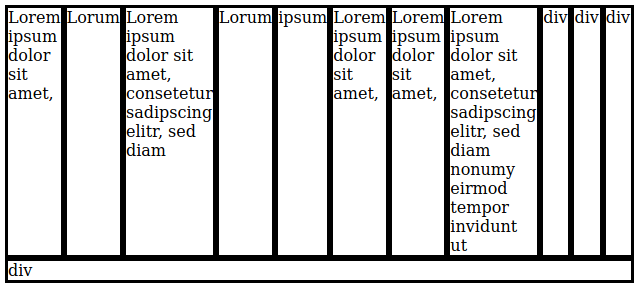

Was ist, wenn jedes Element immer 1/3 des verfügbaren horizontalen Raums einnehmen soll, unabhängig davon, wie viele Flex-Elemente vorhanden sind und welchen Inhalt sie enthalten? Sie können die `flex-basis` nur auf die gewünschte Breite einstellen.


```css
div {
  flex: 0 0 33.3333%;
}
```
Erinnerst du dich an das Box-Modell von weiter oben? Wenn du padding für deine Flex-Elemente nutzt, musst du `box-sizing: border-box` verwenden, damit der Prozentsatz korrekt berechnet wird. Wenn dies erledigt ist, wird jedes Flex-Element korrekt auf die richtige Breite von 33,33333% des Bildschirms berechnet.

Es gibt jedoch noch eine weitere Überlegung: Wenn du Abstände in deinem Raster haben möchtest, verwenden du Ränder, um die einzelnen Elemente zu trennen. Da die Ränder separat berechnet werden, musst du die äußeren Ränder von der `flex-basis` abziehen. In diesem Beispiel gibt es einen zusätzlichen `10px` Rand auf beiden Seiten, also werden wir` 20px` subtrahieren.

```css
div {
  padding: 15px;
  margin: 10px;
  box-sizing: border-box;
  flex: 0 0 calc(33.3333% - 20px);
}
```

Das vollständige Beispiel:

```html
<!DOCTYPE html>
<html>
<head>
<style>
.flex-container {
  display: flex;
  flex-wrap: wrap;
}
div {
  border:solid;
  box-sizing: border-box;
  flex: 1;
  padding: 15px;
  margin: 10px;
  flex: 0 0 calc(33.3333% - 20px);  
}
</style>
</head>
<body>
<section class="flex-container">
  <div>Lorem ipsum dolor sit amet,</div>
  <div>Lorum</div>
  <div>Lorem ipsum dolor sit amet, consetetur sadipscing elitr, sed diam</div>
  <div>Lorum</div>
  <div>ipsum</div>
  <div>Lorem ipsum dolor sit amet,</div>
  <div>Lorem ipsum dolor sit amet,</div>
  <div>Lorem ipsum dolor sit amet, consetetur sadipscing elitr, sed diam nonumy eirmod tempor invidunt ut</div>
  <div>div</div>  
  <div>div</div>
  <div>div</div>
  <div>div</div>
</section>
</body>
</html>
```

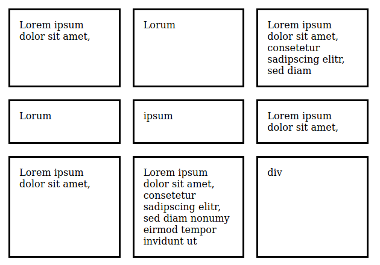

Du kannst einfache Gitter oder Raster erstellen, indem du entweder `flex-basis` (für Beispiel "25%" und "75%") oder die `flex-grow`/`flex-shrink`-Kombinationen einstellst (`flex: 1` auf einem Element und` flex: 2` auf einem anderen Element würden zu einem Split von 33,3% / 66,6% führen).

You can easily make simple grids by either setting the `flex-basis` (Setze beispielsweise eins auf "25%" und eins auf 75%) or with varying `flex-grow`/`flex-shrink` combinations (`flex: 1` on one element and `flex: 2` on another element would result in a `33.3-%` / `66.6-%` split, respectively).

### Flex Property Reference

| Property      | Description                                                                  |
| ------------- | ---------------------------------------------------------------------------- |
| `flex-grow`   | Legt fest, wie stark ein flexibles Element wachsen soll, wenn Platz verfügbar ist.      |
| `flex-shrink` | Legt fest, um wie viel ein flexibles Element verkleinert werden soll, wenn kein Platz verfügbar ist. |
| `flex-basis`  | Definiert die Anfangsgröße des Flex-Elements                                            |

Schließlich gibt es noch die Eigenschaft `order`, in der du die Reihenfolge der flexiblen Elemente ändern kannst.


## Responsive: Media Queries

Use [media queries](https://developer.mozilla.org/en-US/docs/Web/CSS/Media_Queries/Using_media_queries) to make your websites responsive, or adaptive to multiple screen sizes. With media queries, you tell CSS to only apply on screen sizes _below_ a certain width (with `max-width` queries) or _above_ a certain width (with `min-width` queries).

Verwende [Media Queries](https://developer.mozilla.org/de/docs/Web/CSS/Media_Queries/Using_media_queries), um deine Websites anpassungsfähig oder an mehrere Bildschirmgrößen anpassbar zu machen. Mit Media Queries weisen du CSS an, nur auf Bildschirmgrößen _unter_ einer bestimmten Breite (bei Abfragen mit maximaler Breite) oder _über_ einer bestimmten Breite (bei Abfragen mit minimaler Breite) aktiv zu sein.

```css
@media screen and (min-width: 800px) {
  /* Wendet Stile auf alle Gerätebildschirmgrößen über 800 Pixel Breite an. */
}
```

```css
@media screen and (max-width: 800px) {
  /* Wendet Stile auf alle Gerätebildschirmgrößen unter 800 Pixel Breite an */
}
```

Wenn du jemals den Begriff **mobile-first** gehört hast, bezieht sich dies auf das Erstellen einer Website für mobile first und das Erstellen von Media Queries mit minimaler Breite, wenn die Bildschirmgröße zunimmt.

```css
/* Mobile First Styles findest du hier */

@media screen and (min-width: 800px) {
  /* Desktop-Stile findest du hier */
}
```

Eine Website als erstes für kleine Bildschirmbreiten zu gestalten und nach Bedarf zu skalieren ist unkomplizierter, als zu versuchen, eine Website zu erstellen, die für den Desktop optimiert ist und diese dann später für kleine Bildschirmgrößen abzuändern.

Alle CSS-Frameworks behandeln diese unterschiedlichen Abfragen unterschiedlich. Wenn wir uns [Bootstraps reaktionsfähige Haltepunkte](https://getbootstrap.com/docs/4.0/layout/overview/#responsive-breakpoints) ansehen, sehen wir, dass sie fünf Haltepunkte/Breakpoints haben. Persönlich stelle ich fest, dass ein Haltepunkt (kein Haltepunkt für Mobilgeräte und einer für Desktops) oder zwei Haltepunkte (kein Haltepunkt für Mobilgeräte, einer für Tablets und einer für Desktops) die meisten meiner Reaktionsanforderungen erfüllen.

Beachten Sie, dass `@media` in einem Selektor verschachtelt sein kann. In diesem Beispiel hat ein `h1` standardmäßig eine Schriftgröße von `25px`, bei größeren Bildschirmgrößen `30px`.

```css
h1 {
  font-size: 25px;

  @media screen and (min-width: 1200px) {
    font-size: 30px;
  }
}
```

## Andere Überlegungen

Dieser Artikel wird unglaublich lang und es gibt immer noch eine Menge Themen, die ich nicht behandelt habe. Hier sind ein paar schnelle Antworten und zusätzliche Ressourcen-Links zu den Lücken in meinem Versuch, alles auf einmal abzudecken.

### Wann sollte ich IDs, Klassen oder Tags formatieren?

Meine Regeln lauten wie folgt: IDs werden ausschließlich für JavaScript-Zwecke verwendet. Um ein einzelnes Element einfach mit JavaScript anzusprechen, können Sie eine ID verwenden und wissen, dass diese keinen Einfluss auf den Stil hat. Wenn Sie möchten, können Sie auch Inhaltsabschnitte "umfassen", indem Sie alles in eine ID verschachteln, obwohl ich das persönlich nicht tue.

Bei Tags sollten _niemals_ Elemente wie `main`,` article`, `div`,` section`, `aside` usw. formatiert werden. Sie sollten sich immer sicher sein, dass diese Elemente nicht formatiert werden und nur die Art des Inhalts angeben, den sie enthalten. Wenn Sie ihnen Stil hinzufügen möchten, erstellen Sie Klassen wie `.container`. Normalerweise gebe ich `h1` bis `h5`, `p`, `ul`, `ol`, `li`, `a` und `table` ein Standard-Styling.

Für die meisten anderen Stile verwende ich Klassen. Versuche, Klassen "semantisch" zu machen, indem Sie beschreiben, was sie sind, nicht was sie tun. Zum Beispiel wäre eine Klasse namens `.app-sidebar` akzeptabel, aber `.bg-white`, `.blue-border`, `.large-text` zu haben, wird letztendlich schwierig zu pflegen. 

## 

Ich hoffe, dies war für dich eine hilfreiche Einführung in CSS.  

Das Lesen von Tutorials ist der kleinste Teil beim Lernen. Übung macht den CSS-Meiser.

Sieh dir Designs von Websites an, die dir gefallen. Baue diese nach, ohne dir den Quellcode anzusehen.

Wenn du mit CSS vertraut bist, ist es viel meiner Meinung nach einfacher, weiterführende Themen wie 
- CSS Preprocessing 
- Browserunterstützung
- Strukturierung

anzusehen.
