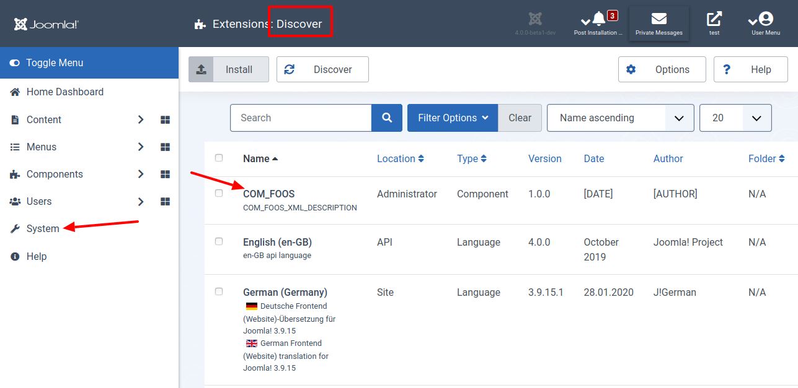

Wir fangen mit den Grundlagen an. Dazu erstellen wir die View im Administrationsbereich rudimentär. Am Ende dieses Textes weißt du, wie du einen Menüpunkt im Menü des Administrationsbereichs einfügst. Über den Menüeintrag öffnest du die Ansicht zu deiner Komponente. Sei nicht enttäuscht: Diese enthält bisher nichts weiter als einen kurzen Text. Du hast eine Grundlage für die weiteren Schritte. 

## Teste deine Joomla-Komponente

1. Installiere am Ende deine Komponente in Joomla! Version 4, um sie zu testen. Am Anfang ist das Einfachste, die Dateien manuell an Ort und Stelle zu kopieren:

Kopiere die Dateien im `administrator` Ordner in den `administrator` Ordner deiner Joomla! 4 Installation.  
Kopiere die Dateien im `components` Ordner in den `components` Ordner deiner Joomla! 4 Installation.  
Kopiere die Dateien im `media` Ordner in den `media` Ordner deiner Joomla! 4 Installation. 

2. Öffne das Menü `System | Install | Discover`. Hier siehst du einen Eintrag zu deiner eben kopierten Komponente. Wähle diese aus und klicke auf die Schaltfläche `Install`.

3. Wenn alle funktioniert siehst nach der Installation diese Anzeigen vor dir.

4. Teste als Nächstes, ob du die Ansicht für deine Komponente fehlerfrei angezeigt bekommst.

Bis hierhin war das kein Hexenwerk. Dafür haben wir aber eine solide Grundlage für die weiteren Schritte. 

## Geänderte Dateien

### Übersicht

      

    

        Files changed (9)
        <a class="d2h-file-switch d2h-hide">hide</a>
        <a class="d2h-file-switch d2h-show">show</a>
    

    <ol class="d2h-file-list">
    <li class="d2h-file-list-line">
    
      <svg aria-hidden="true" class="d2h-icon d2h-added" height="16" title="added" version="1.1" viewBox="0 0 14 16"
           width="14">
          <path d="M13 1H1C0.45 1 0 1.45 0 2v12c0 0.55 0.45 1 1 1h12c0.55 0 1-0.45 1-1V2c0-0.55-0.45-1-1-1z m0 13H1V2h12v12zM6 9H3V7h3V4h2v3h3v2H8v3H6V9z"></path>
      </svg>      <a href="#d2h-863218" class="d2h-file-name">src/administrator/components/com_foos/foos.xml</a>
      
          +33
          -0
      
    
</li>
<li class="d2h-file-list-line">
    
      <svg aria-hidden="true" class="d2h-icon d2h-added" height="16" title="added" version="1.1" viewBox="0 0 14 16"
           width="14">
          <path d="M13 1H1C0.45 1 0 1.45 0 2v12c0 0.55 0.45 1 1 1h12c0.55 0 1-0.45 1-1V2c0-0.55-0.45-1-1-1z m0 13H1V2h12v12zM6 9H3V7h3V4h2v3h3v2H8v3H6V9z"></path>
      </svg>      <a href="#d2h-734669" class="d2h-file-name">src/administrator/components/com_foos/script.php</a>
      
          +149
          -0
      
    
</li>
<li class="d2h-file-list-line">
    
      <svg aria-hidden="true" class="d2h-icon d2h-added" height="16" title="added" version="1.1" viewBox="0 0 14 16"
           width="14">
          <path d="M13 1H1C0.45 1 0 1.45 0 2v12c0 0.55 0.45 1 1 1h12c0.55 0 1-0.45 1-1V2c0-0.55-0.45-1-1-1z m0 13H1V2h12v12zM6 9H3V7h3V4h2v3h3v2H8v3H6V9z"></path>
      </svg>      <a href="#d2h-591404" class="d2h-file-name">src/administrator/components/com_foos/services/provider.php</a>
      
          +57
          -0
      
    
</li>
<li class="d2h-file-list-line">
    
      <svg aria-hidden="true" class="d2h-icon d2h-added" height="16" title="added" version="1.1" viewBox="0 0 14 16"
           width="14">
          <path d="M13 1H1C0.45 1 0 1.45 0 2v12c0 0.55 0.45 1 1 1h12c0.55 0 1-0.45 1-1V2c0-0.55-0.45-1-1-1z m0 13H1V2h12v12zM6 9H3V7h3V4h2v3h3v2H8v3H6V9z"></path>
      </svg>      <a href="#d2h-496744" class="d2h-file-name">src/administrator/components/com_foos/src/Controller/DisplayController.php</a>
      
          +47
          -0
      
    
</li>
<li class="d2h-file-list-line">
    
      <svg aria-hidden="true" class="d2h-icon d2h-added" height="16" title="added" version="1.1" viewBox="0 0 14 16"
           width="14">
          <path d="M13 1H1C0.45 1 0 1.45 0 2v12c0 0.55 0.45 1 1 1h12c0.55 0 1-0.45 1-1V2c0-0.55-0.45-1-1-1z m0 13H1V2h12v12zM6 9H3V7h3V4h2v3h3v2H8v3H6V9z"></path>
      </svg>      <a href="#d2h-640935" class="d2h-file-name">src/administrator/components/com_foos/src/Extension/FoosComponent.php</a>
      
          +49
          -0
      
    
</li>
<li class="d2h-file-list-line">
    
      <svg aria-hidden="true" class="d2h-icon d2h-added" height="16" title="added" version="1.1" viewBox="0 0 14 16"
           width="14">
          <path d="M13 1H1C0.45 1 0 1.45 0 2v12c0 0.55 0.45 1 1 1h12c0.55 0 1-0.45 1-1V2c0-0.55-0.45-1-1-1z m0 13H1V2h12v12zM6 9H3V7h3V4h2v3h3v2H8v3H6V9z"></path>
      </svg>      <a href="#d2h-125543" class="d2h-file-name">src/administrator/components/com_foos/src/Service/HTML/AdministratorService.php</a>
      
          +21
          -0
      
    
</li>
<li class="d2h-file-list-line">
    
      <svg aria-hidden="true" class="d2h-icon d2h-added" height="16" title="added" version="1.1" viewBox="0 0 14 16"
           width="14">
          <path d="M13 1H1C0.45 1 0 1.45 0 2v12c0 0.55 0.45 1 1 1h12c0.55 0 1-0.45 1-1V2c0-0.55-0.45-1-1-1z m0 13H1V2h12v12zM6 9H3V7h3V4h2v3h3v2H8v3H6V9z"></path>
      </svg>      <a href="#d2h-529131" class="d2h-file-name">src/administrator/components/com_foos/src/View/Foos/HtmlView.php</a>
      
          +36
          -0
      
    
</li>
<li class="d2h-file-list-line">
    
      <svg aria-hidden="true" class="d2h-icon d2h-added" height="16" title="added" version="1.1" viewBox="0 0 14 16"
           width="14">
          <path d="M13 1H1C0.45 1 0 1.45 0 2v12c0 0.55 0.45 1 1 1h12c0.55 0 1-0.45 1-1V2c0-0.55-0.45-1-1-1z m0 13H1V2h12v12zM6 9H3V7h3V4h2v3h3v2H8v3H6V9z"></path>
      </svg>      <a href="#d2h-900341" class="d2h-file-name">src/administrator/components/com_foos/tmpl/foos/default.php</a>
      
          +11
          -0
      
    
</li>
<li class="d2h-file-list-line">
    
      <svg aria-hidden="true" class="d2h-icon d2h-added" height="16" title="added" version="1.1" viewBox="0 0 14 16"
           width="14">
          <path d="M13 1H1C0.45 1 0 1.45 0 2v12c0 0.55 0.45 1 1 1h12c0.55 0 1-0.45 1-1V2c0-0.55-0.45-1-1-1z m0 13H1V2h12v12zM6 9H3V7h3V4h2v3h3v2H8v3H6V9z"></path>
      </svg>      <a href="#d2h-792707" class="d2h-file-name">src/components/com_foos/index.html</a>
      
          +1
          -0
      
    
</li>
    </ol>

### Die Dateien einzeln betachtet

    

    

    
    <svg aria-hidden="true" class="d2h-icon" height="16" version="1.1" viewBox="0 0 12 16" width="12">
        <path d="M6 5H2v-1h4v1zM2 8h7v-1H2v1z m0 2h7v-1H2v1z m0 2h7v-1H2v1z m10-7.5v9.5c0 0.55-0.45 1-1 1H1c-0.55 0-1-0.45-1-1V2c0-0.55 0.45-1 1-1h7.5l3.5 3.5z m-1 0.5L8 2H1v12h10V5z"></path>
    </svg>    src/administrator/components/com_foos/foos.xml
    ADDED

        

            <table class="d2h-diff-table">
                <tbody class="d2h-diff-tbody">
                <tr>
    <td class="d2h-code-linenumber d2h-info"></td>
    <td class="d2h-info">
        
@@ -0,0 +1,33 @@

    </td>
</tr><tr>
    <td class="d2h-code-linenumber d2h-ins">
      

1

    </td>
    <td class="d2h-ins">
        

            +
            &lt;?xml version=&quot;1.0&quot; encoding=&quot;utf-8&quot; ?&gt;
        

    </td>
</tr><tr>
    <td class="d2h-code-linenumber d2h-ins">
      

2

    </td>
    <td class="d2h-ins">
        

            +
            &lt;extension type=&quot;component&quot; method=&quot;upgrade&quot;&gt;
        

    </td>
</tr><tr>
    <td class="d2h-code-linenumber d2h-ins">
      

3

    </td>
    <td class="d2h-ins">
        

            +
            	&lt;name&gt;COM_FOOS&lt;&#x2F;name&gt;
        

    </td>
</tr><tr>
    <td class="d2h-code-linenumber d2h-ins">
      

4

    </td>
    <td class="d2h-ins">
        

            +
            	&lt;creationDate&gt;[DATE]&lt;&#x2F;creationDate&gt;
        

    </td>
</tr><tr>
    <td class="d2h-code-linenumber d2h-ins">
      

5

    </td>
    <td class="d2h-ins">
        

            +
            	&lt;author&gt;[AUTHOR]&lt;&#x2F;author&gt;
        

    </td>
</tr><tr>
    <td class="d2h-code-linenumber d2h-ins">
      

6

    </td>
    <td class="d2h-ins">
        

            +
            	&lt;authorEmail&gt;[AUTHOR_EMAIL]&lt;&#x2F;authorEmail&gt;
        

    </td>
</tr><tr>
    <td class="d2h-code-linenumber d2h-ins">
      

7

    </td>
    <td class="d2h-ins">
        

            +
            	&lt;authorUrl&gt;[AUTHOR_URL]&lt;&#x2F;authorUrl&gt;
        

    </td>
</tr><tr>
    <td class="d2h-code-linenumber d2h-ins">
      

8

    </td>
    <td class="d2h-ins">
        

            +
            	&lt;copyright&gt;[COPYRIGHT]&lt;&#x2F;copyright&gt;
        

    </td>
</tr><tr>
    <td class="d2h-code-linenumber d2h-ins">
      

9

    </td>
    <td class="d2h-ins">
        

            +
            	&lt;license&gt;GNU General Public License version 2 or later;&lt;&#x2F;license&gt;
        

    </td>
</tr><tr>
    <td class="d2h-code-linenumber d2h-ins">
      

10

    </td>
    <td class="d2h-ins">
        

            +
            	&lt;version&gt;1.0.0&lt;&#x2F;version&gt;
        

    </td>
</tr><tr>
    <td class="d2h-code-linenumber d2h-ins">
      

11

    </td>
    <td class="d2h-ins">
        

            +
            	&lt;description&gt;COM_FOOS_XML_DESCRIPTION&lt;&#x2F;description&gt;
        

    </td>
</tr><tr>
    <td class="d2h-code-linenumber d2h-ins">
      

12

    </td>
    <td class="d2h-ins">
        

            +
            	&lt;namespace path=&quot;src&quot;&gt;Joomla\Component\Foos&lt;&#x2F;namespace&gt;
        

    </td>
</tr><tr>
    <td class="d2h-code-linenumber d2h-ins">
      

13

    </td>
    <td class="d2h-ins">
        

            +
            	&lt;scriptfile&gt;script.php&lt;&#x2F;scriptfile&gt;
        

    </td>
</tr><tr>
    <td class="d2h-code-linenumber d2h-ins">
      

14

    </td>
    <td class="d2h-ins">
        

            +
            	&lt;!-- Back-end files --&gt;
        

    </td>
</tr><tr>
    <td class="d2h-code-linenumber d2h-ins">
      

15

    </td>
    <td class="d2h-ins">
        

            +
            	&lt;administration&gt;
        

    </td>
</tr><tr>
    <td class="d2h-code-linenumber d2h-ins">
      

16

    </td>
    <td class="d2h-ins">
        

            +
            		&lt;!-- Menu entries --&gt;
        

    </td>
</tr><tr>
    <td class="d2h-code-linenumber d2h-ins">
      

17

    </td>
    <td class="d2h-ins">
        

            +
            		&lt;menu view=&quot;foos&quot;&gt;COM_FOOS&lt;&#x2F;menu&gt;
        

    </td>
</tr><tr>
    <td class="d2h-code-linenumber d2h-ins">
      

18

    </td>
    <td class="d2h-ins">
        

            +
            		&lt;submenu&gt;
        

    </td>
</tr><tr>
    <td class="d2h-code-linenumber d2h-ins">
      

19

    </td>
    <td class="d2h-ins">
        

            +
            			&lt;menu link=&quot;option=com_foos&quot;&gt;COM_FOOS&lt;&#x2F;menu&gt;
        

    </td>
</tr><tr>
    <td class="d2h-code-linenumber d2h-ins">
      

20

    </td>
    <td class="d2h-ins">
        

            +
            		&lt;&#x2F;submenu&gt;
        

    </td>
</tr><tr>
    <td class="d2h-code-linenumber d2h-ins">
      

21

    </td>
    <td class="d2h-ins">
        

            +
            		&lt;files folder=&quot;administrator&#x2F;components&#x2F;com_foos&quot;&gt;
        

    </td>
</tr><tr>
    <td class="d2h-code-linenumber d2h-ins">
      

22

    </td>
    <td class="d2h-ins">
        

            +
            			&lt;filename&gt;foos.xml&lt;&#x2F;filename&gt;
        

    </td>
</tr><tr>
    <td class="d2h-code-linenumber d2h-ins">
      

23

    </td>
    <td class="d2h-ins">
        

            +
            			&lt;folder&gt;services&lt;&#x2F;folder&gt;
        

    </td>
</tr><tr>
    <td class="d2h-code-linenumber d2h-ins">
      

24

    </td>
    <td class="d2h-ins">
        

            +
            			&lt;folder&gt;src&lt;&#x2F;folder&gt;
        

    </td>
</tr><tr>
    <td class="d2h-code-linenumber d2h-ins">
      

25

    </td>
    <td class="d2h-ins">
        

            +
            			&lt;folder&gt;tmpl&lt;&#x2F;folder&gt;
        

    </td>
</tr><tr>
    <td class="d2h-code-linenumber d2h-ins">
      

26

    </td>
    <td class="d2h-ins">
        

            +
            		&lt;&#x2F;files&gt;
        

    </td>
</tr><tr>
    <td class="d2h-code-linenumber d2h-ins">
      

27

    </td>
    <td class="d2h-ins">
        

            +
            	&lt;&#x2F;administration&gt;
        

    </td>
</tr><tr>
    <td class="d2h-code-linenumber d2h-ins">
      

28

    </td>
    <td class="d2h-ins">
        

            +
            	&lt;changelogurl&gt;https:&#x2F;&#x2F;raw.githubusercontent.com&#x2F;astridx&#x2F;boilerplate&#x2F;tutorial&#x2F;changelog.xml&lt;&#x2F;changelogurl&gt;
        

    </td>
</tr><tr>
    <td class="d2h-code-linenumber d2h-ins">
      

29

    </td>
    <td class="d2h-ins">
        

            +
            	&lt;updateservers&gt;
        

    </td>
</tr><tr>
    <td class="d2h-code-linenumber d2h-ins">
      

30

    </td>
    <td class="d2h-ins">
        

            +
            		&lt;server type=&quot;extension&quot; name=&quot;Foo Updates&quot;&gt;https:&#x2F;&#x2F;raw.githubusercontent.com&#x2F;astridx&#x2F;boilerplate&#x2F;tutorial&#x2F;foo_update.xml&lt;&#x2F;server&gt;
        

    </td>
</tr><tr>
    <td class="d2h-code-linenumber d2h-ins">
      

31

    </td>
    <td class="d2h-ins">
        

            +
            	&lt;&#x2F;updateservers&gt;
        

    </td>
</tr><tr>
    <td class="d2h-code-linenumber d2h-ins">
      

32

    </td>
    <td class="d2h-ins">
        

            +
            	&lt;dlid prefix=&quot;dlid=&quot; suffix=&quot;&quot; &#x2F;&gt;
        

    </td>
</tr><tr>
    <td class="d2h-code-linenumber d2h-ins">
      

33

    </td>
    <td class="d2h-ins">
        

            +
            &lt;&#x2F;extension&gt;
        

    </td>
</tr>
                </tbody>
            </table>
        

    

    

    
    <svg aria-hidden="true" class="d2h-icon" height="16" version="1.1" viewBox="0 0 12 16" width="12">
        <path d="M6 5H2v-1h4v1zM2 8h7v-1H2v1z m0 2h7v-1H2v1z m0 2h7v-1H2v1z m10-7.5v9.5c0 0.55-0.45 1-1 1H1c-0.55 0-1-0.45-1-1V2c0-0.55 0.45-1 1-1h7.5l3.5 3.5z m-1 0.5L8 2H1v12h10V5z"></path>
    </svg>    src/administrator/components/com_foos/script.php
    ADDED
    

    

        

            <table class="d2h-diff-table">
                <tbody class="d2h-diff-tbody">
                <tr>
    <td class="d2h-code-linenumber d2h-info"></td>
    <td class="d2h-info">
        
@@ -0,0 +1,149 @@

    </td>
</tr><tr>
    <td class="d2h-code-linenumber d2h-ins">
      

1

    </td>
    <td class="d2h-ins">
        

            +
            &lt;?php
        

    </td>
</tr><tr>
    <td class="d2h-code-linenumber d2h-ins">
      

2

    </td>
    <td class="d2h-ins">
        

            +
            &#x2F;**
        

    </td>
</tr><tr>
    <td class="d2h-code-linenumber d2h-ins">
      

3

    </td>
    <td class="d2h-ins">
        

            +
             * @package     Joomla.Administrator
        

    </td>
</tr><tr>
    <td class="d2h-code-linenumber d2h-ins">
      

4

    </td>
    <td class="d2h-ins">
        

            +
             * @subpackage  com_foos
        

    </td>
</tr><tr>
    <td class="d2h-code-linenumber d2h-ins">
      

5

    </td>
    <td class="d2h-ins">
        

            +
             *
        

    </td>
</tr><tr>
    <td class="d2h-code-linenumber d2h-ins">
      

6

    </td>
    <td class="d2h-ins">
        

            +
             * @copyright   Copyright (C) 2005 - 2020 Open Source Matters, Inc. All rights reserved.
        

    </td>
</tr><tr>
    <td class="d2h-code-linenumber d2h-ins">
      

7

    </td>
    <td class="d2h-ins">
        

            +
             * @license     GNU General Public License version 2 or later; see LICENSE.txt
        

    </td>
</tr><tr>
    <td class="d2h-code-linenumber d2h-ins">
      

8

    </td>
    <td class="d2h-ins">
        

            +
             *&#x2F;
        

    </td>
</tr><tr>
    <td class="d2h-code-linenumber d2h-ins">
      

9

    </td>
    <td class="d2h-ins">
        

            +
            defined(&#x27;_JEXEC&#x27;) or die;
        

    </td>
</tr><tr>
    <td class="d2h-code-linenumber d2h-ins">
      

10

    </td>
    <td class="d2h-ins">
        

            +
            use Joomla\CMS\Installer\InstallerAdapter;
        

    </td>
</tr><tr>
    <td class="d2h-code-linenumber d2h-ins">
      

11

    </td>
    <td class="d2h-ins">
        

            +
            use Joomla\CMS\Language\Text;
        

    </td>
</tr><tr>
    <td class="d2h-code-linenumber d2h-ins">
      

12

    </td>
    <td class="d2h-ins">
        

            +
            use Joomla\CMS\Log\Log;
        

    </td>
</tr><tr>
    <td class="d2h-code-linenumber d2h-ins">
      

13

    </td>
    <td class="d2h-ins">
        

            +
        

    </td>
</tr><tr>
    <td class="d2h-code-linenumber d2h-ins">
      

14

    </td>
    <td class="d2h-ins">
        

            +
            &#x2F;**
        

    </td>
</tr><tr>
    <td class="d2h-code-linenumber d2h-ins">
      

15

    </td>
    <td class="d2h-ins">
        

            +
             * Script file of Foo Component
        

    </td>
</tr><tr>
    <td class="d2h-code-linenumber d2h-ins">
      

16

    </td>
    <td class="d2h-ins">
        

            +
             *
        

    </td>
</tr><tr>
    <td class="d2h-code-linenumber d2h-ins">
      

17

    </td>
    <td class="d2h-ins">
        

            +
             * @since  1.0.0
        

    </td>
</tr><tr>
    <td class="d2h-code-linenumber d2h-ins">
      

18

    </td>
    <td class="d2h-ins">
        

            +
             *&#x2F;
        

    </td>
</tr><tr>
    <td class="d2h-code-linenumber d2h-ins">
      

19

    </td>
    <td class="d2h-ins">
        

            +
            class Com_FoosInstallerScript
        

    </td>
</tr><tr>
    <td class="d2h-code-linenumber d2h-ins">
      

20

    </td>
    <td class="d2h-ins">
        

            +
            {
        

    </td>
</tr><tr>
    <td class="d2h-code-linenumber d2h-ins">
      

21

    </td>
    <td class="d2h-ins">
        

            +
            	&#x2F;**
        

    </td>
</tr><tr>
    <td class="d2h-code-linenumber d2h-ins">
      

22

    </td>
    <td class="d2h-ins">
        

            +
            	 * Minimum Joomla version to check
        

    </td>
</tr><tr>
    <td class="d2h-code-linenumber d2h-ins">
      

23

    </td>
    <td class="d2h-ins">
        

            +
            	 *
        

    </td>
</tr><tr>
    <td class="d2h-code-linenumber d2h-ins">
      

24

    </td>
    <td class="d2h-ins">
        

            +
            	 * @var    string
        

    </td>
</tr><tr>
    <td class="d2h-code-linenumber d2h-ins">
      

25

    </td>
    <td class="d2h-ins">
        

            +
            	 * @since  1.0.0
        

    </td>
</tr><tr>
    <td class="d2h-code-linenumber d2h-ins">
      

26

    </td>
    <td class="d2h-ins">
        

            +
            	 *&#x2F;
        

    </td>
</tr><tr>
    <td class="d2h-code-linenumber d2h-ins">
      

27

    </td>
    <td class="d2h-ins">
        

            +
            	private $minimumJoomlaVersion = &#x27;4.0&#x27;;
        

    </td>
</tr><tr>
    <td class="d2h-code-linenumber d2h-ins">
      

28

    </td>
    <td class="d2h-ins">
        

            +
        

    </td>
</tr><tr>
    <td class="d2h-code-linenumber d2h-ins">
      

29

    </td>
    <td class="d2h-ins">
        

            +
            	&#x2F;**
        

    </td>
</tr><tr>
    <td class="d2h-code-linenumber d2h-ins">
      

30

    </td>
    <td class="d2h-ins">
        

            +
            	 * Minimum PHP version to check
        

    </td>
</tr><tr>
    <td class="d2h-code-linenumber d2h-ins">
      

31

    </td>
    <td class="d2h-ins">
        

            +
            	 *
        

    </td>
</tr><tr>
    <td class="d2h-code-linenumber d2h-ins">
      

32

    </td>
    <td class="d2h-ins">
        

            +
            	 * @var    string
        

    </td>
</tr><tr>
    <td class="d2h-code-linenumber d2h-ins">
      

33

    </td>
    <td class="d2h-ins">
        

            +
            	 * @since  1.0.0
        

    </td>
</tr><tr>
    <td class="d2h-code-linenumber d2h-ins">
      

34

    </td>
    <td class="d2h-ins">
        

            +
            	 *&#x2F;
        

    </td>
</tr><tr>
    <td class="d2h-code-linenumber d2h-ins">
      

35

    </td>
    <td class="d2h-ins">
        

            +
            	private $minimumPHPVersion = JOOMLA_MINIMUM_PHP;
        

    </td>
</tr><tr>
    <td class="d2h-code-linenumber d2h-ins">
      

36

    </td>
    <td class="d2h-ins">
        

            +
        

    </td>
</tr><tr>
    <td class="d2h-code-linenumber d2h-ins">
      

37

    </td>
    <td class="d2h-ins">
        

            +
            	&#x2F;**
        

    </td>
</tr><tr>
    <td class="d2h-code-linenumber d2h-ins">
      

38

    </td>
    <td class="d2h-ins">
        

            +
            	 * Method to install the extension
        

    </td>
</tr><tr>
    <td class="d2h-code-linenumber d2h-ins">
      

39

    </td>
    <td class="d2h-ins">
        

            +
            	 *
        

    </td>
</tr><tr>
    <td class="d2h-code-linenumber d2h-ins">
      

40

    </td>
    <td class="d2h-ins">
        

            +
            	 * @param   InstallerAdapter  $parent  The class calling this method
        

    </td>
</tr><tr>
    <td class="d2h-code-linenumber d2h-ins">
      

41

    </td>
    <td class="d2h-ins">
        

            +
            	 *
        

    </td>
</tr><tr>
    <td class="d2h-code-linenumber d2h-ins">
      

42

    </td>
    <td class="d2h-ins">
        

            +
            	 * @return  boolean  True on success
        

    </td>
</tr><tr>
    <td class="d2h-code-linenumber d2h-ins">
      

43

    </td>
    <td class="d2h-ins">
        

            +
            	 *
        

    </td>
</tr><tr>
    <td class="d2h-code-linenumber d2h-ins">
      

44

    </td>
    <td class="d2h-ins">
        

            +
            	 * @since  1.0.0
        

    </td>
</tr><tr>
    <td class="d2h-code-linenumber d2h-ins">
      

45

    </td>
    <td class="d2h-ins">
        

            +
            	 *&#x2F;
        

    </td>
</tr><tr>
    <td class="d2h-code-linenumber d2h-ins">
      

46

    </td>
    <td class="d2h-ins">
        

            +
            	public function install($parent): bool
        

    </td>
</tr><tr>
    <td class="d2h-code-linenumber d2h-ins">
      

47

    </td>
    <td class="d2h-ins">
        

            +
            	{
        

    </td>
</tr><tr>
    <td class="d2h-code-linenumber d2h-ins">
      

48

    </td>
    <td class="d2h-ins">
        

            +
            		echo Text::_(&#x27;COM_FOOS_INSTALLERSCRIPT_INSTALL&#x27;);
        

    </td>
</tr><tr>
    <td class="d2h-code-linenumber d2h-ins">
      

49

    </td>
    <td class="d2h-ins">
        

            +
        

    </td>
</tr><tr>
    <td class="d2h-code-linenumber d2h-ins">
      

50

    </td>
    <td class="d2h-ins">
        

            +
            		return true;
        

    </td>
</tr><tr>
    <td class="d2h-code-linenumber d2h-ins">
      

51

    </td>
    <td class="d2h-ins">
        

            +
            	}
        

    </td>
</tr><tr>
    <td class="d2h-code-linenumber d2h-ins">
      

52

    </td>
    <td class="d2h-ins">
        

            +
        

    </td>
</tr><tr>
    <td class="d2h-code-linenumber d2h-ins">
      

53

    </td>
    <td class="d2h-ins">
        

            +
            	&#x2F;**
        

    </td>
</tr><tr>
    <td class="d2h-code-linenumber d2h-ins">
      

54

    </td>
    <td class="d2h-ins">
        

            +
            	 * Method to uninstall the extension
        

    </td>
</tr><tr>
    <td class="d2h-code-linenumber d2h-ins">
      

55

    </td>
    <td class="d2h-ins">
        

            +
            	 *
        

    </td>
</tr><tr>
    <td class="d2h-code-linenumber d2h-ins">
      

56

    </td>
    <td class="d2h-ins">
        

            +
            	 * @param   InstallerAdapter  $parent  The class calling this method
        

    </td>
</tr><tr>
    <td class="d2h-code-linenumber d2h-ins">
      

57

    </td>
    <td class="d2h-ins">
        

            +
            	 *
        

    </td>
</tr><tr>
    <td class="d2h-code-linenumber d2h-ins">
      

58

    </td>
    <td class="d2h-ins">
        

            +
            	 * @return  boolean  True on success
        

    </td>
</tr><tr>
    <td class="d2h-code-linenumber d2h-ins">
      

59

    </td>
    <td class="d2h-ins">
        

            +
            	 *
        

    </td>
</tr><tr>
    <td class="d2h-code-linenumber d2h-ins">
      

60

    </td>
    <td class="d2h-ins">
        

            +
            	 * @since  1.0.0
        

    </td>
</tr><tr>
    <td class="d2h-code-linenumber d2h-ins">
      

61

    </td>
    <td class="d2h-ins">
        

            +
            	 *&#x2F;
        

    </td>
</tr><tr>
    <td class="d2h-code-linenumber d2h-ins">
      

62

    </td>
    <td class="d2h-ins">
        

            +
            	public function uninstall($parent): bool
        

    </td>
</tr><tr>
    <td class="d2h-code-linenumber d2h-ins">
      

63

    </td>
    <td class="d2h-ins">
        

            +
            	{
        

    </td>
</tr><tr>
    <td class="d2h-code-linenumber d2h-ins">
      

64

    </td>
    <td class="d2h-ins">
        

            +
            		echo Text::_(&#x27;COM_FOOS_INSTALLERSCRIPT_UNINSTALL&#x27;);
        

    </td>
</tr><tr>
    <td class="d2h-code-linenumber d2h-ins">
      

65

    </td>
    <td class="d2h-ins">
        

            +
        

    </td>
</tr><tr>
    <td class="d2h-code-linenumber d2h-ins">
      

66

    </td>
    <td class="d2h-ins">
        

            +
            		return true;
        

    </td>
</tr><tr>
    <td class="d2h-code-linenumber d2h-ins">
      

67

    </td>
    <td class="d2h-ins">
        

            +
            	}
        

    </td>
</tr><tr>
    <td class="d2h-code-linenumber d2h-ins">
      

68

    </td>
    <td class="d2h-ins">
        

            +
        

    </td>
</tr><tr>
    <td class="d2h-code-linenumber d2h-ins">
      

69

    </td>
    <td class="d2h-ins">
        

            +
            	&#x2F;**
        

    </td>
</tr><tr>
    <td class="d2h-code-linenumber d2h-ins">
      

70

    </td>
    <td class="d2h-ins">
        

            +
            	 * Method to update the extension
        

    </td>
</tr><tr>
    <td class="d2h-code-linenumber d2h-ins">
      

71

    </td>
    <td class="d2h-ins">
        

            +
            	 *
        

    </td>
</tr><tr>
    <td class="d2h-code-linenumber d2h-ins">
      

72

    </td>
    <td class="d2h-ins">
        

            +
            	 * @param   InstallerAdapter  $parent  The class calling this method
        

    </td>
</tr><tr>
    <td class="d2h-code-linenumber d2h-ins">
      

73

    </td>
    <td class="d2h-ins">
        

            +
            	 *
        

    </td>
</tr><tr>
    <td class="d2h-code-linenumber d2h-ins">
      

74

    </td>
    <td class="d2h-ins">
        

            +
            	 * @return  boolean  True on success
        

    </td>
</tr><tr>
    <td class="d2h-code-linenumber d2h-ins">
      

75

    </td>
    <td class="d2h-ins">
        

            +
            	 *
        

    </td>
</tr><tr>
    <td class="d2h-code-linenumber d2h-ins">
      

76

    </td>
    <td class="d2h-ins">
        

            +
            	 * @since  1.0.0
        

    </td>
</tr><tr>
    <td class="d2h-code-linenumber d2h-ins">
      

77

    </td>
    <td class="d2h-ins">
        

            +
            	 *
        

    </td>
</tr><tr>
    <td class="d2h-code-linenumber d2h-ins">
      

78

    </td>
    <td class="d2h-ins">
        

            +
            	 *&#x2F;
        

    </td>
</tr><tr>
    <td class="d2h-code-linenumber d2h-ins">
      

79

    </td>
    <td class="d2h-ins">
        

            +
            	public function update($parent): bool
        

    </td>
</tr><tr>
    <td class="d2h-code-linenumber d2h-ins">
      

80

    </td>
    <td class="d2h-ins">
        

            +
            	{
        

    </td>
</tr><tr>
    <td class="d2h-code-linenumber d2h-ins">
      

81

    </td>
    <td class="d2h-ins">
        

            +
            		echo Text::_(&#x27;COM_FOOS_INSTALLERSCRIPT_UPDATE&#x27;);
        

    </td>
</tr><tr>
    <td class="d2h-code-linenumber d2h-ins">
      

82

    </td>
    <td class="d2h-ins">
        

            +
        

    </td>
</tr><tr>
    <td class="d2h-code-linenumber d2h-ins">
      

83

    </td>
    <td class="d2h-ins">
        

            +
            		return true;
        

    </td>
</tr><tr>
    <td class="d2h-code-linenumber d2h-ins">
      

84

    </td>
    <td class="d2h-ins">
        

            +
            	}
        

    </td>
</tr><tr>
    <td class="d2h-code-linenumber d2h-ins">
      

85

    </td>
    <td class="d2h-ins">
        

            +
        

    </td>
</tr><tr>
    <td class="d2h-code-linenumber d2h-ins">
      

86

    </td>
    <td class="d2h-ins">
        

            +
            	&#x2F;**
        

    </td>
</tr><tr>
    <td class="d2h-code-linenumber d2h-ins">
      

87

    </td>
    <td class="d2h-ins">
        

            +
            	 * Function called before extension installation&#x2F;update&#x2F;removal procedure commences
        

    </td>
</tr><tr>
    <td class="d2h-code-linenumber d2h-ins">
      

88

    </td>
    <td class="d2h-ins">
        

            +
            	 *
        

    </td>
</tr><tr>
    <td class="d2h-code-linenumber d2h-ins">
      

89

    </td>
    <td class="d2h-ins">
        

            +
            	 * @param   string            $type    The type of change (install, update or discover_install, not uninstall)
        

    </td>
</tr><tr>
    <td class="d2h-code-linenumber d2h-ins">
      

90

    </td>
    <td class="d2h-ins">
        

            +
            	 * @param   InstallerAdapter  $parent  The class calling this method
        

    </td>
</tr><tr>
    <td class="d2h-code-linenumber d2h-ins">
      

91

    </td>
    <td class="d2h-ins">
        

            +
            	 *
        

    </td>
</tr><tr>
    <td class="d2h-code-linenumber d2h-ins">
      

92

    </td>
    <td class="d2h-ins">
        

            +
            	 * @return  boolean  True on success
        

    </td>
</tr><tr>
    <td class="d2h-code-linenumber d2h-ins">
      

93

    </td>
    <td class="d2h-ins">
        

            +
            	 *
        

    </td>
</tr><tr>
    <td class="d2h-code-linenumber d2h-ins">
      

94

    </td>
    <td class="d2h-ins">
        

            +
            	 * @since  1.0.0
        

    </td>
</tr><tr>
    <td class="d2h-code-linenumber d2h-ins">
      

95

    </td>
    <td class="d2h-ins">
        

            +
            	 *
        

    </td>
</tr><tr>
    <td class="d2h-code-linenumber d2h-ins">
      

96

    </td>
    <td class="d2h-ins">
        

            +
            	 * @throws Exception
        

    </td>
</tr><tr>
    <td class="d2h-code-linenumber d2h-ins">
      

97

    </td>
    <td class="d2h-ins">
        

            +
            	 *&#x2F;
        

    </td>
</tr><tr>
    <td class="d2h-code-linenumber d2h-ins">
      

98

    </td>
    <td class="d2h-ins">
        

            +
            	public function preflight($type, $parent): bool
        

    </td>
</tr><tr>
    <td class="d2h-code-linenumber d2h-ins">
      

99

    </td>
    <td class="d2h-ins">
        

            +
            	{
        

    </td>
</tr><tr>
    <td class="d2h-code-linenumber d2h-ins">
      

100

    </td>
    <td class="d2h-ins">
        

            +
            		if ($type !== &#x27;uninstall&#x27;)
        

    </td>
</tr><tr>
    <td class="d2h-code-linenumber d2h-ins">
      

101

    </td>
    <td class="d2h-ins">
        

            +
            		{
        

    </td>
</tr><tr>
    <td class="d2h-code-linenumber d2h-ins">
      

102

    </td>
    <td class="d2h-ins">
        

            +
            			&#x2F;&#x2F; Check for the minimum PHP version before continuing
        

    </td>
</tr><tr>
    <td class="d2h-code-linenumber d2h-ins">
      

103

    </td>
    <td class="d2h-ins">
        

            +
            			if (!empty($this-&gt;minimumPHPVersion) &amp;&amp; version_compare(PHP_VERSION, $this-&gt;minimumPHPVersion, &#x27;&lt;&#x27;))
        

    </td>
</tr><tr>
    <td class="d2h-code-linenumber d2h-ins">
      

104

    </td>
    <td class="d2h-ins">
        

            +
            			{
        

    </td>
</tr><tr>
    <td class="d2h-code-linenumber d2h-ins">
      

105

    </td>
    <td class="d2h-ins">
        

            +
            				Log::add(
        

    </td>
</tr><tr>
    <td class="d2h-code-linenumber d2h-ins">
      

106

    </td>
    <td class="d2h-ins">
        

            +
            					Text::sprintf(&#x27;JLIB_INSTALLER_MINIMUM_PHP&#x27;, $this-&gt;minimumPHPVersion),
        

    </td>
</tr><tr>
    <td class="d2h-code-linenumber d2h-ins">
      

107

    </td>
    <td class="d2h-ins">
        

            +
            					Log::WARNING,
        

    </td>
</tr><tr>
    <td class="d2h-code-linenumber d2h-ins">
      

108

    </td>
    <td class="d2h-ins">
        

            +
            					&#x27;jerror&#x27;
        

    </td>
</tr><tr>
    <td class="d2h-code-linenumber d2h-ins">
      

109

    </td>
    <td class="d2h-ins">
        

            +
            				);
        

    </td>
</tr><tr>
    <td class="d2h-code-linenumber d2h-ins">
      

110

    </td>
    <td class="d2h-ins">
        

            +
        

    </td>
</tr><tr>
    <td class="d2h-code-linenumber d2h-ins">
      

111

    </td>
    <td class="d2h-ins">
        

            +
            				return false;
        

    </td>
</tr><tr>
    <td class="d2h-code-linenumber d2h-ins">
      

112

    </td>
    <td class="d2h-ins">
        

            +
            			}
        

    </td>
</tr><tr>
    <td class="d2h-code-linenumber d2h-ins">
      

113

    </td>
    <td class="d2h-ins">
        

            +
        

    </td>
</tr><tr>
    <td class="d2h-code-linenumber d2h-ins">
      

114

    </td>
    <td class="d2h-ins">
        

            +
            			&#x2F;&#x2F; Check for the minimum Joomla version before continuing
        

    </td>
</tr><tr>
    <td class="d2h-code-linenumber d2h-ins">
      

115

    </td>
    <td class="d2h-ins">
        

            +
            			if (!empty($this-&gt;minimumJoomlaVersion) &amp;&amp; version_compare(JVERSION, $this-&gt;minimumJoomlaVersion, &#x27;&lt;&#x27;))
        

    </td>
</tr><tr>
    <td class="d2h-code-linenumber d2h-ins">
      

116

    </td>
    <td class="d2h-ins">
        

            +
            			{
        

    </td>
</tr><tr>
    <td class="d2h-code-linenumber d2h-ins">
      

117

    </td>
    <td class="d2h-ins">
        

            +
            				Log::add(
        

    </td>
</tr><tr>
    <td class="d2h-code-linenumber d2h-ins">
      

118

    </td>
    <td class="d2h-ins">
        

            +
            					Text::sprintf(&#x27;JLIB_INSTALLER_MINIMUM_JOOMLA&#x27;, $this-&gt;minimumJoomlaVersion),
        

    </td>
</tr><tr>
    <td class="d2h-code-linenumber d2h-ins">
      

119

    </td>
    <td class="d2h-ins">
        

            +
            					Log::WARNING,
        

    </td>
</tr><tr>
    <td class="d2h-code-linenumber d2h-ins">
      

120

    </td>
    <td class="d2h-ins">
        

            +
            					&#x27;jerror&#x27;
        

    </td>
</tr><tr>
    <td class="d2h-code-linenumber d2h-ins">
      

121

    </td>
    <td class="d2h-ins">
        

            +
            				);
        

    </td>
</tr><tr>
    <td class="d2h-code-linenumber d2h-ins">
      

122

    </td>
    <td class="d2h-ins">
        

            +
        

    </td>
</tr><tr>
    <td class="d2h-code-linenumber d2h-ins">
      

123

    </td>
    <td class="d2h-ins">
        

            +
            				return false;
        

    </td>
</tr><tr>
    <td class="d2h-code-linenumber d2h-ins">
      

124

    </td>
    <td class="d2h-ins">
        

            +
            			}
        

    </td>
</tr><tr>
    <td class="d2h-code-linenumber d2h-ins">
      

125

    </td>
    <td class="d2h-ins">
        

            +
            		}
        

    </td>
</tr><tr>
    <td class="d2h-code-linenumber d2h-ins">
      

126

    </td>
    <td class="d2h-ins">
        

            +
        

    </td>
</tr><tr>
    <td class="d2h-code-linenumber d2h-ins">
      

127

    </td>
    <td class="d2h-ins">
        

            +
            		echo Text::_(&#x27;COM_FOOS_INSTALLERSCRIPT_PREFLIGHT&#x27;);
        

    </td>
</tr><tr>
    <td class="d2h-code-linenumber d2h-ins">
      

128

    </td>
    <td class="d2h-ins">
        

            +
        

    </td>
</tr><tr>
    <td class="d2h-code-linenumber d2h-ins">
      

129

    </td>
    <td class="d2h-ins">
        

            +
            		return true;
        

    </td>
</tr><tr>
    <td class="d2h-code-linenumber d2h-ins">
      

130

    </td>
    <td class="d2h-ins">
        

            +
            	}
        

    </td>
</tr><tr>
    <td class="d2h-code-linenumber d2h-ins">
      

131

    </td>
    <td class="d2h-ins">
        

            +
        

    </td>
</tr><tr>
    <td class="d2h-code-linenumber d2h-ins">
      

132

    </td>
    <td class="d2h-ins">
        

            +
            	&#x2F;**
        

    </td>
</tr><tr>
    <td class="d2h-code-linenumber d2h-ins">
      

133

    </td>
    <td class="d2h-ins">
        

            +
            	 * Function called after extension installation&#x2F;update&#x2F;removal procedure commences
        

    </td>
</tr><tr>
    <td class="d2h-code-linenumber d2h-ins">
      

134

    </td>
    <td class="d2h-ins">
        

            +
            	 *
        

    </td>
</tr><tr>
    <td class="d2h-code-linenumber d2h-ins">
      

135

    </td>
    <td class="d2h-ins">
        

            +
            	 * @param   string            $type    The type of change (install, update or discover_install, not uninstall)
        

    </td>
</tr><tr>
    <td class="d2h-code-linenumber d2h-ins">
      

136

    </td>
    <td class="d2h-ins">
        

            +
            	 * @param   InstallerAdapter  $parent  The class calling this method
        

    </td>
</tr><tr>
    <td class="d2h-code-linenumber d2h-ins">
      

137

    </td>
    <td class="d2h-ins">
        

            +
            	 *
        

    </td>
</tr><tr>
    <td class="d2h-code-linenumber d2h-ins">
      

138

    </td>
    <td class="d2h-ins">
        

            +
            	 * @return  boolean  True on success
        

    </td>
</tr><tr>
    <td class="d2h-code-linenumber d2h-ins">
      

139

    </td>
    <td class="d2h-ins">
        

            +
            	 *
        

    </td>
</tr><tr>
    <td class="d2h-code-linenumber d2h-ins">
      

140

    </td>
    <td class="d2h-ins">
        

            +
            	 * @since  1.0.0
        

    </td>
</tr><tr>
    <td class="d2h-code-linenumber d2h-ins">
      

141

    </td>
    <td class="d2h-ins">
        

            +
            	 *
        

    </td>
</tr><tr>
    <td class="d2h-code-linenumber d2h-ins">
      

142

    </td>
    <td class="d2h-ins">
        

            +
            	 *&#x2F;
        

    </td>
</tr><tr>
    <td class="d2h-code-linenumber d2h-ins">
      

143

    </td>
    <td class="d2h-ins">
        

            +
            	public function postflight($type, $parent)
        

    </td>
</tr><tr>
    <td class="d2h-code-linenumber d2h-ins">
      

144

    </td>
    <td class="d2h-ins">
        

            +
            	{
        

    </td>
</tr><tr>
    <td class="d2h-code-linenumber d2h-ins">
      

145

    </td>
    <td class="d2h-ins">
        

            +
            		echo Text::_(&#x27;COM_FOOS_INSTALLERSCRIPT_POSTFLIGHT&#x27;);
        

    </td>
</tr><tr>
    <td class="d2h-code-linenumber d2h-ins">
      

146

    </td>
    <td class="d2h-ins">
        

            +
        

    </td>
</tr><tr>
    <td class="d2h-code-linenumber d2h-ins">
      

147

    </td>
    <td class="d2h-ins">
        

            +
            		return true;
        

    </td>
</tr><tr>
    <td class="d2h-code-linenumber d2h-ins">
      

148

    </td>
    <td class="d2h-ins">
        

            +
            	}
        

    </td>
</tr><tr>
    <td class="d2h-code-linenumber d2h-ins">
      

149

    </td>
    <td class="d2h-ins">
        

            +
            }
        

    </td>
</tr>
                </tbody>
            </table>
        

    

    

    
    <svg aria-hidden="true" class="d2h-icon" height="16" version="1.1" viewBox="0 0 12 16" width="12">
        <path d="M6 5H2v-1h4v1zM2 8h7v-1H2v1z m0 2h7v-1H2v1z m0 2h7v-1H2v1z m10-7.5v9.5c0 0.55-0.45 1-1 1H1c-0.55 0-1-0.45-1-1V2c0-0.55 0.45-1 1-1h7.5l3.5 3.5z m-1 0.5L8 2H1v12h10V5z"></path>
    </svg>    src/administrator/components/com_foos/services/provider.php
    ADDED
    

    

        

            <table class="d2h-diff-table">
                <tbody class="d2h-diff-tbody">
                <tr>
    <td class="d2h-code-linenumber d2h-info"></td>
    <td class="d2h-info">
        
@@ -0,0 +1,57 @@

    </td>
</tr><tr>
    <td class="d2h-code-linenumber d2h-ins">
      

1

    </td>
    <td class="d2h-ins">
        

            +
            &lt;?php
        

    </td>
</tr><tr>
    <td class="d2h-code-linenumber d2h-ins">
      

2

    </td>
    <td class="d2h-ins">
        

            +
            &#x2F;**
        

    </td>
</tr><tr>
    <td class="d2h-code-linenumber d2h-ins">
      

3

    </td>
    <td class="d2h-ins">
        

            +
             * @package     Joomla.Administrator
        

    </td>
</tr><tr>
    <td class="d2h-code-linenumber d2h-ins">
      

4

    </td>
    <td class="d2h-ins">
        

            +
             * @subpackage  com_foos
        

    </td>
</tr><tr>
    <td class="d2h-code-linenumber d2h-ins">
      

5

    </td>
    <td class="d2h-ins">
        

            +
             *
        

    </td>
</tr><tr>
    <td class="d2h-code-linenumber d2h-ins">
      

6

    </td>
    <td class="d2h-ins">
        

            +
             * @copyright   Copyright (C) 2005 - 2020 Open Source Matters, Inc. All rights reserved.
        

    </td>
</tr><tr>
    <td class="d2h-code-linenumber d2h-ins">
      

7

    </td>
    <td class="d2h-ins">
        

            +
             * @license     GNU General Public License version 2 or later; see LICENSE.txt
        

    </td>
</tr><tr>
    <td class="d2h-code-linenumber d2h-ins">
      

8

    </td>
    <td class="d2h-ins">
        

            +
             *&#x2F;
        

    </td>
</tr><tr>
    <td class="d2h-code-linenumber d2h-ins">
      

9

    </td>
    <td class="d2h-ins">
        

            +
        

    </td>
</tr><tr>
    <td class="d2h-code-linenumber d2h-ins">
      

10

    </td>
    <td class="d2h-ins">
        

            +
            defined(&#x27;_JEXEC&#x27;) or die;
        

    </td>
</tr><tr>
    <td class="d2h-code-linenumber d2h-ins">
      

11

    </td>
    <td class="d2h-ins">
        

            +
        

    </td>
</tr><tr>
    <td class="d2h-code-linenumber d2h-ins">
      

12

    </td>
    <td class="d2h-ins">
        

            +
            use Joomla\CMS\Dispatcher\ComponentDispatcherFactoryInterface;
        

    </td>
</tr><tr>
    <td class="d2h-code-linenumber d2h-ins">
      

13

    </td>
    <td class="d2h-ins">
        

            +
            use Joomla\CMS\Extension\ComponentInterface;
        

    </td>
</tr><tr>
    <td class="d2h-code-linenumber d2h-ins">
      

14

    </td>
    <td class="d2h-ins">
        

            +
            use Joomla\CMS\Extension\Service\Provider\CategoryFactory;
        

    </td>
</tr><tr>
    <td class="d2h-code-linenumber d2h-ins">
      

15

    </td>
    <td class="d2h-ins">
        

            +
            use Joomla\CMS\Extension\Service\Provider\ComponentDispatcherFactory;
        

    </td>
</tr><tr>
    <td class="d2h-code-linenumber d2h-ins">
      

16

    </td>
    <td class="d2h-ins">
        

            +
            use Joomla\CMS\Extension\Service\Provider\MVCFactory;
        

    </td>
</tr><tr>
    <td class="d2h-code-linenumber d2h-ins">
      

17

    </td>
    <td class="d2h-ins">
        

            +
            use Joomla\CMS\HTML\Registry;
        

    </td>
</tr><tr>
    <td class="d2h-code-linenumber d2h-ins">
      

18

    </td>
    <td class="d2h-ins">
        

            +
            use Joomla\DI\Container;
        

    </td>
</tr><tr>
    <td class="d2h-code-linenumber d2h-ins">
      

19

    </td>
    <td class="d2h-ins">
        

            +
            use Joomla\DI\ServiceProviderInterface;
        

    </td>
</tr><tr>
    <td class="d2h-code-linenumber d2h-ins">
      

20

    </td>
    <td class="d2h-ins">
        

            +
            use Joomla\Component\Foos\Administrator\Extension\FoosComponent;
        

    </td>
</tr><tr>
    <td class="d2h-code-linenumber d2h-ins">
      

21

    </td>
    <td class="d2h-ins">
        

            +
        

    </td>
</tr><tr>
    <td class="d2h-code-linenumber d2h-ins">
      

22

    </td>
    <td class="d2h-ins">
        

            +
            &#x2F;**
        

    </td>
</tr><tr>
    <td class="d2h-code-linenumber d2h-ins">
      

23

    </td>
    <td class="d2h-ins">
        

            +
             * The foos service provider.
        

    </td>
</tr><tr>
    <td class="d2h-code-linenumber d2h-ins">
      

24

    </td>
    <td class="d2h-ins">
        

            +
             * https:&#x2F;&#x2F;github.com&#x2F;joomla&#x2F;joomla-cms&#x2F;pull&#x2F;20217
        

    </td>
</tr><tr>
    <td class="d2h-code-linenumber d2h-ins">
      

25

    </td>
    <td class="d2h-ins">
        

            +
             *
        

    </td>
</tr><tr>
    <td class="d2h-code-linenumber d2h-ins">
      

26

    </td>
    <td class="d2h-ins">
        

            +
             * @since  1.0.0
        

    </td>
</tr><tr>
    <td class="d2h-code-linenumber d2h-ins">
      

27

    </td>
    <td class="d2h-ins">
        

            +
             *&#x2F;
        

    </td>
</tr><tr>
    <td class="d2h-code-linenumber d2h-ins">
      

28

    </td>
    <td class="d2h-ins">
        

            +
            return new class implements ServiceProviderInterface
        

    </td>
</tr><tr>
    <td class="d2h-code-linenumber d2h-ins">
      

29

    </td>
    <td class="d2h-ins">
        

            +
            {
        

    </td>
</tr><tr>
    <td class="d2h-code-linenumber d2h-ins">
      

30

    </td>
    <td class="d2h-ins">
        

            +
            	&#x2F;**
        

    </td>
</tr><tr>
    <td class="d2h-code-linenumber d2h-ins">
      

31

    </td>
    <td class="d2h-ins">
        

            +
            	 * Registers the service provider with a DI container.
        

    </td>
</tr><tr>
    <td class="d2h-code-linenumber d2h-ins">
      

32

    </td>
    <td class="d2h-ins">
        

            +
            	 *
        

    </td>
</tr><tr>
    <td class="d2h-code-linenumber d2h-ins">
      

33

    </td>
    <td class="d2h-ins">
        

            +
            	 * @param   Container  $container  The DI container.
        

    </td>
</tr><tr>
    <td class="d2h-code-linenumber d2h-ins">
      

34

    </td>
    <td class="d2h-ins">
        

            +
            	 *
        

    </td>
</tr><tr>
    <td class="d2h-code-linenumber d2h-ins">
      

35

    </td>
    <td class="d2h-ins">
        

            +
            	 * @return  void
        

    </td>
</tr><tr>
    <td class="d2h-code-linenumber d2h-ins">
      

36

    </td>
    <td class="d2h-ins">
        

            +
            	 *
        

    </td>
</tr><tr>
    <td class="d2h-code-linenumber d2h-ins">
      

37

    </td>
    <td class="d2h-ins">
        

            +
            	 * @since   1.0.0
        

    </td>
</tr><tr>
    <td class="d2h-code-linenumber d2h-ins">
      

38

    </td>
    <td class="d2h-ins">
        

            +
            	 *&#x2F;
        

    </td>
</tr><tr>
    <td class="d2h-code-linenumber d2h-ins">
      

39

    </td>
    <td class="d2h-ins">
        

            +
            	public function register(Container $container)
        

    </td>
</tr><tr>
    <td class="d2h-code-linenumber d2h-ins">
      

40

    </td>
    <td class="d2h-ins">
        

            +
            	{
        

    </td>
</tr><tr>
    <td class="d2h-code-linenumber d2h-ins">
      

41

    </td>
    <td class="d2h-ins">
        

            +
            		$container-&gt;registerServiceProvider(new CategoryFactory(&#x27;\\Joomla\\Component\\Foos&#x27;));
        

    </td>
</tr><tr>
    <td class="d2h-code-linenumber d2h-ins">
      

42

    </td>
    <td class="d2h-ins">
        

            +
            		$container-&gt;registerServiceProvider(new MVCFactory(&#x27;\\Joomla\\Component\\Foos&#x27;));
        

    </td>
</tr><tr>
    <td class="d2h-code-linenumber d2h-ins">
      

43

    </td>
    <td class="d2h-ins">
        

            +
            		$container-&gt;registerServiceProvider(new ComponentDispatcherFactory(&#x27;\\Joomla\\Component\\Foos&#x27;));
        

    </td>
</tr><tr>
    <td class="d2h-code-linenumber d2h-ins">
      

44

    </td>
    <td class="d2h-ins">
        

            +
        

    </td>
</tr><tr>
    <td class="d2h-code-linenumber d2h-ins">
      

45

    </td>
    <td class="d2h-ins">
        

            +
            		$container-&gt;set(
        

    </td>
</tr><tr>
    <td class="d2h-code-linenumber d2h-ins">
      

46

    </td>
    <td class="d2h-ins">
        

            +
            			ComponentInterface::class,
        

    </td>
</tr><tr>
    <td class="d2h-code-linenumber d2h-ins">
      

47

    </td>
    <td class="d2h-ins">
        

            +
            			function (Container $container)
        

    </td>
</tr><tr>
    <td class="d2h-code-linenumber d2h-ins">
      

48

    </td>
    <td class="d2h-ins">
        

            +
            			{
        

    </td>
</tr><tr>
    <td class="d2h-code-linenumber d2h-ins">
      

49

    </td>
    <td class="d2h-ins">
        

            +
            				$component = new FoosComponent($container-&gt;get(ComponentDispatcherFactoryInterface::class));
        

    </td>
</tr><tr>
    <td class="d2h-code-linenumber d2h-ins">
      

50

    </td>
    <td class="d2h-ins">
        

            +
        

    </td>
</tr><tr>
    <td class="d2h-code-linenumber d2h-ins">
      

51

    </td>
    <td class="d2h-ins">
        

            +
            				$component-&gt;setRegistry($container-&gt;get(Registry::class));
        

    </td>
</tr><tr>
    <td class="d2h-code-linenumber d2h-ins">
      

52

    </td>
    <td class="d2h-ins">
        

            +
        

    </td>
</tr><tr>
    <td class="d2h-code-linenumber d2h-ins">
      

53

    </td>
    <td class="d2h-ins">
        

            +
            				return $component;
        

    </td>
</tr><tr>
    <td class="d2h-code-linenumber d2h-ins">
      

54

    </td>
    <td class="d2h-ins">
        

            +
            			}
        

    </td>
</tr><tr>
    <td class="d2h-code-linenumber d2h-ins">
      

55

    </td>
    <td class="d2h-ins">
        

            +
            		);
        

    </td>
</tr><tr>
    <td class="d2h-code-linenumber d2h-ins">
      

56

    </td>
    <td class="d2h-ins">
        

            +
            	}
        

    </td>
</tr><tr>
    <td class="d2h-code-linenumber d2h-ins">
      

57

    </td>
    <td class="d2h-ins">
        

            +
            };
        

    </td>
</tr>
                </tbody>
            </table>
        

    

    

    
    <svg aria-hidden="true" class="d2h-icon" height="16" version="1.1" viewBox="0 0 12 16" width="12">
        <path d="M6 5H2v-1h4v1zM2 8h7v-1H2v1z m0 2h7v-1H2v1z m0 2h7v-1H2v1z m10-7.5v9.5c0 0.55-0.45 1-1 1H1c-0.55 0-1-0.45-1-1V2c0-0.55 0.45-1 1-1h7.5l3.5 3.5z m-1 0.5L8 2H1v12h10V5z"></path>
    </svg>    src/administrator/components/com_foos/src/Controller/DisplayController.php
    ADDED
    

    

        

            <table class="d2h-diff-table">
                <tbody class="d2h-diff-tbody">
                <tr>
    <td class="d2h-code-linenumber d2h-info"></td>
    <td class="d2h-info">
        
@@ -0,0 +1,47 @@

    </td>
</tr><tr>
    <td class="d2h-code-linenumber d2h-ins">
      

1

    </td>
    <td class="d2h-ins">
        

            +
            &lt;?php
        

    </td>
</tr><tr>
    <td class="d2h-code-linenumber d2h-ins">
      

2

    </td>
    <td class="d2h-ins">
        

            +
            &#x2F;**
        

    </td>
</tr><tr>
    <td class="d2h-code-linenumber d2h-ins">
      

3

    </td>
    <td class="d2h-ins">
        

            +
             * @package     Joomla.Administrator
        

    </td>
</tr><tr>
    <td class="d2h-code-linenumber d2h-ins">
      

4

    </td>
    <td class="d2h-ins">
        

            +
             * @subpackage  com_foos
        

    </td>
</tr><tr>
    <td class="d2h-code-linenumber d2h-ins">
      

5

    </td>
    <td class="d2h-ins">
        

            +
             *
        

    </td>
</tr><tr>
    <td class="d2h-code-linenumber d2h-ins">
      

6

    </td>
    <td class="d2h-ins">
        

            +
             * @copyright   Copyright (C) 2005 - 2020 Open Source Matters, Inc. All rights reserved.
        

    </td>
</tr><tr>
    <td class="d2h-code-linenumber d2h-ins">
      

7

    </td>
    <td class="d2h-ins">
        

            +
             * @license     GNU General Public License version 2 or later; see LICENSE.txt
        

    </td>
</tr><tr>
    <td class="d2h-code-linenumber d2h-ins">
      

8

    </td>
    <td class="d2h-ins">
        

            +
             *&#x2F;
        

    </td>
</tr><tr>
    <td class="d2h-code-linenumber d2h-ins">
      

9

    </td>
    <td class="d2h-ins">
        

            +
        

    </td>
</tr><tr>
    <td class="d2h-code-linenumber d2h-ins">
      

10

    </td>
    <td class="d2h-ins">
        

            +
            namespace Joomla\Component\Foos\Administrator\Controller;
        

    </td>
</tr><tr>
    <td class="d2h-code-linenumber d2h-ins">
      

11

    </td>
    <td class="d2h-ins">
        

            +
        

    </td>
</tr><tr>
    <td class="d2h-code-linenumber d2h-ins">
      

12

    </td>
    <td class="d2h-ins">
        

            +
            defined(&#x27;_JEXEC&#x27;) or die;
        

    </td>
</tr><tr>
    <td class="d2h-code-linenumber d2h-ins">
      

13

    </td>
    <td class="d2h-ins">
        

            +
        

    </td>
</tr><tr>
    <td class="d2h-code-linenumber d2h-ins">
      

14

    </td>
    <td class="d2h-ins">
        

            +
            use Joomla\CMS\MVC\Controller\BaseController;
        

    </td>
</tr><tr>
    <td class="d2h-code-linenumber d2h-ins">
      

15

    </td>
    <td class="d2h-ins">
        

            +
        

    </td>
</tr><tr>
    <td class="d2h-code-linenumber d2h-ins">
      

16

    </td>
    <td class="d2h-ins">
        

            +
            &#x2F;**
        

    </td>
</tr><tr>
    <td class="d2h-code-linenumber d2h-ins">
      

17

    </td>
    <td class="d2h-ins">
        

            +
             * Foos master display controller.
        

    </td>
</tr><tr>
    <td class="d2h-code-linenumber d2h-ins">
      

18

    </td>
    <td class="d2h-ins">
        

            +
             *
        

    </td>
</tr><tr>
    <td class="d2h-code-linenumber d2h-ins">
      

19

    </td>
    <td class="d2h-ins">
        

            +
             * @since  1.0.0
        

    </td>
</tr><tr>
    <td class="d2h-code-linenumber d2h-ins">
      

20

    </td>
    <td class="d2h-ins">
        

            +
             *&#x2F;
        

    </td>
</tr><tr>
    <td class="d2h-code-linenumber d2h-ins">
      

21

    </td>
    <td class="d2h-ins">
        

            +
            class DisplayController extends BaseController
        

    </td>
</tr><tr>
    <td class="d2h-code-linenumber d2h-ins">
      

22

    </td>
    <td class="d2h-ins">
        

            +
            {
        

    </td>
</tr><tr>
    <td class="d2h-code-linenumber d2h-ins">
      

23

    </td>
    <td class="d2h-ins">
        

            +
            	&#x2F;**
        

    </td>
</tr><tr>
    <td class="d2h-code-linenumber d2h-ins">
      

24

    </td>
    <td class="d2h-ins">
        

            +
            	 * The default view.
        

    </td>
</tr><tr>
    <td class="d2h-code-linenumber d2h-ins">
      

25

    </td>
    <td class="d2h-ins">
        

            +
            	 *
        

    </td>
</tr><tr>
    <td class="d2h-code-linenumber d2h-ins">
      

26

    </td>
    <td class="d2h-ins">
        

            +
            	 * @var    string
        

    </td>
</tr><tr>
    <td class="d2h-code-linenumber d2h-ins">
      

27

    </td>
    <td class="d2h-ins">
        

            +
            	 * @since  1.0.0
        

    </td>
</tr><tr>
    <td class="d2h-code-linenumber d2h-ins">
      

28

    </td>
    <td class="d2h-ins">
        

            +
            	 *&#x2F;
        

    </td>
</tr><tr>
    <td class="d2h-code-linenumber d2h-ins">
      

29

    </td>
    <td class="d2h-ins">
        

            +
            	protected $default_view = &#x27;foos&#x27;;
        

    </td>
</tr><tr>
    <td class="d2h-code-linenumber d2h-ins">
      

30

    </td>
    <td class="d2h-ins">
        

            +
        

    </td>
</tr><tr>
    <td class="d2h-code-linenumber d2h-ins">
      

31

    </td>
    <td class="d2h-ins">
        

            +
            	&#x2F;**
        

    </td>
</tr><tr>
    <td class="d2h-code-linenumber d2h-ins">
      

32

    </td>
    <td class="d2h-ins">
        

            +
            	 * Method to display a view.
        

    </td>
</tr><tr>
    <td class="d2h-code-linenumber d2h-ins">
      

33

    </td>
    <td class="d2h-ins">
        

            +
            	 *
        

    </td>
</tr><tr>
    <td class="d2h-code-linenumber d2h-ins">
      

34

    </td>
    <td class="d2h-ins">
        

            +
            	 * @param   boolean  $cachable   If true, the view output will be cached
        

    </td>
</tr><tr>
    <td class="d2h-code-linenumber d2h-ins">
      

35

    </td>
    <td class="d2h-ins">
        

            +
            	 * @param   array    $urlparams  An array of safe URL parameters and their variable types, for valid values see {@link \JFilterInput::clean()}.
        

    </td>
</tr><tr>
    <td class="d2h-code-linenumber d2h-ins">
      

36

    </td>
    <td class="d2h-ins">
        

            +
            	 *
        

    </td>
</tr><tr>
    <td class="d2h-code-linenumber d2h-ins">
      

37

    </td>
    <td class="d2h-ins">
        

            +
            	 * @return  BaseController|bool  This object to support chaining.
        

    </td>
</tr><tr>
    <td class="d2h-code-linenumber d2h-ins">
      

38

    </td>
    <td class="d2h-ins">
        

            +
            	 *
        

    </td>
</tr><tr>
    <td class="d2h-code-linenumber d2h-ins">
      

39

    </td>
    <td class="d2h-ins">
        

            +
            	 * @since   1.0.0
        

    </td>
</tr><tr>
    <td class="d2h-code-linenumber d2h-ins">
      

40

    </td>
    <td class="d2h-ins">
        

            +
            	 *
        

    </td>
</tr><tr>
    <td class="d2h-code-linenumber d2h-ins">
      

41

    </td>
    <td class="d2h-ins">
        

            +
            	 * @throws  \Exception
        

    </td>
</tr><tr>
    <td class="d2h-code-linenumber d2h-ins">
      

42

    </td>
    <td class="d2h-ins">
        

            +
            	 *&#x2F;
        

    </td>
</tr><tr>
    <td class="d2h-code-linenumber d2h-ins">
      

43

    </td>
    <td class="d2h-ins">
        

            +
            	public function display($cachable = false, $urlparams = array())
        

    </td>
</tr><tr>
    <td class="d2h-code-linenumber d2h-ins">
      

44

    </td>
    <td class="d2h-ins">
        

            +
            	{
        

    </td>
</tr><tr>
    <td class="d2h-code-linenumber d2h-ins">
      

45

    </td>
    <td class="d2h-ins">
        

            +
            		return parent::display();
        

    </td>
</tr><tr>
    <td class="d2h-code-linenumber d2h-ins">
      

46

    </td>
    <td class="d2h-ins">
        

            +
            	}
        

    </td>
</tr><tr>
    <td class="d2h-code-linenumber d2h-ins">
      

47

    </td>
    <td class="d2h-ins">
        

            +
            }
        

    </td>
</tr>
                </tbody>
            </table>
        

    

    

    
    <svg aria-hidden="true" class="d2h-icon" height="16" version="1.1" viewBox="0 0 12 16" width="12">
        <path d="M6 5H2v-1h4v1zM2 8h7v-1H2v1z m0 2h7v-1H2v1z m0 2h7v-1H2v1z m10-7.5v9.5c0 0.55-0.45 1-1 1H1c-0.55 0-1-0.45-1-1V2c0-0.55 0.45-1 1-1h7.5l3.5 3.5z m-1 0.5L8 2H1v12h10V5z"></path>
    </svg>    src/administrator/components/com_foos/src/Extension/FoosComponent.php
    ADDED
    

    

        

            <table class="d2h-diff-table">
                <tbody class="d2h-diff-tbody">
                <tr>
    <td class="d2h-code-linenumber d2h-info"></td>
    <td class="d2h-info">
        
@@ -0,0 +1,49 @@

    </td>
</tr><tr>
    <td class="d2h-code-linenumber d2h-ins">
      

1

    </td>
    <td class="d2h-ins">
        

            +
            &lt;?php
        

    </td>
</tr><tr>
    <td class="d2h-code-linenumber d2h-ins">
      

2

    </td>
    <td class="d2h-ins">
        

            +
            &#x2F;**
        

    </td>
</tr><tr>
    <td class="d2h-code-linenumber d2h-ins">
      

3

    </td>
    <td class="d2h-ins">
        

            +
             * @package     Joomla.Administrator
        

    </td>
</tr><tr>
    <td class="d2h-code-linenumber d2h-ins">
      

4

    </td>
    <td class="d2h-ins">
        

            +
             * @subpackage  com_foos
        

    </td>
</tr><tr>
    <td class="d2h-code-linenumber d2h-ins">
      

5

    </td>
    <td class="d2h-ins">
        

            +
             *
        

    </td>
</tr><tr>
    <td class="d2h-code-linenumber d2h-ins">
      

6

    </td>
    <td class="d2h-ins">
        

            +
             * @copyright   Copyright (C) 2005 - 2020 Open Source Matters, Inc. All rights reserved.
        

    </td>
</tr><tr>
    <td class="d2h-code-linenumber d2h-ins">
      

7

    </td>
    <td class="d2h-ins">
        

            +
             * @license     GNU General Public License version 2 or later; see LICENSE.txt
        

    </td>
</tr><tr>
    <td class="d2h-code-linenumber d2h-ins">
      

8

    </td>
    <td class="d2h-ins">
        

            +
             *&#x2F;
        

    </td>
</tr><tr>
    <td class="d2h-code-linenumber d2h-ins">
      

9

    </td>
    <td class="d2h-ins">
        

            +
        

    </td>
</tr><tr>
    <td class="d2h-code-linenumber d2h-ins">
      

10

    </td>
    <td class="d2h-ins">
        

            +
            namespace Joomla\Component\Foos\Administrator\Extension;
        

    </td>
</tr><tr>
    <td class="d2h-code-linenumber d2h-ins">
      

11

    </td>
    <td class="d2h-ins">
        

            +
        

    </td>
</tr><tr>
    <td class="d2h-code-linenumber d2h-ins">
      

12

    </td>
    <td class="d2h-ins">
        

            +
            defined(&#x27;JPATH_PLATFORM&#x27;) or die;
        

    </td>
</tr><tr>
    <td class="d2h-code-linenumber d2h-ins">
      

13

    </td>
    <td class="d2h-ins">
        

            +
        

    </td>
</tr><tr>
    <td class="d2h-code-linenumber d2h-ins">
      

14

    </td>
    <td class="d2h-ins">
        

            +
            use Joomla\CMS\Categories\CategoryServiceInterface;
        

    </td>
</tr><tr>
    <td class="d2h-code-linenumber d2h-ins">
      

15

    </td>
    <td class="d2h-ins">
        

            +
            use Joomla\CMS\Categories\CategoryServiceTrait;
        

    </td>
</tr><tr>
    <td class="d2h-code-linenumber d2h-ins">
      

16

    </td>
    <td class="d2h-ins">
        

            +
            use Joomla\CMS\Extension\BootableExtensionInterface;
        

    </td>
</tr><tr>
    <td class="d2h-code-linenumber d2h-ins">
      

17

    </td>
    <td class="d2h-ins">
        

            +
            use Joomla\CMS\Extension\MVCComponent;
        

    </td>
</tr><tr>
    <td class="d2h-code-linenumber d2h-ins">
      

18

    </td>
    <td class="d2h-ins">
        

            +
            use Joomla\CMS\HTML\HTMLRegistryAwareTrait;
        

    </td>
</tr><tr>
    <td class="d2h-code-linenumber d2h-ins">
      

19

    </td>
    <td class="d2h-ins">
        

            +
            use Joomla\Component\Foos\Administrator\Service\HTML\AdministratorService;
        

    </td>
</tr><tr>
    <td class="d2h-code-linenumber d2h-ins">
      

20

    </td>
    <td class="d2h-ins">
        

            +
            use Psr\Container\ContainerInterface;
        

    </td>
</tr><tr>
    <td class="d2h-code-linenumber d2h-ins">
      

21

    </td>
    <td class="d2h-ins">
        

            +
        

    </td>
</tr><tr>
    <td class="d2h-code-linenumber d2h-ins">
      

22

    </td>
    <td class="d2h-ins">
        

            +
            &#x2F;**
        

    </td>
</tr><tr>
    <td class="d2h-code-linenumber d2h-ins">
      

23

    </td>
    <td class="d2h-ins">
        

            +
             * Component class for com_foos
        

    </td>
</tr><tr>
    <td class="d2h-code-linenumber d2h-ins">
      

24

    </td>
    <td class="d2h-ins">
        

            +
             *
        

    </td>
</tr><tr>
    <td class="d2h-code-linenumber d2h-ins">
      

25

    </td>
    <td class="d2h-ins">
        

            +
             * @since  1.0.0
        

    </td>
</tr><tr>
    <td class="d2h-code-linenumber d2h-ins">
      

26

    </td>
    <td class="d2h-ins">
        

            +
             *&#x2F;
        

    </td>
</tr><tr>
    <td class="d2h-code-linenumber d2h-ins">
      

27

    </td>
    <td class="d2h-ins">
        

            +
            class FoosComponent extends MVCComponent implements BootableExtensionInterface, CategoryServiceInterface
        

    </td>
</tr><tr>
    <td class="d2h-code-linenumber d2h-ins">
      

28

    </td>
    <td class="d2h-ins">
        

            +
            {
        

    </td>
</tr><tr>
    <td class="d2h-code-linenumber d2h-ins">
      

29

    </td>
    <td class="d2h-ins">
        

            +
            	use CategoryServiceTrait;
        

    </td>
</tr><tr>
    <td class="d2h-code-linenumber d2h-ins">
      

30

    </td>
    <td class="d2h-ins">
        

            +
            	use HTMLRegistryAwareTrait;
        

    </td>
</tr><tr>
    <td class="d2h-code-linenumber d2h-ins">
      

31

    </td>
    <td class="d2h-ins">
        

            +
        

    </td>
</tr><tr>
    <td class="d2h-code-linenumber d2h-ins">
      

32

    </td>
    <td class="d2h-ins">
        

            +
            	&#x2F;**
        

    </td>
</tr><tr>
    <td class="d2h-code-linenumber d2h-ins">
      

33

    </td>
    <td class="d2h-ins">
        

            +
            	 * Booting the extension. This is the function to set up the environment of the extension like
        

    </td>
</tr><tr>
    <td class="d2h-code-linenumber d2h-ins">
      

34

    </td>
    <td class="d2h-ins">
        

            +
            	 * registering new class loaders, etc.
        

    </td>
</tr><tr>
    <td class="d2h-code-linenumber d2h-ins">
      

35

    </td>
    <td class="d2h-ins">
        

            +
            	 *
        

    </td>
</tr><tr>
    <td class="d2h-code-linenumber d2h-ins">
      

36

    </td>
    <td class="d2h-ins">
        

            +
            	 * If required, some initial set up can be done from services of the container, eg.
        

    </td>
</tr><tr>
    <td class="d2h-code-linenumber d2h-ins">
      

37

    </td>
    <td class="d2h-ins">
        

            +
            	 * registering HTML services.
        

    </td>
</tr><tr>
    <td class="d2h-code-linenumber d2h-ins">
      

38

    </td>
    <td class="d2h-ins">
        

            +
            	 *
        

    </td>
</tr><tr>
    <td class="d2h-code-linenumber d2h-ins">
      

39

    </td>
    <td class="d2h-ins">
        

            +
            	 * @param   ContainerInterface  $container  The container
        

    </td>
</tr><tr>
    <td class="d2h-code-linenumber d2h-ins">
      

40

    </td>
    <td class="d2h-ins">
        

            +
            	 *
        

    </td>
</tr><tr>
    <td class="d2h-code-linenumber d2h-ins">
      

41

    </td>
    <td class="d2h-ins">
        

            +
            	 * @return  void
        

    </td>
</tr><tr>
    <td class="d2h-code-linenumber d2h-ins">
      

42

    </td>
    <td class="d2h-ins">
        

            +
            	 *
        

    </td>
</tr><tr>
    <td class="d2h-code-linenumber d2h-ins">
      

43

    </td>
    <td class="d2h-ins">
        

            +
            	 * @since   1.0.0
        

    </td>
</tr><tr>
    <td class="d2h-code-linenumber d2h-ins">
      

44

    </td>
    <td class="d2h-ins">
        

            +
            	 *&#x2F;
        

    </td>
</tr><tr>
    <td class="d2h-code-linenumber d2h-ins">
      

45

    </td>
    <td class="d2h-ins">
        

            +
            	public function boot(ContainerInterface $container)
        

    </td>
</tr><tr>
    <td class="d2h-code-linenumber d2h-ins">
      

46

    </td>
    <td class="d2h-ins">
        

            +
            	{
        

    </td>
</tr><tr>
    <td class="d2h-code-linenumber d2h-ins">
      

47

    </td>
    <td class="d2h-ins">
        

            +
            		$this-&gt;getRegistry()-&gt;register(&#x27;foosadministrator&#x27;, new AdministratorService);
        

    </td>
</tr><tr>
    <td class="d2h-code-linenumber d2h-ins">
      

48

    </td>
    <td class="d2h-ins">
        

            +
            	}
        

    </td>
</tr><tr>
    <td class="d2h-code-linenumber d2h-ins">
      

49

    </td>
    <td class="d2h-ins">
        

            +
            }
        

    </td>
</tr>
                </tbody>
            </table>
        

    

    

    
    <svg aria-hidden="true" class="d2h-icon" height="16" version="1.1" viewBox="0 0 12 16" width="12">
        <path d="M6 5H2v-1h4v1zM2 8h7v-1H2v1z m0 2h7v-1H2v1z m0 2h7v-1H2v1z m10-7.5v9.5c0 0.55-0.45 1-1 1H1c-0.55 0-1-0.45-1-1V2c0-0.55 0.45-1 1-1h7.5l3.5 3.5z m-1 0.5L8 2H1v12h10V5z"></path>
    </svg>    src/administrator/components/com_foos/src/Service/HTML/AdministratorService.php
    ADDED
    

    

        

            <table class="d2h-diff-table">
                <tbody class="d2h-diff-tbody">
                <tr>
    <td class="d2h-code-linenumber d2h-info"></td>
    <td class="d2h-info">
        
@@ -0,0 +1,21 @@

    </td>
</tr><tr>
    <td class="d2h-code-linenumber d2h-ins">
      

1

    </td>
    <td class="d2h-ins">
        

            +
            &lt;?php
        

    </td>
</tr><tr>
    <td class="d2h-code-linenumber d2h-ins">
      

2

    </td>
    <td class="d2h-ins">
        

            +
            &#x2F;**
        

    </td>
</tr><tr>
    <td class="d2h-code-linenumber d2h-ins">
      

3

    </td>
    <td class="d2h-ins">
        

            +
             * @package     Joomla.Administrator
        

    </td>
</tr><tr>
    <td class="d2h-code-linenumber d2h-ins">
      

4

    </td>
    <td class="d2h-ins">
        

            +
             * @subpackage  com_foos
        

    </td>
</tr><tr>
    <td class="d2h-code-linenumber d2h-ins">
      

5

    </td>
    <td class="d2h-ins">
        

            +
             *
        

    </td>
</tr><tr>
    <td class="d2h-code-linenumber d2h-ins">
      

6

    </td>
    <td class="d2h-ins">
        

            +
             * @copyright   Copyright (C) 2005 - 2020 Open Source Matters, Inc. All rights reserved.
        

    </td>
</tr><tr>
    <td class="d2h-code-linenumber d2h-ins">
      

7

    </td>
    <td class="d2h-ins">
        

            +
             * @license     GNU General Public License version 2 or later; see LICENSE.txt
        

    </td>
</tr><tr>
    <td class="d2h-code-linenumber d2h-ins">
      

8

    </td>
    <td class="d2h-ins">
        

            +
             *&#x2F;
        

    </td>
</tr><tr>
    <td class="d2h-code-linenumber d2h-ins">
      

9

    </td>
    <td class="d2h-ins">
        

            +
        

    </td>
</tr><tr>
    <td class="d2h-code-linenumber d2h-ins">
      

10

    </td>
    <td class="d2h-ins">
        

            +
            namespace Joomla\Component\Foos\Administrator\Service\HTML;
        

    </td>
</tr><tr>
    <td class="d2h-code-linenumber d2h-ins">
      

11

    </td>
    <td class="d2h-ins">
        

            +
        

    </td>
</tr><tr>
    <td class="d2h-code-linenumber d2h-ins">
      

12

    </td>
    <td class="d2h-ins">
        

            +
            defined(&#x27;JPATH_BASE&#x27;) or die;
        

    </td>
</tr><tr>
    <td class="d2h-code-linenumber d2h-ins">
      

13

    </td>
    <td class="d2h-ins">
        

            +
        

    </td>
</tr><tr>
    <td class="d2h-code-linenumber d2h-ins">
      

14

    </td>
    <td class="d2h-ins">
        

            +
            &#x2F;**
        

    </td>
</tr><tr>
    <td class="d2h-code-linenumber d2h-ins">
      

15

    </td>
    <td class="d2h-ins">
        

            +
             * Foo HTML class.
        

    </td>
</tr><tr>
    <td class="d2h-code-linenumber d2h-ins">
      

16

    </td>
    <td class="d2h-ins">
        

            +
             *
        

    </td>
</tr><tr>
    <td class="d2h-code-linenumber d2h-ins">
      

17

    </td>
    <td class="d2h-ins">
        

            +
             * @since  1.0.0
        

    </td>
</tr><tr>
    <td class="d2h-code-linenumber d2h-ins">
      

18

    </td>
    <td class="d2h-ins">
        

            +
             *&#x2F;
        

    </td>
</tr><tr>
    <td class="d2h-code-linenumber d2h-ins">
      

19

    </td>
    <td class="d2h-ins">
        

            +
            class AdministratorService
        

    </td>
</tr><tr>
    <td class="d2h-code-linenumber d2h-ins">
      

20

    </td>
    <td class="d2h-ins">
        

            +
            {
        

    </td>
</tr><tr>
    <td class="d2h-code-linenumber d2h-ins">
      

21

    </td>
    <td class="d2h-ins">
        

            +
            }
        

    </td>
</tr>
                </tbody>
            </table>
        

    

    

    
    <svg aria-hidden="true" class="d2h-icon" height="16" version="1.1" viewBox="0 0 12 16" width="12">
        <path d="M6 5H2v-1h4v1zM2 8h7v-1H2v1z m0 2h7v-1H2v1z m0 2h7v-1H2v1z m10-7.5v9.5c0 0.55-0.45 1-1 1H1c-0.55 0-1-0.45-1-1V2c0-0.55 0.45-1 1-1h7.5l3.5 3.5z m-1 0.5L8 2H1v12h10V5z"></path>
    </svg>    src/administrator/components/com_foos/src/View/Foos/HtmlView.php
    ADDED
    

    

        

            <table class="d2h-diff-table">
                <tbody class="d2h-diff-tbody">
                <tr>
    <td class="d2h-code-linenumber d2h-info"></td>
    <td class="d2h-info">
        
@@ -0,0 +1,36 @@

    </td>
</tr><tr>
    <td class="d2h-code-linenumber d2h-ins">
      

1

    </td>
    <td class="d2h-ins">
        

            +
            &lt;?php
        

    </td>
</tr><tr>
    <td class="d2h-code-linenumber d2h-ins">
      

2

    </td>
    <td class="d2h-ins">
        

            +
            &#x2F;**
        

    </td>
</tr><tr>
    <td class="d2h-code-linenumber d2h-ins">
      

3

    </td>
    <td class="d2h-ins">
        

            +
             * @package     Joomla.Administrator
        

    </td>
</tr><tr>
    <td class="d2h-code-linenumber d2h-ins">
      

4

    </td>
    <td class="d2h-ins">
        

            +
             * @subpackage  com_foos
        

    </td>
</tr><tr>
    <td class="d2h-code-linenumber d2h-ins">
      

5

    </td>
    <td class="d2h-ins">
        

            +
             *
        

    </td>
</tr><tr>
    <td class="d2h-code-linenumber d2h-ins">
      

6

    </td>
    <td class="d2h-ins">
        

            +
             * @copyright   Copyright (C) 2005 - 2020 Open Source Matters, Inc. All rights reserved.
        

    </td>
</tr><tr>
    <td class="d2h-code-linenumber d2h-ins">
      

7

    </td>
    <td class="d2h-ins">
        

            +
             * @license     GNU General Public License version 2 or later; see LICENSE.txt
        

    </td>
</tr><tr>
    <td class="d2h-code-linenumber d2h-ins">
      

8

    </td>
    <td class="d2h-ins">
        

            +
             *&#x2F;
        

    </td>
</tr><tr>
    <td class="d2h-code-linenumber d2h-ins">
      

9

    </td>
    <td class="d2h-ins">
        

            +
        

    </td>
</tr><tr>
    <td class="d2h-code-linenumber d2h-ins">
      

10

    </td>
    <td class="d2h-ins">
        

            +
            namespace Joomla\Component\Foos\Administrator\View\Foos;
        

    </td>
</tr><tr>
    <td class="d2h-code-linenumber d2h-ins">
      

11

    </td>
    <td class="d2h-ins">
        

            +
        

    </td>
</tr><tr>
    <td class="d2h-code-linenumber d2h-ins">
      

12

    </td>
    <td class="d2h-ins">
        

            +
            defined(&#x27;_JEXEC&#x27;) or die;
        

    </td>
</tr><tr>
    <td class="d2h-code-linenumber d2h-ins">
      

13

    </td>
    <td class="d2h-ins">
        

            +
        

    </td>
</tr><tr>
    <td class="d2h-code-linenumber d2h-ins">
      

14

    </td>
    <td class="d2h-ins">
        

            +
            use Joomla\CMS\MVC\View\HtmlView as BaseHtmlView;
        

    </td>
</tr><tr>
    <td class="d2h-code-linenumber d2h-ins">
      

15

    </td>
    <td class="d2h-ins">
        

            +
        

    </td>
</tr><tr>
    <td class="d2h-code-linenumber d2h-ins">
      

16

    </td>
    <td class="d2h-ins">
        

            +
            &#x2F;**
        

    </td>
</tr><tr>
    <td class="d2h-code-linenumber d2h-ins">
      

17

    </td>
    <td class="d2h-ins">
        

            +
             * View class for a list of foos.
        

    </td>
</tr><tr>
    <td class="d2h-code-linenumber d2h-ins">
      

18

    </td>
    <td class="d2h-ins">
        

            +
             *
        

    </td>
</tr><tr>
    <td class="d2h-code-linenumber d2h-ins">
      

19

    </td>
    <td class="d2h-ins">
        

            +
             * @since  1.0.0
        

    </td>
</tr><tr>
    <td class="d2h-code-linenumber d2h-ins">
      

20

    </td>
    <td class="d2h-ins">
        

            +
             *&#x2F;
        

    </td>
</tr><tr>
    <td class="d2h-code-linenumber d2h-ins">
      

21

    </td>
    <td class="d2h-ins">
        

            +
            class HtmlView extends BaseHtmlView
        

    </td>
</tr><tr>
    <td class="d2h-code-linenumber d2h-ins">
      

22

    </td>
    <td class="d2h-ins">
        

            +
            {
        

    </td>
</tr><tr>
    <td class="d2h-code-linenumber d2h-ins">
      

23

    </td>
    <td class="d2h-ins">
        

            +
            	&#x2F;**
        

    </td>
</tr><tr>
    <td class="d2h-code-linenumber d2h-ins">
      

24

    </td>
    <td class="d2h-ins">
        

            +
            	 * Method to display the view.
        

    </td>
</tr><tr>
    <td class="d2h-code-linenumber d2h-ins">
      

25

    </td>
    <td class="d2h-ins">
        

            +
            	 *
        

    </td>
</tr><tr>
    <td class="d2h-code-linenumber d2h-ins">
      

26

    </td>
    <td class="d2h-ins">
        

            +
            	 * @param   string  $tpl  A template file to load. [optional]
        

    </td>
</tr><tr>
    <td class="d2h-code-linenumber d2h-ins">
      

27

    </td>
    <td class="d2h-ins">
        

            +
            	 *
        

    </td>
</tr><tr>
    <td class="d2h-code-linenumber d2h-ins">
      

28

    </td>
    <td class="d2h-ins">
        

            +
            	 * @return  void
        

    </td>
</tr><tr>
    <td class="d2h-code-linenumber d2h-ins">
      

29

    </td>
    <td class="d2h-ins">
        

            +
            	 *
        

    </td>
</tr><tr>
    <td class="d2h-code-linenumber d2h-ins">
      

30

    </td>
    <td class="d2h-ins">
        

            +
            	 * @since   1.0.0
        

    </td>
</tr><tr>
    <td class="d2h-code-linenumber d2h-ins">
      

31

    </td>
    <td class="d2h-ins">
        

            +
            	 *&#x2F;
        

    </td>
</tr><tr>
    <td class="d2h-code-linenumber d2h-ins">
      

32

    </td>
    <td class="d2h-ins">
        

            +
            	public function display($tpl = null): void
        

    </td>
</tr><tr>
    <td class="d2h-code-linenumber d2h-ins">
      

33

    </td>
    <td class="d2h-ins">
        

            +
            	{
        

    </td>
</tr><tr>
    <td class="d2h-code-linenumber d2h-ins">
      

34

    </td>
    <td class="d2h-ins">
        

            +
            		parent::display($tpl);
        

    </td>
</tr><tr>
    <td class="d2h-code-linenumber d2h-ins">
      

35

    </td>
    <td class="d2h-ins">
        

            +
            	}
        

    </td>
</tr><tr>
    <td class="d2h-code-linenumber d2h-ins">
      

36

    </td>
    <td class="d2h-ins">
        

            +
            }
        

    </td>
</tr>
                </tbody>
            </table>
        

    

    

    
    <svg aria-hidden="true" class="d2h-icon" height="16" version="1.1" viewBox="0 0 12 16" width="12">
        <path d="M6 5H2v-1h4v1zM2 8h7v-1H2v1z m0 2h7v-1H2v1z m0 2h7v-1H2v1z m10-7.5v9.5c0 0.55-0.45 1-1 1H1c-0.55 0-1-0.45-1-1V2c0-0.55 0.45-1 1-1h7.5l3.5 3.5z m-1 0.5L8 2H1v12h10V5z"></path>
    </svg>    src/administrator/components/com_foos/tmpl/foos/default.php
    ADDED
    

    

        

            <table class="d2h-diff-table">
                <tbody class="d2h-diff-tbody">
                <tr>
    <td class="d2h-code-linenumber d2h-info"></td>
    <td class="d2h-info">
        
@@ -0,0 +1,11 @@

    </td>
</tr><tr>
    <td class="d2h-code-linenumber d2h-ins">
      

1

    </td>
    <td class="d2h-ins">
        

            +
            &lt;?php
        

    </td>
</tr><tr>
    <td class="d2h-code-linenumber d2h-ins">
      

2

    </td>
    <td class="d2h-ins">
        

            +
            &#x2F;**
        

    </td>
</tr><tr>
    <td class="d2h-code-linenumber d2h-ins">
      

3

    </td>
    <td class="d2h-ins">
        

            +
             * @package     Joomla.Administrator
        

    </td>
</tr><tr>
    <td class="d2h-code-linenumber d2h-ins">
      

4

    </td>
    <td class="d2h-ins">
        

            +
             * @subpackage  com_foos
        

    </td>
</tr><tr>
    <td class="d2h-code-linenumber d2h-ins">
      

5

    </td>
    <td class="d2h-ins">
        

            +
             *
        

    </td>
</tr><tr>
    <td class="d2h-code-linenumber d2h-ins">
      

6

    </td>
    <td class="d2h-ins">
        

            +
             * @copyright   Copyright (C) 2005 - 2020 Open Source Matters, Inc. All rights reserved.
        

    </td>
</tr><tr>
    <td class="d2h-code-linenumber d2h-ins">
      

7

    </td>
    <td class="d2h-ins">
        

            +
             * @license     GNU General Public License version 2 or later; see LICENSE.txt
        

    </td>
</tr><tr>
    <td class="d2h-code-linenumber d2h-ins">
      

8

    </td>
    <td class="d2h-ins">
        

            +
             *&#x2F;
        

    </td>
</tr><tr>
    <td class="d2h-code-linenumber d2h-ins">
      

9

    </td>
    <td class="d2h-ins">
        

            +
            defined(&#x27;_JEXEC&#x27;) or die;
        

    </td>
</tr><tr>
    <td class="d2h-code-linenumber d2h-ins">
      

10

    </td>
    <td class="d2h-ins">
        

            +
            ?&gt;
        

    </td>
</tr><tr>
    <td class="d2h-code-linenumber d2h-ins">
      

11

    </td>
    <td class="d2h-ins">
        

            +
            Hello Foos
        

    </td>
</tr>
                </tbody>
            </table>
        

    

    

    
    <svg aria-hidden="true" class="d2h-icon" height="16" version="1.1" viewBox="0 0 12 16" width="12">
        <path d="M6 5H2v-1h4v1zM2 8h7v-1H2v1z m0 2h7v-1H2v1z m0 2h7v-1H2v1z m10-7.5v9.5c0 0.55-0.45 1-1 1H1c-0.55 0-1-0.45-1-1V2c0-0.55 0.45-1 1-1h7.5l3.5 3.5z m-1 0.5L8 2H1v12h10V5z"></path>
    </svg>    src/components/com_foos/index.html
    ADDED
    

    

        

            <table class="d2h-diff-table">
                <tbody class="d2h-diff-tbody">
                <tr>
    <td class="d2h-code-linenumber d2h-info"></td>
    <td class="d2h-info">
        
@@ -0,0 +1 @@

    </td>
</tr><tr>
    <td class="d2h-code-linenumber d2h-ins">
      

1

    </td>
    <td class="d2h-ins">
        

            +
            &lt;!DOCTYPE html&gt;&lt;title&gt;&lt;&#x2F;title&gt;
        

    </td>
</tr>
                </tbody>
            </table>
        

    

