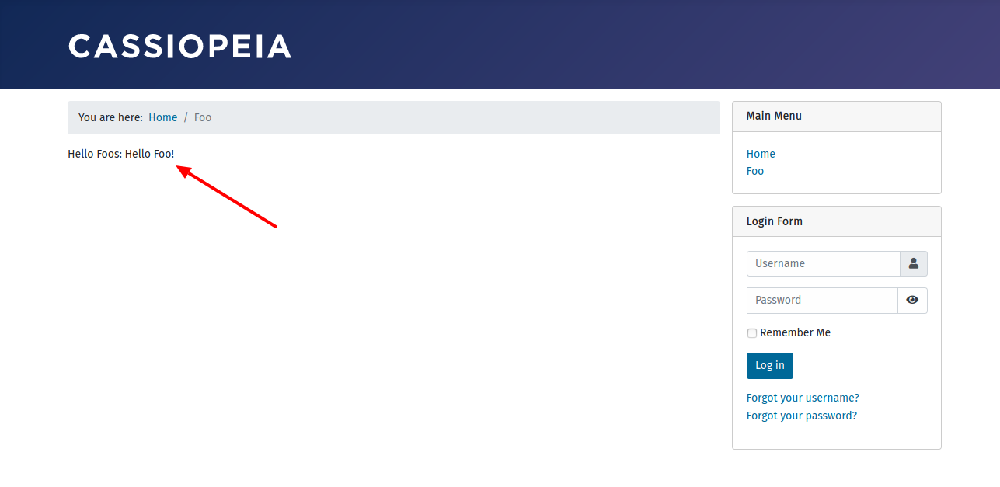

In diesem Teil kommt keine neue Funktion hinzu. Wir bessern den bisherigen Aufbau. Jede Web-Anwendung besteht aus Eingaben, Daten und der Darstellung. 
Problematisch wäre es vor allem bei größeren Projekten die drei Elemente in einer Klasse zusammenzufassen. Joomla! verwendet das Model-View-Controller-Konzept für die Aufteilung. In diesem Tutorial-Teil fügen wir ein Model zum Frontend hinzu. 
Das Model-Objekt ist für die Daten und deren Verarbeitung verantwortlich.

## Teste deine Joomla-Komponente

1. Installiere am Ende deine Komponente in Joomla! Version 4, um sie zu testen:

Kopiere die Dateien im `administrator` Ordner in den `administrator` Ordner deiner Joomla! 4 Installation.  
Kopiere die Dateien im `components` Ordner in den `components` Ordner deiner Joomla! 4 Installation.  
Kopiere die Dateien im `media` Ordner in den `media` Ordner deiner Joomla! 4 Installation.  

Eine neue Installation ist nicht erforderlich. Verwende die aus dem vorhergehenden Teil weiter. 

2. Sieh dir die Frontendansicht deiner Komponente an. Die Daten für die Ausgabe werden vom Model erzeugt.

## Geänderte Dateien

### Übersicht

   

      

    

        Files changed (3)
        <a class="d2h-file-switch d2h-hide">hide</a>
        <a class="d2h-file-switch d2h-show">show</a>
    

    <ol class="d2h-file-list">
    <li class="d2h-file-list-line">
    
      <svg aria-hidden="true" class="d2h-icon d2h-added" height="16" title="added" version="1.1" viewBox="0 0 14 16"
           width="14">
          <path d="M13 1H1C0.45 1 0 1.45 0 2v12c0 0.55 0.45 1 1 1h12c0.55 0 1-0.45 1-1V2c0-0.55-0.45-1-1-1z m0 13H1V2h12v12zM6 9H3V7h3V4h2v3h3v2H8v3H6V9z"></path>
      </svg>      <a href="#d2h-361204" class="d2h-file-name">src/components/com_foos/src/Model/FooModel.php</a>
      
          +43
          -0
      
    
</li>
<li class="d2h-file-list-line">
    
      <svg aria-hidden="true" class="d2h-icon d2h-changed" height="16" title="modified" version="1.1"
           viewBox="0 0 14 16" width="14">
          <path d="M13 1H1C0.45 1 0 1.45 0 2v12c0 0.55 0.45 1 1 1h12c0.55 0 1-0.45 1-1V2c0-0.55-0.45-1-1-1z m0 13H1V2h12v12zM4 8c0-1.66 1.34-3 3-3s3 1.34 3 3-1.34 3-3 3-3-1.34-3-3z"></path>
      </svg>      <a href="#d2h-619060" class="d2h-file-name">src/components/com_foos/src/View/Foo/HtmlView.php</a>
      
          +2
          -0
      
    
</li>
<li class="d2h-file-list-line">
    
      <svg aria-hidden="true" class="d2h-icon d2h-changed" height="16" title="modified" version="1.1"
           viewBox="0 0 14 16" width="14">
          <path d="M13 1H1C0.45 1 0 1.45 0 2v12c0 0.55 0.45 1 1 1h12c0.55 0 1-0.45 1-1V2c0-0.55-0.45-1-1-1z m0 13H1V2h12v12zM4 8c0-1.66 1.34-3 3-3s3 1.34 3 3-1.34 3-3 3-3-1.34-3-3z"></path>
      </svg>      <a href="#d2h-336930" class="d2h-file-name">src/components/com_foos/tmpl/foo/default.php</a>
      
          +2
          -1
      
    
</li>
    </ol>

    

    

    
    <svg aria-hidden="true" class="d2h-icon" height="16" version="1.1" viewBox="0 0 12 16" width="12">
        <path d="M6 5H2v-1h4v1zM2 8h7v-1H2v1z m0 2h7v-1H2v1z m0 2h7v-1H2v1z m10-7.5v9.5c0 0.55-0.45 1-1 1H1c-0.55 0-1-0.45-1-1V2c0-0.55 0.45-1 1-1h7.5l3.5 3.5z m-1 0.5L8 2H1v12h10V5z"></path>
    </svg>    src/components/com_foos/src/Model/FooModel.php
    ADDED
    

    

        

            <table class="d2h-diff-table">
                <tbody class="d2h-diff-tbody">
                <tr>
    <td class="d2h-code-linenumber d2h-info"></td>
    <td class="d2h-info">
        
@@ -0,0 +1,43 @@

    </td>
</tr><tr>
    <td class="d2h-code-linenumber d2h-ins">
      

1

    </td>
    <td class="d2h-ins">
        

            +
            &lt;?php
        

    </td>
</tr><tr>
    <td class="d2h-code-linenumber d2h-ins">
      

2

    </td>
    <td class="d2h-ins">
        

            +
        

    </td>
</tr><tr>
    <td class="d2h-code-linenumber d2h-ins">
      

3

    </td>
    <td class="d2h-ins">
        

            +
            &#x2F;**
        

    </td>
</tr><tr>
    <td class="d2h-code-linenumber d2h-ins">
      

4

    </td>
    <td class="d2h-ins">
        

            +
             * @package     Joomla.Site
        

    </td>
</tr><tr>
    <td class="d2h-code-linenumber d2h-ins">
      

5

    </td>
    <td class="d2h-ins">
        

            +
             * @subpackage  com_foos
        

    </td>
</tr><tr>
    <td class="d2h-code-linenumber d2h-ins">
      

6

    </td>
    <td class="d2h-ins">
        

            +
             *
        

    </td>
</tr><tr>
    <td class="d2h-code-linenumber d2h-ins">
      

7

    </td>
    <td class="d2h-ins">
        

            +
             * @copyright   Copyright (C) 2005 - 2020 Open Source Matters, Inc. All rights reserved.
        

    </td>
</tr><tr>
    <td class="d2h-code-linenumber d2h-ins">
      

8

    </td>
    <td class="d2h-ins">
        

            +
             * @license     GNU General Public License version 2 or later; see LICENSE.txt
        

    </td>
</tr><tr>
    <td class="d2h-code-linenumber d2h-ins">
      

9

    </td>
    <td class="d2h-ins">
        

            +
             *&#x2F;
        

    </td>
</tr><tr>
    <td class="d2h-code-linenumber d2h-ins">
      

10

    </td>
    <td class="d2h-ins">
        

            +
        

    </td>
</tr><tr>
    <td class="d2h-code-linenumber d2h-ins">
      

11

    </td>
    <td class="d2h-ins">
        

            +
            namespace Joomla\Component\Foos\Site\Model;
        

    </td>
</tr><tr>
    <td class="d2h-code-linenumber d2h-ins">
      

12

    </td>
    <td class="d2h-ins">
        

            +
        

    </td>
</tr><tr>
    <td class="d2h-code-linenumber d2h-ins">
      

13

    </td>
    <td class="d2h-ins">
        

            +
            defined(&#x27;_JEXEC&#x27;) or die;
        

    </td>
</tr><tr>
    <td class="d2h-code-linenumber d2h-ins">
      

14

    </td>
    <td class="d2h-ins">
        

            +
        

    </td>
</tr><tr>
    <td class="d2h-code-linenumber d2h-ins">
      

15

    </td>
    <td class="d2h-ins">
        

            +
            use Joomla\CMS\MVC\Model\BaseDatabaseModel;
        

    </td>
</tr><tr>
    <td class="d2h-code-linenumber d2h-ins">
      

16

    </td>
    <td class="d2h-ins">
        

            +
        

    </td>
</tr><tr>
    <td class="d2h-code-linenumber d2h-ins">
      

17

    </td>
    <td class="d2h-ins">
        

            +
            &#x2F;**
        

    </td>
</tr><tr>
    <td class="d2h-code-linenumber d2h-ins">
      

18

    </td>
    <td class="d2h-ins">
        

            +
             * Foo model for the Joomla Foos component.
        

    </td>
</tr><tr>
    <td class="d2h-code-linenumber d2h-ins">
      

19

    </td>
    <td class="d2h-ins">
        

            +
             *
        

    </td>
</tr><tr>
    <td class="d2h-code-linenumber d2h-ins">
      

20

    </td>
    <td class="d2h-ins">
        

            +
             * @since  __BUMP_VERSION__
        

    </td>
</tr><tr>
    <td class="d2h-code-linenumber d2h-ins">
      

21

    </td>
    <td class="d2h-ins">
        

            +
             *&#x2F;
        

    </td>
</tr><tr>
    <td class="d2h-code-linenumber d2h-ins">
      

22

    </td>
    <td class="d2h-ins">
        

            +
            class FooModel extends BaseDatabaseModel
        

    </td>
</tr><tr>
    <td class="d2h-code-linenumber d2h-ins">
      

23

    </td>
    <td class="d2h-ins">
        

            +
            {
        

    </td>
</tr><tr>
    <td class="d2h-code-linenumber d2h-ins">
      

24

    </td>
    <td class="d2h-ins">
        

            +
            	&#x2F;**
        

    </td>
</tr><tr>
    <td class="d2h-code-linenumber d2h-ins">
      

25

    </td>
    <td class="d2h-ins">
        

            +
            	 * @var string message
        

    </td>
</tr><tr>
    <td class="d2h-code-linenumber d2h-ins">
      

26

    </td>
    <td class="d2h-ins">
        

            +
            	 *&#x2F;
        

    </td>
</tr><tr>
    <td class="d2h-code-linenumber d2h-ins">
      

27

    </td>
    <td class="d2h-ins">
        

            +
            	protected $message;
        

    </td>
</tr><tr>
    <td class="d2h-code-linenumber d2h-ins">
      

28

    </td>
    <td class="d2h-ins">
        

            +
        

    </td>
</tr><tr>
    <td class="d2h-code-linenumber d2h-ins">
      

29

    </td>
    <td class="d2h-ins">
        

            +
            	&#x2F;**
        

    </td>
</tr><tr>
    <td class="d2h-code-linenumber d2h-ins">
      

30

    </td>
    <td class="d2h-ins">
        

            +
            	 * Get the message
        

    </td>
</tr><tr>
    <td class="d2h-code-linenumber d2h-ins">
      

31

    </td>
    <td class="d2h-ins">
        

            +
            	 *
        

    </td>
</tr><tr>
    <td class="d2h-code-linenumber d2h-ins">
      

32

    </td>
    <td class="d2h-ins">
        

            +
            	 * @return  string  The message to be displayed to the user
        

    </td>
</tr><tr>
    <td class="d2h-code-linenumber d2h-ins">
      

33

    </td>
    <td class="d2h-ins">
        

            +
            	 *&#x2F;
        

    </td>
</tr><tr>
    <td class="d2h-code-linenumber d2h-ins">
      

34

    </td>
    <td class="d2h-ins">
        

            +
            	public function getMsg()
        

    </td>
</tr><tr>
    <td class="d2h-code-linenumber d2h-ins">
      

35

    </td>
    <td class="d2h-ins">
        

            +
            	{
        

    </td>
</tr><tr>
    <td class="d2h-code-linenumber d2h-ins">
      

36

    </td>
    <td class="d2h-ins">
        

            +
            		if (!isset($this-&gt;message))
        

    </td>
</tr><tr>
    <td class="d2h-code-linenumber d2h-ins">
      

37

    </td>
    <td class="d2h-ins">
        

            +
            		{
        

    </td>
</tr><tr>
    <td class="d2h-code-linenumber d2h-ins">
      

38

    </td>
    <td class="d2h-ins">
        

            +
            			$this-&gt;message = &#x27;Hello Foo!&#x27;;
        

    </td>
</tr><tr>
    <td class="d2h-code-linenumber d2h-ins">
      

39

    </td>
    <td class="d2h-ins">
        

            +
            		}
        

    </td>
</tr><tr>
    <td class="d2h-code-linenumber d2h-ins">
      

40

    </td>
    <td class="d2h-ins">
        

            +
        

    </td>
</tr><tr>
    <td class="d2h-code-linenumber d2h-ins">
      

41

    </td>
    <td class="d2h-ins">
        

            +
            		return $this-&gt;message;
        

    </td>
</tr><tr>
    <td class="d2h-code-linenumber d2h-ins">
      

42

    </td>
    <td class="d2h-ins">
        

            +
            	}
        

    </td>
</tr><tr>
    <td class="d2h-code-linenumber d2h-ins">
      

43

    </td>
    <td class="d2h-ins">
        

            +
            }
        

    </td>
</tr>
                </tbody>
            </table>
        

    

    

    
    <svg aria-hidden="true" class="d2h-icon" height="16" version="1.1" viewBox="0 0 12 16" width="12">
        <path d="M6 5H2v-1h4v1zM2 8h7v-1H2v1z m0 2h7v-1H2v1z m0 2h7v-1H2v1z m10-7.5v9.5c0 0.55-0.45 1-1 1H1c-0.55 0-1-0.45-1-1V2c0-0.55 0.45-1 1-1h7.5l3.5 3.5z m-1 0.5L8 2H1v12h10V5z"></path>
    </svg>    src/components/com_foos/src/View/Foo/HtmlView.php
    CHANGED
    

    

        

            <table class="d2h-diff-table">
                <tbody class="d2h-diff-tbody">
                <tr>
    <td class="d2h-code-linenumber d2h-info"></td>
    <td class="d2h-info">
        
@@ -29,6 +29,8 @@ class HtmlView extends BaseHtmlView

    </td>
</tr><tr>
    <td class="d2h-code-linenumber d2h-cntx">
      
29

29

    </td>
    <td class="d2h-cntx">
        

            &nbsp;
            	 *&#x2F;
        

    </td>
</tr><tr>
    <td class="d2h-code-linenumber d2h-cntx">
      
30

30

    </td>
    <td class="d2h-cntx">
        

            &nbsp;
            	public function display($tpl = null)
        

    </td>
</tr><tr>
    <td class="d2h-code-linenumber d2h-cntx">
      
31

31

    </td>
    <td class="d2h-cntx">
        

            &nbsp;
            	{
        

    </td>
</tr><tr>
    <td class="d2h-code-linenumber d2h-ins">
      

32

    </td>
    <td class="d2h-ins">
        

            +
            		$this-&gt;msg = $this-&gt;get(&#x27;Msg&#x27;);
        

    </td>
</tr><tr>
    <td class="d2h-code-linenumber d2h-ins">
      

33

    </td>
    <td class="d2h-ins">
        

            +
        

    </td>
</tr><tr>
    <td class="d2h-code-linenumber d2h-cntx">
      
32

34

    </td>
    <td class="d2h-cntx">
        

            &nbsp;
            		return parent::display($tpl);
        

    </td>
</tr><tr>
    <td class="d2h-code-linenumber d2h-cntx">
      
33

35

    </td>
    <td class="d2h-cntx">
        

            &nbsp;
            	}
        

    </td>
</tr><tr>
    <td class="d2h-code-linenumber d2h-cntx">
      
34

36

    </td>
    <td class="d2h-cntx">
        

            &nbsp;
            }
        

    </td>
</tr>
                </tbody>
            </table>
        

    

    

    
    <svg aria-hidden="true" class="d2h-icon" height="16" version="1.1" viewBox="0 0 12 16" width="12">
        <path d="M6 5H2v-1h4v1zM2 8h7v-1H2v1z m0 2h7v-1H2v1z m0 2h7v-1H2v1z m10-7.5v9.5c0 0.55-0.45 1-1 1H1c-0.55 0-1-0.45-1-1V2c0-0.55 0.45-1 1-1h7.5l3.5 3.5z m-1 0.5L8 2H1v12h10V5z"></path>
    </svg>    src/components/com_foos/tmpl/foo/default.php
    CHANGED
    

    

        

            <table class="d2h-diff-table">
                <tbody class="d2h-diff-tbody">
                <tr>
    <td class="d2h-code-linenumber d2h-info"></td>
    <td class="d2h-info">
        
@@ -8,4 +8,5 @@

    </td>
</tr><tr>
    <td class="d2h-code-linenumber d2h-cntx">
      
8

8

    </td>
    <td class="d2h-cntx">
        

            &nbsp;
             *&#x2F;
        

    </td>
</tr><tr>
    <td class="d2h-code-linenumber d2h-cntx">
      
9

9

    </td>
    <td class="d2h-cntx">
        

            &nbsp;
            defined(&#x27;_JEXEC&#x27;) or die;
        

    </td>
</tr><tr>
    <td class="d2h-code-linenumber d2h-cntx">
      
10

10

    </td>
    <td class="d2h-cntx">
        

            &nbsp;
            ?&gt;
        

    </td>
</tr><tr>
    <td class="d2h-code-linenumber d2h-del d2h-change">
      
11

    </td>
    <td class="d2h-del d2h-change">
        

            -
            <del>Hello Foos</del>
        

    </td>
</tr><tr>
    <td class="d2h-code-linenumber d2h-ins d2h-change">
      

11

    </td>
    <td class="d2h-ins d2h-change">
        

            +
        

    </td>
</tr><tr>
    <td class="d2h-code-linenumber d2h-ins">
      

12

    </td>
    <td class="d2h-ins">
        

            +
            Hello Foos: &lt;?php echo $this-&gt;msg;
        

    </td>
</tr>
                </tbody>
            </table>
        

    

    
