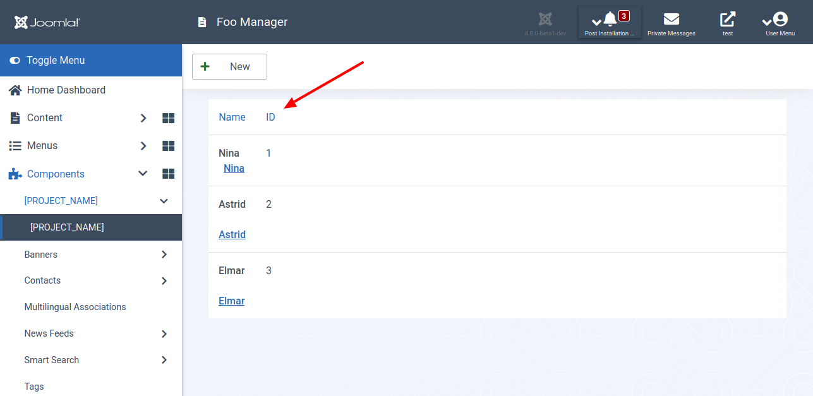

Dein Ziel war, dass deine Erweiterung mehrsprachig ist! Deshalb hast du die Texte, die im Frontend angezeigt werden, nicht direkt in den Programmcode eingegeben. Du hattest alles so vorbereitet, dass du spezielle Dateien nutzt, die austauschbar sind. Bisher hast du deshalb lange kryptische Texte gesehen. In diesem Teil übersetzten wir die unschönen Sprachstrings.

> Selbst wenn deine Zielgruppe die englisch Sprache spricht und du ausschließlich diese Sprache unterstützt ist es wichtig, eine Sprachdatei für den gesamten Text zu verwenden, den du im Front-End oder im Back-End der Komponente anzeigst. So ist es potentiellen Nutzern möglich, Texte zu überschreiben, ohne den Quellcode zu bearbeiten.

## Für Ungeduldige

Sieh dir den geänderten Programmcode in der [Diff-Ansicht](https://github.com/astridx/boilerplate/compare/t7...t8) an und übernimm diese Änderungen in deine Entwicklungsversion.

Eine ausführlichere Erklärung des geänderten Programmcodes findest du weiter unten. 

## Teste deine Joomla-Komponente

1. Installiere deine Komponente in Joomla! Version 4, um sie zu testen:

Kopiere die Dateien im `administrator` Ordner in den `administrator` Ordner deiner Joomla! 4 Installation.  
Kopiere die Dateien im `components` Ordner in den `components` Ordner deiner Joomla! 4 Installation.  
Kopiere die Dateien im `media` Ordner in den `media` Ordner deiner Joomla! 4 Installation. 

Eine neue Installation ist nicht erforderlich. Verwende die aus dem vorhergehenden Teil weiter. 

2. Öffne die Ansicht deiner Komponente im Administrationsbereich und Frontend und überzeuge dich davon, dass die Texte lesbar und nicht mehr kryptisch sind.

## Geänderte Dateien

### Übersicht

      

    

        Files changed (9)
        <a class="d2h-file-switch d2h-hide">hide</a>
        <a class="d2h-file-switch d2h-show">show</a>
    

    <ol class="d2h-file-list">
    <li class="d2h-file-list-line">
    
      <svg aria-hidden="true" class="d2h-icon d2h-changed" height="16" title="modified" version="1.1"
           viewBox="0 0 14 16" width="14">
          <path d="M13 1H1C0.45 1 0 1.45 0 2v12c0 0.55 0.45 1 1 1h12c0.55 0 1-0.45 1-1V2c0-0.55-0.45-1-1-1z m0 13H1V2h12v12zM4 8c0-1.66 1.34-3 3-3s3 1.34 3 3-1.34 3-3 3-3-1.34-3-3z"></path>
      </svg>      <a href="#d2h-863218" class="d2h-file-name">src/administrator/components/com_foos/foos.xml</a>
      
          +2
          -0
      
    
</li>
<li class="d2h-file-list-line">
    
      <svg aria-hidden="true" class="d2h-icon d2h-added" height="16" title="added" version="1.1" viewBox="0 0 14 16"
           width="14">
          <path d="M13 1H1C0.45 1 0 1.45 0 2v12c0 0.55 0.45 1 1 1h12c0.55 0 1-0.45 1-1V2c0-0.55-0.45-1-1-1z m0 13H1V2h12v12zM6 9H3V7h3V4h2v3h3v2H8v3H6V9z"></path>
      </svg>      <a href="#d2h-396862" class="d2h-file-name">src/administrator/components/com_foos/language/de-DE/com_foos.ini</a>
      
          +16
          -0
      
    
</li>
<li class="d2h-file-list-line">
    
      <svg aria-hidden="true" class="d2h-icon d2h-added" height="16" title="added" version="1.1" viewBox="0 0 14 16"
           width="14">
          <path d="M13 1H1C0.45 1 0 1.45 0 2v12c0 0.55 0.45 1 1 1h12c0.55 0 1-0.45 1-1V2c0-0.55-0.45-1-1-1z m0 13H1V2h12v12zM6 9H3V7h3V4h2v3h3v2H8v3H6V9z"></path>
      </svg>      <a href="#d2h-111841" class="d2h-file-name">src/administrator/components/com_foos/language/de-DE/com_foos.sys.ini</a>
      
          +15
          -0
      
    
</li>
<li class="d2h-file-list-line">
    
      <svg aria-hidden="true" class="d2h-icon d2h-added" height="16" title="added" version="1.1" viewBox="0 0 14 16"
           width="14">
          <path d="M13 1H1C0.45 1 0 1.45 0 2v12c0 0.55 0.45 1 1 1h12c0.55 0 1-0.45 1-1V2c0-0.55-0.45-1-1-1z m0 13H1V2h12v12zM6 9H3V7h3V4h2v3h3v2H8v3H6V9z"></path>
      </svg>      <a href="#d2h-219824" class="d2h-file-name">src/administrator/components/com_foos/language/en-GB/com_foos.ini</a>
      
          +16
          -0
      
    
</li>
<li class="d2h-file-list-line">
    
      <svg aria-hidden="true" class="d2h-icon d2h-added" height="16" title="added" version="1.1" viewBox="0 0 14 16"
           width="14">
          <path d="M13 1H1C0.45 1 0 1.45 0 2v12c0 0.55 0.45 1 1 1h12c0.55 0 1-0.45 1-1V2c0-0.55-0.45-1-1-1z m0 13H1V2h12v12zM6 9H3V7h3V4h2v3h3v2H8v3H6V9z"></path>
      </svg>      <a href="#d2h-015215" class="d2h-file-name">src/administrator/components/com_foos/language/en-GB/com_foos.sys.ini</a>
      
          +15
          -0
      
    
</li>
<li class="d2h-file-list-line">
    
      <svg aria-hidden="true" class="d2h-icon d2h-changed" height="16" title="modified" version="1.1"
           viewBox="0 0 14 16" width="14">
          <path d="M13 1H1C0.45 1 0 1.45 0 2v12c0 0.55 0.45 1 1 1h12c0.55 0 1-0.45 1-1V2c0-0.55-0.45-1-1-1z m0 13H1V2h12v12zM4 8c0-1.66 1.34-3 3-3s3 1.34 3 3-1.34 3-3 3-3-1.34-3-3z"></path>
      </svg>      <a href="#d2h-426783" class="d2h-file-name">src/administrator/components/com_foos/tmpl/foo/edit.php</a>
      
          +4
          -2
      
    
</li>
<li class="d2h-file-list-line">
    
      <svg aria-hidden="true" class="d2h-icon d2h-added" height="16" title="added" version="1.1" viewBox="0 0 14 16"
           width="14">
          <path d="M13 1H1C0.45 1 0 1.45 0 2v12c0 0.55 0.45 1 1 1h12c0.55 0 1-0.45 1-1V2c0-0.55-0.45-1-1-1z m0 13H1V2h12v12zM6 9H3V7h3V4h2v3h3v2H8v3H6V9z"></path>
      </svg>      <a href="#d2h-154683" class="d2h-file-name">src/components/com_foos/language/de-DE/de-DE.com_foos.ini</a>
      
          +1
          -0
      
    
</li>
<li class="d2h-file-list-line">
    
      <svg aria-hidden="true" class="d2h-icon d2h-added" height="16" title="added" version="1.1" viewBox="0 0 14 16"
           width="14">
          <path d="M13 1H1C0.45 1 0 1.45 0 2v12c0 0.55 0.45 1 1 1h12c0.55 0 1-0.45 1-1V2c0-0.55-0.45-1-1-1z m0 13H1V2h12v12zM6 9H3V7h3V4h2v3h3v2H8v3H6V9z"></path>
      </svg>      <a href="#d2h-480543" class="d2h-file-name">src/components/com_foos/language/en-GB/en-GB.com_foos.ini</a>
      
          +1
          -0
      
    
</li>
<li class="d2h-file-list-line">
    
      <svg aria-hidden="true" class="d2h-icon d2h-changed" height="16" title="modified" version="1.1"
           viewBox="0 0 14 16" width="14">
          <path d="M13 1H1C0.45 1 0 1.45 0 2v12c0 0.55 0.45 1 1 1h12c0.55 0 1-0.45 1-1V2c0-0.55-0.45-1-1-1z m0 13H1V2h12v12zM4 8c0-1.66 1.34-3 3-3s3 1.34 3 3-1.34 3-3 3-3-1.34-3-3z"></path>
      </svg>      <a href="#d2h-336930" class="d2h-file-name">src/components/com_foos/tmpl/foo/default.php</a>
      
          +3
          -3
      
    
</li>
    </ol>

    

    

    
    <svg aria-hidden="true" class="d2h-icon" height="16" version="1.1" viewBox="0 0 12 16" width="12">
        <path d="M6 5H2v-1h4v1zM2 8h7v-1H2v1z m0 2h7v-1H2v1z m0 2h7v-1H2v1z m10-7.5v9.5c0 0.55-0.45 1-1 1H1c-0.55 0-1-0.45-1-1V2c0-0.55 0.45-1 1-1h7.5l3.5 3.5z m-1 0.5L8 2H1v12h10V5z"></path>
    </svg>    src/administrator/components/com_foos/foos.xml
    CHANGED
    

    

        

            <table class="d2h-diff-table">
                <tbody class="d2h-diff-tbody">
                <tr>
    <td class="d2h-code-linenumber d2h-info"></td>
    <td class="d2h-info">
        
@@ -23,6 +23,7 @@

    </td>
</tr><tr>
    <td class="d2h-code-linenumber d2h-cntx">
      
23

23

    </td>
    <td class="d2h-cntx">
        

            &nbsp;
            	&lt;&#x2F;uninstall&gt;
        

    </td>
</tr><tr>
    <td class="d2h-code-linenumber d2h-cntx">
      
24

24

    </td>
    <td class="d2h-cntx">
        

            &nbsp;
            	&lt;!-- Frond-end files --&gt;
        

    </td>
</tr><tr>
    <td class="d2h-code-linenumber d2h-cntx">
      
25

25

    </td>
    <td class="d2h-cntx">
        

            &nbsp;
            	&lt;files folder=&quot;components&#x2F;com_foos&quot;&gt;
        

    </td>
</tr><tr>
    <td class="d2h-code-linenumber d2h-ins">
      

26

    </td>
    <td class="d2h-ins">
        

            +
            		&lt;folder&gt;language&lt;&#x2F;folder&gt;
        

    </td>
</tr><tr>
    <td class="d2h-code-linenumber d2h-cntx">
      
26

27

    </td>
    <td class="d2h-cntx">
        

            &nbsp;
            		&lt;folder&gt;src&lt;&#x2F;folder&gt;
        

    </td>
</tr><tr>
    <td class="d2h-code-linenumber d2h-cntx">
      
27

28

    </td>
    <td class="d2h-cntx">
        

            &nbsp;
            		&lt;folder&gt;tmpl&lt;&#x2F;folder&gt;
        

    </td>
</tr><tr>
    <td class="d2h-code-linenumber d2h-cntx">
      
28

29

    </td>
    <td class="d2h-cntx">
        

            &nbsp;
            	&lt;&#x2F;files&gt;
        

    </td>
</tr>
<tr>
    <td class="d2h-code-linenumber d2h-info"></td>
    <td class="d2h-info">
        
@@ -39,6 +40,7 @@

    </td>
</tr><tr>
    <td class="d2h-code-linenumber d2h-cntx">
      
39

40

    </td>
    <td class="d2h-cntx">
        

            &nbsp;
            		&lt;files folder=&quot;administrator&#x2F;components&#x2F;com_foos&quot;&gt;
        

    </td>
</tr><tr>
    <td class="d2h-code-linenumber d2h-cntx">
      
40

41

    </td>
    <td class="d2h-cntx">
        

            &nbsp;
            			&lt;filename&gt;foos.xml&lt;&#x2F;filename&gt;
        

    </td>
</tr><tr>
    <td class="d2h-code-linenumber d2h-cntx">
      
41

42

    </td>
    <td class="d2h-cntx">
        

            &nbsp;
            			&lt;folder&gt;forms&lt;&#x2F;folder&gt;
        

    </td>
</tr><tr>
    <td class="d2h-code-linenumber d2h-ins">
      

43

    </td>
    <td class="d2h-ins">
        

            +
            			&lt;folder&gt;language&lt;&#x2F;folder&gt;
        

    </td>
</tr><tr>
    <td class="d2h-code-linenumber d2h-cntx">
      
42

44

    </td>
    <td class="d2h-cntx">
        

            &nbsp;
            			&lt;folder&gt;services&lt;&#x2F;folder&gt;
        

    </td>
</tr><tr>
    <td class="d2h-code-linenumber d2h-cntx">
      
43

45

    </td>
    <td class="d2h-cntx">
        

            &nbsp;
            			&lt;folder&gt;sql&lt;&#x2F;folder&gt;
        

    </td>
</tr><tr>
    <td class="d2h-code-linenumber d2h-cntx">
      
44

46

    </td>
    <td class="d2h-cntx">
        

            &nbsp;
            			&lt;folder&gt;src&lt;&#x2F;folder&gt;
        

    </td>
</tr>
                </tbody>
            </table>
        

    

    

    
    <svg aria-hidden="true" class="d2h-icon" height="16" version="1.1" viewBox="0 0 12 16" width="12">
        <path d="M6 5H2v-1h4v1zM2 8h7v-1H2v1z m0 2h7v-1H2v1z m0 2h7v-1H2v1z m10-7.5v9.5c0 0.55-0.45 1-1 1H1c-0.55 0-1-0.45-1-1V2c0-0.55 0.45-1 1-1h7.5l3.5 3.5z m-1 0.5L8 2H1v12h10V5z"></path>
    </svg>    src/administrator/components/com_foos/language/de-DE/com_foos.ini
    ADDED
    

    

        

            <table class="d2h-diff-table">
                <tbody class="d2h-diff-tbody">
                <tr>
    <td class="d2h-code-linenumber d2h-info"></td>
    <td class="d2h-info">
        
@@ -0,0 +1,16 @@

    </td>
</tr><tr>
    <td class="d2h-code-linenumber d2h-ins">
      

1

    </td>
    <td class="d2h-ins">
        

            +
            COM_FOOS=&quot;[PROJECT_NAME]&quot;
        

    </td>
</tr><tr>
    <td class="d2h-code-linenumber d2h-ins">
      

2

    </td>
    <td class="d2h-ins">
        

            +
            COM_FOOS_CONFIGURATION=&quot;Foo Optionen&quot;
        

    </td>
</tr><tr>
    <td class="d2h-code-linenumber d2h-ins">
      

3

    </td>
    <td class="d2h-ins">
        

            +
        

    </td>
</tr><tr>
    <td class="d2h-code-linenumber d2h-ins">
      

4

    </td>
    <td class="d2h-ins">
        

            +
            COM_FOOS_MANAGER_FOO_NEW=&quot;Neu&quot;
        

    </td>
</tr><tr>
    <td class="d2h-code-linenumber d2h-ins">
      

5

    </td>
    <td class="d2h-ins">
        

            +
            COM_FOOS_MANAGER_FOO_EDIT=&quot;Bearbeiten&quot;
        

    </td>
</tr><tr>
    <td class="d2h-code-linenumber d2h-ins">
      

6

    </td>
    <td class="d2h-ins">
        

            +
            COM_FOOS_MANAGER_FOOS=&quot;Foo Manager&quot;
        

    </td>
</tr><tr>
    <td class="d2h-code-linenumber d2h-ins">
      

7

    </td>
    <td class="d2h-ins">
        

            +
        

    </td>
</tr><tr>
    <td class="d2h-code-linenumber d2h-ins">
      

8

    </td>
    <td class="d2h-ins">
        

            +
            COM_FOOS_TABLE_TABLEHEAD_NAME=&quot;Name&quot;
        

    </td>
</tr><tr>
    <td class="d2h-code-linenumber d2h-ins">
      

9

    </td>
    <td class="d2h-ins">
        

            +
            COM_FOOS_TABLE_TABLEHEAD_ID=&quot;ID&quot;
        

    </td>
</tr><tr>
    <td class="d2h-code-linenumber d2h-ins">
      

10

    </td>
    <td class="d2h-ins">
        

            +
            COM_FOOS_ERROR_FOO_NOT_FOUND=&quot;Foo nicht gefunden&quot;
        

    </td>
</tr><tr>
    <td class="d2h-code-linenumber d2h-ins">
      

11

    </td>
    <td class="d2h-ins">
        

            +
        

    </td>
</tr><tr>
    <td class="d2h-code-linenumber d2h-ins">
      

12

    </td>
    <td class="d2h-ins">
        

            +
            COM_FOOS_FIELD_NAME_LABEL=&quot;Name&quot;
        

    </td>
</tr><tr>
    <td class="d2h-code-linenumber d2h-ins">
      

13

    </td>
    <td class="d2h-ins">
        

            +
        

    </td>
</tr><tr>
    <td class="d2h-code-linenumber d2h-ins">
      

14

    </td>
    <td class="d2h-ins">
        

            +
            COM_FOOS_FIELD_FOO_SHOW_CATEGORY_LABEL=&quot;Namensschild anzeigen&quot;
        

    </td>
</tr><tr>
    <td class="d2h-code-linenumber d2h-ins">
      

15

    </td>
    <td class="d2h-ins">
        

            +
            COM_FOOS_FIELD_CONFIG_INDIVIDUAL_FOO_DESC=&quot;Diese Einstellungen gelten für alle foo.&quot;
        

    </td>
</tr><tr>
    <td class="d2h-code-linenumber d2h-ins">
      

16

    </td>
    <td class="d2h-ins">
        

            +
            COM_FOOS_FIELD_CONFIG_INDIVIDUAL_FOO_DISPLAY=&quot;Foo&quot;
        

    </td>
</tr>
                </tbody>
            </table>
        

    

    

    
    <svg aria-hidden="true" class="d2h-icon" height="16" version="1.1" viewBox="0 0 12 16" width="12">
        <path d="M6 5H2v-1h4v1zM2 8h7v-1H2v1z m0 2h7v-1H2v1z m0 2h7v-1H2v1z m10-7.5v9.5c0 0.55-0.45 1-1 1H1c-0.55 0-1-0.45-1-1V2c0-0.55 0.45-1 1-1h7.5l3.5 3.5z m-1 0.5L8 2H1v12h10V5z"></path>
    </svg>    src/administrator/components/com_foos/language/de-DE/com_foos.sys.ini
    ADDED
    

    

        

            <table class="d2h-diff-table">
                <tbody class="d2h-diff-tbody">
                <tr>
    <td class="d2h-code-linenumber d2h-info"></td>
    <td class="d2h-info">
        
@@ -0,0 +1,15 @@

    </td>
</tr><tr>
    <td class="d2h-code-linenumber d2h-ins">
      

1

    </td>
    <td class="d2h-ins">
        

            +
            COM_FOOS=&quot;[PROJECT_NAME]&quot;
        

    </td>
</tr><tr>
    <td class="d2h-code-linenumber d2h-ins">
      

2

    </td>
    <td class="d2h-ins">
        

            +
            COM_FOOS_XML_DESCRIPTION=&quot;Foo Komponente&quot;
        

    </td>
</tr><tr>
    <td class="d2h-code-linenumber d2h-ins">
      

3

    </td>
    <td class="d2h-ins">
        

            +
        

    </td>
</tr><tr>
    <td class="d2h-code-linenumber d2h-ins">
      

4

    </td>
    <td class="d2h-ins">
        

            +
            COM_FOOS_INSTALLERSCRIPT_PREFLIGHT=&quot;&lt;p&gt;Alles hier passiert vor der Installation &#x2F; Aktualisierung &#x2F; Deinstallation der Komponente&lt;&#x2F;p&gt;&quot;
        

    </td>
</tr><tr>
    <td class="d2h-code-linenumber d2h-ins">
      

5

    </td>
    <td class="d2h-ins">
        

            +
            COM_FOOS_INSTALLERSCRIPT_UPDATE=&quot;&lt;p&gt;TDie Komponente wurde aktualisiert&lt;&#x2F;p&gt;&quot;
        

    </td>
</tr><tr>
    <td class="d2h-code-linenumber d2h-ins">
      

6

    </td>
    <td class="d2h-ins">
        

            +
            COM_FOOS_INSTALLERSCRIPT_UNINSTALL=&quot;&lt;p&gt;Die Komponente wurde deinstalliert&lt;&#x2F;p&gt;&quot;
        

    </td>
</tr><tr>
    <td class="d2h-code-linenumber d2h-ins">
      

7

    </td>
    <td class="d2h-ins">
        

            +
            COM_FOOS_INSTALLERSCRIPT_INSTALL=&quot;&lt;p&gt;Die Komponente wurde installiert&lt;&#x2F;p&gt;&quot;
        

    </td>
</tr><tr>
    <td class="d2h-code-linenumber d2h-ins">
      

8

    </td>
    <td class="d2h-ins">
        

            +
            COM_FOOS_INSTALLERSCRIPT_POSTFLIGHT=&quot;&lt;p&gt;Alles hier passiert nach der Installation &#x2F; Aktualisierung &#x2F; Deinstallation der Komponente&lt;&#x2F;p&gt;&quot;
        

    </td>
</tr><tr>
    <td class="d2h-code-linenumber d2h-ins">
      

9

    </td>
    <td class="d2h-ins">
        

            +
        

    </td>
</tr><tr>
    <td class="d2h-code-linenumber d2h-ins">
      

10

    </td>
    <td class="d2h-ins">
        

            +
            COM_FOOS_FOO_VIEW_DEFAULT_TITLE=&quot;Ein einzelnes Foo&quot;
        

    </td>
</tr><tr>
    <td class="d2h-code-linenumber d2h-ins">
      

11

    </td>
    <td class="d2h-ins">
        

            +
            COM_FOOS_FOO_VIEW_DEFAULT_DESC=&quot;Dies ist ein Link zu den Informationen für ein Foo.&quot;
        

    </td>
</tr><tr>
    <td class="d2h-code-linenumber d2h-ins">
      

12

    </td>
    <td class="d2h-ins">
        

            +
            COM_FOOS_SELECT_FOO_LABEL=&quot;Wählen Sie ein foo aus&quot;
        

    </td>
</tr><tr>
    <td class="d2h-code-linenumber d2h-ins">
      

13

    </td>
    <td class="d2h-ins">
        

            +
        

    </td>
</tr><tr>
    <td class="d2h-code-linenumber d2h-ins">
      

14

    </td>
    <td class="d2h-ins">
        

            +
            COM_FOOS_CHANGE_FOO=&quot;Ändern Sie ein foo&quot;
        

    </td>
</tr><tr>
    <td class="d2h-code-linenumber d2h-ins">
      

15

    </td>
    <td class="d2h-ins">
        

            +
            COM_FOOS_SELECT_A_FOO=&quot;Wählen Sie ein foo aus&quot;
        

    </td>
</tr>
                </tbody>
            </table>
        

    

    

    
    <svg aria-hidden="true" class="d2h-icon" height="16" version="1.1" viewBox="0 0 12 16" width="12">
        <path d="M6 5H2v-1h4v1zM2 8h7v-1H2v1z m0 2h7v-1H2v1z m0 2h7v-1H2v1z m10-7.5v9.5c0 0.55-0.45 1-1 1H1c-0.55 0-1-0.45-1-1V2c0-0.55 0.45-1 1-1h7.5l3.5 3.5z m-1 0.5L8 2H1v12h10V5z"></path>
    </svg>    src/administrator/components/com_foos/language/en-GB/com_foos.ini
    ADDED
    

    

        

            <table class="d2h-diff-table">
                <tbody class="d2h-diff-tbody">
                <tr>
    <td class="d2h-code-linenumber d2h-info"></td>
    <td class="d2h-info">
        
@@ -0,0 +1,16 @@

    </td>
</tr><tr>
    <td class="d2h-code-linenumber d2h-ins">
      

1

    </td>
    <td class="d2h-ins">
        

            +
            COM_FOOS=&quot;[PROJECT_NAME]&quot;
        

    </td>
</tr><tr>
    <td class="d2h-code-linenumber d2h-ins">
      

2

    </td>
    <td class="d2h-ins">
        

            +
            COM_FOOS_CONFIGURATION=&quot;Foo Options&quot;
        

    </td>
</tr><tr>
    <td class="d2h-code-linenumber d2h-ins">
      

3

    </td>
    <td class="d2h-ins">
        

            +
        

    </td>
</tr><tr>
    <td class="d2h-code-linenumber d2h-ins">
      

4

    </td>
    <td class="d2h-ins">
        

            +
            COM_FOOS_MANAGER_FOO_NEW=&quot;New&quot;
        

    </td>
</tr><tr>
    <td class="d2h-code-linenumber d2h-ins">
      

5

    </td>
    <td class="d2h-ins">
        

            +
            COM_FOOS_MANAGER_FOO_EDIT=&quot;Edit&quot;
        

    </td>
</tr><tr>
    <td class="d2h-code-linenumber d2h-ins">
      

6

    </td>
    <td class="d2h-ins">
        

            +
            COM_FOOS_MANAGER_FOOS=&quot;Foo Manager&quot;
        

    </td>
</tr><tr>
    <td class="d2h-code-linenumber d2h-ins">
      

7

    </td>
    <td class="d2h-ins">
        

            +
        

    </td>
</tr><tr>
    <td class="d2h-code-linenumber d2h-ins">
      

8

    </td>
    <td class="d2h-ins">
        

            +
            COM_FOOS_TABLE_TABLEHEAD_NAME=&quot;Name&quot;
        

    </td>
</tr><tr>
    <td class="d2h-code-linenumber d2h-ins">
      

9

    </td>
    <td class="d2h-ins">
        

            +
            COM_FOOS_TABLE_TABLEHEAD_ID=&quot;ID&quot;
        

    </td>
</tr><tr>
    <td class="d2h-code-linenumber d2h-ins">
      

10

    </td>
    <td class="d2h-ins">
        

            +
            COM_FOOS_ERROR_FOO_NOT_FOUND=&quot;Foo not found&quot;
        

    </td>
</tr><tr>
    <td class="d2h-code-linenumber d2h-ins">
      

11

    </td>
    <td class="d2h-ins">
        

            +
        

    </td>
</tr><tr>
    <td class="d2h-code-linenumber d2h-ins">
      

12

    </td>
    <td class="d2h-ins">
        

            +
            COM_FOOS_FIELD_NAME_LABEL=&quot;Name&quot;
        

    </td>
</tr><tr>
    <td class="d2h-code-linenumber d2h-ins">
      

13

    </td>
    <td class="d2h-ins">
        

            +
        

    </td>
</tr><tr>
    <td class="d2h-code-linenumber d2h-ins">
      

14

    </td>
    <td class="d2h-ins">
        

            +
            COM_FOOS_FIELD_FOO_SHOW_CATEGORY_LABEL=&quot;Show name label&quot;
        

    </td>
</tr><tr>
    <td class="d2h-code-linenumber d2h-ins">
      

15

    </td>
    <td class="d2h-ins">
        

            +
            COM_FOOS_FIELD_CONFIG_INDIVIDUAL_FOO_DESC=&quot;These settings apply for all foo.&quot;
        

    </td>
</tr><tr>
    <td class="d2h-code-linenumber d2h-ins">
      

16

    </td>
    <td class="d2h-ins">
        

            +
            COM_FOOS_FIELD_CONFIG_INDIVIDUAL_FOO_DISPLAY=&quot;Foo&quot;
        

    </td>
</tr>
                </tbody>
            </table>
        

    

    

    
    <svg aria-hidden="true" class="d2h-icon" height="16" version="1.1" viewBox="0 0 12 16" width="12">
        <path d="M6 5H2v-1h4v1zM2 8h7v-1H2v1z m0 2h7v-1H2v1z m0 2h7v-1H2v1z m10-7.5v9.5c0 0.55-0.45 1-1 1H1c-0.55 0-1-0.45-1-1V2c0-0.55 0.45-1 1-1h7.5l3.5 3.5z m-1 0.5L8 2H1v12h10V5z"></path>
    </svg>    src/administrator/components/com_foos/language/en-GB/com_foos.sys.ini
    ADDED
    

    

        

            <table class="d2h-diff-table">
                <tbody class="d2h-diff-tbody">
                <tr>
    <td class="d2h-code-linenumber d2h-info"></td>
    <td class="d2h-info">
        
@@ -0,0 +1,15 @@

    </td>
</tr><tr>
    <td class="d2h-code-linenumber d2h-ins">
      

1

    </td>
    <td class="d2h-ins">
        

            +
            COM_FOOS=&quot;[PROJECT_NAME]&quot;
        

    </td>
</tr><tr>
    <td class="d2h-code-linenumber d2h-ins">
      

2

    </td>
    <td class="d2h-ins">
        

            +
            COM_FOOS_XML_DESCRIPTION=&quot;Foo Component&quot;
        

    </td>
</tr><tr>
    <td class="d2h-code-linenumber d2h-ins">
      

3

    </td>
    <td class="d2h-ins">
        

            +
        

    </td>
</tr><tr>
    <td class="d2h-code-linenumber d2h-ins">
      

4

    </td>
    <td class="d2h-ins">
        

            +
            COM_FOOS_INSTALLERSCRIPT_PREFLIGHT=&quot;&lt;p&gt;Anything here happens before the installation&#x2F;update&#x2F;uninstallation of the component&lt;&#x2F;p&gt;&quot;
        

    </td>
</tr><tr>
    <td class="d2h-code-linenumber d2h-ins">
      

5

    </td>
    <td class="d2h-ins">
        

            +
            COM_FOOS_INSTALLERSCRIPT_UPDATE=&quot;&lt;p&gt;The component has been updated&lt;&#x2F;p&gt;&quot;
        

    </td>
</tr><tr>
    <td class="d2h-code-linenumber d2h-ins">
      

6

    </td>
    <td class="d2h-ins">
        

            +
            COM_FOOS_INSTALLERSCRIPT_UNINSTALL=&quot;&lt;p&gt;The component has been uninstalled&lt;&#x2F;p&gt;&quot;
        

    </td>
</tr><tr>
    <td class="d2h-code-linenumber d2h-ins">
      

7

    </td>
    <td class="d2h-ins">
        

            +
            COM_FOOS_INSTALLERSCRIPT_INSTALL=&quot;&lt;p&gt;The component has been installed&lt;&#x2F;p&gt;&quot;
        

    </td>
</tr><tr>
    <td class="d2h-code-linenumber d2h-ins">
      

8

    </td>
    <td class="d2h-ins">
        

            +
            COM_FOOS_INSTALLERSCRIPT_POSTFLIGHT=&quot;&lt;p&gt;Anything here happens after the installation&#x2F;update&#x2F;uninstallation of the component&lt;&#x2F;p&gt;&quot;
        

    </td>
</tr><tr>
    <td class="d2h-code-linenumber d2h-ins">
      

9

    </td>
    <td class="d2h-ins">
        

            +
        

    </td>
</tr><tr>
    <td class="d2h-code-linenumber d2h-ins">
      

10

    </td>
    <td class="d2h-ins">
        

            +
            COM_FOOS_FOO_VIEW_DEFAULT_TITLE=&quot;Single Foo&quot;
        

    </td>
</tr><tr>
    <td class="d2h-code-linenumber d2h-ins">
      

11

    </td>
    <td class="d2h-ins">
        

            +
            COM_FOOS_FOO_VIEW_DEFAULT_DESC=&quot;This links to the information for one foo.&quot;
        

    </td>
</tr><tr>
    <td class="d2h-code-linenumber d2h-ins">
      

12

    </td>
    <td class="d2h-ins">
        

            +
            COM_FOOS_SELECT_FOO_LABEL=&quot;Select a foo&quot;
        

    </td>
</tr><tr>
    <td class="d2h-code-linenumber d2h-ins">
      

13

    </td>
    <td class="d2h-ins">
        

            +
        

    </td>
</tr><tr>
    <td class="d2h-code-linenumber d2h-ins">
      

14

    </td>
    <td class="d2h-ins">
        

            +
            COM_FOOS_CHANGE_FOO=&quot;Change a foo&quot;
        

    </td>
</tr><tr>
    <td class="d2h-code-linenumber d2h-ins">
      

15

    </td>
    <td class="d2h-ins">
        

            +
            COM_FOOS_SELECT_A_FOO=&quot;Select a foo&quot;
        

    </td>
</tr>
                </tbody>
            </table>
        

    

    

    
    <svg aria-hidden="true" class="d2h-icon" height="16" version="1.1" viewBox="0 0 12 16" width="12">
        <path d="M6 5H2v-1h4v1zM2 8h7v-1H2v1z m0 2h7v-1H2v1z m0 2h7v-1H2v1z m10-7.5v9.5c0 0.55-0.45 1-1 1H1c-0.55 0-1-0.45-1-1V2c0-0.55 0.45-1 1-1h7.5l3.5 3.5z m-1 0.5L8 2H1v12h10V5z"></path>
    </svg>    src/administrator/components/com_foos/tmpl/foo/edit.php
    CHANGED
    

    

        

            <table class="d2h-diff-table">
                <tbody class="d2h-diff-tbody">
                <tr>
    <td class="d2h-code-linenumber d2h-info"></td>
    <td class="d2h-info">
        
@@ -16,8 +16,10 @@ use Joomla\CMS\Router\Route;

    </td>
</tr><tr>
    <td class="d2h-code-linenumber d2h-cntx">
      
16

16

    </td>
    <td class="d2h-cntx">
        

            &nbsp;
            $app = Factory::getApplication();
        

    </td>
</tr><tr>
    <td class="d2h-code-linenumber d2h-cntx">
      
17

17

    </td>
    <td class="d2h-cntx">
        

            &nbsp;
            $input = $app-&gt;input;
        

    </td>
</tr><tr>
    <td class="d2h-code-linenumber d2h-cntx">
      
18

18

    </td>
    <td class="d2h-cntx">
        

            &nbsp;
        

    </td>
</tr><tr>
    <td class="d2h-code-linenumber d2h-del d2h-change">
      
19

    </td>
    <td class="d2h-del d2h-change">
        

            -
            <del>$layout  =</del> <del>&#x27;edit&#x27;;</del>
        

    </td>
</tr><tr>
    <td class="d2h-code-linenumber d2h-del d2h-change">
      
20

    </td>
    <td class="d2h-del d2h-change">
        

            -
            $<del>tmpl</del> = $input-&gt;get(&#x27;<del>tmpl</del>&#x27;<del>, &#x27;&#x27;, &#x27;cmd&#x27;</del>) <del>===</del> &#x27;<del>component</del>&#x27; ? <del>&#x27;&amp;tmpl=component&#x27;</del> : <del>&#x27;&#x27;</del>;
        

    </td>
</tr><tr>
    <td class="d2h-code-linenumber d2h-ins d2h-change">
      

19

    </td>
    <td class="d2h-ins d2h-change">
        

            +
            <ins>&#x2F;&#x2F;</ins> <ins>In case of modal</ins>
        

    </td>
</tr><tr>
    <td class="d2h-code-linenumber d2h-ins d2h-change">
      

20

    </td>
    <td class="d2h-ins d2h-change">
        

            +
            $<ins>isModal</ins> = $input-&gt;get(&#x27;<ins>layout</ins>&#x27;) <ins>==</ins> &#x27;<ins>modal</ins>&#x27; ? <ins>true</ins> : <ins>false</ins>;
        

    </td>
</tr><tr>
    <td class="d2h-code-linenumber d2h-ins">
      

21

    </td>
    <td class="d2h-ins">
        

            +
            $layout  = $isModal ? &#x27;modal&#x27; : &#x27;edit&#x27;;
        

    </td>
</tr><tr>
    <td class="d2h-code-linenumber d2h-ins">
      

22

    </td>
    <td class="d2h-ins">
        

            +
            $tmpl    = $isModal || $input-&gt;get(&#x27;tmpl&#x27;, &#x27;&#x27;, &#x27;cmd&#x27;) === &#x27;component&#x27; ? &#x27;&amp;tmpl=component&#x27; : &#x27;&#x27;;
        

    </td>
</tr><tr>
    <td class="d2h-code-linenumber d2h-cntx">
      
21

23

    </td>
    <td class="d2h-cntx">
        

            &nbsp;
            ?&gt;
        

    </td>
</tr><tr>
    <td class="d2h-code-linenumber d2h-cntx">
      
22

24

    </td>
    <td class="d2h-cntx">
        

            &nbsp;
        

    </td>
</tr><tr>
    <td class="d2h-code-linenumber d2h-cntx">
      
23

25

    </td>
    <td class="d2h-cntx">
        

            &nbsp;
            &lt;form action=&quot;&lt;?php echo Route::_(&#x27;index.php?option=com_foos&amp;layout=&#x27; . $layout . $tmpl . &#x27;&amp;id=&#x27; . (int) $this-&gt;item-&gt;id); ?&gt;&quot; method=&quot;post&quot; name=&quot;adminForm&quot; id=&quot;foo-form&quot; class=&quot;form-validate&quot;&gt;
        

    </td>
</tr>
                </tbody>
            </table>
        

    

    

    
    <svg aria-hidden="true" class="d2h-icon" height="16" version="1.1" viewBox="0 0 12 16" width="12">
        <path d="M6 5H2v-1h4v1zM2 8h7v-1H2v1z m0 2h7v-1H2v1z m0 2h7v-1H2v1z m10-7.5v9.5c0 0.55-0.45 1-1 1H1c-0.55 0-1-0.45-1-1V2c0-0.55 0.45-1 1-1h7.5l3.5 3.5z m-1 0.5L8 2H1v12h10V5z"></path>
    </svg>    src/components/com_foos/language/de-DE/de-DE.com_foos.ini
    ADDED
    

    

        

            <table class="d2h-diff-table">
                <tbody class="d2h-diff-tbody">
                <tr>
    <td class="d2h-code-linenumber d2h-info"></td>
    <td class="d2h-info">
        
@@ -0,0 +1 @@

    </td>
</tr><tr>
    <td class="d2h-code-linenumber d2h-ins">
      

1

    </td>
    <td class="d2h-ins">
        

            +
            COM_FOOS_NAME=&quot;Name: &quot;
        

    </td>
</tr>
                </tbody>
            </table>
        

    

    

    
    <svg aria-hidden="true" class="d2h-icon" height="16" version="1.1" viewBox="0 0 12 16" width="12">
        <path d="M6 5H2v-1h4v1zM2 8h7v-1H2v1z m0 2h7v-1H2v1z m0 2h7v-1H2v1z m10-7.5v9.5c0 0.55-0.45 1-1 1H1c-0.55 0-1-0.45-1-1V2c0-0.55 0.45-1 1-1h7.5l3.5 3.5z m-1 0.5L8 2H1v12h10V5z"></path>
    </svg>    src/components/com_foos/language/en-GB/en-GB.com_foos.ini
    ADDED
    

    

        

            <table class="d2h-diff-table">
                <tbody class="d2h-diff-tbody">
                <tr>
    <td class="d2h-code-linenumber d2h-info"></td>
    <td class="d2h-info">
        
@@ -0,0 +1 @@

    </td>
</tr><tr>
    <td class="d2h-code-linenumber d2h-ins">
      

1

    </td>
    <td class="d2h-ins">
        

            +
            COM_FOOS_NAME=&quot;Name: &quot;
        

    </td>
</tr>
                </tbody>
            </table>
        

    

    

    
    <svg aria-hidden="true" class="d2h-icon" height="16" version="1.1" viewBox="0 0 12 16" width="12">
        <path d="M6 5H2v-1h4v1zM2 8h7v-1H2v1z m0 2h7v-1H2v1z m0 2h7v-1H2v1z m10-7.5v9.5c0 0.55-0.45 1-1 1H1c-0.55 0-1-0.45-1-1V2c0-0.55 0.45-1 1-1h7.5l3.5 3.5z m-1 0.5L8 2H1v12h10V5z"></path>
    </svg>    src/components/com_foos/tmpl/foo/default.php
    CHANGED
    

    

        

            <table class="d2h-diff-table">
                <tbody class="d2h-diff-tbody">
                <tr>
    <td class="d2h-code-linenumber d2h-info"></td>
    <td class="d2h-info">
        
@@ -7,7 +7,7 @@

    </td>
</tr><tr>
    <td class="d2h-code-linenumber d2h-cntx">
      
7

7

    </td>
    <td class="d2h-cntx">
        

            &nbsp;
             * @license     GNU General Public License version 2 or later; see LICENSE.txt
        

    </td>
</tr><tr>
    <td class="d2h-code-linenumber d2h-cntx">
      
8

8

    </td>
    <td class="d2h-cntx">
        

            &nbsp;
             *&#x2F;
        

    </td>
</tr><tr>
    <td class="d2h-code-linenumber d2h-cntx">
      
9

9

    </td>
    <td class="d2h-cntx">
        

            &nbsp;
            defined(&#x27;_JEXEC&#x27;) or die;
        

    </td>
</tr><tr>
    <td class="d2h-code-linenumber d2h-del">
      
10

    </td>
    <td class="d2h-del">
        

            -
            ?&gt;
        

    </td>
</tr><tr>
    <td class="d2h-code-linenumber d2h-cntx">
      
11

10

    </td>
    <td class="d2h-cntx">
        

            &nbsp;
        

    </td>
</tr><tr>
    <td class="d2h-code-linenumber d2h-del d2h-change">
      
12

    </td>
    <td class="d2h-del d2h-change">
        

            -
            <del>&lt;?php</del> 
        

    </td>
</tr><tr>
    <td class="d2h-code-linenumber d2h-del d2h-change">
      
13

    </td>
    <td class="d2h-del d2h-change">
        

            -
            <del>echo $this-&gt;item-&gt;name;</del>
        

    </td>
</tr><tr>
    <td class="d2h-code-linenumber d2h-ins d2h-change">
      

11

    </td>
    <td class="d2h-ins d2h-change">
        

            +
            <ins>use</ins> <ins>Joomla\CMS\Language\Text;</ins>
        

    </td>
</tr><tr>
    <td class="d2h-code-linenumber d2h-ins d2h-change">
      

12

    </td>
    <td class="d2h-ins d2h-change">
        

            +
        

    </td>
</tr><tr>
    <td class="d2h-code-linenumber d2h-ins">
      

13

    </td>
    <td class="d2h-ins">
        

            +
            echo Text::_(&#x27;COM_FOOS_NAME&#x27;) . $this-&gt;item-&gt;name;
        

    </td>
</tr>
                </tbody>
            </table>
        

    

    
