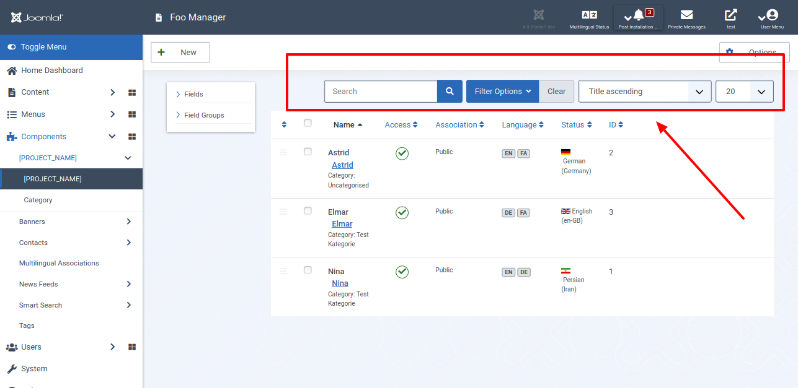

Filtern, Sortieren und Suchen - jetzt bringen wir Ordnung in deine Joomla! 4 Komponente! Joomla bietet Ansichtsfilter und Suchwerkzeuge, mit denen du die Anzahl der sichtbaren Items einschränkst. Wenn der Statusfilter entsprechend gesetzt ist, werden nur Elemente angezeigt, deren Status veröffentlicht ist. Neben dem Statusfilter bieten die Suchwerkzeuge die Suche nach Titel oder Inhalt und die Möglichkeit die Tabelle zu sortieren, sprich die Reihenfolge zu ändern.

## Für Ungeduldige

Sieh dir den geänderten Programmcode in der [Diff-Ansicht](https://github.com/astridx/boilerplate/compare/t15a...t15b) an und übernimm diese Änderungen in deine Entwicklungsversion.

Eine ausführlichere Erklärung des geänderten Programmcodes findest du weiter unten. 

## Teste deine Joomla-Komponente

1. Installiere deine Komponente in Joomla! Version 4, um sie zu testen:

Kopiere die Dateien im `administrator` Ordner in den `administrator` Ordner deiner Joomla! 4 Installation.  
Kopiere die Dateien im `components` Ordner in den `components` Ordner deiner Joomla! 4 Installation.  
Kopiere die Dateien im `media` Ordner in den `media` Ordner deiner Joomla! 4 Installation. 

2. Die Datenbank ist geändert worden, so dass es erforderlich ist, sie zu aktualisieren. Öffne den Bereich `System | Information | Database`, wie in Teil 16 beschrieben. Wähle deine Komponente aus und klicke auf `Update Structure`. 

3. Öffne die Ansicht deiner Komponente im Administrationsbereich und filter, sortiere und suche nach Items in deiner Komponente. 

## Geänderte Dateien

### Übersicht

      

    

        Files changed (8)
        <a class="d2h-file-switch d2h-hide">hide</a>
        <a class="d2h-file-switch d2h-show">show</a>
    

    <ol class="d2h-file-list">
    <li class="d2h-file-list-line">
    
      <svg aria-hidden="true" class="d2h-icon d2h-added" height="16" title="added" version="1.1" viewBox="0 0 14 16"
           width="14">
          <path d="M13 1H1C0.45 1 0 1.45 0 2v12c0 0.55 0.45 1 1 1h12c0.55 0 1-0.45 1-1V2c0-0.55-0.45-1-1-1z m0 13H1V2h12v12zM6 9H3V7h3V4h2v3h3v2H8v3H6V9z"></path>
      </svg>      <a href="#d2h-379685" class="d2h-file-name">src/administrator/components/com_foos/forms/filter_foos.xml</a>
      
          +103
          -0
      
    
</li>
<li class="d2h-file-list-line">
    
      <svg aria-hidden="true" class="d2h-icon d2h-changed" height="16" title="modified" version="1.1"
           viewBox="0 0 14 16" width="14">
          <path d="M13 1H1C0.45 1 0 1.45 0 2v12c0 0.55 0.45 1 1 1h12c0.55 0 1-0.45 1-1V2c0-0.55-0.45-1-1-1z m0 13H1V2h12v12zM4 8c0-1.66 1.34-3 3-3s3 1.34 3 3-1.34 3-3 3-3-1.34-3-3z"></path>
      </svg>      <a href="#d2h-861015" class="d2h-file-name">src/administrator/components/com_foos/forms/foo.xml</a>
      
          +6
          -0
      
    
</li>
<li class="d2h-file-list-line">
    
      <svg aria-hidden="true" class="d2h-icon d2h-changed" height="16" title="modified" version="1.1"
           viewBox="0 0 14 16" width="14">
          <path d="M13 1H1C0.45 1 0 1.45 0 2v12c0 0.55 0.45 1 1 1h12c0.55 0 1-0.45 1-1V2c0-0.55-0.45-1-1-1z m0 13H1V2h12v12zM4 8c0-1.66 1.34-3 3-3s3 1.34 3 3-1.34 3-3 3-3-1.34-3-3z"></path>
      </svg>      <a href="#d2h-929815" class="d2h-file-name">src/administrator/components/com_foos/sql/install.mysql.utf8.sql</a>
      
          +2
          -0
      
    
</li>
<li class="d2h-file-list-line">
    
      <svg aria-hidden="true" class="d2h-icon d2h-added" height="16" title="added" version="1.1" viewBox="0 0 14 16"
           width="14">
          <path d="M13 1H1C0.45 1 0 1.45 0 2v12c0 0.55 0.45 1 1 1h12c0.55 0 1-0.45 1-1V2c0-0.55-0.45-1-1-1z m0 13H1V2h12v12zM6 9H3V7h3V4h2v3h3v2H8v3H6V9z"></path>
      </svg>      <a href="#d2h-206548" class="d2h-file-name">src/administrator/components/com_foos/sql/updates/mysql/16.0.0.sql</a>
      
          +1
          -0
      
    
</li>
<li class="d2h-file-list-line">
    
      <svg aria-hidden="true" class="d2h-icon d2h-changed" height="16" title="modified" version="1.1"
           viewBox="0 0 14 16" width="14">
          <path d="M13 1H1C0.45 1 0 1.45 0 2v12c0 0.55 0.45 1 1 1h12c0.55 0 1-0.45 1-1V2c0-0.55-0.45-1-1-1z m0 13H1V2h12v12zM4 8c0-1.66 1.34-3 3-3s3 1.34 3 3-1.34 3-3 3-3-1.34-3-3z"></path>
      </svg>      <a href="#d2h-841411" class="d2h-file-name">src/administrator/components/com_foos/src/Model/FoosModel.php</a>
      
          +84
          -1
      
    
</li>
<li class="d2h-file-list-line">
    
      <svg aria-hidden="true" class="d2h-icon d2h-changed" height="16" title="modified" version="1.1"
           viewBox="0 0 14 16" width="14">
          <path d="M13 1H1C0.45 1 0 1.45 0 2v12c0 0.55 0.45 1 1 1h12c0.55 0 1-0.45 1-1V2c0-0.55-0.45-1-1-1z m0 13H1V2h12v12zM4 8c0-1.66 1.34-3 3-3s3 1.34 3 3-1.34 3-3 3-3-1.34-3-3z"></path>
      </svg>      <a href="#d2h-529131" class="d2h-file-name">src/administrator/components/com_foos/src/View/Foos/HtmlView.php</a>
      
          +47
          -0
      
    
</li>
<li class="d2h-file-list-line">
    
      <svg aria-hidden="true" class="d2h-icon d2h-changed" height="16" title="modified" version="1.1"
           viewBox="0 0 14 16" width="14">
          <path d="M13 1H1C0.45 1 0 1.45 0 2v12c0 0.55 0.45 1 1 1h12c0.55 0 1-0.45 1-1V2c0-0.55-0.45-1-1-1z m0 13H1V2h12v12zM4 8c0-1.66 1.34-3 3-3s3 1.34 3 3-1.34 3-3 3-3-1.34-3-3z"></path>
      </svg>      <a href="#d2h-900341" class="d2h-file-name">src/administrator/components/com_foos/tmpl/foos/default.php</a>
      
          +44
          -11
      
    
</li>
<li class="d2h-file-list-line">
    
      <svg aria-hidden="true" class="d2h-icon d2h-changed" height="16" title="modified" version="1.1"
           viewBox="0 0 14 16" width="14">
          <path d="M13 1H1C0.45 1 0 1.45 0 2v12c0 0.55 0.45 1 1 1h12c0.55 0 1-0.45 1-1V2c0-0.55-0.45-1-1-1z m0 13H1V2h12v12zM4 8c0-1.66 1.34-3 3-3s3 1.34 3 3-1.34 3-3 3-3-1.34-3-3z"></path>
      </svg>      <a href="#d2h-978377" class="d2h-file-name">src/administrator/components/com_foos/tmpl/foos/modal.php</a>
      
          +3
          -0
      
    
</li>
    </ol>

    

    

    
    <svg aria-hidden="true" class="d2h-icon" height="16" version="1.1" viewBox="0 0 12 16" width="12">
        <path d="M6 5H2v-1h4v1zM2 8h7v-1H2v1z m0 2h7v-1H2v1z m0 2h7v-1H2v1z m10-7.5v9.5c0 0.55-0.45 1-1 1H1c-0.55 0-1-0.45-1-1V2c0-0.55 0.45-1 1-1h7.5l3.5 3.5z m-1 0.5L8 2H1v12h10V5z"></path>
    </svg>    src/administrator/components/com_foos/forms/filter_foos.xml
    ADDED
    

    

        

            <table class="d2h-diff-table">
                <tbody class="d2h-diff-tbody">
                <tr>
    <td class="d2h-code-linenumber d2h-info"></td>
    <td class="d2h-info">
        
@@ -0,0 +1,103 @@

    </td>
</tr><tr>
    <td class="d2h-code-linenumber d2h-ins">
      

1

    </td>
    <td class="d2h-ins">
        

            +
            &lt;?xml version=&quot;1.0&quot; encoding=&quot;utf-8&quot;?&gt;
        

    </td>
</tr><tr>
    <td class="d2h-code-linenumber d2h-ins">
      

2

    </td>
    <td class="d2h-ins">
        

            +
            &lt;form&gt;
        

    </td>
</tr><tr>
    <td class="d2h-code-linenumber d2h-ins">
      

3

    </td>
    <td class="d2h-ins">
        

            +
        

    </td>
</tr><tr>
    <td class="d2h-code-linenumber d2h-ins">
      

4

    </td>
    <td class="d2h-ins">
        

            +
            	&lt;fields name=&quot;filter&quot;&gt;
        

    </td>
</tr><tr>
    <td class="d2h-code-linenumber d2h-ins">
      

5

    </td>
    <td class="d2h-ins">
        

            +
        

    </td>
</tr><tr>
    <td class="d2h-code-linenumber d2h-ins">
      

6

    </td>
    <td class="d2h-ins">
        

            +
            		&lt;field
        

    </td>
</tr><tr>
    <td class="d2h-code-linenumber d2h-ins">
      

7

    </td>
    <td class="d2h-ins">
        

            +
            			name=&quot;search&quot;
        

    </td>
</tr><tr>
    <td class="d2h-code-linenumber d2h-ins">
      

8

    </td>
    <td class="d2h-ins">
        

            +
            			type=&quot;text&quot;
        

    </td>
</tr><tr>
    <td class="d2h-code-linenumber d2h-ins">
      

9

    </td>
    <td class="d2h-ins">
        

            +
            			inputmode=&quot;search&quot;
        

    </td>
</tr><tr>
    <td class="d2h-code-linenumber d2h-ins">
      

10

    </td>
    <td class="d2h-ins">
        

            +
            			label=&quot;COM_FOOS_FILTER_SEARCH_LABEL&quot;
        

    </td>
</tr><tr>
    <td class="d2h-code-linenumber d2h-ins">
      

11

    </td>
    <td class="d2h-ins">
        

            +
            			description=&quot;COM_FOOS_FILTER_SEARCH_DESC&quot;
        

    </td>
</tr><tr>
    <td class="d2h-code-linenumber d2h-ins">
      

12

    </td>
    <td class="d2h-ins">
        

            +
            			hint=&quot;JSEARCH_FILTER&quot;
        

    </td>
</tr><tr>
    <td class="d2h-code-linenumber d2h-ins">
      

13

    </td>
    <td class="d2h-ins">
        

            +
            		&#x2F;&gt;
        

    </td>
</tr><tr>
    <td class="d2h-code-linenumber d2h-ins">
      

14

    </td>
    <td class="d2h-ins">
        

            +
        

    </td>
</tr><tr>
    <td class="d2h-code-linenumber d2h-ins">
      

15

    </td>
    <td class="d2h-ins">
        

            +
            		&lt;field
        

    </td>
</tr><tr>
    <td class="d2h-code-linenumber d2h-ins">
      

16

    </td>
    <td class="d2h-ins">
        

            +
            			name=&quot;featured&quot;
        

    </td>
</tr><tr>
    <td class="d2h-code-linenumber d2h-ins">
      

17

    </td>
    <td class="d2h-ins">
        

            +
            			type=&quot;list&quot;
        

    </td>
</tr><tr>
    <td class="d2h-code-linenumber d2h-ins">
      

18

    </td>
    <td class="d2h-ins">
        

            +
            			onchange=&quot;this.form.submit();&quot;
        

    </td>
</tr><tr>
    <td class="d2h-code-linenumber d2h-ins">
      

19

    </td>
    <td class="d2h-ins">
        

            +
            			default=&quot;&quot;
        

    </td>
</tr><tr>
    <td class="d2h-code-linenumber d2h-ins">
      

20

    </td>
    <td class="d2h-ins">
        

            +
            			&gt;
        

    </td>
</tr><tr>
    <td class="d2h-code-linenumber d2h-ins">
      

21

    </td>
    <td class="d2h-ins">
        

            +
            			&lt;option value=&quot;&quot;&gt;JOPTION_SELECT_FEATURED&lt;&#x2F;option&gt;
        

    </td>
</tr><tr>
    <td class="d2h-code-linenumber d2h-ins">
      

22

    </td>
    <td class="d2h-ins">
        

            +
            			&lt;option value=&quot;0&quot;&gt;JUNFEATURED&lt;&#x2F;option&gt;
        

    </td>
</tr><tr>
    <td class="d2h-code-linenumber d2h-ins">
      

23

    </td>
    <td class="d2h-ins">
        

            +
            			&lt;option value=&quot;1&quot;&gt;JFEATURED&lt;&#x2F;option&gt;
        

    </td>
</tr><tr>
    <td class="d2h-code-linenumber d2h-ins">
      

24

    </td>
    <td class="d2h-ins">
        

            +
            		&lt;&#x2F;field&gt;
        

    </td>
</tr><tr>
    <td class="d2h-code-linenumber d2h-ins">
      

25

    </td>
    <td class="d2h-ins">
        

            +
        

    </td>
</tr><tr>
    <td class="d2h-code-linenumber d2h-ins">
      

26

    </td>
    <td class="d2h-ins">
        

            +
            		&lt;field
        

    </td>
</tr><tr>
    <td class="d2h-code-linenumber d2h-ins">
      

27

    </td>
    <td class="d2h-ins">
        

            +
            			name=&quot;published&quot;
        

    </td>
</tr><tr>
    <td class="d2h-code-linenumber d2h-ins">
      

28

    </td>
    <td class="d2h-ins">
        

            +
            			type=&quot;status&quot;
        

    </td>
</tr><tr>
    <td class="d2h-code-linenumber d2h-ins">
      

29

    </td>
    <td class="d2h-ins">
        

            +
            			label=&quot;JOPTION_SELECT_PUBLISHED&quot;
        

    </td>
</tr><tr>
    <td class="d2h-code-linenumber d2h-ins">
      

30

    </td>
    <td class="d2h-ins">
        

            +
            			onchange=&quot;this.form.submit();&quot;
        

    </td>
</tr><tr>
    <td class="d2h-code-linenumber d2h-ins">
      

31

    </td>
    <td class="d2h-ins">
        

            +
            			&gt;
        

    </td>
</tr><tr>
    <td class="d2h-code-linenumber d2h-ins">
      

32

    </td>
    <td class="d2h-ins">
        

            +
            			&lt;option value=&quot;&quot;&gt;JOPTION_SELECT_PUBLISHED&lt;&#x2F;option&gt;
        

    </td>
</tr><tr>
    <td class="d2h-code-linenumber d2h-ins">
      

33

    </td>
    <td class="d2h-ins">
        

            +
            		&lt;&#x2F;field&gt;
        

    </td>
</tr><tr>
    <td class="d2h-code-linenumber d2h-ins">
      

34

    </td>
    <td class="d2h-ins">
        

            +
        

    </td>
</tr><tr>
    <td class="d2h-code-linenumber d2h-ins">
      

35

    </td>
    <td class="d2h-ins">
        

            +
            		&lt;field
        

    </td>
</tr><tr>
    <td class="d2h-code-linenumber d2h-ins">
      

36

    </td>
    <td class="d2h-ins">
        

            +
            			name=&quot;category_id&quot;
        

    </td>
</tr><tr>
    <td class="d2h-code-linenumber d2h-ins">
      

37

    </td>
    <td class="d2h-ins">
        

            +
            			type=&quot;category&quot;
        

    </td>
</tr><tr>
    <td class="d2h-code-linenumber d2h-ins">
      

38

    </td>
    <td class="d2h-ins">
        

            +
            			label=&quot;JOPTION_SELECT_CATEGORY&quot;
        

    </td>
</tr><tr>
    <td class="d2h-code-linenumber d2h-ins">
      

39

    </td>
    <td class="d2h-ins">
        

            +
            			extension=&quot;com_foos&quot;
        

    </td>
</tr><tr>
    <td class="d2h-code-linenumber d2h-ins">
      

40

    </td>
    <td class="d2h-ins">
        

            +
            			published=&quot;0,1,2&quot;
        

    </td>
</tr><tr>
    <td class="d2h-code-linenumber d2h-ins">
      

41

    </td>
    <td class="d2h-ins">
        

            +
            			onchange=&quot;this.form.submit();&quot;
        

    </td>
</tr><tr>
    <td class="d2h-code-linenumber d2h-ins">
      

42

    </td>
    <td class="d2h-ins">
        

            +
            			&gt;
        

    </td>
</tr><tr>
    <td class="d2h-code-linenumber d2h-ins">
      

43

    </td>
    <td class="d2h-ins">
        

            +
            			&lt;option value=&quot;&quot;&gt;JOPTION_SELECT_CATEGORY&lt;&#x2F;option&gt;
        

    </td>
</tr><tr>
    <td class="d2h-code-linenumber d2h-ins">
      

44

    </td>
    <td class="d2h-ins">
        

            +
            		&lt;&#x2F;field&gt;
        

    </td>
</tr><tr>
    <td class="d2h-code-linenumber d2h-ins">
      

45

    </td>
    <td class="d2h-ins">
        

            +
        

    </td>
</tr><tr>
    <td class="d2h-code-linenumber d2h-ins">
      

46

    </td>
    <td class="d2h-ins">
        

            +
            		&lt;field
        

    </td>
</tr><tr>
    <td class="d2h-code-linenumber d2h-ins">
      

47

    </td>
    <td class="d2h-ins">
        

            +
            			name=&quot;access&quot;
        

    </td>
</tr><tr>
    <td class="d2h-code-linenumber d2h-ins">
      

48

    </td>
    <td class="d2h-ins">
        

            +
            			type=&quot;accesslevel&quot;
        

    </td>
</tr><tr>
    <td class="d2h-code-linenumber d2h-ins">
      

49

    </td>
    <td class="d2h-ins">
        

            +
            			label=&quot;JOPTION_SELECT_ACCESS&quot;
        

    </td>
</tr><tr>
    <td class="d2h-code-linenumber d2h-ins">
      

50

    </td>
    <td class="d2h-ins">
        

            +
            			onchange=&quot;this.form.submit();&quot;
        

    </td>
</tr><tr>
    <td class="d2h-code-linenumber d2h-ins">
      

51

    </td>
    <td class="d2h-ins">
        

            +
            			&gt;
        

    </td>
</tr><tr>
    <td class="d2h-code-linenumber d2h-ins">
      

52

    </td>
    <td class="d2h-ins">
        

            +
            			&lt;option value=&quot;&quot;&gt;JOPTION_SELECT_ACCESS&lt;&#x2F;option&gt;
        

    </td>
</tr><tr>
    <td class="d2h-code-linenumber d2h-ins">
      

53

    </td>
    <td class="d2h-ins">
        

            +
            		&lt;&#x2F;field&gt;
        

    </td>
</tr><tr>
    <td class="d2h-code-linenumber d2h-ins">
      

54

    </td>
    <td class="d2h-ins">
        

            +
        

    </td>
</tr><tr>
    <td class="d2h-code-linenumber d2h-ins">
      

55

    </td>
    <td class="d2h-ins">
        

            +
            		&lt;field
        

    </td>
</tr><tr>
    <td class="d2h-code-linenumber d2h-ins">
      

56

    </td>
    <td class="d2h-ins">
        

            +
            			name=&quot;language&quot;
        

    </td>
</tr><tr>
    <td class="d2h-code-linenumber d2h-ins">
      

57

    </td>
    <td class="d2h-ins">
        

            +
            			type=&quot;contentlanguage&quot;
        

    </td>
</tr><tr>
    <td class="d2h-code-linenumber d2h-ins">
      

58

    </td>
    <td class="d2h-ins">
        

            +
            			label=&quot;JOPTION_SELECT_LANGUAGE&quot;
        

    </td>
</tr><tr>
    <td class="d2h-code-linenumber d2h-ins">
      

59

    </td>
    <td class="d2h-ins">
        

            +
            			onchange=&quot;this.form.submit();&quot;
        

    </td>
</tr><tr>
    <td class="d2h-code-linenumber d2h-ins">
      

60

    </td>
    <td class="d2h-ins">
        

            +
            			&gt;
        

    </td>
</tr><tr>
    <td class="d2h-code-linenumber d2h-ins">
      

61

    </td>
    <td class="d2h-ins">
        

            +
            			&lt;option value=&quot;&quot;&gt;JOPTION_SELECT_LANGUAGE&lt;&#x2F;option&gt;
        

    </td>
</tr><tr>
    <td class="d2h-code-linenumber d2h-ins">
      

62

    </td>
    <td class="d2h-ins">
        

            +
            			&lt;option value=&quot;*&quot;&gt;JALL&lt;&#x2F;option&gt;
        

    </td>
</tr><tr>
    <td class="d2h-code-linenumber d2h-ins">
      

63

    </td>
    <td class="d2h-ins">
        

            +
            		&lt;&#x2F;field&gt;
        

    </td>
</tr><tr>
    <td class="d2h-code-linenumber d2h-ins">
      

64

    </td>
    <td class="d2h-ins">
        

            +
        

    </td>
</tr><tr>
    <td class="d2h-code-linenumber d2h-ins">
      

65

    </td>
    <td class="d2h-ins">
        

            +
            	&lt;&#x2F;fields&gt;
        

    </td>
</tr><tr>
    <td class="d2h-code-linenumber d2h-ins">
      

66

    </td>
    <td class="d2h-ins">
        

            +
        

    </td>
</tr><tr>
    <td class="d2h-code-linenumber d2h-ins">
      

67

    </td>
    <td class="d2h-ins">
        

            +
            	&lt;fields name=&quot;list&quot;&gt;
        

    </td>
</tr><tr>
    <td class="d2h-code-linenumber d2h-ins">
      

68

    </td>
    <td class="d2h-ins">
        

            +
        

    </td>
</tr><tr>
    <td class="d2h-code-linenumber d2h-ins">
      

69

    </td>
    <td class="d2h-ins">
        

            +
            		&lt;field
        

    </td>
</tr><tr>
    <td class="d2h-code-linenumber d2h-ins">
      

70

    </td>
    <td class="d2h-ins">
        

            +
            			name=&quot;fullordering&quot;
        

    </td>
</tr><tr>
    <td class="d2h-code-linenumber d2h-ins">
      

71

    </td>
    <td class="d2h-ins">
        

            +
            			type=&quot;list&quot;
        

    </td>
</tr><tr>
    <td class="d2h-code-linenumber d2h-ins">
      

72

    </td>
    <td class="d2h-ins">
        

            +
            			label=&quot;JGLOBAL_SORT_BY&quot;
        

    </td>
</tr><tr>
    <td class="d2h-code-linenumber d2h-ins">
      

73

    </td>
    <td class="d2h-ins">
        

            +
            			default=&quot;a.name ASC&quot;
        

    </td>
</tr><tr>
    <td class="d2h-code-linenumber d2h-ins">
      

74

    </td>
    <td class="d2h-ins">
        

            +
            			onchange=&quot;this.form.submit();&quot;
        

    </td>
</tr><tr>
    <td class="d2h-code-linenumber d2h-ins">
      

75

    </td>
    <td class="d2h-ins">
        

            +
            			&gt;
        

    </td>
</tr><tr>
    <td class="d2h-code-linenumber d2h-ins">
      

76

    </td>
    <td class="d2h-ins">
        

            +
            			&lt;option value=&quot;&quot;&gt;JGLOBAL_SORT_BY&lt;&#x2F;option&gt;
        

    </td>
</tr><tr>
    <td class="d2h-code-linenumber d2h-ins">
      

77

    </td>
    <td class="d2h-ins">
        

            +
            			&lt;option value=&quot;a.ordering ASC&quot;&gt;JGRID_HEADING_ORDERING_ASC&lt;&#x2F;option&gt;
        

    </td>
</tr><tr>
    <td class="d2h-code-linenumber d2h-ins">
      

78

    </td>
    <td class="d2h-ins">
        

            +
            			&lt;option value=&quot;a.ordering DESC&quot;&gt;JGRID_HEADING_ORDERING_DESC&lt;&#x2F;option&gt;
        

    </td>
</tr><tr>
    <td class="d2h-code-linenumber d2h-ins">
      

79

    </td>
    <td class="d2h-ins">
        

            +
            			&lt;option value=&quot;a.published ASC&quot;&gt;JSTATUS_ASC&lt;&#x2F;option&gt;
        

    </td>
</tr><tr>
    <td class="d2h-code-linenumber d2h-ins">
      

80

    </td>
    <td class="d2h-ins">
        

            +
            			&lt;option value=&quot;a.published DESC&quot;&gt;JSTATUS_DESC&lt;&#x2F;option&gt;
        

    </td>
</tr><tr>
    <td class="d2h-code-linenumber d2h-ins">
      

81

    </td>
    <td class="d2h-ins">
        

            +
            			&lt;option value=&quot;a.name ASC&quot;&gt;JGLOBAL_TITLE_ASC&lt;&#x2F;option&gt;
        

    </td>
</tr><tr>
    <td class="d2h-code-linenumber d2h-ins">
      

82

    </td>
    <td class="d2h-ins">
        

            +
            			&lt;option value=&quot;a.name DESC&quot;&gt;JGLOBAL_TITLE_DESC&lt;&#x2F;option&gt;
        

    </td>
</tr><tr>
    <td class="d2h-code-linenumber d2h-ins">
      

83

    </td>
    <td class="d2h-ins">
        

            +
            			&lt;option value=&quot;category_title ASC&quot;&gt;JCATEGORY_ASC&lt;&#x2F;option&gt;
        

    </td>
</tr><tr>
    <td class="d2h-code-linenumber d2h-ins">
      

84

    </td>
    <td class="d2h-ins">
        

            +
            			&lt;option value=&quot;category_title DESC&quot;&gt;JCATEGORY_DESC&lt;&#x2F;option&gt;
        

    </td>
</tr><tr>
    <td class="d2h-code-linenumber d2h-ins">
      

85

    </td>
    <td class="d2h-ins">
        

            +
            			&lt;option value=&quot;access_level ASC&quot;&gt;JGRID_HEADING_ACCESS_ASC&lt;&#x2F;option&gt;
        

    </td>
</tr><tr>
    <td class="d2h-code-linenumber d2h-ins">
      

86

    </td>
    <td class="d2h-ins">
        

            +
            			&lt;option value=&quot;access_level DESC&quot;&gt;JGRID_HEADING_ACCESS_DESC&lt;&#x2F;option&gt;
        

    </td>
</tr><tr>
    <td class="d2h-code-linenumber d2h-ins">
      

87

    </td>
    <td class="d2h-ins">
        

            +
            			&lt;option value=&quot;association ASC&quot; requires=&quot;associations&quot;&gt;JASSOCIATIONS_ASC&lt;&#x2F;option&gt;
        

    </td>
</tr><tr>
    <td class="d2h-code-linenumber d2h-ins">
      

88

    </td>
    <td class="d2h-ins">
        

            +
            			&lt;option value=&quot;association DESC&quot; requires=&quot;associations&quot;&gt;JASSOCIATIONS_DESC&lt;&#x2F;option&gt;
        

    </td>
</tr><tr>
    <td class="d2h-code-linenumber d2h-ins">
      

89

    </td>
    <td class="d2h-ins">
        

            +
            			&lt;option value=&quot;language_title ASC&quot; requires=&quot;multilanguage&quot;&gt;JGRID_HEADING_LANGUAGE_ASC&lt;&#x2F;option&gt;
        

    </td>
</tr><tr>
    <td class="d2h-code-linenumber d2h-ins">
      

90

    </td>
    <td class="d2h-ins">
        

            +
            			&lt;option value=&quot;language_title DESC&quot; requires=&quot;multilanguage&quot;&gt;JGRID_HEADING_LANGUAGE_DESC&lt;&#x2F;option&gt;
        

    </td>
</tr><tr>
    <td class="d2h-code-linenumber d2h-ins">
      

91

    </td>
    <td class="d2h-ins">
        

            +
            			&lt;option value=&quot;a.id ASC&quot;&gt;JGRID_HEADING_ID_ASC&lt;&#x2F;option&gt;
        

    </td>
</tr><tr>
    <td class="d2h-code-linenumber d2h-ins">
      

92

    </td>
    <td class="d2h-ins">
        

            +
            			&lt;option value=&quot;a.id DESC&quot;&gt;JGRID_HEADING_ID_DESC&lt;&#x2F;option&gt;
        

    </td>
</tr><tr>
    <td class="d2h-code-linenumber d2h-ins">
      

93

    </td>
    <td class="d2h-ins">
        

            +
            		&lt;&#x2F;field&gt;
        

    </td>
</tr><tr>
    <td class="d2h-code-linenumber d2h-ins">
      

94

    </td>
    <td class="d2h-ins">
        

            +
        

    </td>
</tr><tr>
    <td class="d2h-code-linenumber d2h-ins">
      

95

    </td>
    <td class="d2h-ins">
        

            +
            		&lt;field
        

    </td>
</tr><tr>
    <td class="d2h-code-linenumber d2h-ins">
      

96

    </td>
    <td class="d2h-ins">
        

            +
            			name=&quot;limit&quot;
        

    </td>
</tr><tr>
    <td class="d2h-code-linenumber d2h-ins">
      

97

    </td>
    <td class="d2h-ins">
        

            +
            			type=&quot;limitbox&quot;
        

    </td>
</tr><tr>
    <td class="d2h-code-linenumber d2h-ins">
      

98

    </td>
    <td class="d2h-ins">
        

            +
            			label=&quot;JGLOBAL_LIST_LIMIT&quot;
        

    </td>
</tr><tr>
    <td class="d2h-code-linenumber d2h-ins">
      

99

    </td>
    <td class="d2h-ins">
        

            +
            			default=&quot;25&quot;
        

    </td>
</tr><tr>
    <td class="d2h-code-linenumber d2h-ins">
      

100

    </td>
    <td class="d2h-ins">
        

            +
            			onchange=&quot;this.form.submit();&quot;
        

    </td>
</tr><tr>
    <td class="d2h-code-linenumber d2h-ins">
      

101

    </td>
    <td class="d2h-ins">
        

            +
            		&#x2F;&gt;
        

    </td>
</tr><tr>
    <td class="d2h-code-linenumber d2h-ins">
      

102

    </td>
    <td class="d2h-ins">
        

            +
            	&lt;&#x2F;fields&gt;
        

    </td>
</tr><tr>
    <td class="d2h-code-linenumber d2h-ins">
      

103

    </td>
    <td class="d2h-ins">
        

            +
            &lt;&#x2F;form&gt;
        

    </td>
</tr>
                </tbody>
            </table>
        

    

    

    
    <svg aria-hidden="true" class="d2h-icon" height="16" version="1.1" viewBox="0 0 12 16" width="12">
        <path d="M6 5H2v-1h4v1zM2 8h7v-1H2v1z m0 2h7v-1H2v1z m0 2h7v-1H2v1z m10-7.5v9.5c0 0.55-0.45 1-1 1H1c-0.55 0-1-0.45-1-1V2c0-0.55 0.45-1 1-1h7.5l3.5 3.5z m-1 0.5L8 2H1v12h10V5z"></path>
    </svg>    src/administrator/components/com_foos/forms/foo.xml
    CHANGED
    

    

        

            <table class="d2h-diff-table">
                <tbody class="d2h-diff-tbody">
                <tr>
    <td class="d2h-code-linenumber d2h-info"></td>
    <td class="d2h-info">
        
@@ -90,5 +90,11 @@

    </td>
</tr><tr>
    <td class="d2h-code-linenumber d2h-cntx">
      
90

90

    </td>
    <td class="d2h-cntx">
        

            &nbsp;
            			label=&quot;JFIELD_ACCESS_LABEL&quot;
        

    </td>
</tr><tr>
    <td class="d2h-code-linenumber d2h-cntx">
      
91

91

    </td>
    <td class="d2h-cntx">
        

            &nbsp;
            			size=&quot;1&quot;
        

    </td>
</tr><tr>
    <td class="d2h-code-linenumber d2h-cntx">
      
92

92

    </td>
    <td class="d2h-cntx">
        

            &nbsp;
            		&#x2F;&gt;
        

    </td>
</tr><tr>
    <td class="d2h-code-linenumber d2h-ins">
      

93

    </td>
    <td class="d2h-ins">
        

            +
            		&lt;field
        

    </td>
</tr><tr>
    <td class="d2h-code-linenumber d2h-ins">
      

94

    </td>
    <td class="d2h-ins">
        

            +
            			name=&quot;ordering&quot;
        

    </td>
</tr><tr>
    <td class="d2h-code-linenumber d2h-ins">
      

95

    </td>
    <td class="d2h-ins">
        

            +
            			type=&quot;ordering&quot;
        

    </td>
</tr><tr>
    <td class="d2h-code-linenumber d2h-ins">
      

96

    </td>
    <td class="d2h-ins">
        

            +
            			label=&quot;JFIELD_ORDERING_LABEL&quot;
        

    </td>
</tr><tr>
    <td class="d2h-code-linenumber d2h-ins">
      

97

    </td>
    <td class="d2h-ins">
        

            +
            			content_type=&quot;com_foos.foo&quot;
        

    </td>
</tr><tr>
    <td class="d2h-code-linenumber d2h-ins">
      

98

    </td>
    <td class="d2h-ins">
        

            +
            		&#x2F;&gt;
        

    </td>
</tr><tr>
    <td class="d2h-code-linenumber d2h-cntx">
      
93

99

    </td>
    <td class="d2h-cntx">
        

            &nbsp;
            	&lt;&#x2F;fieldset&gt;
        

    </td>
</tr><tr>
    <td class="d2h-code-linenumber d2h-cntx">
      
94

100

    </td>
    <td class="d2h-cntx">
        

            &nbsp;
            &lt;&#x2F;form&gt;
        

    </td>
</tr>
                </tbody>
            </table>
        

    

    

    
    <svg aria-hidden="true" class="d2h-icon" height="16" version="1.1" viewBox="0 0 12 16" width="12">
        <path d="M6 5H2v-1h4v1zM2 8h7v-1H2v1z m0 2h7v-1H2v1z m0 2h7v-1H2v1z m10-7.5v9.5c0 0.55-0.45 1-1 1H1c-0.55 0-1-0.45-1-1V2c0-0.55 0.45-1 1-1h7.5l3.5 3.5z m-1 0.5L8 2H1v12h10V5z"></path>
    </svg>    src/administrator/components/com_foos/sql/install.mysql.utf8.sql
    CHANGED
    

    

        

            <table class="d2h-diff-table">
                <tbody class="d2h-diff-tbody">
                <tr>
    <td class="d2h-code-linenumber d2h-info"></td>
    <td class="d2h-info">
        
@@ -31,3 +31,5 @@ ALTER TABLE `#__foos_details` ADD KEY `idx_state` (`published`);

    </td>
</tr><tr>
    <td class="d2h-code-linenumber d2h-cntx">
      
31

31

    </td>
    <td class="d2h-cntx">
        

            &nbsp;
            ALTER TABLE `#__foos_details` ADD COLUMN  `language` char(7) NOT NULL DEFAULT &#x27;*&#x27; AFTER `alias`;
        

    </td>
</tr><tr>
    <td class="d2h-code-linenumber d2h-cntx">
      
32

32

    </td>
    <td class="d2h-cntx">
        

            &nbsp;
        

    </td>
</tr><tr>
    <td class="d2h-code-linenumber d2h-cntx">
      
33

33

    </td>
    <td class="d2h-cntx">
        

            &nbsp;
            ALTER TABLE `#__foos_details` ADD KEY `idx_language` (`language`);
        

    </td>
</tr><tr>
    <td class="d2h-code-linenumber d2h-ins">
      

34

    </td>
    <td class="d2h-ins">
        

            +
        

    </td>
</tr><tr>
    <td class="d2h-code-linenumber d2h-ins">
      

35

    </td>
    <td class="d2h-ins">
        

            +
            ALTER TABLE `#__foos_details` ADD COLUMN  `ordering` int(11) NOT NULL DEFAULT 0 AFTER `alias`;
        

    </td>
</tr>
                </tbody>
            </table>
        

    

    

    
    <svg aria-hidden="true" class="d2h-icon" height="16" version="1.1" viewBox="0 0 12 16" width="12">
        <path d="M6 5H2v-1h4v1zM2 8h7v-1H2v1z m0 2h7v-1H2v1z m0 2h7v-1H2v1z m10-7.5v9.5c0 0.55-0.45 1-1 1H1c-0.55 0-1-0.45-1-1V2c0-0.55 0.45-1 1-1h7.5l3.5 3.5z m-1 0.5L8 2H1v12h10V5z"></path>
    </svg>    src/administrator/components/com_foos/sql/updates/mysql/16.0.0.sql
    ADDED
    

    

        

            <table class="d2h-diff-table">
                <tbody class="d2h-diff-tbody">
                <tr>
    <td class="d2h-code-linenumber d2h-info"></td>
    <td class="d2h-info">
        
@@ -0,0 +1 @@

    </td>
</tr><tr>
    <td class="d2h-code-linenumber d2h-ins">
      

1

    </td>
    <td class="d2h-ins">
        

            +
            ALTER TABLE `#__foos_details` ADD COLUMN  `ordering` int(11) NOT NULL DEFAULT 0 AFTER `alias`;
        

    </td>
</tr>
                </tbody>
            </table>
        

    

    

    
    <svg aria-hidden="true" class="d2h-icon" height="16" version="1.1" viewBox="0 0 12 16" width="12">
        <path d="M6 5H2v-1h4v1zM2 8h7v-1H2v1z m0 2h7v-1H2v1z m0 2h7v-1H2v1z m10-7.5v9.5c0 0.55-0.45 1-1 1H1c-0.55 0-1-0.45-1-1V2c0-0.55 0.45-1 1-1h7.5l3.5 3.5z m-1 0.5L8 2H1v12h10V5z"></path>
    </svg>    src/administrator/components/com_foos/src/Model/FoosModel.php
    CHANGED
    

    

        

            <table class="d2h-diff-table">
                <tbody class="d2h-diff-tbody">
                <tr>
    <td class="d2h-code-linenumber d2h-info"></td>
    <td class="d2h-info">
        
@@ -14,6 +14,7 @@ defined('_JEXEC') or die;

    </td>
</tr><tr>
    <td class="d2h-code-linenumber d2h-cntx">
      
14

14

    </td>
    <td class="d2h-cntx">
        

            &nbsp;
            use Joomla\CMS\MVC\Model\ListModel;
        

    </td>
</tr><tr>
    <td class="d2h-code-linenumber d2h-cntx">
      
15

15

    </td>
    <td class="d2h-cntx">
        

            &nbsp;
            use Joomla\CMS\Language\Associations;
        

    </td>
</tr><tr>
    <td class="d2h-code-linenumber d2h-cntx">
      
16

16

    </td>
    <td class="d2h-cntx">
        

            &nbsp;
            use Joomla\CMS\Factory;
        

    </td>
</tr><tr>
    <td class="d2h-code-linenumber d2h-ins">
      

17

    </td>
    <td class="d2h-ins">
        

            +
            use Joomla\Utilities\ArrayHelper;
        

    </td>
</tr><tr>
    <td class="d2h-code-linenumber d2h-cntx">
      
17

18

    </td>
    <td class="d2h-cntx">
        

            &nbsp;
        

    </td>
</tr><tr>
    <td class="d2h-code-linenumber d2h-cntx">
      
18

19

    </td>
    <td class="d2h-cntx">
        

            &nbsp;
            &#x2F;**
        

    </td>
</tr><tr>
    <td class="d2h-code-linenumber d2h-cntx">
      
19

20

    </td>
    <td class="d2h-cntx">
        

            &nbsp;
             * Methods supporting a list of foo records.
        

    </td>
</tr>
<tr>
    <td class="d2h-code-linenumber d2h-info"></td>
    <td class="d2h-info">
        
@@ -33,6 +34,29 @@ class FoosModel extends ListModel

    </td>
</tr><tr>
    <td class="d2h-code-linenumber d2h-cntx">
      
33

34

    </td>
    <td class="d2h-cntx">
        

            &nbsp;
            	 *&#x2F;
        

    </td>
</tr><tr>
    <td class="d2h-code-linenumber d2h-cntx">
      
34

35

    </td>
    <td class="d2h-cntx">
        

            &nbsp;
            	public function __construct($config = array())
        

    </td>
</tr><tr>
    <td class="d2h-code-linenumber d2h-cntx">
      
35

36

    </td>
    <td class="d2h-cntx">
        

            &nbsp;
            	{
        

    </td>
</tr><tr>
    <td class="d2h-code-linenumber d2h-ins">
      

37

    </td>
    <td class="d2h-ins">
        

            +
        

    </td>
</tr><tr>
    <td class="d2h-code-linenumber d2h-ins">
      

38

    </td>
    <td class="d2h-ins">
        

            +
            		if (empty($config[&#x27;filter_fields&#x27;]))
        

    </td>
</tr><tr>
    <td class="d2h-code-linenumber d2h-ins">
      

39

    </td>
    <td class="d2h-ins">
        

            +
            		{
        

    </td>
</tr><tr>
    <td class="d2h-code-linenumber d2h-ins">
      

40

    </td>
    <td class="d2h-ins">
        

            +
            			$config[&#x27;filter_fields&#x27;] = array(
        

    </td>
</tr><tr>
    <td class="d2h-code-linenumber d2h-ins">
      

41

    </td>
    <td class="d2h-ins">
        

            +
            				&#x27;id&#x27;, &#x27;a.id&#x27;,
        

    </td>
</tr><tr>
    <td class="d2h-code-linenumber d2h-ins">
      

42

    </td>
    <td class="d2h-ins">
        

            +
            				&#x27;name&#x27;, &#x27;a.name&#x27;,
        

    </td>
</tr><tr>
    <td class="d2h-code-linenumber d2h-ins">
      

43

    </td>
    <td class="d2h-ins">
        

            +
            				&#x27;catid&#x27;, &#x27;a.catid&#x27;, &#x27;category_id&#x27;, &#x27;category_title&#x27;,
        

    </td>
</tr><tr>
    <td class="d2h-code-linenumber d2h-ins">
      

44

    </td>
    <td class="d2h-ins">
        

            +
            				&#x27;published&#x27;, &#x27;a.published&#x27;,
        

    </td>
</tr><tr>
    <td class="d2h-code-linenumber d2h-ins">
      

45

    </td>
    <td class="d2h-ins">
        

            +
            				&#x27;access&#x27;, &#x27;a.access&#x27;, &#x27;access_level&#x27;,
        

    </td>
</tr><tr>
    <td class="d2h-code-linenumber d2h-ins">
      

46

    </td>
    <td class="d2h-ins">
        

            +
            				&#x27;ordering&#x27;, &#x27;a.ordering&#x27;,
        

    </td>
</tr><tr>
    <td class="d2h-code-linenumber d2h-ins">
      

47

    </td>
    <td class="d2h-ins">
        

            +
            				&#x27;language&#x27;, &#x27;a.language&#x27;, &#x27;language_title&#x27;,
        

    </td>
</tr><tr>
    <td class="d2h-code-linenumber d2h-ins">
      

48

    </td>
    <td class="d2h-ins">
        

            +
            				&#x27;publish_up&#x27;, &#x27;a.publish_up&#x27;,
        

    </td>
</tr><tr>
    <td class="d2h-code-linenumber d2h-ins">
      

49

    </td>
    <td class="d2h-ins">
        

            +
            				&#x27;publish_down&#x27;, &#x27;a.publish_down&#x27;,
        

    </td>
</tr><tr>
    <td class="d2h-code-linenumber d2h-ins">
      

50

    </td>
    <td class="d2h-ins">
        

            +
            			);
        

    </td>
</tr><tr>
    <td class="d2h-code-linenumber d2h-ins">
      

51

    </td>
    <td class="d2h-ins">
        

            +
        

    </td>
</tr><tr>
    <td class="d2h-code-linenumber d2h-ins">
      

52

    </td>
    <td class="d2h-ins">
        

            +
            			$assoc = Associations::isEnabled();
        

    </td>
</tr><tr>
    <td class="d2h-code-linenumber d2h-ins">
      

53

    </td>
    <td class="d2h-ins">
        

            +
        

    </td>
</tr><tr>
    <td class="d2h-code-linenumber d2h-ins">
      

54

    </td>
    <td class="d2h-ins">
        

            +
            			if ($assoc)
        

    </td>
</tr><tr>
    <td class="d2h-code-linenumber d2h-ins">
      

55

    </td>
    <td class="d2h-ins">
        

            +
            			{
        

    </td>
</tr><tr>
    <td class="d2h-code-linenumber d2h-ins">
      

56

    </td>
    <td class="d2h-ins">
        

            +
            				$config[&#x27;filter_fields&#x27;][] = &#x27;association&#x27;;
        

    </td>
</tr><tr>
    <td class="d2h-code-linenumber d2h-ins">
      

57

    </td>
    <td class="d2h-ins">
        

            +
            			}
        

    </td>
</tr><tr>
    <td class="d2h-code-linenumber d2h-ins">
      

58

    </td>
    <td class="d2h-ins">
        

            +
            		}
        

    </td>
</tr><tr>
    <td class="d2h-code-linenumber d2h-ins">
      

59

    </td>
    <td class="d2h-ins">
        

            +
        

    </td>
</tr><tr>
    <td class="d2h-code-linenumber d2h-cntx">
      
36

60

    </td>
    <td class="d2h-cntx">
        

            &nbsp;
            		parent::__construct($config);
        

    </td>
</tr><tr>
    <td class="d2h-code-linenumber d2h-cntx">
      
37

61

    </td>
    <td class="d2h-cntx">
        

            &nbsp;
            	}
        

    </td>
</tr><tr>
    <td class="d2h-code-linenumber d2h-cntx">
      
38

62

    </td>
    <td class="d2h-cntx">
        

            &nbsp;
            	&#x2F;**
        

    </td>
</tr>
<tr>
    <td class="d2h-code-linenumber d2h-info"></td>
    <td class="d2h-info">
        
@@ -54,7 +78,7 @@ class FoosModel extends ListModel

    </td>
</tr><tr>
    <td class="d2h-code-linenumber d2h-cntx">
      
54

78

    </td>
    <td class="d2h-cntx">
        

            &nbsp;
            				array(
        

    </td>
</tr><tr>
    <td class="d2h-code-linenumber d2h-cntx">
      
55

79

    </td>
    <td class="d2h-cntx">
        

            &nbsp;
            					&#x27;a.id&#x27;, &#x27;a.name&#x27;, &#x27;a.alias&#x27;, &#x27;a.access&#x27;,
        

    </td>
</tr><tr>
    <td class="d2h-code-linenumber d2h-cntx">
      
56

80

    </td>
    <td class="d2h-cntx">
        

            &nbsp;
            					&#x27;a.catid&#x27;, &#x27;a.published&#x27;, &#x27;a.publish_up&#x27;, &#x27;a.publish_down&#x27;,
        

    </td>
</tr><tr>
    <td class="d2h-code-linenumber d2h-del d2h-change">
      
57

    </td>
    <td class="d2h-del d2h-change">
        

            -
            					&#x27;a.language&#x27;
        

    </td>
</tr><tr>
    <td class="d2h-code-linenumber d2h-ins d2h-change">
      

81

    </td>
    <td class="d2h-ins d2h-change">
        

            +
            					&#x27;a.language&#x27;<ins>, &#x27;a.ordering&#x27;, &#x27;a.state&#x27;</ins>
        

    </td>
</tr><tr>
    <td class="d2h-code-linenumber d2h-cntx">
      
58

82

    </td>
    <td class="d2h-cntx">
        

            &nbsp;
            				)
        

    </td>
</tr><tr>
    <td class="d2h-code-linenumber d2h-cntx">
      
59

83

    </td>
    <td class="d2h-cntx">
        

            &nbsp;
            			)
        

    </td>
</tr><tr>
    <td class="d2h-code-linenumber d2h-cntx">
      
60

84

    </td>
    <td class="d2h-cntx">
        

            &nbsp;
            		);
        

    </td>
</tr>
<tr>
    <td class="d2h-code-linenumber d2h-info"></td>
    <td class="d2h-info">
        
@@ -106,6 +130,65 @@ class FoosModel extends ListModel

    </td>
</tr><tr>
    <td class="d2h-code-linenumber d2h-cntx">
      
106

130

    </td>
    <td class="d2h-cntx">
        

            &nbsp;
            			$query-&gt;where($db-&gt;quoteName(&#x27;a.language&#x27;) . &#x27; = &#x27; . $db-&gt;quote($language));
        

    </td>
</tr><tr>
    <td class="d2h-code-linenumber d2h-cntx">
      
107

131

    </td>
    <td class="d2h-cntx">
        

            &nbsp;
            		}
        

    </td>
</tr><tr>
    <td class="d2h-code-linenumber d2h-cntx">
      
108

132

    </td>
    <td class="d2h-cntx">
        

            &nbsp;
        

    </td>
</tr><tr>
    <td class="d2h-code-linenumber d2h-ins">
      

133

    </td>
    <td class="d2h-ins">
        

            +
            		&#x2F;&#x2F; Filter by access level.
        

    </td>
</tr><tr>
    <td class="d2h-code-linenumber d2h-ins">
      

134

    </td>
    <td class="d2h-ins">
        

            +
            		if ($access = $this-&gt;getState(&#x27;filter.access&#x27;))
        

    </td>
</tr><tr>
    <td class="d2h-code-linenumber d2h-ins">
      

135

    </td>
    <td class="d2h-ins">
        

            +
            		{
        

    </td>
</tr><tr>
    <td class="d2h-code-linenumber d2h-ins">
      

136

    </td>
    <td class="d2h-ins">
        

            +
            			$query-&gt;where($db-&gt;quoteName(&#x27;a.access&#x27;) . &#x27; = &#x27; . (int) $access);
        

    </td>
</tr><tr>
    <td class="d2h-code-linenumber d2h-ins">
      

137

    </td>
    <td class="d2h-ins">
        

            +
            		}
        

    </td>
</tr><tr>
    <td class="d2h-code-linenumber d2h-ins">
      

138

    </td>
    <td class="d2h-ins">
        

            +
        

    </td>
</tr><tr>
    <td class="d2h-code-linenumber d2h-ins">
      

139

    </td>
    <td class="d2h-ins">
        

            +
            		&#x2F;&#x2F; Filter by published state
        

    </td>
</tr><tr>
    <td class="d2h-code-linenumber d2h-ins">
      

140

    </td>
    <td class="d2h-ins">
        

            +
            		$published = (string) $this-&gt;getState(&#x27;filter.published&#x27;);
        

    </td>
</tr><tr>
    <td class="d2h-code-linenumber d2h-ins">
      

141

    </td>
    <td class="d2h-ins">
        

            +
        

    </td>
</tr><tr>
    <td class="d2h-code-linenumber d2h-ins">
      

142

    </td>
    <td class="d2h-ins">
        

            +
            		if (is_numeric($published))
        

    </td>
</tr><tr>
    <td class="d2h-code-linenumber d2h-ins">
      

143

    </td>
    <td class="d2h-ins">
        

            +
            		{
        

    </td>
</tr><tr>
    <td class="d2h-code-linenumber d2h-ins">
      

144

    </td>
    <td class="d2h-ins">
        

            +
            			$query-&gt;where($db-&gt;quoteName(&#x27;a.published&#x27;) . &#x27; = &#x27; . (int) $published);
        

    </td>
</tr><tr>
    <td class="d2h-code-linenumber d2h-ins">
      

145

    </td>
    <td class="d2h-ins">
        

            +
            		}
        

    </td>
</tr><tr>
    <td class="d2h-code-linenumber d2h-ins">
      

146

    </td>
    <td class="d2h-ins">
        

            +
            		elseif ($published === &#x27;&#x27;)
        

    </td>
</tr><tr>
    <td class="d2h-code-linenumber d2h-ins">
      

147

    </td>
    <td class="d2h-ins">
        

            +
            		{
        

    </td>
</tr><tr>
    <td class="d2h-code-linenumber d2h-ins">
      

148

    </td>
    <td class="d2h-ins">
        

            +
            			$query-&gt;where(&#x27;(&#x27; . $db-&gt;quoteName(&#x27;a.published&#x27;) . &#x27; = 0 OR &#x27; . $db-&gt;quoteName(&#x27;a.published&#x27;) . &#x27; = 1)&#x27;);
        

    </td>
</tr><tr>
    <td class="d2h-code-linenumber d2h-ins">
      

149

    </td>
    <td class="d2h-ins">
        

            +
            		}
        

    </td>
</tr><tr>
    <td class="d2h-code-linenumber d2h-ins">
      

150

    </td>
    <td class="d2h-ins">
        

            +
        

    </td>
</tr><tr>
    <td class="d2h-code-linenumber d2h-ins">
      

151

    </td>
    <td class="d2h-ins">
        

            +
            		&#x2F;&#x2F; Filter by a single or group of categories.
        

    </td>
</tr><tr>
    <td class="d2h-code-linenumber d2h-ins">
      

152

    </td>
    <td class="d2h-ins">
        

            +
            		$categoryId = $this-&gt;getState(&#x27;filter.category_id&#x27;);
        

    </td>
</tr><tr>
    <td class="d2h-code-linenumber d2h-ins">
      

153

    </td>
    <td class="d2h-ins">
        

            +
        

    </td>
</tr><tr>
    <td class="d2h-code-linenumber d2h-ins">
      

154

    </td>
    <td class="d2h-ins">
        

            +
            		if (is_numeric($categoryId))
        

    </td>
</tr><tr>
    <td class="d2h-code-linenumber d2h-ins">
      

155

    </td>
    <td class="d2h-ins">
        

            +
            		{
        

    </td>
</tr><tr>
    <td class="d2h-code-linenumber d2h-ins">
      

156

    </td>
    <td class="d2h-ins">
        

            +
            			$query-&gt;where($db-&gt;quoteName(&#x27;a.catid&#x27;) . &#x27; = &#x27; . (int) $categoryId);
        

    </td>
</tr><tr>
    <td class="d2h-code-linenumber d2h-ins">
      

157

    </td>
    <td class="d2h-ins">
        

            +
            		}
        

    </td>
</tr><tr>
    <td class="d2h-code-linenumber d2h-ins">
      

158

    </td>
    <td class="d2h-ins">
        

            +
            		elseif (is_array($categoryId))
        

    </td>
</tr><tr>
    <td class="d2h-code-linenumber d2h-ins">
      

159

    </td>
    <td class="d2h-ins">
        

            +
            		{
        

    </td>
</tr><tr>
    <td class="d2h-code-linenumber d2h-ins">
      

160

    </td>
    <td class="d2h-ins">
        

            +
            			$query-&gt;where($db-&gt;quoteName(&#x27;a.catid&#x27;) . &#x27; IN (&#x27; . implode(&#x27;,&#x27;, ArrayHelper::toInteger($categoryId)) . &#x27;)&#x27;);
        

    </td>
</tr><tr>
    <td class="d2h-code-linenumber d2h-ins">
      

161

    </td>
    <td class="d2h-ins">
        

            +
            		}
        

    </td>
</tr><tr>
    <td class="d2h-code-linenumber d2h-ins">
      

162

    </td>
    <td class="d2h-ins">
        

            +
        

    </td>
</tr><tr>
    <td class="d2h-code-linenumber d2h-ins">
      

163

    </td>
    <td class="d2h-ins">
        

            +
            		&#x2F;&#x2F; Filter by search in name.
        

    </td>
</tr><tr>
    <td class="d2h-code-linenumber d2h-ins">
      

164

    </td>
    <td class="d2h-ins">
        

            +
            		$search = $this-&gt;getState(&#x27;filter.search&#x27;);
        

    </td>
</tr><tr>
    <td class="d2h-code-linenumber d2h-ins">
      

165

    </td>
    <td class="d2h-ins">
        

            +
        

    </td>
</tr><tr>
    <td class="d2h-code-linenumber d2h-ins">
      

166

    </td>
    <td class="d2h-ins">
        

            +
            		if (!empty($search))
        

    </td>
</tr><tr>
    <td class="d2h-code-linenumber d2h-ins">
      

167

    </td>
    <td class="d2h-ins">
        

            +
            		{
        

    </td>
</tr><tr>
    <td class="d2h-code-linenumber d2h-ins">
      

168

    </td>
    <td class="d2h-ins">
        

            +
            			if (stripos($search, &#x27;id:&#x27;) === 0)
        

    </td>
</tr><tr>
    <td class="d2h-code-linenumber d2h-ins">
      

169

    </td>
    <td class="d2h-ins">
        

            +
            			{
        

    </td>
</tr><tr>
    <td class="d2h-code-linenumber d2h-ins">
      

170

    </td>
    <td class="d2h-ins">
        

            +
            				$query-&gt;where(&#x27;a.id = &#x27; . (int) substr($search, 3));
        

    </td>
</tr><tr>
    <td class="d2h-code-linenumber d2h-ins">
      

171

    </td>
    <td class="d2h-ins">
        

            +
            			}
        

    </td>
</tr><tr>
    <td class="d2h-code-linenumber d2h-ins">
      

172

    </td>
    <td class="d2h-ins">
        

            +
            			else
        

    </td>
</tr><tr>
    <td class="d2h-code-linenumber d2h-ins">
      

173

    </td>
    <td class="d2h-ins">
        

            +
            			{
        

    </td>
</tr><tr>
    <td class="d2h-code-linenumber d2h-ins">
      

174

    </td>
    <td class="d2h-ins">
        

            +
            				$search = $db-&gt;quote(&#x27;%&#x27; . str_replace(&#x27; &#x27;, &#x27;%&#x27;, $db-&gt;escape(trim($search), true) . &#x27;%&#x27;));
        

    </td>
</tr><tr>
    <td class="d2h-code-linenumber d2h-ins">
      

175

    </td>
    <td class="d2h-ins">
        

            +
            				$query-&gt;where(
        

    </td>
</tr><tr>
    <td class="d2h-code-linenumber d2h-ins">
      

176

    </td>
    <td class="d2h-ins">
        

            +
            					&#x27;(&#x27; . $db-&gt;quoteName(&#x27;a.name&#x27;) . &#x27; LIKE &#x27; . $search . &#x27;)&#x27;
        

    </td>
</tr><tr>
    <td class="d2h-code-linenumber d2h-ins">
      

177

    </td>
    <td class="d2h-ins">
        

            +
            				);
        

    </td>
</tr><tr>
    <td class="d2h-code-linenumber d2h-ins">
      

178

    </td>
    <td class="d2h-ins">
        

            +
            			}
        

    </td>
</tr><tr>
    <td class="d2h-code-linenumber d2h-ins">
      

179

    </td>
    <td class="d2h-ins">
        

            +
            		}
        

    </td>
</tr><tr>
    <td class="d2h-code-linenumber d2h-ins">
      

180

    </td>
    <td class="d2h-ins">
        

            +
        

    </td>
</tr><tr>
    <td class="d2h-code-linenumber d2h-ins">
      

181

    </td>
    <td class="d2h-ins">
        

            +
            		&#x2F;&#x2F; Add the list ordering clause.
        

    </td>
</tr><tr>
    <td class="d2h-code-linenumber d2h-ins">
      

182

    </td>
    <td class="d2h-ins">
        

            +
            		$orderCol = $this-&gt;state-&gt;get(&#x27;list.ordering&#x27;, &#x27;a.name&#x27;);
        

    </td>
</tr><tr>
    <td class="d2h-code-linenumber d2h-ins">
      

183

    </td>
    <td class="d2h-ins">
        

            +
            		$orderDirn = $this-&gt;state-&gt;get(&#x27;list.direction&#x27;, &#x27;asc&#x27;);
        

    </td>
</tr><tr>
    <td class="d2h-code-linenumber d2h-ins">
      

184

    </td>
    <td class="d2h-ins">
        

            +
        

    </td>
</tr><tr>
    <td class="d2h-code-linenumber d2h-ins">
      

185

    </td>
    <td class="d2h-ins">
        

            +
            		if ($orderCol == &#x27;a.ordering&#x27; || $orderCol == &#x27;category_title&#x27;)
        

    </td>
</tr><tr>
    <td class="d2h-code-linenumber d2h-ins">
      

186

    </td>
    <td class="d2h-ins">
        

            +
            		{
        

    </td>
</tr><tr>
    <td class="d2h-code-linenumber d2h-ins">
      

187

    </td>
    <td class="d2h-ins">
        

            +
            			$orderCol = $db-&gt;quoteName(&#x27;c.title&#x27;) . &#x27; &#x27; . $orderDirn . &#x27;, &#x27; . $db-&gt;quoteName(&#x27;a.ordering&#x27;);
        

    </td>
</tr><tr>
    <td class="d2h-code-linenumber d2h-ins">
      

188

    </td>
    <td class="d2h-ins">
        

            +
            		}
        

    </td>
</tr><tr>
    <td class="d2h-code-linenumber d2h-ins">
      

189

    </td>
    <td class="d2h-ins">
        

            +
        

    </td>
</tr><tr>
    <td class="d2h-code-linenumber d2h-ins">
      

190

    </td>
    <td class="d2h-ins">
        

            +
            		$query-&gt;order($db-&gt;escape($orderCol . &#x27; &#x27; . $orderDirn));
        

    </td>
</tr><tr>
    <td class="d2h-code-linenumber d2h-ins">
      

191

    </td>
    <td class="d2h-ins">
        

            +
        

    </td>
</tr><tr>
    <td class="d2h-code-linenumber d2h-cntx">
      
109

192

    </td>
    <td class="d2h-cntx">
        

            &nbsp;
            		return $query;
        

    </td>
</tr><tr>
    <td class="d2h-code-linenumber d2h-cntx">
      
110

193

    </td>
    <td class="d2h-cntx">
        

            &nbsp;
            	}
        

    </td>
</tr><tr>
    <td class="d2h-code-linenumber d2h-cntx">
      
111

194

    </td>
    <td class="d2h-cntx">
        

            &nbsp;
        

    </td>
</tr>
                </tbody>
            </table>
        

    

    

    
    <svg aria-hidden="true" class="d2h-icon" height="16" version="1.1" viewBox="0 0 12 16" width="12">
        <path d="M6 5H2v-1h4v1zM2 8h7v-1H2v1z m0 2h7v-1H2v1z m0 2h7v-1H2v1z m10-7.5v9.5c0 0.55-0.45 1-1 1H1c-0.55 0-1-0.45-1-1V2c0-0.55 0.45-1 1-1h7.5l3.5 3.5z m-1 0.5L8 2H1v12h10V5z"></path>
    </svg>    src/administrator/components/com_foos/src/View/Foos/HtmlView.php
    CHANGED
    

    

        

            <table class="d2h-diff-table">
                <tbody class="d2h-diff-tbody">
                <tr>
    <td class="d2h-code-linenumber d2h-info"></td>
    <td class="d2h-info">
        
@@ -19,6 +19,7 @@ use Joomla\CMS\Toolbar\Toolbar;

    </td>
</tr><tr>
    <td class="d2h-code-linenumber d2h-cntx">
      
19

19

    </td>
    <td class="d2h-cntx">
        

            &nbsp;
            use Joomla\CMS\Toolbar\ToolbarHelper;
        

    </td>
</tr><tr>
    <td class="d2h-code-linenumber d2h-cntx">
      
20

20

    </td>
    <td class="d2h-cntx">
        

            &nbsp;
            use Joomla\Component\Foos\Administrator\Helper\FooHelper;
        

    </td>
</tr><tr>
    <td class="d2h-code-linenumber d2h-cntx">
      
21

21

    </td>
    <td class="d2h-cntx">
        

            &nbsp;
            use Joomla\CMS\Factory;
        

    </td>
</tr><tr>
    <td class="d2h-code-linenumber d2h-ins">
      

22

    </td>
    <td class="d2h-ins">
        

            +
            use Joomla\CMS\MVC\View\GenericDataException;
        

    </td>
</tr><tr>
    <td class="d2h-code-linenumber d2h-cntx">
      
22

23

    </td>
    <td class="d2h-cntx">
        

            &nbsp;
        

    </td>
</tr><tr>
    <td class="d2h-code-linenumber d2h-cntx">
      
23

24

    </td>
    <td class="d2h-cntx">
        

            &nbsp;
            &#x2F;**
        

    </td>
</tr><tr>
    <td class="d2h-code-linenumber d2h-cntx">
      
24

25

    </td>
    <td class="d2h-cntx">
        

            &nbsp;
             * View class for a list of foos.
        

    </td>
</tr>
<tr>
    <td class="d2h-code-linenumber d2h-info"></td>
    <td class="d2h-info">
        
@@ -34,6 +35,27 @@ class HtmlView extends BaseHtmlView

    </td>
</tr><tr>
    <td class="d2h-code-linenumber d2h-cntx">
      
34

35

    </td>
    <td class="d2h-cntx">
        

            &nbsp;
            	 *&#x2F;
        

    </td>
</tr><tr>
    <td class="d2h-code-linenumber d2h-cntx">
      
35

36

    </td>
    <td class="d2h-cntx">
        

            &nbsp;
            	protected $items;
        

    </td>
</tr><tr>
    <td class="d2h-code-linenumber d2h-cntx">
      
36

37

    </td>
    <td class="d2h-cntx">
        

            &nbsp;
        

    </td>
</tr><tr>
    <td class="d2h-code-linenumber d2h-ins">
      

38

    </td>
    <td class="d2h-ins">
        

            +
            	&#x2F;**
        

    </td>
</tr><tr>
    <td class="d2h-code-linenumber d2h-ins">
      

39

    </td>
    <td class="d2h-ins">
        

            +
            	 * The model state
        

    </td>
</tr><tr>
    <td class="d2h-code-linenumber d2h-ins">
      

40

    </td>
    <td class="d2h-ins">
        

            +
            	 *
        

    </td>
</tr><tr>
    <td class="d2h-code-linenumber d2h-ins">
      

41

    </td>
    <td class="d2h-ins">
        

            +
            	 * @var  \JObject
        

    </td>
</tr><tr>
    <td class="d2h-code-linenumber d2h-ins">
      

42

    </td>
    <td class="d2h-ins">
        

            +
            	 *&#x2F;
        

    </td>
</tr><tr>
    <td class="d2h-code-linenumber d2h-ins">
      

43

    </td>
    <td class="d2h-ins">
        

            +
            	protected $state;
        

    </td>
</tr><tr>
    <td class="d2h-code-linenumber d2h-ins">
      

44

    </td>
    <td class="d2h-ins">
        

            +
        

    </td>
</tr><tr>
    <td class="d2h-code-linenumber d2h-ins">
      

45

    </td>
    <td class="d2h-ins">
        

            +
            	&#x2F;**
        

    </td>
</tr><tr>
    <td class="d2h-code-linenumber d2h-ins">
      

46

    </td>
    <td class="d2h-ins">
        

            +
            	 * Form object for search filters
        

    </td>
</tr><tr>
    <td class="d2h-code-linenumber d2h-ins">
      

47

    </td>
    <td class="d2h-ins">
        

            +
            	 *
        

    </td>
</tr><tr>
    <td class="d2h-code-linenumber d2h-ins">
      

48

    </td>
    <td class="d2h-ins">
        

            +
            	 * @var  \JForm
        

    </td>
</tr><tr>
    <td class="d2h-code-linenumber d2h-ins">
      

49

    </td>
    <td class="d2h-ins">
        

            +
            	 *&#x2F;
        

    </td>
</tr><tr>
    <td class="d2h-code-linenumber d2h-ins">
      

50

    </td>
    <td class="d2h-ins">
        

            +
            	public $filterForm;
        

    </td>
</tr><tr>
    <td class="d2h-code-linenumber d2h-ins">
      

51

    </td>
    <td class="d2h-ins">
        

            +
        

    </td>
</tr><tr>
    <td class="d2h-code-linenumber d2h-ins">
      

52

    </td>
    <td class="d2h-ins">
        

            +
            	&#x2F;**
        

    </td>
</tr><tr>
    <td class="d2h-code-linenumber d2h-ins">
      

53

    </td>
    <td class="d2h-ins">
        

            +
            	 * The active search filters
        

    </td>
</tr><tr>
    <td class="d2h-code-linenumber d2h-ins">
      

54

    </td>
    <td class="d2h-ins">
        

            +
            	 *
        

    </td>
</tr><tr>
    <td class="d2h-code-linenumber d2h-ins">
      

55

    </td>
    <td class="d2h-ins">
        

            +
            	 * @var  array
        

    </td>
</tr><tr>
    <td class="d2h-code-linenumber d2h-ins">
      

56

    </td>
    <td class="d2h-ins">
        

            +
            	 *&#x2F;
        

    </td>
</tr><tr>
    <td class="d2h-code-linenumber d2h-ins">
      

57

    </td>
    <td class="d2h-ins">
        

            +
            	public $activeFilters;
        

    </td>
</tr><tr>
    <td class="d2h-code-linenumber d2h-ins">
      

58

    </td>
    <td class="d2h-ins">
        

            +
        

    </td>
</tr><tr>
    <td class="d2h-code-linenumber d2h-cntx">
      
37

59

    </td>
    <td class="d2h-cntx">
        

            &nbsp;
            	&#x2F;**
        

    </td>
</tr><tr>
    <td class="d2h-code-linenumber d2h-cntx">
      
38

60

    </td>
    <td class="d2h-cntx">
        

            &nbsp;
            	 * The sidebar markup
        

    </td>
</tr><tr>
    <td class="d2h-code-linenumber d2h-cntx">
      
39

61

    </td>
    <td class="d2h-cntx">
        

            &nbsp;
            	 *
        

    </td>
</tr>
<tr>
    <td class="d2h-code-linenumber d2h-info"></td>
    <td class="d2h-info">
        
@@ -54,6 +76,24 @@ class HtmlView extends BaseHtmlView

    </td>
</tr><tr>
    <td class="d2h-code-linenumber d2h-cntx">
      
54

76

    </td>
    <td class="d2h-cntx">
        

            &nbsp;
            	{
        

    </td>
</tr><tr>
    <td class="d2h-code-linenumber d2h-cntx">
      
55

77

    </td>
    <td class="d2h-cntx">
        

            &nbsp;
            		$this-&gt;items = $this-&gt;get(&#x27;Items&#x27;);
        

    </td>
</tr><tr>
    <td class="d2h-code-linenumber d2h-cntx">
      
56

78

    </td>
    <td class="d2h-cntx">
        

            &nbsp;
        

    </td>
</tr><tr>
    <td class="d2h-code-linenumber d2h-ins">
      

79

    </td>
    <td class="d2h-ins">
        

            +
            		$this-&gt;filterForm = $this-&gt;get(&#x27;FilterForm&#x27;);
        

    </td>
</tr><tr>
    <td class="d2h-code-linenumber d2h-ins">
      

80

    </td>
    <td class="d2h-ins">
        

            +
            		$this-&gt;activeFilters = $this-&gt;get(&#x27;ActiveFilters&#x27;);
        

    </td>
</tr><tr>
    <td class="d2h-code-linenumber d2h-ins">
      

81

    </td>
    <td class="d2h-ins">
        

            +
            		$this-&gt;state = $this-&gt;get(&#x27;State&#x27;);
        

    </td>
</tr><tr>
    <td class="d2h-code-linenumber d2h-ins">
      

82

    </td>
    <td class="d2h-ins">
        

            +
        

    </td>
</tr><tr>
    <td class="d2h-code-linenumber d2h-ins">
      

83

    </td>
    <td class="d2h-ins">
        

            +
            		&#x2F;&#x2F; Check for errors.
        

    </td>
</tr><tr>
    <td class="d2h-code-linenumber d2h-ins">
      

84

    </td>
    <td class="d2h-ins">
        

            +
            		if (count($errors = $this-&gt;get(&#x27;Errors&#x27;)))
        

    </td>
</tr><tr>
    <td class="d2h-code-linenumber d2h-ins">
      

85

    </td>
    <td class="d2h-ins">
        

            +
            		{
        

    </td>
</tr><tr>
    <td class="d2h-code-linenumber d2h-ins">
      

86

    </td>
    <td class="d2h-ins">
        

            +
            			throw new GenericDataException(implode(&quot;\n&quot;, $errors), 500);
        

    </td>
</tr><tr>
    <td class="d2h-code-linenumber d2h-ins">
      

87

    </td>
    <td class="d2h-ins">
        

            +
            		}
        

    </td>
</tr><tr>
    <td class="d2h-code-linenumber d2h-ins">
      

88

    </td>
    <td class="d2h-ins">
        

            +
        

    </td>
</tr><tr>
    <td class="d2h-code-linenumber d2h-ins">
      

89

    </td>
    <td class="d2h-ins">
        

            +
            		&#x2F;&#x2F; Preprocess the list of items to find ordering divisions.
        

    </td>
</tr><tr>
    <td class="d2h-code-linenumber d2h-ins">
      

90

    </td>
    <td class="d2h-ins">
        

            +
            		&#x2F;&#x2F; TODO: Complete the ordering stuff with nested sets
        

    </td>
</tr><tr>
    <td class="d2h-code-linenumber d2h-ins">
      

91

    </td>
    <td class="d2h-ins">
        

            +
            		foreach ($this-&gt;items as &amp;$item)
        

    </td>
</tr><tr>
    <td class="d2h-code-linenumber d2h-ins">
      

92

    </td>
    <td class="d2h-ins">
        

            +
            		{
        

    </td>
</tr><tr>
    <td class="d2h-code-linenumber d2h-ins">
      

93

    </td>
    <td class="d2h-ins">
        

            +
            			$item-&gt;order_up = true;
        

    </td>
</tr><tr>
    <td class="d2h-code-linenumber d2h-ins">
      

94

    </td>
    <td class="d2h-ins">
        

            +
            			$item-&gt;order_dn = true;
        

    </td>
</tr><tr>
    <td class="d2h-code-linenumber d2h-ins">
      

95

    </td>
    <td class="d2h-ins">
        

            +
            		}
        

    </td>
</tr><tr>
    <td class="d2h-code-linenumber d2h-ins">
      

96

    </td>
    <td class="d2h-ins">
        

            +
        

    </td>
</tr><tr>
    <td class="d2h-code-linenumber d2h-cntx">
      
57

97

    </td>
    <td class="d2h-cntx">
        

            &nbsp;
            		&#x2F;&#x2F; We don&#x27;t need toolbar in the modal window.
        

    </td>
</tr><tr>
    <td class="d2h-code-linenumber d2h-cntx">
      
58

98

    </td>
    <td class="d2h-cntx">
        

            &nbsp;
            		if ($this-&gt;getLayout() !== &#x27;modal&#x27;)
        

    </td>
</tr><tr>
    <td class="d2h-code-linenumber d2h-cntx">
      
59

99

    </td>
    <td class="d2h-cntx">
        

            &nbsp;
            		{
        

    </td>
</tr>
<tr>
    <td class="d2h-code-linenumber d2h-info"></td>
    <td class="d2h-info">
        
@@ -68,6 +108,13 @@ class HtmlView extends BaseHtmlView

    </td>
</tr><tr>
    <td class="d2h-code-linenumber d2h-cntx">
      
68

108

    </td>
    <td class="d2h-cntx">
        

            &nbsp;
            			{
        

    </td>
</tr><tr>
    <td class="d2h-code-linenumber d2h-cntx">
      
69

109

    </td>
    <td class="d2h-cntx">
        

            &nbsp;
            				&#x2F;&#x2F; If the language is forced we can&#x27;t allow to select the language, so transform the language selector filter into a hidden field.
        

    </td>
</tr><tr>
    <td class="d2h-code-linenumber d2h-cntx">
      
70

110

    </td>
    <td class="d2h-cntx">
        

            &nbsp;
            				$languageXml = new \SimpleXMLElement(&#x27;&lt;field name=&quot;language&quot; type=&quot;hidden&quot; default=&quot;&#x27; . $forcedLanguage . &#x27;&quot; &#x2F;&gt;&#x27;);
        

    </td>
</tr><tr>
    <td class="d2h-code-linenumber d2h-ins">
      

111

    </td>
    <td class="d2h-ins">
        

            +
            				$this-&gt;filterForm-&gt;setField($languageXml, &#x27;filter&#x27;, true);
        

    </td>
</tr><tr>
    <td class="d2h-code-linenumber d2h-ins">
      

112

    </td>
    <td class="d2h-ins">
        

            +
        

    </td>
</tr><tr>
    <td class="d2h-code-linenumber d2h-ins">
      

113

    </td>
    <td class="d2h-ins">
        

            +
            				&#x2F;&#x2F; Also, unset the active language filter so the search tools is not open by default with this filter.
        

    </td>
</tr><tr>
    <td class="d2h-code-linenumber d2h-ins">
      

114

    </td>
    <td class="d2h-ins">
        

            +
            				unset($this-&gt;activeFilters[&#x27;language&#x27;]);
        

    </td>
</tr><tr>
    <td class="d2h-code-linenumber d2h-ins">
      

115

    </td>
    <td class="d2h-ins">
        

            +
        

    </td>
</tr><tr>
    <td class="d2h-code-linenumber d2h-ins">
      

116

    </td>
    <td class="d2h-ins">
        

            +
            				&#x2F;&#x2F; One last changes needed is to change the category filter to just show categories with All language or with the forced language.
        

    </td>
</tr><tr>
    <td class="d2h-code-linenumber d2h-ins">
      

117

    </td>
    <td class="d2h-ins">
        

            +
            				$this-&gt;filterForm-&gt;setFieldAttribute(&#x27;category_id&#x27;, &#x27;language&#x27;, &#x27;*,&#x27; . $forcedLanguage, &#x27;filter&#x27;);
        

    </td>
</tr><tr>
    <td class="d2h-code-linenumber d2h-cntx">
      
71

118

    </td>
    <td class="d2h-cntx">
        

            &nbsp;
            			}
        

    </td>
</tr><tr>
    <td class="d2h-code-linenumber d2h-cntx">
      
72

119

    </td>
    <td class="d2h-cntx">
        

            &nbsp;
            		}
        

    </td>
</tr><tr>
    <td class="d2h-code-linenumber d2h-cntx">
      
73

120

    </td>
    <td class="d2h-cntx">
        

            &nbsp;
        

    </td>
</tr>
                </tbody>
            </table>
        

    

    

    
    <svg aria-hidden="true" class="d2h-icon" height="16" version="1.1" viewBox="0 0 12 16" width="12">
        <path d="M6 5H2v-1h4v1zM2 8h7v-1H2v1z m0 2h7v-1H2v1z m0 2h7v-1H2v1z m10-7.5v9.5c0 0.55-0.45 1-1 1H1c-0.55 0-1-0.45-1-1V2c0-0.55 0.45-1 1-1h7.5l3.5 3.5z m-1 0.5L8 2H1v12h10V5z"></path>
    </svg>    src/administrator/components/com_foos/tmpl/foos/default.php
    CHANGED
    

    

        

            <table class="d2h-diff-table">
                <tbody class="d2h-diff-tbody">
                <tr>
    <td class="d2h-code-linenumber d2h-info"></td>
    <td class="d2h-info">
        
@@ -14,9 +14,18 @@ use Joomla\CMS\Router\Route;

    </td>
</tr><tr>
    <td class="d2h-code-linenumber d2h-cntx">
      
14

14

    </td>
    <td class="d2h-cntx">
        

            &nbsp;
            use Joomla\CMS\Language\Multilanguage;
        

    </td>
</tr><tr>
    <td class="d2h-code-linenumber d2h-cntx">
      
15

15

    </td>
    <td class="d2h-cntx">
        

            &nbsp;
            use Joomla\CMS\Language\Associations;
        

    </td>
</tr><tr>
    <td class="d2h-code-linenumber d2h-cntx">
      
16

16

    </td>
    <td class="d2h-cntx">
        

            &nbsp;
            use Joomla\CMS\Layout\LayoutHelper;
        

    </td>
</tr><tr>
    <td class="d2h-code-linenumber d2h-ins">
      

17

    </td>
    <td class="d2h-ins">
        

            +
            use Joomla\CMS\Session\Session;
        

    </td>
</tr><tr>
    <td class="d2h-code-linenumber d2h-cntx">
      
17

18

    </td>
    <td class="d2h-cntx">
        

            &nbsp;
        

    </td>
</tr><tr>
    <td class="d2h-code-linenumber d2h-ins">
      

19

    </td>
    <td class="d2h-ins">
        

            +
            $canChange = true;
        

    </td>
</tr><tr>
    <td class="d2h-code-linenumber d2h-cntx">
      
18

20

    </td>
    <td class="d2h-cntx">
        

            &nbsp;
            $assoc = Associations::isEnabled();
        

    </td>
</tr><tr>
    <td class="d2h-code-linenumber d2h-ins">
      

21

    </td>
    <td class="d2h-ins">
        

            +
            $listOrder = $this-&gt;escape($this-&gt;state-&gt;get(&#x27;list.ordering&#x27;));
        

    </td>
</tr><tr>
    <td class="d2h-code-linenumber d2h-ins">
      

22

    </td>
    <td class="d2h-ins">
        

            +
            $listDirn  = $this-&gt;escape($this-&gt;state-&gt;get(&#x27;list.direction&#x27;));
        

    </td>
</tr><tr>
    <td class="d2h-code-linenumber d2h-ins">
      

23

    </td>
    <td class="d2h-ins">
        

            +
            $saveOrder = $listOrder == &#x27;a.ordering&#x27;;
        

    </td>
</tr><tr>
    <td class="d2h-code-linenumber d2h-cntx">
      
19

24

    </td>
    <td class="d2h-cntx">
        

            &nbsp;
        

    </td>
</tr><tr>
    <td class="d2h-code-linenumber d2h-ins">
      

25

    </td>
    <td class="d2h-ins">
        

            +
            if ($saveOrder &amp;&amp; !empty($this-&gt;items))
        

    </td>
</tr><tr>
    <td class="d2h-code-linenumber d2h-ins">
      

26

    </td>
    <td class="d2h-ins">
        

            +
            {
        

    </td>
</tr><tr>
    <td class="d2h-code-linenumber d2h-ins">
      

27

    </td>
    <td class="d2h-ins">
        

            +
            	$saveOrderingUrl = &#x27;index.php?option=com_foos&amp;task=foos.saveOrderAjax&amp;tmpl=component&amp;&#x27; . Session::getFormToken() . &#x27;=1&#x27;;
        

    </td>
</tr><tr>
    <td class="d2h-code-linenumber d2h-ins">
      

28

    </td>
    <td class="d2h-ins">
        

            +
            }
        

    </td>
</tr><tr>
    <td class="d2h-code-linenumber d2h-cntx">
      
20

29

    </td>
    <td class="d2h-cntx">
        

            &nbsp;
            ?&gt;
        

    </td>
</tr><tr>
    <td class="d2h-code-linenumber d2h-cntx">
      
21

30

    </td>
    <td class="d2h-cntx">
        

            &nbsp;
            &lt;form action=&quot;&lt;?php echo Route::_(&#x27;index.php?option=com_foos&#x27;); ?&gt;&quot; method=&quot;post&quot; name=&quot;adminForm&quot; id=&quot;adminForm&quot;&gt;
        

    </td>
</tr><tr>
    <td class="d2h-code-linenumber d2h-cntx">
      
22

31

    </td>
    <td class="d2h-cntx">
        

            &nbsp;
            	&lt;div class=&quot;row&quot;&gt;
        

    </td>
</tr>
<tr>
    <td class="d2h-code-linenumber d2h-info"></td>
    <td class="d2h-info">
        
@@ -27,41 +36,45 @@ $assoc = Associations::isEnabled();

    </td>
</tr><tr>
    <td class="d2h-code-linenumber d2h-cntx">
      
27

36

    </td>
    <td class="d2h-cntx">
        

            &nbsp;
            		&lt;?php endif; ?&gt;
        

    </td>
</tr><tr>
    <td class="d2h-code-linenumber d2h-cntx">
      
28

37

    </td>
    <td class="d2h-cntx">
        

            &nbsp;
            		&lt;div class=&quot;&lt;?php if (!empty($this-&gt;sidebar)) {echo &#x27;col-md-10&#x27;; } else { echo &#x27;col-md-12&#x27;; } ?&gt;&quot;&gt;
        

    </td>
</tr><tr>
    <td class="d2h-code-linenumber d2h-cntx">
      
29

38

    </td>
    <td class="d2h-cntx">
        

            &nbsp;
            			&lt;div id=&quot;j-main-container&quot; class=&quot;j-main-container&quot;&gt;
        

    </td>
</tr><tr>
    <td class="d2h-code-linenumber d2h-ins">
      

39

    </td>
    <td class="d2h-ins">
        

            +
            				&lt;?php echo LayoutHelper::render(&#x27;joomla.searchtools.default&#x27;, array(&#x27;view&#x27; =&gt; $this)); ?&gt;
        

    </td>
</tr><tr>
    <td class="d2h-code-linenumber d2h-cntx">
      
30

40

    </td>
    <td class="d2h-cntx">
        

            &nbsp;
            				&lt;?php if (empty($this-&gt;items)) : ?&gt;
        

    </td>
</tr><tr>
    <td class="d2h-code-linenumber d2h-cntx">
      
31

41

    </td>
    <td class="d2h-cntx">
        

            &nbsp;
            					&lt;div class=&quot;alert alert-warning&quot;&gt;
        

    </td>
</tr><tr>
    <td class="d2h-code-linenumber d2h-cntx">
      
32

42

    </td>
    <td class="d2h-cntx">
        

            &nbsp;
            						&lt;?php echo Text::_(&#x27;JGLOBAL_NO_MATCHING_RESULTS&#x27;); ?&gt;
        

    </td>
</tr><tr>
    <td class="d2h-code-linenumber d2h-cntx">
      
33

43

    </td>
    <td class="d2h-cntx">
        

            &nbsp;
            					&lt;&#x2F;div&gt;
        

    </td>
</tr><tr>
    <td class="d2h-code-linenumber d2h-cntx">
      
34

44

    </td>
    <td class="d2h-cntx">
        

            &nbsp;
            				&lt;?php else : ?&gt;
        

    </td>
</tr><tr>
    <td class="d2h-code-linenumber d2h-cntx">
      
35

45

    </td>
    <td class="d2h-cntx">
        

            &nbsp;
            					&lt;table class=&quot;table&quot; id=&quot;fooList&quot;&gt;
        

    </td>
</tr><tr>
    <td class="d2h-code-linenumber d2h-ins">
      

46

    </td>
    <td class="d2h-ins">
        

            +
            						&lt;caption id=&quot;captionTable&quot; class=&quot;sr-only&quot;&gt;
        

    </td>
</tr><tr>
    <td class="d2h-code-linenumber d2h-ins">
      

47

    </td>
    <td class="d2h-ins">
        

            +
            							&lt;?php echo Text::_(&#x27;COM_FOOS_TABLE_CAPTION&#x27;); ?&gt;, &lt;?php echo Text::_(&#x27;JGLOBAL_SORTED_BY&#x27;); ?&gt;
        

    </td>
</tr><tr>
    <td class="d2h-code-linenumber d2h-ins">
      

48

    </td>
    <td class="d2h-ins">
        

            +
            						&lt;&#x2F;caption&gt;
        

    </td>
</tr><tr>
    <td class="d2h-code-linenumber d2h-cntx">
      
36

49

    </td>
    <td class="d2h-cntx">
        

            &nbsp;
            						&lt;thead&gt;
        

    </td>
</tr><tr>
    <td class="d2h-code-linenumber d2h-cntx">
      
37

50

    </td>
    <td class="d2h-cntx">
        

            &nbsp;
            							&lt;tr&gt;
        

    </td>
</tr><tr>
    <td class="d2h-code-linenumber d2h-ins">
      

51

    </td>
    <td class="d2h-ins">
        

            +
            								&lt;th scope=&quot;col&quot; style=&quot;width:1%&quot; class=&quot;text-center d-none d-md-table-cell&quot;&gt;
        

    </td>
</tr><tr>
    <td class="d2h-code-linenumber d2h-ins">
      

52

    </td>
    <td class="d2h-ins">
        

            +
            									&lt;?php echo HTMLHelper::_(&#x27;searchtools.sort&#x27;, &#x27;&#x27;, &#x27;a.ordering&#x27;, $listDirn, $listOrder, null, &#x27;asc&#x27;, &#x27;JGRID_HEADING_ORDERING&#x27;, &#x27;icon-menu-2&#x27;); ?&gt;
        

    </td>
</tr><tr>
    <td class="d2h-code-linenumber d2h-ins">
      

53

    </td>
    <td class="d2h-ins">
        

            +
            								&lt;&#x2F;th&gt;
        

    </td>
</tr><tr>
    <td class="d2h-code-linenumber d2h-cntx">
      
38

54

    </td>
    <td class="d2h-cntx">
        

            &nbsp;
            								&lt;td style=&quot;width:1%&quot; class=&quot;text-center&quot;&gt;
        

    </td>
</tr><tr>
    <td class="d2h-code-linenumber d2h-cntx">
      
39

55

    </td>
    <td class="d2h-cntx">
        

            &nbsp;
            									&lt;?php echo HTMLHelper::_(&#x27;grid.checkall&#x27;); ?&gt;
        

    </td>
</tr><tr>
    <td class="d2h-code-linenumber d2h-cntx">
      
40

56

    </td>
    <td class="d2h-cntx">
        

            &nbsp;
            								&lt;&#x2F;td&gt;
        

    </td>
</tr><tr>
    <td class="d2h-code-linenumber d2h-cntx">
      
41

57

    </td>
    <td class="d2h-cntx">
        

            &nbsp;
            								&lt;th scope=&quot;col&quot; style=&quot;width:1%&quot; class=&quot;text-center d-none d-md-table-cell&quot;&gt;
        

    </td>
</tr><tr>
    <td class="d2h-code-linenumber d2h-del d2h-change">
      
42

    </td>
    <td class="d2h-del d2h-change">
        

            -
            									&lt;?php echo <del>Text</del>::_(&#x27;COM_FOOS_TABLE_TABLEHEAD_NAME&#x27;); ?&gt;
        

    </td>
</tr><tr>
    <td class="d2h-code-linenumber d2h-del">
      
43

    </td>
    <td class="d2h-del">
        

            -
            								&lt;&#x2F;th&gt;
        

    </td>
</tr><tr>
    <td class="d2h-code-linenumber d2h-del">
      
44

    </td>
    <td class="d2h-del">
        

            -
            								&lt;th scope=&quot;col&quot; style=&quot;width:1%; min-width:85px&quot; class=&quot;text-center&quot;&gt;
        

    </td>
</tr><tr>
    <td class="d2h-code-linenumber d2h-del">
      
45

    </td>
    <td class="d2h-del">
        

            -
            									&lt;?php echo TEXT::_(&#x27;JSTATUS&#x27;); ?&gt;
        

    </td>
</tr><tr>
    <td class="d2h-code-linenumber d2h-ins d2h-change">
      

58

    </td>
    <td class="d2h-ins d2h-change">
        

            +
            									&lt;?php echo <ins>HTMLHelper</ins>::_(&#x27;<ins>searchtools.sort&#x27;, &#x27;</ins>COM_FOOS_TABLE_TABLEHEAD_NAME&#x27;<ins>, &#x27;a.name&#x27;, $listDirn, $listOrder</ins>); ?&gt;
        

    </td>
</tr><tr>
    <td class="d2h-code-linenumber d2h-cntx">
      
46

59

    </td>
    <td class="d2h-cntx">
        

            &nbsp;
            								&lt;&#x2F;th&gt;
        

    </td>
</tr><tr>
    <td class="d2h-code-linenumber d2h-cntx">
      
47

60

    </td>
    <td class="d2h-cntx">
        

            &nbsp;
            								&lt;th scope=&quot;col&quot; style=&quot;width:10%&quot; class=&quot;d-none d-md-table-cell&quot;&gt;
        

    </td>
</tr><tr>
    <td class="d2h-code-linenumber d2h-del d2h-change">
      
48

    </td>
    <td class="d2h-del d2h-change">
        

            -
            									&lt;?php echo <del>TEXT</del>::_(&#x27;JGRID_HEADING_ACCESS&#x27;) ?&gt;
        

    </td>
</tr><tr>
    <td class="d2h-code-linenumber d2h-ins d2h-change">
      

61

    </td>
    <td class="d2h-ins d2h-change">
        

            +
            									&lt;?php echo <ins>HTMLHelper</ins>::_(&#x27;<ins>searchtools.sort&#x27;, &#x27;</ins>JGRID_HEADING_ACCESS&#x27;<ins>, &#x27;access_level&#x27;, $listDirn, $listOrder</ins>)<ins>;</ins> ?&gt;
        

    </td>
</tr><tr>
    <td class="d2h-code-linenumber d2h-cntx">
      
49

62

    </td>
    <td class="d2h-cntx">
        

            &nbsp;
            								&lt;&#x2F;th&gt;
        

    </td>
</tr><tr>
    <td class="d2h-code-linenumber d2h-cntx">
      
50

63

    </td>
    <td class="d2h-cntx">
        

            &nbsp;
            								&lt;?php if ($assoc) : ?&gt;
        

    </td>
</tr><tr>
    <td class="d2h-code-linenumber d2h-cntx">
      
51

64

    </td>
    <td class="d2h-cntx">
        

            &nbsp;
            									&lt;th scope=&quot;col&quot; style=&quot;width:10%&quot;&gt;
        

    </td>
</tr><tr>
    <td class="d2h-code-linenumber d2h-del d2h-change">
      
52

    </td>
    <td class="d2h-del d2h-change">
        

            -
            										&lt;?php echo <del>Text</del>::_(&#x27;COM_FOOS_HEADING_ASSOCIATION&#x27;); ?&gt;
        

    </td>
</tr><tr>
    <td class="d2h-code-linenumber d2h-ins d2h-change">
      

65

    </td>
    <td class="d2h-ins d2h-change">
        

            +
            										&lt;?php echo <ins>HTMLHelper</ins>::_(&#x27;<ins>searchtools.sort&#x27;, &#x27;</ins>COM_FOOS_HEADING_ASSOCIATION&#x27;<ins>, &#x27;association&#x27;, $listDirn, $listOrder</ins>); ?&gt;
        

    </td>
</tr><tr>
    <td class="d2h-code-linenumber d2h-cntx">
      
53

66

    </td>
    <td class="d2h-cntx">
        

            &nbsp;
            									&lt;&#x2F;th&gt;
        

    </td>
</tr><tr>
    <td class="d2h-code-linenumber d2h-cntx">
      
54

67

    </td>
    <td class="d2h-cntx">
        

            &nbsp;
            								&lt;?php endif; ?&gt;
        

    </td>
</tr><tr>
    <td class="d2h-code-linenumber d2h-cntx">
      
55

68

    </td>
    <td class="d2h-cntx">
        

            &nbsp;
            								&lt;?php if (Multilanguage::isEnabled()) : ?&gt;
        

    </td>
</tr><tr>
    <td class="d2h-code-linenumber d2h-cntx">
      
56

69

    </td>
    <td class="d2h-cntx">
        

            &nbsp;
            									&lt;th scope=&quot;col&quot; style=&quot;width:10%&quot; class=&quot;d-none d-md-table-cell&quot;&gt;
        

    </td>
</tr><tr>
    <td class="d2h-code-linenumber d2h-del d2h-change">
      
57

    </td>
    <td class="d2h-del d2h-change">
        

            -
            										&lt;?php echo <del>Text</del>::_(&#x27;JGRID_HEADING_LANGUAGE&#x27;); ?&gt;
        

    </td>
</tr><tr>
    <td class="d2h-code-linenumber d2h-ins d2h-change">
      

70

    </td>
    <td class="d2h-ins d2h-change">
        

            +
            										&lt;?php echo <ins>HTMLHelper</ins>::_(&#x27;<ins>searchtools.sort&#x27;, &#x27;</ins>JGRID_HEADING_LANGUAGE&#x27;<ins>, &#x27;language_title&#x27;, $listDirn, $listOrder</ins>); ?&gt;
        

    </td>
</tr><tr>
    <td class="d2h-code-linenumber d2h-cntx">
      
58

71

    </td>
    <td class="d2h-cntx">
        

            &nbsp;
            									&lt;&#x2F;th&gt;
        

    </td>
</tr><tr>
    <td class="d2h-code-linenumber d2h-cntx">
      
59

72

    </td>
    <td class="d2h-cntx">
        

            &nbsp;
            								&lt;?php endif; ?&gt;
        

    </td>
</tr><tr>
    <td class="d2h-code-linenumber d2h-cntx">
      
60

73

    </td>
    <td class="d2h-cntx">
        

            &nbsp;
            								&lt;th scope=&quot;col&quot; style=&quot;width:1%; min-width:85px&quot; class=&quot;text-center&quot;&gt;
        

    </td>
</tr><tr>
    <td class="d2h-code-linenumber d2h-del d2h-change">
      
61

    </td>
    <td class="d2h-del d2h-change">
        

            -
            									&lt;?php echo <del>Text</del>::_(&#x27;JSTATUS&#x27;); ?&gt;
        

    </td>
</tr><tr>
    <td class="d2h-code-linenumber d2h-ins d2h-change">
      

74

    </td>
    <td class="d2h-ins d2h-change">
        

            +
            									&lt;?php echo <ins>HTMLHelper</ins>::_(&#x27;<ins>searchtools.sort&#x27;, &#x27;</ins>JSTATUS&#x27;<ins>, &#x27;a.published&#x27;, $listDirn, $listOrder</ins>); ?&gt;
        

    </td>
</tr><tr>
    <td class="d2h-code-linenumber d2h-cntx">
      
62

75

    </td>
    <td class="d2h-cntx">
        

            &nbsp;
            								&lt;&#x2F;th&gt;
        

    </td>
</tr><tr>
    <td class="d2h-code-linenumber d2h-cntx">
      
63

76

    </td>
    <td class="d2h-cntx">
        

            &nbsp;
            								&lt;th scope=&quot;col&quot;&gt;
        

    </td>
</tr><tr>
    <td class="d2h-code-linenumber d2h-del d2h-change">
      
64

    </td>
    <td class="d2h-del d2h-change">
        

            -
            									&lt;?php echo <del>Text</del>::_(&#x27;<del>COM_FOOS_TABLE_TABLEHEAD_ID</del>&#x27;); ?&gt;
        

    </td>
</tr><tr>
    <td class="d2h-code-linenumber d2h-ins d2h-change">
      

77

    </td>
    <td class="d2h-ins d2h-change">
        

            +
            									&lt;?php echo <ins>HTMLHelper</ins>::_(&#x27;<ins>searchtools.sort</ins>&#x27;<ins>, &#x27;JGRID_HEADING_ID&#x27;, &#x27;a.id&#x27;, $listDirn, $listOrder</ins>); ?&gt;
        

    </td>
</tr><tr>
    <td class="d2h-code-linenumber d2h-cntx">
      
65

78

    </td>
    <td class="d2h-cntx">
        

            &nbsp;
            								&lt;&#x2F;th&gt;
        

    </td>
</tr><tr>
    <td class="d2h-code-linenumber d2h-cntx">
      
66

79

    </td>
    <td class="d2h-cntx">
        

            &nbsp;
            							&lt;&#x2F;tr&gt;
        

    </td>
</tr><tr>
    <td class="d2h-code-linenumber d2h-cntx">
      
67

80

    </td>
    <td class="d2h-cntx">
        

            &nbsp;
            						&lt;&#x2F;thead&gt;
        

    </td>
</tr>
<tr>
    <td class="d2h-code-linenumber d2h-info"></td>
    <td class="d2h-info">
        
@@ -71,6 +84,26 @@ $assoc = Associations::isEnabled();

    </td>
</tr><tr>
    <td class="d2h-code-linenumber d2h-cntx">
      
71

84

    </td>
    <td class="d2h-cntx">
        

            &nbsp;
            						foreach ($this-&gt;items as $i =&gt; $item) :
        

    </td>
</tr><tr>
    <td class="d2h-code-linenumber d2h-cntx">
      
72

85

    </td>
    <td class="d2h-cntx">
        

            &nbsp;
            							?&gt;
        

    </td>
</tr><tr>
    <td class="d2h-code-linenumber d2h-cntx">
      
73

86

    </td>
    <td class="d2h-cntx">
        

            &nbsp;
            							&lt;tr class=&quot;row&lt;?php echo $i % 2; ?&gt;&quot;&gt;
        

    </td>
</tr><tr>
    <td class="d2h-code-linenumber d2h-ins">
      

87

    </td>
    <td class="d2h-ins">
        

            +
            								&lt;td class=&quot;order text-center d-none d-md-table-cell&quot;&gt;
        

    </td>
</tr><tr>
    <td class="d2h-code-linenumber d2h-ins">
      

88

    </td>
    <td class="d2h-ins">
        

            +
            									&lt;?php
        

    </td>
</tr><tr>
    <td class="d2h-code-linenumber d2h-ins">
      

89

    </td>
    <td class="d2h-ins">
        

            +
            									$iconClass = &#x27;&#x27;;
        

    </td>
</tr><tr>
    <td class="d2h-code-linenumber d2h-ins">
      

90

    </td>
    <td class="d2h-ins">
        

            +
            									if (!$canChange)
        

    </td>
</tr><tr>
    <td class="d2h-code-linenumber d2h-ins">
      

91

    </td>
    <td class="d2h-ins">
        

            +
            									{
        

    </td>
</tr><tr>
    <td class="d2h-code-linenumber d2h-ins">
      

92

    </td>
    <td class="d2h-ins">
        

            +
            										$iconClass = &#x27; inactive&#x27;;
        

    </td>
</tr><tr>
    <td class="d2h-code-linenumber d2h-ins">
      

93

    </td>
    <td class="d2h-ins">
        

            +
            									}
        

    </td>
</tr><tr>
    <td class="d2h-code-linenumber d2h-ins">
      

94

    </td>
    <td class="d2h-ins">
        

            +
            									elseif (!$saveOrder)
        

    </td>
</tr><tr>
    <td class="d2h-code-linenumber d2h-ins">
      

95

    </td>
    <td class="d2h-ins">
        

            +
            									{
        

    </td>
</tr><tr>
    <td class="d2h-code-linenumber d2h-ins">
      

96

    </td>
    <td class="d2h-ins">
        

            +
            										$iconClass = &#x27; inactive tip-top hasTooltip&quot; title=&quot;&#x27; . HTMLHelper::_(&#x27;tooltipText&#x27;, &#x27;JORDERINGDISABLED&#x27;);
        

    </td>
</tr><tr>
    <td class="d2h-code-linenumber d2h-ins">
      

97

    </td>
    <td class="d2h-ins">
        

            +
            									}
        

    </td>
</tr><tr>
    <td class="d2h-code-linenumber d2h-ins">
      

98

    </td>
    <td class="d2h-ins">
        

            +
            									?&gt;
        

    </td>
</tr><tr>
    <td class="d2h-code-linenumber d2h-ins">
      

99

    </td>
    <td class="d2h-ins">
        

            +
            									&lt;span class=&quot;sortable-handler&lt;?php echo $iconClass; ?&gt;&quot;&gt;
        

    </td>
</tr><tr>
    <td class="d2h-code-linenumber d2h-ins">
      

100

    </td>
    <td class="d2h-ins">
        

            +
            										&lt;span class=&quot;icon-menu&quot; aria-hidden=&quot;true&quot;&gt;&lt;&#x2F;span&gt;
        

    </td>
</tr><tr>
    <td class="d2h-code-linenumber d2h-ins">
      

101

    </td>
    <td class="d2h-ins">
        

            +
            									&lt;&#x2F;span&gt;
        

    </td>
</tr><tr>
    <td class="d2h-code-linenumber d2h-ins">
      

102

    </td>
    <td class="d2h-ins">
        

            +
            									&lt;?php if ($canChange &amp;&amp; $saveOrder) : ?&gt;
        

    </td>
</tr><tr>
    <td class="d2h-code-linenumber d2h-ins">
      

103

    </td>
    <td class="d2h-ins">
        

            +
            										&lt;input type=&quot;text&quot; style=&quot;display:none&quot; name=&quot;order[]&quot; size=&quot;5&quot;
        

    </td>
</tr><tr>
    <td class="d2h-code-linenumber d2h-ins">
      

104

    </td>
    <td class="d2h-ins">
        

            +
            											value=&quot;&lt;?php echo $item-&gt;ordering; ?&gt;&quot; class=&quot;width-20 text-area-order&quot;&gt;
        

    </td>
</tr><tr>
    <td class="d2h-code-linenumber d2h-ins">
      

105

    </td>
    <td class="d2h-ins">
        

            +
            									&lt;?php endif; ?&gt;
        

    </td>
</tr><tr>
    <td class="d2h-code-linenumber d2h-ins">
      

106

    </td>
    <td class="d2h-ins">
        

            +
            								&lt;&#x2F;td&gt;
        

    </td>
</tr><tr>
    <td class="d2h-code-linenumber d2h-cntx">
      
74

107

    </td>
    <td class="d2h-cntx">
        

            &nbsp;
            								&lt;td class=&quot;text-center&quot;&gt;
        

    </td>
</tr><tr>
    <td class="d2h-code-linenumber d2h-cntx">
      
75

108

    </td>
    <td class="d2h-cntx">
        

            &nbsp;
            									&lt;?php echo HTMLHelper::_(&#x27;grid.id&#x27;, $i, $item-&gt;id); ?&gt;
        

    </td>
</tr><tr>
    <td class="d2h-code-linenumber d2h-cntx">
      
76

109

    </td>
    <td class="d2h-cntx">
        

            &nbsp;
            								&lt;&#x2F;td&gt;
        

    </td>
</tr>
<tr>
    <td class="d2h-code-linenumber d2h-del d2h-change">
      
91

    </td>
    <td class="d2h-del d2h-change">
        

            -
            									echo HTMLHelper::_(&#x27;jgrid.published&#x27;, $item-&gt;published, $i, &#x27;foos.&#x27;, <del>true</del>, &#x27;cb&#x27;, $item-&gt;publish_up, $item-&gt;publish_down); 
        

    </td>
</tr><tr>
    <td class="d2h-code-linenumber d2h-ins d2h-change">
      

124

    </td>
    <td class="d2h-ins d2h-change">
        

            +
            									echo HTMLHelper::_(&#x27;jgrid.published&#x27;, $item-&gt;published, $i, &#x27;foos.&#x27;, <ins>$canChange</ins>, &#x27;cb&#x27;, $item-&gt;publish_up, $item-&gt;publish_down); 
        

    </td>
</tr><tr>
    <td class="d2h-code-linenumber d2h-cntx">
      
92

125

    </td>
    <td class="d2h-cntx">
        

            &nbsp;
            									?&gt;
        

    </td>
</tr><tr>
    <td class="d2h-code-linenumber d2h-cntx">
      
93

126

    </td>
    <td class="d2h-cntx">
        

            &nbsp;
            								&lt;&#x2F;td&gt;
        

    </td>
</tr><tr>
    <td class="d2h-code-linenumber d2h-cntx">
      
94

127

    </td>
    <td class="d2h-cntx">
        

            &nbsp;
            								&lt;td class=&quot;small d-none d-md-table-cell&quot;&gt;
        

    </td>
</tr>
                </tbody>
            </table>
        

    

    

    
    <svg aria-hidden="true" class="d2h-icon" height="16" version="1.1" viewBox="0 0 12 16" width="12">
        <path d="M6 5H2v-1h4v1zM2 8h7v-1H2v1z m0 2h7v-1H2v1z m0 2h7v-1H2v1z m10-7.5v9.5c0 0.55-0.45 1-1 1H1c-0.55 0-1-0.45-1-1V2c0-0.55 0.45-1 1-1h7.5l3.5 3.5z m-1 0.5L8 2H1v12h10V5z"></path>
    </svg>    src/administrator/components/com_foos/tmpl/foos/modal.php
    CHANGED
    

    

        

            <table class="d2h-diff-table">
                <tbody class="d2h-diff-tbody">
                <tr>
    <td class="d2h-code-linenumber d2h-info"></td>
    <td class="d2h-info">
        
@@ -34,6 +34,9 @@ $onclick   = $this->escape($function);

    </td>
</tr><tr>
    <td class="d2h-code-linenumber d2h-cntx">
      
34

34

    </td>
    <td class="d2h-cntx">
        

            &nbsp;
            			&lt;table class=&quot;table table-sm&quot;&gt;
        

    </td>
</tr><tr>
    <td class="d2h-code-linenumber d2h-cntx">
      
35

35

    </td>
    <td class="d2h-cntx">
        

            &nbsp;
            				&lt;thead&gt;
        

    </td>
</tr><tr>
    <td class="d2h-code-linenumber d2h-cntx">
      
36

36

    </td>
    <td class="d2h-cntx">
        

            &nbsp;
            					&lt;tr&gt;
        

    </td>
</tr><tr>
    <td class="d2h-code-linenumber d2h-ins">
      

37

    </td>
    <td class="d2h-ins">
        

            +
            					&lt;caption id=&quot;captionTable&quot; class=&quot;sr-only&quot;&gt;
        

    </td>
</tr><tr>
    <td class="d2h-code-linenumber d2h-ins">
      

38

    </td>
    <td class="d2h-ins">
        

            +
            						&lt;?php echo Text::_(&#x27;COM_FOOS_TABLE_CAPTION&#x27;); ?&gt;, &lt;?php echo Text::_(&#x27;JGLOBAL_SORTED_BY&#x27;); ?&gt;
        

    </td>
</tr><tr>
    <td class="d2h-code-linenumber d2h-ins">
      

39

    </td>
    <td class="d2h-ins">
        

            +
            					&lt;&#x2F;caption&gt;
        

    </td>
</tr><tr>
    <td class="d2h-code-linenumber d2h-cntx">
      
37

40

    </td>
    <td class="d2h-cntx">
        

            &nbsp;
            						&lt;th scope=&quot;col&quot; style=&quot;width:10%&quot; class=&quot;d-none d-md-table-cell&quot;&gt;
        

    </td>
</tr><tr>
    <td class="d2h-code-linenumber d2h-cntx">
      
38

41

    </td>
    <td class="d2h-cntx">
        

            &nbsp;
            						&lt;&#x2F;th&gt;
        

    </td>
</tr><tr>
    <td class="d2h-code-linenumber d2h-cntx">
      
39

42

    </td>
    <td class="d2h-cntx">
        

            &nbsp;
            						&lt;th scope=&quot;col&quot; style=&quot;width:1%&quot;&gt;
        

    </td>
</tr>
                </tbody>
            </table>
        

    

    

