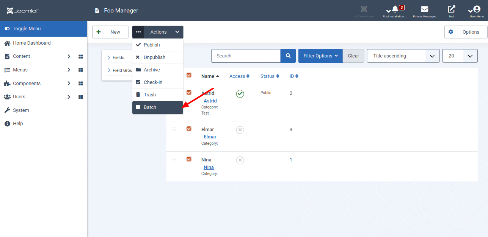
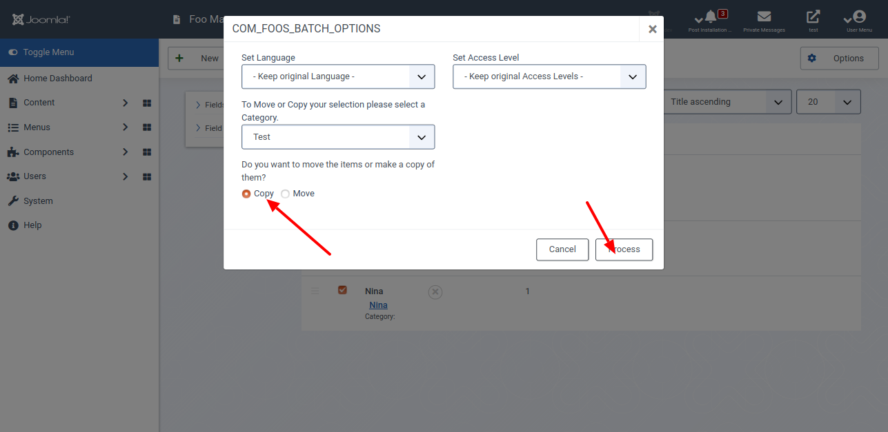

Joomla! bietet eine Reihe von Funktionen, mit denen es Administratoren möglich ist, mehrere Items auf einen Schlag zu bearbeiten. Diese Stapelverarbeitung (englisch Batch) fügen wir jetzt zur Komponente hinzu. Darauf aufbauend ist dir möglich, eigenen Funktionen hinzuzufügen.

## Für Ungeduldige

Sieh dir den geänderten Programmcode in der [Diff-Ansicht](https://github.com/astridx/boilerplate/compare/t25...t26) an und übernimm diese Änderungen in deine Entwicklungsversion.

Eine ausführlichere Erklärung des geänderten Programmcodes findest du weiter unten. 

## Teste deine Joomla-Komponente

1. Installiere deine Komponente in Joomla! Version 4, um sie zu testen:

Kopiere die Dateien im `administrator` Ordner in den `administrator` Ordner deiner Joomla! 4 Installation.  
Kopiere die Dateien im `components` Ordner in den `components` Ordner deiner Joomla! 4 Installation.  
Kopiere die Dateien im `media` Ordner in den `media` Ordner deiner Joomla! 4 Installation. 

Eine neue Installation ist nicht erforderlich. Verwende die aus dem vorhergehenden Teil weiter.

2. Öffne die Ansicht deiner Komponente im Administrationsbereich. In der Werkzeugleiste siehst du eine Auswahlliste zum Anstoßen von verschiedenen Aktionen. Klicke den Eintrag `Batch`.

3. Teste die Stapelverarbeitung.

## Geänderte Dateien

### Übersicht

      

    

        Files changed (8)
        <a class="d2h-file-switch d2h-hide">hide</a>
        <a class="d2h-file-switch d2h-show">show</a>
    

    <ol class="d2h-file-list">
    <li class="d2h-file-list-line">
    
      <svg aria-hidden="true" class="d2h-icon d2h-changed" height="16" title="modified" version="1.1"
           viewBox="0 0 14 16" width="14">
          <path d="M13 1H1C0.45 1 0 1.45 0 2v12c0 0.55 0.45 1 1 1h12c0.55 0 1-0.45 1-1V2c0-0.55-0.45-1-1-1z m0 13H1V2h12v12zM4 8c0-1.66 1.34-3 3-3s3 1.34 3 3-1.34 3-3 3-3-1.34-3-3z"></path>
      </svg>      <a href="#d2h-850660" class="d2h-file-name">src/administrator/components/com_foos/src/Controller/FooController.php</a>
      
          +21
          -0
      
    
</li>
<li class="d2h-file-list-line">
    
      <svg aria-hidden="true" class="d2h-icon d2h-changed" height="16" title="modified" version="1.1"
           viewBox="0 0 14 16" width="14">
          <path d="M13 1H1C0.45 1 0 1.45 0 2v12c0 0.55 0.45 1 1 1h12c0.55 0 1-0.45 1-1V2c0-0.55-0.45-1-1-1z m0 13H1V2h12v12zM4 8c0-1.66 1.34-3 3-3s3 1.34 3 3-1.34 3-3 3-3-1.34-3-3z"></path>
      </svg>      <a href="#d2h-206858" class="d2h-file-name">src/administrator/components/com_foos/src/Model/FooModel.php</a>
      
          +18
          -0
      
    
</li>
<li class="d2h-file-list-line">
    
      <svg aria-hidden="true" class="d2h-icon d2h-changed" height="16" title="modified" version="1.1"
           viewBox="0 0 14 16" width="14">
          <path d="M13 1H1C0.45 1 0 1.45 0 2v12c0 0.55 0.45 1 1 1h12c0.55 0 1-0.45 1-1V2c0-0.55-0.45-1-1-1z m0 13H1V2h12v12zM4 8c0-1.66 1.34-3 3-3s3 1.34 3 3-1.34 3-3 3-3-1.34-3-3z"></path>
      </svg>      <a href="#d2h-529131" class="d2h-file-name">src/administrator/components/com_foos/src/View/Foos/HtmlView.php</a>
      
          +18
          -7
      
    
</li>
<li class="d2h-file-list-line">
    
      <svg aria-hidden="true" class="d2h-icon d2h-changed" height="16" title="modified" version="1.1"
           viewBox="0 0 14 16" width="14">
          <path d="M13 1H1C0.45 1 0 1.45 0 2v12c0 0.55 0.45 1 1 1h12c0.55 0 1-0.45 1-1V2c0-0.55-0.45-1-1-1z m0 13H1V2h12v12zM4 8c0-1.66 1.34-3 3-3s3 1.34 3 3-1.34 3-3 3-3-1.34-3-3z"></path>
      </svg>      <a href="#d2h-426783" class="d2h-file-name">src/administrator/components/com_foos/tmpl/foo/edit.php</a>
      
          +1
          -0
      
    
</li>
<li class="d2h-file-list-line">
    
      <svg aria-hidden="true" class="d2h-icon d2h-changed" height="16" title="modified" version="1.1"
           viewBox="0 0 14 16" width="14">
          <path d="M13 1H1C0.45 1 0 1.45 0 2v12c0 0.55 0.45 1 1 1h12c0.55 0 1-0.45 1-1V2c0-0.55-0.45-1-1-1z m0 13H1V2h12v12zM4 8c0-1.66 1.34-3 3-3s3 1.34 3 3-1.34 3-3 3-3-1.34-3-3z"></path>
      </svg>      <a href="#d2h-900341" class="d2h-file-name">src/administrator/components/com_foos/tmpl/foos/default.php</a>
      
          +10
          -0
      
    
</li>
<li class="d2h-file-list-line">
    
      <svg aria-hidden="true" class="d2h-icon d2h-added" height="16" title="added" version="1.1" viewBox="0 0 14 16"
           width="14">
          <path d="M13 1H1C0.45 1 0 1.45 0 2v12c0 0.55 0.45 1 1 1h12c0.55 0 1-0.45 1-1V2c0-0.55-0.45-1-1-1z m0 13H1V2h12v12zM6 9H3V7h3V4h2v3h3v2H8v3H6V9z"></path>
      </svg>      <a href="#d2h-899194" class="d2h-file-name">src/administrator/components/com_foos/tmpl/foos/default_batch.php</a>
      
          +59
          -0
      
    
</li>
<li class="d2h-file-list-line">
    
      <svg aria-hidden="true" class="d2h-icon d2h-added" height="16" title="added" version="1.1" viewBox="0 0 14 16"
           width="14">
          <path d="M13 1H1C0.45 1 0 1.45 0 2v12c0 0.55 0.45 1 1 1h12c0.55 0 1-0.45 1-1V2c0-0.55-0.45-1-1-1z m0 13H1V2h12v12zM6 9H3V7h3V4h2v3h3v2H8v3H6V9z"></path>
      </svg>      <a href="#d2h-605135" class="d2h-file-name">src/administrator/components/com_foos/tmpl/foos/default_batch_body.php</a>
      
          +32
          -0
      
    
</li>
<li class="d2h-file-list-line">
    
      <svg aria-hidden="true" class="d2h-icon d2h-added" height="16" title="added" version="1.1" viewBox="0 0 14 16"
           width="14">
          <path d="M13 1H1C0.45 1 0 1.45 0 2v12c0 0.55 0.45 1 1 1h12c0.55 0 1-0.45 1-1V2c0-0.55-0.45-1-1-1z m0 13H1V2h12v12zM6 9H3V7h3V4h2v3h3v2H8v3H6V9z"></path>
      </svg>      <a href="#d2h-318600" class="d2h-file-name">src/administrator/components/com_foos/tmpl/foos/default_batch_footer.php</a>
      
          +12
          -0
      
    
</li>
    </ol>

    

    

    
    <svg aria-hidden="true" class="d2h-icon" height="16" version="1.1" viewBox="0 0 12 16" width="12">
        <path d="M6 5H2v-1h4v1zM2 8h7v-1H2v1z m0 2h7v-1H2v1z m0 2h7v-1H2v1z m10-7.5v9.5c0 0.55-0.45 1-1 1H1c-0.55 0-1-0.45-1-1V2c0-0.55 0.45-1 1-1h7.5l3.5 3.5z m-1 0.5L8 2H1v12h10V5z"></path>
    </svg>    src/administrator/components/com_foos/src/Controller/FooController.php
    CHANGED
    

    

        

            <table class="d2h-diff-table">
                <tbody class="d2h-diff-tbody">
                <tr>
    <td class="d2h-code-linenumber d2h-info"></td>
    <td class="d2h-info">
        
@@ -12,6 +12,7 @@ namespace Joomla\Component\Foos\Administrator\Controller;

    </td>
</tr><tr>
    <td class="d2h-code-linenumber d2h-cntx">
      
12

12

    </td>
    <td class="d2h-cntx">
        

            &nbsp;
            defined(&#x27;_JEXEC&#x27;) or die;
        

    </td>
</tr><tr>
    <td class="d2h-code-linenumber d2h-cntx">
      
13

13

    </td>
    <td class="d2h-cntx">
        

            &nbsp;
        

    </td>
</tr><tr>
    <td class="d2h-code-linenumber d2h-cntx">
      
14

14

    </td>
    <td class="d2h-cntx">
        

            &nbsp;
            use Joomla\CMS\MVC\Controller\FormController;
        

    </td>
</tr><tr>
    <td class="d2h-code-linenumber d2h-ins">
      

15

    </td>
    <td class="d2h-ins">
        

            +
            use Joomla\CMS\Router\Route;
        

    </td>
</tr><tr>
    <td class="d2h-code-linenumber d2h-cntx">
      
15

16

    </td>
    <td class="d2h-cntx">
        

            &nbsp;
        

    </td>
</tr><tr>
    <td class="d2h-code-linenumber d2h-cntx">
      
16

17

    </td>
    <td class="d2h-cntx">
        

            &nbsp;
            &#x2F;**
        

    </td>
</tr><tr>
    <td class="d2h-code-linenumber d2h-cntx">
      
17

18

    </td>
    <td class="d2h-cntx">
        

            &nbsp;
             * Controller for a single foo
        

    </td>
</tr>
<tr>
    <td class="d2h-code-linenumber d2h-info"></td>
    <td class="d2h-info">
        
@@ -20,4 +21,24 @@ use Joomla\CMS\MVC\Controller\FormController;

    </td>
</tr><tr>
    <td class="d2h-code-linenumber d2h-cntx">
      
20

21

    </td>
    <td class="d2h-cntx">
        

            &nbsp;
             *&#x2F;
        

    </td>
</tr><tr>
    <td class="d2h-code-linenumber d2h-cntx">
      
21

22

    </td>
    <td class="d2h-cntx">
        

            &nbsp;
            class FooController extends FormController
        

    </td>
</tr><tr>
    <td class="d2h-code-linenumber d2h-cntx">
      
22

23

    </td>
    <td class="d2h-cntx">
        

            &nbsp;
            {
        

    </td>
</tr><tr>
    <td class="d2h-code-linenumber d2h-ins">
      

24

    </td>
    <td class="d2h-ins">
        

            +
            	&#x2F;**
        

    </td>
</tr><tr>
    <td class="d2h-code-linenumber d2h-ins">
      

25

    </td>
    <td class="d2h-ins">
        

            +
            	 * Method to run batch operations.
        

    </td>
</tr><tr>
    <td class="d2h-code-linenumber d2h-ins">
      

26

    </td>
    <td class="d2h-ins">
        

            +
            	 *
        

    </td>
</tr><tr>
    <td class="d2h-code-linenumber d2h-ins">
      

27

    </td>
    <td class="d2h-ins">
        

            +
            	 * @param   object  $model  The model.
        

    </td>
</tr><tr>
    <td class="d2h-code-linenumber d2h-ins">
      

28

    </td>
    <td class="d2h-ins">
        

            +
            	 *
        

    </td>
</tr><tr>
    <td class="d2h-code-linenumber d2h-ins">
      

29

    </td>
    <td class="d2h-ins">
        

            +
            	 * @return  boolean   True if successful, false otherwise and internal error is set.
        

    </td>
</tr><tr>
    <td class="d2h-code-linenumber d2h-ins">
      

30

    </td>
    <td class="d2h-ins">
        

            +
            	 *
        

    </td>
</tr><tr>
    <td class="d2h-code-linenumber d2h-ins">
      

31

    </td>
    <td class="d2h-ins">
        

            +
            	 * @since   __BUMP_VERSION__
        

    </td>
</tr><tr>
    <td class="d2h-code-linenumber d2h-ins">
      

32

    </td>
    <td class="d2h-ins">
        

            +
            	 *&#x2F;
        

    </td>
</tr><tr>
    <td class="d2h-code-linenumber d2h-ins">
      

33

    </td>
    <td class="d2h-ins">
        

            +
            	public function batch($model = null)
        

    </td>
</tr><tr>
    <td class="d2h-code-linenumber d2h-ins">
      

34

    </td>
    <td class="d2h-ins">
        

            +
            	{
        

    </td>
</tr><tr>
    <td class="d2h-code-linenumber d2h-ins">
      

35

    </td>
    <td class="d2h-ins">
        

            +
            		$this-&gt;checkToken();
        

    </td>
</tr><tr>
    <td class="d2h-code-linenumber d2h-ins">
      

36

    </td>
    <td class="d2h-ins">
        

            +
        

    </td>
</tr><tr>
    <td class="d2h-code-linenumber d2h-ins">
      

37

    </td>
    <td class="d2h-ins">
        

            +
            		$model = $this-&gt;getModel(&#x27;Foo&#x27;, &#x27;Administrator&#x27;, array());
        

    </td>
</tr><tr>
    <td class="d2h-code-linenumber d2h-ins">
      

38

    </td>
    <td class="d2h-ins">
        

            +
        

    </td>
</tr><tr>
    <td class="d2h-code-linenumber d2h-ins">
      

39

    </td>
    <td class="d2h-ins">
        

            +
            		&#x2F;&#x2F; Preset the redirect
        

    </td>
</tr><tr>
    <td class="d2h-code-linenumber d2h-ins">
      

40

    </td>
    <td class="d2h-ins">
        

            +
            		$this-&gt;setRedirect(Route::_(&#x27;index.php?option=com_foos&amp;view=foos&#x27; . $this-&gt;getRedirectToListAppend(), false));
        

    </td>
</tr><tr>
    <td class="d2h-code-linenumber d2h-ins">
      

41

    </td>
    <td class="d2h-ins">
        

            +
        

    </td>
</tr><tr>
    <td class="d2h-code-linenumber d2h-ins">
      

42

    </td>
    <td class="d2h-ins">
        

            +
            		return parent::batch($model);
        

    </td>
</tr><tr>
    <td class="d2h-code-linenumber d2h-ins">
      

43

    </td>
    <td class="d2h-ins">
        

            +
            	}
        

    </td>
</tr><tr>
    <td class="d2h-code-linenumber d2h-cntx">
      
23

44

    </td>
    <td class="d2h-cntx">
        

            &nbsp;
            }
        

    </td>
</tr>
                </tbody>
            </table>
        

    

    

    
    <svg aria-hidden="true" class="d2h-icon" height="16" version="1.1" viewBox="0 0 12 16" width="12">
        <path d="M6 5H2v-1h4v1zM2 8h7v-1H2v1z m0 2h7v-1H2v1z m0 2h7v-1H2v1z m10-7.5v9.5c0 0.55-0.45 1-1 1H1c-0.55 0-1-0.45-1-1V2c0-0.55 0.45-1 1-1h7.5l3.5 3.5z m-1 0.5L8 2H1v12h10V5z"></path>
    </svg>    src/administrator/components/com_foos/src/Model/FooModel.php
    CHANGED
    

    

        

            <table class="d2h-diff-table">
                <tbody class="d2h-diff-tbody">
                <tr>
    <td class="d2h-code-linenumber d2h-info"></td>
    <td class="d2h-info">
        
@@ -39,6 +39,24 @@ class FooModel extends AdminModel

    </td>
</tr><tr>
    <td class="d2h-code-linenumber d2h-cntx">
      
39

39

    </td>
    <td class="d2h-cntx">
        

            &nbsp;
            	 *&#x2F;
        

    </td>
</tr><tr>
    <td class="d2h-code-linenumber d2h-cntx">
      
40

40

    </td>
    <td class="d2h-cntx">
        

            &nbsp;
            	protected $associationsContext = &#x27;com_foos.item&#x27;;
        

    </td>
</tr><tr>
    <td class="d2h-code-linenumber d2h-cntx">
      
41

41

    </td>
    <td class="d2h-cntx">
        

            &nbsp;
        

    </td>
</tr><tr>
    <td class="d2h-code-linenumber d2h-ins">
      

42

    </td>
    <td class="d2h-ins">
        

            +
            	&#x2F;**
        

    </td>
</tr><tr>
    <td class="d2h-code-linenumber d2h-ins">
      

43

    </td>
    <td class="d2h-ins">
        

            +
            	 * Batch copy&#x2F;move command. If set to false, the batch copy&#x2F;move command is not supported
        

    </td>
</tr><tr>
    <td class="d2h-code-linenumber d2h-ins">
      

44

    </td>
    <td class="d2h-ins">
        

            +
            	 *
        

    </td>
</tr><tr>
    <td class="d2h-code-linenumber d2h-ins">
      

45

    </td>
    <td class="d2h-ins">
        

            +
            	 * @var  string
        

    </td>
</tr><tr>
    <td class="d2h-code-linenumber d2h-ins">
      

46

    </td>
    <td class="d2h-ins">
        

            +
            	 *&#x2F;
        

    </td>
</tr><tr>
    <td class="d2h-code-linenumber d2h-ins">
      

47

    </td>
    <td class="d2h-ins">
        

            +
            	protected $batch_copymove = &#x27;category_id&#x27;;
        

    </td>
</tr><tr>
    <td class="d2h-code-linenumber d2h-ins">
      

48

    </td>
    <td class="d2h-ins">
        

            +
        

    </td>
</tr><tr>
    <td class="d2h-code-linenumber d2h-ins">
      

49

    </td>
    <td class="d2h-ins">
        

            +
            	&#x2F;**
        

    </td>
</tr><tr>
    <td class="d2h-code-linenumber d2h-ins">
      

50

    </td>
    <td class="d2h-ins">
        

            +
            	 * Allowed batch commands
        

    </td>
</tr><tr>
    <td class="d2h-code-linenumber d2h-ins">
      

51

    </td>
    <td class="d2h-ins">
        

            +
            	 *
        

    </td>
</tr><tr>
    <td class="d2h-code-linenumber d2h-ins">
      

52

    </td>
    <td class="d2h-ins">
        

            +
            	 * @var array
        

    </td>
</tr><tr>
    <td class="d2h-code-linenumber d2h-ins">
      

53

    </td>
    <td class="d2h-ins">
        

            +
            	 *&#x2F;
        

    </td>
</tr><tr>
    <td class="d2h-code-linenumber d2h-ins">
      

54

    </td>
    <td class="d2h-ins">
        

            +
            	protected $batch_commands = array(
        

    </td>
</tr><tr>
    <td class="d2h-code-linenumber d2h-ins">
      

55

    </td>
    <td class="d2h-ins">
        

            +
            		&#x27;assetgroup_id&#x27; =&gt; &#x27;batchAccess&#x27;,
        

    </td>
</tr><tr>
    <td class="d2h-code-linenumber d2h-ins">
      

56

    </td>
    <td class="d2h-ins">
        

            +
            		&#x27;language_id&#x27;   =&gt; &#x27;batchLanguage&#x27;,
        

    </td>
</tr><tr>
    <td class="d2h-code-linenumber d2h-ins">
      

57

    </td>
    <td class="d2h-ins">
        

            +
            		&#x27;user_id&#x27;       =&gt; &#x27;batchUser&#x27;,
        

    </td>
</tr><tr>
    <td class="d2h-code-linenumber d2h-ins">
      

58

    </td>
    <td class="d2h-ins">
        

            +
            	);
        

    </td>
</tr><tr>
    <td class="d2h-code-linenumber d2h-ins">
      

59

    </td>
    <td class="d2h-ins">
        

            +
        

    </td>
</tr><tr>
    <td class="d2h-code-linenumber d2h-cntx">
      
42

60

    </td>
    <td class="d2h-cntx">
        

            &nbsp;
            	&#x2F;**
        

    </td>
</tr><tr>
    <td class="d2h-code-linenumber d2h-cntx">
      
43

61

    </td>
    <td class="d2h-cntx">
        

            &nbsp;
            	 * Method to get the row form.
        

    </td>
</tr><tr>
    <td class="d2h-code-linenumber d2h-cntx">
      
44

62

    </td>
    <td class="d2h-cntx">
        

            &nbsp;
            	 *
        

    </td>
</tr>
                </tbody>
            </table>
        

    

    

    
    <svg aria-hidden="true" class="d2h-icon" height="16" version="1.1" viewBox="0 0 12 16" width="12">
        <path d="M6 5H2v-1h4v1zM2 8h7v-1H2v1z m0 2h7v-1H2v1z m0 2h7v-1H2v1z m10-7.5v9.5c0 0.55-0.45 1-1 1H1c-0.55 0-1-0.45-1-1V2c0-0.55 0.45-1 1-1h7.5l3.5 3.5z m-1 0.5L8 2H1v12h10V5z"></path>
    </svg>    src/administrator/components/com_foos/src/View/Foos/HtmlView.php
    CHANGED
    

    

        

            <table class="d2h-diff-table">
                <tbody class="d2h-diff-tbody">
                <tr>
    <td class="d2h-code-linenumber d2h-info"></td>
    <td class="d2h-info">
        
@@ -175,14 +175,25 @@ class HtmlView extends BaseHtmlView

    </td>
</tr><tr>
    <td class="d2h-code-linenumber d2h-cntx">
      
175

175

    </td>
    <td class="d2h-cntx">
        

            &nbsp;
            			{
        

    </td>
</tr><tr>
    <td class="d2h-code-linenumber d2h-cntx">
      
176

176

    </td>
    <td class="d2h-cntx">
        

            &nbsp;
            				$childBar-&gt;trash(&#x27;foos.trash&#x27;)-&gt;listCheck(true);
        

    </td>
</tr><tr>
    <td class="d2h-code-linenumber d2h-cntx">
      
177

177

    </td>
    <td class="d2h-cntx">
        

            &nbsp;
            			}
        

    </td>
</tr><tr>
    <td class="d2h-code-linenumber d2h-del">
      
178

    </td>
    <td class="d2h-del">
        

            -
            		}
        

    </td>
</tr><tr>
    <td class="d2h-code-linenumber d2h-cntx">
      
179

178

    </td>
    <td class="d2h-cntx">
        

            &nbsp;
        

    </td>
</tr><tr>
    <td class="d2h-code-linenumber d2h-del d2h-change">
      
180

    </td>
    <td class="d2h-del d2h-change">
        

            -
            <del>		</del>if ($this-&gt;state-&gt;get(&#x27;filter.published&#x27;) == -2 &amp;&amp; $canDo-&gt;get(&#x27;core.delete&#x27;))
        

    </td>
</tr><tr>
    <td class="d2h-code-linenumber d2h-del d2h-change">
      
181

    </td>
    <td class="d2h-del d2h-change">
        

            -
            <del>		</del>{
        

    </td>
</tr><tr>
    <td class="d2h-code-linenumber d2h-del d2h-change">
      
182

    </td>
    <td class="d2h-del d2h-change">
        

            -
            <del>			</del>$<del>toolbar</del>-&gt;delete(&#x27;foos.delete&#x27;)
        

    </td>
</tr><tr>
    <td class="d2h-code-linenumber d2h-del d2h-change">
      
183

    </td>
    <td class="d2h-del d2h-change">
        

            -
            <del>				</del>-&gt;text(&#x27;JTOOLBAR_EMPTY_TRASH&#x27;)
        

    </td>
</tr><tr>
    <td class="d2h-code-linenumber d2h-del d2h-change">
      
184

    </td>
    <td class="d2h-del d2h-change">
        

            -
            <del>				</del>-&gt;message(&#x27;JGLOBAL_CONFIRM_DELETE&#x27;)
        

    </td>
</tr><tr>
    <td class="d2h-code-linenumber d2h-del d2h-change">
      
185

    </td>
    <td class="d2h-del d2h-change">
        

            -
            <del>				</del>-&gt;listCheck(true);
        

    </td>
</tr><tr>
    <td class="d2h-code-linenumber d2h-ins d2h-change">
      

179

    </td>
    <td class="d2h-ins d2h-change">
        

            +
            <ins>			</ins>if ($this-&gt;state-&gt;get(&#x27;filter.published&#x27;) == -2 &amp;&amp; $canDo-&gt;get(&#x27;core.delete&#x27;))
        

    </td>
</tr><tr>
    <td class="d2h-code-linenumber d2h-ins d2h-change">
      

180

    </td>
    <td class="d2h-ins d2h-change">
        

            +
            <ins>			</ins>{
        

    </td>
</tr><tr>
    <td class="d2h-code-linenumber d2h-ins d2h-change">
      

181

    </td>
    <td class="d2h-ins d2h-change">
        

            +
            <ins>				</ins>$<ins>childBar</ins>-&gt;delete(&#x27;foos.delete&#x27;)
        

    </td>
</tr><tr>
    <td class="d2h-code-linenumber d2h-ins d2h-change">
      

182

    </td>
    <td class="d2h-ins d2h-change">
        

            +
            <ins>					</ins>-&gt;text(&#x27;JTOOLBAR_EMPTY_TRASH&#x27;)
        

    </td>
</tr><tr>
    <td class="d2h-code-linenumber d2h-ins d2h-change">
      

183

    </td>
    <td class="d2h-ins d2h-change">
        

            +
            <ins>					</ins>-&gt;message(&#x27;JGLOBAL_CONFIRM_DELETE&#x27;)
        

    </td>
</tr><tr>
    <td class="d2h-code-linenumber d2h-ins d2h-change">
      

184

    </td>
    <td class="d2h-ins d2h-change">
        

            +
            <ins>					</ins>-&gt;listCheck(true);
        

    </td>
</tr><tr>
    <td class="d2h-code-linenumber d2h-ins">
      

185

    </td>
    <td class="d2h-ins">
        

            +
            			}
        

    </td>
</tr><tr>
    <td class="d2h-code-linenumber d2h-ins">
      

186

    </td>
    <td class="d2h-ins">
        

            +
        

    </td>
</tr><tr>
    <td class="d2h-code-linenumber d2h-ins">
      

187

    </td>
    <td class="d2h-ins">
        

            +
            			&#x2F;&#x2F; Add a batch button
        

    </td>
</tr><tr>
    <td class="d2h-code-linenumber d2h-ins">
      

188

    </td>
    <td class="d2h-ins">
        

            +
            			if ($user-&gt;authorise(&#x27;core.create&#x27;, &#x27;com_foos&#x27;)
        

    </td>
</tr><tr>
    <td class="d2h-code-linenumber d2h-ins">
      

189

    </td>
    <td class="d2h-ins">
        

            +
            				&amp;&amp; $user-&gt;authorise(&#x27;core.edit&#x27;, &#x27;com_foos&#x27;)
        

    </td>
</tr><tr>
    <td class="d2h-code-linenumber d2h-ins">
      

190

    </td>
    <td class="d2h-ins">
        

            +
            				&amp;&amp; $user-&gt;authorise(&#x27;core.edit.state&#x27;, &#x27;com_foos&#x27;))
        

    </td>
</tr><tr>
    <td class="d2h-code-linenumber d2h-ins">
      

191

    </td>
    <td class="d2h-ins">
        

            +
            			{
        

    </td>
</tr><tr>
    <td class="d2h-code-linenumber d2h-ins">
      

192

    </td>
    <td class="d2h-ins">
        

            +
            				$childBar-&gt;popupButton(&#x27;batch&#x27;)
        

    </td>
</tr><tr>
    <td class="d2h-code-linenumber d2h-ins">
      

193

    </td>
    <td class="d2h-ins">
        

            +
            					-&gt;text(&#x27;JTOOLBAR_BATCH&#x27;)
        

    </td>
</tr><tr>
    <td class="d2h-code-linenumber d2h-ins">
      

194

    </td>
    <td class="d2h-ins">
        

            +
            					-&gt;selector(&#x27;collapseModal&#x27;)
        

    </td>
</tr><tr>
    <td class="d2h-code-linenumber d2h-ins">
      

195

    </td>
    <td class="d2h-ins">
        

            +
            					-&gt;listCheck(true);
        

    </td>
</tr><tr>
    <td class="d2h-code-linenumber d2h-ins">
      

196

    </td>
    <td class="d2h-ins">
        

            +
            			}
        

    </td>
</tr><tr>
    <td class="d2h-code-linenumber d2h-cntx">
      
186

197

    </td>
    <td class="d2h-cntx">
        

            &nbsp;
            		}
        

    </td>
</tr><tr>
    <td class="d2h-code-linenumber d2h-cntx">
      
187

198

    </td>
    <td class="d2h-cntx">
        

            &nbsp;
        

    </td>
</tr><tr>
    <td class="d2h-code-linenumber d2h-cntx">
      
188

199

    </td>
    <td class="d2h-cntx">
        

            &nbsp;
            		if ($user-&gt;authorise(&#x27;core.admin&#x27;, &#x27;com_foos&#x27;) || $user-&gt;authorise(&#x27;core.options&#x27;, &#x27;com_foos&#x27;))
        

    </td>
</tr>
                </tbody>
            </table>
        

    

    

    
    <svg aria-hidden="true" class="d2h-icon" height="16" version="1.1" viewBox="0 0 12 16" width="12">
        <path d="M6 5H2v-1h4v1zM2 8h7v-1H2v1z m0 2h7v-1H2v1z m0 2h7v-1H2v1z m10-7.5v9.5c0 0.55-0.45 1-1 1H1c-0.55 0-1-0.45-1-1V2c0-0.55 0.45-1 1-1h7.5l3.5 3.5z m-1 0.5L8 2H1v12h10V5z"></path>
    </svg>    src/administrator/components/com_foos/tmpl/foo/edit.php
    CHANGED
    

    

        

            <table class="d2h-diff-table">
                <tbody class="d2h-diff-tbody">
                <tr>
    <td class="d2h-code-linenumber d2h-info"></td>
    <td class="d2h-info">
        
@@ -34,6 +34,7 @@ $tmpl    = $isModal || $input->get('tmpl', '', 'cmd') === 'component' ? '&tmpl=c

    </td>
</tr><tr>
    <td class="d2h-code-linenumber d2h-cntx">
      
34

34

    </td>
    <td class="d2h-cntx">
        

            &nbsp;
            ?&gt;
        

    </td>
</tr><tr>
    <td class="d2h-code-linenumber d2h-cntx">
      
35

35

    </td>
    <td class="d2h-cntx">
        

            &nbsp;
            &lt;input type=&quot;text&quot; readonly id=&quot;jform_id&quot; name=&quot;jform_id&quot; value=&quot;&lt;?php echo (int) $this-&gt;item-&gt;id ?&gt;&quot;&gt;
        

    </td>
</tr><tr>
    <td class="d2h-code-linenumber d2h-cntx">
      
36

36

    </td>
    <td class="d2h-cntx">
        

            &nbsp;
            &lt;form action=&quot;&lt;?php echo Route::_(&#x27;index.php?option=com_foos&amp;layout=&#x27; . $layout . $tmpl . &#x27;&amp;id=&#x27; . (int) $this-&gt;item-&gt;id); ?&gt;&quot; method=&quot;post&quot; name=&quot;adminForm&quot; id=&quot;foo-form&quot; class=&quot;form-validate&quot;&gt;
        

    </td>
</tr><tr>
    <td class="d2h-code-linenumber d2h-ins">
      

37

    </td>
    <td class="d2h-ins">
        

            +
        

    </td>
</tr><tr>
    <td class="d2h-code-linenumber d2h-cntx">
      
37

38

    </td>
    <td class="d2h-cntx">
        

            &nbsp;
            	&lt;div&gt;
        

    </td>
</tr><tr>
    <td class="d2h-code-linenumber d2h-cntx">
      
38

39

    </td>
    <td class="d2h-cntx">
        

            &nbsp;
            		&lt;?php echo HTMLHelper::_(&#x27;uitab.startTabSet&#x27;, &#x27;myTab&#x27;, array(&#x27;active&#x27; =&gt; &#x27;details&#x27;)); ?&gt;
        

    </td>
</tr><tr>
    <td class="d2h-code-linenumber d2h-cntx">
      
39

40

    </td>
    <td class="d2h-cntx">
        

            &nbsp;
        

    </td>
</tr>
                </tbody>
            </table>
        

    

    

    
    <svg aria-hidden="true" class="d2h-icon" height="16" version="1.1" viewBox="0 0 12 16" width="12">
        <path d="M6 5H2v-1h4v1zM2 8h7v-1H2v1z m0 2h7v-1H2v1z m0 2h7v-1H2v1z m10-7.5v9.5c0 0.55-0.45 1-1 1H1c-0.55 0-1-0.45-1-1V2c0-0.55 0.45-1 1-1h7.5l3.5 3.5z m-1 0.5L8 2H1v12h10V5z"></path>
    </svg>    src/administrator/components/com_foos/tmpl/foos/default.php
    CHANGED
    

    

        

            <table class="d2h-diff-table">
                <tbody class="d2h-diff-tbody">
                <tr>
    <td class="d2h-code-linenumber d2h-info"></td>
    <td class="d2h-info">
        
@@ -156,6 +156,16 @@ if ($saveOrder && !empty($this->items))

    </td>
</tr><tr>
    <td class="d2h-code-linenumber d2h-cntx">
      
156

156

    </td>
    <td class="d2h-cntx">
        

            &nbsp;
        

    </td>
</tr><tr>
    <td class="d2h-code-linenumber d2h-cntx">
      
157

157

    </td>
    <td class="d2h-cntx">
        

            &nbsp;
            					&lt;?php echo $this-&gt;pagination-&gt;getListFooter(); ?&gt;
        

    </td>
</tr><tr>
    <td class="d2h-code-linenumber d2h-cntx">
      
158

158

    </td>
    <td class="d2h-cntx">
        

            &nbsp;
            				
        

    </td>
</tr><tr>
    <td class="d2h-code-linenumber d2h-ins">
      

159

    </td>
    <td class="d2h-ins">
        

            +
            					&lt;?php echo HTMLHelper::_(
        

    </td>
</tr><tr>
    <td class="d2h-code-linenumber d2h-ins">
      

160

    </td>
    <td class="d2h-ins">
        

            +
            						&#x27;bootstrap.renderModal&#x27;,
        

    </td>
</tr><tr>
    <td class="d2h-code-linenumber d2h-ins">
      

161

    </td>
    <td class="d2h-ins">
        

            +
            						&#x27;collapseModal&#x27;,
        

    </td>
</tr><tr>
    <td class="d2h-code-linenumber d2h-ins">
      

162

    </td>
    <td class="d2h-ins">
        

            +
            						array(
        

    </td>
</tr><tr>
    <td class="d2h-code-linenumber d2h-ins">
      

163

    </td>
    <td class="d2h-ins">
        

            +
            							&#x27;title&#x27;  =&gt; Text::_(&#x27;COM_FOOS_BATCH_OPTIONS&#x27;),
        

    </td>
</tr><tr>
    <td class="d2h-code-linenumber d2h-ins">
      

164

    </td>
    <td class="d2h-ins">
        

            +
            							&#x27;footer&#x27; =&gt; $this-&gt;loadTemplate(&#x27;batch_footer&#x27;),
        

    </td>
</tr><tr>
    <td class="d2h-code-linenumber d2h-ins">
      

165

    </td>
    <td class="d2h-ins">
        

            +
            						),
        

    </td>
</tr><tr>
    <td class="d2h-code-linenumber d2h-ins">
      

166

    </td>
    <td class="d2h-ins">
        

            +
            						$this-&gt;loadTemplate(&#x27;batch_body&#x27;)
        

    </td>
</tr><tr>
    <td class="d2h-code-linenumber d2h-ins">
      

167

    </td>
    <td class="d2h-ins">
        

            +
            					); ?&gt;
        

    </td>
</tr><tr>
    <td class="d2h-code-linenumber d2h-ins">
      

168

    </td>
    <td class="d2h-ins">
        

            +
        

    </td>
</tr><tr>
    <td class="d2h-code-linenumber d2h-cntx">
      
159

169

    </td>
    <td class="d2h-cntx">
        

            &nbsp;
            				&lt;?php endif; ?&gt;
        

    </td>
</tr><tr>
    <td class="d2h-code-linenumber d2h-cntx">
      
160

170

    </td>
    <td class="d2h-cntx">
        

            &nbsp;
            				&lt;input type=&quot;hidden&quot; name=&quot;task&quot; value=&quot;&quot;&gt;
        

    </td>
</tr><tr>
    <td class="d2h-code-linenumber d2h-cntx">
      
161

171

    </td>
    <td class="d2h-cntx">
        

            &nbsp;
            				&lt;input type=&quot;hidden&quot; name=&quot;boxchecked&quot; value=&quot;0&quot;&gt;
        

    </td>
</tr>
                </tbody>
            </table>
        

    

    

    
    <svg aria-hidden="true" class="d2h-icon" height="16" version="1.1" viewBox="0 0 12 16" width="12">
        <path d="M6 5H2v-1h4v1zM2 8h7v-1H2v1z m0 2h7v-1H2v1z m0 2h7v-1H2v1z m10-7.5v9.5c0 0.55-0.45 1-1 1H1c-0.55 0-1-0.45-1-1V2c0-0.55 0.45-1 1-1h7.5l3.5 3.5z m-1 0.5L8 2H1v12h10V5z"></path>
    </svg>    src/administrator/components/com_foos/tmpl/foos/default_batch.php
    ADDED
    

    

        

            <table class="d2h-diff-table">
                <tbody class="d2h-diff-tbody">
                <tr>
    <td class="d2h-code-linenumber d2h-info"></td>
    <td class="d2h-info">
        
@@ -0,0 +1,59 @@

    </td>
</tr><tr>
    <td class="d2h-code-linenumber d2h-ins">
      

1

    </td>
    <td class="d2h-ins">
        

            +
            &lt;?php
        

    </td>
</tr><tr>
    <td class="d2h-code-linenumber d2h-ins">
      

2

    </td>
    <td class="d2h-ins">
        

            +
        

    </td>
</tr><tr>
    <td class="d2h-code-linenumber d2h-ins">
      

3

    </td>
    <td class="d2h-ins">
        

            +
            defined(&#x27;_JEXEC&#x27;) or die;
        

    </td>
</tr><tr>
    <td class="d2h-code-linenumber d2h-ins">
      

4

    </td>
    <td class="d2h-ins">
        

            +
        

    </td>
</tr><tr>
    <td class="d2h-code-linenumber d2h-ins">
      

5

    </td>
    <td class="d2h-ins">
        

            +
            use Joomla\CMS\Language\Text;
        

    </td>
</tr><tr>
    <td class="d2h-code-linenumber d2h-ins">
      

6

    </td>
    <td class="d2h-ins">
        

            +
            use Joomla\CMS\Layout\LayoutHelper;
        

    </td>
</tr><tr>
    <td class="d2h-code-linenumber d2h-ins">
      

7

    </td>
    <td class="d2h-ins">
        

            +
        

    </td>
</tr><tr>
    <td class="d2h-code-linenumber d2h-ins">
      

8

    </td>
    <td class="d2h-ins">
        

            +
            $published = $this-&gt;state-&gt;get(&#x27;filter.published&#x27;);
        

    </td>
</tr><tr>
    <td class="d2h-code-linenumber d2h-ins">
      

9

    </td>
    <td class="d2h-ins">
        

            +
            $noUser = true;
        

    </td>
</tr><tr>
    <td class="d2h-code-linenumber d2h-ins">
      

10

    </td>
    <td class="d2h-ins">
        

            +
            ?&gt;
        

    </td>
</tr><tr>
    <td class="d2h-code-linenumber d2h-ins">
      

11

    </td>
    <td class="d2h-ins">
        

            +
            &lt;div class=&quot;modal hide fade&quot; id=&quot;collapseModal&quot;&gt;
        

    </td>
</tr><tr>
    <td class="d2h-code-linenumber d2h-ins">
      

12

    </td>
    <td class="d2h-ins">
        

            +
            	&lt;div class=&quot;modal-header&quot;&gt;
        

    </td>
</tr><tr>
    <td class="d2h-code-linenumber d2h-ins">
      

13

    </td>
    <td class="d2h-ins">
        

            +
            		&lt;button type=&quot;button&quot; class=&quot;close&quot; data-dismiss=&quot;modal&quot;&gt;&amp;#215;&lt;&#x2F;button&gt;
        

    </td>
</tr><tr>
    <td class="d2h-code-linenumber d2h-ins">
      

14

    </td>
    <td class="d2h-ins">
        

            +
            		&lt;h3&gt;&lt;?php echo Text::_(&#x27;COM_FOOS_BATCH_OPTIONS&#x27;); ?&gt;&lt;&#x2F;h3&gt;
        

    </td>
</tr><tr>
    <td class="d2h-code-linenumber d2h-ins">
      

15

    </td>
    <td class="d2h-ins">
        

            +
            	&lt;&#x2F;div&gt;
        

    </td>
</tr><tr>
    <td class="d2h-code-linenumber d2h-ins">
      

16

    </td>
    <td class="d2h-ins">
        

            +
            	&lt;div class=&quot;modal-body modal-batch&quot;&gt;
        

    </td>
</tr><tr>
    <td class="d2h-code-linenumber d2h-ins">
      

17

    </td>
    <td class="d2h-ins">
        

            +
            		&lt;p&gt;&lt;?php echo Text::_(&#x27;COM_FOOS_BATCH_TIP&#x27;); ?&gt;&lt;&#x2F;p&gt;
        

    </td>
</tr><tr>
    <td class="d2h-code-linenumber d2h-ins">
      

18

    </td>
    <td class="d2h-ins">
        

            +
            		&lt;div class=&quot;row&quot;&gt;
        

    </td>
</tr><tr>
    <td class="d2h-code-linenumber d2h-ins">
      

19

    </td>
    <td class="d2h-ins">
        

            +
            			&lt;div class=&quot;form-group col-md-6&quot;&gt;
        

    </td>
</tr><tr>
    <td class="d2h-code-linenumber d2h-ins">
      

20

    </td>
    <td class="d2h-ins">
        

            +
            				&lt;div class=&quot;controls&quot;&gt;
        

    </td>
</tr><tr>
    <td class="d2h-code-linenumber d2h-ins">
      

21

    </td>
    <td class="d2h-ins">
        

            +
            					&lt;?php echo LayoutHelper::render(&#x27;joomla.html.batch.language&#x27;, []); ?&gt;
        

    </td>
</tr><tr>
    <td class="d2h-code-linenumber d2h-ins">
      

22

    </td>
    <td class="d2h-ins">
        

            +
            				&lt;&#x2F;div&gt;
        

    </td>
</tr><tr>
    <td class="d2h-code-linenumber d2h-ins">
      

23

    </td>
    <td class="d2h-ins">
        

            +
            			&lt;&#x2F;div&gt;
        

    </td>
</tr><tr>
    <td class="d2h-code-linenumber d2h-ins">
      

24

    </td>
    <td class="d2h-ins">
        

            +
            			&lt;div class=&quot;form-group col-md-6&quot;&gt;
        

    </td>
</tr><tr>
    <td class="d2h-code-linenumber d2h-ins">
      

25

    </td>
    <td class="d2h-ins">
        

            +
            				&lt;div class=&quot;controls&quot;&gt;
        

    </td>
</tr><tr>
    <td class="d2h-code-linenumber d2h-ins">
      

26

    </td>
    <td class="d2h-ins">
        

            +
            					&lt;?php echo LayoutHelper::render(&#x27;joomla.html.batch.access&#x27;, []); ?&gt;
        

    </td>
</tr><tr>
    <td class="d2h-code-linenumber d2h-ins">
      

27

    </td>
    <td class="d2h-ins">
        

            +
            				&lt;&#x2F;div&gt;
        

    </td>
</tr><tr>
    <td class="d2h-code-linenumber d2h-ins">
      

28

    </td>
    <td class="d2h-ins">
        

            +
            			&lt;&#x2F;div&gt;
        

    </td>
</tr><tr>
    <td class="d2h-code-linenumber d2h-ins">
      

29

    </td>
    <td class="d2h-ins">
        

            +
            		&lt;&#x2F;div&gt;
        

    </td>
</tr><tr>
    <td class="d2h-code-linenumber d2h-ins">
      

30

    </td>
    <td class="d2h-ins">
        

            +
            		&lt;div class=&quot;row&quot;&gt;
        

    </td>
</tr><tr>
    <td class="d2h-code-linenumber d2h-ins">
      

31

    </td>
    <td class="d2h-ins">
        

            +
            		&lt;?php if ($published &gt;= 0) : ?&gt;
        

    </td>
</tr><tr>
    <td class="d2h-code-linenumber d2h-ins">
      

32

    </td>
    <td class="d2h-ins">
        

            +
            			&lt;div class=&quot;form-group col-md-6&quot;&gt;
        

    </td>
</tr><tr>
    <td class="d2h-code-linenumber d2h-ins">
      

33

    </td>
    <td class="d2h-ins">
        

            +
            				&lt;div class=&quot;controls&quot;&gt;
        

    </td>
</tr><tr>
    <td class="d2h-code-linenumber d2h-ins">
      

34

    </td>
    <td class="d2h-ins">
        

            +
            					&lt;?php echo LayoutHelper::render(&#x27;joomla.html.batch.item&#x27;, [&#x27;extension&#x27; =&gt; &#x27;com_foos&#x27;]); ?&gt;
        

    </td>
</tr><tr>
    <td class="d2h-code-linenumber d2h-ins">
      

35

    </td>
    <td class="d2h-ins">
        

            +
            				&lt;&#x2F;div&gt;
        

    </td>
</tr><tr>
    <td class="d2h-code-linenumber d2h-ins">
      

36

    </td>
    <td class="d2h-ins">
        

            +
            			&lt;&#x2F;div&gt;
        

    </td>
</tr><tr>
    <td class="d2h-code-linenumber d2h-ins">
      

37

    </td>
    <td class="d2h-ins">
        

            +
            		&lt;?php endif; ?&gt;
        

    </td>
</tr><tr>
    <td class="d2h-code-linenumber d2h-ins">
      

38

    </td>
    <td class="d2h-ins">
        

            +
            		&lt;div class=&quot;form-group col-md-6&quot;&gt;
        

    </td>
</tr><tr>
    <td class="d2h-code-linenumber d2h-ins">
      

39

    </td>
    <td class="d2h-ins">
        

            +
            			&lt;div class=&quot;controls&quot;&gt;
        

    </td>
</tr><tr>
    <td class="d2h-code-linenumber d2h-ins">
      

40

    </td>
    <td class="d2h-ins">
        

            +
            				&lt;?php echo LayoutHelper::render(&#x27;joomla.html.batch.tag&#x27;, []); ?&gt;
        

    </td>
</tr><tr>
    <td class="d2h-code-linenumber d2h-ins">
      

41

    </td>
    <td class="d2h-ins">
        

            +
            			&lt;&#x2F;div&gt;
        

    </td>
</tr><tr>
    <td class="d2h-code-linenumber d2h-ins">
      

42

    </td>
    <td class="d2h-ins">
        

            +
            		&lt;&#x2F;div&gt;
        

    </td>
</tr><tr>
    <td class="d2h-code-linenumber d2h-ins">
      

43

    </td>
    <td class="d2h-ins">
        

            +
            		&lt;div class=&quot;row&quot;&gt;
        

    </td>
</tr><tr>
    <td class="d2h-code-linenumber d2h-ins">
      

44

    </td>
    <td class="d2h-ins">
        

            +
            			&lt;div class=&quot;control-group&quot;&gt;
        

    </td>
</tr><tr>
    <td class="d2h-code-linenumber d2h-ins">
      

45

    </td>
    <td class="d2h-ins">
        

            +
            				&lt;div class=&quot;controls&quot;&gt;
        

    </td>
</tr><tr>
    <td class="d2h-code-linenumber d2h-ins">
      

46

    </td>
    <td class="d2h-ins">
        

            +
            					&lt;?php echo LayoutHelper::render(&#x27;joomla.html.batch.user&#x27;, [&#x27;noUser&#x27; =&gt; $noUser]); ?&gt;
        

    </td>
</tr><tr>
    <td class="d2h-code-linenumber d2h-ins">
      

47

    </td>
    <td class="d2h-ins">
        

            +
            				&lt;&#x2F;div&gt;
        

    </td>
</tr><tr>
    <td class="d2h-code-linenumber d2h-ins">
      

48

    </td>
    <td class="d2h-ins">
        

            +
            			&lt;&#x2F;div&gt;
        

    </td>
</tr><tr>
    <td class="d2h-code-linenumber d2h-ins">
      

49

    </td>
    <td class="d2h-ins">
        

            +
            		&lt;&#x2F;div&gt;
        

    </td>
</tr><tr>
    <td class="d2h-code-linenumber d2h-ins">
      

50

    </td>
    <td class="d2h-ins">
        

            +
            	&lt;&#x2F;div&gt;
        

    </td>
</tr><tr>
    <td class="d2h-code-linenumber d2h-ins">
      

51

    </td>
    <td class="d2h-ins">
        

            +
            	&lt;div class=&quot;modal-footer&quot;&gt;
        

    </td>
</tr><tr>
    <td class="d2h-code-linenumber d2h-ins">
      

52

    </td>
    <td class="d2h-ins">
        

            +
            		&lt;button class=&quot;btn btn-secondary&quot; type=&quot;button&quot; onclick=&quot;document.getElementById(&#x27;batch-category-id&#x27;).value=&#x27;&#x27;;document.getElementById(&#x27;batch-access&#x27;).value=&#x27;&#x27;;document.getElementById(&#x27;batch-language-id&#x27;).value=&#x27;&#x27;;document.getElementById(&#x27;batch-user-id&#x27;).value=&#x27;&#x27;;document.getElementById(&#x27;batch-tag-id&#x27;).value=&#x27;&#x27;&quot; data-dismiss=&quot;modal&quot;&gt;
        

    </td>
</tr><tr>
    <td class="d2h-code-linenumber d2h-ins">
      

53

    </td>
    <td class="d2h-ins">
        

            +
            			&lt;?php echo Text::_(&#x27;JCANCEL&#x27;); ?&gt;
        

    </td>
</tr><tr>
    <td class="d2h-code-linenumber d2h-ins">
      

54

    </td>
    <td class="d2h-ins">
        

            +
            		&lt;&#x2F;button&gt;
        

    </td>
</tr><tr>
    <td class="d2h-code-linenumber d2h-ins">
      

55

    </td>
    <td class="d2h-ins">
        

            +
            		&lt;button class=&quot;btn btn-primary&quot; type=&quot;submit&quot; onclick=&quot;Joomla.submitbutton(&#x27;foo.batch&#x27;);&quot;&gt;
        

    </td>
</tr><tr>
    <td class="d2h-code-linenumber d2h-ins">
      

56

    </td>
    <td class="d2h-ins">
        

            +
            			&lt;?php echo Text::_(&#x27;JGLOBAL_BATCH_PROCESS&#x27;); ?&gt;
        

    </td>
</tr><tr>
    <td class="d2h-code-linenumber d2h-ins">
      

57

    </td>
    <td class="d2h-ins">
        

            +
            		&lt;&#x2F;button&gt;
        

    </td>
</tr><tr>
    <td class="d2h-code-linenumber d2h-ins">
      

58

    </td>
    <td class="d2h-ins">
        

            +
            	&lt;&#x2F;div&gt;
        

    </td>
</tr><tr>
    <td class="d2h-code-linenumber d2h-ins">
      

59

    </td>
    <td class="d2h-ins">
        

            +
            &lt;&#x2F;div&gt;
        

    </td>
</tr>
                </tbody>
            </table>
        

    

    

    
    <svg aria-hidden="true" class="d2h-icon" height="16" version="1.1" viewBox="0 0 12 16" width="12">
        <path d="M6 5H2v-1h4v1zM2 8h7v-1H2v1z m0 2h7v-1H2v1z m0 2h7v-1H2v1z m10-7.5v9.5c0 0.55-0.45 1-1 1H1c-0.55 0-1-0.45-1-1V2c0-0.55 0.45-1 1-1h7.5l3.5 3.5z m-1 0.5L8 2H1v12h10V5z"></path>
    </svg>    src/administrator/components/com_foos/tmpl/foos/default_batch_body.php
    ADDED
    

    

        

            <table class="d2h-diff-table">
                <tbody class="d2h-diff-tbody">
                <tr>
    <td class="d2h-code-linenumber d2h-info"></td>
    <td class="d2h-info">
        
@@ -0,0 +1,32 @@

    </td>
</tr><tr>
    <td class="d2h-code-linenumber d2h-ins">
      

1

    </td>
    <td class="d2h-ins">
        

            +
            &lt;?php
        

    </td>
</tr><tr>
    <td class="d2h-code-linenumber d2h-ins">
      

2

    </td>
    <td class="d2h-ins">
        

            +
            defined(&#x27;_JEXEC&#x27;) or die;
        

    </td>
</tr><tr>
    <td class="d2h-code-linenumber d2h-ins">
      

3

    </td>
    <td class="d2h-ins">
        

            +
        

    </td>
</tr><tr>
    <td class="d2h-code-linenumber d2h-ins">
      

4

    </td>
    <td class="d2h-ins">
        

            +
            use Joomla\CMS\Layout\LayoutHelper;
        

    </td>
</tr><tr>
    <td class="d2h-code-linenumber d2h-ins">
      

5

    </td>
    <td class="d2h-ins">
        

            +
        

    </td>
</tr><tr>
    <td class="d2h-code-linenumber d2h-ins">
      

6

    </td>
    <td class="d2h-ins">
        

            +
            $published = $this-&gt;state-&gt;get(&#x27;filter.published&#x27;);
        

    </td>
</tr><tr>
    <td class="d2h-code-linenumber d2h-ins">
      

7

    </td>
    <td class="d2h-ins">
        

            +
            $noUser    = true;
        

    </td>
</tr><tr>
    <td class="d2h-code-linenumber d2h-ins">
      

8

    </td>
    <td class="d2h-ins">
        

            +
            ?&gt;
        

    </td>
</tr><tr>
    <td class="d2h-code-linenumber d2h-ins">
      

9

    </td>
    <td class="d2h-ins">
        

            +
        

    </td>
</tr><tr>
    <td class="d2h-code-linenumber d2h-ins">
      

10

    </td>
    <td class="d2h-ins">
        

            +
            &lt;div class=&quot;container&quot;&gt;
        

    </td>
</tr><tr>
    <td class="d2h-code-linenumber d2h-ins">
      

11

    </td>
    <td class="d2h-ins">
        

            +
            	&lt;div class=&quot;row&quot;&gt;
        

    </td>
</tr><tr>
    <td class="d2h-code-linenumber d2h-ins">
      

12

    </td>
    <td class="d2h-ins">
        

            +
            		&lt;div class=&quot;form-group col-md-6&quot;&gt;
        

    </td>
</tr><tr>
    <td class="d2h-code-linenumber d2h-ins">
      

13

    </td>
    <td class="d2h-ins">
        

            +
            			&lt;div class=&quot;controls&quot;&gt;
        

    </td>
</tr><tr>
    <td class="d2h-code-linenumber d2h-ins">
      

14

    </td>
    <td class="d2h-ins">
        

            +
            				&lt;?php echo LayoutHelper::render(&#x27;joomla.html.batch.language&#x27;, []); ?&gt;
        

    </td>
</tr><tr>
    <td class="d2h-code-linenumber d2h-ins">
      

15

    </td>
    <td class="d2h-ins">
        

            +
            			&lt;&#x2F;div&gt;
        

    </td>
</tr><tr>
    <td class="d2h-code-linenumber d2h-ins">
      

16

    </td>
    <td class="d2h-ins">
        

            +
            		&lt;&#x2F;div&gt;
        

    </td>
</tr><tr>
    <td class="d2h-code-linenumber d2h-ins">
      

17

    </td>
    <td class="d2h-ins">
        

            +
            		&lt;div class=&quot;form-group col-md-6&quot;&gt;
        

    </td>
</tr><tr>
    <td class="d2h-code-linenumber d2h-ins">
      

18

    </td>
    <td class="d2h-ins">
        

            +
            			&lt;div class=&quot;controls&quot;&gt;
        

    </td>
</tr><tr>
    <td class="d2h-code-linenumber d2h-ins">
      

19

    </td>
    <td class="d2h-ins">
        

            +
            				&lt;?php echo LayoutHelper::render(&#x27;joomla.html.batch.access&#x27;, []); ?&gt;
        

    </td>
</tr><tr>
    <td class="d2h-code-linenumber d2h-ins">
      

20

    </td>
    <td class="d2h-ins">
        

            +
            			&lt;&#x2F;div&gt;
        

    </td>
</tr><tr>
    <td class="d2h-code-linenumber d2h-ins">
      

21

    </td>
    <td class="d2h-ins">
        

            +
            		&lt;&#x2F;div&gt;
        

    </td>
</tr><tr>
    <td class="d2h-code-linenumber d2h-ins">
      

22

    </td>
    <td class="d2h-ins">
        

            +
            	&lt;&#x2F;div&gt;
        

    </td>
</tr><tr>
    <td class="d2h-code-linenumber d2h-ins">
      

23

    </td>
    <td class="d2h-ins">
        

            +
            	&lt;div class=&quot;row&quot;&gt;
        

    </td>
</tr><tr>
    <td class="d2h-code-linenumber d2h-ins">
      

24

    </td>
    <td class="d2h-ins">
        

            +
            		&lt;?php if ($published &gt;= 0) : ?&gt;
        

    </td>
</tr><tr>
    <td class="d2h-code-linenumber d2h-ins">
      

25

    </td>
    <td class="d2h-ins">
        

            +
            			&lt;div class=&quot;form-group col-md-6&quot;&gt;
        

    </td>
</tr><tr>
    <td class="d2h-code-linenumber d2h-ins">
      

26

    </td>
    <td class="d2h-ins">
        

            +
            				&lt;div class=&quot;controls&quot;&gt;
        

    </td>
</tr><tr>
    <td class="d2h-code-linenumber d2h-ins">
      

27

    </td>
    <td class="d2h-ins">
        

            +
            					&lt;?php echo LayoutHelper::render(&#x27;joomla.html.batch.item&#x27;, [&#x27;extension&#x27; =&gt; &#x27;com_foos&#x27;]); ?&gt;
        

    </td>
</tr><tr>
    <td class="d2h-code-linenumber d2h-ins">
      

28

    </td>
    <td class="d2h-ins">
        

            +
            				&lt;&#x2F;div&gt;
        

    </td>
</tr><tr>
    <td class="d2h-code-linenumber d2h-ins">
      

29

    </td>
    <td class="d2h-ins">
        

            +
            			&lt;&#x2F;div&gt;
        

    </td>
</tr><tr>
    <td class="d2h-code-linenumber d2h-ins">
      

30

    </td>
    <td class="d2h-ins">
        

            +
            		&lt;?php endif; ?&gt;
        

    </td>
</tr><tr>
    <td class="d2h-code-linenumber d2h-ins">
      

31

    </td>
    <td class="d2h-ins">
        

            +
            	&lt;&#x2F;div&gt;
        

    </td>
</tr><tr>
    <td class="d2h-code-linenumber d2h-ins">
      

32

    </td>
    <td class="d2h-ins">
        

            +
            &lt;&#x2F;div&gt;
        

    </td>
</tr>
                </tbody>
            </table>
        

    

    

    
    <svg aria-hidden="true" class="d2h-icon" height="16" version="1.1" viewBox="0 0 12 16" width="12">
        <path d="M6 5H2v-1h4v1zM2 8h7v-1H2v1z m0 2h7v-1H2v1z m0 2h7v-1H2v1z m10-7.5v9.5c0 0.55-0.45 1-1 1H1c-0.55 0-1-0.45-1-1V2c0-0.55 0.45-1 1-1h7.5l3.5 3.5z m-1 0.5L8 2H1v12h10V5z"></path>
    </svg>    src/administrator/components/com_foos/tmpl/foos/default_batch_footer.php
    ADDED
    

    

        

            <table class="d2h-diff-table">
                <tbody class="d2h-diff-tbody">
                <tr>
    <td class="d2h-code-linenumber d2h-info"></td>
    <td class="d2h-info">
        
@@ -0,0 +1,12 @@

    </td>
</tr><tr>
    <td class="d2h-code-linenumber d2h-ins">
      

1

    </td>
    <td class="d2h-ins">
        

            +
            &lt;?php
        

    </td>
</tr><tr>
    <td class="d2h-code-linenumber d2h-ins">
      

2

    </td>
    <td class="d2h-ins">
        

            +
            defined(&#x27;_JEXEC&#x27;) or die;
        

    </td>
</tr><tr>
    <td class="d2h-code-linenumber d2h-ins">
      

3

    </td>
    <td class="d2h-ins">
        

            +
        

    </td>
</tr><tr>
    <td class="d2h-code-linenumber d2h-ins">
      

4

    </td>
    <td class="d2h-ins">
        

            +
            use Joomla\CMS\Language\Text;
        

    </td>
</tr><tr>
    <td class="d2h-code-linenumber d2h-ins">
      

5

    </td>
    <td class="d2h-ins">
        

            +
        

    </td>
</tr><tr>
    <td class="d2h-code-linenumber d2h-ins">
      

6

    </td>
    <td class="d2h-ins">
        

            +
            ?&gt;
        

    </td>
</tr><tr>
    <td class="d2h-code-linenumber d2h-ins">
      

7

    </td>
    <td class="d2h-ins">
        

            +
            &lt;button type=&quot;button&quot; class=&quot;btn btn-secondary&quot; onclick=&quot;document.getElementById(&#x27;batch-category-id&#x27;).value=&#x27;&#x27;;document.getElementById(&#x27;batch-access&#x27;).value=&#x27;&#x27;;document.getElementById(&#x27;batch-language-id&#x27;).value=&#x27;&#x27;;document.getElementById(&#x27;batch-user-id&#x27;).value=&#x27;&#x27;;document.getElementById(&#x27;batch-tag-id&#x27;).value=&#x27;&#x27;&quot; data-dismiss=&quot;modal&quot;&gt;
        

    </td>
</tr><tr>
    <td class="d2h-code-linenumber d2h-ins">
      

8

    </td>
    <td class="d2h-ins">
        

            +
            	&lt;?php echo Text::_(&#x27;JCANCEL&#x27;); ?&gt;
        

    </td>
</tr><tr>
    <td class="d2h-code-linenumber d2h-ins">
      

9

    </td>
    <td class="d2h-ins">
        

            +
            &lt;&#x2F;button&gt;
        

    </td>
</tr><tr>
    <td class="d2h-code-linenumber d2h-ins">
      

10

    </td>
    <td class="d2h-ins">
        

            +
            &lt;button type=&quot;submit&quot; class=&quot;btn btn-success&quot; onclick=&quot;Joomla.submitbutton(&#x27;foo.batch&#x27;);&quot;&gt;
        

    </td>
</tr><tr>
    <td class="d2h-code-linenumber d2h-ins">
      

11

    </td>
    <td class="d2h-ins">
        

            +
            	&lt;?php echo Text::_(&#x27;JGLOBAL_BATCH_PROCESS&#x27;); ?&gt;
        

    </td>
</tr><tr>
    <td class="d2h-code-linenumber d2h-ins">
      

12

    </td>
    <td class="d2h-ins">
        

            +
            &lt;&#x2F;button&gt;
        

    </td>
</tr>
                </tbody>
            </table>
        

    

    
