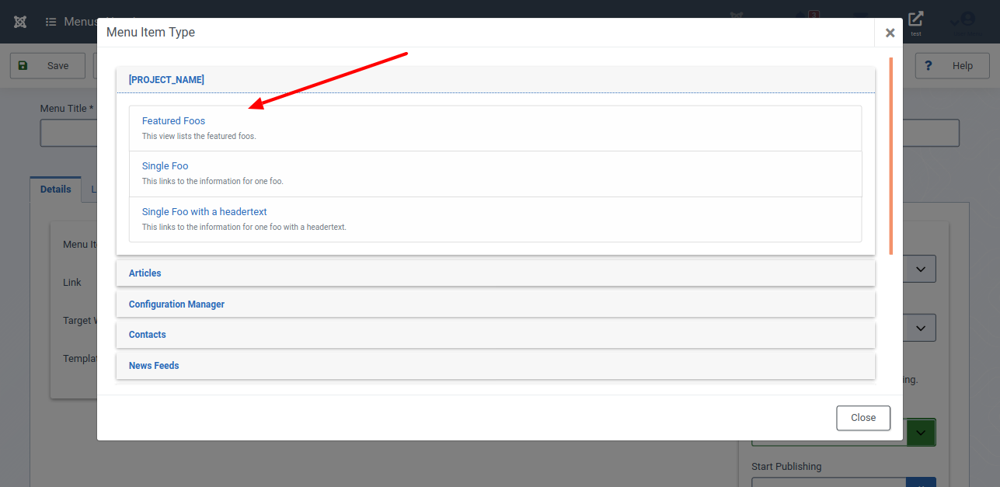
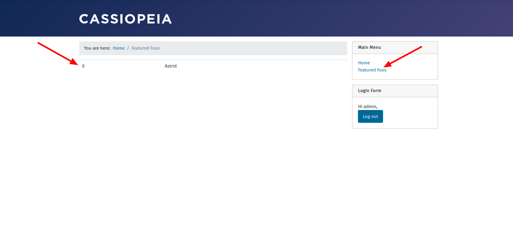

Manche Items sind etwas Besonderes und für sie gibt es in Joomla! ein spezielles Attribut: `featured`. Dieser Teil der Artikelserie fügt `featured` zu unserer Komponente hinzu.

## Für Ungeduldige

Sieh dir den geänderten Programmcode in der [Diff-Ansicht](https://github.com/astridx/boilerplate/compare/t22...t23) an und übernimm diese Änderungen in deine Entwicklungsversion.

Eine ausführlichere Erklärung des geänderten Programmcodes findest du weiter unten. 

## Teste deine Joomla-Komponente

1. Installiere deine Komponente in Joomla! Version 4, um sie zu testen:

Kopiere die Dateien im `administrator` Ordner in den `administrator` Ordner deiner Joomla! 4 Installation.  
Kopiere die Dateien im `components` Ordner in den `components` Ordner deiner Joomla! 4 Installation.  
Kopiere die Dateien im `media` Ordner in den `media` Ordner deiner Joomla! 4 Installation. 

2. Die Datenbank ist geändert worden, so dass es erforderlich ist, sie zu aktualisieren. Öffne den Bereich `System | Information | Database`, wie in Teil 16 beschrieben. Wähle deine Komponente aus und klicke auf `Update Structure`. 

2. Öffne die Ansicht deiner Komponente im Administrationsbereich. Die Liste enthält eine Spalte die mit `featured` überschrieben ist.

3. Öffne ein Item in der Bearbeitungsansicht und überzeuge dich davon, dass du hier das Attribut `featured` zum Bearbeiten angeboten bekommst.

4. Lege einen Menüpunkt vom Type `featured` an.

5. Wechsele ins Frontend und stelle sicher, dass unter dem Menüpunkt `featured` ausschließlich Items angezeigt werden, bei denen das Attribut gesetzt ist. 

## Geänderte Dateien

### Übersicht

      

    

        Files changed (15)
        <a class="d2h-file-switch d2h-hide">hide</a>
        <a class="d2h-file-switch d2h-show">show</a>
    

    <ol class="d2h-file-list">
    <li class="d2h-file-list-line">
    
      <svg aria-hidden="true" class="d2h-icon d2h-changed" height="16" title="modified" version="1.1"
           viewBox="0 0 14 16" width="14">
          <path d="M13 1H1C0.45 1 0 1.45 0 2v12c0 0.55 0.45 1 1 1h12c0.55 0 1-0.45 1-1V2c0-0.55-0.45-1-1-1z m0 13H1V2h12v12zM4 8c0-1.66 1.34-3 3-3s3 1.34 3 3-1.34 3-3 3-3-1.34-3-3z"></path>
      </svg>      <a href="#d2h-861015" class="d2h-file-name">src/administrator/components/com_foos/forms/foo.xml</a>
      
          +11
          -0
      
    
</li>
<li class="d2h-file-list-line">
    
      <svg aria-hidden="true" class="d2h-icon d2h-changed" height="16" title="modified" version="1.1"
           viewBox="0 0 14 16" width="14">
          <path d="M13 1H1C0.45 1 0 1.45 0 2v12c0 0.55 0.45 1 1 1h12c0.55 0 1-0.45 1-1V2c0-0.55-0.45-1-1-1z m0 13H1V2h12v12zM4 8c0-1.66 1.34-3 3-3s3 1.34 3 3-1.34 3-3 3-3-1.34-3-3z"></path>
      </svg>      <a href="#d2h-929815" class="d2h-file-name">src/administrator/components/com_foos/sql/install.mysql.utf8.sql</a>
      
          +3
          -0
      
    
</li>
<li class="d2h-file-list-line">
    
      <svg aria-hidden="true" class="d2h-icon d2h-added" height="16" title="added" version="1.1" viewBox="0 0 14 16"
           width="14">
          <path d="M13 1H1C0.45 1 0 1.45 0 2v12c0 0.55 0.45 1 1 1h12c0.55 0 1-0.45 1-1V2c0-0.55-0.45-1-1-1z m0 13H1V2h12v12zM6 9H3V7h3V4h2v3h3v2H8v3H6V9z"></path>
      </svg>      <a href="#d2h-634673" class="d2h-file-name">src/administrator/components/com_foos/sql/updates/mysql/24.0.0.sql</a>
      
          +3
          -0
      
    
</li>
<li class="d2h-file-list-line">
    
      <svg aria-hidden="true" class="d2h-icon d2h-changed" height="16" title="modified" version="1.1"
           viewBox="0 0 14 16" width="14">
          <path d="M13 1H1C0.45 1 0 1.45 0 2v12c0 0.55 0.45 1 1 1h12c0.55 0 1-0.45 1-1V2c0-0.55-0.45-1-1-1z m0 13H1V2h12v12zM4 8c0-1.66 1.34-3 3-3s3 1.34 3 3-1.34 3-3 3-3-1.34-3-3z"></path>
      </svg>      <a href="#d2h-266525" class="d2h-file-name">src/administrator/components/com_foos/src/Controller/FoosController.php</a>
      
          +63
          -2
      
    
</li>
<li class="d2h-file-list-line">
    
      <svg aria-hidden="true" class="d2h-icon d2h-changed" height="16" title="modified" version="1.1"
           viewBox="0 0 14 16" width="14">
          <path d="M13 1H1C0.45 1 0 1.45 0 2v12c0 0.55 0.45 1 1 1h12c0.55 0 1-0.45 1-1V2c0-0.55-0.45-1-1-1z m0 13H1V2h12v12zM4 8c0-1.66 1.34-3 3-3s3 1.34 3 3-1.34 3-3 3-3-1.34-3-3z"></path>
      </svg>      <a href="#d2h-206858" class="d2h-file-name">src/administrator/components/com_foos/src/Model/FooModel.php</a>
      
          +55
          -0
      
    
</li>
<li class="d2h-file-list-line">
    
      <svg aria-hidden="true" class="d2h-icon d2h-changed" height="16" title="modified" version="1.1"
           viewBox="0 0 14 16" width="14">
          <path d="M13 1H1C0.45 1 0 1.45 0 2v12c0 0.55 0.45 1 1 1h12c0.55 0 1-0.45 1-1V2c0-0.55-0.45-1-1-1z m0 13H1V2h12v12zM4 8c0-1.66 1.34-3 3-3s3 1.34 3 3-1.34 3-3 3-3-1.34-3-3z"></path>
      </svg>      <a href="#d2h-841411" class="d2h-file-name">src/administrator/components/com_foos/src/Model/FoosModel.php</a>
      
          +11
          -0
      
    
</li>
<li class="d2h-file-list-line">
    
      <svg aria-hidden="true" class="d2h-icon d2h-changed" height="16" title="modified" version="1.1"
           viewBox="0 0 14 16" width="14">
          <path d="M13 1H1C0.45 1 0 1.45 0 2v12c0 0.55 0.45 1 1 1h12c0.55 0 1-0.45 1-1V2c0-0.55-0.45-1-1-1z m0 13H1V2h12v12zM4 8c0-1.66 1.34-3 3-3s3 1.34 3 3-1.34 3-3 3-3-1.34-3-3z"></path>
      </svg>      <a href="#d2h-125543" class="d2h-file-name">src/administrator/components/com_foos/src/Service/HTML/AdministratorService.php</a>
      
          +36
          -0
      
    
</li>
<li class="d2h-file-list-line">
    
      <svg aria-hidden="true" class="d2h-icon d2h-changed" height="16" title="modified" version="1.1"
           viewBox="0 0 14 16" width="14">
          <path d="M13 1H1C0.45 1 0 1.45 0 2v12c0 0.55 0.45 1 1 1h12c0.55 0 1-0.45 1-1V2c0-0.55-0.45-1-1-1z m0 13H1V2h12v12zM4 8c0-1.66 1.34-3 3-3s3 1.34 3 3-1.34 3-3 3-3-1.34-3-3z"></path>
      </svg>      <a href="#d2h-529131" class="d2h-file-name">src/administrator/components/com_foos/src/View/Foos/HtmlView.php</a>
      
          +10
          -0
      
    
</li>
<li class="d2h-file-list-line">
    
      <svg aria-hidden="true" class="d2h-icon d2h-changed" height="16" title="modified" version="1.1"
           viewBox="0 0 14 16" width="14">
          <path d="M13 1H1C0.45 1 0 1.45 0 2v12c0 0.55 0.45 1 1 1h12c0.55 0 1-0.45 1-1V2c0-0.55-0.45-1-1-1z m0 13H1V2h12v12zM4 8c0-1.66 1.34-3 3-3s3 1.34 3 3-1.34 3-3 3-3-1.34-3-3z"></path>
      </svg>      <a href="#d2h-426783" class="d2h-file-name">src/administrator/components/com_foos/tmpl/foo/edit.php</a>
      
          +1
          -0
      
    
</li>
<li class="d2h-file-list-line">
    
      <svg aria-hidden="true" class="d2h-icon d2h-changed" height="16" title="modified" version="1.1"
           viewBox="0 0 14 16" width="14">
          <path d="M13 1H1C0.45 1 0 1.45 0 2v12c0 0.55 0.45 1 1 1h12c0.55 0 1-0.45 1-1V2c0-0.55-0.45-1-1-1z m0 13H1V2h12v12zM4 8c0-1.66 1.34-3 3-3s3 1.34 3 3-1.34 3-3 3-3-1.34-3-3z"></path>
      </svg>      <a href="#d2h-900341" class="d2h-file-name">src/administrator/components/com_foos/tmpl/foos/default.php</a>
      
          +9
          -3
      
    
</li>
<li class="d2h-file-list-line">
    
      <svg aria-hidden="true" class="d2h-icon d2h-added" height="16" title="added" version="1.1" viewBox="0 0 14 16"
           width="14">
          <path d="M13 1H1C0.45 1 0 1.45 0 2v12c0 0.55 0.45 1 1 1h12c0.55 0 1-0.45 1-1V2c0-0.55-0.45-1-1-1z m0 13H1V2h12v12zM6 9H3V7h3V4h2v3h3v2H8v3H6V9z"></path>
      </svg>      <a href="#d2h-908514" class="d2h-file-name">src/components/com_foos/src/Model/FeaturedModel.php</a>
      
          +199
          -0
      
    
</li>
<li class="d2h-file-list-line">
    
      <svg aria-hidden="true" class="d2h-icon d2h-added" height="16" title="added" version="1.1" viewBox="0 0 14 16"
           width="14">
          <path d="M13 1H1C0.45 1 0 1.45 0 2v12c0 0.55 0.45 1 1 1h12c0.55 0 1-0.45 1-1V2c0-0.55-0.45-1-1-1z m0 13H1V2h12v12zM6 9H3V7h3V4h2v3h3v2H8v3H6V9z"></path>
      </svg>      <a href="#d2h-777650" class="d2h-file-name">src/components/com_foos/src/View/Featured/HtmlView.php</a>
      
          +200
          -0
      
    
</li>
<li class="d2h-file-list-line">
    
      <svg aria-hidden="true" class="d2h-icon d2h-added" height="16" title="added" version="1.1" viewBox="0 0 14 16"
           width="14">
          <path d="M13 1H1C0.45 1 0 1.45 0 2v12c0 0.55 0.45 1 1 1h12c0.55 0 1-0.45 1-1V2c0-0.55-0.45-1-1-1z m0 13H1V2h12v12zM6 9H3V7h3V4h2v3h3v2H8v3H6V9z"></path>
      </svg>      <a href="#d2h-075470" class="d2h-file-name">src/components/com_foos/tmpl/featured/default.php</a>
      
          +35
          -0
      
    
</li>
<li class="d2h-file-list-line">
    
      <svg aria-hidden="true" class="d2h-icon d2h-added" height="16" title="added" version="1.1" viewBox="0 0 14 16"
           width="14">
          <path d="M13 1H1C0.45 1 0 1.45 0 2v12c0 0.55 0.45 1 1 1h12c0.55 0 1-0.45 1-1V2c0-0.55-0.45-1-1-1z m0 13H1V2h12v12zM6 9H3V7h3V4h2v3h3v2H8v3H6V9z"></path>
      </svg>      <a href="#d2h-083309" class="d2h-file-name">src/components/com_foos/tmpl/featured/default.xml</a>
      
          +48
          -0
      
    
</li>
<li class="d2h-file-list-line">
    
      <svg aria-hidden="true" class="d2h-icon d2h-added" height="16" title="added" version="1.1" viewBox="0 0 14 16"
           width="14">
          <path d="M13 1H1C0.45 1 0 1.45 0 2v12c0 0.55 0.45 1 1 1h12c0.55 0 1-0.45 1-1V2c0-0.55-0.45-1-1-1z m0 13H1V2h12v12zM6 9H3V7h3V4h2v3h3v2H8v3H6V9z"></path>
      </svg>      <a href="#d2h-511281" class="d2h-file-name">src/components/com_foos/tmpl/featured/default_items.php</a>
      
          +80
          -0
      
    
</li>
    </ol>

    

    

    
    <svg aria-hidden="true" class="d2h-icon" height="16" version="1.1" viewBox="0 0 12 16" width="12">
        <path d="M6 5H2v-1h4v1zM2 8h7v-1H2v1z m0 2h7v-1H2v1z m0 2h7v-1H2v1z m10-7.5v9.5c0 0.55-0.45 1-1 1H1c-0.55 0-1-0.45-1-1V2c0-0.55 0.45-1 1-1h7.5l3.5 3.5z m-1 0.5L8 2H1v12h10V5z"></path>
    </svg>    src/administrator/components/com_foos/forms/foo.xml
    CHANGED
    

    

        

            <table class="d2h-diff-table">
                <tbody class="d2h-diff-tbody">
                <tr>
    <td class="d2h-code-linenumber d2h-info"></td>
    <td class="d2h-info">
        
@@ -39,6 +39,17 @@

    </td>
</tr><tr>
    <td class="d2h-code-linenumber d2h-cntx">
      
39

39

    </td>
    <td class="d2h-cntx">
        

            &nbsp;
            			&lt;option value=&quot;*&quot;&gt;JALL&lt;&#x2F;option&gt;
        

    </td>
</tr><tr>
    <td class="d2h-code-linenumber d2h-cntx">
      
40

40

    </td>
    <td class="d2h-cntx">
        

            &nbsp;
            		&lt;&#x2F;field&gt;
        

    </td>
</tr><tr>
    <td class="d2h-code-linenumber d2h-cntx">
      
41

41

    </td>
    <td class="d2h-cntx">
        

            &nbsp;
        

    </td>
</tr><tr>
    <td class="d2h-code-linenumber d2h-ins">
      

42

    </td>
    <td class="d2h-ins">
        

            +
            		&lt;field
        

    </td>
</tr><tr>
    <td class="d2h-code-linenumber d2h-ins">
      

43

    </td>
    <td class="d2h-ins">
        

            +
            			name=&quot;featured&quot;
        

    </td>
</tr><tr>
    <td class="d2h-code-linenumber d2h-ins">
      

44

    </td>
    <td class="d2h-ins">
        

            +
            			type=&quot;radio&quot;
        

    </td>
</tr><tr>
    <td class="d2h-code-linenumber d2h-ins">
      

45

    </td>
    <td class="d2h-ins">
        

            +
            			class=&quot;switcher&quot;
        

    </td>
</tr><tr>
    <td class="d2h-code-linenumber d2h-ins">
      

46

    </td>
    <td class="d2h-ins">
        

            +
            			label=&quot;JFEATURED&quot;
        

    </td>
</tr><tr>
    <td class="d2h-code-linenumber d2h-ins">
      

47

    </td>
    <td class="d2h-ins">
        

            +
            			default=&quot;0&quot;
        

    </td>
</tr><tr>
    <td class="d2h-code-linenumber d2h-ins">
      

48

    </td>
    <td class="d2h-ins">
        

            +
            			&gt;
        

    </td>
</tr><tr>
    <td class="d2h-code-linenumber d2h-ins">
      

49

    </td>
    <td class="d2h-ins">
        

            +
            			&lt;option value=&quot;0&quot;&gt;JNO&lt;&#x2F;option&gt;
        

    </td>
</tr><tr>
    <td class="d2h-code-linenumber d2h-ins">
      

50

    </td>
    <td class="d2h-ins">
        

            +
            			&lt;option value=&quot;1&quot;&gt;JYES&lt;&#x2F;option&gt;
        

    </td>
</tr><tr>
    <td class="d2h-code-linenumber d2h-ins">
      

51

    </td>
    <td class="d2h-ins">
        

            +
            		&lt;&#x2F;field&gt;
        

    </td>
</tr><tr>
    <td class="d2h-code-linenumber d2h-ins">
      

52

    </td>
    <td class="d2h-ins">
        

            +
        

    </td>
</tr><tr>
    <td class="d2h-code-linenumber d2h-cntx">
      
42

53

    </td>
    <td class="d2h-cntx">
        

            &nbsp;
            		&lt;field
        

    </td>
</tr><tr>
    <td class="d2h-code-linenumber d2h-cntx">
      
43

54

    </td>
    <td class="d2h-cntx">
        

            &nbsp;
            			name=&quot;published&quot;
        

    </td>
</tr><tr>
    <td class="d2h-code-linenumber d2h-cntx">
      
44

55

    </td>
    <td class="d2h-cntx">
        

            &nbsp;
            			type=&quot;list&quot;
        

    </td>
</tr>
                </tbody>
            </table>
        

    

    

    
    <svg aria-hidden="true" class="d2h-icon" height="16" version="1.1" viewBox="0 0 12 16" width="12">
        <path d="M6 5H2v-1h4v1zM2 8h7v-1H2v1z m0 2h7v-1H2v1z m0 2h7v-1H2v1z m10-7.5v9.5c0 0.55-0.45 1-1 1H1c-0.55 0-1-0.45-1-1V2c0-0.55 0.45-1 1-1h7.5l3.5 3.5z m-1 0.5L8 2H1v12h10V5z"></path>
    </svg>    src/administrator/components/com_foos/sql/install.mysql.utf8.sql
    CHANGED
    

    

        

            <table class="d2h-diff-table">
                <tbody class="d2h-diff-tbody">
                <tr>
    <td class="d2h-code-linenumber d2h-info"></td>
    <td class="d2h-info">
        
@@ -42,3 +42,6 @@ ALTER TABLE `#__foos_details` ADD COLUMN `checked_out_time` datetime AFTER `alia

    </td>
</tr><tr>
    <td class="d2h-code-linenumber d2h-cntx">
      
42

42

    </td>
    <td class="d2h-cntx">
        

            &nbsp;
        

    </td>
</tr><tr>
    <td class="d2h-code-linenumber d2h-cntx">
      
43

43

    </td>
    <td class="d2h-cntx">
        

            &nbsp;
            ALTER TABLE `#__foos_details` ADD KEY `idx_checkout` (`checked_out`);
        

    </td>
</tr><tr>
    <td class="d2h-code-linenumber d2h-cntx">
      
44

44

    </td>
    <td class="d2h-cntx">
        

            &nbsp;
        

    </td>
</tr><tr>
    <td class="d2h-code-linenumber d2h-ins">
      

45

    </td>
    <td class="d2h-ins">
        

            +
            ALTER TABLE `#__foos_details` ADD COLUMN  `featured` tinyint(3) unsigned NOT NULL DEFAULT 0 COMMENT &#x27;Set if contact is featured.&#x27;;
        

    </td>
</tr><tr>
    <td class="d2h-code-linenumber d2h-ins">
      

46

    </td>
    <td class="d2h-ins">
        

            +
        

    </td>
</tr><tr>
    <td class="d2h-code-linenumber d2h-ins">
      

47

    </td>
    <td class="d2h-ins">
        

            +
            ALTER TABLE `#__foos_details` ADD KEY `idx_featured_catid` (`featured`,`catid`);
        

    </td>
</tr>
                </tbody>
            </table>
        

    

    

    
    <svg aria-hidden="true" class="d2h-icon" height="16" version="1.1" viewBox="0 0 12 16" width="12">
        <path d="M6 5H2v-1h4v1zM2 8h7v-1H2v1z m0 2h7v-1H2v1z m0 2h7v-1H2v1z m10-7.5v9.5c0 0.55-0.45 1-1 1H1c-0.55 0-1-0.45-1-1V2c0-0.55 0.45-1 1-1h7.5l3.5 3.5z m-1 0.5L8 2H1v12h10V5z"></path>
    </svg>    src/administrator/components/com_foos/sql/updates/mysql/24.0.0.sql
    ADDED
    

    

        

            <table class="d2h-diff-table">
                <tbody class="d2h-diff-tbody">
                <tr>
    <td class="d2h-code-linenumber d2h-info"></td>
    <td class="d2h-info">
        
@@ -0,0 +1,3 @@

    </td>
</tr><tr>
    <td class="d2h-code-linenumber d2h-ins">
      

1

    </td>
    <td class="d2h-ins">
        

            +
            ALTER TABLE `#__foos_details` ADD COLUMN  `featured` tinyint(3) unsigned NOT NULL DEFAULT 0 COMMENT &#x27;Set if contact is featured.&#x27;;
        

    </td>
</tr><tr>
    <td class="d2h-code-linenumber d2h-ins">
      

2

    </td>
    <td class="d2h-ins">
        

            +
        

    </td>
</tr><tr>
    <td class="d2h-code-linenumber d2h-ins">
      

3

    </td>
    <td class="d2h-ins">
        

            +
            ALTER TABLE `#__foos_details` ADD KEY `idx_featured_catid` (`featured`,`catid`);
        

    </td>
</tr>
                </tbody>
            </table>
        

    

    

    
    <svg aria-hidden="true" class="d2h-icon" height="16" version="1.1" viewBox="0 0 12 16" width="12">
        <path d="M6 5H2v-1h4v1zM2 8h7v-1H2v1z m0 2h7v-1H2v1z m0 2h7v-1H2v1z m10-7.5v9.5c0 0.55-0.45 1-1 1H1c-0.55 0-1-0.45-1-1V2c0-0.55 0.45-1 1-1h7.5l3.5 3.5z m-1 0.5L8 2H1v12h10V5z"></path>
    </svg>    src/administrator/components/com_foos/src/Controller/FoosController.php
    CHANGED
    

    

        

            <table class="d2h-diff-table">
                <tbody class="d2h-diff-tbody">
                <tr>
    <td class="d2h-code-linenumber d2h-info"></td>
    <td class="d2h-info">
        
@@ -9,13 +9,15 @@

    </td>
</tr><tr>
    <td class="d2h-code-linenumber d2h-cntx">
      
9

9

    </td>
    <td class="d2h-cntx">
        

            &nbsp;
        

    </td>
</tr><tr>
    <td class="d2h-code-linenumber d2h-cntx">
      
10

10

    </td>
    <td class="d2h-cntx">
        

            &nbsp;
            namespace Joomla\Component\Foos\Administrator\Controller;
        

    </td>
</tr><tr>
    <td class="d2h-code-linenumber d2h-cntx">
      
11

11

    </td>
    <td class="d2h-cntx">
        

            &nbsp;
        

    </td>
</tr><tr>
    <td class="d2h-code-linenumber d2h-ins">
      

12

    </td>
    <td class="d2h-ins">
        

            +
            defined(&#x27;_JEXEC&#x27;) or die;
        

    </td>
</tr><tr>
    <td class="d2h-code-linenumber d2h-ins">
      

13

    </td>
    <td class="d2h-ins">
        

            +
        

    </td>
</tr><tr>
    <td class="d2h-code-linenumber d2h-ins">
      

14

    </td>
    <td class="d2h-ins">
        

            +
            use Joomla\CMS\Language\Text;
        

    </td>
</tr><tr>
    <td class="d2h-code-linenumber d2h-ins">
      

15

    </td>
    <td class="d2h-ins">
        

            +
            use Joomla\Utilities\ArrayHelper;
        

    </td>
</tr><tr>
    <td class="d2h-code-linenumber d2h-cntx">
      
12

16

    </td>
    <td class="d2h-cntx">
        

            &nbsp;
            use Joomla\CMS\Application\CMSApplication;
        

    </td>
</tr><tr>
    <td class="d2h-code-linenumber d2h-cntx">
      
13

17

    </td>
    <td class="d2h-cntx">
        

            &nbsp;
            use Joomla\CMS\MVC\Controller\AdminController;
        

    </td>
</tr><tr>
    <td class="d2h-code-linenumber d2h-cntx">
      
14

18

    </td>
    <td class="d2h-cntx">
        

            &nbsp;
            use Joomla\CMS\MVC\Factory\MVCFactoryInterface;
        

    </td>
</tr><tr>
    <td class="d2h-code-linenumber d2h-cntx">
      
15

19

    </td>
    <td class="d2h-cntx">
        

            &nbsp;
            use Joomla\Input\Input;
        

    </td>
</tr><tr>
    <td class="d2h-code-linenumber d2h-cntx">
      
16

20

    </td>
    <td class="d2h-cntx">
        

            &nbsp;
        

    </td>
</tr><tr>
    <td class="d2h-code-linenumber d2h-del">
      
17

    </td>
    <td class="d2h-del">
        

            -
            defined(&#x27;_JEXEC&#x27;) or die;
        

    </td>
</tr><tr>
    <td class="d2h-code-linenumber d2h-del">
      
18

    </td>
    <td class="d2h-del">
        

            -
        

    </td>
</tr><tr>
    <td class="d2h-code-linenumber d2h-cntx">
      
19

21

    </td>
    <td class="d2h-cntx">
        

            &nbsp;
            &#x2F;**
        

    </td>
</tr><tr>
    <td class="d2h-code-linenumber d2h-cntx">
      
20

22

    </td>
    <td class="d2h-cntx">
        

            &nbsp;
             * Contacts list controller class.
        

    </td>
</tr><tr>
    <td class="d2h-code-linenumber d2h-cntx">
      
21

23

    </td>
    <td class="d2h-cntx">
        

            &nbsp;
             *
        

    </td>
</tr>
<tr>
    <td class="d2h-code-linenumber d2h-info"></td>
    <td class="d2h-info">
        
@@ -38,6 +40,65 @@ class FoosController extends AdminController

    </td>
</tr><tr>
    <td class="d2h-code-linenumber d2h-cntx">
      
38

40

    </td>
    <td class="d2h-cntx">
        

            &nbsp;
            	public function __construct($config = array(), MVCFactoryInterface $factory = null, $app = null, $input = null)
        

    </td>
</tr><tr>
    <td class="d2h-code-linenumber d2h-cntx">
      
39

41

    </td>
    <td class="d2h-cntx">
        

            &nbsp;
            	{
        

    </td>
</tr><tr>
    <td class="d2h-code-linenumber d2h-cntx">
      
40

42

    </td>
    <td class="d2h-cntx">
        

            &nbsp;
            		parent::__construct($config, $factory, $app, $input);
        

    </td>
</tr><tr>
    <td class="d2h-code-linenumber d2h-ins">
      

43

    </td>
    <td class="d2h-ins">
        

            +
        

    </td>
</tr><tr>
    <td class="d2h-code-linenumber d2h-ins">
      

44

    </td>
    <td class="d2h-ins">
        

            +
            		$this-&gt;registerTask(&#x27;unfeatured&#x27;,	&#x27;featured&#x27;);
        

    </td>
</tr><tr>
    <td class="d2h-code-linenumber d2h-ins">
      

45

    </td>
    <td class="d2h-ins">
        

            +
            	}
        

    </td>
</tr><tr>
    <td class="d2h-code-linenumber d2h-ins">
      

46

    </td>
    <td class="d2h-ins">
        

            +
        

    </td>
</tr><tr>
    <td class="d2h-code-linenumber d2h-ins">
      

47

    </td>
    <td class="d2h-ins">
        

            +
            	&#x2F;**
        

    </td>
</tr><tr>
    <td class="d2h-code-linenumber d2h-ins">
      

48

    </td>
    <td class="d2h-ins">
        

            +
            	 * Method to toggle the featured setting of a list of foos.
        

    </td>
</tr><tr>
    <td class="d2h-code-linenumber d2h-ins">
      

49

    </td>
    <td class="d2h-ins">
        

            +
            	 *
        

    </td>
</tr><tr>
    <td class="d2h-code-linenumber d2h-ins">
      

50

    </td>
    <td class="d2h-ins">
        

            +
            	 * @return  void
        

    </td>
</tr><tr>
    <td class="d2h-code-linenumber d2h-ins">
      

51

    </td>
    <td class="d2h-ins">
        

            +
            	 *
        

    </td>
</tr><tr>
    <td class="d2h-code-linenumber d2h-ins">
      

52

    </td>
    <td class="d2h-ins">
        

            +
            	 * @since   __BUMP_VERSION__
        

    </td>
</tr><tr>
    <td class="d2h-code-linenumber d2h-ins">
      

53

    </td>
    <td class="d2h-ins">
        

            +
            	 *&#x2F;
        

    </td>
</tr><tr>
    <td class="d2h-code-linenumber d2h-ins">
      

54

    </td>
    <td class="d2h-ins">
        

            +
            	public function featured()
        

    </td>
</tr><tr>
    <td class="d2h-code-linenumber d2h-ins">
      

55

    </td>
    <td class="d2h-ins">
        

            +
            	{
        

    </td>
</tr><tr>
    <td class="d2h-code-linenumber d2h-ins">
      

56

    </td>
    <td class="d2h-ins">
        

            +
            		&#x2F;&#x2F; Check for request forgeries
        

    </td>
</tr><tr>
    <td class="d2h-code-linenumber d2h-ins">
      

57

    </td>
    <td class="d2h-ins">
        

            +
            		$this-&gt;checkToken();
        

    </td>
</tr><tr>
    <td class="d2h-code-linenumber d2h-ins">
      

58

    </td>
    <td class="d2h-ins">
        

            +
        

    </td>
</tr><tr>
    <td class="d2h-code-linenumber d2h-ins">
      

59

    </td>
    <td class="d2h-ins">
        

            +
            		$ids    = $this-&gt;input-&gt;get(&#x27;cid&#x27;, array(), &#x27;array&#x27;);
        

    </td>
</tr><tr>
    <td class="d2h-code-linenumber d2h-ins">
      

60

    </td>
    <td class="d2h-ins">
        

            +
            		$values = array(&#x27;featured&#x27; =&gt; 1, &#x27;unfeatured&#x27; =&gt; 0);
        

    </td>
</tr><tr>
    <td class="d2h-code-linenumber d2h-ins">
      

61

    </td>
    <td class="d2h-ins">
        

            +
            		$task   = $this-&gt;getTask();
        

    </td>
</tr><tr>
    <td class="d2h-code-linenumber d2h-ins">
      

62

    </td>
    <td class="d2h-ins">
        

            +
            		$value  = ArrayHelper::getValue($values, $task, 0, &#x27;int&#x27;);
        

    </td>
</tr><tr>
    <td class="d2h-code-linenumber d2h-ins">
      

63

    </td>
    <td class="d2h-ins">
        

            +
        

    </td>
</tr><tr>
    <td class="d2h-code-linenumber d2h-ins">
      

64

    </td>
    <td class="d2h-ins">
        

            +
            		$model  = $this-&gt;getModel();
        

    </td>
</tr><tr>
    <td class="d2h-code-linenumber d2h-ins">
      

65

    </td>
    <td class="d2h-ins">
        

            +
        

    </td>
</tr><tr>
    <td class="d2h-code-linenumber d2h-ins">
      

66

    </td>
    <td class="d2h-ins">
        

            +
            		&#x2F;&#x2F; Access checks.
        

    </td>
</tr><tr>
    <td class="d2h-code-linenumber d2h-ins">
      

67

    </td>
    <td class="d2h-ins">
        

            +
            		foreach ($ids as $i =&gt; $id)
        

    </td>
</tr><tr>
    <td class="d2h-code-linenumber d2h-ins">
      

68

    </td>
    <td class="d2h-ins">
        

            +
            		{
        

    </td>
</tr><tr>
    <td class="d2h-code-linenumber d2h-ins">
      

69

    </td>
    <td class="d2h-ins">
        

            +
            			$item = $model-&gt;getItem($id);
        

    </td>
</tr><tr>
    <td class="d2h-code-linenumber d2h-ins">
      

70

    </td>
    <td class="d2h-ins">
        

            +
        

    </td>
</tr><tr>
    <td class="d2h-code-linenumber d2h-ins">
      

71

    </td>
    <td class="d2h-ins">
        

            +
            			if (!$this-&gt;app-&gt;getIdentity()-&gt;authorise(&#x27;core.edit.state&#x27;, &#x27;com_foos.category.&#x27; . (int) $item-&gt;catid))
        

    </td>
</tr><tr>
    <td class="d2h-code-linenumber d2h-ins">
      

72

    </td>
    <td class="d2h-ins">
        

            +
            			{
        

    </td>
</tr><tr>
    <td class="d2h-code-linenumber d2h-ins">
      

73

    </td>
    <td class="d2h-ins">
        

            +
            				&#x2F;&#x2F; Prune items that you can&#x27;t change.
        

    </td>
</tr><tr>
    <td class="d2h-code-linenumber d2h-ins">
      

74

    </td>
    <td class="d2h-ins">
        

            +
            				unset($ids[$i]);
        

    </td>
</tr><tr>
    <td class="d2h-code-linenumber d2h-ins">
      

75

    </td>
    <td class="d2h-ins">
        

            +
            				$this-&gt;app-&gt;enqueueMessage(Text::_(&#x27;JLIB_APPLICATION_ERROR_EDITSTATE_NOT_PERMITTED&#x27;), &#x27;notice&#x27;);
        

    </td>
</tr><tr>
    <td class="d2h-code-linenumber d2h-ins">
      

76

    </td>
    <td class="d2h-ins">
        

            +
            			}
        

    </td>
</tr><tr>
    <td class="d2h-code-linenumber d2h-ins">
      

77

    </td>
    <td class="d2h-ins">
        

            +
            		}
        

    </td>
</tr><tr>
    <td class="d2h-code-linenumber d2h-ins">
      

78

    </td>
    <td class="d2h-ins">
        

            +
        

    </td>
</tr><tr>
    <td class="d2h-code-linenumber d2h-ins">
      

79

    </td>
    <td class="d2h-ins">
        

            +
            		if (empty($ids))
        

    </td>
</tr><tr>
    <td class="d2h-code-linenumber d2h-ins">
      

80

    </td>
    <td class="d2h-ins">
        

            +
            		{
        

    </td>
</tr><tr>
    <td class="d2h-code-linenumber d2h-ins">
      

81

    </td>
    <td class="d2h-ins">
        

            +
            			$this-&gt;app-&gt;enqueueMessage(Text::_(&#x27;COM_FOOS_NO_ITEM_SELECTED&#x27;), &#x27;warning&#x27;);
        

    </td>
</tr><tr>
    <td class="d2h-code-linenumber d2h-ins">
      

82

    </td>
    <td class="d2h-ins">
        

            +
            		}
        

    </td>
</tr><tr>
    <td class="d2h-code-linenumber d2h-ins">
      

83

    </td>
    <td class="d2h-ins">
        

            +
            		else
        

    </td>
</tr><tr>
    <td class="d2h-code-linenumber d2h-ins">
      

84

    </td>
    <td class="d2h-ins">
        

            +
            		{
        

    </td>
</tr><tr>
    <td class="d2h-code-linenumber d2h-ins">
      

85

    </td>
    <td class="d2h-ins">
        

            +
            			&#x2F;&#x2F; Publish the items.
        

    </td>
</tr><tr>
    <td class="d2h-code-linenumber d2h-ins">
      

86

    </td>
    <td class="d2h-ins">
        

            +
            			if (!$model-&gt;featured($ids, $value))
        

    </td>
</tr><tr>
    <td class="d2h-code-linenumber d2h-ins">
      

87

    </td>
    <td class="d2h-ins">
        

            +
            			{
        

    </td>
</tr><tr>
    <td class="d2h-code-linenumber d2h-ins">
      

88

    </td>
    <td class="d2h-ins">
        

            +
            				$this-&gt;app-&gt;enqueueMessage($model-&gt;getError(), &#x27;warning&#x27;);
        

    </td>
</tr><tr>
    <td class="d2h-code-linenumber d2h-ins">
      

89

    </td>
    <td class="d2h-ins">
        

            +
            			}
        

    </td>
</tr><tr>
    <td class="d2h-code-linenumber d2h-ins">
      

90

    </td>
    <td class="d2h-ins">
        

            +
        

    </td>
</tr><tr>
    <td class="d2h-code-linenumber d2h-ins">
      

91

    </td>
    <td class="d2h-ins">
        

            +
            			if ($value == 1)
        

    </td>
</tr><tr>
    <td class="d2h-code-linenumber d2h-ins">
      

92

    </td>
    <td class="d2h-ins">
        

            +
            			{
        

    </td>
</tr><tr>
    <td class="d2h-code-linenumber d2h-ins">
      

93

    </td>
    <td class="d2h-ins">
        

            +
            				$message = Text::plural(&#x27;COM_FOOS_N_ITEMS_FEATURED&#x27;, count($ids));
        

    </td>
</tr><tr>
    <td class="d2h-code-linenumber d2h-ins">
      

94

    </td>
    <td class="d2h-ins">
        

            +
            			}
        

    </td>
</tr><tr>
    <td class="d2h-code-linenumber d2h-ins">
      

95

    </td>
    <td class="d2h-ins">
        

            +
            			else
        

    </td>
</tr><tr>
    <td class="d2h-code-linenumber d2h-ins">
      

96

    </td>
    <td class="d2h-ins">
        

            +
            			{
        

    </td>
</tr><tr>
    <td class="d2h-code-linenumber d2h-ins">
      

97

    </td>
    <td class="d2h-ins">
        

            +
            				$message = Text::plural(&#x27;COM_FOOS_N_ITEMS_UNFEATURED&#x27;, count($ids));
        

    </td>
</tr><tr>
    <td class="d2h-code-linenumber d2h-ins">
      

98

    </td>
    <td class="d2h-ins">
        

            +
            			}
        

    </td>
</tr><tr>
    <td class="d2h-code-linenumber d2h-ins">
      

99

    </td>
    <td class="d2h-ins">
        

            +
            		}
        

    </td>
</tr><tr>
    <td class="d2h-code-linenumber d2h-ins">
      

100

    </td>
    <td class="d2h-ins">
        

            +
        

    </td>
</tr><tr>
    <td class="d2h-code-linenumber d2h-ins">
      

101

    </td>
    <td class="d2h-ins">
        

            +
            		$this-&gt;setRedirect(&#x27;index.php?option=com_foos&amp;view=foos&#x27;, $message);
        

    </td>
</tr><tr>
    <td class="d2h-code-linenumber d2h-cntx">
      
41

102

    </td>
    <td class="d2h-cntx">
        

            &nbsp;
            	}
        

    </td>
</tr><tr>
    <td class="d2h-code-linenumber d2h-cntx">
      
42

103

    </td>
    <td class="d2h-cntx">
        

            &nbsp;
        

    </td>
</tr><tr>
    <td class="d2h-code-linenumber d2h-cntx">
      
43

104

    </td>
    <td class="d2h-cntx">
        

            &nbsp;
            	&#x2F;**
        

    </td>
</tr>
                </tbody>
            </table>
        

    

    

    
    <svg aria-hidden="true" class="d2h-icon" height="16" version="1.1" viewBox="0 0 12 16" width="12">
        <path d="M6 5H2v-1h4v1zM2 8h7v-1H2v1z m0 2h7v-1H2v1z m0 2h7v-1H2v1z m10-7.5v9.5c0 0.55-0.45 1-1 1H1c-0.55 0-1-0.45-1-1V2c0-0.55 0.45-1 1-1h7.5l3.5 3.5z m-1 0.5L8 2H1v12h10V5z"></path>
    </svg>    src/administrator/components/com_foos/src/Model/FooModel.php
    CHANGED
    

    

        

            <table class="d2h-diff-table">
                <tbody class="d2h-diff-tbody">
                <tr>
    <td class="d2h-code-linenumber d2h-info"></td>
    <td class="d2h-info">
        
@@ -15,6 +15,8 @@ use Joomla\CMS\Factory;

    </td>
</tr><tr>
    <td class="d2h-code-linenumber d2h-cntx">
      
15

15

    </td>
    <td class="d2h-cntx">
        

            &nbsp;
            use Joomla\CMS\Language\Associations;
        

    </td>
</tr><tr>
    <td class="d2h-code-linenumber d2h-cntx">
      
16

16

    </td>
    <td class="d2h-cntx">
        

            &nbsp;
            use Joomla\CMS\MVC\Model\AdminModel;
        

    </td>
</tr><tr>
    <td class="d2h-code-linenumber d2h-cntx">
      
17

17

    </td>
    <td class="d2h-cntx">
        

            &nbsp;
            use Joomla\CMS\Language\LanguageHelper;
        

    </td>
</tr><tr>
    <td class="d2h-code-linenumber d2h-ins">
      

18

    </td>
    <td class="d2h-ins">
        

            +
            use Joomla\Database\ParameterType;
        

    </td>
</tr><tr>
    <td class="d2h-code-linenumber d2h-ins">
      

19

    </td>
    <td class="d2h-ins">
        

            +
            use Joomla\Utilities\ArrayHelper;
        

    </td>
</tr><tr>
    <td class="d2h-code-linenumber d2h-cntx">
      
18

20

    </td>
    <td class="d2h-cntx">
        

            &nbsp;
        

    </td>
</tr><tr>
    <td class="d2h-code-linenumber d2h-cntx">
      
19

21

    </td>
    <td class="d2h-cntx">
        

            &nbsp;
            &#x2F;**
        

    </td>
</tr><tr>
    <td class="d2h-code-linenumber d2h-cntx">
      
20

22

    </td>
    <td class="d2h-cntx">
        

            &nbsp;
             * Item Model for a Foo.
        

    </td>
</tr>
<tr>
    <td class="d2h-code-linenumber d2h-info"></td>
    <td class="d2h-info">
        
@@ -131,6 +133,59 @@ class FooModel extends AdminModel

    </td>
</tr><tr>
    <td class="d2h-code-linenumber d2h-cntx">
      
131

133

    </td>
    <td class="d2h-cntx">
        

            &nbsp;
            		return $item;
        

    </td>
</tr><tr>
    <td class="d2h-code-linenumber d2h-cntx">
      
132

134

    </td>
    <td class="d2h-cntx">
        

            &nbsp;
            	}
        

    </td>
</tr><tr>
    <td class="d2h-code-linenumber d2h-cntx">
      
133

135

    </td>
    <td class="d2h-cntx">
        

            &nbsp;
        

    </td>
</tr><tr>
    <td class="d2h-code-linenumber d2h-ins">
      

136

    </td>
    <td class="d2h-ins">
        

            +
            	&#x2F;**
        

    </td>
</tr><tr>
    <td class="d2h-code-linenumber d2h-ins">
      

137

    </td>
    <td class="d2h-ins">
        

            +
            	 * Method to toggle the featured setting of foos.
        

    </td>
</tr><tr>
    <td class="d2h-code-linenumber d2h-ins">
      

138

    </td>
    <td class="d2h-ins">
        

            +
            	 *
        

    </td>
</tr><tr>
    <td class="d2h-code-linenumber d2h-ins">
      

139

    </td>
    <td class="d2h-ins">
        

            +
            	 * @param   array    $pks    The ids of the items to toggle.
        

    </td>
</tr><tr>
    <td class="d2h-code-linenumber d2h-ins">
      

140

    </td>
    <td class="d2h-ins">
        

            +
            	 * @param   integer  $value  The value to toggle to.
        

    </td>
</tr><tr>
    <td class="d2h-code-linenumber d2h-ins">
      

141

    </td>
    <td class="d2h-ins">
        

            +
            	 *
        

    </td>
</tr><tr>
    <td class="d2h-code-linenumber d2h-ins">
      

142

    </td>
    <td class="d2h-ins">
        

            +
            	 * @return  boolean  True on success.
        

    </td>
</tr><tr>
    <td class="d2h-code-linenumber d2h-ins">
      

143

    </td>
    <td class="d2h-ins">
        

            +
            	 *
        

    </td>
</tr><tr>
    <td class="d2h-code-linenumber d2h-ins">
      

144

    </td>
    <td class="d2h-ins">
        

            +
            	 * @since   __BUMP_VERSION__
        

    </td>
</tr><tr>
    <td class="d2h-code-linenumber d2h-ins">
      

145

    </td>
    <td class="d2h-ins">
        

            +
            	 *&#x2F;
        

    </td>
</tr><tr>
    <td class="d2h-code-linenumber d2h-ins">
      

146

    </td>
    <td class="d2h-ins">
        

            +
            	public function featured($pks, $value = 0)
        

    </td>
</tr><tr>
    <td class="d2h-code-linenumber d2h-ins">
      

147

    </td>
    <td class="d2h-ins">
        

            +
            	{
        

    </td>
</tr><tr>
    <td class="d2h-code-linenumber d2h-ins">
      

148

    </td>
    <td class="d2h-ins">
        

            +
            		&#x2F;&#x2F; Sanitize the ids.
        

    </td>
</tr><tr>
    <td class="d2h-code-linenumber d2h-ins">
      

149

    </td>
    <td class="d2h-ins">
        

            +
            		$pks = ArrayHelper::toInteger((array) $pks);
        

    </td>
</tr><tr>
    <td class="d2h-code-linenumber d2h-ins">
      

150

    </td>
    <td class="d2h-ins">
        

            +
        

    </td>
</tr><tr>
    <td class="d2h-code-linenumber d2h-ins">
      

151

    </td>
    <td class="d2h-ins">
        

            +
            		if (empty($pks))
        

    </td>
</tr><tr>
    <td class="d2h-code-linenumber d2h-ins">
      

152

    </td>
    <td class="d2h-ins">
        

            +
            		{
        

    </td>
</tr><tr>
    <td class="d2h-code-linenumber d2h-ins">
      

153

    </td>
    <td class="d2h-ins">
        

            +
            			$this-&gt;setError(Text::_(&#x27;COM_FOOS_NO_ITEM_SELECTED&#x27;));
        

    </td>
</tr><tr>
    <td class="d2h-code-linenumber d2h-ins">
      

154

    </td>
    <td class="d2h-ins">
        

            +
        

    </td>
</tr><tr>
    <td class="d2h-code-linenumber d2h-ins">
      

155

    </td>
    <td class="d2h-ins">
        

            +
            			return false;
        

    </td>
</tr><tr>
    <td class="d2h-code-linenumber d2h-ins">
      

156

    </td>
    <td class="d2h-ins">
        

            +
            		}
        

    </td>
</tr><tr>
    <td class="d2h-code-linenumber d2h-ins">
      

157

    </td>
    <td class="d2h-ins">
        

            +
        

    </td>
</tr><tr>
    <td class="d2h-code-linenumber d2h-ins">
      

158

    </td>
    <td class="d2h-ins">
        

            +
            		$table = $this-&gt;getTable();
        

    </td>
</tr><tr>
    <td class="d2h-code-linenumber d2h-ins">
      

159

    </td>
    <td class="d2h-ins">
        

            +
        

    </td>
</tr><tr>
    <td class="d2h-code-linenumber d2h-ins">
      

160

    </td>
    <td class="d2h-ins">
        

            +
            		try
        

    </td>
</tr><tr>
    <td class="d2h-code-linenumber d2h-ins">
      

161

    </td>
    <td class="d2h-ins">
        

            +
            		{
        

    </td>
</tr><tr>
    <td class="d2h-code-linenumber d2h-ins">
      

162

    </td>
    <td class="d2h-ins">
        

            +
            			$db = $this-&gt;getDbo();
        

    </td>
</tr><tr>
    <td class="d2h-code-linenumber d2h-ins">
      

163

    </td>
    <td class="d2h-ins">
        

            +
        

    </td>
</tr><tr>
    <td class="d2h-code-linenumber d2h-ins">
      

164

    </td>
    <td class="d2h-ins">
        

            +
            			$query = $db-&gt;getQuery(true);
        

    </td>
</tr><tr>
    <td class="d2h-code-linenumber d2h-ins">
      

165

    </td>
    <td class="d2h-ins">
        

            +
            			$query-&gt;update($db-&gt;quoteName(&#x27;#__foos_details&#x27;));
        

    </td>
</tr><tr>
    <td class="d2h-code-linenumber d2h-ins">
      

166

    </td>
    <td class="d2h-ins">
        

            +
            			$query-&gt;set($db-&gt;quoteName(&#x27;featured&#x27;) . &#x27; = :featured&#x27;);
        

    </td>
</tr><tr>
    <td class="d2h-code-linenumber d2h-ins">
      

167

    </td>
    <td class="d2h-ins">
        

            +
            			$query-&gt;whereIn($db-&gt;quoteName(&#x27;id&#x27;), $pks);
        

    </td>
</tr><tr>
    <td class="d2h-code-linenumber d2h-ins">
      

168

    </td>
    <td class="d2h-ins">
        

            +
            			$query-&gt;bind(&#x27;:featured&#x27;, $value, ParameterType::INTEGER);
        

    </td>
</tr><tr>
    <td class="d2h-code-linenumber d2h-ins">
      

169

    </td>
    <td class="d2h-ins">
        

            +
        

    </td>
</tr><tr>
    <td class="d2h-code-linenumber d2h-ins">
      

170

    </td>
    <td class="d2h-ins">
        

            +
            			$db-&gt;setQuery($query);
        

    </td>
</tr><tr>
    <td class="d2h-code-linenumber d2h-ins">
      

171

    </td>
    <td class="d2h-ins">
        

            +
        

    </td>
</tr><tr>
    <td class="d2h-code-linenumber d2h-ins">
      

172

    </td>
    <td class="d2h-ins">
        

            +
            			$db-&gt;execute();
        

    </td>
</tr><tr>
    <td class="d2h-code-linenumber d2h-ins">
      

173

    </td>
    <td class="d2h-ins">
        

            +
            		}
        

    </td>
</tr><tr>
    <td class="d2h-code-linenumber d2h-ins">
      

174

    </td>
    <td class="d2h-ins">
        

            +
            		catch (\Exception $e)
        

    </td>
</tr><tr>
    <td class="d2h-code-linenumber d2h-ins">
      

175

    </td>
    <td class="d2h-ins">
        

            +
            		{
        

    </td>
</tr><tr>
    <td class="d2h-code-linenumber d2h-ins">
      

176

    </td>
    <td class="d2h-ins">
        

            +
            			$this-&gt;setError($e-&gt;getMessage());
        

    </td>
</tr><tr>
    <td class="d2h-code-linenumber d2h-ins">
      

177

    </td>
    <td class="d2h-ins">
        

            +
        

    </td>
</tr><tr>
    <td class="d2h-code-linenumber d2h-ins">
      

178

    </td>
    <td class="d2h-ins">
        

            +
            			return false;
        

    </td>
</tr><tr>
    <td class="d2h-code-linenumber d2h-ins">
      

179

    </td>
    <td class="d2h-ins">
        

            +
            		}
        

    </td>
</tr><tr>
    <td class="d2h-code-linenumber d2h-ins">
      

180

    </td>
    <td class="d2h-ins">
        

            +
        

    </td>
</tr><tr>
    <td class="d2h-code-linenumber d2h-ins">
      

181

    </td>
    <td class="d2h-ins">
        

            +
            		$table-&gt;reorder();
        

    </td>
</tr><tr>
    <td class="d2h-code-linenumber d2h-ins">
      

182

    </td>
    <td class="d2h-ins">
        

            +
        

    </td>
</tr><tr>
    <td class="d2h-code-linenumber d2h-ins">
      

183

    </td>
    <td class="d2h-ins">
        

            +
            		&#x2F;&#x2F; Clean component&#x27;s cache
        

    </td>
</tr><tr>
    <td class="d2h-code-linenumber d2h-ins">
      

184

    </td>
    <td class="d2h-ins">
        

            +
            		$this-&gt;cleanCache();
        

    </td>
</tr><tr>
    <td class="d2h-code-linenumber d2h-ins">
      

185

    </td>
    <td class="d2h-ins">
        

            +
        

    </td>
</tr><tr>
    <td class="d2h-code-linenumber d2h-ins">
      

186

    </td>
    <td class="d2h-ins">
        

            +
            		return true;
        

    </td>
</tr><tr>
    <td class="d2h-code-linenumber d2h-ins">
      

187

    </td>
    <td class="d2h-ins">
        

            +
            	}
        

    </td>
</tr><tr>
    <td class="d2h-code-linenumber d2h-ins">
      

188

    </td>
    <td class="d2h-ins">
        

            +
        

    </td>
</tr><tr>
    <td class="d2h-code-linenumber d2h-cntx">
      
134

189

    </td>
    <td class="d2h-cntx">
        

            &nbsp;
            	&#x2F;**
        

    </td>
</tr><tr>
    <td class="d2h-code-linenumber d2h-cntx">
      
135

190

    </td>
    <td class="d2h-cntx">
        

            &nbsp;
            	 * Preprocess the form.
        

    </td>
</tr><tr>
    <td class="d2h-code-linenumber d2h-cntx">
      
136

191

    </td>
    <td class="d2h-cntx">
        

            &nbsp;
            	 *
        

    </td>
</tr>
                </tbody>
            </table>
        

    

    

    
    <svg aria-hidden="true" class="d2h-icon" height="16" version="1.1" viewBox="0 0 12 16" width="12">
        <path d="M6 5H2v-1h4v1zM2 8h7v-1H2v1z m0 2h7v-1H2v1z m0 2h7v-1H2v1z m10-7.5v9.5c0 0.55-0.45 1-1 1H1c-0.55 0-1-0.45-1-1V2c0-0.55 0.45-1 1-1h7.5l3.5 3.5z m-1 0.5L8 2H1v12h10V5z"></path>
    </svg>    src/administrator/components/com_foos/src/Model/FoosModel.php
    CHANGED
    

    

        

            <table class="d2h-diff-table">
                <tbody class="d2h-diff-tbody">
                <tr>
    <td class="d2h-code-linenumber d2h-info"></td>
    <td class="d2h-info">
        
@@ -46,6 +46,7 @@ class FoosModel extends ListModel

    </td>
</tr><tr>
    <td class="d2h-code-linenumber d2h-cntx">
      
46

46

    </td>
    <td class="d2h-cntx">
        

            &nbsp;
            				&#x27;published&#x27;, &#x27;a.published&#x27;,
        

    </td>
</tr><tr>
    <td class="d2h-code-linenumber d2h-cntx">
      
47

47

    </td>
    <td class="d2h-cntx">
        

            &nbsp;
            				&#x27;access&#x27;, &#x27;a.access&#x27;, &#x27;access_level&#x27;,
        

    </td>
</tr><tr>
    <td class="d2h-code-linenumber d2h-cntx">
      
48

48

    </td>
    <td class="d2h-cntx">
        

            &nbsp;
            				&#x27;ordering&#x27;, &#x27;a.ordering&#x27;,
        

    </td>
</tr><tr>
    <td class="d2h-code-linenumber d2h-ins">
      

49

    </td>
    <td class="d2h-ins">
        

            +
            				&#x27;featured&#x27;, &#x27;a.featured&#x27;,
        

    </td>
</tr><tr>
    <td class="d2h-code-linenumber d2h-cntx">
      
49

50

    </td>
    <td class="d2h-cntx">
        

            &nbsp;
            				&#x27;language&#x27;, &#x27;a.language&#x27;, &#x27;language_title&#x27;,
        

    </td>
</tr><tr>
    <td class="d2h-code-linenumber d2h-cntx">
      
50

51

    </td>
    <td class="d2h-cntx">
        

            &nbsp;
            				&#x27;publish_up&#x27;, &#x27;a.publish_up&#x27;,
        

    </td>
</tr><tr>
    <td class="d2h-code-linenumber d2h-cntx">
      
51

52

    </td>
    <td class="d2h-cntx">
        

            &nbsp;
            				&#x27;publish_down&#x27;, &#x27;a.publish_down&#x27;,
        

    </td>
</tr>
<tr>
    <td class="d2h-code-linenumber d2h-info"></td>
    <td class="d2h-info">
        
@@ -61,6 +62,7 @@ class FoosModel extends ListModel

    </td>
</tr><tr>
    <td class="d2h-code-linenumber d2h-cntx">
      
61

62

    </td>
    <td class="d2h-cntx">
        

            &nbsp;
        

    </td>
</tr><tr>
    <td class="d2h-code-linenumber d2h-cntx">
      
62

63

    </td>
    <td class="d2h-cntx">
        

            &nbsp;
            		parent::__construct($config);
        

    </td>
</tr><tr>
    <td class="d2h-code-linenumber d2h-cntx">
      
63

64

    </td>
    <td class="d2h-cntx">
        

            &nbsp;
            	}
        

    </td>
</tr><tr>
    <td class="d2h-code-linenumber d2h-ins">
      

65

    </td>
    <td class="d2h-ins">
        

            +
        

    </td>
</tr><tr>
    <td class="d2h-code-linenumber d2h-cntx">
      
64

66

    </td>
    <td class="d2h-cntx">
        

            &nbsp;
            	&#x2F;**
        

    </td>
</tr><tr>
    <td class="d2h-code-linenumber d2h-cntx">
      
65

67

    </td>
    <td class="d2h-cntx">
        

            &nbsp;
            	 * Build an SQL query to load the list data.
        

    </td>
</tr><tr>
    <td class="d2h-code-linenumber d2h-cntx">
      
66

68

    </td>
    <td class="d2h-cntx">
        

            &nbsp;
            	 *
        

    </td>
</tr>
<tr>
    <td class="d2h-code-linenumber d2h-info"></td>
    <td class="d2h-info">
        
@@ -87,6 +89,7 @@ class FoosModel extends ListModel

    </td>
</tr><tr>
    <td class="d2h-code-linenumber d2h-cntx">
      
87

89

    </td>
    <td class="d2h-cntx">
        

            &nbsp;
            						&#x27;, a.checked_out_time&#x27; .
        

    </td>
</tr><tr>
    <td class="d2h-code-linenumber d2h-cntx">
      
88

90

    </td>
    <td class="d2h-cntx">
        

            &nbsp;
            						&#x27;, a.language&#x27; .
        

    </td>
</tr><tr>
    <td class="d2h-code-linenumber d2h-cntx">
      
89

91

    </td>
    <td class="d2h-cntx">
        

            &nbsp;
            						&#x27;, a.ordering&#x27; .
        

    </td>
</tr><tr>
    <td class="d2h-code-linenumber d2h-ins">
      

92

    </td>
    <td class="d2h-ins">
        

            +
            						&#x27;, a.featured&#x27; .
        

    </td>
</tr><tr>
    <td class="d2h-code-linenumber d2h-cntx">
      
90

93

    </td>
    <td class="d2h-cntx">
        

            &nbsp;
            						&#x27;, a.state&#x27; .
        

    </td>
</tr><tr>
    <td class="d2h-code-linenumber d2h-cntx">
      
91

94

    </td>
    <td class="d2h-cntx">
        

            &nbsp;
            						&#x27;, a.published&#x27; .
        

    </td>
</tr><tr>
    <td class="d2h-code-linenumber d2h-cntx">
      
92

95

    </td>
    <td class="d2h-cntx">
        

            &nbsp;
            						&#x27;, a.publish_up, a.publish_down&#x27;
        

    </td>
</tr>
<tr>
    <td class="d2h-code-linenumber d2h-info"></td>
    <td class="d2h-info">
        
@@ -197,6 +200,14 @@ class FoosModel extends ListModel

    </td>
</tr><tr>
    <td class="d2h-code-linenumber d2h-cntx">
      
197

200

    </td>
    <td class="d2h-cntx">
        

            &nbsp;
            			}
        

    </td>
</tr><tr>
    <td class="d2h-code-linenumber d2h-cntx">
      
198

201

    </td>
    <td class="d2h-cntx">
        

            &nbsp;
            		}
        

    </td>
</tr><tr>
    <td class="d2h-code-linenumber d2h-cntx">
      
199

202

    </td>
    <td class="d2h-cntx">
        

            &nbsp;
        

    </td>
</tr><tr>
    <td class="d2h-code-linenumber d2h-ins">
      

203

    </td>
    <td class="d2h-ins">
        

            +
            		&#x2F;&#x2F; Filter by featured.
        

    </td>
</tr><tr>
    <td class="d2h-code-linenumber d2h-ins">
      

204

    </td>
    <td class="d2h-ins">
        

            +
            		$featured = (string) $this-&gt;getState(&#x27;filter.featured&#x27;);
        

    </td>
</tr><tr>
    <td class="d2h-code-linenumber d2h-ins">
      

205

    </td>
    <td class="d2h-ins">
        

            +
        

    </td>
</tr><tr>
    <td class="d2h-code-linenumber d2h-ins">
      

206

    </td>
    <td class="d2h-ins">
        

            +
            		if (in_array($featured, [&#x27;0&#x27;,&#x27;1&#x27;]))
        

    </td>
</tr><tr>
    <td class="d2h-code-linenumber d2h-ins">
      

207

    </td>
    <td class="d2h-ins">
        

            +
            		{
        

    </td>
</tr><tr>
    <td class="d2h-code-linenumber d2h-ins">
      

208

    </td>
    <td class="d2h-ins">
        

            +
            			$query-&gt;where($db-&gt;quoteName(&#x27;a.featured&#x27;) . &#x27; = &#x27; . (int) $featured);
        

    </td>
</tr><tr>
    <td class="d2h-code-linenumber d2h-ins">
      

209

    </td>
    <td class="d2h-ins">
        

            +
            		}
        

    </td>
</tr><tr>
    <td class="d2h-code-linenumber d2h-ins">
      

210

    </td>
    <td class="d2h-ins">
        

            +
        

    </td>
</tr><tr>
    <td class="d2h-code-linenumber d2h-cntx">
      
200

211

    </td>
    <td class="d2h-cntx">
        

            &nbsp;
            		&#x2F;&#x2F; Add the list ordering clause.
        

    </td>
</tr><tr>
    <td class="d2h-code-linenumber d2h-cntx">
      
201

212

    </td>
    <td class="d2h-cntx">
        

            &nbsp;
            		$orderCol = $this-&gt;state-&gt;get(&#x27;list.ordering&#x27;, &#x27;a.name&#x27;);
        

    </td>
</tr><tr>
    <td class="d2h-code-linenumber d2h-cntx">
      
202

213

    </td>
    <td class="d2h-cntx">
        

            &nbsp;
            		$orderDirn = $this-&gt;state-&gt;get(&#x27;list.direction&#x27;, &#x27;asc&#x27;);
        

    </td>
</tr>
                </tbody>
            </table>
        

    

    

    
    <svg aria-hidden="true" class="d2h-icon" height="16" version="1.1" viewBox="0 0 12 16" width="12">
        <path d="M6 5H2v-1h4v1zM2 8h7v-1H2v1z m0 2h7v-1H2v1z m0 2h7v-1H2v1z m10-7.5v9.5c0 0.55-0.45 1-1 1H1c-0.55 0-1-0.45-1-1V2c0-0.55 0.45-1 1-1h7.5l3.5 3.5z m-1 0.5L8 2H1v12h10V5z"></path>
    </svg>    src/administrator/components/com_foos/src/Service/HTML/AdministratorService.php
    CHANGED
    

    

        

            <table class="d2h-diff-table">
                <tbody class="d2h-diff-tbody">
                <tr>
    <td class="d2h-code-linenumber d2h-info"></td>
    <td class="d2h-info">
        
@@ -16,6 +16,7 @@ use Joomla\CMS\Language\Associations;

    </td>
</tr><tr>
    <td class="d2h-code-linenumber d2h-cntx">
      
16

16

    </td>
    <td class="d2h-cntx">
        

            &nbsp;
            use Joomla\CMS\Language\Text;
        

    </td>
</tr><tr>
    <td class="d2h-code-linenumber d2h-cntx">
      
17

17

    </td>
    <td class="d2h-cntx">
        

            &nbsp;
            use Joomla\CMS\Layout\LayoutHelper;
        

    </td>
</tr><tr>
    <td class="d2h-code-linenumber d2h-cntx">
      
18

18

    </td>
    <td class="d2h-cntx">
        

            &nbsp;
            use Joomla\CMS\Router\Route;
        

    </td>
</tr><tr>
    <td class="d2h-code-linenumber d2h-ins">
      

19

    </td>
    <td class="d2h-ins">
        

            +
            use Joomla\Utilities\ArrayHelper;
        

    </td>
</tr><tr>
    <td class="d2h-code-linenumber d2h-cntx">
      
19

20

    </td>
    <td class="d2h-cntx">
        

            &nbsp;
        

    </td>
</tr><tr>
    <td class="d2h-code-linenumber d2h-cntx">
      
20

21

    </td>
    <td class="d2h-cntx">
        

            &nbsp;
            &#x2F;**
        

    </td>
</tr><tr>
    <td class="d2h-code-linenumber d2h-cntx">
      
21

22

    </td>
    <td class="d2h-cntx">
        

            &nbsp;
             * Foo HTML class.
        

    </td>
</tr>
<tr>
    <td class="d2h-code-linenumber d2h-info"></td>
    <td class="d2h-info">
        
@@ -88,6 +89,41 @@ class AdministratorService

    </td>
</tr><tr>
    <td class="d2h-code-linenumber d2h-cntx">
      
88

89

    </td>
    <td class="d2h-cntx">
        

            &nbsp;
            			$html = LayoutHelper::render(&#x27;joomla.content.associations&#x27;, $items);
        

    </td>
</tr><tr>
    <td class="d2h-code-linenumber d2h-cntx">
      
89

90

    </td>
    <td class="d2h-cntx">
        

            &nbsp;
            		}
        

    </td>
</tr><tr>
    <td class="d2h-code-linenumber d2h-cntx">
      
90

91

    </td>
    <td class="d2h-cntx">
        

            &nbsp;
        

    </td>
</tr><tr>
    <td class="d2h-code-linenumber d2h-ins">
      

92

    </td>
    <td class="d2h-ins">
        

            +
            		return $html;
        

    </td>
</tr><tr>
    <td class="d2h-code-linenumber d2h-ins">
      

93

    </td>
    <td class="d2h-ins">
        

            +
            	}
        

    </td>
</tr><tr>
    <td class="d2h-code-linenumber d2h-ins">
      

94

    </td>
    <td class="d2h-ins">
        

            +
            	&#x2F;**
        

    </td>
</tr><tr>
    <td class="d2h-code-linenumber d2h-ins">
      

95

    </td>
    <td class="d2h-ins">
        

            +
            	 * Show the featured&#x2F;not-featured icon.
        

    </td>
</tr><tr>
    <td class="d2h-code-linenumber d2h-ins">
      

96

    </td>
    <td class="d2h-ins">
        

            +
            	 *
        

    </td>
</tr><tr>
    <td class="d2h-code-linenumber d2h-ins">
      

97

    </td>
    <td class="d2h-ins">
        

            +
            	 * @param   integer  $value      The featured value.
        

    </td>
</tr><tr>
    <td class="d2h-code-linenumber d2h-ins">
      

98

    </td>
    <td class="d2h-ins">
        

            +
            	 * @param   integer  $i          Id of the item.
        

    </td>
</tr><tr>
    <td class="d2h-code-linenumber d2h-ins">
      

99

    </td>
    <td class="d2h-ins">
        

            +
            	 * @param   boolean  $canChange  Whether the value can be changed or not.
        

    </td>
</tr><tr>
    <td class="d2h-code-linenumber d2h-ins">
      

100

    </td>
    <td class="d2h-ins">
        

            +
            	 *
        

    </td>
</tr><tr>
    <td class="d2h-code-linenumber d2h-ins">
      

101

    </td>
    <td class="d2h-ins">
        

            +
            	 * @return  string	The anchor tag to toggle featured&#x2F;unfeatured foos.
        

    </td>
</tr><tr>
    <td class="d2h-code-linenumber d2h-ins">
      

102

    </td>
    <td class="d2h-ins">
        

            +
            	 *
        

    </td>
</tr><tr>
    <td class="d2h-code-linenumber d2h-ins">
      

103

    </td>
    <td class="d2h-ins">
        

            +
            	 * @since   __BUMP_VERSION__
        

    </td>
</tr><tr>
    <td class="d2h-code-linenumber d2h-ins">
      

104

    </td>
    <td class="d2h-ins">
        

            +
            	 *&#x2F;
        

    </td>
</tr><tr>
    <td class="d2h-code-linenumber d2h-ins">
      

105

    </td>
    <td class="d2h-ins">
        

            +
            	public function featured($value, $i, $canChange = true)
        

    </td>
</tr><tr>
    <td class="d2h-code-linenumber d2h-ins">
      

106

    </td>
    <td class="d2h-ins">
        

            +
            	{
        

    </td>
</tr><tr>
    <td class="d2h-code-linenumber d2h-ins">
      

107

    </td>
    <td class="d2h-ins">
        

            +
            		&#x2F;&#x2F; Array of image, task, title, action
        

    </td>
</tr><tr>
    <td class="d2h-code-linenumber d2h-ins">
      

108

    </td>
    <td class="d2h-ins">
        

            +
            		$states = array(
        

    </td>
</tr><tr>
    <td class="d2h-code-linenumber d2h-ins">
      

109

    </td>
    <td class="d2h-ins">
        

            +
            			0 =&gt; array(&#x27;unfeatured&#x27;, &#x27;foos.featured&#x27;, &#x27;COM_FOOS_UNFEATURED&#x27;, &#x27;JGLOBAL_TOGGLE_FEATURED&#x27;),
        

    </td>
</tr><tr>
    <td class="d2h-code-linenumber d2h-ins">
      

110

    </td>
    <td class="d2h-ins">
        

            +
            			1 =&gt; array(&#x27;featured&#x27;, &#x27;foos.unfeatured&#x27;, &#x27;JFEATURED&#x27;, &#x27;JGLOBAL_TOGGLE_FEATURED&#x27;),
        

    </td>
</tr><tr>
    <td class="d2h-code-linenumber d2h-ins">
      

111

    </td>
    <td class="d2h-ins">
        

            +
            		);
        

    </td>
</tr><tr>
    <td class="d2h-code-linenumber d2h-ins">
      

112

    </td>
    <td class="d2h-ins">
        

            +
            		$state = ArrayHelper::getValue($states, (int) $value, $states[1]);
        

    </td>
</tr><tr>
    <td class="d2h-code-linenumber d2h-ins">
      

113

    </td>
    <td class="d2h-ins">
        

            +
            		$icon  = $state[0];
        

    </td>
</tr><tr>
    <td class="d2h-code-linenumber d2h-ins">
      

114

    </td>
    <td class="d2h-ins">
        

            +
        

    </td>
</tr><tr>
    <td class="d2h-code-linenumber d2h-ins">
      

115

    </td>
    <td class="d2h-ins">
        

            +
            		if ($canChange)
        

    </td>
</tr><tr>
    <td class="d2h-code-linenumber d2h-ins">
      

116

    </td>
    <td class="d2h-ins">
        

            +
            		{
        

    </td>
</tr><tr>
    <td class="d2h-code-linenumber d2h-ins">
      

117

    </td>
    <td class="d2h-ins">
        

            +
            			$html = &#x27;&lt;a href=&quot;#&quot; onclick=&quot;return Joomla.listItemTask(\&#x27;cb&#x27; . $i . &#x27;\&#x27;,\&#x27;&#x27; . $state[1] . &#x27;\&#x27;)&quot; class=&quot;tbody-icon&#x27;
        

    </td>
</tr><tr>
    <td class="d2h-code-linenumber d2h-ins">
      

118

    </td>
    <td class="d2h-ins">
        

            +
            				. ($value == 1 ? &#x27; active&#x27; : &#x27;&#x27;) . &#x27;&quot; title=&quot;&#x27; . Text::_($state[3])
        

    </td>
</tr><tr>
    <td class="d2h-code-linenumber d2h-ins">
      

119

    </td>
    <td class="d2h-ins">
        

            +
            				. &#x27;&quot;&gt;&lt;span class=&quot;icon-&#x27; . $icon . &#x27;&quot; aria-hidden=&quot;true&quot;&gt;&lt;&#x2F;span&gt;&lt;&#x2F;a&gt;&#x27;;
        

    </td>
</tr><tr>
    <td class="d2h-code-linenumber d2h-ins">
      

120

    </td>
    <td class="d2h-ins">
        

            +
            		}
        

    </td>
</tr><tr>
    <td class="d2h-code-linenumber d2h-ins">
      

121

    </td>
    <td class="d2h-ins">
        

            +
            		else
        

    </td>
</tr><tr>
    <td class="d2h-code-linenumber d2h-ins">
      

122

    </td>
    <td class="d2h-ins">
        

            +
            		{
        

    </td>
</tr><tr>
    <td class="d2h-code-linenumber d2h-ins">
      

123

    </td>
    <td class="d2h-ins">
        

            +
            			$html = &#x27;&lt;a class=&quot;tbody-icon disabled&#x27; . ($value == 1 ? &#x27; active&#x27; : &#x27;&#x27;)
        

    </td>
</tr><tr>
    <td class="d2h-code-linenumber d2h-ins">
      

124

    </td>
    <td class="d2h-ins">
        

            +
            				. &#x27;&quot; title=&quot;&#x27; . Text::_($state[2]) . &#x27;&quot;&gt;&lt;span class=&quot;icon-&#x27; . $icon . &#x27;&quot; aria-hidden=&quot;true&quot;&gt;&lt;&#x2F;span&gt;&lt;&#x2F;a&gt;&#x27;;
        

    </td>
</tr><tr>
    <td class="d2h-code-linenumber d2h-ins">
      

125

    </td>
    <td class="d2h-ins">
        

            +
            		}
        

    </td>
</tr><tr>
    <td class="d2h-code-linenumber d2h-ins">
      

126

    </td>
    <td class="d2h-ins">
        

            +
        

    </td>
</tr><tr>
    <td class="d2h-code-linenumber d2h-cntx">
      
91

127

    </td>
    <td class="d2h-cntx">
        

            &nbsp;
            		return $html;
        

    </td>
</tr><tr>
    <td class="d2h-code-linenumber d2h-cntx">
      
92

128

    </td>
    <td class="d2h-cntx">
        

            &nbsp;
            	}
        

    </td>
</tr><tr>
    <td class="d2h-code-linenumber d2h-cntx">
      
93

129

    </td>
    <td class="d2h-cntx">
        

            &nbsp;
            }
        

    </td>
</tr>
                </tbody>
            </table>
        

    

    

    
    <svg aria-hidden="true" class="d2h-icon" height="16" version="1.1" viewBox="0 0 12 16" width="12">
        <path d="M6 5H2v-1h4v1zM2 8h7v-1H2v1z m0 2h7v-1H2v1z m0 2h7v-1H2v1z m10-7.5v9.5c0 0.55-0.45 1-1 1H1c-0.55 0-1-0.45-1-1V2c0-0.55 0.45-1 1-1h7.5l3.5 3.5z m-1 0.5L8 2H1v12h10V5z"></path>
    </svg>    src/administrator/components/com_foos/src/View/Foos/HtmlView.php
    CHANGED
    

    

        

            <table class="d2h-diff-table">
                <tbody class="d2h-diff-tbody">
                <tr>
    <td class="d2h-code-linenumber d2h-info"></td>
    <td class="d2h-info">
        
@@ -164,6 +164,16 @@ class HtmlView extends BaseHtmlView

    </td>
</tr><tr>
    <td class="d2h-code-linenumber d2h-cntx">
      
164

164

    </td>
    <td class="d2h-cntx">
        

            &nbsp;
            			$childBar = $dropdown-&gt;getChildToolbar();
        

    </td>
</tr><tr>
    <td class="d2h-code-linenumber d2h-cntx">
      
165

165

    </td>
    <td class="d2h-cntx">
        

            &nbsp;
            			$childBar-&gt;publish(&#x27;foos.publish&#x27;)-&gt;listCheck(true);
        

    </td>
</tr><tr>
    <td class="d2h-code-linenumber d2h-cntx">
      
166

166

    </td>
    <td class="d2h-cntx">
        

            &nbsp;
            			$childBar-&gt;unpublish(&#x27;foos.unpublish&#x27;)-&gt;listCheck(true);
        

    </td>
</tr><tr>
    <td class="d2h-code-linenumber d2h-ins">
      

167

    </td>
    <td class="d2h-ins">
        

            +
        

    </td>
</tr><tr>
    <td class="d2h-code-linenumber d2h-ins">
      

168

    </td>
    <td class="d2h-ins">
        

            +
            			$childBar-&gt;standardButton(&#x27;featured&#x27;)
        

    </td>
</tr><tr>
    <td class="d2h-code-linenumber d2h-ins">
      

169

    </td>
    <td class="d2h-ins">
        

            +
            				-&gt;text(&#x27;JFEATURE&#x27;)
        

    </td>
</tr><tr>
    <td class="d2h-code-linenumber d2h-ins">
      

170

    </td>
    <td class="d2h-ins">
        

            +
            				-&gt;task(&#x27;foos.featured&#x27;)
        

    </td>
</tr><tr>
    <td class="d2h-code-linenumber d2h-ins">
      

171

    </td>
    <td class="d2h-ins">
        

            +
            				-&gt;listCheck(true);
        

    </td>
</tr><tr>
    <td class="d2h-code-linenumber d2h-ins">
      

172

    </td>
    <td class="d2h-ins">
        

            +
            			$childBar-&gt;standardButton(&#x27;unfeatured&#x27;)
        

    </td>
</tr><tr>
    <td class="d2h-code-linenumber d2h-ins">
      

173

    </td>
    <td class="d2h-ins">
        

            +
            				-&gt;text(&#x27;JUNFEATURE&#x27;)
        

    </td>
</tr><tr>
    <td class="d2h-code-linenumber d2h-ins">
      

174

    </td>
    <td class="d2h-ins">
        

            +
            				-&gt;task(&#x27;foos.unfeatured&#x27;)
        

    </td>
</tr><tr>
    <td class="d2h-code-linenumber d2h-ins">
      

175

    </td>
    <td class="d2h-ins">
        

            +
            				-&gt;listCheck(true);
        

    </td>
</tr><tr>
    <td class="d2h-code-linenumber d2h-ins">
      

176

    </td>
    <td class="d2h-ins">
        

            +
        

    </td>
</tr><tr>
    <td class="d2h-code-linenumber d2h-cntx">
      
167

177

    </td>
    <td class="d2h-cntx">
        

            &nbsp;
            			$childBar-&gt;archive(&#x27;foos.archive&#x27;)-&gt;listCheck(true);
        

    </td>
</tr><tr>
    <td class="d2h-code-linenumber d2h-cntx">
      
168

178

    </td>
    <td class="d2h-cntx">
        

            &nbsp;
        

    </td>
</tr><tr>
    <td class="d2h-code-linenumber d2h-cntx">
      
169

179

    </td>
    <td class="d2h-cntx">
        

            &nbsp;
            			if ($user-&gt;authorise(&#x27;core.admin&#x27;))
        

    </td>
</tr>
                </tbody>
            </table>
        

    

    

    
    <svg aria-hidden="true" class="d2h-icon" height="16" version="1.1" viewBox="0 0 12 16" width="12">
        <path d="M6 5H2v-1h4v1zM2 8h7v-1H2v1z m0 2h7v-1H2v1z m0 2h7v-1H2v1z m10-7.5v9.5c0 0.55-0.45 1-1 1H1c-0.55 0-1-0.45-1-1V2c0-0.55 0.45-1 1-1h7.5l3.5 3.5z m-1 0.5L8 2H1v12h10V5z"></path>
    </svg>    src/administrator/components/com_foos/tmpl/foo/edit.php
    CHANGED
    

    

        

            <table class="d2h-diff-table">
                <tbody class="d2h-diff-tbody">
                <tr>
    <td class="d2h-code-linenumber d2h-info"></td>
    <td class="d2h-info">
        
@@ -51,6 +51,7 @@ $tmpl    = $isModal || $input->get('tmpl', '', 'cmd') === 'component' ? '&tmpl=c

    </td>
</tr><tr>
    <td class="d2h-code-linenumber d2h-cntx">
      
51

51

    </td>
    <td class="d2h-cntx">
        

            &nbsp;
            						&lt;?php echo $this-&gt;getForm()-&gt;renderField(&#x27;publish_down&#x27;); ?&gt;
        

    </td>
</tr><tr>
    <td class="d2h-code-linenumber d2h-cntx">
      
52

52

    </td>
    <td class="d2h-cntx">
        

            &nbsp;
            						&lt;?php echo $this-&gt;getForm()-&gt;renderField(&#x27;catid&#x27;); ?&gt;
        

    </td>
</tr><tr>
    <td class="d2h-code-linenumber d2h-cntx">
      
53

53

    </td>
    <td class="d2h-cntx">
        

            &nbsp;
            						&lt;?php echo $this-&gt;getForm()-&gt;renderField(&#x27;language&#x27;); ?&gt;
        

    </td>
</tr><tr>
    <td class="d2h-code-linenumber d2h-ins">
      

54

    </td>
    <td class="d2h-ins">
        

            +
            						&lt;?php echo $this-&gt;getForm()-&gt;renderField(&#x27;featured&#x27;); ?&gt;
        

    </td>
</tr><tr>
    <td class="d2h-code-linenumber d2h-cntx">
      
54

55

    </td>
    <td class="d2h-cntx">
        

            &nbsp;
            					&lt;&#x2F;div&gt;
        

    </td>
</tr><tr>
    <td class="d2h-code-linenumber d2h-cntx">
      
55

56

    </td>
    <td class="d2h-cntx">
        

            &nbsp;
            				&lt;&#x2F;div&gt;
        

    </td>
</tr><tr>
    <td class="d2h-code-linenumber d2h-cntx">
      
56

57

    </td>
    <td class="d2h-cntx">
        

            &nbsp;
            			&lt;&#x2F;div&gt;
        

    </td>
</tr>
                </tbody>
            </table>
        

    

    

    
    <svg aria-hidden="true" class="d2h-icon" height="16" version="1.1" viewBox="0 0 12 16" width="12">
        <path d="M6 5H2v-1h4v1zM2 8h7v-1H2v1z m0 2h7v-1H2v1z m0 2h7v-1H2v1z m10-7.5v9.5c0 0.55-0.45 1-1 1H1c-0.55 0-1-0.45-1-1V2c0-0.55 0.45-1 1-1h7.5l3.5 3.5z m-1 0.5L8 2H1v12h10V5z"></path>
    </svg>    src/administrator/components/com_foos/tmpl/foos/default.php
    CHANGED
    

    

        

            <table class="d2h-diff-table">
                <tbody class="d2h-diff-tbody">
                <tr>
    <td class="d2h-code-linenumber d2h-info"></td>
    <td class="d2h-info">
        
@@ -57,6 +57,9 @@ if ($saveOrder && !empty($this->items))

    </td>
</tr><tr>
    <td class="d2h-code-linenumber d2h-cntx">
      
57

57

    </td>
    <td class="d2h-cntx">
        

            &nbsp;
            								&lt;th scope=&quot;col&quot; style=&quot;width:1%&quot; class=&quot;text-center d-none d-md-table-cell&quot;&gt;
        

    </td>
</tr><tr>
    <td class="d2h-code-linenumber d2h-cntx">
      
58

58

    </td>
    <td class="d2h-cntx">
        

            &nbsp;
            									&lt;?php echo HTMLHelper::_(&#x27;searchtools.sort&#x27;, &#x27;COM_FOOS_TABLE_TABLEHEAD_NAME&#x27;, &#x27;a.name&#x27;, $listDirn, $listOrder); ?&gt;
        

    </td>
</tr><tr>
    <td class="d2h-code-linenumber d2h-cntx">
      
59

59

    </td>
    <td class="d2h-cntx">
        

            &nbsp;
            								&lt;&#x2F;th&gt;
        

    </td>
</tr><tr>
    <td class="d2h-code-linenumber d2h-ins">
      

60

    </td>
    <td class="d2h-ins">
        

            +
            								&lt;th scope=&quot;col&quot; style=&quot;width:1%&quot; class=&quot;text-center&quot;&gt;
        

    </td>
</tr><tr>
    <td class="d2h-code-linenumber d2h-ins">
      

61

    </td>
    <td class="d2h-ins">
        

            +
            									&lt;?php echo HTMLHelper::_(&#x27;searchtools.sort&#x27;, &#x27;JFEATURED&#x27;, &#x27;a.featured&#x27;, $listDirn, $listOrder); ?&gt;
        

    </td>
</tr><tr>
    <td class="d2h-code-linenumber d2h-ins">
      

62

    </td>
    <td class="d2h-ins">
        

            +
            								&lt;&#x2F;th&gt;
        

    </td>
</tr><tr>
    <td class="d2h-code-linenumber d2h-cntx">
      
60

63

    </td>
    <td class="d2h-cntx">
        

            &nbsp;
            								&lt;th scope=&quot;col&quot; style=&quot;width:10%&quot; class=&quot;d-none d-md-table-cell&quot;&gt;
        

    </td>
</tr><tr>
    <td class="d2h-code-linenumber d2h-cntx">
      
61

64

    </td>
    <td class="d2h-cntx">
        

            &nbsp;
            									&lt;?php echo HTMLHelper::_(&#x27;searchtools.sort&#x27;, &#x27;JGRID_HEADING_ACCESS&#x27;, &#x27;access_level&#x27;, $listDirn, $listOrder); ?&gt;
        

    </td>
</tr><tr>
    <td class="d2h-code-linenumber d2h-cntx">
      
62

65

    </td>
    <td class="d2h-cntx">
        

            &nbsp;
            								&lt;&#x2F;th&gt;
        

    </td>
</tr>
<tr>
    <td class="d2h-code-linenumber d2h-info"></td>
    <td class="d2h-info">
        
@@ -123,14 +126,17 @@ if ($saveOrder && !empty($this->items))

    </td>
</tr><tr>
    <td class="d2h-code-linenumber d2h-cntx">
      
123

126

    </td>
    <td class="d2h-cntx">
        

            &nbsp;
            									&lt;&#x2F;div&gt;
        

    </td>
</tr><tr>
    <td class="d2h-code-linenumber d2h-cntx">
      
124

127

    </td>
    <td class="d2h-cntx">
        

            &nbsp;
            								&lt;&#x2F;th&gt;
        

    </td>
</tr><tr>
    <td class="d2h-code-linenumber d2h-cntx">
      
125

128

    </td>
    <td class="d2h-cntx">
        

            &nbsp;
            								&lt;td class=&quot;text-center&quot;&gt;
        

    </td>
</tr><tr>
    <td class="d2h-code-linenumber d2h-del d2h-change">
      
126

    </td>
    <td class="d2h-del d2h-change">
        

            -
            									&lt;?php 
        

    </td>
</tr><tr>
    <td class="d2h-code-linenumber d2h-del">
      
127

    </td>
    <td class="d2h-del">
        

            -
            									echo HTMLHelper::_(&#x27;jgrid.published&#x27;, $item-&gt;published, $i, &#x27;foos.&#x27;, $canChange, &#x27;cb&#x27;, $item-&gt;publish_up, $item-&gt;publish_down); 
        

    </td>
</tr><tr>
    <td class="d2h-code-linenumber d2h-del">
      
128

    </td>
    <td class="d2h-del">
        

            -
            									?&gt;
        

    </td>
</tr><tr>
    <td class="d2h-code-linenumber d2h-ins d2h-change">
      

129

    </td>
    <td class="d2h-ins d2h-change">
        

            +
            									&lt;?php <ins>echo HTMLHelper::_(&#x27;foosadministrator.featured&#x27;, $item-&gt;featured, $i, $canChange); ?&gt;</ins>
        

    </td>
</tr><tr>
    <td class="d2h-code-linenumber d2h-cntx">
      
129

130

    </td>
    <td class="d2h-cntx">
        

            &nbsp;
            								&lt;&#x2F;td&gt;
        

    </td>
</tr><tr>
    <td class="d2h-code-linenumber d2h-cntx">
      
130

131

    </td>
    <td class="d2h-cntx">
        

            &nbsp;
            								&lt;td class=&quot;small d-none d-md-table-cell&quot;&gt;
        

    </td>
</tr><tr>
    <td class="d2h-code-linenumber d2h-cntx">
      
131

132

    </td>
    <td class="d2h-cntx">
        

            &nbsp;
            									&lt;?php echo $item-&gt;access_level; ?&gt;
        

    </td>
</tr><tr>
    <td class="d2h-code-linenumber d2h-cntx">
      
132

133

    </td>
    <td class="d2h-cntx">
        

            &nbsp;
            								&lt;&#x2F;td&gt;
        

    </td>
</tr><tr>
    <td class="d2h-code-linenumber d2h-ins">
      

134

    </td>
    <td class="d2h-ins">
        

            +
            								&lt;td class=&quot;text-center&quot;&gt;
        

    </td>
</tr><tr>
    <td class="d2h-code-linenumber d2h-ins">
      

135

    </td>
    <td class="d2h-ins">
        

            +
            									&lt;?php 
        

    </td>
</tr><tr>
    <td class="d2h-code-linenumber d2h-ins">
      

136

    </td>
    <td class="d2h-ins">
        

            +
            									echo HTMLHelper::_(&#x27;jgrid.published&#x27;, $item-&gt;published, $i, &#x27;foos.&#x27;, $canChange, &#x27;cb&#x27;, $item-&gt;publish_up, $item-&gt;publish_down); 
        

    </td>
</tr><tr>
    <td class="d2h-code-linenumber d2h-ins">
      

137

    </td>
    <td class="d2h-ins">
        

            +
            									?&gt;
        

    </td>
</tr><tr>
    <td class="d2h-code-linenumber d2h-cntx">
      
133

138

    </td>
    <td class="d2h-cntx">
        

            &nbsp;
        

    </td>
</tr><tr>
    <td class="d2h-code-linenumber d2h-ins">
      

139

    </td>
    <td class="d2h-ins">
        

            +
            								&lt;&#x2F;td&gt;
        

    </td>
</tr><tr>
    <td class="d2h-code-linenumber d2h-cntx">
      
134

140

    </td>
    <td class="d2h-cntx">
        

            &nbsp;
            								&lt;?php if ($assoc) : ?&gt;
        

    </td>
</tr><tr>
    <td class="d2h-code-linenumber d2h-cntx">
      
135

141

    </td>
    <td class="d2h-cntx">
        

            &nbsp;
            								&lt;td class=&quot;d-none d-md-table-cell&quot;&gt;
        

    </td>
</tr><tr>
    <td class="d2h-code-linenumber d2h-cntx">
      
136

142

    </td>
    <td class="d2h-cntx">
        

            &nbsp;
            									&lt;?php if ($item-&gt;association) : ?&gt;
        

    </td>
</tr>
                </tbody>
            </table>
        

    

    

    
    <svg aria-hidden="true" class="d2h-icon" height="16" version="1.1" viewBox="0 0 12 16" width="12">
        <path d="M6 5H2v-1h4v1zM2 8h7v-1H2v1z m0 2h7v-1H2v1z m0 2h7v-1H2v1z m10-7.5v9.5c0 0.55-0.45 1-1 1H1c-0.55 0-1-0.45-1-1V2c0-0.55 0.45-1 1-1h7.5l3.5 3.5z m-1 0.5L8 2H1v12h10V5z"></path>
    </svg>    src/components/com_foos/src/Model/FeaturedModel.php
    ADDED
    

    

        

            <table class="d2h-diff-table">
                <tbody class="d2h-diff-tbody">
                <tr>
    <td class="d2h-code-linenumber d2h-info"></td>
    <td class="d2h-info">
        
@@ -0,0 +1,199 @@

    </td>
</tr><tr>
    <td class="d2h-code-linenumber d2h-ins">
      

1

    </td>
    <td class="d2h-ins">
        

            +
            &lt;?php
        

    </td>
</tr><tr>
    <td class="d2h-code-linenumber d2h-ins">
      

2

    </td>
    <td class="d2h-ins">
        

            +
            &#x2F;**
        

    </td>
</tr><tr>
    <td class="d2h-code-linenumber d2h-ins">
      

3

    </td>
    <td class="d2h-ins">
        

            +
             * @package     Joomla.Site
        

    </td>
</tr><tr>
    <td class="d2h-code-linenumber d2h-ins">
      

4

    </td>
    <td class="d2h-ins">
        

            +
             * @subpackage  com_foos
        

    </td>
</tr><tr>
    <td class="d2h-code-linenumber d2h-ins">
      

5

    </td>
    <td class="d2h-ins">
        

            +
             *
        

    </td>
</tr><tr>
    <td class="d2h-code-linenumber d2h-ins">
      

6

    </td>
    <td class="d2h-ins">
        

            +
             * @copyright   Copyright (C) 2005 - 2019 Open Source Matters, Inc. All rights reserved.
        

    </td>
</tr><tr>
    <td class="d2h-code-linenumber d2h-ins">
      

7

    </td>
    <td class="d2h-ins">
        

            +
             * @license     GNU General Public License version 2 or later; see LICENSE.txt
        

    </td>
</tr><tr>
    <td class="d2h-code-linenumber d2h-ins">
      

8

    </td>
    <td class="d2h-ins">
        

            +
             *&#x2F;
        

    </td>
</tr><tr>
    <td class="d2h-code-linenumber d2h-ins">
      

9

    </td>
    <td class="d2h-ins">
        

            +
        

    </td>
</tr><tr>
    <td class="d2h-code-linenumber d2h-ins">
      

10

    </td>
    <td class="d2h-ins">
        

            +
            namespace Joomla\Component\Foos\Site\Model;
        

    </td>
</tr><tr>
    <td class="d2h-code-linenumber d2h-ins">
      

11

    </td>
    <td class="d2h-ins">
        

            +
        

    </td>
</tr><tr>
    <td class="d2h-code-linenumber d2h-ins">
      

12

    </td>
    <td class="d2h-ins">
        

            +
            defined(&#x27;_JEXEC&#x27;) or die;
        

    </td>
</tr><tr>
    <td class="d2h-code-linenumber d2h-ins">
      

13

    </td>
    <td class="d2h-ins">
        

            +
        

    </td>
</tr><tr>
    <td class="d2h-code-linenumber d2h-ins">
      

14

    </td>
    <td class="d2h-ins">
        

            +
            use Joomla\CMS\Component\ComponentHelper;
        

    </td>
</tr><tr>
    <td class="d2h-code-linenumber d2h-ins">
      

15

    </td>
    <td class="d2h-ins">
        

            +
            use Joomla\CMS\Factory;
        

    </td>
</tr><tr>
    <td class="d2h-code-linenumber d2h-ins">
      

16

    </td>
    <td class="d2h-ins">
        

            +
            use Joomla\CMS\Language\Multilanguage;
        

    </td>
</tr><tr>
    <td class="d2h-code-linenumber d2h-ins">
      

17

    </td>
    <td class="d2h-ins">
        

            +
            use Joomla\CMS\MVC\Model\ListModel;
        

    </td>
</tr><tr>
    <td class="d2h-code-linenumber d2h-ins">
      

18

    </td>
    <td class="d2h-ins">
        

            +
            use Joomla\Database\ParameterType;
        

    </td>
</tr><tr>
    <td class="d2h-code-linenumber d2h-ins">
      

19

    </td>
    <td class="d2h-ins">
        

            +
            use Joomla\Registry\Registry;
        

    </td>
</tr><tr>
    <td class="d2h-code-linenumber d2h-ins">
      

20

    </td>
    <td class="d2h-ins">
        

            +
        

    </td>
</tr><tr>
    <td class="d2h-code-linenumber d2h-ins">
      

21

    </td>
    <td class="d2h-ins">
        

            +
            &#x2F;**
        

    </td>
</tr><tr>
    <td class="d2h-code-linenumber d2h-ins">
      

22

    </td>
    <td class="d2h-ins">
        

            +
             * Featured foos model class.
        

    </td>
</tr><tr>
    <td class="d2h-code-linenumber d2h-ins">
      

23

    </td>
    <td class="d2h-ins">
        

            +
             *
        

    </td>
</tr><tr>
    <td class="d2h-code-linenumber d2h-ins">
      

24

    </td>
    <td class="d2h-ins">
        

            +
             * @since  __BUMP_VERSION__
        

    </td>
</tr><tr>
    <td class="d2h-code-linenumber d2h-ins">
      

25

    </td>
    <td class="d2h-ins">
        

            +
             *&#x2F;
        

    </td>
</tr><tr>
    <td class="d2h-code-linenumber d2h-ins">
      

26

    </td>
    <td class="d2h-ins">
        

            +
            class FeaturedModel extends ListModel
        

    </td>
</tr><tr>
    <td class="d2h-code-linenumber d2h-ins">
      

27

    </td>
    <td class="d2h-ins">
        

            +
            {
        

    </td>
</tr><tr>
    <td class="d2h-code-linenumber d2h-ins">
      

28

    </td>
    <td class="d2h-ins">
        

            +
            	&#x2F;**
        

    </td>
</tr><tr>
    <td class="d2h-code-linenumber d2h-ins">
      

29

    </td>
    <td class="d2h-ins">
        

            +
            	 * Constructor.
        

    </td>
</tr><tr>
    <td class="d2h-code-linenumber d2h-ins">
      

30

    </td>
    <td class="d2h-ins">
        

            +
            	 *
        

    </td>
</tr><tr>
    <td class="d2h-code-linenumber d2h-ins">
      

31

    </td>
    <td class="d2h-ins">
        

            +
            	 * @param   array  $config  An optional associative array of configuration settings.
        

    </td>
</tr><tr>
    <td class="d2h-code-linenumber d2h-ins">
      

32

    </td>
    <td class="d2h-ins">
        

            +
            	 *
        

    </td>
</tr><tr>
    <td class="d2h-code-linenumber d2h-ins">
      

33

    </td>
    <td class="d2h-ins">
        

            +
            	 * @since   __BUMP_VERSION__
        

    </td>
</tr><tr>
    <td class="d2h-code-linenumber d2h-ins">
      

34

    </td>
    <td class="d2h-ins">
        

            +
            	 *&#x2F;
        

    </td>
</tr><tr>
    <td class="d2h-code-linenumber d2h-ins">
      

35

    </td>
    <td class="d2h-ins">
        

            +
            	public function __construct($config = array())
        

    </td>
</tr><tr>
    <td class="d2h-code-linenumber d2h-ins">
      

36

    </td>
    <td class="d2h-ins">
        

            +
            	{
        

    </td>
</tr><tr>
    <td class="d2h-code-linenumber d2h-ins">
      

37

    </td>
    <td class="d2h-ins">
        

            +
            		if (empty($config[&#x27;filter_fields&#x27;]))
        

    </td>
</tr><tr>
    <td class="d2h-code-linenumber d2h-ins">
      

38

    </td>
    <td class="d2h-ins">
        

            +
            		{
        

    </td>
</tr><tr>
    <td class="d2h-code-linenumber d2h-ins">
      

39

    </td>
    <td class="d2h-ins">
        

            +
            			$config[&#x27;filter_fields&#x27;] = array(
        

    </td>
</tr><tr>
    <td class="d2h-code-linenumber d2h-ins">
      

40

    </td>
    <td class="d2h-ins">
        

            +
            				&#x27;id&#x27;, &#x27;a.id&#x27;,
        

    </td>
</tr><tr>
    <td class="d2h-code-linenumber d2h-ins">
      

41

    </td>
    <td class="d2h-ins">
        

            +
            				&#x27;name&#x27;, &#x27;a.name&#x27;,
        

    </td>
</tr><tr>
    <td class="d2h-code-linenumber d2h-ins">
      

42

    </td>
    <td class="d2h-ins">
        

            +
            				&#x27;ordering&#x27;, &#x27;a.ordering&#x27;,
        

    </td>
</tr><tr>
    <td class="d2h-code-linenumber d2h-ins">
      

43

    </td>
    <td class="d2h-ins">
        

            +
            			);
        

    </td>
</tr><tr>
    <td class="d2h-code-linenumber d2h-ins">
      

44

    </td>
    <td class="d2h-ins">
        

            +
            		}
        

    </td>
</tr><tr>
    <td class="d2h-code-linenumber d2h-ins">
      

45

    </td>
    <td class="d2h-ins">
        

            +
        

    </td>
</tr><tr>
    <td class="d2h-code-linenumber d2h-ins">
      

46

    </td>
    <td class="d2h-ins">
        

            +
            		parent::__construct($config);
        

    </td>
</tr><tr>
    <td class="d2h-code-linenumber d2h-ins">
      

47

    </td>
    <td class="d2h-ins">
        

            +
            	}
        

    </td>
</tr><tr>
    <td class="d2h-code-linenumber d2h-ins">
      

48

    </td>
    <td class="d2h-ins">
        

            +
        

    </td>
</tr><tr>
    <td class="d2h-code-linenumber d2h-ins">
      

49

    </td>
    <td class="d2h-ins">
        

            +
            	&#x2F;**
        

    </td>
</tr><tr>
    <td class="d2h-code-linenumber d2h-ins">
      

50

    </td>
    <td class="d2h-ins">
        

            +
            	 * Method to get a list of items.
        

    </td>
</tr><tr>
    <td class="d2h-code-linenumber d2h-ins">
      

51

    </td>
    <td class="d2h-ins">
        

            +
            	 *
        

    </td>
</tr><tr>
    <td class="d2h-code-linenumber d2h-ins">
      

52

    </td>
    <td class="d2h-ins">
        

            +
            	 * @return  mixed  An array of objects on success, false on failure.
        

    </td>
</tr><tr>
    <td class="d2h-code-linenumber d2h-ins">
      

53

    </td>
    <td class="d2h-ins">
        

            +
            	 *&#x2F;
        

    </td>
</tr><tr>
    <td class="d2h-code-linenumber d2h-ins">
      

54

    </td>
    <td class="d2h-ins">
        

            +
            	public function getItems()
        

    </td>
</tr><tr>
    <td class="d2h-code-linenumber d2h-ins">
      

55

    </td>
    <td class="d2h-ins">
        

            +
            	{
        

    </td>
</tr><tr>
    <td class="d2h-code-linenumber d2h-ins">
      

56

    </td>
    <td class="d2h-ins">
        

            +
            		&#x2F;&#x2F; Invoke the parent getItems method to get the main list
        

    </td>
</tr><tr>
    <td class="d2h-code-linenumber d2h-ins">
      

57

    </td>
    <td class="d2h-ins">
        

            +
            		$items = parent::getItems();
        

    </td>
</tr><tr>
    <td class="d2h-code-linenumber d2h-ins">
      

58

    </td>
    <td class="d2h-ins">
        

            +
        

    </td>
</tr><tr>
    <td class="d2h-code-linenumber d2h-ins">
      

59

    </td>
    <td class="d2h-ins">
        

            +
            		&#x2F;&#x2F; Convert the params field into an object, saving original in _params
        

    </td>
</tr><tr>
    <td class="d2h-code-linenumber d2h-ins">
      

60

    </td>
    <td class="d2h-ins">
        

            +
            		for ($i = 0, $n = count($items); $i &lt; $n; $i++)
        

    </td>
</tr><tr>
    <td class="d2h-code-linenumber d2h-ins">
      

61

    </td>
    <td class="d2h-ins">
        

            +
            		{
        

    </td>
</tr><tr>
    <td class="d2h-code-linenumber d2h-ins">
      

62

    </td>
    <td class="d2h-ins">
        

            +
            			$item = &amp;$items[$i];
        

    </td>
</tr><tr>
    <td class="d2h-code-linenumber d2h-ins">
      

63

    </td>
    <td class="d2h-ins">
        

            +
        

    </td>
</tr><tr>
    <td class="d2h-code-linenumber d2h-ins">
      

64

    </td>
    <td class="d2h-ins">
        

            +
            			if (!isset($this-&gt;_params))
        

    </td>
</tr><tr>
    <td class="d2h-code-linenumber d2h-ins">
      

65

    </td>
    <td class="d2h-ins">
        

            +
            			{
        

    </td>
</tr><tr>
    <td class="d2h-code-linenumber d2h-ins">
      

66

    </td>
    <td class="d2h-ins">
        

            +
            				$item-&gt;params = new Registry($item-&gt;params);
        

    </td>
</tr><tr>
    <td class="d2h-code-linenumber d2h-ins">
      

67

    </td>
    <td class="d2h-ins">
        

            +
            			}
        

    </td>
</tr><tr>
    <td class="d2h-code-linenumber d2h-ins">
      

68

    </td>
    <td class="d2h-ins">
        

            +
            		}
        

    </td>
</tr><tr>
    <td class="d2h-code-linenumber d2h-ins">
      

69

    </td>
    <td class="d2h-ins">
        

            +
        

    </td>
</tr><tr>
    <td class="d2h-code-linenumber d2h-ins">
      

70

    </td>
    <td class="d2h-ins">
        

            +
            		return $items;
        

    </td>
</tr><tr>
    <td class="d2h-code-linenumber d2h-ins">
      

71

    </td>
    <td class="d2h-ins">
        

            +
            	}
        

    </td>
</tr><tr>
    <td class="d2h-code-linenumber d2h-ins">
      

72

    </td>
    <td class="d2h-ins">
        

            +
        

    </td>
</tr><tr>
    <td class="d2h-code-linenumber d2h-ins">
      

73

    </td>
    <td class="d2h-ins">
        

            +
            	&#x2F;**
        

    </td>
</tr><tr>
    <td class="d2h-code-linenumber d2h-ins">
      

74

    </td>
    <td class="d2h-ins">
        

            +
            	 * Method to build an SQL query to load the list data.
        

    </td>
</tr><tr>
    <td class="d2h-code-linenumber d2h-ins">
      

75

    </td>
    <td class="d2h-ins">
        

            +
            	 *
        

    </td>
</tr><tr>
    <td class="d2h-code-linenumber d2h-ins">
      

76

    </td>
    <td class="d2h-ins">
        

            +
            	 * @return  string    An SQL query
        

    </td>
</tr><tr>
    <td class="d2h-code-linenumber d2h-ins">
      

77

    </td>
    <td class="d2h-ins">
        

            +
            	 *
        

    </td>
</tr><tr>
    <td class="d2h-code-linenumber d2h-ins">
      

78

    </td>
    <td class="d2h-ins">
        

            +
            	 * @since   __BUMP_VERSION__
        

    </td>
</tr><tr>
    <td class="d2h-code-linenumber d2h-ins">
      

79

    </td>
    <td class="d2h-ins">
        

            +
            	 *&#x2F;
        

    </td>
</tr><tr>
    <td class="d2h-code-linenumber d2h-ins">
      

80

    </td>
    <td class="d2h-ins">
        

            +
            	protected function getListQuery()
        

    </td>
</tr><tr>
    <td class="d2h-code-linenumber d2h-ins">
      

81

    </td>
    <td class="d2h-ins">
        

            +
            	{
        

    </td>
</tr><tr>
    <td class="d2h-code-linenumber d2h-ins">
      

82

    </td>
    <td class="d2h-ins">
        

            +
            		$user = Factory::getUser();
        

    </td>
</tr><tr>
    <td class="d2h-code-linenumber d2h-ins">
      

83

    </td>
    <td class="d2h-ins">
        

            +
            		$groups = $user-&gt;getAuthorisedViewLevels();
        

    </td>
</tr><tr>
    <td class="d2h-code-linenumber d2h-ins">
      

84

    </td>
    <td class="d2h-ins">
        

            +
        

    </td>
</tr><tr>
    <td class="d2h-code-linenumber d2h-ins">
      

85

    </td>
    <td class="d2h-ins">
        

            +
            		&#x2F;&#x2F; Create a new query object.
        

    </td>
</tr><tr>
    <td class="d2h-code-linenumber d2h-ins">
      

86

    </td>
    <td class="d2h-ins">
        

            +
            		$db    = $this-&gt;getDbo();
        

    </td>
</tr><tr>
    <td class="d2h-code-linenumber d2h-ins">
      

87

    </td>
    <td class="d2h-ins">
        

            +
            		$query = $db-&gt;getQuery(true);
        

    </td>
</tr><tr>
    <td class="d2h-code-linenumber d2h-ins">
      

88

    </td>
    <td class="d2h-ins">
        

            +
        

    </td>
</tr><tr>
    <td class="d2h-code-linenumber d2h-ins">
      

89

    </td>
    <td class="d2h-ins">
        

            +
            		&#x2F;&#x2F; Select required fields from the categories.
        

    </td>
</tr><tr>
    <td class="d2h-code-linenumber d2h-ins">
      

90

    </td>
    <td class="d2h-ins">
        

            +
            		$query-&gt;select($this-&gt;getState(&#x27;list.select&#x27;, &#x27;a.*&#x27;))
        

    </td>
</tr><tr>
    <td class="d2h-code-linenumber d2h-ins">
      

91

    </td>
    <td class="d2h-ins">
        

            +
            			-&gt;from($db-&gt;quoteName(&#x27;#__foos_details&#x27;, &#x27;a&#x27;))
        

    </td>
</tr><tr>
    <td class="d2h-code-linenumber d2h-ins">
      

92

    </td>
    <td class="d2h-ins">
        

            +
            			-&gt;where($db-&gt;quoteName(&#x27;a.featured&#x27;) . &#x27; = 1&#x27;)
        

    </td>
</tr><tr>
    <td class="d2h-code-linenumber d2h-ins">
      

93

    </td>
    <td class="d2h-ins">
        

            +
            			-&gt;whereIn($db-&gt;quoteName(&#x27;a.access&#x27;), $groups)
        

    </td>
</tr><tr>
    <td class="d2h-code-linenumber d2h-ins">
      

94

    </td>
    <td class="d2h-ins">
        

            +
            			-&gt;innerJoin($db-&gt;quoteName(&#x27;#__categories&#x27;, &#x27;c&#x27;) . &#x27; ON c.id = a.catid&#x27;)
        

    </td>
</tr><tr>
    <td class="d2h-code-linenumber d2h-ins">
      

95

    </td>
    <td class="d2h-ins">
        

            +
            			-&gt;whereIn($db-&gt;quoteName(&#x27;c.access&#x27;), $groups);
        

    </td>
</tr><tr>
    <td class="d2h-code-linenumber d2h-ins">
      

96

    </td>
    <td class="d2h-ins">
        

            +
        

    </td>
</tr><tr>
    <td class="d2h-code-linenumber d2h-ins">
      

97

    </td>
    <td class="d2h-ins">
        

            +
            		&#x2F;&#x2F; Filter by category.
        

    </td>
</tr><tr>
    <td class="d2h-code-linenumber d2h-ins">
      

98

    </td>
    <td class="d2h-ins">
        

            +
            		if ($categoryId = $this-&gt;getState(&#x27;category.id&#x27;))
        

    </td>
</tr><tr>
    <td class="d2h-code-linenumber d2h-ins">
      

99

    </td>
    <td class="d2h-ins">
        

            +
            		{
        

    </td>
</tr><tr>
    <td class="d2h-code-linenumber d2h-ins">
      

100

    </td>
    <td class="d2h-ins">
        

            +
            			$query-&gt;where($db-&gt;quoteName(&#x27;a.catid&#x27;) . &#x27; = :catid&#x27;);
        

    </td>
</tr><tr>
    <td class="d2h-code-linenumber d2h-ins">
      

101

    </td>
    <td class="d2h-ins">
        

            +
            			$query-&gt;bind(&#x27;:catid&#x27;, $categoryId, ParameterType::INTEGER);
        

    </td>
</tr><tr>
    <td class="d2h-code-linenumber d2h-ins">
      

102

    </td>
    <td class="d2h-ins">
        

            +
            		}
        

    </td>
</tr><tr>
    <td class="d2h-code-linenumber d2h-ins">
      

103

    </td>
    <td class="d2h-ins">
        

            +
        

    </td>
</tr><tr>
    <td class="d2h-code-linenumber d2h-ins">
      

104

    </td>
    <td class="d2h-ins">
        

            +
            		$query-&gt;select(&#x27;c.published as cat_published, c.published AS parents_published&#x27;)
        

    </td>
</tr><tr>
    <td class="d2h-code-linenumber d2h-ins">
      

105

    </td>
    <td class="d2h-ins">
        

            +
            			-&gt;where(&#x27;c.published = 1&#x27;);
        

    </td>
</tr><tr>
    <td class="d2h-code-linenumber d2h-ins">
      

106

    </td>
    <td class="d2h-ins">
        

            +
        

    </td>
</tr><tr>
    <td class="d2h-code-linenumber d2h-ins">
      

107

    </td>
    <td class="d2h-ins">
        

            +
            		&#x2F;&#x2F; Filter by state
        

    </td>
</tr><tr>
    <td class="d2h-code-linenumber d2h-ins">
      

108

    </td>
    <td class="d2h-ins">
        

            +
            		$state = $this-&gt;getState(&#x27;filter.published&#x27;);
        

    </td>
</tr><tr>
    <td class="d2h-code-linenumber d2h-ins">
      

109

    </td>
    <td class="d2h-ins">
        

            +
        

    </td>
</tr><tr>
    <td class="d2h-code-linenumber d2h-ins">
      

110

    </td>
    <td class="d2h-ins">
        

            +
            		if (is_numeric($state))
        

    </td>
</tr><tr>
    <td class="d2h-code-linenumber d2h-ins">
      

111

    </td>
    <td class="d2h-ins">
        

            +
            		{
        

    </td>
</tr><tr>
    <td class="d2h-code-linenumber d2h-ins">
      

112

    </td>
    <td class="d2h-ins">
        

            +
            			$query-&gt;where($db-&gt;quoteName(&#x27;a.published&#x27;) . &#x27; = :published&#x27;);
        

    </td>
</tr><tr>
    <td class="d2h-code-linenumber d2h-ins">
      

113

    </td>
    <td class="d2h-ins">
        

            +
            			$query-&gt;bind(&#x27;:published&#x27;, $state, ParameterType::INTEGER);
        

    </td>
</tr><tr>
    <td class="d2h-code-linenumber d2h-ins">
      

114

    </td>
    <td class="d2h-ins">
        

            +
        

    </td>
</tr><tr>
    <td class="d2h-code-linenumber d2h-ins">
      

115

    </td>
    <td class="d2h-ins">
        

            +
            			&#x2F;&#x2F; Filter by start and end dates.
        

    </td>
</tr><tr>
    <td class="d2h-code-linenumber d2h-ins">
      

116

    </td>
    <td class="d2h-ins">
        

            +
            			$nowDate = Factory::getDate()-&gt;toSql();
        

    </td>
</tr><tr>
    <td class="d2h-code-linenumber d2h-ins">
      

117

    </td>
    <td class="d2h-ins">
        

            +
        

    </td>
</tr><tr>
    <td class="d2h-code-linenumber d2h-ins">
      

118

    </td>
    <td class="d2h-ins">
        

            +
            			$query-&gt;where(&#x27;(&#x27; . $db-&gt;quoteName(&#x27;a.publish_up&#x27;) .
        

    </td>
</tr><tr>
    <td class="d2h-code-linenumber d2h-ins">
      

119

    </td>
    <td class="d2h-ins">
        

            +
            				&#x27; IS NULL OR &#x27; . $db-&gt;quoteName(&#x27;a.publish_up&#x27;) . &#x27; &lt;= :publish_up)&#x27;
        

    </td>
</tr><tr>
    <td class="d2h-code-linenumber d2h-ins">
      

120

    </td>
    <td class="d2h-ins">
        

            +
            			)
        

    </td>
</tr><tr>
    <td class="d2h-code-linenumber d2h-ins">
      

121

    </td>
    <td class="d2h-ins">
        

            +
            				-&gt;where(&#x27;(&#x27; . $db-&gt;quoteName(&#x27;a.publish_down&#x27;) .
        

    </td>
</tr><tr>
    <td class="d2h-code-linenumber d2h-ins">
      

122

    </td>
    <td class="d2h-ins">
        

            +
            					&#x27; IS NULL OR &#x27; . $db-&gt;quoteName(&#x27;a.publish_down&#x27;) . &#x27; &gt;= :publish_down)&#x27;
        

    </td>
</tr><tr>
    <td class="d2h-code-linenumber d2h-ins">
      

123

    </td>
    <td class="d2h-ins">
        

            +
            				)
        

    </td>
</tr><tr>
    <td class="d2h-code-linenumber d2h-ins">
      

124

    </td>
    <td class="d2h-ins">
        

            +
            				-&gt;bind(&#x27;:publish_up&#x27;, $nowDate)
        

    </td>
</tr><tr>
    <td class="d2h-code-linenumber d2h-ins">
      

125

    </td>
    <td class="d2h-ins">
        

            +
            				-&gt;bind(&#x27;:publish_down&#x27;, $nowDate);
        

    </td>
</tr><tr>
    <td class="d2h-code-linenumber d2h-ins">
      

126

    </td>
    <td class="d2h-ins">
        

            +
            		}
        

    </td>
</tr><tr>
    <td class="d2h-code-linenumber d2h-ins">
      

127

    </td>
    <td class="d2h-ins">
        

            +
        

    </td>
</tr><tr>
    <td class="d2h-code-linenumber d2h-ins">
      

128

    </td>
    <td class="d2h-ins">
        

            +
            		&#x2F;&#x2F; Filter by language
        

    </td>
</tr><tr>
    <td class="d2h-code-linenumber d2h-ins">
      

129

    </td>
    <td class="d2h-ins">
        

            +
            		if ($this-&gt;getState(&#x27;filter.language&#x27;))
        

    </td>
</tr><tr>
    <td class="d2h-code-linenumber d2h-ins">
      

130

    </td>
    <td class="d2h-ins">
        

            +
            		{
        

    </td>
</tr><tr>
    <td class="d2h-code-linenumber d2h-ins">
      

131

    </td>
    <td class="d2h-ins">
        

            +
            			$language = [Factory::getLanguage()-&gt;getTag(), &#x27;*&#x27;];
        

    </td>
</tr><tr>
    <td class="d2h-code-linenumber d2h-ins">
      

132

    </td>
    <td class="d2h-ins">
        

            +
            			$query-&gt;whereIn($db-&gt;quoteName(&#x27;a.language&#x27;), $language, ParameterType::STRING);
        

    </td>
</tr><tr>
    <td class="d2h-code-linenumber d2h-ins">
      

133

    </td>
    <td class="d2h-ins">
        

            +
            		}
        

    </td>
</tr><tr>
    <td class="d2h-code-linenumber d2h-ins">
      

134

    </td>
    <td class="d2h-ins">
        

            +
        

    </td>
</tr><tr>
    <td class="d2h-code-linenumber d2h-ins">
      

135

    </td>
    <td class="d2h-ins">
        

            +
            		&#x2F;&#x2F; Add the list ordering clause.
        

    </td>
</tr><tr>
    <td class="d2h-code-linenumber d2h-ins">
      

136

    </td>
    <td class="d2h-ins">
        

            +
            		$query-&gt;order($db-&gt;escape($this-&gt;getState(&#x27;list.ordering&#x27;, &#x27;a.ordering&#x27;)) . &#x27; &#x27; . $db-&gt;escape($this-&gt;getState(&#x27;list.direction&#x27;, &#x27;ASC&#x27;)));
        

    </td>
</tr><tr>
    <td class="d2h-code-linenumber d2h-ins">
      

137

    </td>
    <td class="d2h-ins">
        

            +
        

    </td>
</tr><tr>
    <td class="d2h-code-linenumber d2h-ins">
      

138

    </td>
    <td class="d2h-ins">
        

            +
            		return $query;
        

    </td>
</tr><tr>
    <td class="d2h-code-linenumber d2h-ins">
      

139

    </td>
    <td class="d2h-ins">
        

            +
            	}
        

    </td>
</tr><tr>
    <td class="d2h-code-linenumber d2h-ins">
      

140

    </td>
    <td class="d2h-ins">
        

            +
        

    </td>
</tr><tr>
    <td class="d2h-code-linenumber d2h-ins">
      

141

    </td>
    <td class="d2h-ins">
        

            +
            	&#x2F;**
        

    </td>
</tr><tr>
    <td class="d2h-code-linenumber d2h-ins">
      

142

    </td>
    <td class="d2h-ins">
        

            +
            	 * Method to auto-populate the model state.
        

    </td>
</tr><tr>
    <td class="d2h-code-linenumber d2h-ins">
      

143

    </td>
    <td class="d2h-ins">
        

            +
            	 *
        

    </td>
</tr><tr>
    <td class="d2h-code-linenumber d2h-ins">
      

144

    </td>
    <td class="d2h-ins">
        

            +
            	 * Note. Calling getState in this method will result in recursion.
        

    </td>
</tr><tr>
    <td class="d2h-code-linenumber d2h-ins">
      

145

    </td>
    <td class="d2h-ins">
        

            +
            	 *
        

    </td>
</tr><tr>
    <td class="d2h-code-linenumber d2h-ins">
      

146

    </td>
    <td class="d2h-ins">
        

            +
            	 * @param   string  $ordering   An optional ordering field.
        

    </td>
</tr><tr>
    <td class="d2h-code-linenumber d2h-ins">
      

147

    </td>
    <td class="d2h-ins">
        

            +
            	 * @param   string  $direction  An optional direction (asc|desc).
        

    </td>
</tr><tr>
    <td class="d2h-code-linenumber d2h-ins">
      

148

    </td>
    <td class="d2h-ins">
        

            +
            	 *
        

    </td>
</tr><tr>
    <td class="d2h-code-linenumber d2h-ins">
      

149

    </td>
    <td class="d2h-ins">
        

            +
            	 * @return  void
        

    </td>
</tr><tr>
    <td class="d2h-code-linenumber d2h-ins">
      

150

    </td>
    <td class="d2h-ins">
        

            +
            	 *
        

    </td>
</tr><tr>
    <td class="d2h-code-linenumber d2h-ins">
      

151

    </td>
    <td class="d2h-ins">
        

            +
            	 * @since   __BUMP_VERSION__
        

    </td>
</tr><tr>
    <td class="d2h-code-linenumber d2h-ins">
      

152

    </td>
    <td class="d2h-ins">
        

            +
            	 *&#x2F;
        

    </td>
</tr><tr>
    <td class="d2h-code-linenumber d2h-ins">
      

153

    </td>
    <td class="d2h-ins">
        

            +
            	protected function populateState($ordering = null, $direction = null)
        

    </td>
</tr><tr>
    <td class="d2h-code-linenumber d2h-ins">
      

154

    </td>
    <td class="d2h-ins">
        

            +
            	{
        

    </td>
</tr><tr>
    <td class="d2h-code-linenumber d2h-ins">
      

155

    </td>
    <td class="d2h-ins">
        

            +
            		$app = Factory::getApplication();
        

    </td>
</tr><tr>
    <td class="d2h-code-linenumber d2h-ins">
      

156

    </td>
    <td class="d2h-ins">
        

            +
            		$params = ComponentHelper::getParams(&#x27;com_foos&#x27;);
        

    </td>
</tr><tr>
    <td class="d2h-code-linenumber d2h-ins">
      

157

    </td>
    <td class="d2h-ins">
        

            +
        

    </td>
</tr><tr>
    <td class="d2h-code-linenumber d2h-ins">
      

158

    </td>
    <td class="d2h-ins">
        

            +
            		&#x2F;&#x2F; List state information
        

    </td>
</tr><tr>
    <td class="d2h-code-linenumber d2h-ins">
      

159

    </td>
    <td class="d2h-ins">
        

            +
            		$limit = $app-&gt;getUserStateFromRequest(&#x27;global.list.limit&#x27;, &#x27;limit&#x27;, $app-&gt;get(&#x27;list_limit&#x27;), &#x27;uint&#x27;);
        

    </td>
</tr><tr>
    <td class="d2h-code-linenumber d2h-ins">
      

160

    </td>
    <td class="d2h-ins">
        

            +
            		$this-&gt;setState(&#x27;list.limit&#x27;, $limit);
        

    </td>
</tr><tr>
    <td class="d2h-code-linenumber d2h-ins">
      

161

    </td>
    <td class="d2h-ins">
        

            +
        

    </td>
</tr><tr>
    <td class="d2h-code-linenumber d2h-ins">
      

162

    </td>
    <td class="d2h-ins">
        

            +
            		$limitstart = $app-&gt;input-&gt;get(&#x27;limitstart&#x27;, 0, &#x27;uint&#x27;);
        

    </td>
</tr><tr>
    <td class="d2h-code-linenumber d2h-ins">
      

163

    </td>
    <td class="d2h-ins">
        

            +
            		$this-&gt;setState(&#x27;list.start&#x27;, $limitstart);
        

    </td>
</tr><tr>
    <td class="d2h-code-linenumber d2h-ins">
      

164

    </td>
    <td class="d2h-ins">
        

            +
        

    </td>
</tr><tr>
    <td class="d2h-code-linenumber d2h-ins">
      

165

    </td>
    <td class="d2h-ins">
        

            +
            		$orderCol = $app-&gt;input-&gt;get(&#x27;filter_order&#x27;, &#x27;ordering&#x27;);
        

    </td>
</tr><tr>
    <td class="d2h-code-linenumber d2h-ins">
      

166

    </td>
    <td class="d2h-ins">
        

            +
        

    </td>
</tr><tr>
    <td class="d2h-code-linenumber d2h-ins">
      

167

    </td>
    <td class="d2h-ins">
        

            +
            		if (!in_array($orderCol, $this-&gt;filter_fields))
        

    </td>
</tr><tr>
    <td class="d2h-code-linenumber d2h-ins">
      

168

    </td>
    <td class="d2h-ins">
        

            +
            		{
        

    </td>
</tr><tr>
    <td class="d2h-code-linenumber d2h-ins">
      

169

    </td>
    <td class="d2h-ins">
        

            +
            			$orderCol = &#x27;ordering&#x27;;
        

    </td>
</tr><tr>
    <td class="d2h-code-linenumber d2h-ins">
      

170

    </td>
    <td class="d2h-ins">
        

            +
            		}
        

    </td>
</tr><tr>
    <td class="d2h-code-linenumber d2h-ins">
      

171

    </td>
    <td class="d2h-ins">
        

            +
        

    </td>
</tr><tr>
    <td class="d2h-code-linenumber d2h-ins">
      

172

    </td>
    <td class="d2h-ins">
        

            +
            		$this-&gt;setState(&#x27;list.ordering&#x27;, $orderCol);
        

    </td>
</tr><tr>
    <td class="d2h-code-linenumber d2h-ins">
      

173

    </td>
    <td class="d2h-ins">
        

            +
        

    </td>
</tr><tr>
    <td class="d2h-code-linenumber d2h-ins">
      

174

    </td>
    <td class="d2h-ins">
        

            +
            		$listOrder = $app-&gt;input-&gt;get(&#x27;filter_order_Dir&#x27;, &#x27;ASC&#x27;);
        

    </td>
</tr><tr>
    <td class="d2h-code-linenumber d2h-ins">
      

175

    </td>
    <td class="d2h-ins">
        

            +
        

    </td>
</tr><tr>
    <td class="d2h-code-linenumber d2h-ins">
      

176

    </td>
    <td class="d2h-ins">
        

            +
            		if (!in_array(strtoupper($listOrder), array(&#x27;ASC&#x27;, &#x27;DESC&#x27;, &#x27;&#x27;)))
        

    </td>
</tr><tr>
    <td class="d2h-code-linenumber d2h-ins">
      

177

    </td>
    <td class="d2h-ins">
        

            +
            		{
        

    </td>
</tr><tr>
    <td class="d2h-code-linenumber d2h-ins">
      

178

    </td>
    <td class="d2h-ins">
        

            +
            			$listOrder = &#x27;ASC&#x27;;
        

    </td>
</tr><tr>
    <td class="d2h-code-linenumber d2h-ins">
      

179

    </td>
    <td class="d2h-ins">
        

            +
            		}
        

    </td>
</tr><tr>
    <td class="d2h-code-linenumber d2h-ins">
      

180

    </td>
    <td class="d2h-ins">
        

            +
        

    </td>
</tr><tr>
    <td class="d2h-code-linenumber d2h-ins">
      

181

    </td>
    <td class="d2h-ins">
        

            +
            		$this-&gt;setState(&#x27;list.direction&#x27;, $listOrder);
        

    </td>
</tr><tr>
    <td class="d2h-code-linenumber d2h-ins">
      

182

    </td>
    <td class="d2h-ins">
        

            +
        

    </td>
</tr><tr>
    <td class="d2h-code-linenumber d2h-ins">
      

183

    </td>
    <td class="d2h-ins">
        

            +
            		$user = Factory::getUser();
        

    </td>
</tr><tr>
    <td class="d2h-code-linenumber d2h-ins">
      

184

    </td>
    <td class="d2h-ins">
        

            +
        

    </td>
</tr><tr>
    <td class="d2h-code-linenumber d2h-ins">
      

185

    </td>
    <td class="d2h-ins">
        

            +
            		if ((!$user-&gt;authorise(&#x27;core.edit.state&#x27;, &#x27;com_foos&#x27;)) &amp;&amp; (!$user-&gt;authorise(&#x27;core.edit&#x27;, &#x27;com_foos&#x27;)))
        

    </td>
</tr><tr>
    <td class="d2h-code-linenumber d2h-ins">
      

186

    </td>
    <td class="d2h-ins">
        

            +
            		{
        

    </td>
</tr><tr>
    <td class="d2h-code-linenumber d2h-ins">
      

187

    </td>
    <td class="d2h-ins">
        

            +
            			&#x2F;&#x2F; Limit to published for people who can&#x27;t edit or edit.state.
        

    </td>
</tr><tr>
    <td class="d2h-code-linenumber d2h-ins">
      

188

    </td>
    <td class="d2h-ins">
        

            +
            			$this-&gt;setState(&#x27;filter.published&#x27;, 1);
        

    </td>
</tr><tr>
    <td class="d2h-code-linenumber d2h-ins">
      

189

    </td>
    <td class="d2h-ins">
        

            +
        

    </td>
</tr><tr>
    <td class="d2h-code-linenumber d2h-ins">
      

190

    </td>
    <td class="d2h-ins">
        

            +
            			&#x2F;&#x2F; Filter by start and end dates.
        

    </td>
</tr><tr>
    <td class="d2h-code-linenumber d2h-ins">
      

191

    </td>
    <td class="d2h-ins">
        

            +
            			$this-&gt;setState(&#x27;filter.publish_date&#x27;, true);
        

    </td>
</tr><tr>
    <td class="d2h-code-linenumber d2h-ins">
      

192

    </td>
    <td class="d2h-ins">
        

            +
            		}
        

    </td>
</tr><tr>
    <td class="d2h-code-linenumber d2h-ins">
      

193

    </td>
    <td class="d2h-ins">
        

            +
        

    </td>
</tr><tr>
    <td class="d2h-code-linenumber d2h-ins">
      

194

    </td>
    <td class="d2h-ins">
        

            +
            		$this-&gt;setState(&#x27;filter.language&#x27;, Multilanguage::isEnabled());
        

    </td>
</tr><tr>
    <td class="d2h-code-linenumber d2h-ins">
      

195

    </td>
    <td class="d2h-ins">
        

            +
        

    </td>
</tr><tr>
    <td class="d2h-code-linenumber d2h-ins">
      

196

    </td>
    <td class="d2h-ins">
        

            +
            		&#x2F;&#x2F; Load the parameters.
        

    </td>
</tr><tr>
    <td class="d2h-code-linenumber d2h-ins">
      

197

    </td>
    <td class="d2h-ins">
        

            +
            		$this-&gt;setState(&#x27;params&#x27;, $params);
        

    </td>
</tr><tr>
    <td class="d2h-code-linenumber d2h-ins">
      

198

    </td>
    <td class="d2h-ins">
        

            +
            	}
        

    </td>
</tr><tr>
    <td class="d2h-code-linenumber d2h-ins">
      

199

    </td>
    <td class="d2h-ins">
        

            +
            }
        

    </td>
</tr>
                </tbody>
            </table>
        

    

    

    
    <svg aria-hidden="true" class="d2h-icon" height="16" version="1.1" viewBox="0 0 12 16" width="12">
        <path d="M6 5H2v-1h4v1zM2 8h7v-1H2v1z m0 2h7v-1H2v1z m0 2h7v-1H2v1z m10-7.5v9.5c0 0.55-0.45 1-1 1H1c-0.55 0-1-0.45-1-1V2c0-0.55 0.45-1 1-1h7.5l3.5 3.5z m-1 0.5L8 2H1v12h10V5z"></path>
    </svg>    src/components/com_foos/src/View/Featured/HtmlView.php
    ADDED
    

    

        

            <table class="d2h-diff-table">
                <tbody class="d2h-diff-tbody">
                <tr>
    <td class="d2h-code-linenumber d2h-info"></td>
    <td class="d2h-info">
        
@@ -0,0 +1,200 @@

    </td>
</tr><tr>
    <td class="d2h-code-linenumber d2h-ins">
      

1

    </td>
    <td class="d2h-ins">
        

            +
            &lt;?php
        

    </td>
</tr><tr>
    <td class="d2h-code-linenumber d2h-ins">
      

2

    </td>
    <td class="d2h-ins">
        

            +
            &#x2F;**
        

    </td>
</tr><tr>
    <td class="d2h-code-linenumber d2h-ins">
      

3

    </td>
    <td class="d2h-ins">
        

            +
             * @package     Joomla.Site
        

    </td>
</tr><tr>
    <td class="d2h-code-linenumber d2h-ins">
      

4

    </td>
    <td class="d2h-ins">
        

            +
             * @subpackage  com_foos
        

    </td>
</tr><tr>
    <td class="d2h-code-linenumber d2h-ins">
      

5

    </td>
    <td class="d2h-ins">
        

            +
             *
        

    </td>
</tr><tr>
    <td class="d2h-code-linenumber d2h-ins">
      

6

    </td>
    <td class="d2h-ins">
        

            +
             * @copyright   Copyright (C) 2005 - 2019 Open Source Matters, Inc. All rights reserved.
        

    </td>
</tr><tr>
    <td class="d2h-code-linenumber d2h-ins">
      

7

    </td>
    <td class="d2h-ins">
        

            +
             * @license     GNU General Public License version 2 or later; see LICENSE.txt
        

    </td>
</tr><tr>
    <td class="d2h-code-linenumber d2h-ins">
      

8

    </td>
    <td class="d2h-ins">
        

            +
             *&#x2F;
        

    </td>
</tr><tr>
    <td class="d2h-code-linenumber d2h-ins">
      

9

    </td>
    <td class="d2h-ins">
        

            +
        

    </td>
</tr><tr>
    <td class="d2h-code-linenumber d2h-ins">
      

10

    </td>
    <td class="d2h-ins">
        

            +
            namespace Joomla\Component\Foos\Site\View\Featured;
        

    </td>
</tr><tr>
    <td class="d2h-code-linenumber d2h-ins">
      

11

    </td>
    <td class="d2h-ins">
        

            +
        

    </td>
</tr><tr>
    <td class="d2h-code-linenumber d2h-ins">
      

12

    </td>
    <td class="d2h-ins">
        

            +
            defined(&#x27;_JEXEC&#x27;) or die;
        

    </td>
</tr><tr>
    <td class="d2h-code-linenumber d2h-ins">
      

13

    </td>
    <td class="d2h-ins">
        

            +
        

    </td>
</tr><tr>
    <td class="d2h-code-linenumber d2h-ins">
      

14

    </td>
    <td class="d2h-ins">
        

            +
            use Joomla\CMS\Factory;
        

    </td>
</tr><tr>
    <td class="d2h-code-linenumber d2h-ins">
      

15

    </td>
    <td class="d2h-ins">
        

            +
            use Joomla\CMS\HTML\HTMLHelper;
        

    </td>
</tr><tr>
    <td class="d2h-code-linenumber d2h-ins">
      

16

    </td>
    <td class="d2h-ins">
        

            +
            use Joomla\CMS\Language\Text;
        

    </td>
</tr><tr>
    <td class="d2h-code-linenumber d2h-ins">
      

17

    </td>
    <td class="d2h-ins">
        

            +
            use Joomla\CMS\Mail\MailHelper;
        

    </td>
</tr><tr>
    <td class="d2h-code-linenumber d2h-ins">
      

18

    </td>
    <td class="d2h-ins">
        

            +
            use Joomla\CMS\MVC\View\GenericDataException;
        

    </td>
</tr><tr>
    <td class="d2h-code-linenumber d2h-ins">
      

19

    </td>
    <td class="d2h-ins">
        

            +
            use Joomla\CMS\MVC\View\HtmlView as BaseHtmlView;
        

    </td>
</tr><tr>
    <td class="d2h-code-linenumber d2h-ins">
      

20

    </td>
    <td class="d2h-ins">
        

            +
        

    </td>
</tr><tr>
    <td class="d2h-code-linenumber d2h-ins">
      

21

    </td>
    <td class="d2h-ins">
        

            +
            &#x2F;**
        

    </td>
</tr><tr>
    <td class="d2h-code-linenumber d2h-ins">
      

22

    </td>
    <td class="d2h-ins">
        

            +
             * Featured View class
        

    </td>
</tr><tr>
    <td class="d2h-code-linenumber d2h-ins">
      

23

    </td>
    <td class="d2h-ins">
        

            +
             *
        

    </td>
</tr><tr>
    <td class="d2h-code-linenumber d2h-ins">
      

24

    </td>
    <td class="d2h-ins">
        

            +
             * @since  __BUMP_VERSION__
        

    </td>
</tr><tr>
    <td class="d2h-code-linenumber d2h-ins">
      

25

    </td>
    <td class="d2h-ins">
        

            +
             *&#x2F;
        

    </td>
</tr><tr>
    <td class="d2h-code-linenumber d2h-ins">
      

26

    </td>
    <td class="d2h-ins">
        

            +
            class HtmlView extends BaseHtmlView
        

    </td>
</tr><tr>
    <td class="d2h-code-linenumber d2h-ins">
      

27

    </td>
    <td class="d2h-ins">
        

            +
            {
        

    </td>
</tr><tr>
    <td class="d2h-code-linenumber d2h-ins">
      

28

    </td>
    <td class="d2h-ins">
        

            +
            	&#x2F;**
        

    </td>
</tr><tr>
    <td class="d2h-code-linenumber d2h-ins">
      

29

    </td>
    <td class="d2h-ins">
        

            +
            	 * The item model state
        

    </td>
</tr><tr>
    <td class="d2h-code-linenumber d2h-ins">
      

30

    </td>
    <td class="d2h-ins">
        

            +
            	 *
        

    </td>
</tr><tr>
    <td class="d2h-code-linenumber d2h-ins">
      

31

    </td>
    <td class="d2h-ins">
        

            +
            	 * @var    \Joomla\Registry\Registry
        

    </td>
</tr><tr>
    <td class="d2h-code-linenumber d2h-ins">
      

32

    </td>
    <td class="d2h-ins">
        

            +
            	 * @since  __BUMP_VERSION__
        

    </td>
</tr><tr>
    <td class="d2h-code-linenumber d2h-ins">
      

33

    </td>
    <td class="d2h-ins">
        

            +
            	 *&#x2F;
        

    </td>
</tr><tr>
    <td class="d2h-code-linenumber d2h-ins">
      

34

    </td>
    <td class="d2h-ins">
        

            +
            	protected $state;
        

    </td>
</tr><tr>
    <td class="d2h-code-linenumber d2h-ins">
      

35

    </td>
    <td class="d2h-ins">
        

            +
        

    </td>
</tr><tr>
    <td class="d2h-code-linenumber d2h-ins">
      

36

    </td>
    <td class="d2h-ins">
        

            +
            	&#x2F;**
        

    </td>
</tr><tr>
    <td class="d2h-code-linenumber d2h-ins">
      

37

    </td>
    <td class="d2h-ins">
        

            +
            	 * The item details
        

    </td>
</tr><tr>
    <td class="d2h-code-linenumber d2h-ins">
      

38

    </td>
    <td class="d2h-ins">
        

            +
            	 *
        

    </td>
</tr><tr>
    <td class="d2h-code-linenumber d2h-ins">
      

39

    </td>
    <td class="d2h-ins">
        

            +
            	 * @var    \JObject
        

    </td>
</tr><tr>
    <td class="d2h-code-linenumber d2h-ins">
      

40

    </td>
    <td class="d2h-ins">
        

            +
            	 * @since  __BUMP_VERSION__
        

    </td>
</tr><tr>
    <td class="d2h-code-linenumber d2h-ins">
      

41

    </td>
    <td class="d2h-ins">
        

            +
            	 *&#x2F;
        

    </td>
</tr><tr>
    <td class="d2h-code-linenumber d2h-ins">
      

42

    </td>
    <td class="d2h-ins">
        

            +
            	protected $items;
        

    </td>
</tr><tr>
    <td class="d2h-code-linenumber d2h-ins">
      

43

    </td>
    <td class="d2h-ins">
        

            +
        

    </td>
</tr><tr>
    <td class="d2h-code-linenumber d2h-ins">
      

44

    </td>
    <td class="d2h-ins">
        

            +
            	&#x2F;**
        

    </td>
</tr><tr>
    <td class="d2h-code-linenumber d2h-ins">
      

45

    </td>
    <td class="d2h-ins">
        

            +
            	 * The pagination object
        

    </td>
</tr><tr>
    <td class="d2h-code-linenumber d2h-ins">
      

46

    </td>
    <td class="d2h-ins">
        

            +
            	 *
        

    </td>
</tr><tr>
    <td class="d2h-code-linenumber d2h-ins">
      

47

    </td>
    <td class="d2h-ins">
        

            +
            	 * @var    \JPagination
        

    </td>
</tr><tr>
    <td class="d2h-code-linenumber d2h-ins">
      

48

    </td>
    <td class="d2h-ins">
        

            +
            	 * @since  __BUMP_VERSION__
        

    </td>
</tr><tr>
    <td class="d2h-code-linenumber d2h-ins">
      

49

    </td>
    <td class="d2h-ins">
        

            +
            	 *&#x2F;
        

    </td>
</tr><tr>
    <td class="d2h-code-linenumber d2h-ins">
      

50

    </td>
    <td class="d2h-ins">
        

            +
            	protected $pagination;
        

    </td>
</tr><tr>
    <td class="d2h-code-linenumber d2h-ins">
      

51

    </td>
    <td class="d2h-ins">
        

            +
        

    </td>
</tr><tr>
    <td class="d2h-code-linenumber d2h-ins">
      

52

    </td>
    <td class="d2h-ins">
        

            +
            	&#x2F;**
        

    </td>
</tr><tr>
    <td class="d2h-code-linenumber d2h-ins">
      

53

    </td>
    <td class="d2h-ins">
        

            +
            	 * The page parameters
        

    </td>
</tr><tr>
    <td class="d2h-code-linenumber d2h-ins">
      

54

    </td>
    <td class="d2h-ins">
        

            +
            	 *
        

    </td>
</tr><tr>
    <td class="d2h-code-linenumber d2h-ins">
      

55

    </td>
    <td class="d2h-ins">
        

            +
            	 * @var    \Joomla\Registry\Registry|null
        

    </td>
</tr><tr>
    <td class="d2h-code-linenumber d2h-ins">
      

56

    </td>
    <td class="d2h-ins">
        

            +
            	 * @since  __BUMP_VERSION__
        

    </td>
</tr><tr>
    <td class="d2h-code-linenumber d2h-ins">
      

57

    </td>
    <td class="d2h-ins">
        

            +
            	 *&#x2F;
        

    </td>
</tr><tr>
    <td class="d2h-code-linenumber d2h-ins">
      

58

    </td>
    <td class="d2h-ins">
        

            +
            	protected $params = null;
        

    </td>
</tr><tr>
    <td class="d2h-code-linenumber d2h-ins">
      

59

    </td>
    <td class="d2h-ins">
        

            +
        

    </td>
</tr><tr>
    <td class="d2h-code-linenumber d2h-ins">
      

60

    </td>
    <td class="d2h-ins">
        

            +
            	&#x2F;**
        

    </td>
</tr><tr>
    <td class="d2h-code-linenumber d2h-ins">
      

61

    </td>
    <td class="d2h-ins">
        

            +
            	 * The page class suffix
        

    </td>
</tr><tr>
    <td class="d2h-code-linenumber d2h-ins">
      

62

    </td>
    <td class="d2h-ins">
        

            +
            	 *
        

    </td>
</tr><tr>
    <td class="d2h-code-linenumber d2h-ins">
      

63

    </td>
    <td class="d2h-ins">
        

            +
            	 * @var    string
        

    </td>
</tr><tr>
    <td class="d2h-code-linenumber d2h-ins">
      

64

    </td>
    <td class="d2h-ins">
        

            +
            	 * @since  __BUMP_VERSION__
        

    </td>
</tr><tr>
    <td class="d2h-code-linenumber d2h-ins">
      

65

    </td>
    <td class="d2h-ins">
        

            +
            	 *&#x2F;
        

    </td>
</tr><tr>
    <td class="d2h-code-linenumber d2h-ins">
      

66

    </td>
    <td class="d2h-ins">
        

            +
            	protected $pageclass_sfx = &#x27;&#x27;;
        

    </td>
</tr><tr>
    <td class="d2h-code-linenumber d2h-ins">
      

67

    </td>
    <td class="d2h-ins">
        

            +
        

    </td>
</tr><tr>
    <td class="d2h-code-linenumber d2h-ins">
      

68

    </td>
    <td class="d2h-ins">
        

            +
            	&#x2F;**
        

    </td>
</tr><tr>
    <td class="d2h-code-linenumber d2h-ins">
      

69

    </td>
    <td class="d2h-ins">
        

            +
            	 * Method to display the view.
        

    </td>
</tr><tr>
    <td class="d2h-code-linenumber d2h-ins">
      

70

    </td>
    <td class="d2h-ins">
        

            +
            	 *
        

    </td>
</tr><tr>
    <td class="d2h-code-linenumber d2h-ins">
      

71

    </td>
    <td class="d2h-ins">
        

            +
            	 * @param   string  $tpl  The name of the template file to parse; automatically searches through the template paths.
        

    </td>
</tr><tr>
    <td class="d2h-code-linenumber d2h-ins">
      

72

    </td>
    <td class="d2h-ins">
        

            +
            	 *
        

    </td>
</tr><tr>
    <td class="d2h-code-linenumber d2h-ins">
      

73

    </td>
    <td class="d2h-ins">
        

            +
            	 * @return  mixed  \Exception on failure, void on success.
        

    </td>
</tr><tr>
    <td class="d2h-code-linenumber d2h-ins">
      

74

    </td>
    <td class="d2h-ins">
        

            +
            	 *
        

    </td>
</tr><tr>
    <td class="d2h-code-linenumber d2h-ins">
      

75

    </td>
    <td class="d2h-ins">
        

            +
            	 * @since   __BUMP_VERSION__
        

    </td>
</tr><tr>
    <td class="d2h-code-linenumber d2h-ins">
      

76

    </td>
    <td class="d2h-ins">
        

            +
            	 *&#x2F;
        

    </td>
</tr><tr>
    <td class="d2h-code-linenumber d2h-ins">
      

77

    </td>
    <td class="d2h-ins">
        

            +
            	public function display($tpl = null)
        

    </td>
</tr><tr>
    <td class="d2h-code-linenumber d2h-ins">
      

78

    </td>
    <td class="d2h-ins">
        

            +
            	{
        

    </td>
</tr><tr>
    <td class="d2h-code-linenumber d2h-ins">
      

79

    </td>
    <td class="d2h-ins">
        

            +
            		$app    = Factory::getApplication();
        

    </td>
</tr><tr>
    <td class="d2h-code-linenumber d2h-ins">
      

80

    </td>
    <td class="d2h-ins">
        

            +
            		$params = $app-&gt;getParams();
        

    </td>
</tr><tr>
    <td class="d2h-code-linenumber d2h-ins">
      

81

    </td>
    <td class="d2h-ins">
        

            +
        

    </td>
</tr><tr>
    <td class="d2h-code-linenumber d2h-ins">
      

82

    </td>
    <td class="d2h-ins">
        

            +
            		&#x2F;&#x2F; Get some data from the models
        

    </td>
</tr><tr>
    <td class="d2h-code-linenumber d2h-ins">
      

83

    </td>
    <td class="d2h-ins">
        

            +
            		$state      = $this-&gt;get(&#x27;State&#x27;);
        

    </td>
</tr><tr>
    <td class="d2h-code-linenumber d2h-ins">
      

84

    </td>
    <td class="d2h-ins">
        

            +
            		$items      = $this-&gt;get(&#x27;Items&#x27;);
        

    </td>
</tr><tr>
    <td class="d2h-code-linenumber d2h-ins">
      

85

    </td>
    <td class="d2h-ins">
        

            +
            		$category   = $this-&gt;get(&#x27;Category&#x27;);
        

    </td>
</tr><tr>
    <td class="d2h-code-linenumber d2h-ins">
      

86

    </td>
    <td class="d2h-ins">
        

            +
            		$children   = $this-&gt;get(&#x27;Children&#x27;);
        

    </td>
</tr><tr>
    <td class="d2h-code-linenumber d2h-ins">
      

87

    </td>
    <td class="d2h-ins">
        

            +
            		$parent     = $this-&gt;get(&#x27;Parent&#x27;);
        

    </td>
</tr><tr>
    <td class="d2h-code-linenumber d2h-ins">
      

88

    </td>
    <td class="d2h-ins">
        

            +
            		$pagination = $this-&gt;get(&#x27;Pagination&#x27;);
        

    </td>
</tr><tr>
    <td class="d2h-code-linenumber d2h-ins">
      

89

    </td>
    <td class="d2h-ins">
        

            +
        

    </td>
</tr><tr>
    <td class="d2h-code-linenumber d2h-ins">
      

90

    </td>
    <td class="d2h-ins">
        

            +
            		&#x2F;&#x2F; Flag indicates to not add limitstart=0 to URL
        

    </td>
</tr><tr>
    <td class="d2h-code-linenumber d2h-ins">
      

91

    </td>
    <td class="d2h-ins">
        

            +
            		$pagination-&gt;hideEmptyLimitstart = true;
        

    </td>
</tr><tr>
    <td class="d2h-code-linenumber d2h-ins">
      

92

    </td>
    <td class="d2h-ins">
        

            +
        

    </td>
</tr><tr>
    <td class="d2h-code-linenumber d2h-ins">
      

93

    </td>
    <td class="d2h-ins">
        

            +
            		&#x2F;&#x2F; Check for errors.
        

    </td>
</tr><tr>
    <td class="d2h-code-linenumber d2h-ins">
      

94

    </td>
    <td class="d2h-ins">
        

            +
            		if (count($errors = $this-&gt;get(&#x27;Errors&#x27;)))
        

    </td>
</tr><tr>
    <td class="d2h-code-linenumber d2h-ins">
      

95

    </td>
    <td class="d2h-ins">
        

            +
            		{
        

    </td>
</tr><tr>
    <td class="d2h-code-linenumber d2h-ins">
      

96

    </td>
    <td class="d2h-ins">
        

            +
            			throw new GenericDataException(implode(&quot;\n&quot;, $errors), 500);
        

    </td>
</tr><tr>
    <td class="d2h-code-linenumber d2h-ins">
      

97

    </td>
    <td class="d2h-ins">
        

            +
            		}
        

    </td>
</tr><tr>
    <td class="d2h-code-linenumber d2h-ins">
      

98

    </td>
    <td class="d2h-ins">
        

            +
        

    </td>
</tr><tr>
    <td class="d2h-code-linenumber d2h-ins">
      

99

    </td>
    <td class="d2h-ins">
        

            +
            		&#x2F;&#x2F; Prepare the data.
        

    </td>
</tr><tr>
    <td class="d2h-code-linenumber d2h-ins">
      

100

    </td>
    <td class="d2h-ins">
        

            +
            		&#x2F;&#x2F; Compute the foos slug.
        

    </td>
</tr><tr>
    <td class="d2h-code-linenumber d2h-ins">
      

101

    </td>
    <td class="d2h-ins">
        

            +
            		for ($i = 0, $n = count($items); $i &lt; $n; $i++)
        

    </td>
</tr><tr>
    <td class="d2h-code-linenumber d2h-ins">
      

102

    </td>
    <td class="d2h-ins">
        

            +
            		{
        

    </td>
</tr><tr>
    <td class="d2h-code-linenumber d2h-ins">
      

103

    </td>
    <td class="d2h-ins">
        

            +
            			$item       = &amp;$items[$i];
        

    </td>
</tr><tr>
    <td class="d2h-code-linenumber d2h-ins">
      

104

    </td>
    <td class="d2h-ins">
        

            +
            			$item-&gt;slug = $item-&gt;alias ? ($item-&gt;id . &#x27;:&#x27; . $item-&gt;alias) : $item-&gt;id;
        

    </td>
</tr><tr>
    <td class="d2h-code-linenumber d2h-ins">
      

105

    </td>
    <td class="d2h-ins">
        

            +
            			$temp       = $item-&gt;params;
        

    </td>
</tr><tr>
    <td class="d2h-code-linenumber d2h-ins">
      

106

    </td>
    <td class="d2h-ins">
        

            +
            			$item-&gt;params = clone $params;
        

    </td>
</tr><tr>
    <td class="d2h-code-linenumber d2h-ins">
      

107

    </td>
    <td class="d2h-ins">
        

            +
            			$item-&gt;params-&gt;merge($temp);
        

    </td>
</tr><tr>
    <td class="d2h-code-linenumber d2h-ins">
      

108

    </td>
    <td class="d2h-ins">
        

            +
        

    </td>
</tr><tr>
    <td class="d2h-code-linenumber d2h-ins">
      

109

    </td>
    <td class="d2h-ins">
        

            +
            			if ($item-&gt;params-&gt;get(&#x27;show_email&#x27;, 0) == 1)
        

    </td>
</tr><tr>
    <td class="d2h-code-linenumber d2h-ins">
      

110

    </td>
    <td class="d2h-ins">
        

            +
            			{
        

    </td>
</tr><tr>
    <td class="d2h-code-linenumber d2h-ins">
      

111

    </td>
    <td class="d2h-ins">
        

            +
            				$item-&gt;email_to = trim($item-&gt;email_to);
        

    </td>
</tr><tr>
    <td class="d2h-code-linenumber d2h-ins">
      

112

    </td>
    <td class="d2h-ins">
        

            +
        

    </td>
</tr><tr>
    <td class="d2h-code-linenumber d2h-ins">
      

113

    </td>
    <td class="d2h-ins">
        

            +
            				if (!empty($item-&gt;email_to) &amp;&amp; MailHelper::isEmailAddress($item-&gt;email_to))
        

    </td>
</tr><tr>
    <td class="d2h-code-linenumber d2h-ins">
      

114

    </td>
    <td class="d2h-ins">
        

            +
            				{
        

    </td>
</tr><tr>
    <td class="d2h-code-linenumber d2h-ins">
      

115

    </td>
    <td class="d2h-ins">
        

            +
            					$item-&gt;email_to = HTMLHelper::_(&#x27;email.cloak&#x27;, $item-&gt;email_to);
        

    </td>
</tr><tr>
    <td class="d2h-code-linenumber d2h-ins">
      

116

    </td>
    <td class="d2h-ins">
        

            +
            				}
        

    </td>
</tr><tr>
    <td class="d2h-code-linenumber d2h-ins">
      

117

    </td>
    <td class="d2h-ins">
        

            +
            				else
        

    </td>
</tr><tr>
    <td class="d2h-code-linenumber d2h-ins">
      

118

    </td>
    <td class="d2h-ins">
        

            +
            				{
        

    </td>
</tr><tr>
    <td class="d2h-code-linenumber d2h-ins">
      

119

    </td>
    <td class="d2h-ins">
        

            +
            					$item-&gt;email_to = &#x27;&#x27;;
        

    </td>
</tr><tr>
    <td class="d2h-code-linenumber d2h-ins">
      

120

    </td>
    <td class="d2h-ins">
        

            +
            				}
        

    </td>
</tr><tr>
    <td class="d2h-code-linenumber d2h-ins">
      

121

    </td>
    <td class="d2h-ins">
        

            +
            			}
        

    </td>
</tr><tr>
    <td class="d2h-code-linenumber d2h-ins">
      

122

    </td>
    <td class="d2h-ins">
        

            +
            		}
        

    </td>
</tr><tr>
    <td class="d2h-code-linenumber d2h-ins">
      

123

    </td>
    <td class="d2h-ins">
        

            +
        

    </td>
</tr><tr>
    <td class="d2h-code-linenumber d2h-ins">
      

124

    </td>
    <td class="d2h-ins">
        

            +
            		&#x2F;&#x2F; Escape strings for HTML output
        

    </td>
</tr><tr>
    <td class="d2h-code-linenumber d2h-ins">
      

125

    </td>
    <td class="d2h-ins">
        

            +
            		$this-&gt;pageclass_sfx = htmlspecialchars($params-&gt;get(&#x27;pageclass_sfx&#x27;), ENT_COMPAT, &#x27;UTF-8&#x27;);
        

    </td>
</tr><tr>
    <td class="d2h-code-linenumber d2h-ins">
      

126

    </td>
    <td class="d2h-ins">
        

            +
        

    </td>
</tr><tr>
    <td class="d2h-code-linenumber d2h-ins">
      

127

    </td>
    <td class="d2h-ins">
        

            +
            		$maxLevel         = $params-&gt;get(&#x27;maxLevel&#x27;, -1);
        

    </td>
</tr><tr>
    <td class="d2h-code-linenumber d2h-ins">
      

128

    </td>
    <td class="d2h-ins">
        

            +
            		$this-&gt;maxLevel   = &amp;$maxLevel;
        

    </td>
</tr><tr>
    <td class="d2h-code-linenumber d2h-ins">
      

129

    </td>
    <td class="d2h-ins">
        

            +
            		$this-&gt;state      = &amp;$state;
        

    </td>
</tr><tr>
    <td class="d2h-code-linenumber d2h-ins">
      

130

    </td>
    <td class="d2h-ins">
        

            +
            		$this-&gt;items      = &amp;$items;
        

    </td>
</tr><tr>
    <td class="d2h-code-linenumber d2h-ins">
      

131

    </td>
    <td class="d2h-ins">
        

            +
            		$this-&gt;category   = &amp;$category;
        

    </td>
</tr><tr>
    <td class="d2h-code-linenumber d2h-ins">
      

132

    </td>
    <td class="d2h-ins">
        

            +
            		$this-&gt;children   = &amp;$children;
        

    </td>
</tr><tr>
    <td class="d2h-code-linenumber d2h-ins">
      

133

    </td>
    <td class="d2h-ins">
        

            +
            		$this-&gt;params     = &amp;$params;
        

    </td>
</tr><tr>
    <td class="d2h-code-linenumber d2h-ins">
      

134

    </td>
    <td class="d2h-ins">
        

            +
            		$this-&gt;parent     = &amp;$parent;
        

    </td>
</tr><tr>
    <td class="d2h-code-linenumber d2h-ins">
      

135

    </td>
    <td class="d2h-ins">
        

            +
            		$this-&gt;pagination = &amp;$pagination;
        

    </td>
</tr><tr>
    <td class="d2h-code-linenumber d2h-ins">
      

136

    </td>
    <td class="d2h-ins">
        

            +
        

    </td>
</tr><tr>
    <td class="d2h-code-linenumber d2h-ins">
      

137

    </td>
    <td class="d2h-ins">
        

            +
            		$this-&gt;_prepareDocument();
        

    </td>
</tr><tr>
    <td class="d2h-code-linenumber d2h-ins">
      

138

    </td>
    <td class="d2h-ins">
        

            +
        

    </td>
</tr><tr>
    <td class="d2h-code-linenumber d2h-ins">
      

139

    </td>
    <td class="d2h-ins">
        

            +
            		return parent::display($tpl);
        

    </td>
</tr><tr>
    <td class="d2h-code-linenumber d2h-ins">
      

140

    </td>
    <td class="d2h-ins">
        

            +
            	}
        

    </td>
</tr><tr>
    <td class="d2h-code-linenumber d2h-ins">
      

141

    </td>
    <td class="d2h-ins">
        

            +
        

    </td>
</tr><tr>
    <td class="d2h-code-linenumber d2h-ins">
      

142

    </td>
    <td class="d2h-ins">
        

            +
            	&#x2F;**
        

    </td>
</tr><tr>
    <td class="d2h-code-linenumber d2h-ins">
      

143

    </td>
    <td class="d2h-ins">
        

            +
            	 * Prepares the document
        

    </td>
</tr><tr>
    <td class="d2h-code-linenumber d2h-ins">
      

144

    </td>
    <td class="d2h-ins">
        

            +
            	 *
        

    </td>
</tr><tr>
    <td class="d2h-code-linenumber d2h-ins">
      

145

    </td>
    <td class="d2h-ins">
        

            +
            	 * @return  void
        

    </td>
</tr><tr>
    <td class="d2h-code-linenumber d2h-ins">
      

146

    </td>
    <td class="d2h-ins">
        

            +
            	 *
        

    </td>
</tr><tr>
    <td class="d2h-code-linenumber d2h-ins">
      

147

    </td>
    <td class="d2h-ins">
        

            +
            	 * @since   __BUMP_VERSION__
        

    </td>
</tr><tr>
    <td class="d2h-code-linenumber d2h-ins">
      

148

    </td>
    <td class="d2h-ins">
        

            +
            	 *&#x2F;
        

    </td>
</tr><tr>
    <td class="d2h-code-linenumber d2h-ins">
      

149

    </td>
    <td class="d2h-ins">
        

            +
            	protected function _prepareDocument()
        

    </td>
</tr><tr>
    <td class="d2h-code-linenumber d2h-ins">
      

150

    </td>
    <td class="d2h-ins">
        

            +
            	{
        

    </td>
</tr><tr>
    <td class="d2h-code-linenumber d2h-ins">
      

151

    </td>
    <td class="d2h-ins">
        

            +
            		$app   = Factory::getApplication();
        

    </td>
</tr><tr>
    <td class="d2h-code-linenumber d2h-ins">
      

152

    </td>
    <td class="d2h-ins">
        

            +
            		$menus = $app-&gt;getMenu();
        

    </td>
</tr><tr>
    <td class="d2h-code-linenumber d2h-ins">
      

153

    </td>
    <td class="d2h-ins">
        

            +
            		$title = null;
        

    </td>
</tr><tr>
    <td class="d2h-code-linenumber d2h-ins">
      

154

    </td>
    <td class="d2h-ins">
        

            +
        

    </td>
</tr><tr>
    <td class="d2h-code-linenumber d2h-ins">
      

155

    </td>
    <td class="d2h-ins">
        

            +
            		&#x2F;&#x2F; Because the application sets a default page title,
        

    </td>
</tr><tr>
    <td class="d2h-code-linenumber d2h-ins">
      

156

    </td>
    <td class="d2h-ins">
        

            +
            		&#x2F;&#x2F; we need to get it from the menu item itself
        

    </td>
</tr><tr>
    <td class="d2h-code-linenumber d2h-ins">
      

157

    </td>
    <td class="d2h-ins">
        

            +
            		$menu = $menus-&gt;getActive();
        

    </td>
</tr><tr>
    <td class="d2h-code-linenumber d2h-ins">
      

158

    </td>
    <td class="d2h-ins">
        

            +
        

    </td>
</tr><tr>
    <td class="d2h-code-linenumber d2h-ins">
      

159

    </td>
    <td class="d2h-ins">
        

            +
            		if ($menu)
        

    </td>
</tr><tr>
    <td class="d2h-code-linenumber d2h-ins">
      

160

    </td>
    <td class="d2h-ins">
        

            +
            		{
        

    </td>
</tr><tr>
    <td class="d2h-code-linenumber d2h-ins">
      

161

    </td>
    <td class="d2h-ins">
        

            +
            			$this-&gt;params-&gt;def(&#x27;page_heading&#x27;, $this-&gt;params-&gt;get(&#x27;page_title&#x27;, $menu-&gt;title));
        

    </td>
</tr><tr>
    <td class="d2h-code-linenumber d2h-ins">
      

162

    </td>
    <td class="d2h-ins">
        

            +
            		}
        

    </td>
</tr><tr>
    <td class="d2h-code-linenumber d2h-ins">
      

163

    </td>
    <td class="d2h-ins">
        

            +
            		else
        

    </td>
</tr><tr>
    <td class="d2h-code-linenumber d2h-ins">
      

164

    </td>
    <td class="d2h-ins">
        

            +
            		{
        

    </td>
</tr><tr>
    <td class="d2h-code-linenumber d2h-ins">
      

165

    </td>
    <td class="d2h-ins">
        

            +
            			$this-&gt;params-&gt;def(&#x27;page_heading&#x27;, Text::_(&#x27;COM_FOOS_DEFAULT_PAGE_TITLE&#x27;));
        

    </td>
</tr><tr>
    <td class="d2h-code-linenumber d2h-ins">
      

166

    </td>
    <td class="d2h-ins">
        

            +
            		}
        

    </td>
</tr><tr>
    <td class="d2h-code-linenumber d2h-ins">
      

167

    </td>
    <td class="d2h-ins">
        

            +
        

    </td>
</tr><tr>
    <td class="d2h-code-linenumber d2h-ins">
      

168

    </td>
    <td class="d2h-ins">
        

            +
            		$title = $this-&gt;params-&gt;get(&#x27;page_title&#x27;, &#x27;&#x27;);
        

    </td>
</tr><tr>
    <td class="d2h-code-linenumber d2h-ins">
      

169

    </td>
    <td class="d2h-ins">
        

            +
        

    </td>
</tr><tr>
    <td class="d2h-code-linenumber d2h-ins">
      

170

    </td>
    <td class="d2h-ins">
        

            +
            		if (empty($title))
        

    </td>
</tr><tr>
    <td class="d2h-code-linenumber d2h-ins">
      

171

    </td>
    <td class="d2h-ins">
        

            +
            		{
        

    </td>
</tr><tr>
    <td class="d2h-code-linenumber d2h-ins">
      

172

    </td>
    <td class="d2h-ins">
        

            +
            			$title = $app-&gt;get(&#x27;sitename&#x27;);
        

    </td>
</tr><tr>
    <td class="d2h-code-linenumber d2h-ins">
      

173

    </td>
    <td class="d2h-ins">
        

            +
            		}
        

    </td>
</tr><tr>
    <td class="d2h-code-linenumber d2h-ins">
      

174

    </td>
    <td class="d2h-ins">
        

            +
            		elseif ($app-&gt;get(&#x27;sitename_pagetitles&#x27;, 0) == 1)
        

    </td>
</tr><tr>
    <td class="d2h-code-linenumber d2h-ins">
      

175

    </td>
    <td class="d2h-ins">
        

            +
            		{
        

    </td>
</tr><tr>
    <td class="d2h-code-linenumber d2h-ins">
      

176

    </td>
    <td class="d2h-ins">
        

            +
            			$title = Text::sprintf(&#x27;JPAGETITLE&#x27;, $app-&gt;get(&#x27;sitename&#x27;), $title);
        

    </td>
</tr><tr>
    <td class="d2h-code-linenumber d2h-ins">
      

177

    </td>
    <td class="d2h-ins">
        

            +
            		}
        

    </td>
</tr><tr>
    <td class="d2h-code-linenumber d2h-ins">
      

178

    </td>
    <td class="d2h-ins">
        

            +
            		elseif ($app-&gt;get(&#x27;sitename_pagetitles&#x27;, 0) == 2)
        

    </td>
</tr><tr>
    <td class="d2h-code-linenumber d2h-ins">
      

179

    </td>
    <td class="d2h-ins">
        

            +
            		{
        

    </td>
</tr><tr>
    <td class="d2h-code-linenumber d2h-ins">
      

180

    </td>
    <td class="d2h-ins">
        

            +
            			$title = Text::sprintf(&#x27;JPAGETITLE&#x27;, $title, $app-&gt;get(&#x27;sitename&#x27;));
        

    </td>
</tr><tr>
    <td class="d2h-code-linenumber d2h-ins">
      

181

    </td>
    <td class="d2h-ins">
        

            +
            		}
        

    </td>
</tr><tr>
    <td class="d2h-code-linenumber d2h-ins">
      

182

    </td>
    <td class="d2h-ins">
        

            +
        

    </td>
</tr><tr>
    <td class="d2h-code-linenumber d2h-ins">
      

183

    </td>
    <td class="d2h-ins">
        

            +
            		$this-&gt;document-&gt;setTitle($title);
        

    </td>
</tr><tr>
    <td class="d2h-code-linenumber d2h-ins">
      

184

    </td>
    <td class="d2h-ins">
        

            +
        

    </td>
</tr><tr>
    <td class="d2h-code-linenumber d2h-ins">
      

185

    </td>
    <td class="d2h-ins">
        

            +
            		if ($this-&gt;params-&gt;get(&#x27;menu-meta_description&#x27;))
        

    </td>
</tr><tr>
    <td class="d2h-code-linenumber d2h-ins">
      

186

    </td>
    <td class="d2h-ins">
        

            +
            		{
        

    </td>
</tr><tr>
    <td class="d2h-code-linenumber d2h-ins">
      

187

    </td>
    <td class="d2h-ins">
        

            +
            			$this-&gt;document-&gt;setDescription($this-&gt;params-&gt;get(&#x27;menu-meta_description&#x27;));
        

    </td>
</tr><tr>
    <td class="d2h-code-linenumber d2h-ins">
      

188

    </td>
    <td class="d2h-ins">
        

            +
            		}
        

    </td>
</tr><tr>
    <td class="d2h-code-linenumber d2h-ins">
      

189

    </td>
    <td class="d2h-ins">
        

            +
        

    </td>
</tr><tr>
    <td class="d2h-code-linenumber d2h-ins">
      

190

    </td>
    <td class="d2h-ins">
        

            +
            		if ($this-&gt;params-&gt;get(&#x27;menu-meta_keywords&#x27;))
        

    </td>
</tr><tr>
    <td class="d2h-code-linenumber d2h-ins">
      

191

    </td>
    <td class="d2h-ins">
        

            +
            		{
        

    </td>
</tr><tr>
    <td class="d2h-code-linenumber d2h-ins">
      

192

    </td>
    <td class="d2h-ins">
        

            +
            			$this-&gt;document-&gt;setMetaData(&#x27;keywords&#x27;, $this-&gt;params-&gt;get(&#x27;menu-meta_keywords&#x27;));
        

    </td>
</tr><tr>
    <td class="d2h-code-linenumber d2h-ins">
      

193

    </td>
    <td class="d2h-ins">
        

            +
            		}
        

    </td>
</tr><tr>
    <td class="d2h-code-linenumber d2h-ins">
      

194

    </td>
    <td class="d2h-ins">
        

            +
        

    </td>
</tr><tr>
    <td class="d2h-code-linenumber d2h-ins">
      

195

    </td>
    <td class="d2h-ins">
        

            +
            		if ($this-&gt;params-&gt;get(&#x27;robots&#x27;))
        

    </td>
</tr><tr>
    <td class="d2h-code-linenumber d2h-ins">
      

196

    </td>
    <td class="d2h-ins">
        

            +
            		{
        

    </td>
</tr><tr>
    <td class="d2h-code-linenumber d2h-ins">
      

197

    </td>
    <td class="d2h-ins">
        

            +
            			$this-&gt;document-&gt;setMetaData(&#x27;robots&#x27;, $this-&gt;params-&gt;get(&#x27;robots&#x27;));
        

    </td>
</tr><tr>
    <td class="d2h-code-linenumber d2h-ins">
      

198

    </td>
    <td class="d2h-ins">
        

            +
            		}
        

    </td>
</tr><tr>
    <td class="d2h-code-linenumber d2h-ins">
      

199

    </td>
    <td class="d2h-ins">
        

            +
            	}
        

    </td>
</tr><tr>
    <td class="d2h-code-linenumber d2h-ins">
      

200

    </td>
    <td class="d2h-ins">
        

            +
            }
        

    </td>
</tr>
                </tbody>
            </table>
        

    

    

    
    <svg aria-hidden="true" class="d2h-icon" height="16" version="1.1" viewBox="0 0 12 16" width="12">
        <path d="M6 5H2v-1h4v1zM2 8h7v-1H2v1z m0 2h7v-1H2v1z m0 2h7v-1H2v1z m10-7.5v9.5c0 0.55-0.45 1-1 1H1c-0.55 0-1-0.45-1-1V2c0-0.55 0.45-1 1-1h7.5l3.5 3.5z m-1 0.5L8 2H1v12h10V5z"></path>
    </svg>    src/components/com_foos/tmpl/featured/default.php
    ADDED
    

    

        

            <table class="d2h-diff-table">
                <tbody class="d2h-diff-tbody">
                <tr>
    <td class="d2h-code-linenumber d2h-info"></td>
    <td class="d2h-info">
        
@@ -0,0 +1,35 @@

    </td>
</tr><tr>
    <td class="d2h-code-linenumber d2h-ins">
      

1

    </td>
    <td class="d2h-ins">
        

            +
            &lt;?php
        

    </td>
</tr><tr>
    <td class="d2h-code-linenumber d2h-ins">
      

2

    </td>
    <td class="d2h-ins">
        

            +
            &#x2F;**
        

    </td>
</tr><tr>
    <td class="d2h-code-linenumber d2h-ins">
      

3

    </td>
    <td class="d2h-ins">
        

            +
             * @package     Joomla.Site
        

    </td>
</tr><tr>
    <td class="d2h-code-linenumber d2h-ins">
      

4

    </td>
    <td class="d2h-ins">
        

            +
             * @subpackage  com_foos
        

    </td>
</tr><tr>
    <td class="d2h-code-linenumber d2h-ins">
      

5

    </td>
    <td class="d2h-ins">
        

            +
             *
        

    </td>
</tr><tr>
    <td class="d2h-code-linenumber d2h-ins">
      

6

    </td>
    <td class="d2h-ins">
        

            +
             * @copyright   Copyright (C) 2005 - 2019 Open Source Matters, Inc. All rights reserved.
        

    </td>
</tr><tr>
    <td class="d2h-code-linenumber d2h-ins">
      

7

    </td>
    <td class="d2h-ins">
        

            +
             * @license     GNU General Public License version 2 or later; see LICENSE.txt
        

    </td>
</tr><tr>
    <td class="d2h-code-linenumber d2h-ins">
      

8

    </td>
    <td class="d2h-ins">
        

            +
             *&#x2F;
        

    </td>
</tr><tr>
    <td class="d2h-code-linenumber d2h-ins">
      

9

    </td>
    <td class="d2h-ins">
        

            +
        

    </td>
</tr><tr>
    <td class="d2h-code-linenumber d2h-ins">
      

10

    </td>
    <td class="d2h-ins">
        

            +
            defined(&#x27;_JEXEC&#x27;) or die;
        

    </td>
</tr><tr>
    <td class="d2h-code-linenumber d2h-ins">
      

11

    </td>
    <td class="d2h-ins">
        

            +
        

    </td>
</tr><tr>
    <td class="d2h-code-linenumber d2h-ins">
      

12

    </td>
    <td class="d2h-ins">
        

            +
            &#x2F;&#x2F; If the page class is defined, add to class as suffix.
        

    </td>
</tr><tr>
    <td class="d2h-code-linenumber d2h-ins">
      

13

    </td>
    <td class="d2h-ins">
        

            +
            &#x2F;&#x2F; It will be a separate class if the user starts it with a space
        

    </td>
</tr><tr>
    <td class="d2h-code-linenumber d2h-ins">
      

14

    </td>
    <td class="d2h-ins">
        

            +
            ?&gt;
        

    </td>
</tr><tr>
    <td class="d2h-code-linenumber d2h-ins">
      

15

    </td>
    <td class="d2h-ins">
        

            +
            &lt;div class=&quot;com-foos-featured blog-featured&quot;&gt;
        

    </td>
</tr><tr>
    <td class="d2h-code-linenumber d2h-ins">
      

16

    </td>
    <td class="d2h-ins">
        

            +
            &lt;?php if ($this-&gt;params-&gt;get(&#x27;show_page_headings&#x27;) != 0 ) : ?&gt;
        

    </td>
</tr><tr>
    <td class="d2h-code-linenumber d2h-ins">
      

17

    </td>
    <td class="d2h-ins">
        

            +
            	&lt;h1&gt;
        

    </td>
</tr><tr>
    <td class="d2h-code-linenumber d2h-ins">
      

18

    </td>
    <td class="d2h-ins">
        

            +
            		&lt;?php echo $this-&gt;escape($this-&gt;params-&gt;get(&#x27;page_heading&#x27;)); ?&gt;
        

    </td>
</tr><tr>
    <td class="d2h-code-linenumber d2h-ins">
      

19

    </td>
    <td class="d2h-ins">
        

            +
            	&lt;&#x2F;h1&gt;
        

    </td>
</tr><tr>
    <td class="d2h-code-linenumber d2h-ins">
      

20

    </td>
    <td class="d2h-ins">
        

            +
            &lt;?php endif; ?&gt;
        

    </td>
</tr><tr>
    <td class="d2h-code-linenumber d2h-ins">
      

21

    </td>
    <td class="d2h-ins">
        

            +
        

    </td>
</tr><tr>
    <td class="d2h-code-linenumber d2h-ins">
      

22

    </td>
    <td class="d2h-ins">
        

            +
            &lt;?php echo $this-&gt;loadTemplate(&#x27;items&#x27;); ?&gt;
        

    </td>
</tr><tr>
    <td class="d2h-code-linenumber d2h-ins">
      

23

    </td>
    <td class="d2h-ins">
        

            +
        

    </td>
</tr><tr>
    <td class="d2h-code-linenumber d2h-ins">
      

24

    </td>
    <td class="d2h-ins">
        

            +
            &lt;?php if ($this-&gt;params-&gt;def(&#x27;show_pagination&#x27;, 2) == 1  || ($this-&gt;params-&gt;get(&#x27;show_pagination&#x27;) == 2 &amp;&amp; $this-&gt;pagination-&gt;pagesTotal &gt; 1)) : ?&gt;
        

    </td>
</tr><tr>
    <td class="d2h-code-linenumber d2h-ins">
      

25

    </td>
    <td class="d2h-ins">
        

            +
            	&lt;div class=&quot;com-foos-featured__pagination w-100&quot;&gt;
        

    </td>
</tr><tr>
    <td class="d2h-code-linenumber d2h-ins">
      

26

    </td>
    <td class="d2h-ins">
        

            +
            		&lt;?php if ($this-&gt;params-&gt;def(&#x27;show_pagination_results&#x27;, 1)) : ?&gt;
        

    </td>
</tr><tr>
    <td class="d2h-code-linenumber d2h-ins">
      

27

    </td>
    <td class="d2h-ins">
        

            +
            			&lt;p class=&quot;counter float-right pt-3 pr-2&quot;&gt;
        

    </td>
</tr><tr>
    <td class="d2h-code-linenumber d2h-ins">
      

28

    </td>
    <td class="d2h-ins">
        

            +
            				&lt;?php echo $this-&gt;pagination-&gt;getPagesCounter(); ?&gt;
        

    </td>
</tr><tr>
    <td class="d2h-code-linenumber d2h-ins">
      

29

    </td>
    <td class="d2h-ins">
        

            +
            			&lt;&#x2F;p&gt;
        

    </td>
</tr><tr>
    <td class="d2h-code-linenumber d2h-ins">
      

30

    </td>
    <td class="d2h-ins">
        

            +
            		&lt;?php endif; ?&gt;
        

    </td>
</tr><tr>
    <td class="d2h-code-linenumber d2h-ins">
      

31

    </td>
    <td class="d2h-ins">
        

            +
        

    </td>
</tr><tr>
    <td class="d2h-code-linenumber d2h-ins">
      

32

    </td>
    <td class="d2h-ins">
        

            +
            		&lt;?php echo $this-&gt;pagination-&gt;getPagesLinks(); ?&gt;
        

    </td>
</tr><tr>
    <td class="d2h-code-linenumber d2h-ins">
      

33

    </td>
    <td class="d2h-ins">
        

            +
            	&lt;&#x2F;div&gt;
        

    </td>
</tr><tr>
    <td class="d2h-code-linenumber d2h-ins">
      

34

    </td>
    <td class="d2h-ins">
        

            +
            &lt;?php endif; ?&gt;
        

    </td>
</tr><tr>
    <td class="d2h-code-linenumber d2h-ins">
      

35

    </td>
    <td class="d2h-ins">
        

            +
            &lt;&#x2F;div&gt;
        

    </td>
</tr>
                </tbody>
            </table>
        

    

    

    
    <svg aria-hidden="true" class="d2h-icon" height="16" version="1.1" viewBox="0 0 12 16" width="12">
        <path d="M6 5H2v-1h4v1zM2 8h7v-1H2v1z m0 2h7v-1H2v1z m0 2h7v-1H2v1z m10-7.5v9.5c0 0.55-0.45 1-1 1H1c-0.55 0-1-0.45-1-1V2c0-0.55 0.45-1 1-1h7.5l3.5 3.5z m-1 0.5L8 2H1v12h10V5z"></path>
    </svg>    src/components/com_foos/tmpl/featured/default.xml
    ADDED
    

    

        

            <table class="d2h-diff-table">
                <tbody class="d2h-diff-tbody">
                <tr>
    <td class="d2h-code-linenumber d2h-info"></td>
    <td class="d2h-info">
        
@@ -0,0 +1,48 @@

    </td>
</tr><tr>
    <td class="d2h-code-linenumber d2h-ins">
      

1

    </td>
    <td class="d2h-ins">
        

            +
            &lt;?xml version=&quot;1.0&quot; encoding=&quot;utf-8&quot;?&gt;
        

    </td>
</tr><tr>
    <td class="d2h-code-linenumber d2h-ins">
      

2

    </td>
    <td class="d2h-ins">
        

            +
        

    </td>
</tr><tr>
    <td class="d2h-code-linenumber d2h-ins">
      

3

    </td>
    <td class="d2h-ins">
        

            +
            &lt;metadata&gt;
        

    </td>
</tr><tr>
    <td class="d2h-code-linenumber d2h-ins">
      

4

    </td>
    <td class="d2h-ins">
        

            +
            	&lt;layout title=&quot;COM_FOOS_FEATURED_VIEW_DEFAULT_TITLE&quot; option=&quot;COM_FOOS_FEATURED_VIEW_DEFAULT_OPTION&quot;&gt;
        

    </td>
</tr><tr>
    <td class="d2h-code-linenumber d2h-ins">
      

5

    </td>
    <td class="d2h-ins">
        

            +
            		&lt;help
        

    </td>
</tr><tr>
    <td class="d2h-code-linenumber d2h-ins">
      

6

    </td>
    <td class="d2h-ins">
        

            +
            			key = &quot;JHELP_MENUS_MENU_ITEM_FOOS_FEATURED&quot;
        

    </td>
</tr><tr>
    <td class="d2h-code-linenumber d2h-ins">
      

7

    </td>
    <td class="d2h-ins">
        

            +
            		&#x2F;&gt;
        

    </td>
</tr><tr>
    <td class="d2h-code-linenumber d2h-ins">
      

8

    </td>
    <td class="d2h-ins">
        

            +
            		&lt;message&gt;
        

    </td>
</tr><tr>
    <td class="d2h-code-linenumber d2h-ins">
      

9

    </td>
    <td class="d2h-ins">
        

            +
            			&lt;![CDATA[COM_FOOS_FEATURED_VIEW_DEFAULT_DESC]]&gt;
        

    </td>
</tr><tr>
    <td class="d2h-code-linenumber d2h-ins">
      

10

    </td>
    <td class="d2h-ins">
        

            +
            		&lt;&#x2F;message&gt;
        

    </td>
</tr><tr>
    <td class="d2h-code-linenumber d2h-ins">
      

11

    </td>
    <td class="d2h-ins">
        

            +
            	&lt;&#x2F;layout&gt;
        

    </td>
</tr><tr>
    <td class="d2h-code-linenumber d2h-ins">
      

12

    </td>
    <td class="d2h-ins">
        

            +
        

    </td>
</tr><tr>
    <td class="d2h-code-linenumber d2h-ins">
      

13

    </td>
    <td class="d2h-ins">
        

            +
            	&lt;!-- Add fields to the parameters object for the layout. --&gt;
        

    </td>
</tr><tr>
    <td class="d2h-code-linenumber d2h-ins">
      

14

    </td>
    <td class="d2h-ins">
        

            +
            	&lt;fields name=&quot;params&quot;&gt;
        

    </td>
</tr><tr>
    <td class="d2h-code-linenumber d2h-ins">
      

15

    </td>
    <td class="d2h-ins">
        

            +
            		&lt;fieldset name=&quot;advanced&quot; label=&quot;JGLOBAL_LIST_LAYOUT_OPTIONS&quot;&gt;
        

    </td>
</tr><tr>
    <td class="d2h-code-linenumber d2h-ins">
      

16

    </td>
    <td class="d2h-ins">
        

            +
        

    </td>
</tr><tr>
    <td class="d2h-code-linenumber d2h-ins">
      

17

    </td>
    <td class="d2h-ins">
        

            +
            				&lt;field
        

    </td>
</tr><tr>
    <td class="d2h-code-linenumber d2h-ins">
      

18

    </td>
    <td class="d2h-ins">
        

            +
            					name=&quot;spacer&quot;
        

    </td>
</tr><tr>
    <td class="d2h-code-linenumber d2h-ins">
      

19

    </td>
    <td class="d2h-ins">
        

            +
            					type=&quot;spacer&quot;
        

    </td>
</tr><tr>
    <td class="d2h-code-linenumber d2h-ins">
      

20

    </td>
    <td class="d2h-ins">
        

            +
            					label=&quot;JGLOBAL_SUBSLIDER_DRILL_CATEGORIES_LABEL&quot;
        

    </td>
</tr><tr>
    <td class="d2h-code-linenumber d2h-ins">
      

21

    </td>
    <td class="d2h-ins">
        

            +
            					class=&quot;text&quot;
        

    </td>
</tr><tr>
    <td class="d2h-code-linenumber d2h-ins">
      

22

    </td>
    <td class="d2h-ins">
        

            +
            				&#x2F;&gt;
        

    </td>
</tr><tr>
    <td class="d2h-code-linenumber d2h-ins">
      

23

    </td>
    <td class="d2h-ins">
        

            +
        

    </td>
</tr><tr>
    <td class="d2h-code-linenumber d2h-ins">
      

24

    </td>
    <td class="d2h-ins">
        

            +
            				&lt;field
        

    </td>
</tr><tr>
    <td class="d2h-code-linenumber d2h-ins">
      

25

    </td>
    <td class="d2h-ins">
        

            +
            					name=&quot;show_headings&quot;
        

    </td>
</tr><tr>
    <td class="d2h-code-linenumber d2h-ins">
      

26

    </td>
    <td class="d2h-ins">
        

            +
            					type=&quot;list&quot;
        

    </td>
</tr><tr>
    <td class="d2h-code-linenumber d2h-ins">
      

27

    </td>
    <td class="d2h-ins">
        

            +
            					label=&quot;JGLOBAL_SHOW_HEADINGS_LABEL&quot;
        

    </td>
</tr><tr>
    <td class="d2h-code-linenumber d2h-ins">
      

28

    </td>
    <td class="d2h-ins">
        

            +
            					useglobal=&quot;true&quot;
        

    </td>
</tr><tr>
    <td class="d2h-code-linenumber d2h-ins">
      

29

    </td>
    <td class="d2h-ins">
        

            +
            					class=&quot;custom-select-color-state&quot;
        

    </td>
</tr><tr>
    <td class="d2h-code-linenumber d2h-ins">
      

30

    </td>
    <td class="d2h-ins">
        

            +
            					&gt;
        

    </td>
</tr><tr>
    <td class="d2h-code-linenumber d2h-ins">
      

31

    </td>
    <td class="d2h-ins">
        

            +
            					&lt;option value=&quot;0&quot;&gt;JHIDE&lt;&#x2F;option&gt;
        

    </td>
</tr><tr>
    <td class="d2h-code-linenumber d2h-ins">
      

32

    </td>
    <td class="d2h-ins">
        

            +
            					&lt;option value=&quot;1&quot;&gt;JSHOW&lt;&#x2F;option&gt;
        

    </td>
</tr><tr>
    <td class="d2h-code-linenumber d2h-ins">
      

33

    </td>
    <td class="d2h-ins">
        

            +
            				&lt;&#x2F;field&gt;
        

    </td>
</tr><tr>
    <td class="d2h-code-linenumber d2h-ins">
      

34

    </td>
    <td class="d2h-ins">
        

            +
        

    </td>
</tr><tr>
    <td class="d2h-code-linenumber d2h-ins">
      

35

    </td>
    <td class="d2h-ins">
        

            +
            				&lt;field
        

    </td>
</tr><tr>
    <td class="d2h-code-linenumber d2h-ins">
      

36

    </td>
    <td class="d2h-ins">
        

            +
            					name=&quot;show_pagination&quot;
        

    </td>
</tr><tr>
    <td class="d2h-code-linenumber d2h-ins">
      

37

    </td>
    <td class="d2h-ins">
        

            +
            					type=&quot;list&quot;
        

    </td>
</tr><tr>
    <td class="d2h-code-linenumber d2h-ins">
      

38

    </td>
    <td class="d2h-ins">
        

            +
            					label=&quot;JGLOBAL_PAGINATION_LABEL&quot;
        

    </td>
</tr><tr>
    <td class="d2h-code-linenumber d2h-ins">
      

39

    </td>
    <td class="d2h-ins">
        

            +
            					useglobal=&quot;true&quot;
        

    </td>
</tr><tr>
    <td class="d2h-code-linenumber d2h-ins">
      

40

    </td>
    <td class="d2h-ins">
        

            +
            					class=&quot;custom-select-color-state&quot;
        

    </td>
</tr><tr>
    <td class="d2h-code-linenumber d2h-ins">
      

41

    </td>
    <td class="d2h-ins">
        

            +
            					&gt;
        

    </td>
</tr><tr>
    <td class="d2h-code-linenumber d2h-ins">
      

42

    </td>
    <td class="d2h-ins">
        

            +
            					&lt;option value=&quot;0&quot;&gt;JHIDE&lt;&#x2F;option&gt;
        

    </td>
</tr><tr>
    <td class="d2h-code-linenumber d2h-ins">
      

43

    </td>
    <td class="d2h-ins">
        

            +
            					&lt;option value=&quot;1&quot;&gt;JSHOW&lt;&#x2F;option&gt;
        

    </td>
</tr><tr>
    <td class="d2h-code-linenumber d2h-ins">
      

44

    </td>
    <td class="d2h-ins">
        

            +
            					&lt;option value=&quot;2&quot;&gt;JGLOBAL_AUTO&lt;&#x2F;option&gt;
        

    </td>
</tr><tr>
    <td class="d2h-code-linenumber d2h-ins">
      

45

    </td>
    <td class="d2h-ins">
        

            +
            				&lt;&#x2F;field&gt;
        

    </td>
</tr><tr>
    <td class="d2h-code-linenumber d2h-ins">
      

46

    </td>
    <td class="d2h-ins">
        

            +
            		&lt;&#x2F;fieldset&gt;
        

    </td>
</tr><tr>
    <td class="d2h-code-linenumber d2h-ins">
      

47

    </td>
    <td class="d2h-ins">
        

            +
            	&lt;&#x2F;fields&gt;
        

    </td>
</tr><tr>
    <td class="d2h-code-linenumber d2h-ins">
      

48

    </td>
    <td class="d2h-ins">
        

            +
            &lt;&#x2F;metadata&gt;
        

    </td>
</tr>
                </tbody>
            </table>
        

    

    

    
    <svg aria-hidden="true" class="d2h-icon" height="16" version="1.1" viewBox="0 0 12 16" width="12">
        <path d="M6 5H2v-1h4v1zM2 8h7v-1H2v1z m0 2h7v-1H2v1z m0 2h7v-1H2v1z m10-7.5v9.5c0 0.55-0.45 1-1 1H1c-0.55 0-1-0.45-1-1V2c0-0.55 0.45-1 1-1h7.5l3.5 3.5z m-1 0.5L8 2H1v12h10V5z"></path>
    </svg>    src/components/com_foos/tmpl/featured/default_items.php
    ADDED
    

    

        

            <table class="d2h-diff-table">
                <tbody class="d2h-diff-tbody">
                <tr>
    <td class="d2h-code-linenumber d2h-info"></td>
    <td class="d2h-info">
        
@@ -0,0 +1,80 @@

    </td>
</tr><tr>
    <td class="d2h-code-linenumber d2h-ins">
      

1

    </td>
    <td class="d2h-ins">
        

            +
            &lt;?php
        

    </td>
</tr><tr>
    <td class="d2h-code-linenumber d2h-ins">
      

2

    </td>
    <td class="d2h-ins">
        

            +
            &#x2F;**
        

    </td>
</tr><tr>
    <td class="d2h-code-linenumber d2h-ins">
      

3

    </td>
    <td class="d2h-ins">
        

            +
             * @package     Joomla.Site
        

    </td>
</tr><tr>
    <td class="d2h-code-linenumber d2h-ins">
      

4

    </td>
    <td class="d2h-ins">
        

            +
             * @subpackage  com_foos
        

    </td>
</tr><tr>
    <td class="d2h-code-linenumber d2h-ins">
      

5

    </td>
    <td class="d2h-ins">
        

            +
             *
        

    </td>
</tr><tr>
    <td class="d2h-code-linenumber d2h-ins">
      

6

    </td>
    <td class="d2h-ins">
        

            +
             * @copyright   Copyright (C) 2005 - 2019 Open Source Matters, Inc. All rights reserved.
        

    </td>
</tr><tr>
    <td class="d2h-code-linenumber d2h-ins">
      

7

    </td>
    <td class="d2h-ins">
        

            +
             * @license     GNU General Public License version 2 or later; see LICENSE.txt
        

    </td>
</tr><tr>
    <td class="d2h-code-linenumber d2h-ins">
      

8

    </td>
    <td class="d2h-ins">
        

            +
             *&#x2F;
        

    </td>
</tr><tr>
    <td class="d2h-code-linenumber d2h-ins">
      

9

    </td>
    <td class="d2h-ins">
        

            +
        

    </td>
</tr><tr>
    <td class="d2h-code-linenumber d2h-ins">
      

10

    </td>
    <td class="d2h-ins">
        

            +
            defined(&#x27;_JEXEC&#x27;) or die;
        

    </td>
</tr><tr>
    <td class="d2h-code-linenumber d2h-ins">
      

11

    </td>
    <td class="d2h-ins">
        

            +
        

    </td>
</tr><tr>
    <td class="d2h-code-linenumber d2h-ins">
      

12

    </td>
    <td class="d2h-ins">
        

            +
            use Joomla\CMS\HTML\HTMLHelper;
        

    </td>
</tr><tr>
    <td class="d2h-code-linenumber d2h-ins">
      

13

    </td>
    <td class="d2h-ins">
        

            +
            use Joomla\CMS\Language\Text;
        

    </td>
</tr><tr>
    <td class="d2h-code-linenumber d2h-ins">
      

14

    </td>
    <td class="d2h-ins">
        

            +
            use Joomla\CMS\Router\Route;
        

    </td>
</tr><tr>
    <td class="d2h-code-linenumber d2h-ins">
      

15

    </td>
    <td class="d2h-ins">
        

            +
            use Joomla\CMS\Uri\Uri;
        

    </td>
</tr><tr>
    <td class="d2h-code-linenumber d2h-ins">
      

16

    </td>
    <td class="d2h-ins">
        

            +
            use Joomla\Component\Foos\Site\Helper\RouteHelper;
        

    </td>
</tr><tr>
    <td class="d2h-code-linenumber d2h-ins">
      

17

    </td>
    <td class="d2h-ins">
        

            +
        

    </td>
</tr><tr>
    <td class="d2h-code-linenumber d2h-ins">
      

18

    </td>
    <td class="d2h-ins">
        

            +
            HTMLHelper::_(&#x27;behavior.core&#x27;);
        

    </td>
</tr><tr>
    <td class="d2h-code-linenumber d2h-ins">
      

19

    </td>
    <td class="d2h-ins">
        

            +
        

    </td>
</tr><tr>
    <td class="d2h-code-linenumber d2h-ins">
      

20

    </td>
    <td class="d2h-ins">
        

            +
            $listOrder = $this-&gt;escape($this-&gt;state-&gt;get(&#x27;list.ordering&#x27;));
        

    </td>
</tr><tr>
    <td class="d2h-code-linenumber d2h-ins">
      

21

    </td>
    <td class="d2h-ins">
        

            +
            $listDirn  = $this-&gt;escape($this-&gt;state-&gt;get(&#x27;list.direction&#x27;));
        

    </td>
</tr><tr>
    <td class="d2h-code-linenumber d2h-ins">
      

22

    </td>
    <td class="d2h-ins">
        

            +
        

    </td>
</tr><tr>
    <td class="d2h-code-linenumber d2h-ins">
      

23

    </td>
    <td class="d2h-ins">
        

            +
            &#x2F;&#x2F; Create a shortcut for params.
        

    </td>
</tr><tr>
    <td class="d2h-code-linenumber d2h-ins">
      

24

    </td>
    <td class="d2h-ins">
        

            +
            $params = &amp;$this-&gt;item-&gt;params;
        

    </td>
</tr><tr>
    <td class="d2h-code-linenumber d2h-ins">
      

25

    </td>
    <td class="d2h-ins">
        

            +
            ?&gt;
        

    </td>
</tr><tr>
    <td class="d2h-code-linenumber d2h-ins">
      

26

    </td>
    <td class="d2h-ins">
        

            +
        

    </td>
</tr><tr>
    <td class="d2h-code-linenumber d2h-ins">
      

27

    </td>
    <td class="d2h-ins">
        

            +
            &lt;div class=&quot;com-foos-featured__items&quot;&gt;
        

    </td>
</tr><tr>
    <td class="d2h-code-linenumber d2h-ins">
      

28

    </td>
    <td class="d2h-ins">
        

            +
            	&lt;?php if (empty($this-&gt;items)) : ?&gt;
        

    </td>
</tr><tr>
    <td class="d2h-code-linenumber d2h-ins">
      

29

    </td>
    <td class="d2h-ins">
        

            +
            		&lt;p class=&quot;com-foos-featured__message&quot;&gt; &lt;?php echo Text::_(&#x27;COM_FOO_NO_FOOS&#x27;); ?&gt;	 &lt;&#x2F;p&gt;
        

    </td>
</tr><tr>
    <td class="d2h-code-linenumber d2h-ins">
      

30

    </td>
    <td class="d2h-ins">
        

            +
            	&lt;?php else : ?&gt;
        

    </td>
</tr><tr>
    <td class="d2h-code-linenumber d2h-ins">
      

31

    </td>
    <td class="d2h-ins">
        

            +
        

    </td>
</tr><tr>
    <td class="d2h-code-linenumber d2h-ins">
      

32

    </td>
    <td class="d2h-ins">
        

            +
            	&lt;form action=&quot;&lt;?php echo htmlspecialchars(Uri::getInstance()-&gt;toString()); ?&gt;&quot; method=&quot;post&quot; name=&quot;adminForm&quot; id=&quot;adminForm&quot;&gt;
        

    </td>
</tr><tr>
    <td class="d2h-code-linenumber d2h-ins">
      

33

    </td>
    <td class="d2h-ins">
        

            +
            		&lt;fieldset class=&quot;com-foos-featured__filters filters&quot;&gt;
        

    </td>
</tr><tr>
    <td class="d2h-code-linenumber d2h-ins">
      

34

    </td>
    <td class="d2h-ins">
        

            +
            		&lt;legend class=&quot;hidelabeltxt&quot;&gt;&lt;?php echo Text::_(&#x27;JGLOBAL_FILTER_LABEL&#x27;); ?&gt;&lt;&#x2F;legend&gt;
        

    </td>
</tr><tr>
    <td class="d2h-code-linenumber d2h-ins">
      

35

    </td>
    <td class="d2h-ins">
        

            +
            		&lt;?php if ($this-&gt;params-&gt;get(&#x27;show_pagination_limit&#x27;)) : ?&gt;
        

    </td>
</tr><tr>
    <td class="d2h-code-linenumber d2h-ins">
      

36

    </td>
    <td class="d2h-ins">
        

            +
            			&lt;div class=&quot;display-limit&quot;&gt;
        

    </td>
</tr><tr>
    <td class="d2h-code-linenumber d2h-ins">
      

37

    </td>
    <td class="d2h-ins">
        

            +
            				&lt;?php echo Text::_(&#x27;JGLOBAL_DISPLAY_NUM&#x27;); ?&gt;&amp;#160;
        

    </td>
</tr><tr>
    <td class="d2h-code-linenumber d2h-ins">
      

38

    </td>
    <td class="d2h-ins">
        

            +
            				&lt;?php echo $this-&gt;pagination-&gt;getLimitBox(); ?&gt;
        

    </td>
</tr><tr>
    <td class="d2h-code-linenumber d2h-ins">
      

39

    </td>
    <td class="d2h-ins">
        

            +
            			&lt;&#x2F;div&gt;
        

    </td>
</tr><tr>
    <td class="d2h-code-linenumber d2h-ins">
      

40

    </td>
    <td class="d2h-ins">
        

            +
            		&lt;?php endif; ?&gt;
        

    </td>
</tr><tr>
    <td class="d2h-code-linenumber d2h-ins">
      

41

    </td>
    <td class="d2h-ins">
        

            +
            		&lt;input type=&quot;hidden&quot; name=&quot;filter_order&quot; value=&quot;&lt;?php echo $listOrder; ?&gt;&quot;&gt;
        

    </td>
</tr><tr>
    <td class="d2h-code-linenumber d2h-ins">
      

42

    </td>
    <td class="d2h-ins">
        

            +
            			&lt;input type=&quot;hidden&quot; name=&quot;filter_order_Dir&quot; value=&quot;&lt;?php echo $listDirn; ?&gt;&quot;&gt;
        

    </td>
</tr><tr>
    <td class="d2h-code-linenumber d2h-ins">
      

43

    </td>
    <td class="d2h-ins">
        

            +
            		&lt;&#x2F;fieldset&gt;
        

    </td>
</tr><tr>
    <td class="d2h-code-linenumber d2h-ins">
      

44

    </td>
    <td class="d2h-ins">
        

            +
        

    </td>
</tr><tr>
    <td class="d2h-code-linenumber d2h-ins">
      

45

    </td>
    <td class="d2h-ins">
        

            +
            		&lt;table class=&quot;com-foos-featured__table table&quot;&gt;
        

    </td>
</tr><tr>
    <td class="d2h-code-linenumber d2h-ins">
      

46

    </td>
    <td class="d2h-ins">
        

            +
            			&lt;?php if ($this-&gt;params-&gt;get(&#x27;show_headings&#x27;)) : ?&gt;
        

    </td>
</tr><tr>
    <td class="d2h-code-linenumber d2h-ins">
      

47

    </td>
    <td class="d2h-ins">
        

            +
            			&lt;thead class=&quot;thead-default&quot;&gt;
        

    </td>
</tr><tr>
    <td class="d2h-code-linenumber d2h-ins">
      

48

    </td>
    <td class="d2h-ins">
        

            +
            				&lt;tr&gt;
        

    </td>
</tr><tr>
    <td class="d2h-code-linenumber d2h-ins">
      

49

    </td>
    <td class="d2h-ins">
        

            +
            					&lt;th class=&quot;item-num&quot;&gt;
        

    </td>
</tr><tr>
    <td class="d2h-code-linenumber d2h-ins">
      

50

    </td>
    <td class="d2h-ins">
        

            +
            						&lt;?php echo Text::_(&#x27;JGLOBAL_NUM&#x27;); ?&gt;
        

    </td>
</tr><tr>
    <td class="d2h-code-linenumber d2h-ins">
      

51

    </td>
    <td class="d2h-ins">
        

            +
            					&lt;&#x2F;th&gt;
        

    </td>
</tr><tr>
    <td class="d2h-code-linenumber d2h-ins">
      

52

    </td>
    <td class="d2h-ins">
        

            +
        

    </td>
</tr><tr>
    <td class="d2h-code-linenumber d2h-ins">
      

53

    </td>
    <td class="d2h-ins">
        

            +
            					&lt;th class=&quot;item-title&quot;&gt;
        

    </td>
</tr><tr>
    <td class="d2h-code-linenumber d2h-ins">
      

54

    </td>
    <td class="d2h-ins">
        

            +
            						&lt;?php echo HTMLHelper::_(&#x27;grid.sort&#x27;, &#x27;COM_FOO_FOO_EMAIL_NAME_LABEL&#x27;, &#x27;a.name&#x27;, $listDirn, $listOrder); ?&gt;
        

    </td>
</tr><tr>
    <td class="d2h-code-linenumber d2h-ins">
      

55

    </td>
    <td class="d2h-ins">
        

            +
            					&lt;&#x2F;th&gt;
        

    </td>
</tr><tr>
    <td class="d2h-code-linenumber d2h-ins">
      

56

    </td>
    <td class="d2h-ins">
        

            +
            				&lt;&#x2F;tr&gt;
        

    </td>
</tr><tr>
    <td class="d2h-code-linenumber d2h-ins">
      

57

    </td>
    <td class="d2h-ins">
        

            +
            			&lt;&#x2F;thead&gt;
        

    </td>
</tr><tr>
    <td class="d2h-code-linenumber d2h-ins">
      

58

    </td>
    <td class="d2h-ins">
        

            +
            			&lt;?php endif; ?&gt;
        

    </td>
</tr><tr>
    <td class="d2h-code-linenumber d2h-ins">
      

59

    </td>
    <td class="d2h-ins">
        

            +
        

    </td>
</tr><tr>
    <td class="d2h-code-linenumber d2h-ins">
      

60

    </td>
    <td class="d2h-ins">
        

            +
            			&lt;tbody&gt;
        

    </td>
</tr><tr>
    <td class="d2h-code-linenumber d2h-ins">
      

61

    </td>
    <td class="d2h-ins">
        

            +
            				&lt;?php foreach ($this-&gt;items as $i =&gt; $item) : ?&gt;
        

    </td>
</tr><tr>
    <td class="d2h-code-linenumber d2h-ins">
      

62

    </td>
    <td class="d2h-ins">
        

            +
            					&lt;tr class=&quot;&lt;?php echo ($i % 2) ? &#x27;odd&#x27; : &#x27;even&#x27;; ?&gt;&quot; itemscope itemtype=&quot;https:&#x2F;&#x2F;schema.org&#x2F;Person&quot;&gt;
        

    </td>
</tr><tr>
    <td class="d2h-code-linenumber d2h-ins">
      

63

    </td>
    <td class="d2h-ins">
        

            +
            						&lt;td class=&quot;item-num&quot;&gt;
        

    </td>
</tr><tr>
    <td class="d2h-code-linenumber d2h-ins">
      

64

    </td>
    <td class="d2h-ins">
        

            +
            							&lt;?php echo $i; ?&gt;
        

    </td>
</tr><tr>
    <td class="d2h-code-linenumber d2h-ins">
      

65

    </td>
    <td class="d2h-ins">
        

            +
            						&lt;&#x2F;td&gt;
        

    </td>
</tr><tr>
    <td class="d2h-code-linenumber d2h-ins">
      

66

    </td>
    <td class="d2h-ins">
        

            +
        

    </td>
</tr><tr>
    <td class="d2h-code-linenumber d2h-ins">
      

67

    </td>
    <td class="d2h-ins">
        

            +
            						&lt;td class=&quot;item-title&quot;&gt;
        

    </td>
</tr><tr>
    <td class="d2h-code-linenumber d2h-ins">
      

68

    </td>
    <td class="d2h-ins">
        

            +
            							&lt;?php if ($this-&gt;items[$i]-&gt;published == 0) : ?&gt;
        

    </td>
</tr><tr>
    <td class="d2h-code-linenumber d2h-ins">
      

69

    </td>
    <td class="d2h-ins">
        

            +
            								&lt;span class=&quot;badge badge-warning&quot;&gt;&lt;?php echo Text::_(&#x27;JUNPUBLISHED&#x27;); ?&gt;&lt;&#x2F;span&gt;
        

    </td>
</tr><tr>
    <td class="d2h-code-linenumber d2h-ins">
      

70

    </td>
    <td class="d2h-ins">
        

            +
            							&lt;?php endif; ?&gt;
        

    </td>
</tr><tr>
    <td class="d2h-code-linenumber d2h-ins">
      

71

    </td>
    <td class="d2h-ins">
        

            +
            								&lt;span itemprop=&quot;name&quot;&gt;&lt;?php echo $item-&gt;name; ?&gt;&lt;&#x2F;span&gt;
        

    </td>
</tr><tr>
    <td class="d2h-code-linenumber d2h-ins">
      

72

    </td>
    <td class="d2h-ins">
        

            +
            						&lt;&#x2F;td&gt;
        

    </td>
</tr><tr>
    <td class="d2h-code-linenumber d2h-ins">
      

73

    </td>
    <td class="d2h-ins">
        

            +
            					&lt;&#x2F;tr&gt;
        

    </td>
</tr><tr>
    <td class="d2h-code-linenumber d2h-ins">
      

74

    </td>
    <td class="d2h-ins">
        

            +
            				&lt;?php endforeach; ?&gt;
        

    </td>
</tr><tr>
    <td class="d2h-code-linenumber d2h-ins">
      

75

    </td>
    <td class="d2h-ins">
        

            +
            			&lt;&#x2F;tbody&gt;
        

    </td>
</tr><tr>
    <td class="d2h-code-linenumber d2h-ins">
      

76

    </td>
    <td class="d2h-ins">
        

            +
            		&lt;&#x2F;table&gt;
        

    </td>
</tr><tr>
    <td class="d2h-code-linenumber d2h-ins">
      

77

    </td>
    <td class="d2h-ins">
        

            +
        

    </td>
</tr><tr>
    <td class="d2h-code-linenumber d2h-ins">
      

78

    </td>
    <td class="d2h-ins">
        

            +
            	&lt;&#x2F;form&gt;
        

    </td>
</tr><tr>
    <td class="d2h-code-linenumber d2h-ins">
      

79

    </td>
    <td class="d2h-ins">
        

            +
            	&lt;?php endif; ?&gt;
        

    </td>
</tr><tr>
    <td class="d2h-code-linenumber d2h-ins">
      

80

    </td>
    <td class="d2h-ins">
        

            +
            &lt;&#x2F;div&gt;
        

    </td>
</tr>
                </tbody>
            </table>
        

    

    

