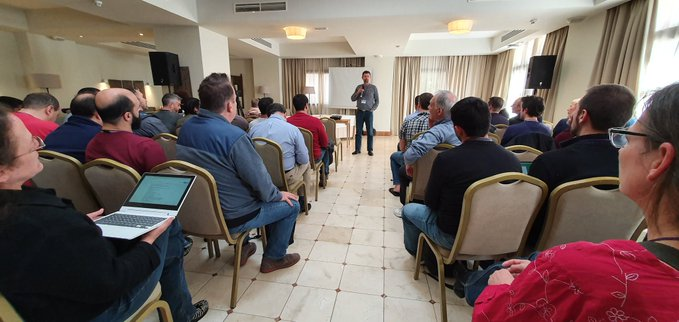
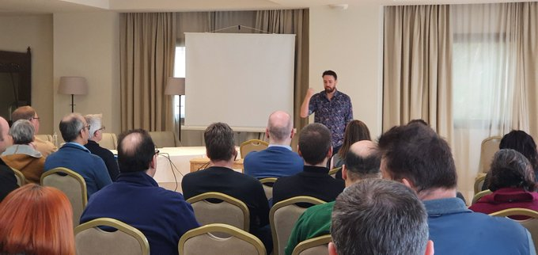
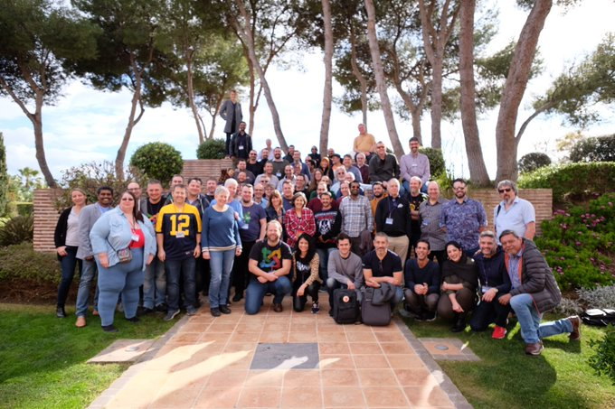

Ich war etwas verwundert, als die Einladung zum Forum for the Future bei mir eintraf. Mein erster Gedanke: Das ist nichts für dich. 

In der Vergangenheit habe ich zwar positive Erfahrungen mit Joomla! Code Sprints gesammelt. Ich hatte das Gefühl, dass ich etwas beitrug und ich habe neue Dinge gelernt. 

Es gab aber Events, bei denen ich mich fehl am Platz fühlte. Ich hatte das, was beim Sprint erstellt wurde nicht verstand. Ich sah den roten Faden nicht und hatte den Eindruck, dass keiner mir diesen zeigt. Mir fehlte die Energie, Erklärungen zu erbitten und deshalb zog ich mich zurück. 

> Aber wie das Leben so spielt, kamen ein paar Zufälle zusammen und ich stieß am 16. Januar zu den Teilnehmern des Joomla Forums for the Future hinzu. Ich war aufgeregt. Es war meine erste internationale Veranstaltung. Ich kannte fast keinen und bin es nicht gewöhnt in Englisch zu kommunizieren.

#### Mein Start beim Forum for Future

Beim Forum for Future habe ich den roten Faden zunächst wieder nicht gesehen. Ob es an mir liegt, fragte ich mich? 

Gleich zu Beginn kam eine Diskussion darüber auf, ob als erstes ein Ziel zu definieren ist. 

Gibt es ein gemeinsames Ziel in einem Open Source Zusammenschluss wie Joomla!? Joomla ist ein Projekt, das alleine durch die Gemeinschaft lebt und das keine Firma im Hintergrund hat, die es finanziell unterstützt. 

Im Falle eines kommerziellen Unternehmens ist das mit dem Ziel unkompliziert: Es wird von der Firma vorgegeben, die das Geld zahlt. In der Joomla Community gibt es viele unterschiedliche Ziele und die gilt es auf einen Nenner zu bringen. So ist das mit dem roten Faden komplizierter. 

> Alles hat seine Vorteile und seine Nachteile.

#### Ich habe im Team Technologie mitgearbeitet

Während der Arbeit in meinem Team hatte ich ab und an das Gefühl, dass wir nicht strukturiert genug vorgehen und wichtige Dinge die wir besprechen vergessen oder aus den Augen verlieren. Am Ende haben wir aber doch eine Liste mit Punkten zusammengestellt, die zu erledigen sind.

Kurzfristig ist es unserer Meinung nach wichtig, Joomla 4 fertigzustellen. Nicola hat eine Liste mit Release Blockern erstellt. Viele in meinem Team waren erstaunt, dass es diese nicht bereits gab!

Dann haben wir Ideen gesammelt, die mittelfristig oder langfristig wichtig sind. Diese haben wir in einem Dokument zusammengestellt.

Immer wieder kamen wir zu einem Punkt, an dem wir es als Problem sahen, wie neue Ideen und Funktionen integriert werden. Alle stimmten überein, die Aufnahme von Neuem zu strukturieren. Die meisten von uns wünschen sich eine Plattform, bei der alle Beteiligten mitreden. 
- Internetprovider, 
- Anwender, 
- Integratoren und 
- Marketing spielen bei der Diskussion neuer Ideen die gleiche Rolle wie 
- Entwickler.  

Ein erster Ansatz von uns ist es, neue Funktionen in einem strukturierten Dokument einzureichen und so eine zeitlich begrenzte Diskussion anzustoßen. Am Ende des 
Gedankenaustauschs entscheidet eine Abstimmung, ob die Funktion gewünscht ist. Dies wirkt auf den ersten Blick umständlich und bürokratisch. Aber: Man beurteilt einen neuen Prozess am besten, wenn man ihn ausprobiert. Und dies werden wir! Wir hoffen dass sich andere daran beteiligen, wenn alles fertig ist.

#### Ich habe ein positives Gefühl

Ich glaube, dass das Forum for the Future einige Dinge angestoßen hat. 
Ich hoffe, dass es kein Strohfeuer ist. 
Manche haben grundlegende Veränderungen und Ideen erwartet. Die sehe ich nicht. 
Ich glaube aber daran, dass kleine Dinge Großes bewirken. 
Ich habe ein positives Gefühl. Mein hoffnungsvoller Eindruck beruht darauf, 
dass ich von vielen hörte: Das haben wir doch schon oft gesagt und diskutiert. 
Es wurde aber nie umgesetzt. Reden reicht nicht immer. 

Und Einsicht ist der erste Weg zur Besserung!
