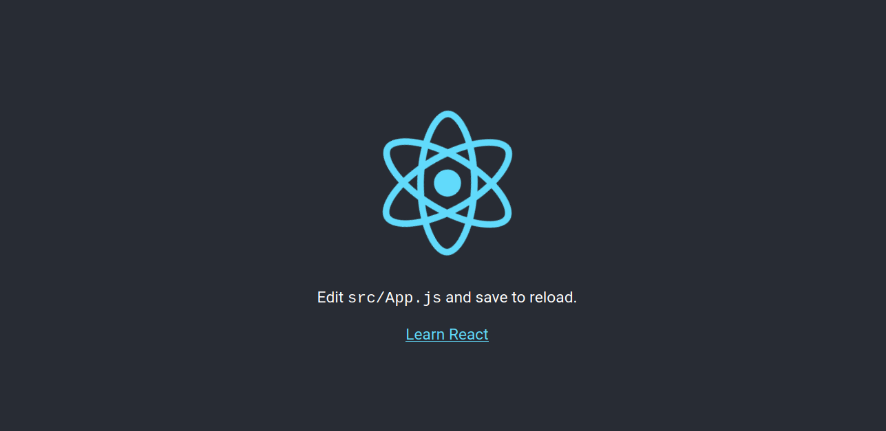
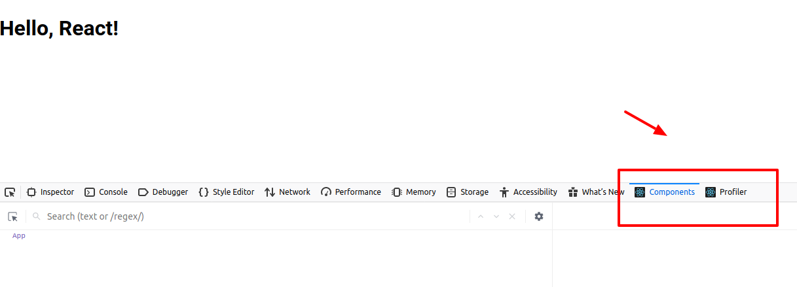
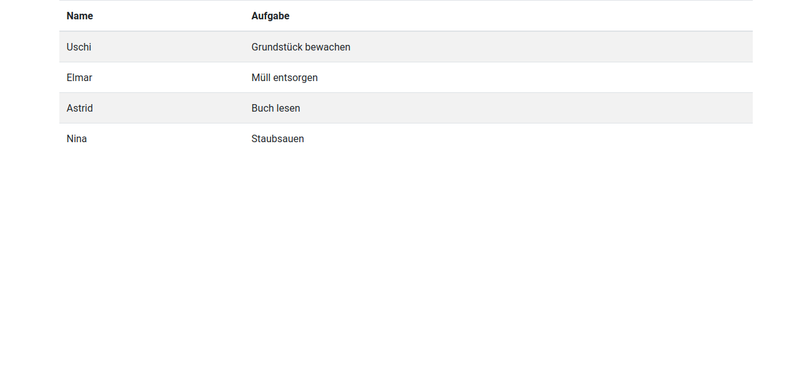
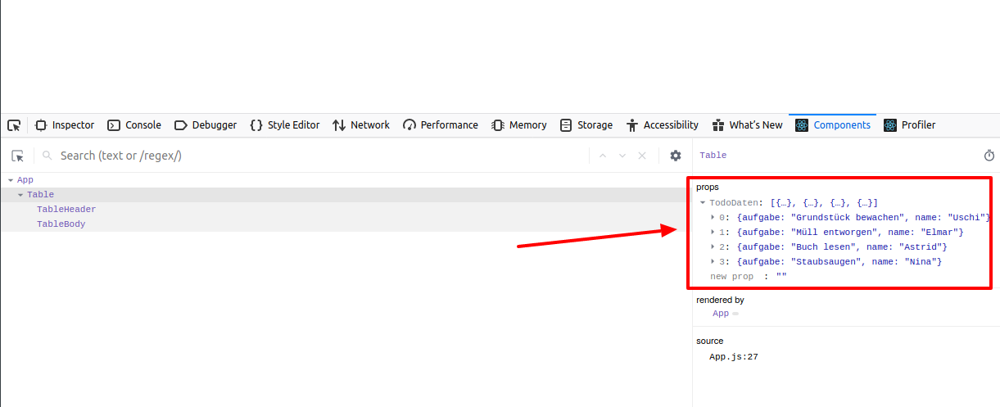
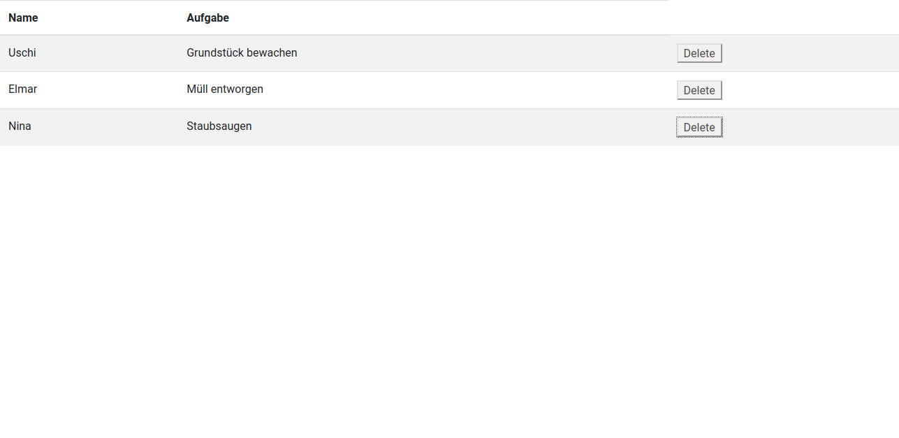
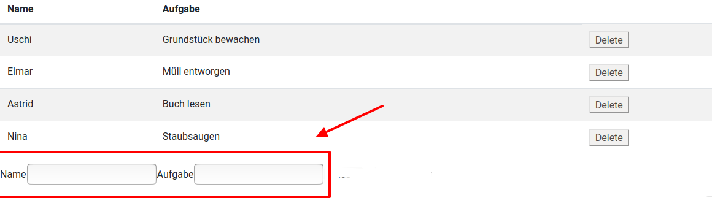
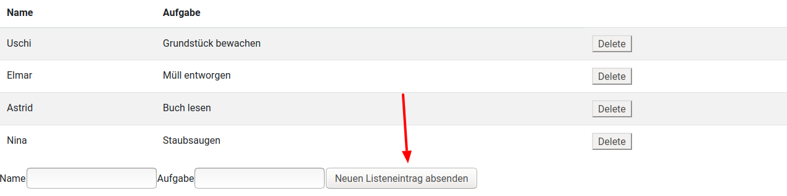
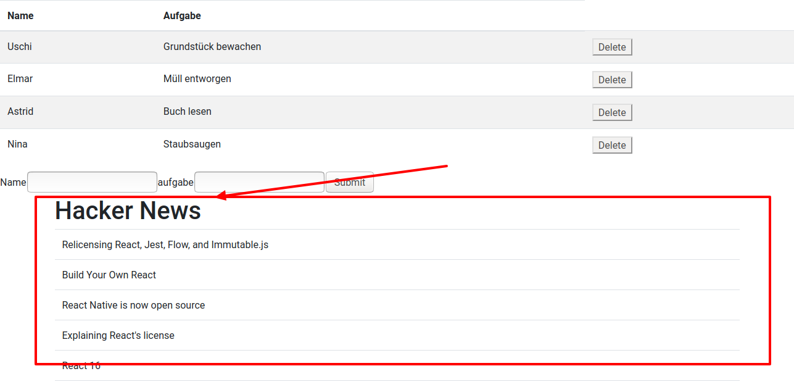

Immer mal wieder habe ich in eine [SPA](https://de.wikipedia.org/wiki/Single-Page-Webanwendung) hineingeschnuppert. Unter anderem habe ich mir [React](https://de.reactjs.org/) angesehen. Auf den ersten Blick hat die JavaScript-Softwarebibliothek mich abgeschreckt. Zum einen wirkte es kompliziert.

> Ich habe im Studium objektorientiert Java und deklarativ Haskell gelernt. Als ich dann in der Praxis gezwungen war PHP zu nutzen, war ich nicht vollends begeistert -- aber die Einfachheit hat mir gefallen.

Ich den Eindruck, dass in React HTML, CSS und JavaScript vermischt werden. Das ist genau das, was ich vermeide. Bei der Suche nach einem statischen Websitegenerator bin ich auf [Gatsby](https://www.gatsbyjs.org/) gestoßen und so habe ich mir die Frage erneut gestellt: _Warum ist React so populär_?

#### Voraussetzungen

Es gibt einige Dinge, die dir das Herumspielen mit React vereinfachen. Wenn JavaScript oder DOM Fremdwörter für dich sind, lerne diese besser zuerst kennen.

Hilfreich sind:

- Grundlegende HTML & CSS Kenntnisse
- Grundkenntnisse in JavaScript
- Ein grundlegendes Verständnis für das DOM
- Kenntnisse der ES6-Syntax und -Funktionen
- Node.js und npm

#### Ziel

- Erfahre mehr über wichtige React-Konzepte wie JSX, Komponenten, Eigenschaften (Props), Status und Lebenszyklus.
- Erstelle eine React-App, die die oben genannten Konzepte veranschaulicht.

Sieh dir hier den Code und eine Demo des Endergebnisses an.

- [Quellcode auf GitHub anzeigen](https://github.com/astridx/react-tutorial)
- [Projekt Demo ansehen](https://astridx.github.io/react-tutorial/)

## Was ist React?

Laut [Wikipedia](https://de.wikipedia.org/wiki/React) ist React eine JavaScript-Softwarebibliothek, die ein Grundgerüst für die Ausgabe von User-Interface-Komponenten von Webseiten zur Verfügung stellt (Webframework). Ich bin der Meinung, wir sehen uns das besser praktisch an.

## Einrichtung und Installation

Es gibt verschiedene Möglichkeiten, React einzurichten - ich zeige dir zwei.

### 1. Statische HTML-Datei

Diese erste Methode ist nicht die beste. Ich zeige sie dir, weil sie leicht zu verstehen ist und deshalb einen schnellen Einstieg ermöglicht. Insbesondere, wenn du nicht mit Webpack und Node.js vertraut bist.

Als Erstes erstelle die Datei `index.html`. Lade [React](https://reactjs.org/docs/cdn-links.html) und Babel per [CDN](https://de.wikipedia.org/wiki/Content_Delivery_Network) im Header. Beachte die ID namens `root`, diese ist wichtig. Benutzerdefinierten Code legen wir in einem separaten `script`-Tag am Ende der Site ab.

<div class="filename">index.html</div>

```html
<!DOCTYPE html>
<html>
  <head>
    <meta charset="utf-8" />

    <title>Hallo React!</title>

    <script src="https://unpkg.com/react@16/umd/react.development.js"></script>
    <script src="https://unpkg.com/react-dom@16/umd/react-dom.development.js"></script>
    <script src="https://unpkg.com/babel-standalone@6.26.0/babel.js"></script>
  </head>

  <body>
    <div id="root"></div>

    <script>
      // Dein benutzerdefinierter React-Code
    </script>
  </body>
</html>
```

Ich lade stabilen Versionen der Bibliotheken.

- [React](https://reactjs.org/docs/react-api.html) - die React Top Level API
- [React DOM](https://reactjs.org/docs/react-dom.html) - fügt DOM-spezifische Methoden hinzu
- [Babel](https://babeljs.io/) - Ein JavaScript-Compiler, mit dem wir ES6+ in Browsern verwenden können.

Der Einstiegspunkt für unsere App ist das div-Element `root`.

Schreiben wir unseren ersten React-Code. Wir werden ES6-Klassen verwenden, um eine React-Komponente namens `App` zu erstellen.

<div class="filename">index.html</div>

```jsx
class App extends React.Component {
  //...
}
```

Jetzt fügen wir [`render()`](https://de.reactjs.org/docs/react-component.html#render) hinzu, die einzige erforderliche Methode in einer Klassenkomponente, die zum Rendern von DOM-Knoten verwendet wird.

<div class="filename">index.html</div>

```jsx
class App extends React.Component {
  render() {
      return (
          //...
      );
  }
}
```

Mit `return` geben wir ein HTML-Element zurück. Beachte, dass wir hier keine Zeichenfolge/String zurückgeben. Verwende daher keine Anführungszeichen. Wir nutzen `JSX`, über das du hier mehr erfahren wirst.

<div class="filename">index.html</div>

```jsx
class App extends React.Component {
  render() {
    return <h1>Hallo Welt!</h1>
  }
}
```

Schließlich verwenden wir `render()`, um die `App` Klasse im `root` div zu rendern.

<div class="filename">index.html</div>

```jsx
ReactDOM.render(<App />, document.getElementById('root'))
```

Hier siehst du den vollständigen Code für die `index.html`.

<div class="filename">index.html</div>

```html
<!DOCTYPE html>
<html>
  <head>
    <meta charset="utf-8" />

    <title>Hallo React!</title>

    <script src="https://unpkg.com/react@16/umd/react.development.js"></script>
    <script src="https://unpkg.com/react-dom@16/umd/react-dom.development.js"></script>
    <script src="https://unpkg.com/babel-standalone@6.26.0/babel.js"></script>
  </head>

  <body>
    <div id="root"></div>

    <script type="text/babel">
      class App extends React.Component {
        render() {
          return <h1>Hallo Welt!</h1>
        }
      }

      ReactDOM.render(<App />, document.getElementById('root'))
    </script>
  </body>
</html>
```

Voilà! Wenn du die `index.html` jetzt im Browser aufrufst, wird das `h1`-Tag im DOM gerendert.


Das ist eingängig, oder?

Diese Methode, mit der wir JavaScript-Bibliotheken in eine statische HTML-Seite laden und React und Babel im laufenden Betrieb rendern, ist nicht effizient. Nebenbei ist eine solche Anwendung schwer zu warten.

Ich habe dieses Beispiel in erster Linie zu Motivationszwecken gewählt und um dir zu zeigen, was geht.

### 2. Die Create React App

Jetzt werden wir eine andere Methode verwenden: Die _Create React App_.

Facebook hat die [Create React App](https://github.com/facebook/create-react-app) erstellt: Eine Umgebung, die mit allem vorkonfiguriert ist, was du zum Erstellen einer _React App_ benötigst:

- Ein Live-Entwicklungsserver wird erstellt.
- Mit Webpack werden automatisch React-, JSX- und ES6-Dateien kompiliert.
- CSS-Dateien werden automatisch vorangestellt.
- Fehler werden mit ESLint im Code gefunden.

Konzentrieren dich so voll und ganz auf das Lernen von React.

Rufe zum Einrichten der _Create React App_ den folgenden Code über deine Befehlszeile auf. Wähle für den Aufruf das Verzeichnis, in dem du das Projekt anlegst. Stelle sicher, dass du [Node.js](https://nodejs.org/de/) installiest hast.

```bash
npx create-react-app react-tutorial
```

Wechsele nach Abschluss der Installation in das neu erstellte Verzeichnis und starte das Projekt.

```bash
cd react-tutorial
npm start
```

Sobald du diesen Befehl aufrufst, wird unter `localhost:3000` ein neues Fenster mit der neuen React-App angezeigt.



Wenn du dir die Projektstruktur ansiehst, bemerkst du ein Verzeichnis "/public" und "/src" sowie die Dateien `node_modules`, `.gitignore`, `README.md`, und `package.json`.

In `/public` findest du die `index.html`, welche der zuvor angelegten statischen Datei `index.html` sehr ähnlich ist. Du siehst nur ein div mit der ID `root`. Dieses Mal werden keine Bibliotheken oder Skripte geladen. Das Verzeichnis `/src` enthält unseren React-Code.

Um zu überprüfen, ob der Code automatisch kompiliert und aktualisiert wird, suche die folgende Zeile in `/src/App.js` und ersetze diese mit einem anderem Text:

```html
Edit <code>src/App.js</code> and save to reload.
```

Sobald du die geänerte Datei gespeichert hast, wirst du feststellen, dass `localhost:3000` mit den neuen Daten kompiliert und aktualisiert wird. Im Browser wird jetzt wie von Geisterhand der von dir geänderte Text angezeigt.

Lösche alles im Verzeichnis `/src` bis auf die Dateien `index.css` und `index.js`. Vieles würde nur verwirren. Wir erstellen unsere eigene Anwendung von Grund auf.

In die `index.css` habe ich die CSS-Datei von [Bootstrap](https://getbootstrap.com/docs/4.5/getting-started/download/) eingefügt. Ich finde, es sieht formatiert nach mehr aus. Du kannst hier deine eigenen Styles einfügen.

Jetzt importiere React, ReactDOM und die CSS-Datei in `index.js`.

<div class="filename">src/index.js</div>

```jsx
import React from 'react'
import ReactDOM from 'react-dom'
import './index.css'
```

Erstelle die `App`-Komponente neu. Vorher hatten wir ein `<h1>`. Jetzt füge ich ein div-Element mit einer Klasse hinzu. Ich nutze `className` anstelle von `class`. Dies ist der erster Hinweis darauf, dass du JSX schreibst, auch wenn es wie HTML aussieht!

<div class="filename">src/index.js</div>

```jsx
class App extends React.Component {
  render() {
    return (
      <div className="App">
        <h1>Hallo, React!</h1>
      </div>
    )
  }
}
```

Schließlich rendern wir die `App`. Kommt dir dieser Aufruf bekannt vor? Es ist derselbe, den wir zuvor in der statischen Datei verwendeten.

<div class="filename">src/index.js</div>

```js
ReactDOM.render(<App />, document.getElementById('root'))
```

Hier ist die vollständiger `index.js`. Dieses Mal importieren wir die `Component` direkt mit `import React, { Component } from 'react'`, sodass wir `Component` bei Klassendeklation nicht mehr erweitern.

<div class="filename">src/index.js</div>

```jsx
import React, { Component } from 'react'
import ReactDOM from 'react-dom'
import './index.css'

class App extends Component {
  render() {
    return (
      <div className="App">
        <h1>Hallo, React!</h1>
      </div>
    )
  }
}

ReactDOM.render(<App />, document.getElementById('root'))
```

Wenn zu `localhost:3000` zurückkehrst, wird "Hallo, React!" angezeigt. So wie vorher. Das ist der Anfang unserer React-App.

### React Developer Tools

Es gibt Werkzeuge, die das Leben eines React Developers vereinfachen. Installiere beispielsweise für Firefox das Addon [react-devtools](https://addons.mozilla.org/en-US/firefox/addon/react-devtools/).

Mit diesem ist es dir möglich, einen React-Baum zu untersuchen. Du verschaffst dir so einen Überblick über die Komponentenhierarchie, die Eigenschaften (Props), den Status und mehr. Öffne zunächst die [Entwicklerwerkzeuge in Firefox](https://developer.mozilla.org/de/docs/Tools/Keyboard_shortcuts#%C3%96ffnen_und_Schlie%C3%9Fen_von_Werkzeugen) und wechsel zur Registerkarte "Komponenten" oder "Profiler".



Jetzt haben wir alle Tools und Einstellungen, die wir benötigen, um mit React zu arbeiten.

> Falls du einen anderen Browser verwendest, findest du weitere Informationen in diesem [Blogbeitrag](https://de.reactjs.org/blog/2015/09/02/new-react-developer-tools.html#installation) oder bei [chrome.google.com](https://chrome.google.com/webstore/detail/react-developer-tools/fmkadmapgofadopljbjfkapdkoienihi) oder
> [microsoftedge.microsoft.com](https://microsoftedge.microsoft.com/addons/detail/react-developer-tools/gpphkfbcpidddadnkolkpfckpihlkkil)

## JSX: JavaScript + XML

Wie du gesehen hast, verwenden wir **JSX**, was wie HTML aussieht aber für JavaScript + XML steht. Es ist möglich, JSX einer Variablen zuzuweisen.

<div class="filename">JSX</div>

```jsx
const heading = <h1 className="site-heading">Hallo, React</h1>
```

Die Verwendung von JSX ist nicht zwingend. Im Hintergrund wird die Funktion `createElement` aufgerufen. Der folgende Code hat die gleiche Ausgabe wie die obige JSX-Anweisung.

<div class="filename">Kein JSX</div>

```jsx
import React, { Component } from 'react'
import ReactDOM from 'react-dom'
import './index.css'

const heading = React.createElement(
  'h1',
  { className: 'site-heading' },
  'Hallo, React!'
)

class App extends Component {
  render() {
    return <div>{heading}</div>
  }
}

ReactDOM.render(<App />, document.getElementById('root'))
```

JSX ist näher an JavaScript als an HTML:

- `className` wird anstelle von `class` zum Hinzufügen von CSS-Klassen verwendet, da `class` ein reserviertes Schlüsselwort in JavaScript ist.
- Eigenschaften und Methoden in JSX sind camelCase - `onclick` wird zu `onClick`.
- Selbstschließende Tags enden in einem Schrägstrich - beispielsweise ``

JavaScript-Ausdrücke werden in geschweiften Klammern in JSX eingebettet - einschließlich Variablen, Funktionen und Eigenschaften.

```jsx
const name = 'Astrid'
const heading = <h1>Hallo, {name}</h1>
```

JSX ist unkomplizierter als viele Elemente in [Vanilla-JavaScript)(https://wiki.selfhtml.org/wiki/Vanilla-JS) und einer der Gründe, warum viele React bevorzugen.

## Komponenten

Bisher haben wir eine Komponente erstellt - die App`-Komponente. Fast alles in React besteht aus Komponenten, welches **Klassenkomponenten** oder **Funktionskomponenten** sind.

> Sieh dir das [Kapitel _Legacy-React_](https://github.com/the-road-to-learn-react/the-road-to-react-german/blob/master/manuscript/react-legacy/class-components.md) im Buch _The Road to React_ an, um mehr über die Entwicklung er Komponenten in React zu lernen.

Die meisten React-Apps bestehen aus vielen kleinen Komponenten, und alles wird über die Hauptkomponente `App` geladen. Komponenten werden in der Regel in einer eigenen Datei gespeichert. So bleibt das Projekt übersichtlich.

Entferne die `App`-Klasse aus der Datei `index.js`:

<div class="filename">src/index.js</div>

```jsx
import React from 'react'
import ReactDOM from 'react-dom'
import App from './App'
import './index.css'

ReactDOM.render(<App />, document.getElementById('root'))
```

Dies führt zunächst zu einer Fehlermeldung, weil App nicht gefunden wird. Wir werden eine neue Datei namens `App.js` erstellen und die Komponente dort implementieren.

<div class="filename">src/App.js</div>

```jsx
import React, { Component } from 'react'

class App extends Component {
  render() {
    return (
      <div className="App">
        <h1>Hallo, React!</h1>
      </div>
    )
  }
}

export default App
```

Exportiere die Komponente als `App` und importieren sie in `index.js`. Es ist nicht zwingend erforderlich, Komponenten in Dateien zu trennen, aber eine Anwendung wird andernfalls unhandlich und läuft Gefahr außer Kontrolle zu geraten.

> Sieh dir das [Kapitel _Projektstruktur_](https://github.com/the-road-to-learn-react/the-road-to-react-german/blob/master/manuscript/react-maintenance/project-structure.md) im Buch _The Road to React_ an.

### Klassenkomponenten

Lasse uns eine weitere Komponente erstellen. Wir werden eine Tabelle anlegen. Nenne die Datei `Table.js` und fülle sie wie folgt. `className="table table-striped"` ist optional. Es handelt sind um [Booststrap Klassen](https://getbootstrap.com/docs/4.5/content/tables/#striped-rows), die dafür sorgen, dass die Tabelle formatiert wird.

<div class="filename">src/Table.js</div>

```jsx
import React, { Component } from 'react'

class Table extends Component {
  render() {
    return (
      <table className="table table-striped">
        <thead>
          <tr>
            <th>Name</th>
            <th>Aufgabe</th>
          </tr>
        </thead>
        <tbody>
          <tr>
            <td>Uschi</td>
            <td>Grundstück bewachen</td>
          </tr>
          <tr>
            <td>Elmar</td>
            <td>Müll entsorgen</td>
          </tr>
          <tr>
            <td>Astrid </td>
            <td>Buch lesen</td>
          </tr>
          <tr>
            <td>Tim</td>
            <td>Staubsauen</td>
          </tr>
        </tbody>
      </table>
    )
  }
}

export default Table
```

`Table` ist eine benutzerdefinierte Klassenkomponente. Wir verwenden diese, weil sie mehr bietet, als ein normales HTML-Elementen. Zurück in `App.js` können wir die Tabelle laden, indem wir sie zuerst importieren:

<div class="filename">src/App.js</div>

```jsx
import Table from './Table'
```

Lade die Tabelle dann in der Funktion `render()` der App-Komponente.

<div class="filename">src/App.js</div>

```jsx
import React, { Component } from 'react'
import Table from './Table'

class App extends Component {
  render() {
    return (
      <div>
        <Table />
      </div>
    )
  }
}

export default App
```

> Das umgebenden div-Tag ist zwingend. Lies im [Kapitel _Fragemente_](https://github.com/the-road-to-learn-react/the-road-to-react-german/blob/master/manuscript/react-modern/fragments.md) des Buchs _The Road to React_ welche Alternativen es gibt.

Fertig! Sieh dir die Beispielanwendung im Brwoser an, die Tabelle `Table` wird geladen.



Du weißt nun, was eine benutzerdefinierte Klassenkomponente ist. Verwende diese an beliebigen Stellen. Das nachfolgende Beispiel zeigt die Tabelle zweimal hintereinander an. Das ist nicht sinnvoll. Es geht nur ums Prinzip.

<div class="filename">src/App.js</div>

```jsx
import React, { Component } from 'react'
import Table from './Table'

class App extends Component {
  render() {
    return (
      <div>
        <Table />
        <Table />
      </div>
    )
  }
}

export default App
```

Die Daten sind momentan fest codiert. Meist arbeiten wir mit dynamischen Daten. Erweitere die Anwendung, so das du flexible Daten lädst.

### Funktionskomponenten

Die andere Art Komponente in React ist die **Funktionskomponente**. Diese verwendet nicht das Schlüsselwort `class`. Nehmen wir unsere `Table` Tabelle und erstellen zwei Funktionskomponenten - einen Tabellenkopf und einen Tabellenkörper.

Wir werden [ES6-Pfeilfunktionen](https://developer.mozilla.org/de/docs/Web/JavaScript/Reference/Functions/Pfeilfunktionen) verwenden. Zuerst die Tabellenüberschrift.

<div class="filename">src/Table.js</div>

```jsx
const TableHeader = () => {
  return (
    <thead>
      <tr>
        <th>Name</th>
        <th>Aufgabe</th>
      </tr>
    </thead>
  )
}
```

Dann der Körper.

<div class="filename">src/Table.js</div>

```jsx
const TableBody = () => {
  return (
    <tbody>
      <tr>
        <td>Uschi</td>
        <td>Grundstück bewachen</td>
      </tr>
      <tr>
        <td>Elmar</td>
        <td>Müll entsorgen</td>
      </tr>
      <tr>
        <td>Astrid </td>
        <td>Buch lesen</td>
      </tr>
      <tr>
        <td>Tim</td>
        <td>Staubsaugen</td>
      </tr>
    </tbody>
  )
}
```

Jetzt sieht unsere `Table.js` wie folgt aus. Die drei Punkte sind Platzhalter für die zuvor beschriebenen Funktionskomponenten. Beachte, dass sich `TableHeader` und `TableBody` in derselben Datei befinden und von der Klassenkomponente `Table` verwendet werden.

<div class="filename">src/Table.js</div>

```jsx
const TableHeader = () => { ... }
const TableBody = () => { ... }

class Table extends Component {
  render() {
    return (
      <table className="table table-striped">
        <TableHeader />
        <TableBody />
      </table>
    )
  }
}
```

In der Ansicht im Browser hat sich nichts geändert. Wie du bemerkst, ist es möglich, Komponenten in anderen zu verschachteln und Funktionskomponenten und Klassenkomponenten zu mischen.

> Eine Klassenkomponente muss `render()` enthalten.

Zum Abschluss vergleichen wir eine Funktionskomponente mit einer Klassenkomponente.

<div class="filename">Funktionskomponente</div>

```jsx
const FunktionsKomponente = () => {
  return <div>Beispieltext</div>
}
```

<div class="filename">Klassenkomponente</div>

```jsx
class KlassenKomponente extends Component {
  render() {
    return <div>Beispieltext</div>
  }
}
```

Beachte: Wenn `return` in einer Zeile steht, sind keine Klammern erforderlich.

## Eigenschaften (Props)

Im Moment haben wir die `Table`-Komponente, in der die Daten fest codiert sind. Eine der großen Herausforderungen bei React ist der Umgang mit dynamischen Daten. Verwende hierzu [Eigenschaften (Props)](https://de.reactjs.org/docs/components-and-props.html) und [Status](https://de.reactjs.org/docs/state-and-lifecycle.html).

Entferne zunächst alle Daten aus der `TableBody`-Komponente.

<div class="filename">src/Table.js</div>

```jsx
...
const TableBody = () => {
  return <tbody />
}
...
```

Verschiebe diese in ein Array. Erstellen dieses Array in der Methode `render()` der App.

<div class="filename">src/App.js</div>

```jsx
...
class App extends Component {
  render() {
    const listeneintraege = [
      {
        name: 'Uschi',
        aufgabe: 'Grundstück bewachen',
      },
      {
        name: 'Elmar',
        aufgabe: 'Müll entworgen',
      },
      {
        name: 'Astrid',
        aufgabe: 'Buch lesen',
      },
      {
        name: 'Tim',
        aufgabe: 'Staubsaugen',
      },
    ]

    return (
      <div>
        <Table />
      </div>
    )
  }
}
...
```

Jetzt werden wir die Daten mittels Eigenschaften (Props) an die untergeordnete Komponente (`Table`) weiterleiten, so wie du Daten mithilfe von `data-`Attributen in HTML weitergibst. Der Name ist beliebig, solange du kein [reserviertes Schlüsselwort](https://developer.mozilla.org/de/docs/Web/JavaScript/Reference/Lexical_grammar#Schl%C3%BCsselw%C3%B6rter) wählst. Ich wähle `TodoDaten`. Die Variabel selbst nenne ich `listeneintraege`. Ich setze diese in geschweifte Klammern, da es sich um einen JSX-Ausdruck handelt. Übergib die Daten an `Table`:

<div class="filename">src/App.js</div>

```jsx
...
return (
  <div>
    <Table TodoDaten={listeneintraege} />
  </div>
)
...
```

`Table` nimmt die Daten an:

<div class="filename">src/Table.js</div>

```jsx
...
class Table extends Component {
  render() {
    const { TodoDaten } = this.props

    return (
      <table className="table table-striped">
        <TableHeader />
        <TableBody TodoDaten={TodoDaten} />
      </table>
    )
  }
}
...
```

Wenn du das React Entwicklertool öffnest und `Table` untersuchst, wird das Datenarray in den Eigenschaften angezeigt. Die hier gespeicherten Daten werden als **virtuelles DOM** bezeichnet. Dies ist eine schnelle und effiziente Methode zum Synchronisieren von Daten mit dem tatsächlichen DOM.



Diese Daten befinden sich jedoch noch nicht im eigentlichen DOM. In `Table` können wir über `this.props` auf alle Eigenschaften (Props) zugreifen. Konkret verwenden wir `this.props.TodoDaten`, um diese Daten abzurufen.

Ich verwende die Kurzform der ES6-Eigenschaft, um eine Variable zu erstellen, die `this.props.TodoDaten` enthält.

```jsx
...
const { TodoDaten } = this.props
...
```

Da `Table` tatsächlich aus zwei kleineren einfachen Komponenten besteht, werde ich sie über Eigenschaften (Props) noch einmal weiterleiten, dieses Mal an den `TableBody` .

<div class="filename">src/Table.js</div>

```jsx
...
class Table extends Component {
  render() {
    const { TodoDaten } = this.props

    return (
      <table className="table table-striped">
        <TableHeader />
        <TableBody TodoDaten={TodoDaten} />
      </table>
    )
  }
}
...
```

Aktuell akzeptiert `TableBody` keine Parameter.

<div class="filename">src/Table.js</div>

```jsx
const TableBody = () => {
  return <tbody />
}
```

Änderne folgendes: Übergib die Eigenschaft (Prop) als Parameter und nutzen [map()](https://developer.mozilla.org/de-DE/docs/Web/JavaScript/Reference/Global_Objects/Array/map) um für jedes Objekt im Array eine Tabellenzeile zurück zu erhalten. Diese Zuordnung geschieht in der Variablen `rows`, die wir als Ausdruck zurückgeben.

<div class="filename">src/Table.js</div>

```jsx
...
const TableBody = props => {
  const rows = props.TodoDaten.map((row, index) => {
    return (
      <tr key={index}>
        <td>{row.name}</td>
        <td>{row.aufgabe}</td>
      </tr>
    )
  })

  return <tbody>{rows}</tbody>
}
...
```

Sieh dir das Frontend an: Alle Daten werden nun angezeigt.

Jeder Tabellenzeile wird ein Schlüsselindex hinzugefügt. Verwende immer [Schlüssel](https://de.reactjs.org/docs/lists-and-keys.html#keys), wenn du Listen in React erstellst, da diese zur Identifizierung der einzelnen Listenelemente wichtig ist.

> Sieh dir das [Kapitel _Eigenschaften (Props) in React_](https://github.com/the-road-to-learn-react/the-road-to-react-german/blob/master/manuscript/react-modern/props.md) im Buch _The Road to React_ an, um weitere Beispiele zu erkunden.

## Status

Im Moment speichern wir die Listeneinträge in einem Array und geben sie als Eigenschaft weiter. Dies ist ein Anfang. Stelle dir vor, wir löschen ein Element aus dem Array. Mit Eigenschaften übergeben wir Daten. Es ist nicht möglich, diese zu aktualisieren. Hierfür nutzen wir den Status.

Für mich ist der Status eine Art Sammlung aller Daten, die gespeichert und geändert werden. Sehen wir uns das praktich an. Erstelle als Erstes ein `state`-Objekt.

<div class="filename">src/App.js</div>

```jsx
...
class App extends Component {
  state = {}
}
...
```

Das Objekt enthält Eigenschaften für alles, was du im Status speichern möchtest. In unserem Fall ist dies die Variable `listeneintraege`.

<div class="filename">src/App.js</div>

```jsx
class App extends Component {
  state = {
    listeneintraege: [],
  }
}
```

Verschiebe das zuvor erstellte Array in `state.listeneintraege`.

<div class="filename">src/App.js</div>

```jsx
...
class App extends Component {
  state = {
    listeneintraege: [
      {
        name: 'Uschi',
        // Die restlichen Daten
      },
    ],
  }
  ...
}
...
```

Unsere Daten sind jetzt im Status enthalten. Da wir eine Zeile aus der Tabelle entfernen möchten, erstellen wir eine Methode `removeListeneintrag` für die übergeordnete Klasse `App`.

Um den Status zu aktualisieren, verwenden wir `this.setState()`. Wir [filtern das Array](https://developer.mozilla.org/de/docs/Web/JavaScript/Reference/Global_Objects/Array/filter) basierend auf dem `index`, den wir durchlaufen. Zurück erhalten wir ein neues Array.

> Verwende `this.setState()`, um den Status zu aktualisieren. Es ist nicht möglich, `this.state.property` direkt einen neuen Wert zuzuweiesen.

<div class="filename">src/App.js</div>

```jsx
...
removeListeneintrag = index => {
  const { listeneintraege } = this.state

  this.setState({
    listeneintraege: listeneintraege.filter((listeneintrag, i) => {
      return i !== index
    }),
  })
}
...
```

Die Methode `filter` erstellt ein neues Array. Sie testet einen Index mit allen Indizes im Array und gibt alle außer dem Index zurück, der durchlaufen wird.

Jetzt übergeben wir die gefilterten Einträge. Außerdem übergeben wir die Funktion `removeListeneintrag` als Eigenschaft (Props) an `Table`.

<div class="filename">src/App.js</div>

```jsx
...
render() {
  const { listeneintraege } = this.state

  return (
    <div>
      <Table TodoDaten={listeneintraege} removeListeneintrag={this.removeListeneintrag} />
    </div>
  )
}
...
```

`removeListeneintrag` geben wir an `TableBody` weiter, genau wie wir es mit den Listeneinträgen getan haben.

Da die einzigen Komponenten mit eigenen Zuständen in unserem Projekt `App` und `Form` sind, ist es empfehlenswert, `Table` aus der aktuellen Klassenkomponente in eine Funktionskomponente umzuwandeln.

<div class="filename">src/Table.js</div>

```jsx
...
const Table = (props) => {
  const { TodoDaten, removeListeneintrag } = props;

  return (
    <table className="table table-striped">
      <TableHeader />
      <TableBody TodoDaten={TodoDaten} removeListeneintrag={removeListeneintrag} />
    </table>
  );
}
...
```

Jetzt kommt der Index ins Spiel, den wir in der Methode `removeListeneintrag()` definiert haben. In der Komponente `TableBody` übergeben wir diesen als Parameter, damit die Filterfunktion weiß, welches Element entfernt werden soll. Wir erstellen eine Schaltfläche mit einem `onClick` Ereignis.

<div class="filename">src/Table.js</div>

```jsx
...
<tr key={index}>
  <td>{row.name}</td>
  <td>{row.aufgabe}</td>
  <td>
    <button onClick={() => props.removeListeneintrag(index)}>Delete</button>
  </td>
</tr>
...
```

Genial. Jetzt haben wir Schaltflächen zum Löschen und ändern den Status beim Löschen eines Eintrags.



Astrid hat das Buch gelesen, ich habe den Eintrag gelöscht.

Jetzt ist dir klar, wie der Status initialisiert wird und wie er geändert wird, richtig.

> Sieh dir gerne das [Kapitel _Status in React_](https://github.com/the-road-to-learn-react/the-road-to-react-german/blob/master/manuscript/react-modern/state.md) im Buch _The Road to React_ an.

## Senden von Formulardaten

Wir speichern Daten im Status und können jedes Element aus dem Status entfernen. Als nächstes möchten wir neue Daten hinzufügen!

Entfernen wir als Erstes alle fest codierten Daten aus `state.listeneintraege`, da wir diese nachfolgend über das Formular aktualisieren werden.

<div class="filename">src/App.js</div>

```jsx
class App extends Component {
  state = {
    listeneintraege: [],
  }
}
```

Lasse uns nun eine `Form`-Komponente in einer neuen Datei mit dem Namen `Form.js` erstellen. Wir werden eine Klassenkomponente erstellen und darin einen Konstruktor `constructor()` verwenden, was wir bisher noch nicht getan haben. Wir benötigen den Konstruktor, um `this` zu verwenden und so die Eigenschaften `props` des Elternteils zu erhalten.

Wir legen den Anfangszustand des Formulars `Form` fest und weisen diesen Anfangszustand `this.state` zu.

<div class="filename">src/Form.js</div>

```jsx
import React, { Component } from 'react'

class Form extends Component {
  constructor(props) {
    super(props)

    this.initialState = {
      name: '',
      aufgabe: '',
    }

    this.state = this.initialState
  }
}
```

Unser Ziel für dieses Formular ist es, den Status von `Form` jedes Mal zu aktualisieren, wenn ein Feld geändert wird. Wenn wir es senden, werden alle diese Daten in den Status von `App` übertragen, der dann `Table` aktualisiert .

Zuerst erstellen wir die Funktion `handleChange`, die jedes Mal ausgeführt wird, wenn eine Änderung an einer Eingabe vorgenommen wird. Das Ereignis `event` wird durchlaufen, und wir setzen den Status von `Form` so, dass `name` (Schlüssel) und der `value` (Wert) der Eingaben angezeigt werden.

<div class="filename">src/Form.js</div>

```jsx
handleChange = (event) => {
  const { name, value } = event.target

  this.setState({
    [name]: value,
  })
}
```

Lassen Sie uns dies zum Laufen bringen, bevor wir mit dem Absenden des Formulars fortfahren. Rufen wir beim Rendern die Eigenschaften (Props) aus dem Status ab. Wir fühen die `handleChange()`-Methode als `onChange` der Eingabe aus und exportieren am Ende die `Form`-Komponente.

<div class="filename">src/Form.js</div>

```jsx
render() {
  const { name, aufgabe } = this.state;

  return (
    <form>
      <label for="name">Name</label>
      <input
        type="text"
        name="name"
        id="name"
        value={name}
        onChange={this.handleChange} />
      <label for="aufgabe">aufgabe</label>
      <input
        type="text"
        name="aufgabe"
        id="aufgabe"
        value={aufgabe}
        onChange={this.handleChange} />
    </form>
  );
}

export default Form;
```

In `App.js` rendern wir das Formular unter der Tabelle.

<div class="filename">src/App.js</div>

```jsx
return (
  <div>
    <Table
      TodoDaten={listeneintraege}
      removeListeneintrag={this.removeListeneintrag}
    />
    <Form />
  </div>
)
```

Wenn wir jetzt das Frontend unserer App öffnen, sehen wir ein Formular. Wenn du einige Felder aktualisierst, wird der lokale Status von `Form` aktualisiert. Die Schaltfläche zum Hinzufügen eines Eintrags fehlt noch.



Soweit so gut! Im letzten Schritt übermitteln wir die Daten. Wir werden eine Funktion namens `handleSubmit()` erstellen. Wir bauen auf dem vorhandenen `this.state.listeneintraege` auf. Den neuen `listeneintrag`-Parameter fügen wir mithilfe des [ES6-Spread-Operators](https://developer.mozilla.org/de/docs/Web/JavaScript/Reference/Operators/Spread_syntax) hinzu.

<div class="filename">src/App.js</div>

```jsx
handleSubmit = (listeneintrag) => {
  this.setState({
    listeneintraege: [...this.state.listeneintraege, listeneintrag],
  })
}
```

Wir übergeben die Eigenchaften (Props) an `Form`.

```jsx
<Form handleSubmit={this.handleSubmit} />
```

Jetzt erstellen wir in `Form` die Methode `submitForm()` die `handleSubmit()` aufruft und Status auf den ursprünglichen Status zurückgesetzt, um die Einträge nach dem Senden zu löschen.

<div class="filename">src/Form.js</div>

```jsx
submitForm = () => {
  this.props.handleSubmit(this.state)
  this.setState(this.initialState)
}
```

Schließlich fügen wir eine Schaltfläche zum Senden hinzu. Wir verwenden `onClick` anstelle `onSubmit`, da wir nicht die Standard-Submit-Funktionalität verwenden. Der Klick ruft die soeben erstellte Funktion `submitForm()` auf.

```jsx
<input
  type="button"
  value="Neuen Listeneintrag absenden"
  onClick={this.submitForm}
/>
```

Und das ist es! Die App ist vollständig. Wir können Listeneinträge erstellen, hinzufügen und aus unserer Tabelle entfernen. Da `Table` und `TableBody` bereits aus dem Status gezogen wurden, wird alles akutell angezeigt.



Wenn du dich irgendwo verlaufen hast, sieh dir [den Code auf GitHub an](https://github.com/astridx/react-tutorial).

> Im [Kapitel _Formulare in React_](https://github.com/the-road-to-learn-react/the-road-to-react-german/blob/master/manuscript/react-modern/forms.md) des Buch _The Road to React_ findest du weitere Informationen.

## API-Daten abrufen

Häufige werden Daten einer API verwendet. Deshalb möchte ich Datenabrufe hier kurz ansprechen. Wir rufen Daten von einer echten Drittanbieter-API ab. Dazu verwenden wir die zuverlässige und informative [Hacker News API](https://hn.algolia.com/api).

> Sieh dir für ein vollständiges Beispiel [zu Datenabrufe in React](https://github.com/the-road-to-learn-react/the-road-to-react-german/blob/master/manuscript/react-modern/data-fetching.md) im Buch _The Road to React_ an.

Erstelle die Datei `Api.js` und in ihr die Komponente `Api`. Eine öffentliche API, mit der wir testen können, ist die [Hacker News API](https://hn.algolia.com/api). Wir nutzen die Fetch API. Diese bietet eine Schnittstelle zum Abrufen von Daten. Ich werde diesen Code nicht zeilenweise erklären, da wir bereits gelernt haben, eine Komponente zu erstellen, zu rendern und über ein Status-Array zu aktualisieren. Neu ist `componentDidMount()`, eine React-Lebenszyklusmethode. **Lebenszyklus** ist die Reihenfolge, in der Methoden in React aufgerufen werden.

Wenn wir API-Daten abrufen, möchten wir sicherstellen, dass die Komponente in das DOM gerendert wurde, bevor wir die Daten einbringen. Im folgenden Ausschnitt siehst du examplarisch, wie Daten aus der Hacker News API auf der Seite integriert werden.

<div class="filename">Api.js</div>

```jsx
import React, { Component } from 'react'

class Api extends Component {
  state = {
    data: [],
  }

  componentDidMount() {
    const url = 'https://hn.algolia.com/api/v1/search?query=React'

    fetch(url)
      .then((result) => result.json())
      .then((result) => {
        this.setState({
          data: result.hits,
        })
      })
  }

  render() {
    const { data } = this.state

    const result = data.map((item, key) => (
      <tr>
        <td>
          <a href={item.url}>{item.title}</a>
        </td>
      </tr>
    ))

    return (
      <div className="container">
        <hr />
        <hr />
        <hr />
        <h1>Hacker News</h1>
        <table className="table">{result}</table>
      </div>
    )
  }
}

export default Api
```

Sobald du diese Datei gespeichert, sie in App.js importiert und gerendert hast, werden die Hacker News-API-Daten im DOM angezeigt.



## Erstellen und Bereitstellen einer React-App

Alles, was wir bisher getan haben, war in einer Entwicklungsumgebung. Wir haben im laufenden Betrieb kompiliert, im laufenden Betrieb neu geladen und aktualisiert. Für die Produktion möchten wir statische Dateien laden. Wir können dies tun, indem wir einen Build erstellen und bereitstellen.

Wenn du nur den gesamten React-Code kompilieren und irgendwo ablegen möchten, reicht der folgende Aufruf:

```bash
npm run build
```

`npm run build` erstellt einen `build`-Ordner, der die App enthält. Lege den Inhalt dieses Ordners an eine beliebige Stelle, und du bist fertig! Die Datei `index.html` im Wurzelverzeichnis startet die Anwendung.

Wir gehen einen Schritt weiter. `npm` übernimmt das Bereitstellen, wenn wir die `package.json` entsprechend konfigurieeren. Wir werden eine GitHub-Seite erstellen, daher ist es gut, wenn du mit Git vertraut bist und deinen Code auf GitHub bereitstellen.

Stelle sicher, dass du deine lokale React-Umgebung beendet hast, damit der Code derzeit nicht ausgeführt wird. Zuerst fügen wir in der `package.json` ein `homepage` Feld hinzu, das die URL für das Projekt enthält.

<div class="filename">package.json</div>

```js
"homepage": "https://astridx.github.io/react-tutorial",
```

Füge diese beiden Zeilen zur Eigenschaft `scripts` hinzufügen.

```js
"scripts": {
  // ...
  "predeploy": "npm run build",
  "deploy": "gh-pages -d build"
}
```

In deinem Projekt füge `gh-pages` zu den `devDependencies` hinzu.

```bash
npm install --save-dev gh-pages
```

Wir erstellen den `build`, der alle kompilierten statischen Dateien enthält.

```bash
npm run build
```

Schließlich werden wir auf `gh-pages` bereitstellen.

```bash
npm run deploy
```

> Im [Kapitel _In Firebase veröffentlichen/bereitstellen_](https://github.com/the-road-to-learn-react/the-road-to-react-german/blob/master/manuscript/react-deploy/firebase.md) des Buch _The Road to React_ findest du weitere Informationen zum Bereitstellen mittels Firebase.

Wir sind fertig! Die App ist jetzt live verfügbar: [https:/astridx.github.io/react-tutorial](https://astridx.github.io/react-tutorial).

## Fazit

Dieser Artikel hat das Ziel eine Einführung in React zu sein. Es gibt einen Überblick über die Themen

- Funktions- und Klassenkomponenten,
- Status,
- Eigenschaften (Props),
- Arbeiten mit Formulardaten,
- Abrufen von Daten aus einer API und
- Bereitstellen einer App.

Ein Blogbeitrag informiert nicht allumfassend. Er gibt nur einen Eindruck. Ich hoffe, dass ich dir diesen vermittelt habe und du nun Lust hast, tiefer in React hinein zu blicken. Wenn dir der Beitrag gefallen hat, dann ist das [Buch](https://github.com/the-road-to-learn-react/the-road-to-react-german) sicher ebenfalls etwas für dich.

- [Quellcode auf GitHub anzeigen](https://github.com/astridx/react-tutorial)
- [Projekt Demo ansehen](https://astridx.github.io/react-tutorial/)
