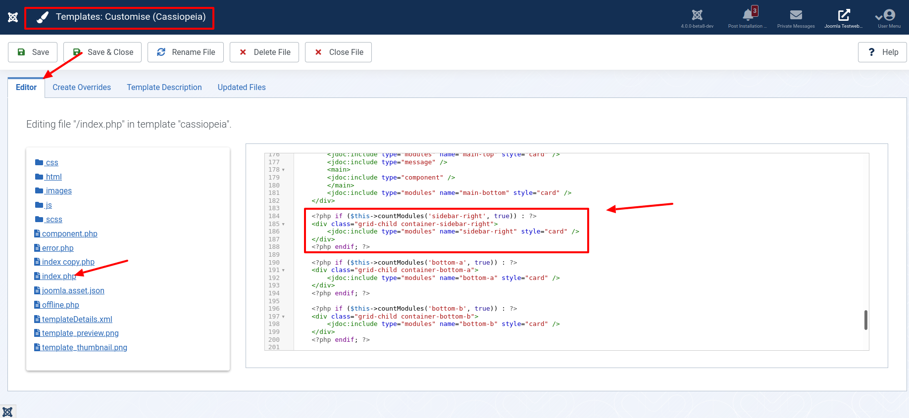
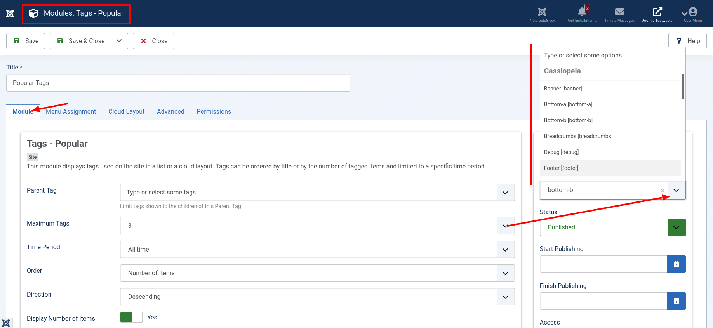
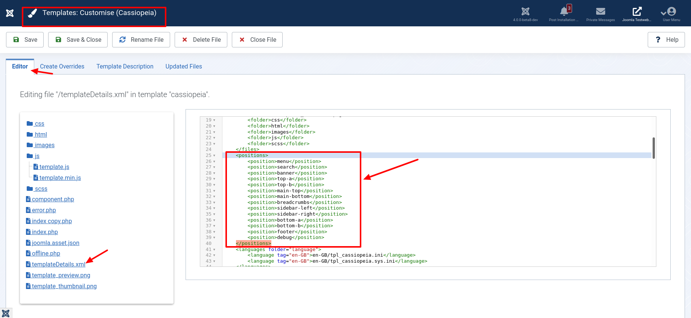
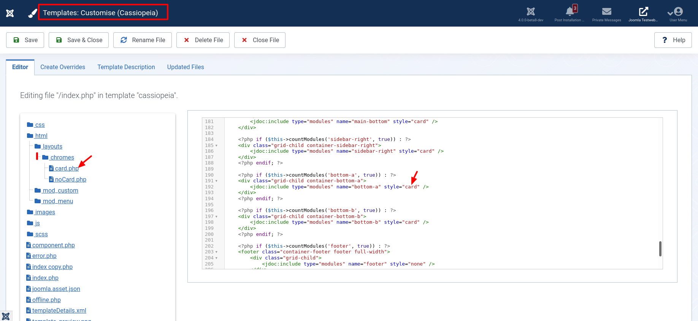
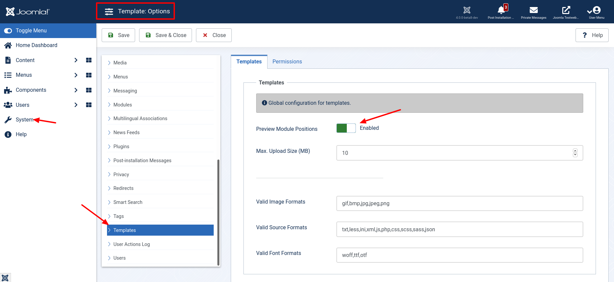

Already at the first glance at a fresh Joomla 4 installation one of the main innovations becomes visible: The new frontend template called Cassiopeia. But also in the background some things have changed: The module positions of the template have been renamed, so that modules can now be assigned to the corresponding positions more easily and intuitively: A human can understand `sidebar-right` better than `position-7`.<!-- \index{skeleton!module positions} --><!-- \index{module positions} -->

> A module position is a placeholder in a [template](https://docs.joomla.org/Special:MyLanguage/Template). Placeholders specify one or more positions within the template and tell the Joomla application where to display modules associated with a particular position.

Two positions were added just before Joomla 4 was released. "topbar" provides a way to display a module at the very top of the page. "below-top", as the name suggests, appears below it. Why was "below-top" integrated? Not all users want to display a logo in the header of their web page. Cassiopeia offers via parameter the possibility to switch off the display of a logo or a description. For this purpose there is a new position "below-top", where the user can add his own module instead of the logo. The use of both - position "below-top" and logo - is possible.

The following graphic shows the module positions in Cassiopeia as an overview:


The default template of Joomla 4 - Cassiopeia - has a fixed number of default module positions. These positions are displayed in the Position dropdown list when you create or edit individual modules. You edit the modules in the module manager `/administrator/index.php?option=com_modules&view=modules`. The place where a position is displayed within the HTML document of the website is defined in the file `index.php` of a Joomla template. In Cassiopeia this looks as follows for the position `sidebar-right`:



If you want to create new CSS styles for modules at this position, you have to edit the HTML container for this position and not the position name itself. The position name does not appear in the HTML code for the web page at all. For example, if you want to style something with CSS placed at position 'sidebar-right', you should style class 'container-sidebar-right' with CSS.

## How are positions integrated into the template in Joomla 4?



In order for a position to be displayed in the dropdown list of options for position for each module, the position name must be specified in the `templateDetails.xml` file of the template. This file is located in the root directory of the Cassiopeia template. So exactly under the address `/templates/cassiopeia/templateDetails.xml`.

```
...
	<positions>
		<position>menu</position>
		<position>search</position>
		<position>banner</position>
		<position>top-a</position>
		<position>top-b</position>
		<position>main-top</position>
		<position>main-bottom</position>
		<position>breadcrumbs</position>
		<position>sidebar-left</position>
		<position>sidebar-right</position>
		<position>bottom-a</position>
		<position>bottom-b</position>
		<position>footer</position>
		<position>debug</position>
	</positions>
...
```



In order for a position to be displayed on the web page, that position must be inserted into the HTML code. In other words, the code must be inserted into the text that builds the page -- that is, into the HTML document. This is done in the file `index.php`, which is also located in the root directory of the Cassiopeia template. There must be a line in the `index.php` that uses the Joomla API to call this position.

In the `index.php` file, this position can be surrounded by an HTML element such as `header , div, footer`.

Why are some positions embedded in other HTML elements?

Simple. An HTML document is not only written for humans. Machines also read these documents. For example, screen readers, or even search engines. If an HTML document is also semantically correctly formatted, these machines find their way around your page faster and better. They immediately recognize whether a text is a navigation or the main content of your page. Thus, they assign the content correctly. But also for human visitors the additional HTML elements offer an advantage. The page can be designed more easily with CSS.

Within the file `index.php` the position can be surrounded with a conditional statement, for example with a `IF/ENDIF statement`. This conditional statement checks if modules are placed at this position. If a module is placed at the position, the corresponding HTML code is inserted into the HTML document. If not, the HTML code is not added to the page.

The attribute `style`, that is the text part `style="default"` of the above example, you use if you want to use option.For example: If you want the sidebar to have no background, then `style="default"` is the right choice. If you want a gray background, it is best to use `style="cardGrey"`. If you want to display a different background, then you have to write the code yourself. The file you have to write is a layout file. These files are also called `Module Chromes` in Joomla. You can find them in the directory `/templates/cassiopeia/html/layouts/chromes` .



## Positions of other templates

In the dropdown list of position names for modules, all available positions for all frontend templates installed on your Joomla 4 website are displayed.

This can be confusing and you may wonder why positions of templates that are not active are displayed.

In the list, all module positions are displayed because some webmasters use different templates for different subpages on their Joomla site.

Make sure that you select only position names from the list that you use for your Joomla site. If you select one of the items from another template and Cassiopeia does not support this item name, the module will not be displayed in the frontend of your site - at least if the template Cassiopeia is selected to display your content under the corresponding menu item.

Do you often have problems with inactive module positions? Then I recommend you to deactivate the unused templates in the extension manager.

## Show Joomla module positions in frontend

We can show all modules set in a template by appending `"tp=1"` to the URL in the frontend. For example like this: `http://www.example.com/index.php?tp=1`.


Don't you see the positions? Check the configuration: The option can be disabled in the global configuration.




