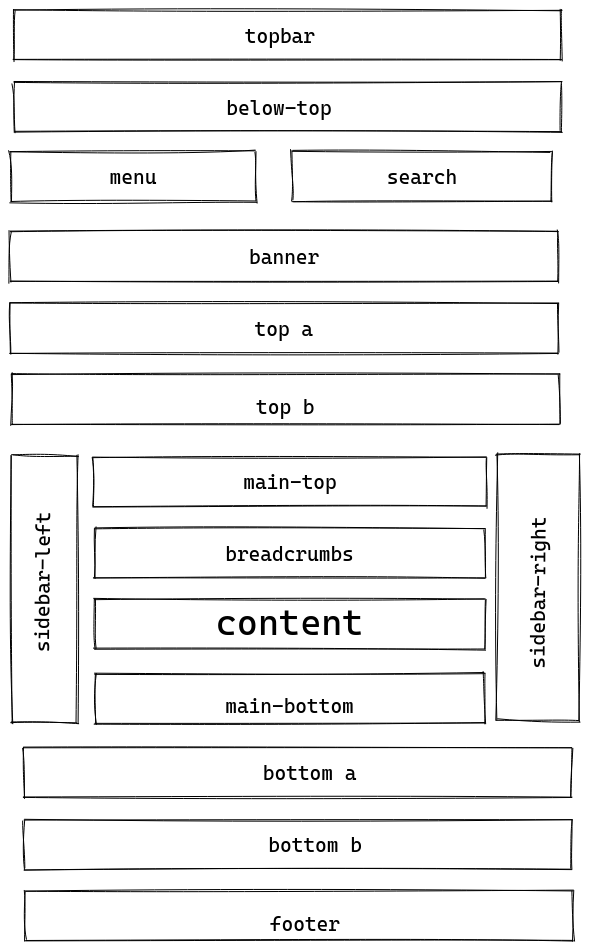
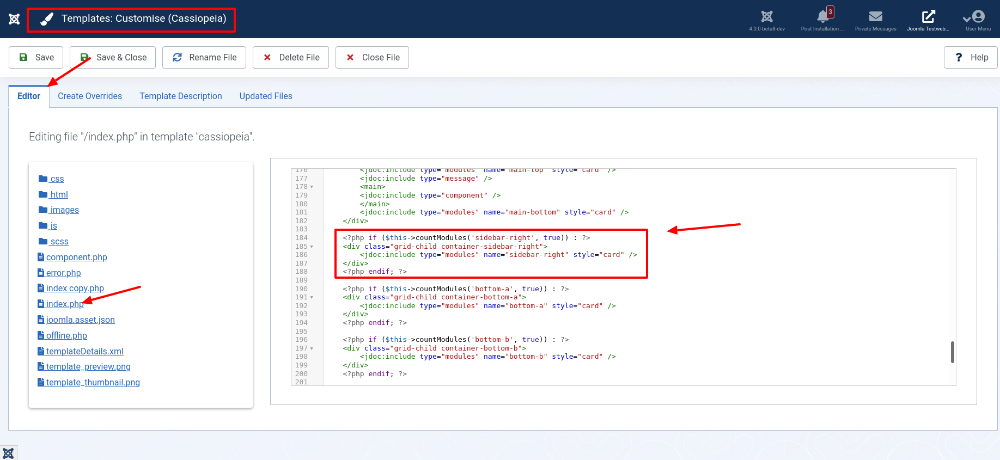
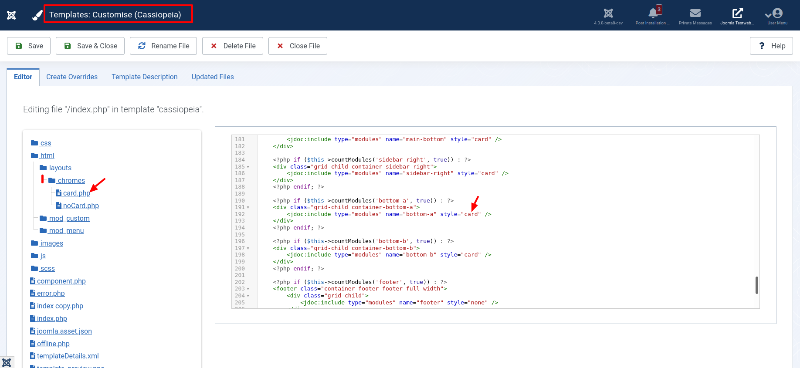

Schon beim ersten Blick auf eine frische Joomla 4 Installation wird eine der wesentlichen Neuerungen sichtbar: Das neue Frontend-Template namens Cassiopeia. Aber auch im Hintergrund hat sich einiges geändert: Die Modulpositionen des Templates wurden umbenannt, so dass sich Module nun leichter und intuitiver den entsprechenden Positionen zuordnen lassen: Ein Mensch kann mit `sidebar-right` mehr anfangen als mit `position-7`.

> Eine Modulposition ist ein Platzhalter in einem [Template](https://docs.joomla.org/Special:MyLanguage/Template). Platzhalter bestimmen eine oder mehrere Positionen innerhalb der Vorlage und teilen der Joomla-Anwendung mit, wo Module, die einer bestimmten Position zugeordnet sind, angezeigt werden sollen.

Zwei Positionen wurden kurz vor Veröffentlichung von Joomla 4 hinzugefügt. "topbar" bietet eine Möglichkeit, ganz oben auf der Seite ein Modul anzuzeigen. "below-top" erscheint, wie der Name schon sagt, darunter. Warum wurde "below-top" integriert? Nicht alle Nutzer möchten ein Logo in der Kopfzeile ihrer Internetseite anzeigen lassen. Cassipoeia bietet per Parameter die Möglichkeit, die Anzeige eines Logos oder einer Beschreibung auszuschalten. Dazu gibt es eine neue Position "below-top", in der der Benutzer ein eigenes Modul anstelle des Logo hinzufügen kann. Die Verwendung von beidem - Position "below-top" und Logo - ist möglich.

Die nachfolgende Grafik zeigt die Modulpositionen in Cassiopeia als Übersicht - Es fehlen noch die Positionen "topbar" und "below-top":



Das Standard-Template von Joomla 4 - Cassiopeia - hat eine feste Anzahl von Standard-Modul-Positionen. Diese Positionen werden in der Dropdown-Liste Position angezeigt, wenn du einzelne Module erstellst oder bearbeitest. Die Module bearbeitest du im Modul-Manager `JOOMLA4/administrator/index.php?option=com_modules&view=modules`. Die Stelle, an der eine Position innerhalb des HTML-Dokumentes der Website dargestellt wird, wird in der Datei `index.php` eines Joomla-Tempates festgelegt. In Cassiopeia sieht das für die Position `sidebar-right` so aus:



Wenn du an dieser Position neue CSS-Stile für Module erstellen möchtest, dann musst du den HTML-Container für diese Position und nicht den Positionsnamen selbst bearbeiten. Der Positionsname erscheint im HTML-Code für die Webseite gar nicht. Wenn du zum Beispiel etwas mit CSS stylen möchtest, das an Position `sidebar-right` platziert wurde, solltest du die Klasse `.container-sidebar-right` mit CSS stylen.

## Wie werden Positionen in Joomla 4 ins Template integriert?


Damit eine Position in der Dropdown-Liste der Optionen für Position für die einzelnen Module angezeigt wird, muss der Positionsname in der Datei `templateDetails.xml` des Templates angegeben werden. Diese Datei befindet sich im Stammverzeichnis des Cassiopeia-Templates. Also genau unter der Adresse `JOOMLA4/templates/cassiopeia/templateDetails.xml`.

```
...
	<positions>
		<position>menu</position>
		<position>search</position>
		<position>banner</position>
		<position>top-a</position>
		<position>top-b</position>
		<position>main-top</position>
		<position>main-bottom</position>
		<position>breadcrumbs</position>
		<position>sidebar-left</position>
		<position>sidebar-right</position>
		<position>bottom-a</position>
		<position>bottom-b</position>
		<position>footer</position>
		<position>debug</position>
	</positions>
...
```


Damit eine Position auf der Webseite angezeigt wird, muss diese Position in den HTML-Code eingefügt werden. Mit anderen Worten: Der Code muss in den Text eigefügt werden, der die Seite aufbaut -- also in das HTML-Dokument. Dies geschieht in der Datei `index.php`, die sich ebenfalls im Stammverzeichnis des Cassiopeia-Templates befindet. Es muss eine Zeile in der `index.php` vorhanden sein, die die Joomla-API zum Aufrufen dieser Position verwendet.

In der Datei `index.php` kann diese Position von einem HTML-Element wie zum Beispiel `header , div, footer`umgeben sein.

Warum sind manche Positionen in andere HTML-Elemente eingebettet?

Ganz einfach. Ein HTML-Dokument ist nicht nur für Menschen geschrieben. Auch Maschinen lesen diese Dokumente. Zum Beispiel Screenreader, oder auch Suchmaschinen. Wenn ein HTML-Dokument auch semantisch richtig formatiert ist, finden sich diese Maschinen schneller und besser auf deiner Seite zurecht. Sie erkennen sofort, ob ein Text eine Navigation ist oder der Hauptinhalt deiner Seite. Somit ordnen sie die Inhalte richtig zu. Aber auch für menschliche Besucher bieten die zusätzlichen HTML-Elemente einen Vorteil. Die Seite kann so leichter mit CSS gestaltet werden.

Innerhalb der Datei `index.php` kann die Position mit einer bedingten Anweisung umgeben sein, zum Beispiel mit einer `IF/ENDIF-Anweisung`. Diese bedingte Anweisung prüft, ob Module an dieser Position platziert sind. Wenn ein Module an der Position platziert ist, wird der entsprechende HTML-Code ins HTML-Dokument eingefügt. Wenn nicht, wird der HTML-Code nicht zur Seite hinzugefügt.

Das Attribut `style`, also den Textteil `style="default"` des obigen Beispiels, verwendest du, wenn du Option nutzen möchtest.Zum Beispiel: Wenn die Seitenleiste keinen Hintergrund haben soll, dann ist `style="default"` die richtige Wahl. Möchtest du einen grauen Hintergrund, verwendest du am besten `style="cardGrey"`. Wenn du einen anderen Hintergrund anzeigen möchtest, dann musst du selbst den Code dazu schreiben. Die Datei die du schreiben musst, ist eine Layout-Datei. Diese Dateien werden in Joomla auch `Chrome` genannt. Du findest diese im Verzeichnis `JOOMLA4/templates/cassiopeia/html/layouts/chromes` .



## Positionen anderer Templates

In der Dropdown-Liste der Positionsnamen für Module werden alle verfügbaren Positionen für alle Frontend-Templates angezeigt, die auf deiner Joomla 4-Website installiert sind.

Dies kann verwirrend sein und du fragst dich vielleicht, warum Positionen von Templates angezeigt werden, die nicht aktiv sind.

In der Liste werden alle Modulpositionen angezeigt, weil einige Webmaster auf ihrer Joomla-Site unterschiedliche Templates für verschiedene Unterseiten verwenden.

Stelle sicher, dass du nur Positionsnamen aus der Liste auswählst, die du für deine Joomla-Site verwendest. Wenn du eine der Positionen aus einem anderen Template auswählst und Cassiopeia diesen Positionsnamen nicht unterstützt, wird das Modul im Frontend deiner Site nicht angezeigt - zumindest dann, wenn das Template Cassiopeia für die Anzeige deiner Inhalte unter dem entsprechenden Menüpunkt ausgewählt ist.

Hast du oft Problemen mit nicht aktiven Modulpositionen? Dann empfehle ich dir die nicht verwendeten Templates im Erweiterungs-Manager zu deaktivieren.

## Joomla Module Positionen im Frontend anzeigen

Wir können alle in einem Template festgelegten Module anzeigen, indem wir `"tp=1"` im Frontend an die URL anhängen. Zum Beispiel so: `http://www.example.com/index.php?tp=1`.


Siehst du die Positionen nicht? Überprüfe die Konfiguraiton: Die Option ist in der globalen Konfiguration deaktivierbar.


