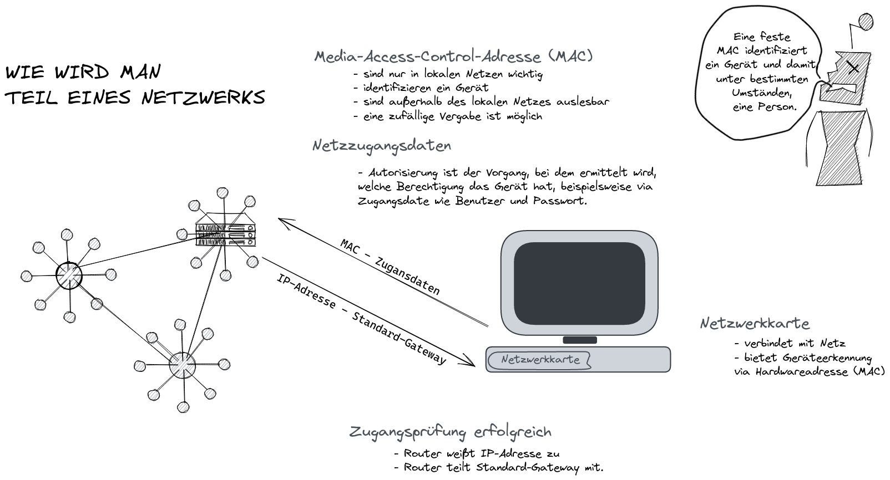

Wie wird ein Gerät Teil eines Netzwerkes wie dem Internet? 

Um Teil eines Netzes zu werden, braucht man 
- eine Hardware-Adresse und 
- eine Zugangsberechtigung.
Dann erhält man eine 
- Internetadresse oder IP-Adresse und 
- ein Standard Gateway
und kann das Netzwerk betreten.

## Netzwerkkarte mit Adresse

Zur Hardware eines Netzgerätes gehören alle physischen Teile, also alles, was hart ist und mit den Händen berührt werden kann. Das sind beispielsweise die Stromquelle, die Festplatte zum Speichern von Daten, die Grafikkarte und der Bildschirm für die Anzeige. 

Für die Interaktion mit dem Internet ist die Netzwerkkarte relevant.

Ein Knoten im Internet braucht eine Internetadresse. Die Netzwerkkarte eines Computers hat eine `Media Access Control (MAC)-Adresse`[^en.wikipedia.org/wiki/MAC-address]. Eine MAC ist eine Zeichenfolge, mit der ein Computer in einem Netzwerk vom lokalen Router identifiziert wird. Dadurch ist er adressierbar. Die Adresse ist in der Regel hexadezimal und sieht wie folgt aus: `00-80-41-ae-fd-7e`. Die MAC-Adresse wird innerhalb des lokalen Netzes benötigt. Außerhalb des lokalen Netzes ist die `IP-Adresse` relevant. 

> Im Mobilfunknetz tritt die `IMAEI` an die Stelle der MAC[^de.wikipedia.org/wiki/International_Mobile_Equipment_Identity]. Die `internationale Mobile Station Equipment Identity (IMEI)` ist eine eindeutige 15-stellige Seriennummer, die zur Identifizierung jedes GSM- oder UMTS-Endgeräts verwendet wird.

Eine fest eingestellte MAC identifiziert ein Gerät und damit unter Umständen auch eine Person. Obwohl nicht notwendig, ist es möglich, MAC-Adressen außerhalb des lokalen Netzes auszulesen und Informationen wie den Standort des Geräts zu erhalten. Aus diesem Grund gibt es seit einigen Jahren Hardware, deren MAC-Adresse per Software verändert werden kann oder dynamisch vergeben wird. 

## Zugangsberechtigung zum Netz

Die Verbindung zum Internet erfolgt in der Regel per Ethernet-Kabel oder WLAN über einen Router, der sich in der eigenen Wohnung befindet. Alternativ ist eine Verbindung über das Mobilfunknetz oder ein Satellitennetz denkbar. In jedem Fall ist neben der MAC-Adresse eine Internetadresse notwendig. Diese wird über DHCP [^en.wikipedia.org/wiki/Dynamic_Host_Configuration_Protocol] zugewiesen, nachdem man sich als autorisiert ausgewiesen hat - meist anhand von Zugangsdaten wie Benutzer und Passwort. 

Konkret geschieht nach erfolgreicher Zugangsprüfung folgendes:
- Der Router weist dem Netzwerkgerät eine Netzwerkadresse zu.
- Der Router teilt dem Netzgerät das Standard-Gateway mit, über das das Gerät mit anderen Netzen - meist dem Internet - kommunizieren kann.
