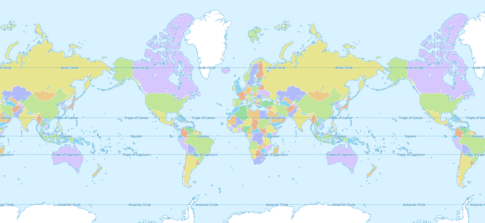
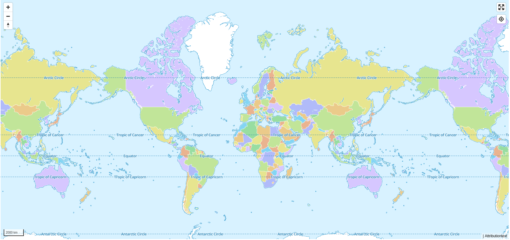
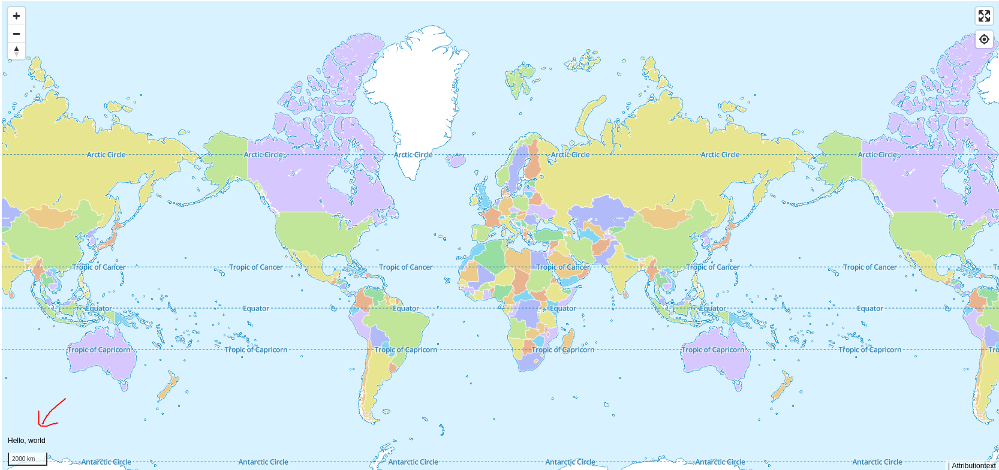
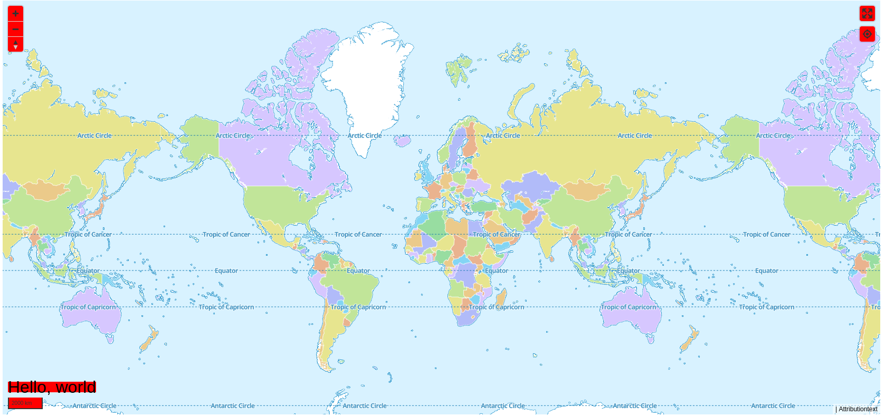

Erstelle dein erstes MapLibre GL-Plugin - Ein Tutorial für Anfänger.

In diesem Beitrag erkläre ich, wie du ein Plugin für MapLibre erstellst. Ich zeige, wie ein Control-Plugin, somit ein Steuerelement für deine [Maplibre](https://maplibre.org/) Karte programmiert wird.

In diesem Text konzentriere ich mich darauf, die Struktur und den Lebenszyklus von Maplibre-Plugins zu erklären. Meine Codebeispiel habe ich auf [Github](https://github.com/astridx/maplibre-plugin-boilerplate) veröffentlicht.

Ich baue auf einem einfachen Quickstart auf:

```html
<!DOCTYPE html>
<html>
  <head>
    <meta charset="utf-8" />
    <title>Quickstart/Schnellstart MapLibre GL Beispiel</title>
    <meta
      name="viewport"
      content="initial-scale=1,maximum-scale=1,user-scalable=no"
    />
    <script src="https://unpkg.com/maplibre-gl@1.15.2/dist/maplibre-gl.js"></script>
    <link
      href="https://unpkg.com/maplibre-gl@1.15.2/dist/maplibre-gl.css"
      rel="stylesheet"
    />
  </head>

  <body>
    <div id="map" style="width: 100vw; height: 100vh"></div>

    <script>
      var map = new maplibregl.Map({
        container: 'map',
        style: 'https://demotiles.maplibre.org/style.json',
        center: [7.2, 50.3], // Startposition [lng, lat]
        zoom: 1, // Zoom
      })
    </script>
  </body>
</html>
```



## Was ist ein Steuerelement?

Maplibre GL JS beinhalte von Hause aus vier Standardsteuerelementen:

- [Navigation](https://maplibre.org/maplibre-gl-js-docs/api/markers/#navigationcontrol)[^maplibre.org/maplibre-gl-js-docs/api/markers/#navigationcontrol]: Schaltflächen zum Zoomen und Drehen der Karte
- [Geolocation](https://maplibre.org/maplibre-gl-js-docs/api/markers/#geolocatecontrol)[^https://maplibre.org/maplibre-gl-js-docs/api/markers/#geolocatecontrol]: eine Schaltfläche, um die Position des Benutzers zu ermitteln
- [Maßstab](https://maplibre.org/maplibre-gl-js-docs/api/markers/#scalecontrol)[^https://maplibre.org/maplibre-gl-js-docs/api/markers/#scalecontrol]: eine Anzeige für den Pixel-zu-Meter-Maßstab
- [Attribution](https://maplibre.org/maplibre-gl-js-docs/api/markers/#attributioncontrol)[^https://maplibre.org/maplibre-gl-js-docs/api/markers/#attributioncontrol]: eine Anzeige für Copyright- und Vertragsinformationen
- [Fullscreen](https://maplibre.org/maplibre-gl-js-docs/api/markers/#fullscreencontrol)[^https://maplibre.org/maplibre-gl-js-docs/api/markers/#fullscreencontrol]: Schaltfläche zum Öffnen der Fullscreenansicht

Dies sind gute Beispiele dafür, was Steuerelemente tun: Sie manipulieren die Karte oder fügen Informationen hinzu.

```
<!DOCTYPE html>
<html>
  <head>
    <meta charset="utf-8" />
    <title>Quickstart/Schnellstart MapLibre GL Beispiel</title>
    <meta
      name="viewport"
      content="initial-scale=1,maximum-scale=1,user-scalable=no"
    />
    <script src="https://unpkg.com/maplibre-gl@1.15.2/dist/maplibre-gl.js"></script>
    <link
      href="https://unpkg.com/maplibre-gl@1.15.2/dist/maplibre-gl.css"
      rel="stylesheet"
    />
  </head>

  <body>
    <div id="map" style="width: 90vw; height: 90vh"></div>

    <script>
      var map = new maplibregl.Map({
        container: "map",
        style: "https://demotiles.maplibre.org/style.json",
        center: [7.2, 50.3], // Startposition [lng, lat]
        zoom: 1, // Zoom
      });

      map.addControl(new maplibregl.FullscreenControl());

      map.addControl(
        new maplibregl.AttributionControl({
          customAttribution: "Attributiontext",
        })
      );

      map.addControl(
        new maplibregl.GeolocateControl({
          positionOptions: {
            enableHighAccuracy: true,
          },
          trackUserLocation: true,
        })
      );

      var nav = new maplibregl.NavigationControl();
      map.addControl(nav, "top-left");

      var scale = new maplibregl.ScaleControl({
        maxWidth: 80,
        unit: "imperial",
      });
      map.addControl(scale);
      scale.setUnit("metric");
    </script>
  </body>
</html>
```



- Jedes Steuerlement verfügt über ein HTML-Element, das in der Karte landet, wie eine Schaltfläche oder ein `div`-Element
- Jedes Steuerlement hat Zugriff auf das Maplibre-Map-Objekt, um Informationen zu lesen und zu manipulieren.

## Die Steuerungs-API

Die Steuerungs-API ist als Schnittstelle dokumentiert: [die IControl-Schnittstelle](https://maplibre.org/maplibre-gl-js-docs/api/markers/#icontrol). Das bedeutet, dass ein Steuerelement ein beliebiges Objekt sein kann, solange es zwei Methoden implementiert:

- `onAdd(map): element`: wird aufgerufen, wenn ein Steuerelement zur Map hinzugefügt wird, mit der Map als erstem Argument. Diese Methode sollte ein Element zurückgeben. Das Steuerelement kann einen Verweis auf die Map speichern oder das Map-Objekt verwenden, um Ereignis-Listener zu binden.
- `onRemove()`: wird aufgerufen, wenn ein Steuerelement aus der Map entfernt wird, mit der Map als erstem Argument. Dies gibt dem Steuerelement die Möglichkeit, die Bindung von Ereignis-Listenern aufzuheben, falls es in `onAdd` welche gebunden hat.
- `getDefaultPosition()`: ist optional und ermöglicht das Festlegen einer Standardposition. Möglich sind `bottom-left`, `bottom-right`, `top-left` und `top-right`.

Diese Schnittstelle wurde ursprünglich von [MapBox](https://blog.mapbox.com/build-mapbox-gl-js-plugins-74c52f22db63) so entworfen, dass Anwender Plugins auf jede beliebige Weise implementieren können.

## So erstellst du ein Maplibre-Plugin

Im nächsten Beispiel zeige ich, wie ein Control-Plugin mit dem Namen `Foo` erstellt wird. Hier zunächst der JavaScript Code als ES6 Klasse.

```js
class Foo {
  onAdd(map) {
    this._map = map;
    this._container = document.createElement("div");
    this._container.className = "maplibregl-ctrl";
    this._container.textContent = "Hello, world";
    return this._container;
  }

  onRemove() {
    this._container.parentNode.removeChild(this._container);
    this._map = undefined;
  }

  getDefaultPosition() {
    return "bottom-left";
  }
}
}
```

Erstelle jetzt dein Plugin in einer Zeile und fügen es zur Karte hinzu. Im Beispiel würde das wie folgt aussehen:

```js
map.addControl(new Foo())
```

Der HTML Code des vollständige Beispiels sieht am Ende wie folgt aus:

```js
<!DOCTYPE html>
<html>
  <head>
    <meta charset="utf-8" />
    <title>Quickstart/Schnellstart MapLibre GL Beispiel</title>
    <meta
      name="viewport"
      content="initial-scale=1,maximum-scale=1,user-scalable=no"
    />
    <script src="https://unpkg.com/maplibre-gl@1.15.2/dist/maplibre-gl.js"></script>
    <script src="foo.js"></script>
    <link
      href="https://unpkg.com/maplibre-gl@1.15.2/dist/maplibre-gl.css"
      rel="stylesheet"
    />
  </head>

  <body>
    <div id="map" style="width: 90vw; height: 90vh"></div>

    <script>
      var map = new maplibregl.Map({
        container: "map",
        style: "https://demotiles.maplibre.org/style.json",
        center: [7.2, 50.3], // Startposition [lng, lat]
        zoom: 1, // Zoom
      });

      map.addControl(new maplibregl.FullscreenControl());

      map.addControl(
        new maplibregl.AttributionControl({
          customAttribution: "Attributiontext",
        })
      );

      map.addControl(
        new maplibregl.GeolocateControl({
          positionOptions: {
            enableHighAccuracy: true,
          },
          trackUserLocation: true,
        })
      );

      var nav = new maplibregl.NavigationControl();
      map.addControl(nav, "top-left");

      var scale = new maplibregl.ScaleControl({
        maxWidth: 80,
        unit: "imperial",
      });
      map.addControl(scale);
      scale.setUnit("metric");

      map.addControl(new Foo());
    </script>
  </body>
</html>
```

### Der Lebenszyklus des MapLibre Controll-Plugins

MapLibre ruft die folgende Methode eines Steuerelement-Plugins auf, wenn das Element zu einer Karte hinzugefügt wird.

- onAdd ()

Ein MapLibre-Plugins ist ein DOM-Element Element - in der Regel ein HTML-Element -, das auf der Karte angezeigt wird. Genauer ausgedrückt: Das Element wird auf einer Schicht oberhalb der eigentlichen Kartenschicht angezeigt. Wichtig: Die onAdd-Methode muss das DOM-Element zurückgeben.

In der folgenden `onAdd`-Methode erstellen wir ein div-Element. Diesem `div`-Element fügen wir danach die Klasse `maplibregl-ctrl` hinzu. Dies ist wichtig, damit es wie die Standard Steuerelmente behandelt wird. Zusätzlich verwenden wir die Klasse `maplibregl-ctrl-foo`. So formatieren wir das Steuerelement später mit CSS problemlos ganz individuell.

```js
…
  onAdd(map) {
    this._map = map;
    this._container = document.createElement("div");
    this._container.className = "maplibregl-ctrl maplibregl-ctrl-foo";
    this._container.textContent = "Hello, world";
    // Hier können noch weitere Elemente hinzugefügt werden.
    // Außerdem können Sie hier einem Element Events hinzufügen.
    return this._container;
  }
…
```

Wenn alles fertig ist, geben Sie das DOM-Element mit return controlElement zurück.

MapLibre erwartet eine weitere Methode. Diese heißt `onRemove`. `onRemove` wird - wie der Name schon sagt - aufgerufen, wenn das Steuerelement von der [Karte entfernt](https://maplibre.org/maplibre-gl-js-docs/api/map/#map#removecontrol)[^https://maplibre.org/maplibre-gl-js-docs/api/map/#map#removecontrol] wird.

```js
map.removeControl(Steuerelement)
```

Die `onRemove`-Methode ist der Ort, an dem aufgeräumt wird. Entferne hier die DOM-Elemente und Ereignis-Listener.

```js
…
  onRemove() {
    this._container.parentNode.removeChild(this._container);
    this._map = undefined;
    // Hier können weitere Elemente entfernt werden.
    // Außerdem sollten eventuelle Events entfernt werden.
  }
…
```



### Styling

Gestalte MapLibre Steuerelemente wie jedes andere DOM-Element mit CSS. Hier füge ich der CSS-Klasse leaflet-control-example Stilregeln hinzu. Naja, bisher stehen hier wenige Stile. Sie haben sicher etwas mehr Fantasie. Zur Erinnerung: Das `div`-Element mit den Klassen `maplibregl-ctrl` und `maplibregl-ctrl-foo` haben wir in der onAdd-Methode hinzugefügt.

```css
.maplibregl-ctrl {
  background-color: red;
}

.maplibregl-ctrl-foo {
  font-size: xx-large;
}
```

Das nachfolgende Bild zeigt, dass die Klasse `maplibregl-ctrl` auf alle Steuerelemente angewandt wird. Alle haben nun einen roten Hintergrund. Die Klasse `maplibregl-ctrl-foo` wirkt sich lediglich auf unser neu hinzugefügtes Foo-Element aus. Nur der Test ist jetzt extra groß.



### Fertig

Dieses Steuerelement fügt der Karte nur einen kleinen "Hallo, Welt"-Text hinzu. Verwende es als [Ausgangspunkt](https://github.com/astridx/maplibre-plugin-boilerplate)[^https://github.com/astridx/maplibre-plugin-boilerplate] für deine eigene MapLibre Erweiterung.

### Lese weiter

Auf der [MapLibre Website](https://maplibre.org/maplibre-gl-js-docs/plugins/) werden verschiedene Plugins aufgelistet, die von der Leaflet-Community erstellt wurden. Die meisten Plugins sind [Open Source](https://de.wikipedia.org/wiki/Open_Source) und sind auf [GitHub](https://github.com/) verfügbar. Wer gerne mit Beispielen lernt, findet hier eine Fülle von Möglichkeiten, um das Erstellen eigenes Plugins zu lernen.
