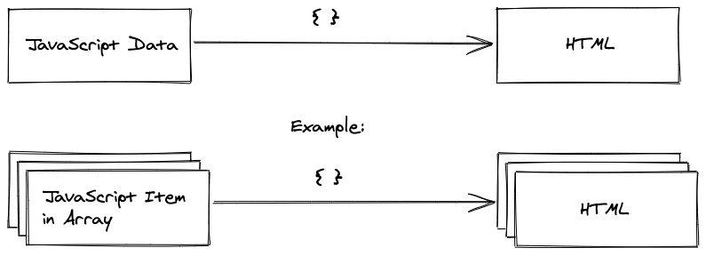

## Listen in React

Bisher haben wir ausschließlich [primitive Variablen](https://developer.mozilla.org/de/docs/Web/JavaScript/Guide/Grammatik_und_Typen#Datentypen) in JSX gerendert. Als Nächstes rendern wir eine Liste, die aus mehreren Elementen besteht. Wir werden zuerst mit Beispieldaten experimentieren. Später rufen wir Daten von einer Remote-API ab. Definieren wir zunächst die Liste als [JavaScript-Array](https://developer.mozilla.org/de/docs/Web/JavaScript/Reference/Global_Objects/Array). Ich hatte es bereits erwähnt: Es ist möglich, eine Variable außerhalb oder innerhalb einer Komponente zu definieren. Das folgende Beispiel zeigt dir erneut die externe Definition:

```js
import React from 'react';

# start-insert
const list = [
  {
    title: 'React',
    url: 'https://reactjs.org/',
    author: 'Jordan Walke',
    num_comments: 3,
    points: 4,
    objectID: 0,
  },
  {
    title: 'Redux',
    url: 'https://redux.js.org/',
    author: 'Dan Abramov, Andrew Clark',
    num_comments: 2,
    points: 5,
    objectID: 1,
  },
];
# end-insert

function App() { ... }

export default App;
```

Im Beispiel verwendete ich drei Punkte `(...)` als Platzhalter, um das Code-Schnipsel übersichtlich zu halten, und um mich auf den wesentlichen Teil zu konzentrieren: die neu eingeführte `list`-Variable. Ich werde die drei Punkte im ganzen Buch als Platzhalter für Codeblöcke verwenden, die ich in früheren Übungen erstellt habe. Wenn dir an einer Stelle nicht klar ist, was anstelle der Punkte steht, überprüfe deinen Code bitte mithilfe des CodeSandbox-Links, den ich am Ende eines jeden Kapitels angebe.

Jedes Element der "list"-Variable beinhaltet einen Titel, eine URL, einen Autor, eine Anzahl von Kommentaren, Punkte (welche die Beliebtheit anzeigen) und eine Kennung (`objectID`). Als Nächstes rendern wir die Liste mit JSX. Als Erstes legen wir das Drumherum der Liste an:

```js
function App() {
  return (
    <div>
# start-insert
      <h1>My Hacker Stories</h1>
# end-insert

      <label htmlFor="search">Search: </label>
      <input id="search" type="text" />

# start-insert
      <hr />
# end-insert

# start-insert
      {/* Rendere die Liste hier. */}
# end-insert
    </div>
  );
}
```

Verwende [die JavaScript-Zuordnungsmethode `map()`](https://developer.mozilla.org/de/docs/Web/JavaScript/Reference/Global_Objects/Array/map), um über jedes Element des Arrays zu iterieren und dabei die Liste für die Anzeige anzulegen. Nachfolgend zeige ich dir die Funktion `map()` zunächst unabhängig von unserer Beispielanwendung:

```
const numbers = [1, 4, 9, 16];

const newNumbers = numbers.map(function(number) {
  return number * 2;
});

console.log(newNumbers);
// [2, 8, 18, 32]
```

Im vorherigen Beispiel haben wir eine JavaScript-Variable auf eine andere abgebildet. In unserer Beispielanwendung bilden wir diese nicht nur ab, wir zeigen Sie im Frontend an. Dazu nutzen wir ein JSX-Fragment. So rendern wir jedes Element der Liste auf eine unkomplizierte Art und Weise:

```js
function App() {
  return (
    <div>
      ...

      <hr />

# start-insert
      {list.map(function(item) {
        return <div>{item.title}</div>;
      })}
# end-insert
    </div>
  );
}
```

Einer meiner ersten "Aha"-Momente mit React war dieser: Ich habe einer Liste von JavaScript-Objekten --- ohne zusätzliche HTML-Template-Syntax --- HTML-Elementen zugeordnet. Erforderlich war ausschließlich JavaScript in HTML.



React zeigt jetzt jedes Element an. Verbessere die Ausgabe weiter, so dass React dynamische Listen effizienter handhabt. Durch Zuweisen eines Schlüsselattributs zu jedem Listenelement identifiziert React einzelne Elemente. Dies ist sinnvoll, wenn sich die Liste verändert --- zum Beispiel bei einer Änderung der Reihenfolge. Glücklicherweise verfügen unsere Listenelemente über eine ID:

```js
function App() {
  return (
    <div>
      ...

      <hr />

      {list.map(function(item) {
# start-insert
        return (
          <div key={item.objectID}>
# end-insert
            {item.title}
# start-insert
          </div>
        );
# end-insert
      })}
    </div>
  );
}
```

Vermeide es, den Index vom Element losgelöst zu verwenden. So stellst du sicher, dass die ID eine stabile Kennung ist. React identifiziert die Elemente andernfalls unter Umständen nicht korrekt:

```
// Bitte nicht so.
{list.map(function(item, index) {
  return (
    <div key={index}>
      ...
    </div>
  );
})}
```

Bisher wird für jeden Artikel der Titel angezeigt. Experimentiere mit der Anzeige weiterer Eigenschaften des Elements:

```js
function App() {
  return (
    <div>
      ...

      <hr />

# start-insert
      {list.map(function(item) {
        return (
          <div key={item.objectID}>
            <span>
              <a href={item.url}>{item.title}</a>
            </span>
            <span>{item.author}</span>
            <span>{item.num_comments}</span>
            <span>{item.points}</span>
          </div>
        );
      })}
# end-insert
    </div>
  );
}
```

`map` macht den Code innerhalb von JSX knapp und prägnant. Im Bereich dieser Funktion haben wir Zugriff auf jedes Element und seine Eigenschaften. Die `url` wird Attribut `href` für das Ankertag verwendet. JavaScript in JSX wird nicht nur zum Anzeigen von Elementen genutzt. Wir verwenden es ebenfalls zum dynamischen Zuweisen von HTML-Attributen.

### Übungen:

* Begutachte den [Quellcode dieses Abschnitts](https://codesandbox.io/s/github/the-road-to-learn-react/hacker-stories/tree/hs/Lists-in-React).
  * Reflektiere die [Änderungen gegenüber dem letzten Abschnitt](https://github.com/the-road-to-learn-react/hacker-stories/compare/hs/React-JSX...hs/Lists-in-React?expand=1).
* Informiere dich darüber, warum das Schlüsselattribut (ID) in React benötigt wird ([0](https://dev.to/jtonzing/the-significance-of-react-keys---a-visual-explanation--56l7), [1](https://www.robinwieruch.de/react-list-key), [2](https://reactjs.org/docs/lists-and-keys.html)). Es ist nicht tragisch, wenn du die Implementierung zum jetzigen Zeitpunkt nicht vollständig verstehst. Konzentriere dich in diesem Fall auf die Anwendung in dynamischen Listen.
* Wiederhole die [standardmäßig integrierten Array-Methoden](https://developer.mozilla.org/de/docs/Web/JavaScript/Reference/Global_Objects/Array/) - insbesondere *map*, *filter*, und *reduce* --- die in nativem JavaScript verfügbar sind.
* Was passiert, wenn du `null` anstelle von JSX zurückgibst?
* Erweitere die Liste um einige weitere Elemente, um das Beispiel realistischer zu gestalten.
* Verwende zur Übung verschiedene JavaScript-Ausdrücke in JSX.
