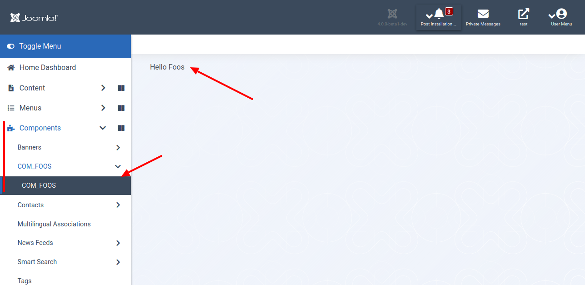
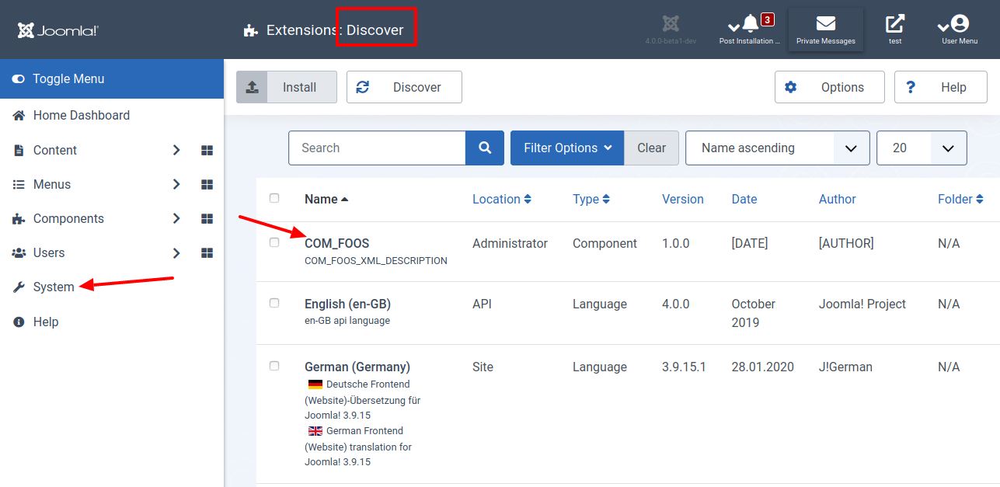
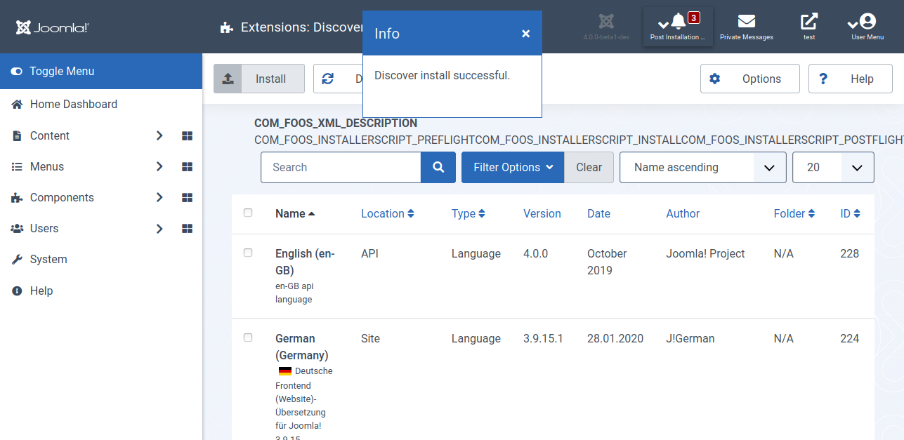

Wir fangen mit den Grundlagen an. Dazu erstellen wir die View im Administrationsbereich rudimentär. Am Ende dieses Textes weißt du, wie du einen Menüpunkt im Menü des Administrationsbereichs einfügst. Über den Menüeintrag öffnest du die Ansicht zu deiner Komponente. Sei nicht enttäuscht: Diese enthält bisher nichts weiter als einen kurzen Text. Du hast eine Grundlage für die weiteren Schritte.



## Für Ungeduldige

Sieh dir den geänderten Programmcode in der [Diff-Ansicht](https://github.com/astridx/boilerplate/compare/t0...t1) an und übernimm diese Änderungen in deine Entwicklungsversion.

Eine ausführlichere Erklärung des geänderten Programmcodes findest du weiter unten.

## Schritt für Schritt

```xml
<?xml version="1.0" encoding="utf-8" ?>
<extension type="component" method="upgrade">
	<name>COM_FOOS</name>
	<creationDate>[DATE]</creationDate>
	<author>[AUTHOR]</author>
	<authorEmail>[AUTHOR_EMAIL]</authorEmail>
	<authorUrl>[AUTHOR_URL]</authorUrl>
	<copyright>[COPYRIGHT]</copyright>
	<license>GNU General Public License version 2 or later;</license>
	<version>1.0.0</version>
	<description>COM_FOOS_XML_DESCRIPTION</description>
	<namespace path="src">FooNamespace\Component\Foos</namespace>
	<scriptfile>script.php</scriptfile>
	<!-- Back-end files -->
	<administration>
		<!-- Menu entries -->
		<menu view="foos">COM_FOOS</menu>
		<submenu>
			<menu link="option=com_foos">COM_FOOS</menu>
		</submenu>
		<files folder="administrator/components/com_foos">
			<filename>foos.xml</filename>
			<folder>services</folder>
			<folder>src</folder>
			<folder>tmpl</folder>
		</files>
	</administration>
	<changelogurl>https://...</changelogurl>
	<updateservers>
		<server type="extension" name="Foo Updates">https://...</server>
	</updateservers>
	<dlid prefix="dlid=" suffix="" />
</extension>
```

```php
<?php
\defined('_JEXEC') or die;
use Joomla\CMS\Installer\InstallerAdapter;
use Joomla\CMS\Language\Text;
use Joomla\CMS\Log\Log;
class Com_FoosInstallerScript
{
	private $minimumJoomlaVersion = '4.0';
	private $minimumPHPVersion = JOOMLA_MINIMUM_PHP;
	public function install($parent): bool
	{
		echo Text::_('COM_FOOS_INSTALLERSCRIPT_INSTALL');
		return true;
	}
	public function uninstall($parent): bool
	{
		echo Text::_('COM_FOOS_INSTALLERSCRIPT_UNINSTALL');
		return true;
	}
	public function update($parent): bool
	{
		echo Text::_('COM_FOOS_INSTALLERSCRIPT_UPDATE');
		return true;
	}
	public function preflight($type, $parent): bool
	{
		if ($type !== 'uninstall')
		{
			if (!empty($this->minimumPHPVersion) && version_compare(PHP_VERSION, $this->minimumPHPVersion, '<'))
			{
				Log::add(
					Text::sprintf('JLIB_INSTALLER_MINIMUM_PHP', $this->minimumPHPVersion),
					Log::WARNING,
					'jerror'
				);

				return false;
			}
			if (!empty($this->minimumJoomlaVersion) && version_compare(JVERSION, $this->minimumJoomlaVersion, '<'))
			{
				Log::add(
					Text::sprintf('JLIB_INSTALLER_MINIMUM_JOOMLA', $this->minimumJoomlaVersion),
					Log::WARNING,
					'jerror'
				);
				return false;
			}
		}
		echo Text::_('COM_FOOS_INSTALLERSCRIPT_PREFLIGHT');
		return true;
	}
	public function postflight($type, $parent)
	{
		echo Text::_('COM_FOOS_INSTALLERSCRIPT_POSTFLIGHT');
		return true;
	}
}
```

```{#c1591434413 .php .numberLines startFrom="1" caption="src/administrator/components/com_foos/services/provider.php"}
<?php
\defined('_JEXEC') or die;
use Joomla\CMS\Dispatcher\ComponentDispatcherFactoryInterface;
use Joomla\CMS\Extension\ComponentInterface;
use Joomla\CMS\Extension\Service\Provider\CategoryFactory;
use Joomla\CMS\Extension\Service\Provider\ComponentDispatcherFactory;
use Joomla\CMS\Extension\Service\Provider\MVCFactory;
use Joomla\CMS\HTML\Registry;
use Joomla\DI\Container;
use Joomla\DI\ServiceProviderInterface;
use FooNamespace\Component\Foos\Administrator\Extension\FoosComponent;
return new class implements ServiceProviderInterface
{
	public function register(Container $container)
	{
		$container->registerServiceProvider(new CategoryFactory('\\Joomla\\Component\\Foos'));
		$container->registerServiceProvider(new MVCFactory('\\Joomla\\Component\\Foos'));
		$container->registerServiceProvider(new ComponentDispatcherFactory('\\Joomla\\Component\\Foos'));
		$container->set(
			ComponentInterface::class,
			function (Container $container)
			{
				$component = new FoosComponent($container->get(ComponentDispatcherFactoryInterface::class));
				$component->setRegistry($container->get(Registry::class));
				return $component;
			}
		);
	}
};
```

\normalsize

\scriptsize

```{#c1591434414 .php .numberLines startFrom="1" caption="src/administrator/components/com_foos/src/Controller/DisplayController.php"}
<?php
namespace FooNamespace\Component\Foos\Administrator\Controller;
\defined('_JEXEC') or die;
use Joomla\CMS\MVC\Controller\BaseController;
class DisplayController extends BaseController
{
	protected $default_view = 'foos';
	public function display($cachable = false, $urlparams = array())
	{
		return parent::display();
	}
}
```

\normalsize

\scriptsize

```{#c1591434415 .php .numberLines startFrom="1" caption="src/administrator/components/com_foos/src/Extension/FoosComponent.php"}
<?php
namespace FooNamespace\Component\Foos\Administrator\Extension;
defined('JPATH_PLATFORM') or die;
use Joomla\CMS\Categories\CategoryServiceInterface;
use Joomla\CMS\Categories\CategoryServiceTrait;
use Joomla\CMS\Extension\BootableExtensionInterface;
use Joomla\CMS\Extension\MVCComponent;
use Joomla\CMS\HTML\HTMLRegistryAwareTrait;
use FooNamespace\Component\Foos\Administrator\Service\HTML\AdministratorService;
use Psr\Container\ContainerInterface;
class FoosComponent extends MVCComponent implements BootableExtensionInterface, CategoryServiceInterface
{
	use CategoryServiceTrait;
	use HTMLRegistryAwareTrait;
	public function boot(ContainerInterface $container)
	{
		$this->getRegistry()->register('foosadministrator', new AdministratorService);
	}
}
```

\normalsize

\scriptsize

```{#c1591434416 .php .numberLines startFrom="1" caption="src/administrator/components/com_foos/src/Service/HTML/AdministratorService.php"}
<?php
namespace FooNamespace\Component\Foos\Administrator\Service\HTML;
defined('JPATH_BASE') or die;
class AdministratorService
{
}
```

\normalsize

\scriptsize

```{#c1591434417 .php .numberLines startFrom="1" caption="src/administrator/components/com_foos/src/View/Foos/HtmlView.php"}
<?php
namespace FooNamespace\Component\Foos\Administrator\View\Foos;
\defined('_JEXEC') or die;
use Joomla\CMS\MVC\View\HtmlView as BaseHtmlView;
class HtmlView extends BaseHtmlView
{
	public function display($tpl = null): void
	{
		parent::display($tpl);
	}
}
```

\normalsize

\scriptsize

```{#c1591434418 .php .numberLines startFrom="1" caption="src/administrator/components/com_foos/tmpl/foos/default.php"}
<?php
\defined('_JEXEC') or die;
?>
Hello Foos
```

\normalsize

\scriptsize

```{#c1591434419 .html .numberLines startFrom="1" caption="src/components/com_foos/index.html"}
<!DOCTYPE html><title></title>
```

\normalsize

## Teste deine Joomla-Komponente

1. Installiere deine Komponente in Joomla! Version 4, um sie zu testen. Am Anfang ist das Einfachste, die Dateien manuell an Ort und Stelle zu kopieren:

Kopiere die Dateien im `administrator` Ordner in den `administrator` Ordner deiner Joomla! 4 Installation.  
Kopiere die Dateien im `components` Ordner in den `components` Ordner deiner Joomla! 4 Installation.

2. Öffne das Menü `System | Install | Discover`. Hier siehst du einen Eintrag zu deiner eben kopierten Komponente. Wähle diese aus und klicke auf die Schaltfläche `Install`.



3. Wenn alle funktioniert siehst nach der Installation diese Anzeigen vor dir.



4. Teste als Nächstes, ob du die Ansicht für deine Komponente fehlerfrei angezeigt bekommst.


Bis hierhin war das kein Hexenwerk. Dafür haben wir aber eine solide Grundlage für die weiteren Schritte.
