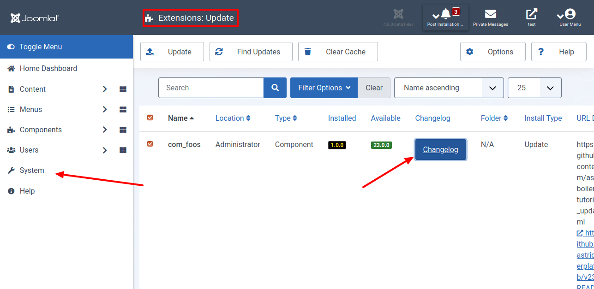
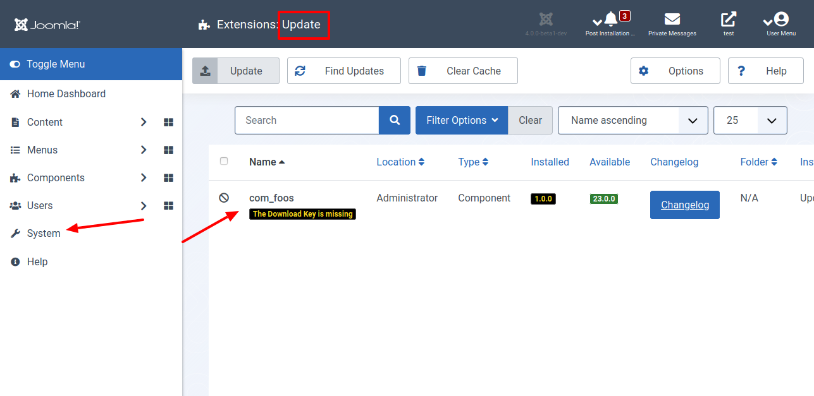
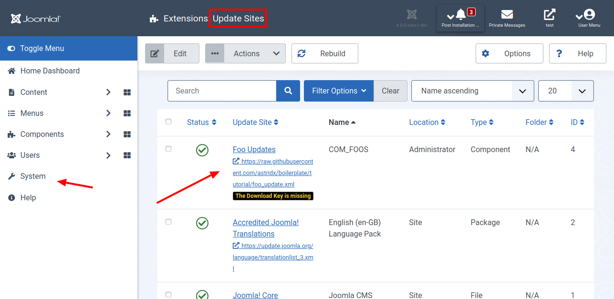

Du wirst deine Ihre Komponente weiterentwickeln. Wie stellst du sicher, dass die User immer die neueste Version verwenden? Woher wissen sie von einem Update? Jetzt, wo das Grundgerüst der Erweiterung fertig ist, ist es wichtig das deine Anwender von Weiterentwicklungen erfahren.

In diesem Kapitel erläutere ich dir, wie du einen Update-Server für deine Komponente erstellst und ausführst.

Update Server klingt etwas kompliziert, im Grunde ist es nur eine URL zu einer XML-Datei, die in der XML-Installationsdatei angegeben ist. Diese XML enthält eine Reihe von Details, einschließlich der neuen Version und der Download-URL. Wenn Joomla! eine Aktualisierung findet, wird dies im Administrationsbereich angezeigt.

## Für Ungeduldige

Sieh dir den geänderten Programmcode in der [Diff-Ansicht](https://github.com/astridx/boilerplate/compare/t1...t1b) an und übernimm diese Änderungen in deine Entwicklungsversion.

Eine ausführlichere Erklärung des geänderten Programmcodes findest du weiter unten.

## Teste deine Joomla-Komponente

1. Installiere deine Komponente in Joomla! Version 4, um sie zu testen:

Kopiere die Dateien im `administrator` Ordner in den `administrator` Ordner deiner Joomla! 4 Installation.  
Kopiere die Dateien im `components` Ordner in den `components` Ordner deiner Joomla! 4 Installation.

Eine neue Installation ist nicht erforderlich. Verwende die aus Teil 1 weiter.

2. Als Nächstes erstellst du eine weitere Version. Ändere dazu die Versionsnummer im Manifest oder bearbeite den nächsten Teil. Vorher ist nicht möglich, den Update Server zu testen. Es gibt bisher keine Aktualisierung. Ich schreibe dir hier aber schon einmal, was genau nach dem Erstellen der nächsten Version passiert.

3. Wenn alles funktioniert siehst du nach der Installation diese Anzeigen vor dir.

4. Öffne System Update Extension. Hier wird dir die Aktualisierung für deine Komponente angeboten. Falls dies nicht der Fall ist, klicke auf die Schaltfläche `Find Updates`.

5. Beim ersten Öffnen siehst du den Hinweis `The Download Key` is missing, weil du das Element `dlid` im Manifest eingetragen hast.

6. Füge einen Download Key über `System | Update Sites` hinzu. Klicke hierzu auf den Namen deiner Komponente. Dann siehst du das Textfeld, in das du einen beliebigen Wert einträgst. Zum jetzigen Zeitpunkt wird dieser beim Abruf des Updates nicht geprüft. Speichere den Wert.

5. Wenn du zurück zu System Update Extension navigierst, ist es dir möglich, eine Aktualisierung anzustoßen und dir das Changelog anzusehen.

## Geänderte Dateien

Die Änderungen, die das Changelog und den Joomla Update Server betreffen, zeige ich nur hier. In jedem weiteren Kapitel ist erforderlich, dass du die Nummern anpasst. Das ist kein Hexenwerk. Wenn ich dies immer wieder neu beschrieb, langweilte dich das nicht nur - es blähte diesen Text unnötig auf.

### Übersicht

      

    

        Files changed (3)
        <a class="d2h-file-switch d2h-hide">hide</a>
        <a class="d2h-file-switch d2h-show">show</a>
    

    <ol class="d2h-file-list">
    <li class="d2h-file-list-line">
    
      <svg aria-hidden="true" class="d2h-icon d2h-added" height="16" title="added" version="1.1" viewBox="0 0 14 16"
           width="14">
          <path d="M13 1H1C0.45 1 0 1.45 0 2v12c0 0.55 0.45 1 1 1h12c0.55 0 1-0.45 1-1V2c0-0.55-0.45-1-1-1z m0 13H1V2h12v12zM6 9H3V7h3V4h2v3h3v2H8v3H6V9z"></path>
      </svg>      <a href="#d2h-868605" class="d2h-file-name">changelog.xml</a>
      
          +36
          -0
      
    
</li>
<li class="d2h-file-list-line">
    
      <svg aria-hidden="true" class="d2h-icon d2h-added" height="16" title="added" version="1.1" viewBox="0 0 14 16"
           width="14">
          <path d="M13 1H1C0.45 1 0 1.45 0 2v12c0 0.55 0.45 1 1 1h12c0.55 0 1-0.45 1-1V2c0-0.55-0.45-1-1-1z m0 13H1V2h12v12zM6 9H3V7h3V4h2v3h3v2H8v3H6V9z"></path>
      </svg>      <a href="#d2h-790965" class="d2h-file-name">foo_update.xml</a>
      
          +18
          -0
      
    
</li>
<li class="d2h-file-list-line">
    
      <svg aria-hidden="true" class="d2h-icon d2h-changed" height="16" title="modified" version="1.1"
           viewBox="0 0 14 16" width="14">
          <path d="M13 1H1C0.45 1 0 1.45 0 2v12c0 0.55 0.45 1 1 1h12c0.55 0 1-0.45 1-1V2c0-0.55-0.45-1-1-1z m0 13H1V2h12v12zM4 8c0-1.66 1.34-3 3-3s3 1.34 3 3-1.34 3-3 3-3-1.34-3-3z"></path>
      </svg>      <a href="#d2h-863218" class="d2h-file-name">src/administrator/components/com_foos/foos.xml</a>
      
          +1
          -1
      
    
</li>
    </ol>

    

    

    
    <svg aria-hidden="true" class="d2h-icon" height="16" version="1.1" viewBox="0 0 12 16" width="12">
        <path d="M6 5H2v-1h4v1zM2 8h7v-1H2v1z m0 2h7v-1H2v1z m0 2h7v-1H2v1z m10-7.5v9.5c0 0.55-0.45 1-1 1H1c-0.55 0-1-0.45-1-1V2c0-0.55 0.45-1 1-1h7.5l3.5 3.5z m-1 0.5L8 2H1v12h10V5z"></path>
    </svg>    changelog.xml
    ADDED
    

    

        

            <table class="d2h-diff-table">
                <tbody class="d2h-diff-tbody">
                <tr>
    <td class="d2h-code-linenumber d2h-info"></td>
    <td class="d2h-info">
        
@@ -0,0 +1,36 @@

    </td>
</tr><tr>
    <td class="d2h-code-linenumber d2h-ins">
      

1

    </td>
    <td class="d2h-ins">
        

            +
            &lt;changelogs&gt;
        

    </td>
</tr><tr>
    <td class="d2h-code-linenumber d2h-ins">
      

2

    </td>
    <td class="d2h-ins">
        

            +
            	&lt;changelog&gt;
        

    </td>
</tr><tr>
    <td class="d2h-code-linenumber d2h-ins">
      

3

    </td>
    <td class="d2h-ins">
        

            +
            		&lt;element&gt;com_foos&lt;&#x2F;element&gt;
        

    </td>
</tr><tr>
    <td class="d2h-code-linenumber d2h-ins">
      

4

    </td>
    <td class="d2h-ins">
        

            +
            		&lt;type&gt;component&lt;&#x2F;type&gt;
        

    </td>
</tr><tr>
    <td class="d2h-code-linenumber d2h-ins">
      

5

    </td>
    <td class="d2h-ins">
        

            +
            		&lt;version&gt;1.0.0&lt;&#x2F;version&gt;
        

    </td>
</tr><tr>
    <td class="d2h-code-linenumber d2h-ins">
      

6

    </td>
    <td class="d2h-ins">
        

            +
            		&lt;note&gt;
        

    </td>
</tr><tr>
    <td class="d2h-code-linenumber d2h-ins">
      

7

    </td>
    <td class="d2h-ins">
        

            +
            			&lt;item&gt;Initial Version&lt;&#x2F;item&gt;
        

    </td>
</tr><tr>
    <td class="d2h-code-linenumber d2h-ins">
      

8

    </td>
    <td class="d2h-ins">
        

            +
            		&lt;&#x2F;note&gt;
        

    </td>
</tr><tr>
    <td class="d2h-code-linenumber d2h-ins">
      

9

    </td>
    <td class="d2h-ins">
        

            +
            	&lt;&#x2F;changelog&gt;
        

    </td>
</tr><tr>
    <td class="d2h-code-linenumber d2h-ins">
      

10

    </td>
    <td class="d2h-ins">
        

            +
            	&lt;changelog&gt;
        

    </td>
</tr><tr>
    <td class="d2h-code-linenumber d2h-ins">
      

11

    </td>
    <td class="d2h-ins">
        

            +
            		&lt;element&gt;com_foos&lt;&#x2F;element&gt;
        

    </td>
</tr><tr>
    <td class="d2h-code-linenumber d2h-ins">
      

12

    </td>
    <td class="d2h-ins">
        

            +
            		&lt;type&gt;component&lt;&#x2F;type&gt;
        

    </td>
</tr><tr>
    <td class="d2h-code-linenumber d2h-ins">
      

13

    </td>
    <td class="d2h-ins">
        

            +
            		&lt;version&gt;1.0.1&lt;&#x2F;version&gt;
        

    </td>
</tr><tr>
    <td class="d2h-code-linenumber d2h-ins">
      

14

    </td>
    <td class="d2h-ins">
        

            +
            		&lt;security&gt;
        

    </td>
</tr><tr>
    <td class="d2h-code-linenumber d2h-ins">
      

15

    </td>
    <td class="d2h-ins">
        

            +
            			&lt;item&gt;&lt;![CDATA[&lt;p&gt;No security issues.&lt;&#x2F;p&gt;]]&gt;&lt;&#x2F;item&gt;
        

    </td>
</tr><tr>
    <td class="d2h-code-linenumber d2h-ins">
      

16

    </td>
    <td class="d2h-ins">
        

            +
            		&lt;&#x2F;security&gt;
        

    </td>
</tr><tr>
    <td class="d2h-code-linenumber d2h-ins">
      

17

    </td>
    <td class="d2h-ins">
        

            +
            		&lt;fix&gt;
        

    </td>
</tr><tr>
    <td class="d2h-code-linenumber d2h-ins">
      

18

    </td>
    <td class="d2h-ins">
        

            +
            			&lt;item&gt;No fix&lt;&#x2F;item&gt;
        

    </td>
</tr><tr>
    <td class="d2h-code-linenumber d2h-ins">
      

19

    </td>
    <td class="d2h-ins">
        

            +
            		&lt;&#x2F;fix&gt;
        

    </td>
</tr><tr>
    <td class="d2h-code-linenumber d2h-ins">
      

20

    </td>
    <td class="d2h-ins">
        

            +
            		&lt;language&gt;
        

    </td>
</tr><tr>
    <td class="d2h-code-linenumber d2h-ins">
      

21

    </td>
    <td class="d2h-ins">
        

            +
            			&lt;item&gt;English&lt;&#x2F;item&gt;
        

    </td>
</tr><tr>
    <td class="d2h-code-linenumber d2h-ins">
      

22

    </td>
    <td class="d2h-ins">
        

            +
            		&lt;&#x2F;language&gt;
        

    </td>
</tr><tr>
    <td class="d2h-code-linenumber d2h-ins">
      

23

    </td>
    <td class="d2h-ins">
        

            +
            		&lt;addition&gt;
        

    </td>
</tr><tr>
    <td class="d2h-code-linenumber d2h-ins">
      

24

    </td>
    <td class="d2h-ins">
        

            +
            			&lt;item&gt;Change log and Update Server added.&lt;&#x2F;item&gt;
        

    </td>
</tr><tr>
    <td class="d2h-code-linenumber d2h-ins">
      

25

    </td>
    <td class="d2h-ins">
        

            +
            		&lt;&#x2F;addition&gt;
        

    </td>
</tr><tr>
    <td class="d2h-code-linenumber d2h-ins">
      

26

    </td>
    <td class="d2h-ins">
        

            +
            		&lt;change&gt;
        

    </td>
</tr><tr>
    <td class="d2h-code-linenumber d2h-ins">
      

27

    </td>
    <td class="d2h-ins">
        

            +
            			&lt;item&gt;No change&lt;&#x2F;item&gt;
        

    </td>
</tr><tr>
    <td class="d2h-code-linenumber d2h-ins">
      

28

    </td>
    <td class="d2h-ins">
        

            +
            		&lt;&#x2F;change&gt;
        

    </td>
</tr><tr>
    <td class="d2h-code-linenumber d2h-ins">
      

29

    </td>
    <td class="d2h-ins">
        

            +
            		&lt;remove&gt;
        

    </td>
</tr><tr>
    <td class="d2h-code-linenumber d2h-ins">
      

30

    </td>
    <td class="d2h-ins">
        

            +
            			&lt;item&gt;No remove&lt;&#x2F;item&gt;
        

    </td>
</tr><tr>
    <td class="d2h-code-linenumber d2h-ins">
      

31

    </td>
    <td class="d2h-ins">
        

            +
            		&lt;&#x2F;remove&gt;
        

    </td>
</tr><tr>
    <td class="d2h-code-linenumber d2h-ins">
      

32

    </td>
    <td class="d2h-ins">
        

            +
            		&lt;note&gt;
        

    </td>
</tr><tr>
    <td class="d2h-code-linenumber d2h-ins">
      

33

    </td>
    <td class="d2h-ins">
        

            +
            			&lt;item&gt;Change log and Update Server added.&lt;&#x2F;item&gt;
        

    </td>
</tr><tr>
    <td class="d2h-code-linenumber d2h-ins">
      

34

    </td>
    <td class="d2h-ins">
        

            +
            		&lt;&#x2F;note&gt;
        

    </td>
</tr><tr>
    <td class="d2h-code-linenumber d2h-ins">
      

35

    </td>
    <td class="d2h-ins">
        

            +
            	&lt;&#x2F;changelog&gt;
        

    </td>
</tr><tr>
    <td class="d2h-code-linenumber d2h-ins">
      

36

    </td>
    <td class="d2h-ins">
        

            +
            &lt;&#x2F;changelogs&gt;
        

    </td>
</tr>
                </tbody>
            </table>
        

    

    

    
    <svg aria-hidden="true" class="d2h-icon" height="16" version="1.1" viewBox="0 0 12 16" width="12">
        <path d="M6 5H2v-1h4v1zM2 8h7v-1H2v1z m0 2h7v-1H2v1z m0 2h7v-1H2v1z m10-7.5v9.5c0 0.55-0.45 1-1 1H1c-0.55 0-1-0.45-1-1V2c0-0.55 0.45-1 1-1h7.5l3.5 3.5z m-1 0.5L8 2H1v12h10V5z"></path>
    </svg>    foo_update.xml
    ADDED
    

    

        

            <table class="d2h-diff-table">
                <tbody class="d2h-diff-tbody">
                <tr>
    <td class="d2h-code-linenumber d2h-info"></td>
    <td class="d2h-info">
        
@@ -0,0 +1,18 @@

    </td>
</tr><tr>
    <td class="d2h-code-linenumber d2h-ins">
      

1

    </td>
    <td class="d2h-ins">
        

            +
            &lt;updates&gt;
        

    </td>
</tr><tr>
    <td class="d2h-code-linenumber d2h-ins">
      

2

    </td>
    <td class="d2h-ins">
        

            +
                &lt;update&gt;
        

    </td>
</tr><tr>
    <td class="d2h-code-linenumber d2h-ins">
      

3

    </td>
    <td class="d2h-ins">
        

            +
                    &lt;name&gt;com_foos&lt;&#x2F;name&gt;
        

    </td>
</tr><tr>
    <td class="d2h-code-linenumber d2h-ins">
      

4

    </td>
    <td class="d2h-ins">
        

            +
                    &lt;description&gt;This is com_foo&lt;&#x2F;description&gt;
        

    </td>
</tr><tr>
    <td class="d2h-code-linenumber d2h-ins">
      

5

    </td>
    <td class="d2h-ins">
        

            +
                    &lt;element&gt;com_foos&lt;&#x2F;element&gt;
        

    </td>
</tr><tr>
    <td class="d2h-code-linenumber d2h-ins">
      

6

    </td>
    <td class="d2h-ins">
        

            +
                    &lt;type&gt;component&lt;&#x2F;type&gt;
        

    </td>
</tr><tr>
    <td class="d2h-code-linenumber d2h-ins">
      

7

    </td>
    <td class="d2h-ins">
        

            +
                    &lt;version&gt;1.0.1&lt;&#x2F;version&gt;
        

    </td>
</tr><tr>
    <td class="d2h-code-linenumber d2h-ins">
      

8

    </td>
    <td class="d2h-ins">
        

            +
            		&lt;changelogurl&gt;https:&#x2F;&#x2F;raw.githubusercontent.com&#x2F;astridx&#x2F;boilerplate&#x2F;tutorial&#x2F;changelog.xml&lt;&#x2F;changelogurl&gt;      
        

    </td>
</tr><tr>
    <td class="d2h-code-linenumber d2h-ins">
      

9

    </td>
    <td class="d2h-ins">
        

            +
            		&lt;infourl title=&quot;agosms&quot;&gt;https:&#x2F;&#x2F;github.com&#x2F;astridx&#x2F;boilerplate&#x2F;blob&#x2F;v1.0.1&#x2F;README.md&lt;&#x2F;infourl&gt;
        

    </td>
</tr><tr>
    <td class="d2h-code-linenumber d2h-ins">
      

10

    </td>
    <td class="d2h-ins">
        

            +
                    &lt;downloads&gt;
        

    </td>
</tr><tr>
    <td class="d2h-code-linenumber d2h-ins">
      

11

    </td>
    <td class="d2h-ins">
        

            +
                        &lt;downloadurl type=&quot;full&quot; format=&quot;zip&quot;&gt;https:&#x2F;&#x2F;github.com&#x2F;astridx&#x2F;boilerplate&#x2F;releases&#x2F;download&#x2F;v1.0.1&#x2F;com_foos-1.0.1.zip&lt;&#x2F;downloadurl&gt;
        

    </td>
</tr><tr>
    <td class="d2h-code-linenumber d2h-ins">
      

12

    </td>
    <td class="d2h-ins">
        

            +
                    &lt;&#x2F;downloads&gt;
        

    </td>
</tr><tr>
    <td class="d2h-code-linenumber d2h-ins">
      

13

    </td>
    <td class="d2h-ins">
        

            +
                    &lt;maintainer&gt;Foo Creator&lt;&#x2F;maintainer&gt;
        

    </td>
</tr><tr>
    <td class="d2h-code-linenumber d2h-ins">
      

14

    </td>
    <td class="d2h-ins">
        

            +
                    &lt;maintainerurl&gt;http:&#x2F;&#x2F;www.example.com&lt;&#x2F;maintainerurl&gt;
        

    </td>
</tr><tr>
    <td class="d2h-code-linenumber d2h-ins">
      

15

    </td>
    <td class="d2h-ins">
        

            +
                    &lt;targetplatform name=&quot;joomla&quot; version=&quot;4.*&quot;&#x2F;&gt;
        

    </td>
</tr><tr>
    <td class="d2h-code-linenumber d2h-ins">
      

16

    </td>
    <td class="d2h-ins">
        

            +
            		&lt;php_minimum&gt;7.1&lt;&#x2F;php_minimum&gt;
        

    </td>
</tr><tr>
    <td class="d2h-code-linenumber d2h-ins">
      

17

    </td>
    <td class="d2h-ins">
        

            +
                &lt;&#x2F;update&gt;
        

    </td>
</tr><tr>
    <td class="d2h-code-linenumber d2h-ins">
      

18

    </td>
    <td class="d2h-ins">
        

            +
            &lt;&#x2F;updates&gt;
        

    </td>
</tr>
                </tbody>
            </table>
        

    

    

    
    <svg aria-hidden="true" class="d2h-icon" height="16" version="1.1" viewBox="0 0 12 16" width="12">
        <path d="M6 5H2v-1h4v1zM2 8h7v-1H2v1z m0 2h7v-1H2v1z m0 2h7v-1H2v1z m10-7.5v9.5c0 0.55-0.45 1-1 1H1c-0.55 0-1-0.45-1-1V2c0-0.55 0.45-1 1-1h7.5l3.5 3.5z m-1 0.5L8 2H1v12h10V5z"></path>
    </svg>    src/administrator/components/com_foos/foos.xml
    CHANGED
    

    

        

            <table class="d2h-diff-table">
                <tbody class="d2h-diff-tbody">
                <tr>
    <td class="d2h-code-linenumber d2h-info"></td>
    <td class="d2h-info">
        
@@ -7,7 +7,7 @@

    </td>
</tr><tr>
    <td class="d2h-code-linenumber d2h-cntx">
      
7

7

    </td>
    <td class="d2h-cntx">
        

            &nbsp;
            	&lt;authorUrl&gt;[AUTHOR_URL]&lt;&#x2F;authorUrl&gt;
        

    </td>
</tr><tr>
    <td class="d2h-code-linenumber d2h-cntx">
      
8

8

    </td>
    <td class="d2h-cntx">
        

            &nbsp;
            	&lt;copyright&gt;[COPYRIGHT]&lt;&#x2F;copyright&gt;
        

    </td>
</tr><tr>
    <td class="d2h-code-linenumber d2h-cntx">
      
9

9

    </td>
    <td class="d2h-cntx">
        

            &nbsp;
            	&lt;license&gt;GNU General Public License version 2 or later;&lt;&#x2F;license&gt;
        

    </td>
</tr><tr>
    <td class="d2h-code-linenumber d2h-del d2h-change">
      
10

    </td>
    <td class="d2h-del d2h-change">
        

            -
            	&lt;version&gt;1.0.<del>0</del>&lt;&#x2F;version&gt;
        

    </td>
</tr><tr>
    <td class="d2h-code-linenumber d2h-ins d2h-change">
      

10

    </td>
    <td class="d2h-ins d2h-change">
        

            +
            	&lt;version&gt;1.0.<ins>1</ins>&lt;&#x2F;version&gt;
        

    </td>
</tr><tr>
    <td class="d2h-code-linenumber d2h-cntx">
      
11

11

    </td>
    <td class="d2h-cntx">
        

            &nbsp;
            	&lt;description&gt;COM_FOOS_XML_DESCRIPTION&lt;&#x2F;description&gt;
        

    </td>
</tr><tr>
    <td class="d2h-code-linenumber d2h-cntx">
      
12

12

    </td>
    <td class="d2h-cntx">
        

            &nbsp;
            	&lt;namespace path=&quot;src&quot;&gt;Joomla\Component\Foos&lt;&#x2F;namespace&gt;
        

    </td>
</tr><tr>
    <td class="d2h-code-linenumber d2h-cntx">
      
13

13

    </td>
    <td class="d2h-cntx">
        

            &nbsp;
            	&lt;scriptfile&gt;script.php&lt;&#x2F;scriptfile&gt;
        

    </td>
</tr>
                </tbody>
            </table>
        

    

    

