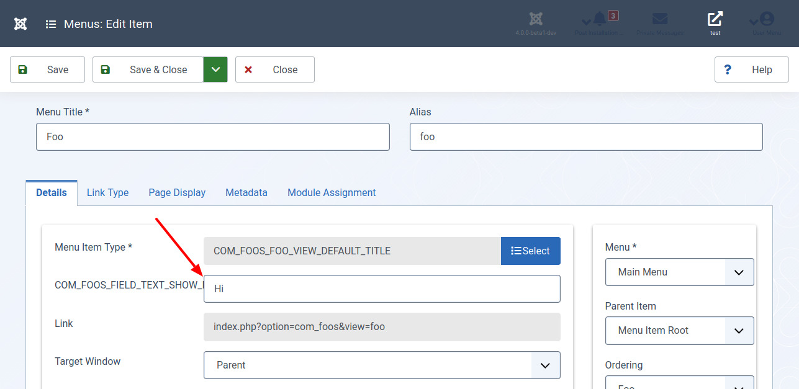
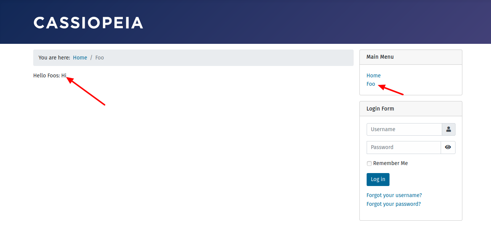

Es kommt vor, dass du die Ausgabe im Frontend für einen Menüpunkt individuell gestaltest. Hierzu benötigst du eine Variable. In diesem Teil des Tutorials fügen wir eine Textvariable zum Menüpunkt hinzu.

## Für Ungeduldige

Sieh dir den geänderten Programmcode in der [Diff-Ansicht](https://github.com/astridx/boilerplate/compare/t4...t5) an und übernimm diese Änderungen in deine Entwicklungsversion.

Eine ausführlichere Erklärung des geänderten Programmcodes findest du weiter unten.

## Teste deine Joomla-Komponente

1. Installiere deine Komponente in Joomla! Version 4, um sie zu testen:

Kopiere die Dateien im `administrator` Ordner in den `administrator` Ordner deiner Joomla! 4 Installation.  
Kopiere die Dateien im `components` Ordner in den `components` Ordner deiner Joomla! 4 Installation.

Eine neue Installation ist nicht erforderlich. Verwende die aus dem vorhergehenden Teil weiter.

2. Wechsele wieder in den Menü Manager und öffne den in Teil 4 erstellen Menüpunkt. Hier siehst du jetzt ein Textfeld, in das du einen beliebigen Text einfügst.

3. Welche jetzt in die Frontendansicht. Überzeuge dich davon, dass der von dir beim Menüpunkt eingegebene Text im Frontend an der richtigen Stelle ausgegeben wird.

Ich entschuldige mich für meine Einfallslosigkeit. Dir fallen sicher lustigere oder sinnvollere Beispiele ein. Der Sinn und die Funktion der Variablen werden aber klar, oder?

So erstellst du mehrere Menüpunkte, die jeweils einen anderen Text enthalten. Ein beliebter Anwendungsfall ist es, das Design der Ausgabe mithilfe von Variablen zu beeinflussen. Über die Variable fragst du beispielsweise ab, ob der Inhalt in einer Liste oder in einer Tabelle auszugeben ist.

## Geänderte Dateien

### Übersicht

      

    

        Files changed (2)
        <a class="d2h-file-switch d2h-hide">hide</a>
        <a class="d2h-file-switch d2h-show">show</a>
    

    <ol class="d2h-file-list">
    <li class="d2h-file-list-line">
    
      <svg aria-hidden="true" class="d2h-icon d2h-changed" height="16" title="modified" version="1.1"
           viewBox="0 0 14 16" width="14">
          <path d="M13 1H1C0.45 1 0 1.45 0 2v12c0 0.55 0.45 1 1 1h12c0.55 0 1-0.45 1-1V2c0-0.55-0.45-1-1-1z m0 13H1V2h12v12zM4 8c0-1.66 1.34-3 3-3s3 1.34 3 3-1.34 3-3 3-3-1.34-3-3z"></path>
      </svg>      <a href="#d2h-361204" class="d2h-file-name">src/components/com_foos/src/Model/FooModel.php</a>
      
          +3
          -4
      
    
</li>
<li class="d2h-file-list-line">
    
      <svg aria-hidden="true" class="d2h-icon d2h-changed" height="16" title="modified" version="1.1"
           viewBox="0 0 14 16" width="14">
          <path d="M13 1H1C0.45 1 0 1.45 0 2v12c0 0.55 0.45 1 1 1h12c0.55 0 1-0.45 1-1V2c0-0.55-0.45-1-1-1z m0 13H1V2h12v12zM4 8c0-1.66 1.34-3 3-3s3 1.34 3 3-1.34 3-3 3-3-1.34-3-3z"></path>
      </svg>      <a href="#d2h-329091" class="d2h-file-name">src/components/com_foos/tmpl/foo/default.xml</a>
      
          +11
          -0
      
    
</li>
    </ol>

    

    

    
    <svg aria-hidden="true" class="d2h-icon" height="16" version="1.1" viewBox="0 0 12 16" width="12">
        <path d="M6 5H2v-1h4v1zM2 8h7v-1H2v1z m0 2h7v-1H2v1z m0 2h7v-1H2v1z m10-7.5v9.5c0 0.55-0.45 1-1 1H1c-0.55 0-1-0.45-1-1V2c0-0.55 0.45-1 1-1h7.5l3.5 3.5z m-1 0.5L8 2H1v12h10V5z"></path>
    </svg>    src/components/com_foos/src/Model/FooModel.php
    CHANGED
    

    

        

            <table class="d2h-diff-table">
                <tbody class="d2h-diff-tbody">
                <tr>
    <td class="d2h-code-linenumber d2h-info"></td>
    <td class="d2h-info">
        
@@ -12,6 +12,7 @@ namespace Joomla\Component\Foos\Site\Model;

    </td>
</tr><tr>
    <td class="d2h-code-linenumber d2h-cntx">
      
12

12

    </td>
    <td class="d2h-cntx">
        

            &nbsp;
        

    </td>
</tr><tr>
    <td class="d2h-code-linenumber d2h-cntx">
      
13

13

    </td>
    <td class="d2h-cntx">
        

            &nbsp;
            defined(&#x27;_JEXEC&#x27;) or die;
        

    </td>
</tr><tr>
    <td class="d2h-code-linenumber d2h-cntx">
      
14

14

    </td>
    <td class="d2h-cntx">
        

            &nbsp;
        

    </td>
</tr><tr>
    <td class="d2h-code-linenumber d2h-ins">
      

15

    </td>
    <td class="d2h-ins">
        

            +
            use Joomla\CMS\Factory;
        

    </td>
</tr><tr>
    <td class="d2h-code-linenumber d2h-cntx">
      
15

16

    </td>
    <td class="d2h-cntx">
        

            &nbsp;
            use Joomla\CMS\MVC\Model\BaseDatabaseModel;
        

    </td>
</tr><tr>
    <td class="d2h-code-linenumber d2h-cntx">
      
16

17

    </td>
    <td class="d2h-cntx">
        

            &nbsp;
        

    </td>
</tr><tr>
    <td class="d2h-code-linenumber d2h-cntx">
      
17

18

    </td>
    <td class="d2h-cntx">
        

            &nbsp;
            &#x2F;**
        

    </td>
</tr>
<tr>
    <td class="d2h-code-linenumber d2h-info"></td>
    <td class="d2h-info">
        
@@ -33,10 +34,8 @@ class FooModel extends BaseDatabaseModel

    </td>
</tr><tr>
    <td class="d2h-code-linenumber d2h-cntx">
      
33

34

    </td>
    <td class="d2h-cntx">
        

            &nbsp;
            	 *&#x2F;
        

    </td>
</tr><tr>
    <td class="d2h-code-linenumber d2h-cntx">
      
34

35

    </td>
    <td class="d2h-cntx">
        

            &nbsp;
            	public function getMsg()
        

    </td>
</tr><tr>
    <td class="d2h-code-linenumber d2h-cntx">
      
35

36

    </td>
    <td class="d2h-cntx">
        

            &nbsp;
            	{
        

    </td>
</tr><tr>
    <td class="d2h-code-linenumber d2h-del d2h-change">
      
36

    </td>
    <td class="d2h-del d2h-change">
        

            -
            		<del>if</del> (<del>!isset($this-&gt;message</del>)<del>)</del>
        

    </td>
</tr><tr>
    <td class="d2h-code-linenumber d2h-del d2h-change">
      
37

    </td>
    <td class="d2h-del d2h-change">
        

            -
            		<del>{</del>
        

    </td>
</tr><tr>
    <td class="d2h-code-linenumber d2h-del">
      
38

    </td>
    <td class="d2h-del">
        

            -
            			$this-&gt;message = &#x27;Hello Foo!&#x27;;
        

    </td>
</tr><tr>
    <td class="d2h-code-linenumber d2h-del">
      
39

    </td>
    <td class="d2h-del">
        

            -
            		}
        

    </td>
</tr><tr>
    <td class="d2h-code-linenumber d2h-ins d2h-change">
      

37

    </td>
    <td class="d2h-ins d2h-change">
        

            +
            		<ins>$app</ins> <ins>= Factory::getApplication</ins>()<ins>;</ins>
        

    </td>
</tr><tr>
    <td class="d2h-code-linenumber d2h-ins d2h-change">
      

38

    </td>
    <td class="d2h-ins d2h-change">
        

            +
            		<ins>$this-&gt;message = $app-&gt;input-&gt;get(&#x27;show_text&#x27;, &quot;Hi&quot;);</ins>
        

    </td>
</tr><tr>
    <td class="d2h-code-linenumber d2h-cntx">
      
40

39

    </td>
    <td class="d2h-cntx">
        

            &nbsp;
        

    </td>
</tr><tr>
    <td class="d2h-code-linenumber d2h-cntx">
      
41

40

    </td>
    <td class="d2h-cntx">
        

            &nbsp;
            		return $this-&gt;message;
        

    </td>
</tr><tr>
    <td class="d2h-code-linenumber d2h-cntx">
      
42

41

    </td>
    <td class="d2h-cntx">
        

            &nbsp;
            	}
        

    </td>
</tr>
                </tbody>
            </table>
        

    

    

    
    <svg aria-hidden="true" class="d2h-icon" height="16" version="1.1" viewBox="0 0 12 16" width="12">
        <path d="M6 5H2v-1h4v1zM2 8h7v-1H2v1z m0 2h7v-1H2v1z m0 2h7v-1H2v1z m10-7.5v9.5c0 0.55-0.45 1-1 1H1c-0.55 0-1-0.45-1-1V2c0-0.55 0.45-1 1-1h7.5l3.5 3.5z m-1 0.5L8 2H1v12h10V5z"></path>
    </svg>    src/components/com_foos/tmpl/foo/default.xml
    CHANGED
    

    

        

            <table class="d2h-diff-table">
                <tbody class="d2h-diff-tbody">
                <tr>
    <td class="d2h-code-linenumber d2h-info"></td>
    <td class="d2h-info">
        
@@ -5,4 +5,15 @@

    </td>
</tr><tr>
    <td class="d2h-code-linenumber d2h-cntx">
      
5

5

    </td>
    <td class="d2h-cntx">
        

            &nbsp;
            			&lt;![CDATA[COM_FOOS_FOO_VIEW_DEFAULT_DESC]]&gt;
        

    </td>
</tr><tr>
    <td class="d2h-code-linenumber d2h-cntx">
      
6

6

    </td>
    <td class="d2h-cntx">
        

            &nbsp;
            		&lt;&#x2F;message&gt;
        

    </td>
</tr><tr>
    <td class="d2h-code-linenumber d2h-cntx">
      
7

7

    </td>
    <td class="d2h-cntx">
        

            &nbsp;
            	&lt;&#x2F;layout&gt;
        

    </td>
</tr><tr>
    <td class="d2h-code-linenumber d2h-ins">
      

8

    </td>
    <td class="d2h-ins">
        

            +
            	&lt;!-- Add fields to the request variables for the layout. --&gt;
        

    </td>
</tr><tr>
    <td class="d2h-code-linenumber d2h-ins">
      

9

    </td>
    <td class="d2h-ins">
        

            +
            	&lt;fields name=&quot;request&quot;&gt;
        

    </td>
</tr><tr>
    <td class="d2h-code-linenumber d2h-ins">
      

10

    </td>
    <td class="d2h-ins">
        

            +
            		&lt;fieldset name=&quot;request&quot;&gt;
        

    </td>
</tr><tr>
    <td class="d2h-code-linenumber d2h-ins">
      

11

    </td>
    <td class="d2h-ins">
        

            +
            			&lt;field
        

    </td>
</tr><tr>
    <td class="d2h-code-linenumber d2h-ins">
      

12

    </td>
    <td class="d2h-ins">
        

            +
            				name=&quot;show_text&quot;
        

    </td>
</tr><tr>
    <td class="d2h-code-linenumber d2h-ins">
      

13

    </td>
    <td class="d2h-ins">
        

            +
            				type=&quot;text&quot;
        

    </td>
</tr><tr>
    <td class="d2h-code-linenumber d2h-ins">
      

14

    </td>
    <td class="d2h-ins">
        

            +
            				label=&quot;COM_FOOS_FIELD_TEXT_SHOW_LABEL&quot;
        

    </td>
</tr><tr>
    <td class="d2h-code-linenumber d2h-ins">
      

15

    </td>
    <td class="d2h-ins">
        

            +
            				default=&quot;Hi&quot; 
        

    </td>
</tr><tr>
    <td class="d2h-code-linenumber d2h-ins">
      

16

    </td>
    <td class="d2h-ins">
        

            +
            			&#x2F;&gt;
        

    </td>
</tr><tr>
    <td class="d2h-code-linenumber d2h-ins">
      

17

    </td>
    <td class="d2h-ins">
        

            +
            		&lt;&#x2F;fieldset&gt;
        

    </td>
</tr><tr>
    <td class="d2h-code-linenumber d2h-ins">
      

18

    </td>
    <td class="d2h-ins">
        

            +
            	&lt;&#x2F;fields&gt;
        

    </td>
</tr><tr>
    <td class="d2h-code-linenumber d2h-cntx">
      
8

19

    </td>
    <td class="d2h-cntx">
        

            &nbsp;
            &lt;&#x2F;metadata&gt;
        

    </td>
</tr>
                </tbody>
            </table>
        

    

    

