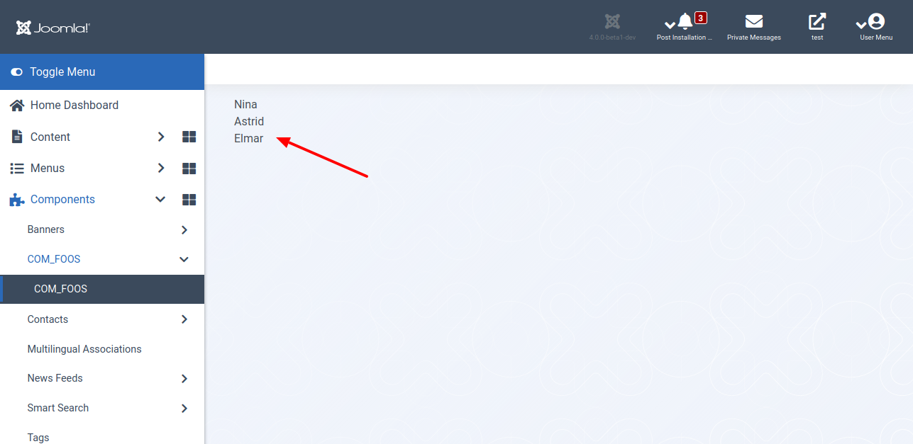

Deine Ansicht im Administrationsbereich enthält in der Regel nicht nur statischen Text. Du zeigst hier Daten an, die dynamisch sind. So arbeiten zumindest die meisten Erweiterungen. Deshalb legen wir in diesem Teil eine Datenbank für deine Komponente an.

In der Datenbank speichern wir bei der Einrichtung drei Datensätze und zeigen diese im Administrationsbereich an. Es wird eine statische Liste ausgegeben. Änderbar sind die einzelnen Einträge über das Backend nicht. Daran arbeiten wir im nächsten Teil.

## Für Ungeduldige

Sieh dir den geänderten Programmcode in der [Diff-Ansicht](https://github.com/astridx/boilerplate/compare/t5...t6) an und übernimm diese Änderungen in deine Entwicklungsversion.

Eine ausführlichere Erklärung des geänderten Programmcodes findest du weiter unten.

## Teste deine Joomla-Komponente

1. Installiere deine Komponente in Joomla! Version 4, um sie zu testen:

Kopiere die Dateien im `administrator` Ordner in den `administrator` Ordner deiner Joomla! 4 Installation.  
Kopiere die Dateien im `components` Ordner in den `components` Ordner deiner Joomla! 4 Installation.

Installiere deine Komponenten wie in Teil eins beschrieben, nachdem du alle Dateien kopiert hast. Joomla! erstellt bei der Installation die Datenbank für dich.

2. Teste als Nächstes, ob du die Ansicht im Administrationsbereich für deine Komponente fehlerfrei angezeigt bekommst. Siehst du drei Einträge? Diese hatten wir beim Einrichten der Datenbank als Beispieldaten angelegt.

## Geänderte Dateien

### Übersicht

      

    

        Files changed (7)
        <a class="d2h-file-switch d2h-hide">hide</a>
        <a class="d2h-file-switch d2h-show">show</a>
    

    <ol class="d2h-file-list">
    <li class="d2h-file-list-line">
    
      <svg aria-hidden="true" class="d2h-icon d2h-changed" height="16" title="modified" version="1.1"
           viewBox="0 0 14 16" width="14">
          <path d="M13 1H1C0.45 1 0 1.45 0 2v12c0 0.55 0.45 1 1 1h12c0.55 0 1-0.45 1-1V2c0-0.55-0.45-1-1-1z m0 13H1V2h12v12zM4 8c0-1.66 1.34-3 3-3s3 1.34 3 3-1.34 3-3 3-3-1.34-3-3z"></path>
      </svg>      <a href="#d2h-863218" class="d2h-file-name">src/administrator/components/com_foos/foos.xml</a>
      
          +11
          -0
      
    
</li>
<li class="d2h-file-list-line">
    
      <svg aria-hidden="true" class="d2h-icon d2h-changed" height="16" title="modified" version="1.1"
           viewBox="0 0 14 16" width="14">
          <path d="M13 1H1C0.45 1 0 1.45 0 2v12c0 0.55 0.45 1 1 1h12c0.55 0 1-0.45 1-1V2c0-0.55-0.45-1-1-1z m0 13H1V2h12v12zM4 8c0-1.66 1.34-3 3-3s3 1.34 3 3-1.34 3-3 3-3-1.34-3-3z"></path>
      </svg>      <a href="#d2h-591404" class="d2h-file-name">src/administrator/components/com_foos/services/provider.php</a>
      
          +2
          -0
      
    
</li>
<li class="d2h-file-list-line">
    
      <svg aria-hidden="true" class="d2h-icon d2h-added" height="16" title="added" version="1.1" viewBox="0 0 14 16"
           width="14">
          <path d="M13 1H1C0.45 1 0 1.45 0 2v12c0 0.55 0.45 1 1 1h12c0.55 0 1-0.45 1-1V2c0-0.55-0.45-1-1-1z m0 13H1V2h12v12zM6 9H3V7h3V4h2v3h3v2H8v3H6V9z"></path>
      </svg>      <a href="#d2h-929815" class="d2h-file-name">src/administrator/components/com_foos/sql/install.mysql.utf8.sql</a>
      
          +11
          -0
      
    
</li>
<li class="d2h-file-list-line">
    
      <svg aria-hidden="true" class="d2h-icon d2h-added" height="16" title="added" version="1.1" viewBox="0 0 14 16"
           width="14">
          <path d="M13 1H1C0.45 1 0 1.45 0 2v12c0 0.55 0.45 1 1 1h12c0.55 0 1-0.45 1-1V2c0-0.55-0.45-1-1-1z m0 13H1V2h12v12zM6 9H3V7h3V4h2v3h3v2H8v3H6V9z"></path>
      </svg>      <a href="#d2h-998462" class="d2h-file-name">src/administrator/components/com_foos/sql/uninstall.mysql.utf8.sql</a>
      
          +1
          -0
      
    
</li>
<li class="d2h-file-list-line">
    
      <svg aria-hidden="true" class="d2h-icon d2h-added" height="16" title="added" version="1.1" viewBox="0 0 14 16"
           width="14">
          <path d="M13 1H1C0.45 1 0 1.45 0 2v12c0 0.55 0.45 1 1 1h12c0.55 0 1-0.45 1-1V2c0-0.55-0.45-1-1-1z m0 13H1V2h12v12zM6 9H3V7h3V4h2v3h3v2H8v3H6V9z"></path>
      </svg>      <a href="#d2h-841411" class="d2h-file-name">src/administrator/components/com_foos/src/Model/FoosModel.php</a>
      
          +57
          -0
      
    
</li>
<li class="d2h-file-list-line">
    
      <svg aria-hidden="true" class="d2h-icon d2h-changed" height="16" title="modified" version="1.1"
           viewBox="0 0 14 16" width="14">
          <path d="M13 1H1C0.45 1 0 1.45 0 2v12c0 0.55 0.45 1 1 1h12c0.55 0 1-0.45 1-1V2c0-0.55-0.45-1-1-1z m0 13H1V2h12v12zM4 8c0-1.66 1.34-3 3-3s3 1.34 3 3-1.34 3-3 3-3-1.34-3-3z"></path>
      </svg>      <a href="#d2h-529131" class="d2h-file-name">src/administrator/components/com_foos/src/View/Foos/HtmlView.php</a>
      
          +8
          -0
      
    
</li>
<li class="d2h-file-list-line">
    
      <svg aria-hidden="true" class="d2h-icon d2h-changed" height="16" title="modified" version="1.1"
           viewBox="0 0 14 16" width="14">
          <path d="M13 1H1C0.45 1 0 1.45 0 2v12c0 0.55 0.45 1 1 1h12c0.55 0 1-0.45 1-1V2c0-0.55-0.45-1-1-1z m0 13H1V2h12v12zM4 8c0-1.66 1.34-3 3-3s3 1.34 3 3-1.34 3-3 3-3-1.34-3-3z"></path>
      </svg>      <a href="#d2h-900341" class="d2h-file-name">src/administrator/components/com_foos/tmpl/foos/default.php</a>
      
          +4
          -1
      
    
</li>
    </ol>

    

    

    
    <svg aria-hidden="true" class="d2h-icon" height="16" version="1.1" viewBox="0 0 12 16" width="12">
        <path d="M6 5H2v-1h4v1zM2 8h7v-1H2v1z m0 2h7v-1H2v1z m0 2h7v-1H2v1z m10-7.5v9.5c0 0.55-0.45 1-1 1H1c-0.55 0-1-0.45-1-1V2c0-0.55 0.45-1 1-1h7.5l3.5 3.5z m-1 0.5L8 2H1v12h10V5z"></path>
    </svg>    src/administrator/components/com_foos/foos.xml
    CHANGED
    

    

        

            <table class="d2h-diff-table">
                <tbody class="d2h-diff-tbody">
                <tr>
    <td class="d2h-code-linenumber d2h-info"></td>
    <td class="d2h-info">
        
@@ -11,6 +11,16 @@

    </td>
</tr><tr>
    <td class="d2h-code-linenumber d2h-cntx">
      
11

11

    </td>
    <td class="d2h-cntx">
        

            &nbsp;
            	&lt;description&gt;COM_FOOS_XML_DESCRIPTION&lt;&#x2F;description&gt;
        

    </td>
</tr><tr>
    <td class="d2h-code-linenumber d2h-cntx">
      
12

12

    </td>
    <td class="d2h-cntx">
        

            &nbsp;
            	&lt;namespace path=&quot;src&quot;&gt;Joomla\Component\Foos&lt;&#x2F;namespace&gt;
        

    </td>
</tr><tr>
    <td class="d2h-code-linenumber d2h-cntx">
      
13

13

    </td>
    <td class="d2h-cntx">
        

            &nbsp;
            	&lt;scriptfile&gt;script.php&lt;&#x2F;scriptfile&gt;
        

    </td>
</tr><tr>
    <td class="d2h-code-linenumber d2h-ins">
      

14

    </td>
    <td class="d2h-ins">
        

            +
            	&lt;install&gt; &lt;!-- Runs on install --&gt;
        

    </td>
</tr><tr>
    <td class="d2h-code-linenumber d2h-ins">
      

15

    </td>
    <td class="d2h-ins">
        

            +
            		&lt;sql&gt;
        

    </td>
</tr><tr>
    <td class="d2h-code-linenumber d2h-ins">
      

16

    </td>
    <td class="d2h-ins">
        

            +
            			&lt;file driver=&quot;mysql&quot; charset=&quot;utf8&quot;&gt;sql&#x2F;install.mysql.utf8.sql&lt;&#x2F;file&gt;
        

    </td>
</tr><tr>
    <td class="d2h-code-linenumber d2h-ins">
      

17

    </td>
    <td class="d2h-ins">
        

            +
            		&lt;&#x2F;sql&gt;
        

    </td>
</tr><tr>
    <td class="d2h-code-linenumber d2h-ins">
      

18

    </td>
    <td class="d2h-ins">
        

            +
            	&lt;&#x2F;install&gt;
        

    </td>
</tr><tr>
    <td class="d2h-code-linenumber d2h-ins">
      

19

    </td>
    <td class="d2h-ins">
        

            +
            	&lt;uninstall&gt; &lt;!-- Runs on uninstall --&gt;
        

    </td>
</tr><tr>
    <td class="d2h-code-linenumber d2h-ins">
      

20

    </td>
    <td class="d2h-ins">
        

            +
            		&lt;sql&gt;
        

    </td>
</tr><tr>
    <td class="d2h-code-linenumber d2h-ins">
      

21

    </td>
    <td class="d2h-ins">
        

            +
            			&lt;file driver=&quot;mysql&quot; charset=&quot;utf8&quot;&gt;sql&#x2F;uninstall.mysql.utf8.sql&lt;&#x2F;file&gt;
        

    </td>
</tr><tr>
    <td class="d2h-code-linenumber d2h-ins">
      

22

    </td>
    <td class="d2h-ins">
        

            +
            		&lt;&#x2F;sql&gt;
        

    </td>
</tr><tr>
    <td class="d2h-code-linenumber d2h-ins">
      

23

    </td>
    <td class="d2h-ins">
        

            +
            	&lt;&#x2F;uninstall&gt;
        

    </td>
</tr><tr>
    <td class="d2h-code-linenumber d2h-cntx">
      
14

24

    </td>
    <td class="d2h-cntx">
        

            &nbsp;
            	&lt;!-- Frond-end files --&gt;
        

    </td>
</tr><tr>
    <td class="d2h-code-linenumber d2h-cntx">
      
15

25

    </td>
    <td class="d2h-cntx">
        

            &nbsp;
            	&lt;files folder=&quot;components&#x2F;com_foos&quot;&gt;
        

    </td>
</tr><tr>
    <td class="d2h-code-linenumber d2h-cntx">
      
16

26

    </td>
    <td class="d2h-cntx">
        

            &nbsp;
            		&lt;folder&gt;src&lt;&#x2F;folder&gt;
        

    </td>
</tr>
<tr>
    <td class="d2h-code-linenumber d2h-info"></td>
    <td class="d2h-info">
        
@@ -26,6 +36,7 @@

    </td>
</tr><tr>
    <td class="d2h-code-linenumber d2h-cntx">
      
26

36

    </td>
    <td class="d2h-cntx">
        

            &nbsp;
            		&lt;files folder=&quot;administrator&#x2F;components&#x2F;com_foos&quot;&gt;
        

    </td>
</tr><tr>
    <td class="d2h-code-linenumber d2h-cntx">
      
27

37

    </td>
    <td class="d2h-cntx">
        

            &nbsp;
            			&lt;filename&gt;foos.xml&lt;&#x2F;filename&gt;
        

    </td>
</tr><tr>
    <td class="d2h-code-linenumber d2h-cntx">
      
28

38

    </td>
    <td class="d2h-cntx">
        

            &nbsp;
            			&lt;folder&gt;services&lt;&#x2F;folder&gt;
        

    </td>
</tr><tr>
    <td class="d2h-code-linenumber d2h-ins">
      

39

    </td>
    <td class="d2h-ins">
        

            +
            			&lt;folder&gt;sql&lt;&#x2F;folder&gt;
        

    </td>
</tr><tr>
    <td class="d2h-code-linenumber d2h-cntx">
      
29

40

    </td>
    <td class="d2h-cntx">
        

            &nbsp;
            			&lt;folder&gt;src&lt;&#x2F;folder&gt;
        

    </td>
</tr><tr>
    <td class="d2h-code-linenumber d2h-cntx">
      
30

41

    </td>
    <td class="d2h-cntx">
        

            &nbsp;
            			&lt;folder&gt;tmpl&lt;&#x2F;folder&gt;
        

    </td>
</tr><tr>
    <td class="d2h-code-linenumber d2h-cntx">
      
31

42

    </td>
    <td class="d2h-cntx">
        

            &nbsp;
            		&lt;&#x2F;files&gt;
        

    </td>
</tr>
                </tbody>
            </table>
        

    

    

    
    <svg aria-hidden="true" class="d2h-icon" height="16" version="1.1" viewBox="0 0 12 16" width="12">
        <path d="M6 5H2v-1h4v1zM2 8h7v-1H2v1z m0 2h7v-1H2v1z m0 2h7v-1H2v1z m10-7.5v9.5c0 0.55-0.45 1-1 1H1c-0.55 0-1-0.45-1-1V2c0-0.55 0.45-1 1-1h7.5l3.5 3.5z m-1 0.5L8 2H1v12h10V5z"></path>
    </svg>    src/administrator/components/com_foos/services/provider.php
    CHANGED
    

    

        

            <table class="d2h-diff-table">
                <tbody class="d2h-diff-tbody">
                <tr>
    <td class="d2h-code-linenumber d2h-info"></td>
    <td class="d2h-info">
        
@@ -15,6 +15,7 @@ use Joomla\CMS\Extension\Service\Provider\CategoryFactory;

    </td>
</tr><tr>
    <td class="d2h-code-linenumber d2h-cntx">
      
15

15

    </td>
    <td class="d2h-cntx">
        

            &nbsp;
            use Joomla\CMS\Extension\Service\Provider\ComponentDispatcherFactory;
        

    </td>
</tr><tr>
    <td class="d2h-code-linenumber d2h-cntx">
      
16

16

    </td>
    <td class="d2h-cntx">
        

            &nbsp;
            use Joomla\CMS\Extension\Service\Provider\MVCFactory;
        

    </td>
</tr><tr>
    <td class="d2h-code-linenumber d2h-cntx">
      
17

17

    </td>
    <td class="d2h-cntx">
        

            &nbsp;
            use Joomla\CMS\HTML\Registry;
        

    </td>
</tr><tr>
    <td class="d2h-code-linenumber d2h-ins">
      

18

    </td>
    <td class="d2h-ins">
        

            +
            use Joomla\CMS\MVC\Factory\MVCFactoryInterface;
        

    </td>
</tr><tr>
    <td class="d2h-code-linenumber d2h-cntx">
      
18

19

    </td>
    <td class="d2h-cntx">
        

            &nbsp;
            use Joomla\DI\Container;
        

    </td>
</tr><tr>
    <td class="d2h-code-linenumber d2h-cntx">
      
19

20

    </td>
    <td class="d2h-cntx">
        

            &nbsp;
            use Joomla\DI\ServiceProviderInterface;
        

    </td>
</tr><tr>
    <td class="d2h-code-linenumber d2h-cntx">
      
20

21

    </td>
    <td class="d2h-cntx">
        

            &nbsp;
            use Joomla\Component\Foos\Administrator\Extension\FoosComponent;
        

    </td>
</tr>
<tr>
    <td class="d2h-code-linenumber d2h-info"></td>
    <td class="d2h-info">
        
@@ -49,6 +50,7 @@ return new class implements ServiceProviderInterface

    </td>
</tr><tr>
    <td class="d2h-code-linenumber d2h-cntx">
      
49

50

    </td>
    <td class="d2h-cntx">
        

            &nbsp;
            				$component = new FoosComponent($container-&gt;get(ComponentDispatcherFactoryInterface::class));
        

    </td>
</tr><tr>
    <td class="d2h-code-linenumber d2h-cntx">
      
50

51

    </td>
    <td class="d2h-cntx">
        

            &nbsp;
        

    </td>
</tr><tr>
    <td class="d2h-code-linenumber d2h-cntx">
      
51

52

    </td>
    <td class="d2h-cntx">
        

            &nbsp;
            				$component-&gt;setRegistry($container-&gt;get(Registry::class));
        

    </td>
</tr><tr>
    <td class="d2h-code-linenumber d2h-ins">
      

53

    </td>
    <td class="d2h-ins">
        

            +
            				$component-&gt;setMVCFactory($container-&gt;get(MVCFactoryInterface::class));
        

    </td>
</tr><tr>
    <td class="d2h-code-linenumber d2h-cntx">
      
52

54

    </td>
    <td class="d2h-cntx">
        

            &nbsp;
        

    </td>
</tr><tr>
    <td class="d2h-code-linenumber d2h-cntx">
      
53

55

    </td>
    <td class="d2h-cntx">
        

            &nbsp;
            				return $component;
        

    </td>
</tr><tr>
    <td class="d2h-code-linenumber d2h-cntx">
      
54

56

    </td>
    <td class="d2h-cntx">
        

            &nbsp;
            			}
        

    </td>
</tr>
                </tbody>
            </table>
        

    

    

    
    <svg aria-hidden="true" class="d2h-icon" height="16" version="1.1" viewBox="0 0 12 16" width="12">
        <path d="M6 5H2v-1h4v1zM2 8h7v-1H2v1z m0 2h7v-1H2v1z m0 2h7v-1H2v1z m10-7.5v9.5c0 0.55-0.45 1-1 1H1c-0.55 0-1-0.45-1-1V2c0-0.55 0.45-1 1-1h7.5l3.5 3.5z m-1 0.5L8 2H1v12h10V5z"></path>
    </svg>    src/administrator/components/com_foos/sql/install.mysql.utf8.sql
    ADDED
    

    

        

            <table class="d2h-diff-table">
                <tbody class="d2h-diff-tbody">
                <tr>
    <td class="d2h-code-linenumber d2h-info"></td>
    <td class="d2h-info">
        
@@ -0,0 +1,11 @@

    </td>
</tr><tr>
    <td class="d2h-code-linenumber d2h-ins">
      

1

    </td>
    <td class="d2h-ins">
        

            +
            CREATE TABLE IF NOT EXISTS `#__foos_details` (
        

    </td>
</tr><tr>
    <td class="d2h-code-linenumber d2h-ins">
      

2

    </td>
    <td class="d2h-ins">
        

            +
              `id` int(11) NOT NULL AUTO_INCREMENT,
        

    </td>
</tr><tr>
    <td class="d2h-code-linenumber d2h-ins">
      

3

    </td>
    <td class="d2h-ins">
        

            +
              `alias` varchar(400) CHARACTER SET utf8mb4 COLLATE utf8mb4_bin NOT NULL DEFAULT &#x27;&#x27;,
        

    </td>
</tr><tr>
    <td class="d2h-code-linenumber d2h-ins">
      

4

    </td>
    <td class="d2h-ins">
        

            +
              `name` varchar(255) NOT NULL DEFAULT &#x27;&#x27;,
        

    </td>
</tr><tr>
    <td class="d2h-code-linenumber d2h-ins">
      

5

    </td>
    <td class="d2h-ins">
        

            +
              PRIMARY KEY (`id`)
        

    </td>
</tr><tr>
    <td class="d2h-code-linenumber d2h-ins">
      

6

    </td>
    <td class="d2h-ins">
        

            +
            ) ENGINE=InnoDB DEFAULT CHARSET=utf8mb4 DEFAULT COLLATE=utf8mb4_unicode_ci;
        

    </td>
</tr><tr>
    <td class="d2h-code-linenumber d2h-ins">
      

7

    </td>
    <td class="d2h-ins">
        

            +
        

    </td>
</tr><tr>
    <td class="d2h-code-linenumber d2h-ins">
      

8

    </td>
    <td class="d2h-ins">
        

            +
            INSERT INTO `#__foos_details` (`name`) VALUES
        

    </td>
</tr><tr>
    <td class="d2h-code-linenumber d2h-ins">
      

9

    </td>
    <td class="d2h-ins">
        

            +
            (&#x27;Nina&#x27;),
        

    </td>
</tr><tr>
    <td class="d2h-code-linenumber d2h-ins">
      

10

    </td>
    <td class="d2h-ins">
        

            +
            (&#x27;Astrid&#x27;),
        

    </td>
</tr><tr>
    <td class="d2h-code-linenumber d2h-ins">
      

11

    </td>
    <td class="d2h-ins">
        

            +
            (&#x27;Elmar&#x27;);
        

    </td>
</tr>
                </tbody>
            </table>
        

    

    

    
    <svg aria-hidden="true" class="d2h-icon" height="16" version="1.1" viewBox="0 0 12 16" width="12">
        <path d="M6 5H2v-1h4v1zM2 8h7v-1H2v1z m0 2h7v-1H2v1z m0 2h7v-1H2v1z m10-7.5v9.5c0 0.55-0.45 1-1 1H1c-0.55 0-1-0.45-1-1V2c0-0.55 0.45-1 1-1h7.5l3.5 3.5z m-1 0.5L8 2H1v12h10V5z"></path>
    </svg>    src/administrator/components/com_foos/sql/uninstall.mysql.utf8.sql
    ADDED
    

    

        

            <table class="d2h-diff-table">
                <tbody class="d2h-diff-tbody">
                <tr>
    <td class="d2h-code-linenumber d2h-info"></td>
    <td class="d2h-info">
        
@@ -0,0 +1 @@

    </td>
</tr><tr>
    <td class="d2h-code-linenumber d2h-ins">
      

1

    </td>
    <td class="d2h-ins">
        

            +
            DROP TABLE IF EXISTS `#__foos_details`;
        

    </td>
</tr>
                </tbody>
            </table>
        

    

    

    
    <svg aria-hidden="true" class="d2h-icon" height="16" version="1.1" viewBox="0 0 12 16" width="12">
        <path d="M6 5H2v-1h4v1zM2 8h7v-1H2v1z m0 2h7v-1H2v1z m0 2h7v-1H2v1z m10-7.5v9.5c0 0.55-0.45 1-1 1H1c-0.55 0-1-0.45-1-1V2c0-0.55 0.45-1 1-1h7.5l3.5 3.5z m-1 0.5L8 2H1v12h10V5z"></path>
    </svg>    src/administrator/components/com_foos/src/Model/FoosModel.php
    ADDED
    

    

        

            <table class="d2h-diff-table">
                <tbody class="d2h-diff-tbody">
                <tr>
    <td class="d2h-code-linenumber d2h-info"></td>
    <td class="d2h-info">
        
@@ -0,0 +1,57 @@

    </td>
</tr><tr>
    <td class="d2h-code-linenumber d2h-ins">
      

1

    </td>
    <td class="d2h-ins">
        

            +
            &lt;?php
        

    </td>
</tr><tr>
    <td class="d2h-code-linenumber d2h-ins">
      

2

    </td>
    <td class="d2h-ins">
        

            +
            &#x2F;**
        

    </td>
</tr><tr>
    <td class="d2h-code-linenumber d2h-ins">
      

3

    </td>
    <td class="d2h-ins">
        

            +
             * @package     Joomla.Administrator
        

    </td>
</tr><tr>
    <td class="d2h-code-linenumber d2h-ins">
      

4

    </td>
    <td class="d2h-ins">
        

            +
             * @subpackage  com_foos
        

    </td>
</tr><tr>
    <td class="d2h-code-linenumber d2h-ins">
      

5

    </td>
    <td class="d2h-ins">
        

            +
             *
        

    </td>
</tr><tr>
    <td class="d2h-code-linenumber d2h-ins">
      

6

    </td>
    <td class="d2h-ins">
        

            +
             * @copyright   Copyright (C) 2005 - 2020 Open Source Matters, Inc. All rights reserved.
        

    </td>
</tr><tr>
    <td class="d2h-code-linenumber d2h-ins">
      

7

    </td>
    <td class="d2h-ins">
        

            +
             * @license     GNU General Public License version 2 or later; see LICENSE.txt
        

    </td>
</tr><tr>
    <td class="d2h-code-linenumber d2h-ins">
      

8

    </td>
    <td class="d2h-ins">
        

            +
             *&#x2F;
        

    </td>
</tr><tr>
    <td class="d2h-code-linenumber d2h-ins">
      

9

    </td>
    <td class="d2h-ins">
        

            +
        

    </td>
</tr><tr>
    <td class="d2h-code-linenumber d2h-ins">
      

10

    </td>
    <td class="d2h-ins">
        

            +
            namespace Joomla\Component\Foos\Administrator\Model;
        

    </td>
</tr><tr>
    <td class="d2h-code-linenumber d2h-ins">
      

11

    </td>
    <td class="d2h-ins">
        

            +
        

    </td>
</tr><tr>
    <td class="d2h-code-linenumber d2h-ins">
      

12

    </td>
    <td class="d2h-ins">
        

            +
            defined(&#x27;_JEXEC&#x27;) or die;
        

    </td>
</tr><tr>
    <td class="d2h-code-linenumber d2h-ins">
      

13

    </td>
    <td class="d2h-ins">
        

            +
        

    </td>
</tr><tr>
    <td class="d2h-code-linenumber d2h-ins">
      

14

    </td>
    <td class="d2h-ins">
        

            +
            use Joomla\CMS\MVC\Model\ListModel;
        

    </td>
</tr><tr>
    <td class="d2h-code-linenumber d2h-ins">
      

15

    </td>
    <td class="d2h-ins">
        

            +
        

    </td>
</tr><tr>
    <td class="d2h-code-linenumber d2h-ins">
      

16

    </td>
    <td class="d2h-ins">
        

            +
            &#x2F;**
        

    </td>
</tr><tr>
    <td class="d2h-code-linenumber d2h-ins">
      

17

    </td>
    <td class="d2h-ins">
        

            +
             * Methods supporting a list of foo records.
        

    </td>
</tr><tr>
    <td class="d2h-code-linenumber d2h-ins">
      

18

    </td>
    <td class="d2h-ins">
        

            +
             *
        

    </td>
</tr><tr>
    <td class="d2h-code-linenumber d2h-ins">
      

19

    </td>
    <td class="d2h-ins">
        

            +
             * @since  __BUMP_VERSION__
        

    </td>
</tr><tr>
    <td class="d2h-code-linenumber d2h-ins">
      

20

    </td>
    <td class="d2h-ins">
        

            +
             *&#x2F;
        

    </td>
</tr><tr>
    <td class="d2h-code-linenumber d2h-ins">
      

21

    </td>
    <td class="d2h-ins">
        

            +
            class FoosModel extends ListModel
        

    </td>
</tr><tr>
    <td class="d2h-code-linenumber d2h-ins">
      

22

    </td>
    <td class="d2h-ins">
        

            +
            {
        

    </td>
</tr><tr>
    <td class="d2h-code-linenumber d2h-ins">
      

23

    </td>
    <td class="d2h-ins">
        

            +
            	&#x2F;**
        

    </td>
</tr><tr>
    <td class="d2h-code-linenumber d2h-ins">
      

24

    </td>
    <td class="d2h-ins">
        

            +
            	 * Constructor.
        

    </td>
</tr><tr>
    <td class="d2h-code-linenumber d2h-ins">
      

25

    </td>
    <td class="d2h-ins">
        

            +
            	 *
        

    </td>
</tr><tr>
    <td class="d2h-code-linenumber d2h-ins">
      

26

    </td>
    <td class="d2h-ins">
        

            +
            	 * @param   array  $config  An optional associative array of configuration settings.
        

    </td>
</tr><tr>
    <td class="d2h-code-linenumber d2h-ins">
      

27

    </td>
    <td class="d2h-ins">
        

            +
            	 *
        

    </td>
</tr><tr>
    <td class="d2h-code-linenumber d2h-ins">
      

28

    </td>
    <td class="d2h-ins">
        

            +
            	 * @see     \JControllerLegacy
        

    </td>
</tr><tr>
    <td class="d2h-code-linenumber d2h-ins">
      

29

    </td>
    <td class="d2h-ins">
        

            +
            	 *
        

    </td>
</tr><tr>
    <td class="d2h-code-linenumber d2h-ins">
      

30

    </td>
    <td class="d2h-ins">
        

            +
            	 * @since   __BUMP_VERSION__
        

    </td>
</tr><tr>
    <td class="d2h-code-linenumber d2h-ins">
      

31

    </td>
    <td class="d2h-ins">
        

            +
            	 *&#x2F;
        

    </td>
</tr><tr>
    <td class="d2h-code-linenumber d2h-ins">
      

32

    </td>
    <td class="d2h-ins">
        

            +
            	public function __construct($config = array())
        

    </td>
</tr><tr>
    <td class="d2h-code-linenumber d2h-ins">
      

33

    </td>
    <td class="d2h-ins">
        

            +
            	{
        

    </td>
</tr><tr>
    <td class="d2h-code-linenumber d2h-ins">
      

34

    </td>
    <td class="d2h-ins">
        

            +
            		parent::__construct($config);
        

    </td>
</tr><tr>
    <td class="d2h-code-linenumber d2h-ins">
      

35

    </td>
    <td class="d2h-ins">
        

            +
            	}
        

    </td>
</tr><tr>
    <td class="d2h-code-linenumber d2h-ins">
      

36

    </td>
    <td class="d2h-ins">
        

            +
            	&#x2F;**
        

    </td>
</tr><tr>
    <td class="d2h-code-linenumber d2h-ins">
      

37

    </td>
    <td class="d2h-ins">
        

            +
            	 * Build an SQL query to load the list data.
        

    </td>
</tr><tr>
    <td class="d2h-code-linenumber d2h-ins">
      

38

    </td>
    <td class="d2h-ins">
        

            +
            	 *
        

    </td>
</tr><tr>
    <td class="d2h-code-linenumber d2h-ins">
      

39

    </td>
    <td class="d2h-ins">
        

            +
            	 * @return  \JDatabaseQuery
        

    </td>
</tr><tr>
    <td class="d2h-code-linenumber d2h-ins">
      

40

    </td>
    <td class="d2h-ins">
        

            +
            	 *
        

    </td>
</tr><tr>
    <td class="d2h-code-linenumber d2h-ins">
      

41

    </td>
    <td class="d2h-ins">
        

            +
            	 * @since   __BUMP_VERSION__
        

    </td>
</tr><tr>
    <td class="d2h-code-linenumber d2h-ins">
      

42

    </td>
    <td class="d2h-ins">
        

            +
            	 *&#x2F;
        

    </td>
</tr><tr>
    <td class="d2h-code-linenumber d2h-ins">
      

43

    </td>
    <td class="d2h-ins">
        

            +
            	protected function getListQuery()
        

    </td>
</tr><tr>
    <td class="d2h-code-linenumber d2h-ins">
      

44

    </td>
    <td class="d2h-ins">
        

            +
            	{
        

    </td>
</tr><tr>
    <td class="d2h-code-linenumber d2h-ins">
      

45

    </td>
    <td class="d2h-ins">
        

            +
            		&#x2F;&#x2F; Create a new query object.
        

    </td>
</tr><tr>
    <td class="d2h-code-linenumber d2h-ins">
      

46

    </td>
    <td class="d2h-ins">
        

            +
            		$db = $this-&gt;getDbo();
        

    </td>
</tr><tr>
    <td class="d2h-code-linenumber d2h-ins">
      

47

    </td>
    <td class="d2h-ins">
        

            +
            		$query = $db-&gt;getQuery(true);
        

    </td>
</tr><tr>
    <td class="d2h-code-linenumber d2h-ins">
      

48

    </td>
    <td class="d2h-ins">
        

            +
        

    </td>
</tr><tr>
    <td class="d2h-code-linenumber d2h-ins">
      

49

    </td>
    <td class="d2h-ins">
        

            +
            		&#x2F;&#x2F; Select the required fields from the table.
        

    </td>
</tr><tr>
    <td class="d2h-code-linenumber d2h-ins">
      

50

    </td>
    <td class="d2h-ins">
        

            +
            		$query-&gt;select(
        

    </td>
</tr><tr>
    <td class="d2h-code-linenumber d2h-ins">
      

51

    </td>
    <td class="d2h-ins">
        

            +
            			$db-&gt;quoteName(array(&#x27;id&#x27;, &#x27;name&#x27;, &#x27;alias&#x27;))
        

    </td>
</tr><tr>
    <td class="d2h-code-linenumber d2h-ins">
      

52

    </td>
    <td class="d2h-ins">
        

            +
            		);
        

    </td>
</tr><tr>
    <td class="d2h-code-linenumber d2h-ins">
      

53

    </td>
    <td class="d2h-ins">
        

            +
            		$query-&gt;from($db-&gt;quoteName(&#x27;#__foos_details&#x27;));
        

    </td>
</tr><tr>
    <td class="d2h-code-linenumber d2h-ins">
      

54

    </td>
    <td class="d2h-ins">
        

            +
        

    </td>
</tr><tr>
    <td class="d2h-code-linenumber d2h-ins">
      

55

    </td>
    <td class="d2h-ins">
        

            +
            		return $query;
        

    </td>
</tr><tr>
    <td class="d2h-code-linenumber d2h-ins">
      

56

    </td>
    <td class="d2h-ins">
        

            +
            	}
        

    </td>
</tr><tr>
    <td class="d2h-code-linenumber d2h-ins">
      

57

    </td>
    <td class="d2h-ins">
        

            +
            }
        

    </td>
</tr>
                </tbody>
            </table>
        

    

    

    
    <svg aria-hidden="true" class="d2h-icon" height="16" version="1.1" viewBox="0 0 12 16" width="12">
        <path d="M6 5H2v-1h4v1zM2 8h7v-1H2v1z m0 2h7v-1H2v1z m0 2h7v-1H2v1z m10-7.5v9.5c0 0.55-0.45 1-1 1H1c-0.55 0-1-0.45-1-1V2c0-0.55 0.45-1 1-1h7.5l3.5 3.5z m-1 0.5L8 2H1v12h10V5z"></path>
    </svg>    src/administrator/components/com_foos/src/View/Foos/HtmlView.php
    CHANGED
    

    

        

            <table class="d2h-diff-table">
                <tbody class="d2h-diff-tbody">
                <tr>
    <td class="d2h-code-linenumber d2h-info"></td>
    <td class="d2h-info">
        
@@ -20,6 +20,13 @@ use Joomla\CMS\MVC\View\HtmlView as BaseHtmlView;

    </td>
</tr><tr>
    <td class="d2h-code-linenumber d2h-cntx">
      
20

20

    </td>
    <td class="d2h-cntx">
        

            &nbsp;
             *&#x2F;
        

    </td>
</tr><tr>
    <td class="d2h-code-linenumber d2h-cntx">
      
21

21

    </td>
    <td class="d2h-cntx">
        

            &nbsp;
            class HtmlView extends BaseHtmlView
        

    </td>
</tr><tr>
    <td class="d2h-code-linenumber d2h-cntx">
      
22

22

    </td>
    <td class="d2h-cntx">
        

            &nbsp;
            {
        

    </td>
</tr><tr>
    <td class="d2h-code-linenumber d2h-ins">
      

23

    </td>
    <td class="d2h-ins">
        

            +
            	&#x2F;**
        

    </td>
</tr><tr>
    <td class="d2h-code-linenumber d2h-ins">
      

24

    </td>
    <td class="d2h-ins">
        

            +
            	 * An array of items
        

    </td>
</tr><tr>
    <td class="d2h-code-linenumber d2h-ins">
      

25

    </td>
    <td class="d2h-ins">
        

            +
            	 *
        

    </td>
</tr><tr>
    <td class="d2h-code-linenumber d2h-ins">
      

26

    </td>
    <td class="d2h-ins">
        

            +
            	 * @var  array
        

    </td>
</tr><tr>
    <td class="d2h-code-linenumber d2h-ins">
      

27

    </td>
    <td class="d2h-ins">
        

            +
            	 *&#x2F;
        

    </td>
</tr><tr>
    <td class="d2h-code-linenumber d2h-ins">
      

28

    </td>
    <td class="d2h-ins">
        

            +
            	protected $items;
        

    </td>
</tr><tr>
    <td class="d2h-code-linenumber d2h-ins">
      

29

    </td>
    <td class="d2h-ins">
        

            +
        

    </td>
</tr><tr>
    <td class="d2h-code-linenumber d2h-cntx">
      
23

30

    </td>
    <td class="d2h-cntx">
        

            &nbsp;
            	&#x2F;**
        

    </td>
</tr><tr>
    <td class="d2h-code-linenumber d2h-cntx">
      
24

31

    </td>
    <td class="d2h-cntx">
        

            &nbsp;
            	 * Method to display the view.
        

    </td>
</tr><tr>
    <td class="d2h-code-linenumber d2h-cntx">
      
25

32

    </td>
    <td class="d2h-cntx">
        

            &nbsp;
            	 *
        

    </td>
</tr>
<tr>
    <td class="d2h-code-linenumber d2h-info"></td>
    <td class="d2h-info">
        
@@ -31,6 +38,7 @@ class HtmlView extends BaseHtmlView

    </td>
</tr><tr>
    <td class="d2h-code-linenumber d2h-cntx">
      
31

38

    </td>
    <td class="d2h-cntx">
        

            &nbsp;
            	 *&#x2F;
        

    </td>
</tr><tr>
    <td class="d2h-code-linenumber d2h-cntx">
      
32

39

    </td>
    <td class="d2h-cntx">
        

            &nbsp;
            	public function display($tpl = null): void
        

    </td>
</tr><tr>
    <td class="d2h-code-linenumber d2h-cntx">
      
33

40

    </td>
    <td class="d2h-cntx">
        

            &nbsp;
            	{
        

    </td>
</tr><tr>
    <td class="d2h-code-linenumber d2h-ins">
      

41

    </td>
    <td class="d2h-ins">
        

            +
            		$this-&gt;items = $this-&gt;get(&#x27;Items&#x27;);
        

    </td>
</tr><tr>
    <td class="d2h-code-linenumber d2h-cntx">
      
34

42

    </td>
    <td class="d2h-cntx">
        

            &nbsp;
            		parent::display($tpl);
        

    </td>
</tr><tr>
    <td class="d2h-code-linenumber d2h-cntx">
      
35

43

    </td>
    <td class="d2h-cntx">
        

            &nbsp;
            	}
        

    </td>
</tr><tr>
    <td class="d2h-code-linenumber d2h-cntx">
      
36

44

    </td>
    <td class="d2h-cntx">
        

            &nbsp;
            }
        

    </td>
</tr>
                </tbody>
            </table>
        

    

    

    
    <svg aria-hidden="true" class="d2h-icon" height="16" version="1.1" viewBox="0 0 12 16" width="12">
        <path d="M6 5H2v-1h4v1zM2 8h7v-1H2v1z m0 2h7v-1H2v1z m0 2h7v-1H2v1z m10-7.5v9.5c0 0.55-0.45 1-1 1H1c-0.55 0-1-0.45-1-1V2c0-0.55 0.45-1 1-1h7.5l3.5 3.5z m-1 0.5L8 2H1v12h10V5z"></path>
    </svg>    src/administrator/components/com_foos/tmpl/foos/default.php
    CHANGED
    

    

        

            <table class="d2h-diff-table">
                <tbody class="d2h-diff-tbody">
                <tr>
    <td class="d2h-code-linenumber d2h-info"></td>
    <td class="d2h-info">
        
@@ -8,4 +8,7 @@

    </td>
</tr><tr>
    <td class="d2h-code-linenumber d2h-cntx">
      
8

8

    </td>
    <td class="d2h-cntx">
        

            &nbsp;
             *&#x2F;
        

    </td>
</tr><tr>
    <td class="d2h-code-linenumber d2h-cntx">
      
9

9

    </td>
    <td class="d2h-cntx">
        

            &nbsp;
            defined(&#x27;_JEXEC&#x27;) or die;
        

    </td>
</tr><tr>
    <td class="d2h-code-linenumber d2h-cntx">
      
10

10

    </td>
    <td class="d2h-cntx">
        

            &nbsp;
            ?&gt;
        

    </td>
</tr><tr>
    <td class="d2h-code-linenumber d2h-del d2h-change">
      
11

    </td>
    <td class="d2h-del d2h-change">
        

            -
            <del>Hello</del> <del>Foos</del>
        

    </td>
</tr><tr>
    <td class="d2h-code-linenumber d2h-ins d2h-change">
      

11

    </td>
    <td class="d2h-ins d2h-change">
        

            +
            <ins>&lt;?php</ins> <ins>foreach ($this-&gt;items as $i =&gt; $item) : ?&gt;</ins>
        

    </td>
</tr><tr>
    <td class="d2h-code-linenumber d2h-ins">
      

12

    </td>
    <td class="d2h-ins">
        

            +
            &lt;?php echo $item-&gt;name; ?&gt;
        

    </td>
</tr><tr>
    <td class="d2h-code-linenumber d2h-ins">
      

13

    </td>
    <td class="d2h-ins">
        

            +
            &lt;&#x2F;br&gt;
        

    </td>
</tr><tr>
    <td class="d2h-code-linenumber d2h-ins">
      

14

    </td>
    <td class="d2h-ins">
        

            +
            &lt;?php endforeach; ?&gt;
        

    </td>
</tr>
                </tbody>
            </table>
        

    

    

