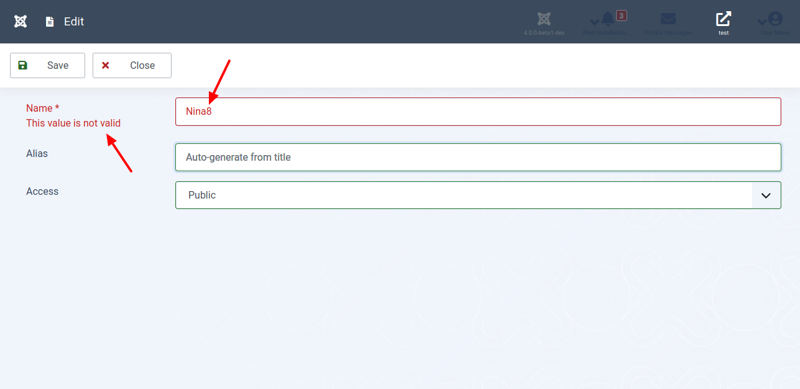

Unser Ziel in diesem Teil: Wenn wir eine Zahl in das Namensfeld eingeben, wird unmittelbar nach dem Verlassen des Feldes eine Fehlermeldung angezeigt. Bei der serverseitigen Überprüfung wurde die Meldung erst ausgegeben, nachdem das Formular über die Schaltfläche Speichern an den Server gesendet wurde.

In der clientseitigen Validierung bieten Sie eine bessere Benutzererfahrung, indem Sie schnell auf Browserebene reagieren. Hier werden alle Benutzereingaben im Browser des Benutzers selbst validiert. Für die clientseitige Validierung ist keine Rückfrage beim Server erforderlich, so das der und das Netzwerk entlastet werden. Diese Art der Überprüfung arbeitet auf der Browserseite mithilfe von Skriptsprachen wie JavaScript oder mit HTML5-Attributen.

Wenn der Benutzer beispielsweise ein ungültiges E-Mail-Format eingibt, geben Sie unmittelbar vor dem Wechsel zum nächsten Feld eine Fehlermeldung aus. So ist eine Korrektur möglich, bevor er das Formular sendet.

Meistens hängt die clientseitige Validierung davon ab, dass im Browser JavaScript aktiviert ist. Bei deaktiviertem JavaScript werden Benutzer-Eingaben ungeprüft zum Server gesandt. Es ist möglich, dass dies bösartige Daten sind! Daher schützt die clientseitige Validierung die Nutzer deiner Komponente nicht sicher vor böswilligen Angriffen.

> Da beide Validierungsmethoden (Server und Client) ihre eigene Bedeutung haben, wird empfohlen sie gleichzeitig zu verwenden. Die serverseitige Validierung ist sicherer. Die Clientseitige benutzerfreundlicher!

Dieser Teil behandelt die die clientseitige Validierung in Joomla! 4.

## Für Ungeduldige

Sieh dir den geänderten Programmcode in der [Diff-Ansicht](https://github.com/astridx/boilerplate/compare/t11b...t12a) an und übernimm diese Änderungen in deine Entwicklungsversion.

Eine ausführlichere Erklärung des geänderten Programmcodes findest du weiter unten.

## Teste deine Joomla-Komponente

1. Installiere deine Komponente in Joomla! Version 4, um sie zu testen:

Kopiere die Dateien im `administrator` Ordner in den `administrator` Ordner deiner Joomla! 4 Installation.  
Kopiere die Dateien im `components` Ordner in den `components` Ordner deiner Joomla! 4 Installation.  
Kopiere die Dateien im `media` Ordner in den `media` Ordner deiner Joomla! 4 Installation.

Eine neue Installation ist nicht erforderlich. Verwende die aus dem vorhergehenden Teil weiter.

2. Öffne die Ansicht deiner Komponente im Administrationsbereich und erstelle ein neues Item oder editiere ein vorhandenes. Gib im Textfeld für den Titel dabei eine Zahl ein.

3. Editiere danach ein anderes Feld, setze zum Beispiel den Zugriff auf `Registered`.

4. Überzeuge dich davon, dass dir zu diesem Zeitpunkt **eine** Warnung angezeigt wird.

## Geänderte Dateien

### Übersicht

      

    

        Files changed (3)
        <a class="d2h-file-switch d2h-hide">hide</a>
        <a class="d2h-file-switch d2h-show">show</a>
    

    <ol class="d2h-file-list">
    <li class="d2h-file-list-line">
    
      <svg aria-hidden="true" class="d2h-icon d2h-changed" height="16" title="modified" version="1.1"
           viewBox="0 0 14 16" width="14">
          <path d="M13 1H1C0.45 1 0 1.45 0 2v12c0 0.55 0.45 1 1 1h12c0.55 0 1-0.45 1-1V2c0-0.55-0.45-1-1-1z m0 13H1V2h12v12zM4 8c0-1.66 1.34-3 3-3s3 1.34 3 3-1.34 3-3 3-3-1.34-3-3z"></path>
      </svg>      <a href="#d2h-861015" class="d2h-file-name">src/administrator/components/com_foos/forms/foo.xml</a>
      
          +1
          -0
      
    
</li>
<li class="d2h-file-list-line">
    
      <svg aria-hidden="true" class="d2h-icon d2h-changed" height="16" title="modified" version="1.1"
           viewBox="0 0 14 16" width="14">
          <path d="M13 1H1C0.45 1 0 1.45 0 2v12c0 0.55 0.45 1 1 1h12c0.55 0 1-0.45 1-1V2c0-0.55-0.45-1-1-1z m0 13H1V2h12v12zM4 8c0-1.66 1.34-3 3-3s3 1.34 3 3-1.34 3-3 3-3-1.34-3-3z"></path>
      </svg>      <a href="#d2h-426783" class="d2h-file-name">src/administrator/components/com_foos/tmpl/foo/edit.php</a>
      
          +3
          -0
      
    
</li>
<li class="d2h-file-list-line">
    
      <svg aria-hidden="true" class="d2h-icon d2h-added" height="16" title="added" version="1.1" viewBox="0 0 14 16"
           width="14">
          <path d="M13 1H1C0.45 1 0 1.45 0 2v12c0 0.55 0.45 1 1 1h12c0.55 0 1-0.45 1-1V2c0-0.55-0.45-1-1-1z m0 13H1V2h12v12zM6 9H3V7h3V4h2v3h3v2H8v3H6V9z"></path>
      </svg>      <a href="#d2h-700967" class="d2h-file-name">src/media/com_foos/js/admin-foos-letter.js</a>
      
          +19
          -0
      
    
</li>
    </ol>

    

    

    
    <svg aria-hidden="true" class="d2h-icon" height="16" version="1.1" viewBox="0 0 12 16" width="12">
        <path d="M6 5H2v-1h4v1zM2 8h7v-1H2v1z m0 2h7v-1H2v1z m0 2h7v-1H2v1z m10-7.5v9.5c0 0.55-0.45 1-1 1H1c-0.55 0-1-0.45-1-1V2c0-0.55 0.45-1 1-1h7.5l3.5 3.5z m-1 0.5L8 2H1v12h10V5z"></path>
    </svg>    src/administrator/components/com_foos/forms/foo.xml
    CHANGED
    

    

        

            <table class="d2h-diff-table">
                <tbody class="d2h-diff-tbody">
                <tr>
    <td class="d2h-code-linenumber d2h-info"></td>
    <td class="d2h-info">
        
@@ -14,6 +14,7 @@

    </td>
</tr><tr>
    <td class="d2h-code-linenumber d2h-cntx">
      
14

14

    </td>
    <td class="d2h-cntx">
        

            &nbsp;
            			name=&quot;name&quot;
        

    </td>
</tr><tr>
    <td class="d2h-code-linenumber d2h-cntx">
      
15

15

    </td>
    <td class="d2h-cntx">
        

            &nbsp;
            			type=&quot;text&quot;
        

    </td>
</tr><tr>
    <td class="d2h-code-linenumber d2h-cntx">
      
16

16

    </td>
    <td class="d2h-cntx">
        

            &nbsp;
            			validate=&quot;Letter&quot;
        

    </td>
</tr><tr>
    <td class="d2h-code-linenumber d2h-ins">
      

17

    </td>
    <td class="d2h-ins">
        

            +
            			class=&quot;validate-letter&quot;
        

    </td>
</tr><tr>
    <td class="d2h-code-linenumber d2h-cntx">
      
17

18

    </td>
    <td class="d2h-cntx">
        

            &nbsp;
            			label=&quot;COM_FOOS_FIELD_NAME_LABEL&quot;
        

    </td>
</tr><tr>
    <td class="d2h-code-linenumber d2h-cntx">
      
18

19

    </td>
    <td class="d2h-cntx">
        

            &nbsp;
            			size=&quot;40&quot;
        

    </td>
</tr><tr>
    <td class="d2h-code-linenumber d2h-cntx">
      
19

20

    </td>
    <td class="d2h-cntx">
        

            &nbsp;
            			required=&quot;true&quot;
        

    </td>
</tr>
                </tbody>
            </table>
        

    

    

    
    <svg aria-hidden="true" class="d2h-icon" height="16" version="1.1" viewBox="0 0 12 16" width="12">
        <path d="M6 5H2v-1h4v1zM2 8h7v-1H2v1z m0 2h7v-1H2v1z m0 2h7v-1H2v1z m10-7.5v9.5c0 0.55-0.45 1-1 1H1c-0.55 0-1-0.45-1-1V2c0-0.55 0.45-1 1-1h7.5l3.5 3.5z m-1 0.5L8 2H1v12h10V5z"></path>
    </svg>    src/administrator/components/com_foos/tmpl/foo/edit.php
    CHANGED
    

    

        

            <table class="d2h-diff-table">
                <tbody class="d2h-diff-tbody">
                <tr>
    <td class="d2h-code-linenumber d2h-info"></td>
    <td class="d2h-info">
        
@@ -13,6 +13,9 @@ use Joomla\CMS\Factory;

    </td>
</tr><tr>
    <td class="d2h-code-linenumber d2h-cntx">
      
13

13

    </td>
    <td class="d2h-cntx">
        

            &nbsp;
            use Joomla\CMS\HTML\HTMLHelper;
        

    </td>
</tr><tr>
    <td class="d2h-code-linenumber d2h-cntx">
      
14

14

    </td>
    <td class="d2h-cntx">
        

            &nbsp;
            use Joomla\CMS\Router\Route;
        

    </td>
</tr><tr>
    <td class="d2h-code-linenumber d2h-cntx">
      
15

15

    </td>
    <td class="d2h-cntx">
        

            &nbsp;
        

    </td>
</tr><tr>
    <td class="d2h-code-linenumber d2h-ins">
      

16

    </td>
    <td class="d2h-ins">
        

            +
            HTMLHelper::_(&#x27;behavior.formvalidator&#x27;);
        

    </td>
</tr><tr>
    <td class="d2h-code-linenumber d2h-ins">
      

17

    </td>
    <td class="d2h-ins">
        

            +
            HTMLHelper::_(&#x27;script&#x27;, &#x27;com_foos&#x2F;admin-foos-letter.js&#x27;, array(&#x27;version&#x27; =&gt; &#x27;auto&#x27;, &#x27;relative&#x27; =&gt; true));
        

    </td>
</tr><tr>
    <td class="d2h-code-linenumber d2h-ins">
      

18

    </td>
    <td class="d2h-ins">
        

            +
        

    </td>
</tr><tr>
    <td class="d2h-code-linenumber d2h-cntx">
      
16

19

    </td>
    <td class="d2h-cntx">
        

            &nbsp;
            $app = Factory::getApplication();
        

    </td>
</tr><tr>
    <td class="d2h-code-linenumber d2h-cntx">
      
17

20

    </td>
    <td class="d2h-cntx">
        

            &nbsp;
            $input = $app-&gt;input;
        

    </td>
</tr><tr>
    <td class="d2h-code-linenumber d2h-cntx">
      
18

21

    </td>
    <td class="d2h-cntx">
        

            &nbsp;
        

    </td>
</tr>
                </tbody>
            </table>
        

    

    

    
    <svg aria-hidden="true" class="d2h-icon" height="16" version="1.1" viewBox="0 0 12 16" width="12">
        <path d="M6 5H2v-1h4v1zM2 8h7v-1H2v1z m0 2h7v-1H2v1z m0 2h7v-1H2v1z m10-7.5v9.5c0 0.55-0.45 1-1 1H1c-0.55 0-1-0.45-1-1V2c0-0.55 0.45-1 1-1h7.5l3.5 3.5z m-1 0.5L8 2H1v12h10V5z"></path>
    </svg>    src/media/com_foos/js/admin-foos-letter.js
    ADDED
    

    

        

            <table class="d2h-diff-table">
                <tbody class="d2h-diff-tbody">
                <tr>
    <td class="d2h-code-linenumber d2h-info"></td>
    <td class="d2h-info">
        
@@ -0,0 +1,19 @@

    </td>
</tr><tr>
    <td class="d2h-code-linenumber d2h-ins">
      

1

    </td>
    <td class="d2h-ins">
        

            +
            document.addEventListener(&#x27;DOMContentLoaded&#x27;, function(){
        

    </td>
</tr><tr>
    <td class="d2h-code-linenumber d2h-ins">
      

2

    </td>
    <td class="d2h-ins">
        

            +
            	&quot;use strict&quot;;
        

    </td>
</tr><tr>
    <td class="d2h-code-linenumber d2h-ins">
      

3

    </td>
    <td class="d2h-ins">
        

            +
            	setTimeout(function() {
        

    </td>
</tr><tr>
    <td class="d2h-code-linenumber d2h-ins">
      

4

    </td>
    <td class="d2h-ins">
        

            +
            		if (document.formvalidator) {
        

    </td>
</tr><tr>
    <td class="d2h-code-linenumber d2h-ins">
      

5

    </td>
    <td class="d2h-ins">
        

            +
            			document.formvalidator.setHandler(&#x27;letter&#x27;, function (value) {
        

    </td>
</tr><tr>
    <td class="d2h-code-linenumber d2h-ins">
      

6

    </td>
    <td class="d2h-ins">
        

            +
        

    </td>
</tr><tr>
    <td class="d2h-code-linenumber d2h-ins">
      

7

    </td>
    <td class="d2h-ins">
        

            +
            				var returnedValue = false;
        

    </td>
</tr><tr>
    <td class="d2h-code-linenumber d2h-ins">
      

8

    </td>
    <td class="d2h-ins">
        

            +
        

    </td>
</tr><tr>
    <td class="d2h-code-linenumber d2h-ins">
      

9

    </td>
    <td class="d2h-ins">
        

            +
            				var regex = &#x2F;^([a-z]+)$&#x2F;i;
        

    </td>
</tr><tr>
    <td class="d2h-code-linenumber d2h-ins">
      

10

    </td>
    <td class="d2h-ins">
        

            +
        

    </td>
</tr><tr>
    <td class="d2h-code-linenumber d2h-ins">
      

11

    </td>
    <td class="d2h-ins">
        

            +
            				if (regex.test(value))
        

    </td>
</tr><tr>
    <td class="d2h-code-linenumber d2h-ins">
      

12

    </td>
    <td class="d2h-ins">
        

            +
            					returnedValue = true;
        

    </td>
</tr><tr>
    <td class="d2h-code-linenumber d2h-ins">
      

13

    </td>
    <td class="d2h-ins">
        

            +
        

    </td>
</tr><tr>
    <td class="d2h-code-linenumber d2h-ins">
      

14

    </td>
    <td class="d2h-ins">
        

            +
            				return returnedValue;
        

    </td>
</tr><tr>
    <td class="d2h-code-linenumber d2h-ins">
      

15

    </td>
    <td class="d2h-ins">
        

            +
            			});
        

    </td>
</tr><tr>
    <td class="d2h-code-linenumber d2h-ins">
      

16

    </td>
    <td class="d2h-ins">
        

            +
            			&#x2F;&#x2F;console.log(document.formvalidator);
        

    </td>
</tr><tr>
    <td class="d2h-code-linenumber d2h-ins">
      

17

    </td>
    <td class="d2h-ins">
        

            +
            		}
        

    </td>
</tr><tr>
    <td class="d2h-code-linenumber d2h-ins">
      

18

    </td>
    <td class="d2h-ins">
        

            +
            	}, (1000));
        

    </td>
</tr><tr>
    <td class="d2h-code-linenumber d2h-ins">
      

19

    </td>
    <td class="d2h-ins">
        

            +
            });
        

    </td>
</tr>
                </tbody>
            </table>
        

    

    

