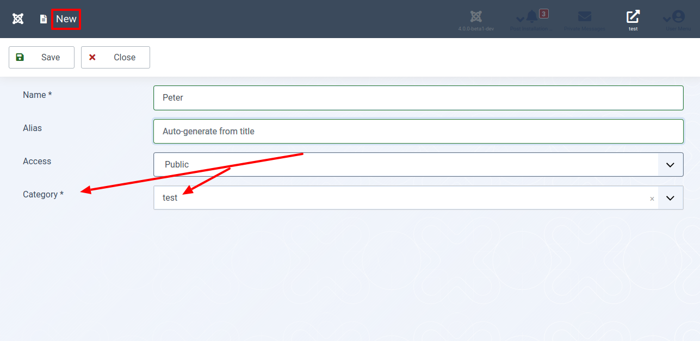

Fast jede Website teilt ihre Inhalte in Kategorien ein. Joomla! bietet dieses nützliche Feature ebenfalls. Der aktuelle Teil des Tutorials zeigt dir, wie du Kategorien idealerweise in eine Joomla! Komponente integrierst. Erfinde das Rad nicht selbst neu. Nutze das, was Joomla! dir bietet.

## Für Ungeduldige

Sieh dir den geänderten Programmcode in der [Diff-Ansicht](https://github.com/astridx/boilerplate/compare/t12a...t12b) an und übernimm diese Änderungen in deine Entwicklungsversion.

Eine ausführlichere Erklärung des geänderten Programmcodes findest du weiter unten.

## Teste deine Joomla-Komponente

1. Installiere deine Komponente in Joomla! Version 4, um sie zu testen:

Kopiere die Dateien im `administrator` Ordner in den `administrator` Ordner deiner Joomla! 4 Installation.  
Kopiere die Dateien im `components` Ordner in den `components` Ordner deiner Joomla! 4 Installation.  
Kopiere die Dateien im `media` Ordner in den `media` Ordner deiner Joomla! 4 Installation.

Installiere deine Komponenten wie in Teil eins beschrieben, nachdem du alle Dateien kopiert hast. Joomla! aktualisiert bei der Installation die Datenbank für dich.

2. Öffne die Ansicht deiner Komponenten im Administrationsbereich.

3. In der Seitenleiste siehst du einen neuen Menüpunkt. Dieser bietet dir alles, was du zum Anlegen und Bearbeiten der Kategorien deiner Komponente benötigst.

4. Öffne als Nächstes ein Element. Überzeuge dich davon, dass es möglich ist, diesem eine Kategorie zuzuordnen.

Die Kategorien helfen dir, im Frontend deine Daten strukturiert anzuzeigen. Die Ansichten erstellen wir im weiteren Verlauf dieser Artikelserie.

## Geänderte Dateien

### Übersicht

      

    

        Files changed (11)
        <a class="d2h-file-switch d2h-hide">hide</a>
        <a class="d2h-file-switch d2h-show">show</a>
    

    <ol class="d2h-file-list">
    <li class="d2h-file-list-line">
    
      <svg aria-hidden="true" class="d2h-icon d2h-changed" height="16" title="modified" version="1.1"
           viewBox="0 0 14 16" width="14">
          <path d="M13 1H1C0.45 1 0 1.45 0 2v12c0 0.55 0.45 1 1 1h12c0.55 0 1-0.45 1-1V2c0-0.55-0.45-1-1-1z m0 13H1V2h12v12zM4 8c0-1.66 1.34-3 3-3s3 1.34 3 3-1.34 3-3 3-3-1.34-3-3z"></path>
      </svg>      <a href="#d2h-416443" class="d2h-file-name">src/administrator/components/com_foos/access.xml</a>
      
          +8
          -0
      
    
</li>
<li class="d2h-file-list-line">
    
      <svg aria-hidden="true" class="d2h-icon d2h-changed" height="16" title="modified" version="1.1"
           viewBox="0 0 14 16" width="14">
          <path d="M13 1H1C0.45 1 0 1.45 0 2v12c0 0.55 0.45 1 1 1h12c0.55 0 1-0.45 1-1V2c0-0.55-0.45-1-1-1z m0 13H1V2h12v12zM4 8c0-1.66 1.34-3 3-3s3 1.34 3 3-1.34 3-3 3-3-1.34-3-3z"></path>
      </svg>      <a href="#d2h-863218" class="d2h-file-name">src/administrator/components/com_foos/foos.xml</a>
      
          +2
          -0
      
    
</li>
<li class="d2h-file-list-line">
    
      <svg aria-hidden="true" class="d2h-icon d2h-changed" height="16" title="modified" version="1.1"
           viewBox="0 0 14 16" width="14">
          <path d="M13 1H1C0.45 1 0 1.45 0 2v12c0 0.55 0.45 1 1 1h12c0.55 0 1-0.45 1-1V2c0-0.55-0.45-1-1-1z m0 13H1V2h12v12zM4 8c0-1.66 1.34-3 3-3s3 1.34 3 3-1.34 3-3 3-3-1.34-3-3z"></path>
      </svg>      <a href="#d2h-861015" class="d2h-file-name">src/administrator/components/com_foos/forms/foo.xml</a>
      
          +10
          -0
      
    
</li>
<li class="d2h-file-list-line">
    
      <svg aria-hidden="true" class="d2h-icon d2h-changed" height="16" title="modified" version="1.1"
           viewBox="0 0 14 16" width="14">
          <path d="M13 1H1C0.45 1 0 1.45 0 2v12c0 0.55 0.45 1 1 1h12c0.55 0 1-0.45 1-1V2c0-0.55-0.45-1-1-1z m0 13H1V2h12v12zM4 8c0-1.66 1.34-3 3-3s3 1.34 3 3-1.34 3-3 3-3-1.34-3-3z"></path>
      </svg>      <a href="#d2h-734669" class="d2h-file-name">src/administrator/components/com_foos/script.php</a>
      
          +88
          -0
      
    
</li>
<li class="d2h-file-list-line">
    
      <svg aria-hidden="true" class="d2h-icon d2h-changed" height="16" title="modified" version="1.1"
           viewBox="0 0 14 16" width="14">
          <path d="M13 1H1C0.45 1 0 1.45 0 2v12c0 0.55 0.45 1 1 1h12c0.55 0 1-0.45 1-1V2c0-0.55-0.45-1-1-1z m0 13H1V2h12v12zM4 8c0-1.66 1.34-3 3-3s3 1.34 3 3-1.34 3-3 3-3-1.34-3-3z"></path>
      </svg>      <a href="#d2h-591404" class="d2h-file-name">src/administrator/components/com_foos/services/provider.php</a>
      
          +2
          -0
      
    
</li>
<li class="d2h-file-list-line">
    
      <svg aria-hidden="true" class="d2h-icon d2h-changed" height="16" title="modified" version="1.1"
           viewBox="0 0 14 16" width="14">
          <path d="M13 1H1C0.45 1 0 1.45 0 2v12c0 0.55 0.45 1 1 1h12c0.55 0 1-0.45 1-1V2c0-0.55-0.45-1-1-1z m0 13H1V2h12v12zM4 8c0-1.66 1.34-3 3-3s3 1.34 3 3-1.34 3-3 3-3-1.34-3-3z"></path>
      </svg>      <a href="#d2h-929815" class="d2h-file-name">src/administrator/components/com_foos/sql/install.mysql.utf8.sql</a>
      
          +2
          -0
      
    
</li>
<li class="d2h-file-list-line">
    
      <svg aria-hidden="true" class="d2h-icon d2h-added" height="16" title="added" version="1.1" viewBox="0 0 14 16"
           width="14">
          <path d="M13 1H1C0.45 1 0 1.45 0 2v12c0 0.55 0.45 1 1 1h12c0.55 0 1-0.45 1-1V2c0-0.55-0.45-1-1-1z m0 13H1V2h12v12zM6 9H3V7h3V4h2v3h3v2H8v3H6V9z"></path>
      </svg>      <a href="#d2h-910192" class="d2h-file-name">src/administrator/components/com_foos/sql/updates/mysql/12.0.0.sql</a>
      
          +5
          -0
      
    
</li>
<li class="d2h-file-list-line">
    
      <svg aria-hidden="true" class="d2h-icon d2h-changed" height="16" title="modified" version="1.1"
           viewBox="0 0 14 16" width="14">
          <path d="M13 1H1C0.45 1 0 1.45 0 2v12c0 0.55 0.45 1 1 1h12c0.55 0 1-0.45 1-1V2c0-0.55-0.45-1-1-1z m0 13H1V2h12v12zM4 8c0-1.66 1.34-3 3-3s3 1.34 3 3-1.34 3-3 3-3-1.34-3-3z"></path>
      </svg>      <a href="#d2h-640935" class="d2h-file-name">src/administrator/components/com_foos/src/Extension/FoosComponent.php</a>
      
          +45
          -0
      
    
</li>
<li class="d2h-file-list-line">
    
      <svg aria-hidden="true" class="d2h-icon d2h-changed" height="16" title="modified" version="1.1"
           viewBox="0 0 14 16" width="14">
          <path d="M13 1H1C0.45 1 0 1.45 0 2v12c0 0.55 0.45 1 1 1h12c0.55 0 1-0.45 1-1V2c0-0.55-0.45-1-1-1z m0 13H1V2h12v12zM4 8c0-1.66 1.34-3 3-3s3 1.34 3 3-1.34 3-3 3-3-1.34-3-3z"></path>
      </svg>      <a href="#d2h-841411" class="d2h-file-name">src/administrator/components/com_foos/src/Model/FoosModel.php</a>
      
          +8
          -1
      
    
</li>
<li class="d2h-file-list-line">
    
      <svg aria-hidden="true" class="d2h-icon d2h-changed" height="16" title="modified" version="1.1"
           viewBox="0 0 14 16" width="14">
          <path d="M13 1H1C0.45 1 0 1.45 0 2v12c0 0.55 0.45 1 1 1h12c0.55 0 1-0.45 1-1V2c0-0.55-0.45-1-1-1z m0 13H1V2h12v12zM4 8c0-1.66 1.34-3 3-3s3 1.34 3 3-1.34 3-3 3-3-1.34-3-3z"></path>
      </svg>      <a href="#d2h-426783" class="d2h-file-name">src/administrator/components/com_foos/tmpl/foo/edit.php</a>
      
          +1
          -0
      
    
</li>
<li class="d2h-file-list-line">
    
      <svg aria-hidden="true" class="d2h-icon d2h-changed" height="16" title="modified" version="1.1"
           viewBox="0 0 14 16" width="14">
          <path d="M13 1H1C0.45 1 0 1.45 0 2v12c0 0.55 0.45 1 1 1h12c0.55 0 1-0.45 1-1V2c0-0.55-0.45-1-1-1z m0 13H1V2h12v12zM4 8c0-1.66 1.34-3 3-3s3 1.34 3 3-1.34 3-3 3-3-1.34-3-3z"></path>
      </svg>      <a href="#d2h-900341" class="d2h-file-name">src/administrator/components/com_foos/tmpl/foos/default.php</a>
      
          +3
          -0
      
    
</li>
    </ol>

    

    

    
    <svg aria-hidden="true" class="d2h-icon" height="16" version="1.1" viewBox="0 0 12 16" width="12">
        <path d="M6 5H2v-1h4v1zM2 8h7v-1H2v1z m0 2h7v-1H2v1z m0 2h7v-1H2v1z m10-7.5v9.5c0 0.55-0.45 1-1 1H1c-0.55 0-1-0.45-1-1V2c0-0.55 0.45-1 1-1h7.5l3.5 3.5z m-1 0.5L8 2H1v12h10V5z"></path>
    </svg>    src/administrator/components/com_foos/access.xml
    CHANGED
    

    

        

            <table class="d2h-diff-table">
                <tbody class="d2h-diff-tbody">
                <tr>
    <td class="d2h-code-linenumber d2h-info"></td>
    <td class="d2h-info">
        
@@ -9,5 +9,13 @@

    </td>
</tr><tr>
    <td class="d2h-code-linenumber d2h-cntx">
      
9

9

    </td>
    <td class="d2h-cntx">
        

            &nbsp;
            		&lt;action name=&quot;core.edit&quot; title=&quot;JACTION_EDIT&quot; &#x2F;&gt;
        

    </td>
</tr><tr>
    <td class="d2h-code-linenumber d2h-cntx">
      
10

10

    </td>
    <td class="d2h-cntx">
        

            &nbsp;
            		&lt;action name=&quot;core.edit.state&quot; title=&quot;JACTION_EDITSTATE&quot; &#x2F;&gt;
        

    </td>
</tr><tr>
    <td class="d2h-code-linenumber d2h-cntx">
      
11

11

    </td>
    <td class="d2h-cntx">
        

            &nbsp;
            		&lt;action name=&quot;core.edit.own&quot; title=&quot;JACTION_EDITOWN&quot; &#x2F;&gt;
        

    </td>
</tr><tr>
    <td class="d2h-code-linenumber d2h-ins">
      

12

    </td>
    <td class="d2h-ins">
        

            +
            		&lt;action name=&quot;core.edit.value&quot; title=&quot;JACTION_EDITVALUE&quot; &#x2F;&gt;
        

    </td>
</tr><tr>
    <td class="d2h-code-linenumber d2h-ins">
      

13

    </td>
    <td class="d2h-ins">
        

            +
            	&lt;&#x2F;section&gt;
        

    </td>
</tr><tr>
    <td class="d2h-code-linenumber d2h-ins">
      

14

    </td>
    <td class="d2h-ins">
        

            +
            	&lt;section name=&quot;category&quot;&gt;
        

    </td>
</tr><tr>
    <td class="d2h-code-linenumber d2h-ins">
      

15

    </td>
    <td class="d2h-ins">
        

            +
            		&lt;action name=&quot;core.create&quot; title=&quot;JACTION_CREATE&quot; &#x2F;&gt;
        

    </td>
</tr><tr>
    <td class="d2h-code-linenumber d2h-ins">
      

16

    </td>
    <td class="d2h-ins">
        

            +
            		&lt;action name=&quot;core.delete&quot; title=&quot;JACTION_DELETE&quot; &#x2F;&gt;
        

    </td>
</tr><tr>
    <td class="d2h-code-linenumber d2h-ins">
      

17

    </td>
    <td class="d2h-ins">
        

            +
            		&lt;action name=&quot;core.edit&quot; title=&quot;JACTION_EDIT&quot; &#x2F;&gt;
        

    </td>
</tr><tr>
    <td class="d2h-code-linenumber d2h-ins">
      

18

    </td>
    <td class="d2h-ins">
        

            +
            		&lt;action name=&quot;core.edit.state&quot; title=&quot;JACTION_EDITSTATE&quot; &#x2F;&gt;
        

    </td>
</tr><tr>
    <td class="d2h-code-linenumber d2h-ins">
      

19

    </td>
    <td class="d2h-ins">
        

            +
            		&lt;action name=&quot;core.edit.own&quot; title=&quot;JACTION_EDITOWN&quot; &#x2F;&gt;
        

    </td>
</tr><tr>
    <td class="d2h-code-linenumber d2h-cntx">
      
12

20

    </td>
    <td class="d2h-cntx">
        

            &nbsp;
            	&lt;&#x2F;section&gt;
        

    </td>
</tr><tr>
    <td class="d2h-code-linenumber d2h-cntx">
      
13

21

    </td>
    <td class="d2h-cntx">
        

            &nbsp;
            &lt;&#x2F;access&gt;
        

    </td>
</tr>
                </tbody>
            </table>
        

    

    

    
    <svg aria-hidden="true" class="d2h-icon" height="16" version="1.1" viewBox="0 0 12 16" width="12">
        <path d="M6 5H2v-1h4v1zM2 8h7v-1H2v1z m0 2h7v-1H2v1z m0 2h7v-1H2v1z m10-7.5v9.5c0 0.55-0.45 1-1 1H1c-0.55 0-1-0.45-1-1V2c0-0.55 0.45-1 1-1h7.5l3.5 3.5z m-1 0.5L8 2H1v12h10V5z"></path>
    </svg>    src/administrator/components/com_foos/foos.xml
    CHANGED
    

    

        

            <table class="d2h-diff-table">
                <tbody class="d2h-diff-tbody">
                <tr>
    <td class="d2h-code-linenumber d2h-info"></td>
    <td class="d2h-info">
        
@@ -41,6 +41,8 @@

    </td>
</tr><tr>
    <td class="d2h-code-linenumber d2h-cntx">
      
41

41

    </td>
    <td class="d2h-cntx">
        

            &nbsp;
            		&lt;menu view=&quot;foos&quot;&gt;COM_FOOS&lt;&#x2F;menu&gt;
        

    </td>
</tr><tr>
    <td class="d2h-code-linenumber d2h-cntx">
      
42

42

    </td>
    <td class="d2h-cntx">
        

            &nbsp;
            		&lt;submenu&gt;
        

    </td>
</tr><tr>
    <td class="d2h-code-linenumber d2h-cntx">
      
43

43

    </td>
    <td class="d2h-cntx">
        

            &nbsp;
            			&lt;menu link=&quot;option=com_foos&quot;&gt;COM_FOOS&lt;&#x2F;menu&gt;
        

    </td>
</tr><tr>
    <td class="d2h-code-linenumber d2h-ins">
      

44

    </td>
    <td class="d2h-ins">
        

            +
            			&lt;menu link=&quot;option=com_categories&amp;amp;extension=com_foos&quot;
        

    </td>
</tr><tr>
    <td class="d2h-code-linenumber d2h-ins">
      

45

    </td>
    <td class="d2h-ins">
        

            +
            				view=&quot;categories&quot; img=&quot;class:foos-cat&quot; alt=&quot;Foos&#x2F;Categories&quot;&gt;JCATEGORY&lt;&#x2F;menu&gt;
        

    </td>
</tr><tr>
    <td class="d2h-code-linenumber d2h-cntx">
      
44

46

    </td>
    <td class="d2h-cntx">
        

            &nbsp;
            		&lt;&#x2F;submenu&gt;
        

    </td>
</tr><tr>
    <td class="d2h-code-linenumber d2h-cntx">
      
45

47

    </td>
    <td class="d2h-cntx">
        

            &nbsp;
            		&lt;files folder=&quot;administrator&#x2F;components&#x2F;com_foos&quot;&gt;
        

    </td>
</tr><tr>
    <td class="d2h-code-linenumber d2h-cntx">
      
46

48

    </td>
    <td class="d2h-cntx">
        

            &nbsp;
            			&lt;filename&gt;access.xml&lt;&#x2F;filename&gt;
        

    </td>
</tr>
                </tbody>
            </table>
        

    

    

    
    <svg aria-hidden="true" class="d2h-icon" height="16" version="1.1" viewBox="0 0 12 16" width="12">
        <path d="M6 5H2v-1h4v1zM2 8h7v-1H2v1z m0 2h7v-1H2v1z m0 2h7v-1H2v1z m10-7.5v9.5c0 0.55-0.45 1-1 1H1c-0.55 0-1-0.45-1-1V2c0-0.55 0.45-1 1-1h7.5l3.5 3.5z m-1 0.5L8 2H1v12h10V5z"></path>
    </svg>    src/administrator/components/com_foos/forms/foo.xml
    CHANGED
    

    

        

            <table class="d2h-diff-table">
                <tbody class="d2h-diff-tbody">
                <tr>
    <td class="d2h-code-linenumber d2h-info"></td>
    <td class="d2h-info">
        
@@ -28,6 +28,16 @@

    </td>
</tr><tr>
    <td class="d2h-code-linenumber d2h-cntx">
      
28

28

    </td>
    <td class="d2h-cntx">
        

            &nbsp;
            			hint=&quot;JFIELD_ALIAS_PLACEHOLDER&quot;
        

    </td>
</tr><tr>
    <td class="d2h-code-linenumber d2h-cntx">
      
29

29

    </td>
    <td class="d2h-cntx">
        

            &nbsp;
            		&#x2F;&gt;
        

    </td>
</tr><tr>
    <td class="d2h-code-linenumber d2h-cntx">
      
30

30

    </td>
    <td class="d2h-cntx">
        

            &nbsp;
        

    </td>
</tr><tr>
    <td class="d2h-code-linenumber d2h-ins">
      

31

    </td>
    <td class="d2h-ins">
        

            +
            		&lt;field
        

    </td>
</tr><tr>
    <td class="d2h-code-linenumber d2h-ins">
      

32

    </td>
    <td class="d2h-ins">
        

            +
            			name=&quot;catid&quot;
        

    </td>
</tr><tr>
    <td class="d2h-code-linenumber d2h-ins">
      

33

    </td>
    <td class="d2h-ins">
        

            +
            			type=&quot;categoryedit&quot;
        

    </td>
</tr><tr>
    <td class="d2h-code-linenumber d2h-ins">
      

34

    </td>
    <td class="d2h-ins">
        

            +
            			label=&quot;JCATEGORY&quot;
        

    </td>
</tr><tr>
    <td class="d2h-code-linenumber d2h-ins">
      

35

    </td>
    <td class="d2h-ins">
        

            +
            			extension=&quot;com_foos&quot;
        

    </td>
</tr><tr>
    <td class="d2h-code-linenumber d2h-ins">
      

36

    </td>
    <td class="d2h-ins">
        

            +
            			addfieldprefix=&quot;Joomla\Component\Categories\Administrator\Field&quot;
        

    </td>
</tr><tr>
    <td class="d2h-code-linenumber d2h-ins">
      

37

    </td>
    <td class="d2h-ins">
        

            +
            			required=&quot;true&quot;
        

    </td>
</tr><tr>
    <td class="d2h-code-linenumber d2h-ins">
      

38

    </td>
    <td class="d2h-ins">
        

            +
            			default=&quot;&quot;
        

    </td>
</tr><tr>
    <td class="d2h-code-linenumber d2h-ins">
      

39

    </td>
    <td class="d2h-ins">
        

            +
            		&#x2F;&gt;
        

    </td>
</tr><tr>
    <td class="d2h-code-linenumber d2h-ins">
      

40

    </td>
    <td class="d2h-ins">
        

            +
        

    </td>
</tr><tr>
    <td class="d2h-code-linenumber d2h-cntx">
      
31

41

    </td>
    <td class="d2h-cntx">
        

            &nbsp;
            		&lt;field
        

    </td>
</tr><tr>
    <td class="d2h-code-linenumber d2h-cntx">
      
32

42

    </td>
    <td class="d2h-cntx">
        

            &nbsp;
            			name=&quot;access&quot;
        

    </td>
</tr><tr>
    <td class="d2h-code-linenumber d2h-cntx">
      
33

43

    </td>
    <td class="d2h-cntx">
        

            &nbsp;
            			type=&quot;accesslevel&quot;
        

    </td>
</tr>
                </tbody>
            </table>
        

    

    

    
    <svg aria-hidden="true" class="d2h-icon" height="16" version="1.1" viewBox="0 0 12 16" width="12">
        <path d="M6 5H2v-1h4v1zM2 8h7v-1H2v1z m0 2h7v-1H2v1z m0 2h7v-1H2v1z m10-7.5v9.5c0 0.55-0.45 1-1 1H1c-0.55 0-1-0.45-1-1V2c0-0.55 0.45-1 1-1h7.5l3.5 3.5z m-1 0.5L8 2H1v12h10V5z"></path>
    </svg>    src/administrator/components/com_foos/script.php
    CHANGED
    

    

        

            <table class="d2h-diff-table">
                <tbody class="d2h-diff-tbody">
                <tr>
    <td class="d2h-code-linenumber d2h-info"></td>
    <td class="d2h-info">
        
@@ -7,9 +7,11 @@

    </td>
</tr><tr>
    <td class="d2h-code-linenumber d2h-cntx">
      
7

7

    </td>
    <td class="d2h-cntx">
        

            &nbsp;
             * @license     GNU General Public License version 2 or later; see LICENSE.txt
        

    </td>
</tr><tr>
    <td class="d2h-code-linenumber d2h-cntx">
      
8

8

    </td>
    <td class="d2h-cntx">
        

            &nbsp;
             *&#x2F;
        

    </td>
</tr><tr>
    <td class="d2h-code-linenumber d2h-cntx">
      
9

9

    </td>
    <td class="d2h-cntx">
        

            &nbsp;
            defined(&#x27;_JEXEC&#x27;) or die;
        

    </td>
</tr><tr>
    <td class="d2h-code-linenumber d2h-ins">
      

10

    </td>
    <td class="d2h-ins">
        

            +
            use Joomla\CMS\Factory;
        

    </td>
</tr><tr>
    <td class="d2h-code-linenumber d2h-cntx">
      
10

11

    </td>
    <td class="d2h-cntx">
        

            &nbsp;
            use Joomla\CMS\Installer\InstallerAdapter;
        

    </td>
</tr><tr>
    <td class="d2h-code-linenumber d2h-cntx">
      
11

12

    </td>
    <td class="d2h-cntx">
        

            &nbsp;
            use Joomla\CMS\Language\Text;
        

    </td>
</tr><tr>
    <td class="d2h-code-linenumber d2h-cntx">
      
12

13

    </td>
    <td class="d2h-cntx">
        

            &nbsp;
            use Joomla\CMS\Log\Log;
        

    </td>
</tr><tr>
    <td class="d2h-code-linenumber d2h-ins">
      

14

    </td>
    <td class="d2h-ins">
        

            +
            use Joomla\CMS\Table\Table;
        

    </td>
</tr><tr>
    <td class="d2h-code-linenumber d2h-cntx">
      
13

15

    </td>
    <td class="d2h-cntx">
        

            &nbsp;
        

    </td>
</tr><tr>
    <td class="d2h-code-linenumber d2h-cntx">
      
14

16

    </td>
    <td class="d2h-cntx">
        

            &nbsp;
            &#x2F;**
        

    </td>
</tr><tr>
    <td class="d2h-code-linenumber d2h-cntx">
      
15

17

    </td>
    <td class="d2h-cntx">
        

            &nbsp;
             * Script file of Foo Component
        

    </td>
</tr>
<tr>
    <td class="d2h-code-linenumber d2h-info"></td>
    <td class="d2h-info">
        
@@ -47,6 +49,47 @@ class Com_FoosInstallerScript

    </td>
</tr><tr>
    <td class="d2h-code-linenumber d2h-cntx">
      
47

49

    </td>
    <td class="d2h-cntx">
        

            &nbsp;
            	{
        

    </td>
</tr><tr>
    <td class="d2h-code-linenumber d2h-cntx">
      
48

50

    </td>
    <td class="d2h-cntx">
        

            &nbsp;
            		echo Text::_(&#x27;COM_FOOS_INSTALLERSCRIPT_INSTALL&#x27;);
        

    </td>
</tr><tr>
    <td class="d2h-code-linenumber d2h-cntx">
      
49

51

    </td>
    <td class="d2h-cntx">
        

            &nbsp;
        

    </td>
</tr><tr>
    <td class="d2h-code-linenumber d2h-ins">
      

52

    </td>
    <td class="d2h-ins">
        

            +
            		$db = Factory::getDbo();
        

    </td>
</tr><tr>
    <td class="d2h-code-linenumber d2h-ins">
      

53

    </td>
    <td class="d2h-ins">
        

            +
        

    </td>
</tr><tr>
    <td class="d2h-code-linenumber d2h-ins">
      

54

    </td>
    <td class="d2h-ins">
        

            +
            		&#x2F;&#x2F; Initialize a new category.
        

    </td>
</tr><tr>
    <td class="d2h-code-linenumber d2h-ins">
      

55

    </td>
    <td class="d2h-ins">
        

            +
            		$category = Table::getInstance(&#x27;Category&#x27;);
        

    </td>
</tr><tr>
    <td class="d2h-code-linenumber d2h-ins">
      

56

    </td>
    <td class="d2h-ins">
        

            +
        

    </td>
</tr><tr>
    <td class="d2h-code-linenumber d2h-ins">
      

57

    </td>
    <td class="d2h-ins">
        

            +
            		$data = array(
        

    </td>
</tr><tr>
    <td class="d2h-code-linenumber d2h-ins">
      

58

    </td>
    <td class="d2h-ins">
        

            +
            			&#x27;extension&#x27;       =&gt; &#x27;com_foos&#x27;,
        

    </td>
</tr><tr>
    <td class="d2h-code-linenumber d2h-ins">
      

59

    </td>
    <td class="d2h-ins">
        

            +
            			&#x27;title&#x27;           =&gt; &#x27;Uncategorised&#x27;,
        

    </td>
</tr><tr>
    <td class="d2h-code-linenumber d2h-ins">
      

60

    </td>
    <td class="d2h-ins">
        

            +
            			&#x27;description&#x27;     =&gt; &#x27;&#x27;,
        

    </td>
</tr><tr>
    <td class="d2h-code-linenumber d2h-ins">
      

61

    </td>
    <td class="d2h-ins">
        

            +
            			&#x27;published&#x27;       =&gt; 1,
        

    </td>
</tr><tr>
    <td class="d2h-code-linenumber d2h-ins">
      

62

    </td>
    <td class="d2h-ins">
        

            +
            			&#x27;access&#x27;          =&gt; 1,
        

    </td>
</tr><tr>
    <td class="d2h-code-linenumber d2h-ins">
      

63

    </td>
    <td class="d2h-ins">
        

            +
            			&#x27;level&#x27;           =&gt; 1,
        

    </td>
</tr><tr>
    <td class="d2h-code-linenumber d2h-ins">
      

64

    </td>
    <td class="d2h-ins">
        

            +
            			&#x27;path&#x27;            =&gt; &#x27;uncategorised&#x27;,
        

    </td>
</tr><tr>
    <td class="d2h-code-linenumber d2h-ins">
      

65

    </td>
    <td class="d2h-ins">
        

            +
            			&#x27;params&#x27;          =&gt; &#x27;{&quot;category_layout&quot;:&quot;&quot;,&quot;image&quot;:&quot;&quot;, &quot;image_alt&quot;:&quot;&quot;}&#x27;,
        

    </td>
</tr><tr>
    <td class="d2h-code-linenumber d2h-ins">
      

66

    </td>
    <td class="d2h-ins">
        

            +
            			&#x27;metadesc&#x27;        =&gt; &#x27;&#x27;,
        

    </td>
</tr><tr>
    <td class="d2h-code-linenumber d2h-ins">
      

67

    </td>
    <td class="d2h-ins">
        

            +
            			&#x27;metakey&#x27;         =&gt; &#x27;&#x27;,
        

    </td>
</tr><tr>
    <td class="d2h-code-linenumber d2h-ins">
      

68

    </td>
    <td class="d2h-ins">
        

            +
            			&#x27;metadata&#x27;        =&gt; &#x27;{&quot;author&quot;:&quot;&quot;,&quot;robots&quot;:&quot;&quot;}&#x27;,
        

    </td>
</tr><tr>
    <td class="d2h-code-linenumber d2h-ins">
      

69

    </td>
    <td class="d2h-ins">
        

            +
            			&#x27;created_time&#x27;    =&gt; Factory::getDate()-&gt;toSql(),
        

    </td>
</tr><tr>
    <td class="d2h-code-linenumber d2h-ins">
      

70

    </td>
    <td class="d2h-ins">
        

            +
            			&#x27;created_user_id&#x27; =&gt; (int) $this-&gt;getAdminId(),
        

    </td>
</tr><tr>
    <td class="d2h-code-linenumber d2h-ins">
      

71

    </td>
    <td class="d2h-ins">
        

            +
            			&#x27;rules&#x27;           =&gt; array(),
        

    </td>
</tr><tr>
    <td class="d2h-code-linenumber d2h-ins">
      

72

    </td>
    <td class="d2h-ins">
        

            +
            			&#x27;parent_id&#x27;       =&gt; 1,
        

    </td>
</tr><tr>
    <td class="d2h-code-linenumber d2h-ins">
      

73

    </td>
    <td class="d2h-ins">
        

            +
            		);
        

    </td>
</tr><tr>
    <td class="d2h-code-linenumber d2h-ins">
      

74

    </td>
    <td class="d2h-ins">
        

            +
        

    </td>
</tr><tr>
    <td class="d2h-code-linenumber d2h-ins">
      

75

    </td>
    <td class="d2h-ins">
        

            +
            		&#x2F;&#x2F; Bind the data to the table
        

    </td>
</tr><tr>
    <td class="d2h-code-linenumber d2h-ins">
      

76

    </td>
    <td class="d2h-ins">
        

            +
            		if (!$category-&gt;bind($data))
        

    </td>
</tr><tr>
    <td class="d2h-code-linenumber d2h-ins">
      

77

    </td>
    <td class="d2h-ins">
        

            +
            		{
        

    </td>
</tr><tr>
    <td class="d2h-code-linenumber d2h-ins">
      

78

    </td>
    <td class="d2h-ins">
        

            +
            			return false;
        

    </td>
</tr><tr>
    <td class="d2h-code-linenumber d2h-ins">
      

79

    </td>
    <td class="d2h-ins">
        

            +
            		}
        

    </td>
</tr><tr>
    <td class="d2h-code-linenumber d2h-ins">
      

80

    </td>
    <td class="d2h-ins">
        

            +
        

    </td>
</tr><tr>
    <td class="d2h-code-linenumber d2h-ins">
      

81

    </td>
    <td class="d2h-ins">
        

            +
            		&#x2F;&#x2F; Check to make sure our data is valid.
        

    </td>
</tr><tr>
    <td class="d2h-code-linenumber d2h-ins">
      

82

    </td>
    <td class="d2h-ins">
        

            +
            		if (!$category-&gt;check())
        

    </td>
</tr><tr>
    <td class="d2h-code-linenumber d2h-ins">
      

83

    </td>
    <td class="d2h-ins">
        

            +
            		{
        

    </td>
</tr><tr>
    <td class="d2h-code-linenumber d2h-ins">
      

84

    </td>
    <td class="d2h-ins">
        

            +
            			return false;
        

    </td>
</tr><tr>
    <td class="d2h-code-linenumber d2h-ins">
      

85

    </td>
    <td class="d2h-ins">
        

            +
            		}
        

    </td>
</tr><tr>
    <td class="d2h-code-linenumber d2h-ins">
      

86

    </td>
    <td class="d2h-ins">
        

            +
        

    </td>
</tr><tr>
    <td class="d2h-code-linenumber d2h-ins">
      

87

    </td>
    <td class="d2h-ins">
        

            +
            		&#x2F;&#x2F; Store the category.
        

    </td>
</tr><tr>
    <td class="d2h-code-linenumber d2h-ins">
      

88

    </td>
    <td class="d2h-ins">
        

            +
            		if (!$category-&gt;store(true))
        

    </td>
</tr><tr>
    <td class="d2h-code-linenumber d2h-ins">
      

89

    </td>
    <td class="d2h-ins">
        

            +
            		{
        

    </td>
</tr><tr>
    <td class="d2h-code-linenumber d2h-ins">
      

90

    </td>
    <td class="d2h-ins">
        

            +
            			return false;
        

    </td>
</tr><tr>
    <td class="d2h-code-linenumber d2h-ins">
      

91

    </td>
    <td class="d2h-ins">
        

            +
            		}
        

    </td>
</tr><tr>
    <td class="d2h-code-linenumber d2h-ins">
      

92

    </td>
    <td class="d2h-ins">
        

            +
        

    </td>
</tr><tr>
    <td class="d2h-code-linenumber d2h-cntx">
      
50

93

    </td>
    <td class="d2h-cntx">
        

            &nbsp;
            		return true;
        

    </td>
</tr><tr>
    <td class="d2h-code-linenumber d2h-cntx">
      
51

94

    </td>
    <td class="d2h-cntx">
        

            &nbsp;
            	}
        

    </td>
</tr><tr>
    <td class="d2h-code-linenumber d2h-cntx">
      
52

95

    </td>
    <td class="d2h-cntx">
        

            &nbsp;
        

    </td>
</tr>
<tr>
    <td class="d2h-code-linenumber d2h-info"></td>
    <td class="d2h-info">
        
@@ -146,4 +189,49 @@ class Com_FoosInstallerScript

    </td>
</tr><tr>
    <td class="d2h-code-linenumber d2h-cntx">
      
146

189

    </td>
    <td class="d2h-cntx">
        

            &nbsp;
        

    </td>
</tr><tr>
    <td class="d2h-code-linenumber d2h-cntx">
      
147

190

    </td>
    <td class="d2h-cntx">
        

            &nbsp;
            		return true;
        

    </td>
</tr><tr>
    <td class="d2h-code-linenumber d2h-cntx">
      
148

191

    </td>
    <td class="d2h-cntx">
        

            &nbsp;
            	}
        

    </td>
</tr><tr>
    <td class="d2h-code-linenumber d2h-ins">
      

192

    </td>
    <td class="d2h-ins">
        

            +
        

    </td>
</tr><tr>
    <td class="d2h-code-linenumber d2h-ins">
      

193

    </td>
    <td class="d2h-ins">
        

            +
            	&#x2F;**
        

    </td>
</tr><tr>
    <td class="d2h-code-linenumber d2h-ins">
      

194

    </td>
    <td class="d2h-ins">
        

            +
            	 * Retrieve the admin user id.
        

    </td>
</tr><tr>
    <td class="d2h-code-linenumber d2h-ins">
      

195

    </td>
    <td class="d2h-ins">
        

            +
            	 *
        

    </td>
</tr><tr>
    <td class="d2h-code-linenumber d2h-ins">
      

196

    </td>
    <td class="d2h-ins">
        

            +
            	 * @return  integer|boolean  One Administrator ID.
        

    </td>
</tr><tr>
    <td class="d2h-code-linenumber d2h-ins">
      

197

    </td>
    <td class="d2h-ins">
        

            +
            	 *
        

    </td>
</tr><tr>
    <td class="d2h-code-linenumber d2h-ins">
      

198

    </td>
    <td class="d2h-ins">
        

            +
            	 * @since   3.2
        

    </td>
</tr><tr>
    <td class="d2h-code-linenumber d2h-ins">
      

199

    </td>
    <td class="d2h-ins">
        

            +
            	 *&#x2F;
        

    </td>
</tr><tr>
    <td class="d2h-code-linenumber d2h-ins">
      

200

    </td>
    <td class="d2h-ins">
        

            +
            	private function getAdminId()
        

    </td>
</tr><tr>
    <td class="d2h-code-linenumber d2h-ins">
      

201

    </td>
    <td class="d2h-ins">
        

            +
            	{
        

    </td>
</tr><tr>
    <td class="d2h-code-linenumber d2h-ins">
      

202

    </td>
    <td class="d2h-ins">
        

            +
            		$db    = Factory::getDbo();
        

    </td>
</tr><tr>
    <td class="d2h-code-linenumber d2h-ins">
      

203

    </td>
    <td class="d2h-ins">
        

            +
            		$query = $db-&gt;getQuery(true);
        

    </td>
</tr><tr>
    <td class="d2h-code-linenumber d2h-ins">
      

204

    </td>
    <td class="d2h-ins">
        

            +
        

    </td>
</tr><tr>
    <td class="d2h-code-linenumber d2h-ins">
      

205

    </td>
    <td class="d2h-ins">
        

            +
            		&#x2F;&#x2F; Select the admin user ID
        

    </td>
</tr><tr>
    <td class="d2h-code-linenumber d2h-ins">
      

206

    </td>
    <td class="d2h-ins">
        

            +
            		$query
        

    </td>
</tr><tr>
    <td class="d2h-code-linenumber d2h-ins">
      

207

    </td>
    <td class="d2h-ins">
        

            +
            			-&gt;clear()
        

    </td>
</tr><tr>
    <td class="d2h-code-linenumber d2h-ins">
      

208

    </td>
    <td class="d2h-ins">
        

            +
            			-&gt;select($db-&gt;quoteName(&#x27;u&#x27;) . &#x27;.&#x27; . $db-&gt;quoteName(&#x27;id&#x27;))
        

    </td>
</tr><tr>
    <td class="d2h-code-linenumber d2h-ins">
      

209

    </td>
    <td class="d2h-ins">
        

            +
            			-&gt;from($db-&gt;quoteName(&#x27;#__users&#x27;, &#x27;u&#x27;))
        

    </td>
</tr><tr>
    <td class="d2h-code-linenumber d2h-ins">
      

210

    </td>
    <td class="d2h-ins">
        

            +
            			-&gt;join(
        

    </td>
</tr><tr>
    <td class="d2h-code-linenumber d2h-ins">
      

211

    </td>
    <td class="d2h-ins">
        

            +
            				&#x27;LEFT&#x27;,
        

    </td>
</tr><tr>
    <td class="d2h-code-linenumber d2h-ins">
      

212

    </td>
    <td class="d2h-ins">
        

            +
            				$db-&gt;quoteName(&#x27;#__user_usergroup_map&#x27;, &#x27;map&#x27;)
        

    </td>
</tr><tr>
    <td class="d2h-code-linenumber d2h-ins">
      

213

    </td>
    <td class="d2h-ins">
        

            +
            				. &#x27; ON &#x27; . $db-&gt;quoteName(&#x27;map&#x27;) . &#x27;.&#x27; . $db-&gt;quoteName(&#x27;user_id&#x27;)
        

    </td>
</tr><tr>
    <td class="d2h-code-linenumber d2h-ins">
      

214

    </td>
    <td class="d2h-ins">
        

            +
            				. &#x27; = &#x27; . $db-&gt;quoteName(&#x27;u&#x27;) . &#x27;.&#x27; . $db-&gt;quoteName(&#x27;id&#x27;)
        

    </td>
</tr><tr>
    <td class="d2h-code-linenumber d2h-ins">
      

215

    </td>
    <td class="d2h-ins">
        

            +
            			)
        

    </td>
</tr><tr>
    <td class="d2h-code-linenumber d2h-ins">
      

216

    </td>
    <td class="d2h-ins">
        

            +
            			-&gt;join(
        

    </td>
</tr><tr>
    <td class="d2h-code-linenumber d2h-ins">
      

217

    </td>
    <td class="d2h-ins">
        

            +
            				&#x27;LEFT&#x27;,
        

    </td>
</tr><tr>
    <td class="d2h-code-linenumber d2h-ins">
      

218

    </td>
    <td class="d2h-ins">
        

            +
            				$db-&gt;quoteName(&#x27;#__usergroups&#x27;, &#x27;g&#x27;)
        

    </td>
</tr><tr>
    <td class="d2h-code-linenumber d2h-ins">
      

219

    </td>
    <td class="d2h-ins">
        

            +
            				. &#x27; ON &#x27; . $db-&gt;quoteName(&#x27;map&#x27;) . &#x27;.&#x27; . $db-&gt;quoteName(&#x27;group_id&#x27;)
        

    </td>
</tr><tr>
    <td class="d2h-code-linenumber d2h-ins">
      

220

    </td>
    <td class="d2h-ins">
        

            +
            				. &#x27; = &#x27; . $db-&gt;quoteName(&#x27;g&#x27;) . &#x27;.&#x27; . $db-&gt;quoteName(&#x27;id&#x27;)
        

    </td>
</tr><tr>
    <td class="d2h-code-linenumber d2h-ins">
      

221

    </td>
    <td class="d2h-ins">
        

            +
            			)
        

    </td>
</tr><tr>
    <td class="d2h-code-linenumber d2h-ins">
      

222

    </td>
    <td class="d2h-ins">
        

            +
            			-&gt;where(
        

    </td>
</tr><tr>
    <td class="d2h-code-linenumber d2h-ins">
      

223

    </td>
    <td class="d2h-ins">
        

            +
            				$db-&gt;quoteName(&#x27;g&#x27;) . &#x27;.&#x27; . $db-&gt;quoteName(&#x27;title&#x27;)
        

    </td>
</tr><tr>
    <td class="d2h-code-linenumber d2h-ins">
      

224

    </td>
    <td class="d2h-ins">
        

            +
            				. &#x27; = &#x27; . $db-&gt;quote(&#x27;Super Users&#x27;)
        

    </td>
</tr><tr>
    <td class="d2h-code-linenumber d2h-ins">
      

225

    </td>
    <td class="d2h-ins">
        

            +
            			);
        

    </td>
</tr><tr>
    <td class="d2h-code-linenumber d2h-ins">
      

226

    </td>
    <td class="d2h-ins">
        

            +
        

    </td>
</tr><tr>
    <td class="d2h-code-linenumber d2h-ins">
      

227

    </td>
    <td class="d2h-ins">
        

            +
            		$db-&gt;setQuery($query);
        

    </td>
</tr><tr>
    <td class="d2h-code-linenumber d2h-ins">
      

228

    </td>
    <td class="d2h-ins">
        

            +
            		$id = $db-&gt;loadResult();
        

    </td>
</tr><tr>
    <td class="d2h-code-linenumber d2h-ins">
      

229

    </td>
    <td class="d2h-ins">
        

            +
        

    </td>
</tr><tr>
    <td class="d2h-code-linenumber d2h-ins">
      

230

    </td>
    <td class="d2h-ins">
        

            +
            		if (!$id || $id instanceof \Exception)
        

    </td>
</tr><tr>
    <td class="d2h-code-linenumber d2h-ins">
      

231

    </td>
    <td class="d2h-ins">
        

            +
            		{
        

    </td>
</tr><tr>
    <td class="d2h-code-linenumber d2h-ins">
      

232

    </td>
    <td class="d2h-ins">
        

            +
            			return false;
        

    </td>
</tr><tr>
    <td class="d2h-code-linenumber d2h-ins">
      

233

    </td>
    <td class="d2h-ins">
        

            +
            		}
        

    </td>
</tr><tr>
    <td class="d2h-code-linenumber d2h-ins">
      

234

    </td>
    <td class="d2h-ins">
        

            +
        

    </td>
</tr><tr>
    <td class="d2h-code-linenumber d2h-ins">
      

235

    </td>
    <td class="d2h-ins">
        

            +
            		return $id;
        

    </td>
</tr><tr>
    <td class="d2h-code-linenumber d2h-ins">
      

236

    </td>
    <td class="d2h-ins">
        

            +
            	}
        

    </td>
</tr><tr>
    <td class="d2h-code-linenumber d2h-cntx">
      
149

237

    </td>
    <td class="d2h-cntx">
        

            &nbsp;
            }
        

    </td>
</tr>
                </tbody>
            </table>
        

    

    

    
    <svg aria-hidden="true" class="d2h-icon" height="16" version="1.1" viewBox="0 0 12 16" width="12">
        <path d="M6 5H2v-1h4v1zM2 8h7v-1H2v1z m0 2h7v-1H2v1z m0 2h7v-1H2v1z m10-7.5v9.5c0 0.55-0.45 1-1 1H1c-0.55 0-1-0.45-1-1V2c0-0.55 0.45-1 1-1h7.5l3.5 3.5z m-1 0.5L8 2H1v12h10V5z"></path>
    </svg>    src/administrator/components/com_foos/services/provider.php
    CHANGED
    

    

        

            <table class="d2h-diff-table">
                <tbody class="d2h-diff-tbody">
                <tr>
    <td class="d2h-code-linenumber d2h-info"></td>
    <td class="d2h-info">
        
@@ -9,6 +9,7 @@

    </td>
</tr><tr>
    <td class="d2h-code-linenumber d2h-cntx">
      
9

9

    </td>
    <td class="d2h-cntx">
        

            &nbsp;
        

    </td>
</tr><tr>
    <td class="d2h-code-linenumber d2h-cntx">
      
10

10

    </td>
    <td class="d2h-cntx">
        

            &nbsp;
            defined(&#x27;_JEXEC&#x27;) or die;
        

    </td>
</tr><tr>
    <td class="d2h-code-linenumber d2h-cntx">
      
11

11

    </td>
    <td class="d2h-cntx">
        

            &nbsp;
        

    </td>
</tr><tr>
    <td class="d2h-code-linenumber d2h-ins">
      

12

    </td>
    <td class="d2h-ins">
        

            +
            use Joomla\CMS\Categories\CategoryFactoryInterface;
        

    </td>
</tr><tr>
    <td class="d2h-code-linenumber d2h-cntx">
      
12

13

    </td>
    <td class="d2h-cntx">
        

            &nbsp;
            use Joomla\CMS\Dispatcher\ComponentDispatcherFactoryInterface;
        

    </td>
</tr><tr>
    <td class="d2h-code-linenumber d2h-cntx">
      
13

14

    </td>
    <td class="d2h-cntx">
        

            &nbsp;
            use Joomla\CMS\Extension\ComponentInterface;
        

    </td>
</tr><tr>
    <td class="d2h-code-linenumber d2h-cntx">
      
14

15

    </td>
    <td class="d2h-cntx">
        

            &nbsp;
            use Joomla\CMS\Extension\Service\Provider\CategoryFactory;
        

    </td>
</tr>
<tr>
    <td class="d2h-code-linenumber d2h-info"></td>
    <td class="d2h-info">
        
@@ -51,6 +52,7 @@ return new class implements ServiceProviderInterface

    </td>
</tr><tr>
    <td class="d2h-code-linenumber d2h-cntx">
      
51

52

    </td>
    <td class="d2h-cntx">
        

            &nbsp;
        

    </td>
</tr><tr>
    <td class="d2h-code-linenumber d2h-cntx">
      
52

53

    </td>
    <td class="d2h-cntx">
        

            &nbsp;
            				$component-&gt;setRegistry($container-&gt;get(Registry::class));
        

    </td>
</tr><tr>
    <td class="d2h-code-linenumber d2h-cntx">
      
53

54

    </td>
    <td class="d2h-cntx">
        

            &nbsp;
            				$component-&gt;setMVCFactory($container-&gt;get(MVCFactoryInterface::class));
        

    </td>
</tr><tr>
    <td class="d2h-code-linenumber d2h-ins">
      

55

    </td>
    <td class="d2h-ins">
        

            +
            				$component-&gt;setCategoryFactory($container-&gt;get(CategoryFactoryInterface::class));
        

    </td>
</tr><tr>
    <td class="d2h-code-linenumber d2h-cntx">
      
54

56

    </td>
    <td class="d2h-cntx">
        

            &nbsp;
        

    </td>
</tr><tr>
    <td class="d2h-code-linenumber d2h-cntx">
      
55

57

    </td>
    <td class="d2h-cntx">
        

            &nbsp;
            				return $component;
        

    </td>
</tr><tr>
    <td class="d2h-code-linenumber d2h-cntx">
      
56

58

    </td>
    <td class="d2h-cntx">
        

            &nbsp;
            			}
        

    </td>
</tr>
                </tbody>
            </table>
        

    

    

    
    <svg aria-hidden="true" class="d2h-icon" height="16" version="1.1" viewBox="0 0 12 16" width="12">
        <path d="M6 5H2v-1h4v1zM2 8h7v-1H2v1z m0 2h7v-1H2v1z m0 2h7v-1H2v1z m10-7.5v9.5c0 0.55-0.45 1-1 1H1c-0.55 0-1-0.45-1-1V2c0-0.55 0.45-1 1-1h7.5l3.5 3.5z m-1 0.5L8 2H1v12h10V5z"></path>
    </svg>    src/administrator/components/com_foos/sql/install.mysql.utf8.sql
    CHANGED
    

    

        

            <table class="d2h-diff-table">
                <tbody class="d2h-diff-tbody">
                <tr>
    <td class="d2h-code-linenumber d2h-info"></td>
    <td class="d2h-info">
        
@@ -13,3 +13,5 @@ INSERT INTO `#__foos_details` (`name`) VALUES

    </td>
</tr><tr>
    <td class="d2h-code-linenumber d2h-cntx">
      
13

13

    </td>
    <td class="d2h-cntx">
        

            &nbsp;
            ALTER TABLE `#__foos_details` ADD COLUMN  `access` int(10) unsigned NOT NULL DEFAULT 0 AFTER `alias`;
        

    </td>
</tr><tr>
    <td class="d2h-code-linenumber d2h-cntx">
      
14

14

    </td>
    <td class="d2h-cntx">
        

            &nbsp;
        

    </td>
</tr><tr>
    <td class="d2h-code-linenumber d2h-cntx">
      
15

15

    </td>
    <td class="d2h-cntx">
        

            &nbsp;
            ALTER TABLE `#__foos_details` ADD KEY `idx_access` (`access`);
        

    </td>
</tr><tr>
    <td class="d2h-code-linenumber d2h-ins">
      

16

    </td>
    <td class="d2h-ins">
        

            +
        

    </td>
</tr><tr>
    <td class="d2h-code-linenumber d2h-ins">
      

17

    </td>
    <td class="d2h-ins">
        

            +
            ALTER TABLE `#__foos_details` ADD COLUMN  `catid` int(11) NOT NULL DEFAULT 0 AFTER `alias`;
        

    </td>
</tr>
                </tbody>
            </table>
        

    

    

    
    <svg aria-hidden="true" class="d2h-icon" height="16" version="1.1" viewBox="0 0 12 16" width="12">
        <path d="M6 5H2v-1h4v1zM2 8h7v-1H2v1z m0 2h7v-1H2v1z m0 2h7v-1H2v1z m10-7.5v9.5c0 0.55-0.45 1-1 1H1c-0.55 0-1-0.45-1-1V2c0-0.55 0.45-1 1-1h7.5l3.5 3.5z m-1 0.5L8 2H1v12h10V5z"></path>
    </svg>    src/administrator/components/com_foos/sql/updates/mysql/12.0.0.sql
    ADDED
    

    

        

            <table class="d2h-diff-table">
                <tbody class="d2h-diff-tbody">
                <tr>
    <td class="d2h-code-linenumber d2h-info"></td>
    <td class="d2h-info">
        
@@ -0,0 +1,5 @@

    </td>
</tr><tr>
    <td class="d2h-code-linenumber d2h-ins">
      

1

    </td>
    <td class="d2h-ins">
        

            +
            ALTER TABLE `#__foos_details` ADD COLUMN  `catid` int(11) NOT NULL DEFAULT 0 AFTER `alias`;
        

    </td>
</tr><tr>
    <td class="d2h-code-linenumber d2h-ins">
      

2

    </td>
    <td class="d2h-ins">
        

            +
        

    </td>
</tr><tr>
    <td class="d2h-code-linenumber d2h-ins">
      

3

    </td>
    <td class="d2h-ins">
        

            +
            ALTER TABLE `#__foos_details` ADD COLUMN  `state` tinyint(3) NOT NULL DEFAULT 0 AFTER `alias`;
        

    </td>
</tr><tr>
    <td class="d2h-code-linenumber d2h-ins">
      

4

    </td>
    <td class="d2h-ins">
        

            +
        

    </td>
</tr><tr>
    <td class="d2h-code-linenumber d2h-ins">
      

5

    </td>
    <td class="d2h-ins">
        

            +
            ALTER TABLE `#__foos_details` ADD KEY `idx_catid` (`catid`);
        

    </td>
</tr>
                </tbody>
            </table>
        

    

    

    
    <svg aria-hidden="true" class="d2h-icon" height="16" version="1.1" viewBox="0 0 12 16" width="12">
        <path d="M6 5H2v-1h4v1zM2 8h7v-1H2v1z m0 2h7v-1H2v1z m0 2h7v-1H2v1z m10-7.5v9.5c0 0.55-0.45 1-1 1H1c-0.55 0-1-0.45-1-1V2c0-0.55 0.45-1 1-1h7.5l3.5 3.5z m-1 0.5L8 2H1v12h10V5z"></path>
    </svg>    src/administrator/components/com_foos/src/Extension/FoosComponent.php
    CHANGED
    

    

        

            <table class="d2h-diff-table">
                <tbody class="d2h-diff-tbody">
                <tr>
    <td class="d2h-code-linenumber d2h-info"></td>
    <td class="d2h-info">
        
@@ -18,6 +18,7 @@ use Joomla\CMS\Extension\MVCComponent;

    </td>
</tr><tr>
    <td class="d2h-code-linenumber d2h-cntx">
      
18

18

    </td>
    <td class="d2h-cntx">
        

            &nbsp;
            use Joomla\CMS\HTML\HTMLRegistryAwareTrait;
        

    </td>
</tr><tr>
    <td class="d2h-code-linenumber d2h-cntx">
      
19

19

    </td>
    <td class="d2h-cntx">
        

            &nbsp;
            use FooNamespace\Component\Foos\Administrator\Service\HTML\AdministratorService;
        

    </td>
</tr><tr>
    <td class="d2h-code-linenumber d2h-cntx">
      
20

20

    </td>
    <td class="d2h-cntx">
        

            &nbsp;
            use Psr\Container\ContainerInterface;
        

    </td>
</tr><tr>
    <td class="d2h-code-linenumber d2h-ins">
      

21

    </td>
    <td class="d2h-ins">
        

            +
            use Joomla\CMS\Helper\ContentHelper;
        

    </td>
</tr><tr>
    <td class="d2h-code-linenumber d2h-cntx">
      
21

22

    </td>
    <td class="d2h-cntx">
        

            &nbsp;
        

    </td>
</tr><tr>
    <td class="d2h-code-linenumber d2h-cntx">
      
22

23

    </td>
    <td class="d2h-cntx">
        

            &nbsp;
            &#x2F;**
        

    </td>
</tr><tr>
    <td class="d2h-code-linenumber d2h-cntx">
      
23

24

    </td>
    <td class="d2h-cntx">
        

            &nbsp;
             * Component class for com_foos
        

    </td>
</tr>
<tr>
    <td class="d2h-code-linenumber d2h-info"></td>
    <td class="d2h-info">
        
@@ -46,4 +47,48 @@ class FoosComponent extends MVCComponent implements BootableExtensionInterface,

    </td>
</tr><tr>
    <td class="d2h-code-linenumber d2h-cntx">
      
46

47

    </td>
    <td class="d2h-cntx">
        

            &nbsp;
            	{
        

    </td>
</tr><tr>
    <td class="d2h-code-linenumber d2h-cntx">
      
47

48

    </td>
    <td class="d2h-cntx">
        

            &nbsp;
            		$this-&gt;getRegistry()-&gt;register(&#x27;foosadministrator&#x27;, new AdministratorService);
        

    </td>
</tr><tr>
    <td class="d2h-code-linenumber d2h-cntx">
      
48

49

    </td>
    <td class="d2h-cntx">
        

            &nbsp;
            	}
        

    </td>
</tr><tr>
    <td class="d2h-code-linenumber d2h-ins">
      

50

    </td>
    <td class="d2h-ins">
        

            +
        

    </td>
</tr><tr>
    <td class="d2h-code-linenumber d2h-ins">
      

51

    </td>
    <td class="d2h-ins">
        

            +
            	&#x2F;**
        

    </td>
</tr><tr>
    <td class="d2h-code-linenumber d2h-ins">
      

52

    </td>
    <td class="d2h-ins">
        

            +
            	 * Adds Count Items for Category Manager.
        

    </td>
</tr><tr>
    <td class="d2h-code-linenumber d2h-ins">
      

53

    </td>
    <td class="d2h-ins">
        

            +
            	 *
        

    </td>
</tr><tr>
    <td class="d2h-code-linenumber d2h-ins">
      

54

    </td>
    <td class="d2h-ins">
        

            +
            	 * @param   \stdClass[]  $items    The category objects
        

    </td>
</tr><tr>
    <td class="d2h-code-linenumber d2h-ins">
      

55

    </td>
    <td class="d2h-ins">
        

            +
            	 * @param   string       $section  The section
        

    </td>
</tr><tr>
    <td class="d2h-code-linenumber d2h-ins">
      

56

    </td>
    <td class="d2h-ins">
        

            +
            	 *
        

    </td>
</tr><tr>
    <td class="d2h-code-linenumber d2h-ins">
      

57

    </td>
    <td class="d2h-ins">
        

            +
            	 * @return  void
        

    </td>
</tr><tr>
    <td class="d2h-code-linenumber d2h-ins">
      

58

    </td>
    <td class="d2h-ins">
        

            +
            	 *
        

    </td>
</tr><tr>
    <td class="d2h-code-linenumber d2h-ins">
      

59

    </td>
    <td class="d2h-ins">
        

            +
            	 * @since   __BUMP_VERSION__
        

    </td>
</tr><tr>
    <td class="d2h-code-linenumber d2h-ins">
      

60

    </td>
    <td class="d2h-ins">
        

            +
            	 *&#x2F;
        

    </td>
</tr><tr>
    <td class="d2h-code-linenumber d2h-ins">
      

61

    </td>
    <td class="d2h-ins">
        

            +
            	public function countItems(array $items, string $section)
        

    </td>
</tr><tr>
    <td class="d2h-code-linenumber d2h-ins">
      

62

    </td>
    <td class="d2h-ins">
        

            +
            	{
        

    </td>
</tr><tr>
    <td class="d2h-code-linenumber d2h-ins">
      

63

    </td>
    <td class="d2h-ins">
        

            +
            		try
        

    </td>
</tr><tr>
    <td class="d2h-code-linenumber d2h-ins">
      

64

    </td>
    <td class="d2h-ins">
        

            +
            		{
        

    </td>
</tr><tr>
    <td class="d2h-code-linenumber d2h-ins">
      

65

    </td>
    <td class="d2h-ins">
        

            +
            			$config = (object) array(
        

    </td>
</tr><tr>
    <td class="d2h-code-linenumber d2h-ins">
      

66

    </td>
    <td class="d2h-ins">
        

            +
            				&#x27;related_tbl&#x27;   =&gt; $this-&gt;getTableNameForSection($section),
        

    </td>
</tr><tr>
    <td class="d2h-code-linenumber d2h-ins">
      

67

    </td>
    <td class="d2h-ins">
        

            +
            				&#x27;state_col&#x27;     =&gt; &#x27;published&#x27;,
        

    </td>
</tr><tr>
    <td class="d2h-code-linenumber d2h-ins">
      

68

    </td>
    <td class="d2h-ins">
        

            +
            				&#x27;group_col&#x27;     =&gt; &#x27;catid&#x27;,
        

    </td>
</tr><tr>
    <td class="d2h-code-linenumber d2h-ins">
      

69

    </td>
    <td class="d2h-ins">
        

            +
            				&#x27;relation_type&#x27; =&gt; &#x27;category_or_group&#x27;,
        

    </td>
</tr><tr>
    <td class="d2h-code-linenumber d2h-ins">
      

70

    </td>
    <td class="d2h-ins">
        

            +
            			);
        

    </td>
</tr><tr>
    <td class="d2h-code-linenumber d2h-ins">
      

71

    </td>
    <td class="d2h-ins">
        

            +
        

    </td>
</tr><tr>
    <td class="d2h-code-linenumber d2h-ins">
      

72

    </td>
    <td class="d2h-ins">
        

            +
            			ContentHelper::countRelations($items, $config);
        

    </td>
</tr><tr>
    <td class="d2h-code-linenumber d2h-ins">
      

73

    </td>
    <td class="d2h-ins">
        

            +
            		}
        

    </td>
</tr><tr>
    <td class="d2h-code-linenumber d2h-ins">
      

74

    </td>
    <td class="d2h-ins">
        

            +
            		catch (\Exception $e)
        

    </td>
</tr><tr>
    <td class="d2h-code-linenumber d2h-ins">
      

75

    </td>
    <td class="d2h-ins">
        

            +
            		{
        

    </td>
</tr><tr>
    <td class="d2h-code-linenumber d2h-ins">
      

76

    </td>
    <td class="d2h-ins">
        

            +
            			&#x2F;&#x2F; Ignore it
        

    </td>
</tr><tr>
    <td class="d2h-code-linenumber d2h-ins">
      

77

    </td>
    <td class="d2h-ins">
        

            +
            		}
        

    </td>
</tr><tr>
    <td class="d2h-code-linenumber d2h-ins">
      

78

    </td>
    <td class="d2h-ins">
        

            +
            	}
        

    </td>
</tr><tr>
    <td class="d2h-code-linenumber d2h-ins">
      

79

    </td>
    <td class="d2h-ins">
        

            +
        

    </td>
</tr><tr>
    <td class="d2h-code-linenumber d2h-ins">
      

80

    </td>
    <td class="d2h-ins">
        

            +
            	&#x2F;**
        

    </td>
</tr><tr>
    <td class="d2h-code-linenumber d2h-ins">
      

81

    </td>
    <td class="d2h-ins">
        

            +
            	 * Returns the table for the count items functions for the given section.
        

    </td>
</tr><tr>
    <td class="d2h-code-linenumber d2h-ins">
      

82

    </td>
    <td class="d2h-ins">
        

            +
            	 *
        

    </td>
</tr><tr>
    <td class="d2h-code-linenumber d2h-ins">
      

83

    </td>
    <td class="d2h-ins">
        

            +
            	 * @param   string  $section  The section
        

    </td>
</tr><tr>
    <td class="d2h-code-linenumber d2h-ins">
      

84

    </td>
    <td class="d2h-ins">
        

            +
            	 *
        

    </td>
</tr><tr>
    <td class="d2h-code-linenumber d2h-ins">
      

85

    </td>
    <td class="d2h-ins">
        

            +
            	 * @return  string|null
        

    </td>
</tr><tr>
    <td class="d2h-code-linenumber d2h-ins">
      

86

    </td>
    <td class="d2h-ins">
        

            +
            	 *
        

    </td>
</tr><tr>
    <td class="d2h-code-linenumber d2h-ins">
      

87

    </td>
    <td class="d2h-ins">
        

            +
            	 * @since   __BUMP_VERSION__
        

    </td>
</tr><tr>
    <td class="d2h-code-linenumber d2h-ins">
      

88

    </td>
    <td class="d2h-ins">
        

            +
            	 *&#x2F;
        

    </td>
</tr><tr>
    <td class="d2h-code-linenumber d2h-ins">
      

89

    </td>
    <td class="d2h-ins">
        

            +
            	protected function getTableNameForSection(string $section = null)
        

    </td>
</tr><tr>
    <td class="d2h-code-linenumber d2h-ins">
      

90

    </td>
    <td class="d2h-ins">
        

            +
            	{
        

    </td>
</tr><tr>
    <td class="d2h-code-linenumber d2h-ins">
      

91

    </td>
    <td class="d2h-ins">
        

            +
            		return ($section === &#x27;category&#x27; ? &#x27;categories&#x27; : &#x27;foos_details&#x27;);
        

    </td>
</tr><tr>
    <td class="d2h-code-linenumber d2h-ins">
      

92

    </td>
    <td class="d2h-ins">
        

            +
        

    </td>
</tr><tr>
    <td class="d2h-code-linenumber d2h-ins">
      

93

    </td>
    <td class="d2h-ins">
        

            +
            	}
        

    </td>
</tr><tr>
    <td class="d2h-code-linenumber d2h-cntx">
      
49

94

    </td>
    <td class="d2h-cntx">
        

            &nbsp;
            }
        

    </td>
</tr>
                </tbody>
            </table>
        

    

    

    
    <svg aria-hidden="true" class="d2h-icon" height="16" version="1.1" viewBox="0 0 12 16" width="12">
        <path d="M6 5H2v-1h4v1zM2 8h7v-1H2v1z m0 2h7v-1H2v1z m0 2h7v-1H2v1z m10-7.5v9.5c0 0.55-0.45 1-1 1H1c-0.55 0-1-0.45-1-1V2c0-0.55 0.45-1 1-1h7.5l3.5 3.5z m-1 0.5L8 2H1v12h10V5z"></path>
    </svg>    src/administrator/components/com_foos/src/Model/FoosModel.php
    CHANGED
    

    

        

            <table class="d2h-diff-table">
                <tbody class="d2h-diff-tbody">
                <tr>
    <td class="d2h-code-linenumber d2h-info"></td>
    <td class="d2h-info">
        
@@ -48,7 +48,7 @@ class FoosModel extends ListModel

    </td>
</tr><tr>
    <td class="d2h-code-linenumber d2h-cntx">
      
48

48

    </td>
    <td class="d2h-cntx">
        

            &nbsp;
        

    </td>
</tr><tr>
    <td class="d2h-code-linenumber d2h-cntx">
      
49

49

    </td>
    <td class="d2h-cntx">
        

            &nbsp;
            		&#x2F;&#x2F; Select the required fields from the table.
        

    </td>
</tr><tr>
    <td class="d2h-code-linenumber d2h-cntx">
      
50

50

    </td>
    <td class="d2h-cntx">
        

            &nbsp;
            		$query-&gt;select(
        

    </td>
</tr><tr>
    <td class="d2h-code-linenumber d2h-del d2h-change">
      
51

    </td>
    <td class="d2h-del d2h-change">
        

            -
            			$db-&gt;quoteName(array(&#x27;a.id&#x27;, &#x27;a.name&#x27;, &#x27;a.alias&#x27;, &#x27;a.access&#x27;))
        

    </td>
</tr><tr>
    <td class="d2h-code-linenumber d2h-ins d2h-change">
      

51

    </td>
    <td class="d2h-ins d2h-change">
        

            +
            			$db-&gt;quoteName(array(&#x27;a.id&#x27;, &#x27;a.name&#x27;, &#x27;a.alias&#x27;, &#x27;a.access&#x27;<ins>, &#x27;a.catid&#x27;</ins>))
        

    </td>
</tr><tr>
    <td class="d2h-code-linenumber d2h-cntx">
      
52

52

    </td>
    <td class="d2h-cntx">
        

            &nbsp;
            		);
        

    </td>
</tr><tr>
    <td class="d2h-code-linenumber d2h-cntx">
      
53

53

    </td>
    <td class="d2h-cntx">
        

            &nbsp;
        

    </td>
</tr><tr>
    <td class="d2h-code-linenumber d2h-cntx">
      
54

54

    </td>
    <td class="d2h-cntx">
        

            &nbsp;
            		$query-&gt;from($db-&gt;quoteName(&#x27;#__foos_details&#x27;, &#x27;a&#x27;));
        

    </td>
</tr>
<tr>
    <td class="d2h-code-linenumber d2h-info"></td>
    <td class="d2h-info">
        
@@ -60,6 +60,13 @@ class FoosModel extends ListModel

    </td>
</tr><tr>
    <td class="d2h-code-linenumber d2h-cntx">
      
60

60

    </td>
    <td class="d2h-cntx">
        

            &nbsp;
            				$db-&gt;quoteName(&#x27;#__viewlevels&#x27;, &#x27;ag&#x27;) . &#x27; ON &#x27; . $db-&gt;quoteName(&#x27;ag.id&#x27;) . &#x27; = &#x27; . $db-&gt;quoteName(&#x27;a.access&#x27;)
        

    </td>
</tr><tr>
    <td class="d2h-code-linenumber d2h-cntx">
      
61

61

    </td>
    <td class="d2h-cntx">
        

            &nbsp;
            			);
        

    </td>
</tr><tr>
    <td class="d2h-code-linenumber d2h-cntx">
      
62

62

    </td>
    <td class="d2h-cntx">
        

            &nbsp;
        

    </td>
</tr><tr>
    <td class="d2h-code-linenumber d2h-ins">
      

63

    </td>
    <td class="d2h-ins">
        

            +
            		&#x2F;&#x2F; Join over the categories.
        

    </td>
</tr><tr>
    <td class="d2h-code-linenumber d2h-ins">
      

64

    </td>
    <td class="d2h-ins">
        

            +
            		$query-&gt;select($db-&gt;quoteName(&#x27;c.title&#x27;, &#x27;category_title&#x27;))
        

    </td>
</tr><tr>
    <td class="d2h-code-linenumber d2h-ins">
      

65

    </td>
    <td class="d2h-ins">
        

            +
            			-&gt;join(
        

    </td>
</tr><tr>
    <td class="d2h-code-linenumber d2h-ins">
      

66

    </td>
    <td class="d2h-ins">
        

            +
            				&#x27;LEFT&#x27;,
        

    </td>
</tr><tr>
    <td class="d2h-code-linenumber d2h-ins">
      

67

    </td>
    <td class="d2h-ins">
        

            +
            				$db-&gt;quoteName(&#x27;#__categories&#x27;, &#x27;c&#x27;) . &#x27; ON &#x27; . $db-&gt;quoteName(&#x27;c.id&#x27;) . &#x27; = &#x27; . $db-&gt;quoteName(&#x27;a.catid&#x27;)
        

    </td>
</tr><tr>
    <td class="d2h-code-linenumber d2h-ins">
      

68

    </td>
    <td class="d2h-ins">
        

            +
            			);
        

    </td>
</tr><tr>
    <td class="d2h-code-linenumber d2h-ins">
      

69

    </td>
    <td class="d2h-ins">
        

            +
        

    </td>
</tr><tr>
    <td class="d2h-code-linenumber d2h-cntx">
      
63

70

    </td>
    <td class="d2h-cntx">
        

            &nbsp;
            		return $query;
        

    </td>
</tr><tr>
    <td class="d2h-code-linenumber d2h-cntx">
      
64

71

    </td>
    <td class="d2h-cntx">
        

            &nbsp;
            	}
        

    </td>
</tr><tr>
    <td class="d2h-code-linenumber d2h-cntx">
      
65

72

    </td>
    <td class="d2h-cntx">
        

            &nbsp;
            }
        

    </td>
</tr>
                </tbody>
            </table>
        

    

    

    
    <svg aria-hidden="true" class="d2h-icon" height="16" version="1.1" viewBox="0 0 12 16" width="12">
        <path d="M6 5H2v-1h4v1zM2 8h7v-1H2v1z m0 2h7v-1H2v1z m0 2h7v-1H2v1z m10-7.5v9.5c0 0.55-0.45 1-1 1H1c-0.55 0-1-0.45-1-1V2c0-0.55 0.45-1 1-1h7.5l3.5 3.5z m-1 0.5L8 2H1v12h10V5z"></path>
    </svg>    src/administrator/components/com_foos/tmpl/foo/edit.php
    CHANGED
    

    

        

            <table class="d2h-diff-table">
                <tbody class="d2h-diff-tbody">
                <tr>
    <td class="d2h-code-linenumber d2h-info"></td>
    <td class="d2h-info">
        
@@ -29,6 +29,7 @@ $tmpl    = $isModal || $input->get('tmpl', '', 'cmd') === 'component' ? '&tmpl=c

    </td>
</tr><tr>
    <td class="d2h-code-linenumber d2h-cntx">
      
29

29

    </td>
    <td class="d2h-cntx">
        

            &nbsp;
            	&lt;?php echo $this-&gt;getForm()-&gt;renderField(&#x27;name&#x27;); ?&gt;
        

    </td>
</tr><tr>
    <td class="d2h-code-linenumber d2h-cntx">
      
30

30

    </td>
    <td class="d2h-cntx">
        

            &nbsp;
            	&lt;?php echo $this-&gt;getForm()-&gt;renderField(&#x27;alias&#x27;); ?&gt;
        

    </td>
</tr><tr>
    <td class="d2h-code-linenumber d2h-cntx">
      
31

31

    </td>
    <td class="d2h-cntx">
        

            &nbsp;
            	&lt;?php echo $this-&gt;getForm()-&gt;renderField(&#x27;access&#x27;); ?&gt;
        

    </td>
</tr><tr>
    <td class="d2h-code-linenumber d2h-ins">
      

32

    </td>
    <td class="d2h-ins">
        

            +
            	&lt;?php echo $this-&gt;getForm()-&gt;renderField(&#x27;catid&#x27;); ?&gt;
        

    </td>
</tr><tr>
    <td class="d2h-code-linenumber d2h-cntx">
      
32

33

    </td>
    <td class="d2h-cntx">
        

            &nbsp;
            	&lt;input type=&quot;hidden&quot; name=&quot;task&quot; value=&quot;&quot;&gt;
        

    </td>
</tr><tr>
    <td class="d2h-code-linenumber d2h-cntx">
      
33

34

    </td>
    <td class="d2h-cntx">
        

            &nbsp;
            	&lt;?php echo HTMLHelper::_(&#x27;form.token&#x27;); ?&gt;
        

    </td>
</tr><tr>
    <td class="d2h-code-linenumber d2h-cntx">
      
34

35

    </td>
    <td class="d2h-cntx">
        

            &nbsp;
            &lt;&#x2F;form&gt;
        

    </td>
</tr>
                </tbody>
            </table>
        

    

    

    
    <svg aria-hidden="true" class="d2h-icon" height="16" version="1.1" viewBox="0 0 12 16" width="12">
        <path d="M6 5H2v-1h4v1zM2 8h7v-1H2v1z m0 2h7v-1H2v1z m0 2h7v-1H2v1z m10-7.5v9.5c0 0.55-0.45 1-1 1H1c-0.55 0-1-0.45-1-1V2c0-0.55 0.45-1 1-1h7.5l3.5 3.5z m-1 0.5L8 2H1v12h10V5z"></path>
    </svg>    src/administrator/components/com_foos/tmpl/foos/default.php
    CHANGED
    

    

        

            <table class="d2h-diff-table">
                <tbody class="d2h-diff-tbody">
                <tr>
    <td class="d2h-code-linenumber d2h-info"></td>
    <td class="d2h-info">
        
@@ -49,6 +49,9 @@ use Joomla\CMS\Router\Route;

    </td>
</tr><tr>
    <td class="d2h-code-linenumber d2h-cntx">
      
49

49

    </td>
    <td class="d2h-cntx">
        

            &nbsp;
            									&lt;a class=&quot;hasTooltip&quot; href=&quot;&lt;?php echo Route::_(&#x27;index.php?option=com_foos&amp;task=foo.edit&amp;id=&#x27; . (int) $item-&gt;id); ?&gt;&quot; title=&quot;&lt;?php echo Text::_(&#x27;JACTION_EDIT&#x27;); ?&gt; &lt;?php echo $this-&gt;escape(addslashes($item-&gt;name)); ?&gt;&quot;&gt;
        

    </td>
</tr><tr>
    <td class="d2h-code-linenumber d2h-cntx">
      
50

50

    </td>
    <td class="d2h-cntx">
        

            &nbsp;
            										&lt;?php echo $editIcon; ?&gt;&lt;?php echo $this-&gt;escape($item-&gt;name); ?&gt;&lt;&#x2F;a&gt;
        

    </td>
</tr><tr>
    <td class="d2h-code-linenumber d2h-cntx">
      
51

51

    </td>
    <td class="d2h-cntx">
        

            &nbsp;
        

    </td>
</tr><tr>
    <td class="d2h-code-linenumber d2h-ins">
      

52

    </td>
    <td class="d2h-ins">
        

            +
            									&lt;div class=&quot;small&quot;&gt;
        

    </td>
</tr><tr>
    <td class="d2h-code-linenumber d2h-ins">
      

53

    </td>
    <td class="d2h-ins">
        

            +
            										&lt;?php echo Text::_(&#x27;JCATEGORY&#x27;) . &#x27;: &#x27; . $this-&gt;escape($item-&gt;category_title); ?&gt;
        

    </td>
</tr><tr>
    <td class="d2h-code-linenumber d2h-ins">
      

54

    </td>
    <td class="d2h-ins">
        

            +
            + 									&lt;&#x2F;div&gt;
        

    </td>
</tr><tr>
    <td class="d2h-code-linenumber d2h-cntx">
      
52

55

    </td>
    <td class="d2h-cntx">
        

            &nbsp;
            								&lt;&#x2F;th&gt;
        

    </td>
</tr><tr>
    <td class="d2h-code-linenumber d2h-cntx">
      
53

56

    </td>
    <td class="d2h-cntx">
        

            &nbsp;
            								&lt;td class=&quot;small d-none d-md-table-cell&quot;&gt;
        

    </td>
</tr><tr>
    <td class="d2h-code-linenumber d2h-cntx">
      
54

57

    </td>
    <td class="d2h-cntx">
        

            &nbsp;
            									&lt;?php echo $item-&gt;access_level; ?&gt;
        

    </td>
</tr>
                </tbody>
            </table>
        

    

    

