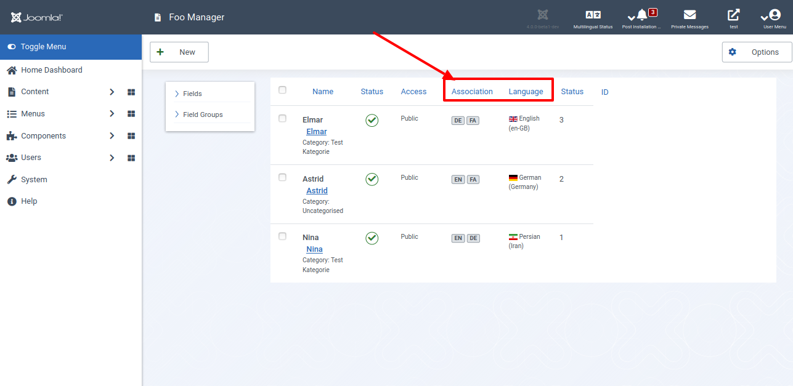
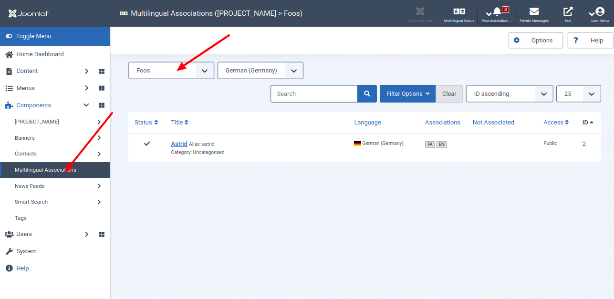
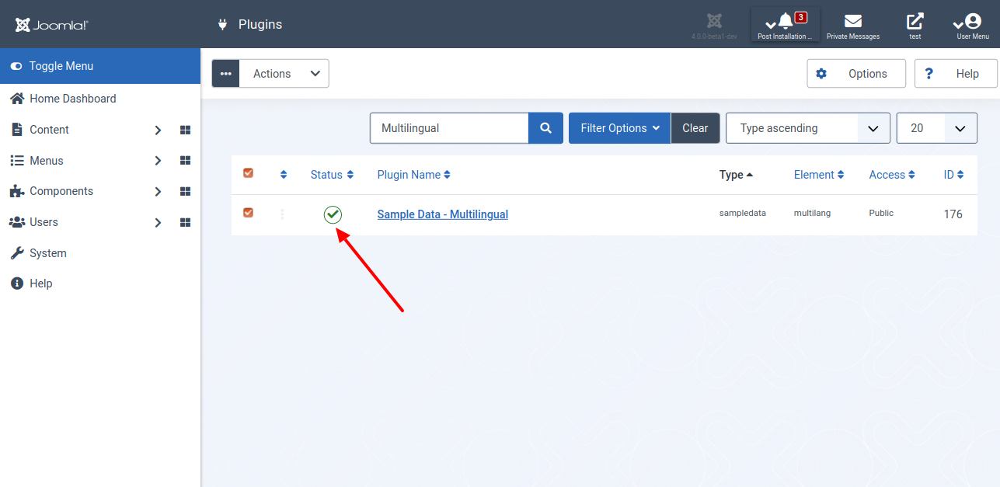
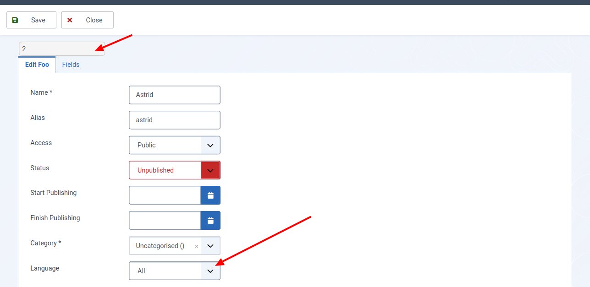
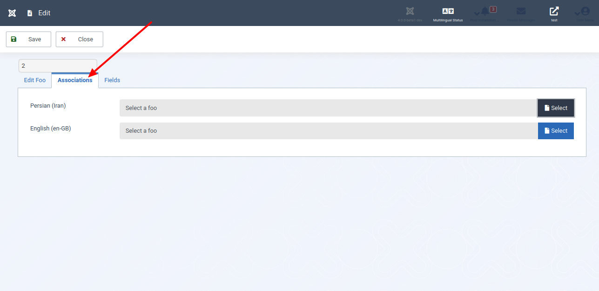

Mit Joomla! ist es möglich, eine mehrsprachige Website einzurichten, ohne Erweiterungen von Dritten zu installieren. In diesem Tutorial zeige ich dir, wie du deine Komponente so programmierst, dass sie Sprachverknüpfungen unterstützt.

## Für Ungeduldige

Sieh dir den geänderten Programmcode in der [Diff-Ansicht](https://github.com/astridx/boilerplate/compare/t14b...t15a) an und übernimm diese Änderungen in deine Entwicklungsversion.

Eine ausführlichere Erklärung des geänderten Programmcodes findest du weiter unten.

## Teste deine Joomla-Komponente

1. Installiere deine Komponente in Joomla! Version 4, um sie zu testen:

Kopiere die Dateien im `administrator` Ordner in den `administrator` Ordner deiner Joomla! 4 Installation.  
Kopiere die Dateien im `components` Ordner in den `components` Ordner deiner Joomla! 4 Installation.  
Kopiere die Dateien im `media` Ordner in den `media` Ordner deiner Joomla! 4 Installation.

2. Die Datenbank ist geändert worden, so dass es erforderlich ist, sie zu aktualisieren. Öffne den Bereich `System | Information | Database`, wie in Teil 16 beschrieben. Wähle deine Komponente aus und klicke auf `Update Structure`.

3. Installiere über `System | Install | Languages` mindestens eine weitere Sprache.

4. Stelle über `System | Manage | Plugins` sicher, dass das Plugin `Sample Data - Multilingual` veröffentlicht ist.

5. Wechsele zurück zum `Home Dashboard` und installiere die Beispieldateien `Multilinguale Sample Data`.

6. Öffne die Ansicht eines Items deiner Komponente im Administrationsbereich und überzeuge dich davon, dass der Status `Language` änderbar ist. Ändere diesen von `All` in eine beliebige Sprache.

7. Spiele mit den Sprachverknüpfungen und überzeuge dich davon, dass alles korrekt verknüpft wird.

8. Erweitere die Tests auf die Komponente `Multilingual Associations`. Diese unterstützt deine Erweiterung ebenfalls.

## Geänderte Dateien

### Übersicht

diff2html t14b

      

    

        Files changed (17)
        <a class="d2h-file-switch d2h-hide">hide</a>
        <a class="d2h-file-switch d2h-show">show</a>
    

    <ol class="d2h-file-list">
    <li class="d2h-file-list-line">
    
      <svg aria-hidden="true" class="d2h-icon d2h-changed" height="16" title="modified" version="1.1"
           viewBox="0 0 14 16" width="14">
          <path d="M13 1H1C0.45 1 0 1.45 0 2v12c0 0.55 0.45 1 1 1h12c0.55 0 1-0.45 1-1V2c0-0.55-0.45-1-1-1z m0 13H1V2h12v12zM4 8c0-1.66 1.34-3 3-3s3 1.34 3 3-1.34 3-3 3-3-1.34-3-3z"></path>
      </svg>      <a href="#d2h-861015" class="d2h-file-name">src/administrator/components/com_foos/forms/foo.xml</a>
      
          +12
          -1
      
    
</li>
<li class="d2h-file-list-line">
    
      <svg aria-hidden="true" class="d2h-icon d2h-changed" height="16" title="modified" version="1.1"
           viewBox="0 0 14 16" width="14">
          <path d="M13 1H1C0.45 1 0 1.45 0 2v12c0 0.55 0.45 1 1 1h12c0.55 0 1-0.45 1-1V2c0-0.55-0.45-1-1-1z m0 13H1V2h12v12zM4 8c0-1.66 1.34-3 3-3s3 1.34 3 3-1.34 3-3 3-3-1.34-3-3z"></path>
      </svg>      <a href="#d2h-591404" class="d2h-file-name">src/administrator/components/com_foos/services/provider.php</a>
      
          +5
          -0
      
    
</li>
<li class="d2h-file-list-line">
    
      <svg aria-hidden="true" class="d2h-icon d2h-changed" height="16" title="modified" version="1.1"
           viewBox="0 0 14 16" width="14">
          <path d="M13 1H1C0.45 1 0 1.45 0 2v12c0 0.55 0.45 1 1 1h12c0.55 0 1-0.45 1-1V2c0-0.55-0.45-1-1-1z m0 13H1V2h12v12zM4 8c0-1.66 1.34-3 3-3s3 1.34 3 3-1.34 3-3 3-3-1.34-3-3z"></path>
      </svg>      <a href="#d2h-929815" class="d2h-file-name">src/administrator/components/com_foos/sql/install.mysql.utf8.sql</a>
      
          +4
          -0
      
    
</li>
<li class="d2h-file-list-line">
    
      <svg aria-hidden="true" class="d2h-icon d2h-added" height="16" title="added" version="1.1" viewBox="0 0 14 16"
           width="14">
          <path d="M13 1H1C0.45 1 0 1.45 0 2v12c0 0.55 0.45 1 1 1h12c0.55 0 1-0.45 1-1V2c0-0.55-0.45-1-1-1z m0 13H1V2h12v12zM6 9H3V7h3V4h2v3h3v2H8v3H6V9z"></path>
      </svg>      <a href="#d2h-306285" class="d2h-file-name">src/administrator/components/com_foos/sql/updates/mysql/15.0.0.sql</a>
      
          +3
          -0
      
    
</li>
<li class="d2h-file-list-line">
    
      <svg aria-hidden="true" class="d2h-icon d2h-changed" height="16" title="modified" version="1.1"
           viewBox="0 0 14 16" width="14">
          <path d="M13 1H1C0.45 1 0 1.45 0 2v12c0 0.55 0.45 1 1 1h12c0.55 0 1-0.45 1-1V2c0-0.55-0.45-1-1-1z m0 13H1V2h12v12zM4 8c0-1.66 1.34-3 3-3s3 1.34 3 3-1.34 3-3 3-3-1.34-3-3z"></path>
      </svg>      <a href="#d2h-640935" class="d2h-file-name">src/administrator/components/com_foos/src/Extension/FoosComponent.php</a>
      
          +5
          -1
      
    
</li>
<li class="d2h-file-list-line">
    
      <svg aria-hidden="true" class="d2h-icon d2h-changed" height="16" title="modified" version="1.1"
           viewBox="0 0 14 16" width="14">
          <path d="M13 1H1C0.45 1 0 1.45 0 2v12c0 0.55 0.45 1 1 1h12c0.55 0 1-0.45 1-1V2c0-0.55-0.45-1-1-1z m0 13H1V2h12v12zM4 8c0-1.66 1.34-3 3-3s3 1.34 3 3-1.34 3-3 3-3-1.34-3-3z"></path>
      </svg>      <a href="#d2h-294232" class="d2h-file-name">src/administrator/components/com_foos/src/Field/Modal/FooField.php</a>
      
          +7
          -0
      
    
</li>
<li class="d2h-file-list-line">
    
      <svg aria-hidden="true" class="d2h-icon d2h-added" height="16" title="added" version="1.1" viewBox="0 0 14 16"
           width="14">
          <path d="M13 1H1C0.45 1 0 1.45 0 2v12c0 0.55 0.45 1 1 1h12c0.55 0 1-0.45 1-1V2c0-0.55-0.45-1-1-1z m0 13H1V2h12v12zM6 9H3V7h3V4h2v3h3v2H8v3H6V9z"></path>
      </svg>      <a href="#d2h-405064" class="d2h-file-name">src/administrator/components/com_foos/src/Helper/AssociationsHelper.php</a>
      
          +237
          -0
      
    
</li>
<li class="d2h-file-list-line">
    
      <svg aria-hidden="true" class="d2h-icon d2h-changed" height="16" title="modified" version="1.1"
           viewBox="0 0 14 16" width="14">
          <path d="M13 1H1C0.45 1 0 1.45 0 2v12c0 0.55 0.45 1 1 1h12c0.55 0 1-0.45 1-1V2c0-0.55-0.45-1-1-1z m0 13H1V2h12v12zM4 8c0-1.66 1.34-3 3-3s3 1.34 3 3-1.34 3-3 3-3-1.34-3-3z"></path>
      </svg>      <a href="#d2h-206858" class="d2h-file-name">src/administrator/components/com_foos/src/Model/FooModel.php</a>
      
          +89
          -0
      
    
</li>
<li class="d2h-file-list-line">
    
      <svg aria-hidden="true" class="d2h-icon d2h-changed" height="16" title="modified" version="1.1"
           viewBox="0 0 14 16" width="14">
          <path d="M13 1H1C0.45 1 0 1.45 0 2v12c0 0.55 0.45 1 1 1h12c0.55 0 1-0.45 1-1V2c0-0.55-0.45-1-1-1z m0 13H1V2h12v12zM4 8c0-1.66 1.34-3 3-3s3 1.34 3 3-1.34 3-3 3-3-1.34-3-3z"></path>
      </svg>      <a href="#d2h-841411" class="d2h-file-name">src/administrator/components/com_foos/src/Model/FoosModel.php</a>
      
          +79
          -1
      
    
</li>
<li class="d2h-file-list-line">
    
      <svg aria-hidden="true" class="d2h-icon d2h-changed" height="16" title="modified" version="1.1"
           viewBox="0 0 14 16" width="14">
          <path d="M13 1H1C0.45 1 0 1.45 0 2v12c0 0.55 0.45 1 1 1h12c0.55 0 1-0.45 1-1V2c0-0.55-0.45-1-1-1z m0 13H1V2h12v12zM4 8c0-1.66 1.34-3 3-3s3 1.34 3 3-1.34 3-3 3-3-1.34-3-3z"></path>
      </svg>      <a href="#d2h-125543" class="d2h-file-name">src/administrator/components/com_foos/src/Service/HTML/AdministratorService.php</a>
      
          +72
          -0
      
    
</li>
<li class="d2h-file-list-line">
    
      <svg aria-hidden="true" class="d2h-icon d2h-changed" height="16" title="modified" version="1.1"
           viewBox="0 0 14 16" width="14">
          <path d="M13 1H1C0.45 1 0 1.45 0 2v12c0 0.55 0.45 1 1 1h12c0.55 0 1-0.45 1-1V2c0-0.55-0.45-1-1-1z m0 13H1V2h12v12zM4 8c0-1.66 1.34-3 3-3s3 1.34 3 3-1.34 3-3 3-3-1.34-3-3z"></path>
      </svg>      <a href="#d2h-047734" class="d2h-file-name">src/administrator/components/com_foos/src/View/Foo/HtmlView.php</a>
      
          +11
          -0
      
    
</li>
<li class="d2h-file-list-line">
    
      <svg aria-hidden="true" class="d2h-icon d2h-changed" height="16" title="modified" version="1.1"
           viewBox="0 0 14 16" width="14">
          <path d="M13 1H1C0.45 1 0 1.45 0 2v12c0 0.55 0.45 1 1 1h12c0.55 0 1-0.45 1-1V2c0-0.55-0.45-1-1-1z m0 13H1V2h12v12zM4 8c0-1.66 1.34-3 3-3s3 1.34 3 3-1.34 3-3 3-3-1.34-3-3z"></path>
      </svg>      <a href="#d2h-529131" class="d2h-file-name">src/administrator/components/com_foos/src/View/Foos/HtmlView.php</a>
      
          +17
          -1
      
    
</li>
<li class="d2h-file-list-line">
    
      <svg aria-hidden="true" class="d2h-icon d2h-changed" height="16" title="modified" version="1.1"
           viewBox="0 0 14 16" width="14">
          <path d="M13 1H1C0.45 1 0 1.45 0 2v12c0 0.55 0.45 1 1 1h12c0.55 0 1-0.45 1-1V2c0-0.55-0.45-1-1-1z m0 13H1V2h12v12zM4 8c0-1.66 1.34-3 3-3s3 1.34 3 3-1.34 3-3 3-3-1.34-3-3z"></path>
      </svg>      <a href="#d2h-426783" class="d2h-file-name">src/administrator/components/com_foos/tmpl/foo/edit.php</a>
      
          +15
          -1
      
    
</li>
<li class="d2h-file-list-line">
    
      <svg aria-hidden="true" class="d2h-icon d2h-added" height="16" title="added" version="1.1" viewBox="0 0 14 16"
           width="14">
          <path d="M13 1H1C0.45 1 0 1.45 0 2v12c0 0.55 0.45 1 1 1h12c0.55 0 1-0.45 1-1V2c0-0.55-0.45-1-1-1z m0 13H1V2h12v12zM6 9H3V7h3V4h2v3h3v2H8v3H6V9z"></path>
      </svg>      <a href="#d2h-838330" class="d2h-file-name">src/administrator/components/com_foos/tmpl/foo/edit_associations.php</a>
      
          +14
          -0
      
    
</li>
<li class="d2h-file-list-line">
    
      <svg aria-hidden="true" class="d2h-icon d2h-changed" height="16" title="modified" version="1.1"
           viewBox="0 0 14 16" width="14">
          <path d="M13 1H1C0.45 1 0 1.45 0 2v12c0 0.55 0.45 1 1 1h12c0.55 0 1-0.45 1-1V2c0-0.55-0.45-1-1-1z m0 13H1V2h12v12zM4 8c0-1.66 1.34-3 3-3s3 1.34 3 3-1.34 3-3 3-3-1.34-3-3z"></path>
      </svg>      <a href="#d2h-900341" class="d2h-file-name">src/administrator/components/com_foos/tmpl/foos/default.php</a>
      
          +35
          -0
      
    
</li>
<li class="d2h-file-list-line">
    
      <svg aria-hidden="true" class="d2h-icon d2h-added" height="16" title="added" version="1.1" viewBox="0 0 14 16"
           width="14">
          <path d="M13 1H1C0.45 1 0 1.45 0 2v12c0 0.55 0.45 1 1 1h12c0.55 0 1-0.45 1-1V2c0-0.55-0.45-1-1-1z m0 13H1V2h12v12zM6 9H3V7h3V4h2v3h3v2H8v3H6V9z"></path>
      </svg>      <a href="#d2h-157433" class="d2h-file-name">src/components/com_foos/src/Helper/AssociationHelper.php</a>
      
          +67
          -0
      
    
</li>
<li class="d2h-file-list-line">
    
      <svg aria-hidden="true" class="d2h-icon d2h-added" height="16" title="added" version="1.1" viewBox="0 0 14 16"
           width="14">
          <path d="M13 1H1C0.45 1 0 1.45 0 2v12c0 0.55 0.45 1 1 1h12c0.55 0 1-0.45 1-1V2c0-0.55-0.45-1-1-1z m0 13H1V2h12v12zM6 9H3V7h3V4h2v3h3v2H8v3H6V9z"></path>
      </svg>      <a href="#d2h-773427" class="d2h-file-name">src/components/com_foos/src/Helper/Route.php</a>
      
          +94
          -0
      
    
</li>
    </ol>

    

    

    
    <svg aria-hidden="true" class="d2h-icon" height="16" version="1.1" viewBox="0 0 12 16" width="12">
        <path d="M6 5H2v-1h4v1zM2 8h7v-1H2v1z m0 2h7v-1H2v1z m0 2h7v-1H2v1z m10-7.5v9.5c0 0.55-0.45 1-1 1H1c-0.55 0-1-0.45-1-1V2c0-0.55 0.45-1 1-1h7.5l3.5 3.5z m-1 0.5L8 2H1v12h10V5z"></path>
    </svg>    src/administrator/components/com_foos/forms/foo.xml
    CHANGED
    

    

        

            <table class="d2h-diff-table">
                <tbody class="d2h-diff-tbody">
                <tr>
    <td class="d2h-code-linenumber d2h-info"></td>
    <td class="d2h-info">
        
@@ -1,6 +1,9 @@

    </td>
</tr><tr>
    <td class="d2h-code-linenumber d2h-cntx">
      
1

1

    </td>
    <td class="d2h-cntx">
        

            &nbsp;
            &lt;?xml version=&quot;1.0&quot; encoding=&quot;utf-8&quot;?&gt;
        

    </td>
</tr><tr>
    <td class="d2h-code-linenumber d2h-cntx">
      
2

2

    </td>
    <td class="d2h-cntx">
        

            &nbsp;
            &lt;form&gt;
        

    </td>
</tr><tr>
    <td class="d2h-code-linenumber d2h-del d2h-change">
      
3

    </td>
    <td class="d2h-del d2h-change">
        

            -
            	&lt;fieldset <del>addruleprefix=&quot;FooNamespace\Component\Foos\Administrator\Rule&quot;&gt;</del>
        

    </td>
</tr><tr>
    <td class="d2h-code-linenumber d2h-ins d2h-change">
      

3

    </td>
    <td class="d2h-ins d2h-change">
        

            +
            	&lt;fieldset 
        

    </td>
</tr><tr>
    <td class="d2h-code-linenumber d2h-ins">
      

4

    </td>
    <td class="d2h-ins">
        

            +
            		addruleprefix=&quot;FooNamespace\Component\Foos\Administrator\Rule&quot;
        

    </td>
</tr><tr>
    <td class="d2h-code-linenumber d2h-ins">
      

5

    </td>
    <td class="d2h-ins">
        

            +
            		addfieldprefix=&quot;FooNamespace\Component\Foos\Administrator\Field&quot;
        

    </td>
</tr><tr>
    <td class="d2h-code-linenumber d2h-ins">
      

6

    </td>
    <td class="d2h-ins">
        

            +
            	&gt;
        

    </td>
</tr><tr>
    <td class="d2h-code-linenumber d2h-cntx">
      
4

7

    </td>
    <td class="d2h-cntx">
        

            &nbsp;
            		&lt;field
        

    </td>
</tr><tr>
    <td class="d2h-code-linenumber d2h-cntx">
      
5

8

    </td>
    <td class="d2h-cntx">
        

            &nbsp;
            			name=&quot;id&quot;
        

    </td>
</tr><tr>
    <td class="d2h-code-linenumber d2h-cntx">
      
6

9

    </td>
    <td class="d2h-cntx">
        

            &nbsp;
            			type=&quot;number&quot;
        

    </td>
</tr>
<tr>
    <td class="d2h-code-linenumber d2h-info"></td>
    <td class="d2h-info">
        
@@ -28,6 +31,14 @@

    </td>
</tr><tr>
    <td class="d2h-code-linenumber d2h-cntx">
      
28

31

    </td>
    <td class="d2h-cntx">
        

            &nbsp;
            			hint=&quot;JFIELD_ALIAS_PLACEHOLDER&quot;
        

    </td>
</tr><tr>
    <td class="d2h-code-linenumber d2h-cntx">
      
29

32

    </td>
    <td class="d2h-cntx">
        

            &nbsp;
            		&#x2F;&gt;
        

    </td>
</tr><tr>
    <td class="d2h-code-linenumber d2h-cntx">
      
30

33

    </td>
    <td class="d2h-cntx">
        

            &nbsp;
        

    </td>
</tr><tr>
    <td class="d2h-code-linenumber d2h-ins">
      

34

    </td>
    <td class="d2h-ins">
        

            +
            		&lt;field
        

    </td>
</tr><tr>
    <td class="d2h-code-linenumber d2h-ins">
      

35

    </td>
    <td class="d2h-ins">
        

            +
            			name=&quot;language&quot;
        

    </td>
</tr><tr>
    <td class="d2h-code-linenumber d2h-ins">
      

36

    </td>
    <td class="d2h-ins">
        

            +
            			type=&quot;contentlanguage&quot;
        

    </td>
</tr><tr>
    <td class="d2h-code-linenumber d2h-ins">
      

37

    </td>
    <td class="d2h-ins">
        

            +
            			label=&quot;JFIELD_LANGUAGE_LABEL&quot;
        

    </td>
</tr><tr>
    <td class="d2h-code-linenumber d2h-ins">
      

38

    </td>
    <td class="d2h-ins">
        

            +
            			&gt;
        

    </td>
</tr><tr>
    <td class="d2h-code-linenumber d2h-ins">
      

39

    </td>
    <td class="d2h-ins">
        

            +
            			&lt;option value=&quot;*&quot;&gt;JALL&lt;&#x2F;option&gt;
        

    </td>
</tr><tr>
    <td class="d2h-code-linenumber d2h-ins">
      

40

    </td>
    <td class="d2h-ins">
        

            +
            		&lt;&#x2F;field&gt;
        

    </td>
</tr><tr>
    <td class="d2h-code-linenumber d2h-ins">
      

41

    </td>
    <td class="d2h-ins">
        

            +
        

    </td>
</tr><tr>
    <td class="d2h-code-linenumber d2h-cntx">
      
31

42

    </td>
    <td class="d2h-cntx">
        

            &nbsp;
            		&lt;field
        

    </td>
</tr><tr>
    <td class="d2h-code-linenumber d2h-cntx">
      
32

43

    </td>
    <td class="d2h-cntx">
        

            &nbsp;
            			name=&quot;published&quot;
        

    </td>
</tr><tr>
    <td class="d2h-code-linenumber d2h-cntx">
      
33

44

    </td>
    <td class="d2h-cntx">
        

            &nbsp;
            			type=&quot;list&quot;
        

    </td>
</tr>
                </tbody>
            </table>
        

    

    

    
    <svg aria-hidden="true" class="d2h-icon" height="16" version="1.1" viewBox="0 0 12 16" width="12">
        <path d="M6 5H2v-1h4v1zM2 8h7v-1H2v1z m0 2h7v-1H2v1z m0 2h7v-1H2v1z m10-7.5v9.5c0 0.55-0.45 1-1 1H1c-0.55 0-1-0.45-1-1V2c0-0.55 0.45-1 1-1h7.5l3.5 3.5z m-1 0.5L8 2H1v12h10V5z"></path>
    </svg>    src/administrator/components/com_foos/services/provider.php
    CHANGED
    

    

        

            <table class="d2h-diff-table">
                <tbody class="d2h-diff-tbody">
                <tr>
    <td class="d2h-code-linenumber d2h-info"></td>
    <td class="d2h-info">
        
@@ -20,6 +20,8 @@ use Joomla\CMS\MVC\Factory\MVCFactoryInterface;

    </td>
</tr><tr>
    <td class="d2h-code-linenumber d2h-cntx">
      
20

20

    </td>
    <td class="d2h-cntx">
        

            &nbsp;
            use Joomla\DI\Container;
        

    </td>
</tr><tr>
    <td class="d2h-code-linenumber d2h-cntx">
      
21

21

    </td>
    <td class="d2h-cntx">
        

            &nbsp;
            use Joomla\DI\ServiceProviderInterface;
        

    </td>
</tr><tr>
    <td class="d2h-code-linenumber d2h-cntx">
      
22

22

    </td>
    <td class="d2h-cntx">
        

            &nbsp;
            use FooNamespace\Component\Foos\Administrator\Extension\FoosComponent;
        

    </td>
</tr><tr>
    <td class="d2h-code-linenumber d2h-ins">
      

23

    </td>
    <td class="d2h-ins">
        

            +
            use FooNamespace\Component\Foos\Administrator\Helper\AssociationsHelper;
        

    </td>
</tr><tr>
    <td class="d2h-code-linenumber d2h-ins">
      

24

    </td>
    <td class="d2h-ins">
        

            +
            use Joomla\CMS\Association\AssociationExtensionInterface;
        

    </td>
</tr><tr>
    <td class="d2h-code-linenumber d2h-cntx">
      
23

25

    </td>
    <td class="d2h-cntx">
        

            &nbsp;
        

    </td>
</tr><tr>
    <td class="d2h-code-linenumber d2h-cntx">
      
24

26

    </td>
    <td class="d2h-cntx">
        

            &nbsp;
            &#x2F;**
        

    </td>
</tr><tr>
    <td class="d2h-code-linenumber d2h-cntx">
      
25

27

    </td>
    <td class="d2h-cntx">
        

            &nbsp;
             * The foos service provider.
        

    </td>
</tr>
<tr>
    <td class="d2h-code-linenumber d2h-info"></td>
    <td class="d2h-info">
        
@@ -40,6 +42,8 @@ return new class implements ServiceProviderInterface

    </td>
</tr><tr>
    <td class="d2h-code-linenumber d2h-cntx">
      
40

42

    </td>
    <td class="d2h-cntx">
        

            &nbsp;
            	 *&#x2F;
        

    </td>
</tr><tr>
    <td class="d2h-code-linenumber d2h-cntx">
      
41

43

    </td>
    <td class="d2h-cntx">
        

            &nbsp;
            	public function register(Container $container)
        

    </td>
</tr><tr>
    <td class="d2h-code-linenumber d2h-cntx">
      
42

44

    </td>
    <td class="d2h-cntx">
        

            &nbsp;
            	{
        

    </td>
</tr><tr>
    <td class="d2h-code-linenumber d2h-ins">
      

45

    </td>
    <td class="d2h-ins">
        

            +
            		$container-&gt;set(AssociationExtensionInterface::class, new AssociationsHelper);
        

    </td>
</tr><tr>
    <td class="d2h-code-linenumber d2h-ins">
      

46

    </td>
    <td class="d2h-ins">
        

            +
        

    </td>
</tr><tr>
    <td class="d2h-code-linenumber d2h-cntx">
      
43

47

    </td>
    <td class="d2h-cntx">
        

            &nbsp;
            		$container-&gt;registerServiceProvider(new CategoryFactory(&#x27;\\Joomla\\Component\\Foos&#x27;));
        

    </td>
</tr><tr>
    <td class="d2h-code-linenumber d2h-cntx">
      
44

48

    </td>
    <td class="d2h-cntx">
        

            &nbsp;
            		$container-&gt;registerServiceProvider(new MVCFactory(&#x27;\\Joomla\\Component\\Foos&#x27;));
        

    </td>
</tr><tr>
    <td class="d2h-code-linenumber d2h-cntx">
      
45

49

    </td>
    <td class="d2h-cntx">
        

            &nbsp;
            		$container-&gt;registerServiceProvider(new ComponentDispatcherFactory(&#x27;\\Joomla\\Component\\Foos&#x27;));
        

    </td>
</tr>
<tr>
    <td class="d2h-code-linenumber d2h-info"></td>
    <td class="d2h-info">
        
@@ -53,6 +57,7 @@ return new class implements ServiceProviderInterface

    </td>
</tr><tr>
    <td class="d2h-code-linenumber d2h-cntx">
      
53

57

    </td>
    <td class="d2h-cntx">
        

            &nbsp;
            				$component-&gt;setRegistry($container-&gt;get(Registry::class));
        

    </td>
</tr><tr>
    <td class="d2h-code-linenumber d2h-cntx">
      
54

58

    </td>
    <td class="d2h-cntx">
        

            &nbsp;
            				$component-&gt;setMVCFactory($container-&gt;get(MVCFactoryInterface::class));
        

    </td>
</tr><tr>
    <td class="d2h-code-linenumber d2h-cntx">
      
55

59

    </td>
    <td class="d2h-cntx">
        

            &nbsp;
            				$component-&gt;setCategoryFactory($container-&gt;get(CategoryFactoryInterface::class));
        

    </td>
</tr><tr>
    <td class="d2h-code-linenumber d2h-ins">
      

60

    </td>
    <td class="d2h-ins">
        

            +
            				$component-&gt;setAssociationExtension($container-&gt;get(AssociationExtensionInterface::class));
        

    </td>
</tr><tr>
    <td class="d2h-code-linenumber d2h-cntx">
      
56

61

    </td>
    <td class="d2h-cntx">
        

            &nbsp;
        

    </td>
</tr><tr>
    <td class="d2h-code-linenumber d2h-cntx">
      
57

62

    </td>
    <td class="d2h-cntx">
        

            &nbsp;
            				return $component;
        

    </td>
</tr><tr>
    <td class="d2h-code-linenumber d2h-cntx">
      
58

63

    </td>
    <td class="d2h-cntx">
        

            &nbsp;
            			}
        

    </td>
</tr>
                </tbody>
            </table>
        

    

    

    
    <svg aria-hidden="true" class="d2h-icon" height="16" version="1.1" viewBox="0 0 12 16" width="12">
        <path d="M6 5H2v-1h4v1zM2 8h7v-1H2v1z m0 2h7v-1H2v1z m0 2h7v-1H2v1z m10-7.5v9.5c0 0.55-0.45 1-1 1H1c-0.55 0-1-0.45-1-1V2c0-0.55 0.45-1 1-1h7.5l3.5 3.5z m-1 0.5L8 2H1v12h10V5z"></path>
    </svg>    src/administrator/components/com_foos/sql/install.mysql.utf8.sql
    CHANGED
    

    

        

            <table class="d2h-diff-table">
                <tbody class="d2h-diff-tbody">
                <tr>
    <td class="d2h-code-linenumber d2h-info"></td>
    <td class="d2h-info">
        
@@ -27,3 +27,7 @@ ALTER TABLE `#__foos_details` ADD COLUMN  `publish_up` datetime AFTER `alias`;

    </td>
</tr><tr>
    <td class="d2h-code-linenumber d2h-cntx">
      
27

27

    </td>
    <td class="d2h-cntx">
        

            &nbsp;
            ALTER TABLE `#__foos_details` ADD COLUMN  `publish_down` datetime AFTER `alias`;
        

    </td>
</tr><tr>
    <td class="d2h-code-linenumber d2h-cntx">
      
28

28

    </td>
    <td class="d2h-cntx">
        

            &nbsp;
        

    </td>
</tr><tr>
    <td class="d2h-code-linenumber d2h-cntx">
      
29

29

    </td>
    <td class="d2h-cntx">
        

            &nbsp;
            ALTER TABLE `#__foos_details` ADD KEY `idx_state` (`published`);
        

    </td>
</tr><tr>
    <td class="d2h-code-linenumber d2h-ins">
      

30

    </td>
    <td class="d2h-ins">
        

            +
        

    </td>
</tr><tr>
    <td class="d2h-code-linenumber d2h-ins">
      

31

    </td>
    <td class="d2h-ins">
        

            +
            ALTER TABLE `#__foos_details` ADD COLUMN  `language` char(7) NOT NULL DEFAULT &#x27;*&#x27; AFTER `alias`;
        

    </td>
</tr><tr>
    <td class="d2h-code-linenumber d2h-ins">
      

32

    </td>
    <td class="d2h-ins">
        

            +
        

    </td>
</tr><tr>
    <td class="d2h-code-linenumber d2h-ins">
      

33

    </td>
    <td class="d2h-ins">
        

            +
            ALTER TABLE `#__foos_details` ADD KEY `idx_language` (`language`);
        

    </td>
</tr>
                </tbody>
            </table>
        

    

    

    
    <svg aria-hidden="true" class="d2h-icon" height="16" version="1.1" viewBox="0 0 12 16" width="12">
        <path d="M6 5H2v-1h4v1zM2 8h7v-1H2v1z m0 2h7v-1H2v1z m0 2h7v-1H2v1z m10-7.5v9.5c0 0.55-0.45 1-1 1H1c-0.55 0-1-0.45-1-1V2c0-0.55 0.45-1 1-1h7.5l3.5 3.5z m-1 0.5L8 2H1v12h10V5z"></path>
    </svg>    src/administrator/components/com_foos/sql/updates/mysql/15.0.0.sql
    ADDED
    

    

        

            <table class="d2h-diff-table">
                <tbody class="d2h-diff-tbody">
                <tr>
    <td class="d2h-code-linenumber d2h-info"></td>
    <td class="d2h-info">
        
@@ -0,0 +1,3 @@

    </td>
</tr><tr>
    <td class="d2h-code-linenumber d2h-ins">
      

1

    </td>
    <td class="d2h-ins">
        

            +
            ALTER TABLE `#__foos_details` ADD COLUMN  `language` char(7) NOT NULL DEFAULT &#x27;*&#x27; AFTER `alias`;
        

    </td>
</tr><tr>
    <td class="d2h-code-linenumber d2h-ins">
      

2

    </td>
    <td class="d2h-ins">
        

            +
        

    </td>
</tr><tr>
    <td class="d2h-code-linenumber d2h-ins">
      

3

    </td>
    <td class="d2h-ins">
        

            +
            ALTER TABLE `#__foos_details` ADD KEY `idx_language` (`language`);
        

    </td>
</tr>
                </tbody>
            </table>
        

    

    

    
    <svg aria-hidden="true" class="d2h-icon" height="16" version="1.1" viewBox="0 0 12 16" width="12">
        <path d="M6 5H2v-1h4v1zM2 8h7v-1H2v1z m0 2h7v-1H2v1z m0 2h7v-1H2v1z m10-7.5v9.5c0 0.55-0.45 1-1 1H1c-0.55 0-1-0.45-1-1V2c0-0.55 0.45-1 1-1h7.5l3.5 3.5z m-1 0.5L8 2H1v12h10V5z"></path>
    </svg>    src/administrator/components/com_foos/src/Extension/FoosComponent.php
    CHANGED
    

    

        

            <table class="d2h-diff-table">
                <tbody class="d2h-diff-tbody">
                <tr>
    <td class="d2h-code-linenumber d2h-info"></td>
    <td class="d2h-info">
        
@@ -11,6 +11,8 @@ namespace FooNamespace\Component\Foos\Administrator\Extension;

    </td>
</tr><tr>
    <td class="d2h-code-linenumber d2h-cntx">
      
11

11

    </td>
    <td class="d2h-cntx">
        

            &nbsp;
        

    </td>
</tr><tr>
    <td class="d2h-code-linenumber d2h-cntx">
      
12

12

    </td>
    <td class="d2h-cntx">
        

            &nbsp;
            defined(&#x27;JPATH_PLATFORM&#x27;) or die;
        

    </td>
</tr><tr>
    <td class="d2h-code-linenumber d2h-cntx">
      
13

13

    </td>
    <td class="d2h-cntx">
        

            &nbsp;
        

    </td>
</tr><tr>
    <td class="d2h-code-linenumber d2h-ins">
      

14

    </td>
    <td class="d2h-ins">
        

            +
            use Joomla\CMS\Association\AssociationServiceInterface;
        

    </td>
</tr><tr>
    <td class="d2h-code-linenumber d2h-ins">
      

15

    </td>
    <td class="d2h-ins">
        

            +
            use Joomla\CMS\Association\AssociationServiceTrait;
        

    </td>
</tr><tr>
    <td class="d2h-code-linenumber d2h-cntx">
      
14

16

    </td>
    <td class="d2h-cntx">
        

            &nbsp;
            use Joomla\CMS\Categories\CategoryServiceInterface;
        

    </td>
</tr><tr>
    <td class="d2h-code-linenumber d2h-cntx">
      
15

17

    </td>
    <td class="d2h-cntx">
        

            &nbsp;
            use Joomla\CMS\Categories\CategoryServiceTrait;
        

    </td>
</tr><tr>
    <td class="d2h-code-linenumber d2h-cntx">
      
16

18

    </td>
    <td class="d2h-cntx">
        

            &nbsp;
            use Joomla\CMS\Extension\BootableExtensionInterface;
        

    </td>
</tr>
<tr>
    <td class="d2h-code-linenumber d2h-info"></td>
    <td class="d2h-info">
        
@@ -25,9 +27,11 @@ use Joomla\CMS\Helper\ContentHelper;

    </td>
</tr><tr>
    <td class="d2h-code-linenumber d2h-cntx">
      
25

27

    </td>
    <td class="d2h-cntx">
        

            &nbsp;
             *
        

    </td>
</tr><tr>
    <td class="d2h-code-linenumber d2h-cntx">
      
26

28

    </td>
    <td class="d2h-cntx">
        

            &nbsp;
             * @since  __BUMP_VERSION__
        

    </td>
</tr><tr>
    <td class="d2h-code-linenumber d2h-cntx">
      
27

29

    </td>
    <td class="d2h-cntx">
        

            &nbsp;
             *&#x2F;
        

    </td>
</tr><tr>
    <td class="d2h-code-linenumber d2h-del d2h-change">
      
28

    </td>
    <td class="d2h-del d2h-change">
        

            -
            class FoosComponent extends MVCComponent<del> implements BootableExtensionInterface, CategoryServiceInterface</del>
        

    </td>
</tr><tr>
    <td class="d2h-code-linenumber d2h-ins d2h-change">
      

30

    </td>
    <td class="d2h-ins d2h-change">
        

            +
            class FoosComponent extends MVCComponent
        

    </td>
</tr><tr>
    <td class="d2h-code-linenumber d2h-ins">
      

31

    </td>
    <td class="d2h-ins">
        

            +
            implements BootableExtensionInterface, CategoryServiceInterface, AssociationServiceInterface
        

    </td>
</tr><tr>
    <td class="d2h-code-linenumber d2h-cntx">
      
29

32

    </td>
    <td class="d2h-cntx">
        

            &nbsp;
            {
        

    </td>
</tr><tr>
    <td class="d2h-code-linenumber d2h-cntx">
      
30

33

    </td>
    <td class="d2h-cntx">
        

            &nbsp;
            	use CategoryServiceTrait;
        

    </td>
</tr><tr>
    <td class="d2h-code-linenumber d2h-ins">
      

34

    </td>
    <td class="d2h-ins">
        

            +
            	use AssociationServiceTrait;
        

    </td>
</tr><tr>
    <td class="d2h-code-linenumber d2h-cntx">
      
31

35

    </td>
    <td class="d2h-cntx">
        

            &nbsp;
            	use HTMLRegistryAwareTrait;
        

    </td>
</tr><tr>
    <td class="d2h-code-linenumber d2h-cntx">
      
32

36

    </td>
    <td class="d2h-cntx">
        

            &nbsp;
        

    </td>
</tr><tr>
    <td class="d2h-code-linenumber d2h-cntx">
      
33

37

    </td>
    <td class="d2h-cntx">
        

            &nbsp;
            	&#x2F;**
        

    </td>
</tr>
                </tbody>
            </table>
        

    

    

    
    <svg aria-hidden="true" class="d2h-icon" height="16" version="1.1" viewBox="0 0 12 16" width="12">
        <path d="M6 5H2v-1h4v1zM2 8h7v-1H2v1z m0 2h7v-1H2v1z m0 2h7v-1H2v1z m10-7.5v9.5c0 0.55-0.45 1-1 1H1c-0.55 0-1-0.45-1-1V2c0-0.55 0.45-1 1-1h7.5l3.5 3.5z m-1 0.5L8 2H1v12h10V5z"></path>
    </svg>    src/administrator/components/com_foos/src/Field/Modal/FooField.php
    CHANGED
    

    

        

            <table class="d2h-diff-table">
                <tbody class="d2h-diff-tbody">
                <tr>
    <td class="d2h-code-linenumber d2h-info"></td>
    <td class="d2h-info">
        
@@ -81,6 +81,13 @@ class FooField extends FormField

    </td>
</tr><tr>
    <td class="d2h-code-linenumber d2h-cntx">
      
81

81

    </td>
    <td class="d2h-cntx">
        

            &nbsp;
            		$linkFoo  = &#x27;index.php?option=com_foos&amp;amp;view=foo&amp;amp;layout=modal&amp;amp;tmpl=component&amp;amp;&#x27; . Session::getFormToken() . &#x27;=1&#x27;;
        

    </td>
</tr><tr>
    <td class="d2h-code-linenumber d2h-cntx">
      
82

82

    </td>
    <td class="d2h-cntx">
        

            &nbsp;
            		$modalTitle   = Text::_(&#x27;COM_FOOS_CHANGE_FOO&#x27;);
        

    </td>
</tr><tr>
    <td class="d2h-code-linenumber d2h-cntx">
      
83

83

    </td>
    <td class="d2h-cntx">
        

            &nbsp;
        

    </td>
</tr><tr>
    <td class="d2h-code-linenumber d2h-ins">
      

84

    </td>
    <td class="d2h-ins">
        

            +
            		if (isset($this-&gt;element[&#x27;language&#x27;]))
        

    </td>
</tr><tr>
    <td class="d2h-code-linenumber d2h-ins">
      

85

    </td>
    <td class="d2h-ins">
        

            +
            		{
        

    </td>
</tr><tr>
    <td class="d2h-code-linenumber d2h-ins">
      

86

    </td>
    <td class="d2h-ins">
        

            +
            			$linkFoos .= &#x27;&amp;amp;forcedLanguage=&#x27; . $this-&gt;element[&#x27;language&#x27;];
        

    </td>
</tr><tr>
    <td class="d2h-code-linenumber d2h-ins">
      

87

    </td>
    <td class="d2h-ins">
        

            +
            			$linkFoo   .= &#x27;&amp;amp;forcedLanguage=&#x27; . $this-&gt;element[&#x27;language&#x27;];
        

    </td>
</tr><tr>
    <td class="d2h-code-linenumber d2h-ins">
      

88

    </td>
    <td class="d2h-ins">
        

            +
            			$modalTitle     .= &#x27; &amp;#8212; &#x27; . $this-&gt;element[&#x27;label&#x27;];
        

    </td>
</tr><tr>
    <td class="d2h-code-linenumber d2h-ins">
      

89

    </td>
    <td class="d2h-ins">
        

            +
            		}
        

    </td>
</tr><tr>
    <td class="d2h-code-linenumber d2h-ins">
      

90

    </td>
    <td class="d2h-ins">
        

            +
        

    </td>
</tr><tr>
    <td class="d2h-code-linenumber d2h-cntx">
      
84

91

    </td>
    <td class="d2h-cntx">
        

            &nbsp;
            		$urlSelect = $linkFoos . &#x27;&amp;amp;function=jSelectFoo_&#x27; . $this-&gt;id;
        

    </td>
</tr><tr>
    <td class="d2h-code-linenumber d2h-cntx">
      
85

92

    </td>
    <td class="d2h-cntx">
        

            &nbsp;
        

    </td>
</tr><tr>
    <td class="d2h-code-linenumber d2h-cntx">
      
86

93

    </td>
    <td class="d2h-cntx">
        

            &nbsp;
            		if ($value)
        

    </td>
</tr>
                </tbody>
            </table>
        

    

    

    
    <svg aria-hidden="true" class="d2h-icon" height="16" version="1.1" viewBox="0 0 12 16" width="12">
        <path d="M6 5H2v-1h4v1zM2 8h7v-1H2v1z m0 2h7v-1H2v1z m0 2h7v-1H2v1z m10-7.5v9.5c0 0.55-0.45 1-1 1H1c-0.55 0-1-0.45-1-1V2c0-0.55 0.45-1 1-1h7.5l3.5 3.5z m-1 0.5L8 2H1v12h10V5z"></path>
    </svg>    src/administrator/components/com_foos/src/Helper/AssociationsHelper.php
    ADDED
    

    

        

            <table class="d2h-diff-table">
                <tbody class="d2h-diff-tbody">
                <tr>
    <td class="d2h-code-linenumber d2h-info"></td>
    <td class="d2h-info">
        
@@ -0,0 +1,237 @@

    </td>
</tr><tr>
    <td class="d2h-code-linenumber d2h-ins">
      

1

    </td>
    <td class="d2h-ins">
        

            +
            &lt;?php
        

    </td>
</tr><tr>
    <td class="d2h-code-linenumber d2h-ins">
      

2

    </td>
    <td class="d2h-ins">
        

            +
            &#x2F;**
        

    </td>
</tr><tr>
    <td class="d2h-code-linenumber d2h-ins">
      

3

    </td>
    <td class="d2h-ins">
        

            +
             * @package     Joomla.Administrator
        

    </td>
</tr><tr>
    <td class="d2h-code-linenumber d2h-ins">
      

4

    </td>
    <td class="d2h-ins">
        

            +
             * @subpackage  com_foos
        

    </td>
</tr><tr>
    <td class="d2h-code-linenumber d2h-ins">
      

5

    </td>
    <td class="d2h-ins">
        

            +
             *
        

    </td>
</tr><tr>
    <td class="d2h-code-linenumber d2h-ins">
      

6

    </td>
    <td class="d2h-ins">
        

            +
             * @copyright   Copyright (C) 2005 - 2020 Open Source Matters, Inc. All rights reserved.
        

    </td>
</tr><tr>
    <td class="d2h-code-linenumber d2h-ins">
      

7

    </td>
    <td class="d2h-ins">
        

            +
             * @license     GNU General Public License version 2 or later; see LICENSE.txt
        

    </td>
</tr><tr>
    <td class="d2h-code-linenumber d2h-ins">
      

8

    </td>
    <td class="d2h-ins">
        

            +
             *&#x2F;
        

    </td>
</tr><tr>
    <td class="d2h-code-linenumber d2h-ins">
      

9

    </td>
    <td class="d2h-ins">
        

            +
        

    </td>
</tr><tr>
    <td class="d2h-code-linenumber d2h-ins">
      

10

    </td>
    <td class="d2h-ins">
        

            +
            namespace FooNamespace\Component\Foos\Administrator\Helper;
        

    </td>
</tr><tr>
    <td class="d2h-code-linenumber d2h-ins">
      

11

    </td>
    <td class="d2h-ins">
        

            +
        

    </td>
</tr><tr>
    <td class="d2h-code-linenumber d2h-ins">
      

12

    </td>
    <td class="d2h-ins">
        

            +
            defined(&#x27;_JEXEC&#x27;) or die;
        

    </td>
</tr><tr>
    <td class="d2h-code-linenumber d2h-ins">
      

13

    </td>
    <td class="d2h-ins">
        

            +
        

    </td>
</tr><tr>
    <td class="d2h-code-linenumber d2h-ins">
      

14

    </td>
    <td class="d2h-ins">
        

            +
            use Joomla\CMS\Association\AssociationExtensionHelper;
        

    </td>
</tr><tr>
    <td class="d2h-code-linenumber d2h-ins">
      

15

    </td>
    <td class="d2h-ins">
        

            +
            use Joomla\CMS\Language\Associations;
        

    </td>
</tr><tr>
    <td class="d2h-code-linenumber d2h-ins">
      

16

    </td>
    <td class="d2h-ins">
        

            +
            use Joomla\CMS\Table\Table;
        

    </td>
</tr><tr>
    <td class="d2h-code-linenumber d2h-ins">
      

17

    </td>
    <td class="d2h-ins">
        

            +
            use FooNamespace\Component\Foos\Site\Helper\AssociationHelper;
        

    </td>
</tr><tr>
    <td class="d2h-code-linenumber d2h-ins">
      

18

    </td>
    <td class="d2h-ins">
        

            +
        

    </td>
</tr><tr>
    <td class="d2h-code-linenumber d2h-ins">
      

19

    </td>
    <td class="d2h-ins">
        

            +
            &#x2F;**
        

    </td>
</tr><tr>
    <td class="d2h-code-linenumber d2h-ins">
      

20

    </td>
    <td class="d2h-ins">
        

            +
             * Content associations helper.
        

    </td>
</tr><tr>
    <td class="d2h-code-linenumber d2h-ins">
      

21

    </td>
    <td class="d2h-ins">
        

            +
             *
        

    </td>
</tr><tr>
    <td class="d2h-code-linenumber d2h-ins">
      

22

    </td>
    <td class="d2h-ins">
        

            +
             * @since  __BUMP_VERSION__
        

    </td>
</tr><tr>
    <td class="d2h-code-linenumber d2h-ins">
      

23

    </td>
    <td class="d2h-ins">
        

            +
             *&#x2F;
        

    </td>
</tr><tr>
    <td class="d2h-code-linenumber d2h-ins">
      

24

    </td>
    <td class="d2h-ins">
        

            +
            class AssociationsHelper extends AssociationExtensionHelper
        

    </td>
</tr><tr>
    <td class="d2h-code-linenumber d2h-ins">
      

25

    </td>
    <td class="d2h-ins">
        

            +
            {
        

    </td>
</tr><tr>
    <td class="d2h-code-linenumber d2h-ins">
      

26

    </td>
    <td class="d2h-ins">
        

            +
            	&#x2F;**
        

    </td>
</tr><tr>
    <td class="d2h-code-linenumber d2h-ins">
      

27

    </td>
    <td class="d2h-ins">
        

            +
            	 * The extension name
        

    </td>
</tr><tr>
    <td class="d2h-code-linenumber d2h-ins">
      

28

    </td>
    <td class="d2h-ins">
        

            +
            	 *
        

    </td>
</tr><tr>
    <td class="d2h-code-linenumber d2h-ins">
      

29

    </td>
    <td class="d2h-ins">
        

            +
            	 * @var     array   $extension
        

    </td>
</tr><tr>
    <td class="d2h-code-linenumber d2h-ins">
      

30

    </td>
    <td class="d2h-ins">
        

            +
            	 *
        

    </td>
</tr><tr>
    <td class="d2h-code-linenumber d2h-ins">
      

31

    </td>
    <td class="d2h-ins">
        

            +
            	 * @since   __BUMP_VERSION__
        

    </td>
</tr><tr>
    <td class="d2h-code-linenumber d2h-ins">
      

32

    </td>
    <td class="d2h-ins">
        

            +
            	 *&#x2F;
        

    </td>
</tr><tr>
    <td class="d2h-code-linenumber d2h-ins">
      

33

    </td>
    <td class="d2h-ins">
        

            +
            	protected $extension = &#x27;com_foos&#x27;;
        

    </td>
</tr><tr>
    <td class="d2h-code-linenumber d2h-ins">
      

34

    </td>
    <td class="d2h-ins">
        

            +
        

    </td>
</tr><tr>
    <td class="d2h-code-linenumber d2h-ins">
      

35

    </td>
    <td class="d2h-ins">
        

            +
            	&#x2F;**
        

    </td>
</tr><tr>
    <td class="d2h-code-linenumber d2h-ins">
      

36

    </td>
    <td class="d2h-ins">
        

            +
            	 * Array of item types
        

    </td>
</tr><tr>
    <td class="d2h-code-linenumber d2h-ins">
      

37

    </td>
    <td class="d2h-ins">
        

            +
            	 *
        

    </td>
</tr><tr>
    <td class="d2h-code-linenumber d2h-ins">
      

38

    </td>
    <td class="d2h-ins">
        

            +
            	 * @var     array   $itemTypes
        

    </td>
</tr><tr>
    <td class="d2h-code-linenumber d2h-ins">
      

39

    </td>
    <td class="d2h-ins">
        

            +
            	 *
        

    </td>
</tr><tr>
    <td class="d2h-code-linenumber d2h-ins">
      

40

    </td>
    <td class="d2h-ins">
        

            +
            	 * @since   __BUMP_VERSION__
        

    </td>
</tr><tr>
    <td class="d2h-code-linenumber d2h-ins">
      

41

    </td>
    <td class="d2h-ins">
        

            +
            	 *&#x2F;
        

    </td>
</tr><tr>
    <td class="d2h-code-linenumber d2h-ins">
      

42

    </td>
    <td class="d2h-ins">
        

            +
            	protected $itemTypes = array(&#x27;foo&#x27;, &#x27;category&#x27;);
        

    </td>
</tr><tr>
    <td class="d2h-code-linenumber d2h-ins">
      

43

    </td>
    <td class="d2h-ins">
        

            +
        

    </td>
</tr><tr>
    <td class="d2h-code-linenumber d2h-ins">
      

44

    </td>
    <td class="d2h-ins">
        

            +
            	&#x2F;**
        

    </td>
</tr><tr>
    <td class="d2h-code-linenumber d2h-ins">
      

45

    </td>
    <td class="d2h-ins">
        

            +
            	 * Has the extension association support
        

    </td>
</tr><tr>
    <td class="d2h-code-linenumber d2h-ins">
      

46

    </td>
    <td class="d2h-ins">
        

            +
            	 *
        

    </td>
</tr><tr>
    <td class="d2h-code-linenumber d2h-ins">
      

47

    </td>
    <td class="d2h-ins">
        

            +
            	 * @var     boolean   $associationsSupport
        

    </td>
</tr><tr>
    <td class="d2h-code-linenumber d2h-ins">
      

48

    </td>
    <td class="d2h-ins">
        

            +
            	 *
        

    </td>
</tr><tr>
    <td class="d2h-code-linenumber d2h-ins">
      

49

    </td>
    <td class="d2h-ins">
        

            +
            	 * @since   __BUMP_VERSION__
        

    </td>
</tr><tr>
    <td class="d2h-code-linenumber d2h-ins">
      

50

    </td>
    <td class="d2h-ins">
        

            +
            	 *&#x2F;
        

    </td>
</tr><tr>
    <td class="d2h-code-linenumber d2h-ins">
      

51

    </td>
    <td class="d2h-ins">
        

            +
            	protected $associationsSupport = true;
        

    </td>
</tr><tr>
    <td class="d2h-code-linenumber d2h-ins">
      

52

    </td>
    <td class="d2h-ins">
        

            +
        

    </td>
</tr><tr>
    <td class="d2h-code-linenumber d2h-ins">
      

53

    </td>
    <td class="d2h-ins">
        

            +
            	&#x2F;**
        

    </td>
</tr><tr>
    <td class="d2h-code-linenumber d2h-ins">
      

54

    </td>
    <td class="d2h-ins">
        

            +
            	 * Method to get the associations for a given item.
        

    </td>
</tr><tr>
    <td class="d2h-code-linenumber d2h-ins">
      

55

    </td>
    <td class="d2h-ins">
        

            +
            	 *
        

    </td>
</tr><tr>
    <td class="d2h-code-linenumber d2h-ins">
      

56

    </td>
    <td class="d2h-ins">
        

            +
            	 * @param   integer  $id    Id of the item
        

    </td>
</tr><tr>
    <td class="d2h-code-linenumber d2h-ins">
      

57

    </td>
    <td class="d2h-ins">
        

            +
            	 * @param   string   $view  Name of the view
        

    </td>
</tr><tr>
    <td class="d2h-code-linenumber d2h-ins">
      

58

    </td>
    <td class="d2h-ins">
        

            +
            	 *
        

    </td>
</tr><tr>
    <td class="d2h-code-linenumber d2h-ins">
      

59

    </td>
    <td class="d2h-ins">
        

            +
            	 * @return  array   Array of associations for the item
        

    </td>
</tr><tr>
    <td class="d2h-code-linenumber d2h-ins">
      

60

    </td>
    <td class="d2h-ins">
        

            +
            	 *
        

    </td>
</tr><tr>
    <td class="d2h-code-linenumber d2h-ins">
      

61

    </td>
    <td class="d2h-ins">
        

            +
            	 * @since  __BUMP_VERSION__
        

    </td>
</tr><tr>
    <td class="d2h-code-linenumber d2h-ins">
      

62

    </td>
    <td class="d2h-ins">
        

            +
            	 *&#x2F;
        

    </td>
</tr><tr>
    <td class="d2h-code-linenumber d2h-ins">
      

63

    </td>
    <td class="d2h-ins">
        

            +
            	public function getAssociationsForItem($id = 0, $view = null)
        

    </td>
</tr><tr>
    <td class="d2h-code-linenumber d2h-ins">
      

64

    </td>
    <td class="d2h-ins">
        

            +
            	{
        

    </td>
</tr><tr>
    <td class="d2h-code-linenumber d2h-ins">
      

65

    </td>
    <td class="d2h-ins">
        

            +
            		return AssociationHelper::getAssociations($id, $view);
        

    </td>
</tr><tr>
    <td class="d2h-code-linenumber d2h-ins">
      

66

    </td>
    <td class="d2h-ins">
        

            +
            	}
        

    </td>
</tr><tr>
    <td class="d2h-code-linenumber d2h-ins">
      

67

    </td>
    <td class="d2h-ins">
        

            +
        

    </td>
</tr><tr>
    <td class="d2h-code-linenumber d2h-ins">
      

68

    </td>
    <td class="d2h-ins">
        

            +
            	&#x2F;**
        

    </td>
</tr><tr>
    <td class="d2h-code-linenumber d2h-ins">
      

69

    </td>
    <td class="d2h-ins">
        

            +
            	 * Get the associated items for an item
        

    </td>
</tr><tr>
    <td class="d2h-code-linenumber d2h-ins">
      

70

    </td>
    <td class="d2h-ins">
        

            +
            	 *
        

    </td>
</tr><tr>
    <td class="d2h-code-linenumber d2h-ins">
      

71

    </td>
    <td class="d2h-ins">
        

            +
            	 * @param   string  $typeName  The item type
        

    </td>
</tr><tr>
    <td class="d2h-code-linenumber d2h-ins">
      

72

    </td>
    <td class="d2h-ins">
        

            +
            	 * @param   int     $id        The id of item for which we need the associated items
        

    </td>
</tr><tr>
    <td class="d2h-code-linenumber d2h-ins">
      

73

    </td>
    <td class="d2h-ins">
        

            +
            	 *
        

    </td>
</tr><tr>
    <td class="d2h-code-linenumber d2h-ins">
      

74

    </td>
    <td class="d2h-ins">
        

            +
            	 * @return  array
        

    </td>
</tr><tr>
    <td class="d2h-code-linenumber d2h-ins">
      

75

    </td>
    <td class="d2h-ins">
        

            +
            	 *
        

    </td>
</tr><tr>
    <td class="d2h-code-linenumber d2h-ins">
      

76

    </td>
    <td class="d2h-ins">
        

            +
            	 * @since   __BUMP_VERSION__
        

    </td>
</tr><tr>
    <td class="d2h-code-linenumber d2h-ins">
      

77

    </td>
    <td class="d2h-ins">
        

            +
            	 *&#x2F;
        

    </td>
</tr><tr>
    <td class="d2h-code-linenumber d2h-ins">
      

78

    </td>
    <td class="d2h-ins">
        

            +
            	public function getAssociations($typeName, $id)
        

    </td>
</tr><tr>
    <td class="d2h-code-linenumber d2h-ins">
      

79

    </td>
    <td class="d2h-ins">
        

            +
            	{
        

    </td>
</tr><tr>
    <td class="d2h-code-linenumber d2h-ins">
      

80

    </td>
    <td class="d2h-ins">
        

            +
            		$type = $this-&gt;getType($typeName);
        

    </td>
</tr><tr>
    <td class="d2h-code-linenumber d2h-ins">
      

81

    </td>
    <td class="d2h-ins">
        

            +
        

    </td>
</tr><tr>
    <td class="d2h-code-linenumber d2h-ins">
      

82

    </td>
    <td class="d2h-ins">
        

            +
            		$context    = $this-&gt;extension . &#x27;.item&#x27;;
        

    </td>
</tr><tr>
    <td class="d2h-code-linenumber d2h-ins">
      

83

    </td>
    <td class="d2h-ins">
        

            +
            		$catidField = &#x27;catid&#x27;;
        

    </td>
</tr><tr>
    <td class="d2h-code-linenumber d2h-ins">
      

84

    </td>
    <td class="d2h-ins">
        

            +
        

    </td>
</tr><tr>
    <td class="d2h-code-linenumber d2h-ins">
      

85

    </td>
    <td class="d2h-ins">
        

            +
            		if ($typeName === &#x27;category&#x27;)
        

    </td>
</tr><tr>
    <td class="d2h-code-linenumber d2h-ins">
      

86

    </td>
    <td class="d2h-ins">
        

            +
            		{
        

    </td>
</tr><tr>
    <td class="d2h-code-linenumber d2h-ins">
      

87

    </td>
    <td class="d2h-ins">
        

            +
            			$context    = &#x27;com_categories.item&#x27;;
        

    </td>
</tr><tr>
    <td class="d2h-code-linenumber d2h-ins">
      

88

    </td>
    <td class="d2h-ins">
        

            +
            			$catidField = &#x27;&#x27;;
        

    </td>
</tr><tr>
    <td class="d2h-code-linenumber d2h-ins">
      

89

    </td>
    <td class="d2h-ins">
        

            +
            		}
        

    </td>
</tr><tr>
    <td class="d2h-code-linenumber d2h-ins">
      

90

    </td>
    <td class="d2h-ins">
        

            +
        

    </td>
</tr><tr>
    <td class="d2h-code-linenumber d2h-ins">
      

91

    </td>
    <td class="d2h-ins">
        

            +
            		&#x2F;&#x2F; Get the associations.
        

    </td>
</tr><tr>
    <td class="d2h-code-linenumber d2h-ins">
      

92

    </td>
    <td class="d2h-ins">
        

            +
            		$associations = Associations::getAssociations(
        

    </td>
</tr><tr>
    <td class="d2h-code-linenumber d2h-ins">
      

93

    </td>
    <td class="d2h-ins">
        

            +
            			$this-&gt;extension,
        

    </td>
</tr><tr>
    <td class="d2h-code-linenumber d2h-ins">
      

94

    </td>
    <td class="d2h-ins">
        

            +
            			$type[&#x27;tables&#x27;][&#x27;a&#x27;],
        

    </td>
</tr><tr>
    <td class="d2h-code-linenumber d2h-ins">
      

95

    </td>
    <td class="d2h-ins">
        

            +
            			$context,
        

    </td>
</tr><tr>
    <td class="d2h-code-linenumber d2h-ins">
      

96

    </td>
    <td class="d2h-ins">
        

            +
            			$id,
        

    </td>
</tr><tr>
    <td class="d2h-code-linenumber d2h-ins">
      

97

    </td>
    <td class="d2h-ins">
        

            +
            			&#x27;id&#x27;,
        

    </td>
</tr><tr>
    <td class="d2h-code-linenumber d2h-ins">
      

98

    </td>
    <td class="d2h-ins">
        

            +
            			&#x27;alias&#x27;,
        

    </td>
</tr><tr>
    <td class="d2h-code-linenumber d2h-ins">
      

99

    </td>
    <td class="d2h-ins">
        

            +
            			$catidField
        

    </td>
</tr><tr>
    <td class="d2h-code-linenumber d2h-ins">
      

100

    </td>
    <td class="d2h-ins">
        

            +
            		);
        

    </td>
</tr><tr>
    <td class="d2h-code-linenumber d2h-ins">
      

101

    </td>
    <td class="d2h-ins">
        

            +
        

    </td>
</tr><tr>
    <td class="d2h-code-linenumber d2h-ins">
      

102

    </td>
    <td class="d2h-ins">
        

            +
            		return $associations;
        

    </td>
</tr><tr>
    <td class="d2h-code-linenumber d2h-ins">
      

103

    </td>
    <td class="d2h-ins">
        

            +
            	}
        

    </td>
</tr><tr>
    <td class="d2h-code-linenumber d2h-ins">
      

104

    </td>
    <td class="d2h-ins">
        

            +
        

    </td>
</tr><tr>
    <td class="d2h-code-linenumber d2h-ins">
      

105

    </td>
    <td class="d2h-ins">
        

            +
            	&#x2F;**
        

    </td>
</tr><tr>
    <td class="d2h-code-linenumber d2h-ins">
      

106

    </td>
    <td class="d2h-ins">
        

            +
            	 * Get item information
        

    </td>
</tr><tr>
    <td class="d2h-code-linenumber d2h-ins">
      

107

    </td>
    <td class="d2h-ins">
        

            +
            	 *
        

    </td>
</tr><tr>
    <td class="d2h-code-linenumber d2h-ins">
      

108

    </td>
    <td class="d2h-ins">
        

            +
            	 * @param   string  $typeName  The item type
        

    </td>
</tr><tr>
    <td class="d2h-code-linenumber d2h-ins">
      

109

    </td>
    <td class="d2h-ins">
        

            +
            	 * @param   int     $id        The id of item for which we need the associated items
        

    </td>
</tr><tr>
    <td class="d2h-code-linenumber d2h-ins">
      

110

    </td>
    <td class="d2h-ins">
        

            +
            	 *
        

    </td>
</tr><tr>
    <td class="d2h-code-linenumber d2h-ins">
      

111

    </td>
    <td class="d2h-ins">
        

            +
            	 * @return  Table|null
        

    </td>
</tr><tr>
    <td class="d2h-code-linenumber d2h-ins">
      

112

    </td>
    <td class="d2h-ins">
        

            +
            	 *
        

    </td>
</tr><tr>
    <td class="d2h-code-linenumber d2h-ins">
      

113

    </td>
    <td class="d2h-ins">
        

            +
            	 * @since   __BUMP_VERSION__
        

    </td>
</tr><tr>
    <td class="d2h-code-linenumber d2h-ins">
      

114

    </td>
    <td class="d2h-ins">
        

            +
            	 *&#x2F;
        

    </td>
</tr><tr>
    <td class="d2h-code-linenumber d2h-ins">
      

115

    </td>
    <td class="d2h-ins">
        

            +
            	public function getItem($typeName, $id)
        

    </td>
</tr><tr>
    <td class="d2h-code-linenumber d2h-ins">
      

116

    </td>
    <td class="d2h-ins">
        

            +
            	{
        

    </td>
</tr><tr>
    <td class="d2h-code-linenumber d2h-ins">
      

117

    </td>
    <td class="d2h-ins">
        

            +
            		if (empty($id))
        

    </td>
</tr><tr>
    <td class="d2h-code-linenumber d2h-ins">
      

118

    </td>
    <td class="d2h-ins">
        

            +
            		{
        

    </td>
</tr><tr>
    <td class="d2h-code-linenumber d2h-ins">
      

119

    </td>
    <td class="d2h-ins">
        

            +
            			return null;
        

    </td>
</tr><tr>
    <td class="d2h-code-linenumber d2h-ins">
      

120

    </td>
    <td class="d2h-ins">
        

            +
            		}
        

    </td>
</tr><tr>
    <td class="d2h-code-linenumber d2h-ins">
      

121

    </td>
    <td class="d2h-ins">
        

            +
        

    </td>
</tr><tr>
    <td class="d2h-code-linenumber d2h-ins">
      

122

    </td>
    <td class="d2h-ins">
        

            +
            		$table = null;
        

    </td>
</tr><tr>
    <td class="d2h-code-linenumber d2h-ins">
      

123

    </td>
    <td class="d2h-ins">
        

            +
        

    </td>
</tr><tr>
    <td class="d2h-code-linenumber d2h-ins">
      

124

    </td>
    <td class="d2h-ins">
        

            +
            		switch ($typeName)
        

    </td>
</tr><tr>
    <td class="d2h-code-linenumber d2h-ins">
      

125

    </td>
    <td class="d2h-ins">
        

            +
            		{
        

    </td>
</tr><tr>
    <td class="d2h-code-linenumber d2h-ins">
      

126

    </td>
    <td class="d2h-ins">
        

            +
            			case &#x27;foo&#x27;:
        

    </td>
</tr><tr>
    <td class="d2h-code-linenumber d2h-ins">
      

127

    </td>
    <td class="d2h-ins">
        

            +
            				$table = Table::getInstance(&#x27;FooTable&#x27;, &#x27;Joomla\\Component\\Foos\\Administrator\\Table\\&#x27;);
        

    </td>
</tr><tr>
    <td class="d2h-code-linenumber d2h-ins">
      

128

    </td>
    <td class="d2h-ins">
        

            +
            				break;
        

    </td>
</tr><tr>
    <td class="d2h-code-linenumber d2h-ins">
      

129

    </td>
    <td class="d2h-ins">
        

            +
        

    </td>
</tr><tr>
    <td class="d2h-code-linenumber d2h-ins">
      

130

    </td>
    <td class="d2h-ins">
        

            +
            			case &#x27;category&#x27;:
        

    </td>
</tr><tr>
    <td class="d2h-code-linenumber d2h-ins">
      

131

    </td>
    <td class="d2h-ins">
        

            +
            				$table = Table::getInstance(&#x27;Category&#x27;);
        

    </td>
</tr><tr>
    <td class="d2h-code-linenumber d2h-ins">
      

132

    </td>
    <td class="d2h-ins">
        

            +
            				break;
        

    </td>
</tr><tr>
    <td class="d2h-code-linenumber d2h-ins">
      

133

    </td>
    <td class="d2h-ins">
        

            +
            		}
        

    </td>
</tr><tr>
    <td class="d2h-code-linenumber d2h-ins">
      

134

    </td>
    <td class="d2h-ins">
        

            +
        

    </td>
</tr><tr>
    <td class="d2h-code-linenumber d2h-ins">
      

135

    </td>
    <td class="d2h-ins">
        

            +
            		if (empty($table))
        

    </td>
</tr><tr>
    <td class="d2h-code-linenumber d2h-ins">
      

136

    </td>
    <td class="d2h-ins">
        

            +
            		{
        

    </td>
</tr><tr>
    <td class="d2h-code-linenumber d2h-ins">
      

137

    </td>
    <td class="d2h-ins">
        

            +
            			return null;
        

    </td>
</tr><tr>
    <td class="d2h-code-linenumber d2h-ins">
      

138

    </td>
    <td class="d2h-ins">
        

            +
            		}
        

    </td>
</tr><tr>
    <td class="d2h-code-linenumber d2h-ins">
      

139

    </td>
    <td class="d2h-ins">
        

            +
        

    </td>
</tr><tr>
    <td class="d2h-code-linenumber d2h-ins">
      

140

    </td>
    <td class="d2h-ins">
        

            +
            		$table-&gt;load($id);
        

    </td>
</tr><tr>
    <td class="d2h-code-linenumber d2h-ins">
      

141

    </td>
    <td class="d2h-ins">
        

            +
        

    </td>
</tr><tr>
    <td class="d2h-code-linenumber d2h-ins">
      

142

    </td>
    <td class="d2h-ins">
        

            +
            		return $table;
        

    </td>
</tr><tr>
    <td class="d2h-code-linenumber d2h-ins">
      

143

    </td>
    <td class="d2h-ins">
        

            +
            	}
        

    </td>
</tr><tr>
    <td class="d2h-code-linenumber d2h-ins">
      

144

    </td>
    <td class="d2h-ins">
        

            +
        

    </td>
</tr><tr>
    <td class="d2h-code-linenumber d2h-ins">
      

145

    </td>
    <td class="d2h-ins">
        

            +
            	&#x2F;**
        

    </td>
</tr><tr>
    <td class="d2h-code-linenumber d2h-ins">
      

146

    </td>
    <td class="d2h-ins">
        

            +
            	 * Get information about the type
        

    </td>
</tr><tr>
    <td class="d2h-code-linenumber d2h-ins">
      

147

    </td>
    <td class="d2h-ins">
        

            +
            	 *
        

    </td>
</tr><tr>
    <td class="d2h-code-linenumber d2h-ins">
      

148

    </td>
    <td class="d2h-ins">
        

            +
            	 * @param   string  $typeName  The item type
        

    </td>
</tr><tr>
    <td class="d2h-code-linenumber d2h-ins">
      

149

    </td>
    <td class="d2h-ins">
        

            +
            	 *
        

    </td>
</tr><tr>
    <td class="d2h-code-linenumber d2h-ins">
      

150

    </td>
    <td class="d2h-ins">
        

            +
            	 * @return  array  Array of item types
        

    </td>
</tr><tr>
    <td class="d2h-code-linenumber d2h-ins">
      

151

    </td>
    <td class="d2h-ins">
        

            +
            	 *
        

    </td>
</tr><tr>
    <td class="d2h-code-linenumber d2h-ins">
      

152

    </td>
    <td class="d2h-ins">
        

            +
            	 * @since   __BUMP_VERSION__
        

    </td>
</tr><tr>
    <td class="d2h-code-linenumber d2h-ins">
      

153

    </td>
    <td class="d2h-ins">
        

            +
            	 *&#x2F;
        

    </td>
</tr><tr>
    <td class="d2h-code-linenumber d2h-ins">
      

154

    </td>
    <td class="d2h-ins">
        

            +
            	public function getType($typeName = &#x27;&#x27;)
        

    </td>
</tr><tr>
    <td class="d2h-code-linenumber d2h-ins">
      

155

    </td>
    <td class="d2h-ins">
        

            +
            	{
        

    </td>
</tr><tr>
    <td class="d2h-code-linenumber d2h-ins">
      

156

    </td>
    <td class="d2h-ins">
        

            +
            		$fields  = $this-&gt;getFieldsTemplate();
        

    </td>
</tr><tr>
    <td class="d2h-code-linenumber d2h-ins">
      

157

    </td>
    <td class="d2h-ins">
        

            +
            		$tables  = array();
        

    </td>
</tr><tr>
    <td class="d2h-code-linenumber d2h-ins">
      

158

    </td>
    <td class="d2h-ins">
        

            +
            		$joins   = array();
        

    </td>
</tr><tr>
    <td class="d2h-code-linenumber d2h-ins">
      

159

    </td>
    <td class="d2h-ins">
        

            +
            		$support = $this-&gt;getSupportTemplate();
        

    </td>
</tr><tr>
    <td class="d2h-code-linenumber d2h-ins">
      

160

    </td>
    <td class="d2h-ins">
        

            +
            		$title   = &#x27;&#x27;;
        

    </td>
</tr><tr>
    <td class="d2h-code-linenumber d2h-ins">
      

161

    </td>
    <td class="d2h-ins">
        

            +
        

    </td>
</tr><tr>
    <td class="d2h-code-linenumber d2h-ins">
      

162

    </td>
    <td class="d2h-ins">
        

            +
            		if (in_array($typeName, $this-&gt;itemTypes))
        

    </td>
</tr><tr>
    <td class="d2h-code-linenumber d2h-ins">
      

163

    </td>
    <td class="d2h-ins">
        

            +
            		{
        

    </td>
</tr><tr>
    <td class="d2h-code-linenumber d2h-ins">
      

164

    </td>
    <td class="d2h-ins">
        

            +
            			switch ($typeName)
        

    </td>
</tr><tr>
    <td class="d2h-code-linenumber d2h-ins">
      

165

    </td>
    <td class="d2h-ins">
        

            +
            			{
        

    </td>
</tr><tr>
    <td class="d2h-code-linenumber d2h-ins">
      

166

    </td>
    <td class="d2h-ins">
        

            +
            				case &#x27;foo&#x27;:
        

    </td>
</tr><tr>
    <td class="d2h-code-linenumber d2h-ins">
      

167

    </td>
    <td class="d2h-ins">
        

            +
            					$fields[&#x27;title&#x27;] = &#x27;a.name&#x27;;
        

    </td>
</tr><tr>
    <td class="d2h-code-linenumber d2h-ins">
      

168

    </td>
    <td class="d2h-ins">
        

            +
            					$fields[&#x27;state&#x27;] = &#x27;a.published&#x27;;
        

    </td>
</tr><tr>
    <td class="d2h-code-linenumber d2h-ins">
      

169

    </td>
    <td class="d2h-ins">
        

            +
        

    </td>
</tr><tr>
    <td class="d2h-code-linenumber d2h-ins">
      

170

    </td>
    <td class="d2h-ins">
        

            +
            					$support[&#x27;state&#x27;] = true;
        

    </td>
</tr><tr>
    <td class="d2h-code-linenumber d2h-ins">
      

171

    </td>
    <td class="d2h-ins">
        

            +
            					$support[&#x27;acl&#x27;] = true;
        

    </td>
</tr><tr>
    <td class="d2h-code-linenumber d2h-ins">
      

172

    </td>
    <td class="d2h-ins">
        

            +
            					$support[&#x27;category&#x27;] = true;
        

    </td>
</tr><tr>
    <td class="d2h-code-linenumber d2h-ins">
      

173

    </td>
    <td class="d2h-ins">
        

            +
            					$support[&#x27;save2copy&#x27;] = true;
        

    </td>
</tr><tr>
    <td class="d2h-code-linenumber d2h-ins">
      

174

    </td>
    <td class="d2h-ins">
        

            +
        

    </td>
</tr><tr>
    <td class="d2h-code-linenumber d2h-ins">
      

175

    </td>
    <td class="d2h-ins">
        

            +
            					$tables = array(
        

    </td>
</tr><tr>
    <td class="d2h-code-linenumber d2h-ins">
      

176

    </td>
    <td class="d2h-ins">
        

            +
            						&#x27;a&#x27; =&gt; &#x27;#__foos_details&#x27;
        

    </td>
</tr><tr>
    <td class="d2h-code-linenumber d2h-ins">
      

177

    </td>
    <td class="d2h-ins">
        

            +
            					);
        

    </td>
</tr><tr>
    <td class="d2h-code-linenumber d2h-ins">
      

178

    </td>
    <td class="d2h-ins">
        

            +
        

    </td>
</tr><tr>
    <td class="d2h-code-linenumber d2h-ins">
      

179

    </td>
    <td class="d2h-ins">
        

            +
            					$title = &#x27;foo&#x27;;
        

    </td>
</tr><tr>
    <td class="d2h-code-linenumber d2h-ins">
      

180

    </td>
    <td class="d2h-ins">
        

            +
            					break;
        

    </td>
</tr><tr>
    <td class="d2h-code-linenumber d2h-ins">
      

181

    </td>
    <td class="d2h-ins">
        

            +
        

    </td>
</tr><tr>
    <td class="d2h-code-linenumber d2h-ins">
      

182

    </td>
    <td class="d2h-ins">
        

            +
            				case &#x27;category&#x27;:
        

    </td>
</tr><tr>
    <td class="d2h-code-linenumber d2h-ins">
      

183

    </td>
    <td class="d2h-ins">
        

            +
            					$fields[&#x27;created_user_id&#x27;] = &#x27;a.created_user_id&#x27;;
        

    </td>
</tr><tr>
    <td class="d2h-code-linenumber d2h-ins">
      

184

    </td>
    <td class="d2h-ins">
        

            +
            					$fields[&#x27;ordering&#x27;] = &#x27;a.lft&#x27;;
        

    </td>
</tr><tr>
    <td class="d2h-code-linenumber d2h-ins">
      

185

    </td>
    <td class="d2h-ins">
        

            +
            					$fields[&#x27;level&#x27;] = &#x27;a.level&#x27;;
        

    </td>
</tr><tr>
    <td class="d2h-code-linenumber d2h-ins">
      

186

    </td>
    <td class="d2h-ins">
        

            +
            					$fields[&#x27;catid&#x27;] = &#x27;&#x27;;
        

    </td>
</tr><tr>
    <td class="d2h-code-linenumber d2h-ins">
      

187

    </td>
    <td class="d2h-ins">
        

            +
            					$fields[&#x27;state&#x27;] = &#x27;a.published&#x27;;
        

    </td>
</tr><tr>
    <td class="d2h-code-linenumber d2h-ins">
      

188

    </td>
    <td class="d2h-ins">
        

            +
        

    </td>
</tr><tr>
    <td class="d2h-code-linenumber d2h-ins">
      

189

    </td>
    <td class="d2h-ins">
        

            +
            					$support[&#x27;state&#x27;] = true;
        

    </td>
</tr><tr>
    <td class="d2h-code-linenumber d2h-ins">
      

190

    </td>
    <td class="d2h-ins">
        

            +
            					$support[&#x27;acl&#x27;] = true;
        

    </td>
</tr><tr>
    <td class="d2h-code-linenumber d2h-ins">
      

191

    </td>
    <td class="d2h-ins">
        

            +
            					$support[&#x27;checkout&#x27;] = false;
        

    </td>
</tr><tr>
    <td class="d2h-code-linenumber d2h-ins">
      

192

    </td>
    <td class="d2h-ins">
        

            +
            					$support[&#x27;level&#x27;] = false;
        

    </td>
</tr><tr>
    <td class="d2h-code-linenumber d2h-ins">
      

193

    </td>
    <td class="d2h-ins">
        

            +
        

    </td>
</tr><tr>
    <td class="d2h-code-linenumber d2h-ins">
      

194

    </td>
    <td class="d2h-ins">
        

            +
            					$tables = array(
        

    </td>
</tr><tr>
    <td class="d2h-code-linenumber d2h-ins">
      

195

    </td>
    <td class="d2h-ins">
        

            +
            						&#x27;a&#x27; =&gt; &#x27;#__categories&#x27;
        

    </td>
</tr><tr>
    <td class="d2h-code-linenumber d2h-ins">
      

196

    </td>
    <td class="d2h-ins">
        

            +
            					);
        

    </td>
</tr><tr>
    <td class="d2h-code-linenumber d2h-ins">
      

197

    </td>
    <td class="d2h-ins">
        

            +
        

    </td>
</tr><tr>
    <td class="d2h-code-linenumber d2h-ins">
      

198

    </td>
    <td class="d2h-ins">
        

            +
            					$title = &#x27;category&#x27;;
        

    </td>
</tr><tr>
    <td class="d2h-code-linenumber d2h-ins">
      

199

    </td>
    <td class="d2h-ins">
        

            +
            					break;
        

    </td>
</tr><tr>
    <td class="d2h-code-linenumber d2h-ins">
      

200

    </td>
    <td class="d2h-ins">
        

            +
            			}
        

    </td>
</tr><tr>
    <td class="d2h-code-linenumber d2h-ins">
      

201

    </td>
    <td class="d2h-ins">
        

            +
            		}
        

    </td>
</tr><tr>
    <td class="d2h-code-linenumber d2h-ins">
      

202

    </td>
    <td class="d2h-ins">
        

            +
        

    </td>
</tr><tr>
    <td class="d2h-code-linenumber d2h-ins">
      

203

    </td>
    <td class="d2h-ins">
        

            +
            		return array(
        

    </td>
</tr><tr>
    <td class="d2h-code-linenumber d2h-ins">
      

204

    </td>
    <td class="d2h-ins">
        

            +
            			&#x27;fields&#x27;  =&gt; $fields,
        

    </td>
</tr><tr>
    <td class="d2h-code-linenumber d2h-ins">
      

205

    </td>
    <td class="d2h-ins">
        

            +
            			&#x27;support&#x27; =&gt; $support,
        

    </td>
</tr><tr>
    <td class="d2h-code-linenumber d2h-ins">
      

206

    </td>
    <td class="d2h-ins">
        

            +
            			&#x27;tables&#x27;  =&gt; $tables,
        

    </td>
</tr><tr>
    <td class="d2h-code-linenumber d2h-ins">
      

207

    </td>
    <td class="d2h-ins">
        

            +
            			&#x27;joins&#x27;   =&gt; $joins,
        

    </td>
</tr><tr>
    <td class="d2h-code-linenumber d2h-ins">
      

208

    </td>
    <td class="d2h-ins">
        

            +
            			&#x27;title&#x27;   =&gt; $title
        

    </td>
</tr><tr>
    <td class="d2h-code-linenumber d2h-ins">
      

209

    </td>
    <td class="d2h-ins">
        

            +
            		);
        

    </td>
</tr><tr>
    <td class="d2h-code-linenumber d2h-ins">
      

210

    </td>
    <td class="d2h-ins">
        

            +
            	}
        

    </td>
</tr><tr>
    <td class="d2h-code-linenumber d2h-ins">
      

211

    </td>
    <td class="d2h-ins">
        

            +
        

    </td>
</tr><tr>
    <td class="d2h-code-linenumber d2h-ins">
      

212

    </td>
    <td class="d2h-ins">
        

            +
            	&#x2F;**
        

    </td>
</tr><tr>
    <td class="d2h-code-linenumber d2h-ins">
      

213

    </td>
    <td class="d2h-ins">
        

            +
            	 * Get default values for fields array
        

    </td>
</tr><tr>
    <td class="d2h-code-linenumber d2h-ins">
      

214

    </td>
    <td class="d2h-ins">
        

            +
            	 *
        

    </td>
</tr><tr>
    <td class="d2h-code-linenumber d2h-ins">
      

215

    </td>
    <td class="d2h-ins">
        

            +
            	 * @return  array
        

    </td>
</tr><tr>
    <td class="d2h-code-linenumber d2h-ins">
      

216

    </td>
    <td class="d2h-ins">
        

            +
            	 *
        

    </td>
</tr><tr>
    <td class="d2h-code-linenumber d2h-ins">
      

217

    </td>
    <td class="d2h-ins">
        

            +
            	 * @since   __BUMP_VERSION__
        

    </td>
</tr><tr>
    <td class="d2h-code-linenumber d2h-ins">
      

218

    </td>
    <td class="d2h-ins">
        

            +
            	 *&#x2F;
        

    </td>
</tr><tr>
    <td class="d2h-code-linenumber d2h-ins">
      

219

    </td>
    <td class="d2h-ins">
        

            +
            	protected function getFieldsTemplate()
        

    </td>
</tr><tr>
    <td class="d2h-code-linenumber d2h-ins">
      

220

    </td>
    <td class="d2h-ins">
        

            +
            	{
        

    </td>
</tr><tr>
    <td class="d2h-code-linenumber d2h-ins">
      

221

    </td>
    <td class="d2h-ins">
        

            +
            		return array(
        

    </td>
</tr><tr>
    <td class="d2h-code-linenumber d2h-ins">
      

222

    </td>
    <td class="d2h-ins">
        

            +
            			&#x27;id&#x27;                  =&gt; &#x27;a.id&#x27;,
        

    </td>
</tr><tr>
    <td class="d2h-code-linenumber d2h-ins">
      

223

    </td>
    <td class="d2h-ins">
        

            +
            			&#x27;title&#x27;               =&gt; &#x27;a.title&#x27;,
        

    </td>
</tr><tr>
    <td class="d2h-code-linenumber d2h-ins">
      

224

    </td>
    <td class="d2h-ins">
        

            +
            			&#x27;alias&#x27;               =&gt; &#x27;a.alias&#x27;,
        

    </td>
</tr><tr>
    <td class="d2h-code-linenumber d2h-ins">
      

225

    </td>
    <td class="d2h-ins">
        

            +
            			&#x27;ordering&#x27;            =&gt; &#x27;&#x27;,
        

    </td>
</tr><tr>
    <td class="d2h-code-linenumber d2h-ins">
      

226

    </td>
    <td class="d2h-ins">
        

            +
            			&#x27;menutype&#x27;            =&gt; &#x27;&#x27;,
        

    </td>
</tr><tr>
    <td class="d2h-code-linenumber d2h-ins">
      

227

    </td>
    <td class="d2h-ins">
        

            +
            			&#x27;level&#x27;               =&gt; &#x27;&#x27;,
        

    </td>
</tr><tr>
    <td class="d2h-code-linenumber d2h-ins">
      

228

    </td>
    <td class="d2h-ins">
        

            +
            			&#x27;catid&#x27;               =&gt; &#x27;a.catid&#x27;,
        

    </td>
</tr><tr>
    <td class="d2h-code-linenumber d2h-ins">
      

229

    </td>
    <td class="d2h-ins">
        

            +
            			&#x27;language&#x27;            =&gt; &#x27;a.language&#x27;,
        

    </td>
</tr><tr>
    <td class="d2h-code-linenumber d2h-ins">
      

230

    </td>
    <td class="d2h-ins">
        

            +
            			&#x27;access&#x27;              =&gt; &#x27;a.access&#x27;,
        

    </td>
</tr><tr>
    <td class="d2h-code-linenumber d2h-ins">
      

231

    </td>
    <td class="d2h-ins">
        

            +
            			&#x27;state&#x27;               =&gt; &#x27;a.state&#x27;,
        

    </td>
</tr><tr>
    <td class="d2h-code-linenumber d2h-ins">
      

232

    </td>
    <td class="d2h-ins">
        

            +
            			&#x27;created_user_id&#x27;     =&gt; &#x27;&#x27;,
        

    </td>
</tr><tr>
    <td class="d2h-code-linenumber d2h-ins">
      

233

    </td>
    <td class="d2h-ins">
        

            +
            			&#x27;checked_out&#x27;         =&gt; &#x27;&#x27;,
        

    </td>
</tr><tr>
    <td class="d2h-code-linenumber d2h-ins">
      

234

    </td>
    <td class="d2h-ins">
        

            +
            			&#x27;checked_out_time&#x27;    =&gt; &#x27;&#x27;
        

    </td>
</tr><tr>
    <td class="d2h-code-linenumber d2h-ins">
      

235

    </td>
    <td class="d2h-ins">
        

            +
            		);
        

    </td>
</tr><tr>
    <td class="d2h-code-linenumber d2h-ins">
      

236

    </td>
    <td class="d2h-ins">
        

            +
            	}
        

    </td>
</tr><tr>
    <td class="d2h-code-linenumber d2h-ins">
      

237

    </td>
    <td class="d2h-ins">
        

            +
            }
        

    </td>
</tr>
                </tbody>
            </table>
        

    

    

    
    <svg aria-hidden="true" class="d2h-icon" height="16" version="1.1" viewBox="0 0 12 16" width="12">
        <path d="M6 5H2v-1h4v1zM2 8h7v-1H2v1z m0 2h7v-1H2v1z m0 2h7v-1H2v1z m10-7.5v9.5c0 0.55-0.45 1-1 1H1c-0.55 0-1-0.45-1-1V2c0-0.55 0.45-1 1-1h7.5l3.5 3.5z m-1 0.5L8 2H1v12h10V5z"></path>
    </svg>    src/administrator/components/com_foos/src/Model/FooModel.php
    CHANGED
    

    

        

            <table class="d2h-diff-table">
                <tbody class="d2h-diff-tbody">
                <tr>
    <td class="d2h-code-linenumber d2h-info"></td>
    <td class="d2h-info">
        
@@ -12,7 +12,9 @@ namespace FooNamespace\Component\Foos\Administrator\Model;

    </td>
</tr><tr>
    <td class="d2h-code-linenumber d2h-cntx">
      
12

12

    </td>
    <td class="d2h-cntx">
        

            &nbsp;
            defined(&#x27;_JEXEC&#x27;) or die;
        

    </td>
</tr><tr>
    <td class="d2h-code-linenumber d2h-cntx">
      
13

13

    </td>
    <td class="d2h-cntx">
        

            &nbsp;
        

    </td>
</tr><tr>
    <td class="d2h-code-linenumber d2h-cntx">
      
14

14

    </td>
    <td class="d2h-cntx">
        

            &nbsp;
            use Joomla\CMS\Factory;
        

    </td>
</tr><tr>
    <td class="d2h-code-linenumber d2h-ins">
      

15

    </td>
    <td class="d2h-ins">
        

            +
            use Joomla\CMS\Language\Associations;
        

    </td>
</tr><tr>
    <td class="d2h-code-linenumber d2h-cntx">
      
15

16

    </td>
    <td class="d2h-cntx">
        

            &nbsp;
            use Joomla\CMS\MVC\Model\AdminModel;
        

    </td>
</tr><tr>
    <td class="d2h-code-linenumber d2h-ins">
      

17

    </td>
    <td class="d2h-ins">
        

            +
            use Joomla\CMS\Language\LanguageHelper;
        

    </td>
</tr><tr>
    <td class="d2h-code-linenumber d2h-cntx">
      
16

18

    </td>
    <td class="d2h-cntx">
        

            &nbsp;
        

    </td>
</tr><tr>
    <td class="d2h-code-linenumber d2h-cntx">
      
17

19

    </td>
    <td class="d2h-cntx">
        

            &nbsp;
            &#x2F;**
        

    </td>
</tr><tr>
    <td class="d2h-code-linenumber d2h-cntx">
      
18

20

    </td>
    <td class="d2h-cntx">
        

            &nbsp;
             * Item Model for a Foo.
        

    </td>
</tr>
<tr>
    <td class="d2h-code-linenumber d2h-info"></td>
    <td class="d2h-info">
        
@@ -29,6 +31,13 @@ class FooModel extends AdminModel

    </td>
</tr><tr>
    <td class="d2h-code-linenumber d2h-cntx">
      
29

31

    </td>
    <td class="d2h-cntx">
        

            &nbsp;
            	 *&#x2F;
        

    </td>
</tr><tr>
    <td class="d2h-code-linenumber d2h-cntx">
      
30

32

    </td>
    <td class="d2h-cntx">
        

            &nbsp;
            	public $typeAlias = &#x27;com_foos.foo&#x27;;
        

    </td>
</tr><tr>
    <td class="d2h-code-linenumber d2h-cntx">
      
31

33

    </td>
    <td class="d2h-cntx">
        

            &nbsp;
        

    </td>
</tr><tr>
    <td class="d2h-code-linenumber d2h-ins">
      

34

    </td>
    <td class="d2h-ins">
        

            +
            	&#x2F;**
        

    </td>
</tr><tr>
    <td class="d2h-code-linenumber d2h-ins">
      

35

    </td>
    <td class="d2h-ins">
        

            +
            	 * The context used for the associations table
        

    </td>
</tr><tr>
    <td class="d2h-code-linenumber d2h-ins">
      

36

    </td>
    <td class="d2h-ins">
        

            +
            	 *
        

    </td>
</tr><tr>
    <td class="d2h-code-linenumber d2h-ins">
      

37

    </td>
    <td class="d2h-ins">
        

            +
            	 * @var    string
        

    </td>
</tr><tr>
    <td class="d2h-code-linenumber d2h-ins">
      

38

    </td>
    <td class="d2h-ins">
        

            +
            	 * @since  __BUMP_VERSION__
        

    </td>
</tr><tr>
    <td class="d2h-code-linenumber d2h-ins">
      

39

    </td>
    <td class="d2h-ins">
        

            +
            	 *&#x2F;
        

    </td>
</tr><tr>
    <td class="d2h-code-linenumber d2h-ins">
      

40

    </td>
    <td class="d2h-ins">
        

            +
            	protected $associationsContext = &#x27;com_foos.item&#x27;;
        

    </td>
</tr><tr>
    <td class="d2h-code-linenumber d2h-cntx">
      
32

41

    </td>
    <td class="d2h-cntx">
        

            &nbsp;
        

    </td>
</tr><tr>
    <td class="d2h-code-linenumber d2h-cntx">
      
33

42

    </td>
    <td class="d2h-cntx">
        

            &nbsp;
            	&#x2F;**
        

    </td>
</tr><tr>
    <td class="d2h-code-linenumber d2h-cntx">
      
34

43

    </td>
    <td class="d2h-cntx">
        

            &nbsp;
            	 * Method to get the row form.
        

    </td>
</tr>
<tr>
    <td class="d2h-code-linenumber d2h-info"></td>
    <td class="d2h-info">
        
@@ -70,6 +79,86 @@ class FooModel extends AdminModel

    </td>
</tr><tr>
    <td class="d2h-code-linenumber d2h-cntx">
      
70

79

    </td>
    <td class="d2h-cntx">
        

            &nbsp;
            		return $data;
        

    </td>
</tr><tr>
    <td class="d2h-code-linenumber d2h-cntx">
      
71

80

    </td>
    <td class="d2h-cntx">
        

            &nbsp;
            	}
        

    </td>
</tr><tr>
    <td class="d2h-code-linenumber d2h-cntx">
      
72

81

    </td>
    <td class="d2h-cntx">
        

            &nbsp;
        

    </td>
</tr><tr>
    <td class="d2h-code-linenumber d2h-ins">
      

82

    </td>
    <td class="d2h-ins">
        

            +
            	&#x2F;**
        

    </td>
</tr><tr>
    <td class="d2h-code-linenumber d2h-ins">
      

83

    </td>
    <td class="d2h-ins">
        

            +
            	 * Method to get a single record.
        

    </td>
</tr><tr>
    <td class="d2h-code-linenumber d2h-ins">
      

84

    </td>
    <td class="d2h-ins">
        

            +
            	 *
        

    </td>
</tr><tr>
    <td class="d2h-code-linenumber d2h-ins">
      

85

    </td>
    <td class="d2h-ins">
        

            +
            	 * @param   integer  $pk  The id of the primary key.
        

    </td>
</tr><tr>
    <td class="d2h-code-linenumber d2h-ins">
      

86

    </td>
    <td class="d2h-ins">
        

            +
            	 *
        

    </td>
</tr><tr>
    <td class="d2h-code-linenumber d2h-ins">
      

87

    </td>
    <td class="d2h-ins">
        

            +
            	 * @return  mixed  Object on success, false on failure.
        

    </td>
</tr><tr>
    <td class="d2h-code-linenumber d2h-ins">
      

88

    </td>
    <td class="d2h-ins">
        

            +
            	 *
        

    </td>
</tr><tr>
    <td class="d2h-code-linenumber d2h-ins">
      

89

    </td>
    <td class="d2h-ins">
        

            +
            	 * @since   __BUMP_VERSION__
        

    </td>
</tr><tr>
    <td class="d2h-code-linenumber d2h-ins">
      

90

    </td>
    <td class="d2h-ins">
        

            +
            	 *&#x2F;
        

    </td>
</tr><tr>
    <td class="d2h-code-linenumber d2h-ins">
      

91

    </td>
    <td class="d2h-ins">
        

            +
            	public function getItem($pk = null)
        

    </td>
</tr><tr>
    <td class="d2h-code-linenumber d2h-ins">
      

92

    </td>
    <td class="d2h-ins">
        

            +
            	{
        

    </td>
</tr><tr>
    <td class="d2h-code-linenumber d2h-ins">
      

93

    </td>
    <td class="d2h-ins">
        

            +
            		$item = parent::getItem($pk);
        

    </td>
</tr><tr>
    <td class="d2h-code-linenumber d2h-ins">
      

94

    </td>
    <td class="d2h-ins">
        

            +
        

    </td>
</tr><tr>
    <td class="d2h-code-linenumber d2h-ins">
      

95

    </td>
    <td class="d2h-ins">
        

            +
            		&#x2F;&#x2F; Load associated foo items
        

    </td>
</tr><tr>
    <td class="d2h-code-linenumber d2h-ins">
      

96

    </td>
    <td class="d2h-ins">
        

            +
            		$assoc = Associations::isEnabled();
        

    </td>
</tr><tr>
    <td class="d2h-code-linenumber d2h-ins">
      

97

    </td>
    <td class="d2h-ins">
        

            +
        

    </td>
</tr><tr>
    <td class="d2h-code-linenumber d2h-ins">
      

98

    </td>
    <td class="d2h-ins">
        

            +
            		if ($assoc)
        

    </td>
</tr><tr>
    <td class="d2h-code-linenumber d2h-ins">
      

99

    </td>
    <td class="d2h-ins">
        

            +
            		{
        

    </td>
</tr><tr>
    <td class="d2h-code-linenumber d2h-ins">
      

100

    </td>
    <td class="d2h-ins">
        

            +
            			$item-&gt;associations = array();
        

    </td>
</tr><tr>
    <td class="d2h-code-linenumber d2h-ins">
      

101

    </td>
    <td class="d2h-ins">
        

            +
        

    </td>
</tr><tr>
    <td class="d2h-code-linenumber d2h-ins">
      

102

    </td>
    <td class="d2h-ins">
        

            +
            			if ($item-&gt;id != null)
        

    </td>
</tr><tr>
    <td class="d2h-code-linenumber d2h-ins">
      

103

    </td>
    <td class="d2h-ins">
        

            +
            			{
        

    </td>
</tr><tr>
    <td class="d2h-code-linenumber d2h-ins">
      

104

    </td>
    <td class="d2h-ins">
        

            +
            				$associations = Associations::getAssociations(&#x27;com_foos&#x27;, &#x27;#__foos_details&#x27;, &#x27;com_foos.item&#x27;, $item-&gt;id, &#x27;id&#x27;, null);
        

    </td>
</tr><tr>
    <td class="d2h-code-linenumber d2h-ins">
      

105

    </td>
    <td class="d2h-ins">
        

            +
        

    </td>
</tr><tr>
    <td class="d2h-code-linenumber d2h-ins">
      

106

    </td>
    <td class="d2h-ins">
        

            +
            				foreach ($associations as $tag =&gt; $association)
        

    </td>
</tr><tr>
    <td class="d2h-code-linenumber d2h-ins">
      

107

    </td>
    <td class="d2h-ins">
        

            +
            				{
        

    </td>
</tr><tr>
    <td class="d2h-code-linenumber d2h-ins">
      

108

    </td>
    <td class="d2h-ins">
        

            +
            					$item-&gt;associations[$tag] = $association-&gt;id;
        

    </td>
</tr><tr>
    <td class="d2h-code-linenumber d2h-ins">
      

109

    </td>
    <td class="d2h-ins">
        

            +
            				}
        

    </td>
</tr><tr>
    <td class="d2h-code-linenumber d2h-ins">
      

110

    </td>
    <td class="d2h-ins">
        

            +
            			}
        

    </td>
</tr><tr>
    <td class="d2h-code-linenumber d2h-ins">
      

111

    </td>
    <td class="d2h-ins">
        

            +
            		}
        

    </td>
</tr><tr>
    <td class="d2h-code-linenumber d2h-ins">
      

112

    </td>
    <td class="d2h-ins">
        

            +
        

    </td>
</tr><tr>
    <td class="d2h-code-linenumber d2h-ins">
      

113

    </td>
    <td class="d2h-ins">
        

            +
            		return $item;
        

    </td>
</tr><tr>
    <td class="d2h-code-linenumber d2h-ins">
      

114

    </td>
    <td class="d2h-ins">
        

            +
            	}
        

    </td>
</tr><tr>
    <td class="d2h-code-linenumber d2h-ins">
      

115

    </td>
    <td class="d2h-ins">
        

            +
        

    </td>
</tr><tr>
    <td class="d2h-code-linenumber d2h-ins">
      

116

    </td>
    <td class="d2h-ins">
        

            +
            	&#x2F;**
        

    </td>
</tr><tr>
    <td class="d2h-code-linenumber d2h-ins">
      

117

    </td>
    <td class="d2h-ins">
        

            +
            	 * Preprocess the form.
        

    </td>
</tr><tr>
    <td class="d2h-code-linenumber d2h-ins">
      

118

    </td>
    <td class="d2h-ins">
        

            +
            	 *
        

    </td>
</tr><tr>
    <td class="d2h-code-linenumber d2h-ins">
      

119

    </td>
    <td class="d2h-ins">
        

            +
            	 * @param   \JForm  $form   Form object.
        

    </td>
</tr><tr>
    <td class="d2h-code-linenumber d2h-ins">
      

120

    </td>
    <td class="d2h-ins">
        

            +
            	 * @param   object  $data   Data object.
        

    </td>
</tr><tr>
    <td class="d2h-code-linenumber d2h-ins">
      

121

    </td>
    <td class="d2h-ins">
        

            +
            	 * @param   string  $group  Group name.
        

    </td>
</tr><tr>
    <td class="d2h-code-linenumber d2h-ins">
      

122

    </td>
    <td class="d2h-ins">
        

            +
            	 *
        

    </td>
</tr><tr>
    <td class="d2h-code-linenumber d2h-ins">
      

123

    </td>
    <td class="d2h-ins">
        

            +
            	 * @return  void
        

    </td>
</tr><tr>
    <td class="d2h-code-linenumber d2h-ins">
      

124

    </td>
    <td class="d2h-ins">
        

            +
            	 *
        

    </td>
</tr><tr>
    <td class="d2h-code-linenumber d2h-ins">
      

125

    </td>
    <td class="d2h-ins">
        

            +
            	 * @since   __BUMP_VERSION__
        

    </td>
</tr><tr>
    <td class="d2h-code-linenumber d2h-ins">
      

126

    </td>
    <td class="d2h-ins">
        

            +
            	 *&#x2F;
        

    </td>
</tr><tr>
    <td class="d2h-code-linenumber d2h-ins">
      

127

    </td>
    <td class="d2h-ins">
        

            +
            	protected function preprocessForm(\JForm $form, $data, $group = &#x27;content&#x27;)
        

    </td>
</tr><tr>
    <td class="d2h-code-linenumber d2h-ins">
      

128

    </td>
    <td class="d2h-ins">
        

            +
            	{
        

    </td>
</tr><tr>
    <td class="d2h-code-linenumber d2h-ins">
      

129

    </td>
    <td class="d2h-ins">
        

            +
            		if (Associations::isEnabled())
        

    </td>
</tr><tr>
    <td class="d2h-code-linenumber d2h-ins">
      

130

    </td>
    <td class="d2h-ins">
        

            +
            		{
        

    </td>
</tr><tr>
    <td class="d2h-code-linenumber d2h-ins">
      

131

    </td>
    <td class="d2h-ins">
        

            +
            			$languages = LanguageHelper::getContentLanguages(false, true, null, &#x27;ordering&#x27;, &#x27;asc&#x27;);
        

    </td>
</tr><tr>
    <td class="d2h-code-linenumber d2h-ins">
      

132

    </td>
    <td class="d2h-ins">
        

            +
        

    </td>
</tr><tr>
    <td class="d2h-code-linenumber d2h-ins">
      

133

    </td>
    <td class="d2h-ins">
        

            +
            			if (count($languages) &gt; 1)
        

    </td>
</tr><tr>
    <td class="d2h-code-linenumber d2h-ins">
      

134

    </td>
    <td class="d2h-ins">
        

            +
            			{
        

    </td>
</tr><tr>
    <td class="d2h-code-linenumber d2h-ins">
      

135

    </td>
    <td class="d2h-ins">
        

            +
            				$addform = new \SimpleXMLElement(&#x27;&lt;form &#x2F;&gt;&#x27;);
        

    </td>
</tr><tr>
    <td class="d2h-code-linenumber d2h-ins">
      

136

    </td>
    <td class="d2h-ins">
        

            +
            				$fields = $addform-&gt;addChild(&#x27;fields&#x27;);
        

    </td>
</tr><tr>
    <td class="d2h-code-linenumber d2h-ins">
      

137

    </td>
    <td class="d2h-ins">
        

            +
            				$fields-&gt;addAttribute(&#x27;name&#x27;, &#x27;associations&#x27;);
        

    </td>
</tr><tr>
    <td class="d2h-code-linenumber d2h-ins">
      

138

    </td>
    <td class="d2h-ins">
        

            +
            				$fieldset = $fields-&gt;addChild(&#x27;fieldset&#x27;);
        

    </td>
</tr><tr>
    <td class="d2h-code-linenumber d2h-ins">
      

139

    </td>
    <td class="d2h-ins">
        

            +
            				$fieldset-&gt;addAttribute(&#x27;name&#x27;, &#x27;item_associations&#x27;);
        

    </td>
</tr><tr>
    <td class="d2h-code-linenumber d2h-ins">
      

140

    </td>
    <td class="d2h-ins">
        

            +
        

    </td>
</tr><tr>
    <td class="d2h-code-linenumber d2h-ins">
      

141

    </td>
    <td class="d2h-ins">
        

            +
            				foreach ($languages as $language)
        

    </td>
</tr><tr>
    <td class="d2h-code-linenumber d2h-ins">
      

142

    </td>
    <td class="d2h-ins">
        

            +
            				{
        

    </td>
</tr><tr>
    <td class="d2h-code-linenumber d2h-ins">
      

143

    </td>
    <td class="d2h-ins">
        

            +
            					$field = $fieldset-&gt;addChild(&#x27;field&#x27;);
        

    </td>
</tr><tr>
    <td class="d2h-code-linenumber d2h-ins">
      

144

    </td>
    <td class="d2h-ins">
        

            +
            					$field-&gt;addAttribute(&#x27;name&#x27;, $language-&gt;lang_code);
        

    </td>
</tr><tr>
    <td class="d2h-code-linenumber d2h-ins">
      

145

    </td>
    <td class="d2h-ins">
        

            +
            					$field-&gt;addAttribute(&#x27;type&#x27;, &#x27;modal_foo&#x27;);
        

    </td>
</tr><tr>
    <td class="d2h-code-linenumber d2h-ins">
      

146

    </td>
    <td class="d2h-ins">
        

            +
            					$field-&gt;addAttribute(&#x27;language&#x27;, $language-&gt;lang_code);
        

    </td>
</tr><tr>
    <td class="d2h-code-linenumber d2h-ins">
      

147

    </td>
    <td class="d2h-ins">
        

            +
            					$field-&gt;addAttribute(&#x27;label&#x27;, $language-&gt;title);
        

    </td>
</tr><tr>
    <td class="d2h-code-linenumber d2h-ins">
      

148

    </td>
    <td class="d2h-ins">
        

            +
            					$field-&gt;addAttribute(&#x27;translate_label&#x27;, &#x27;false&#x27;);
        

    </td>
</tr><tr>
    <td class="d2h-code-linenumber d2h-ins">
      

149

    </td>
    <td class="d2h-ins">
        

            +
            					$field-&gt;addAttribute(&#x27;select&#x27;, &#x27;true&#x27;);
        

    </td>
</tr><tr>
    <td class="d2h-code-linenumber d2h-ins">
      

150

    </td>
    <td class="d2h-ins">
        

            +
            					$field-&gt;addAttribute(&#x27;new&#x27;, &#x27;true&#x27;);
        

    </td>
</tr><tr>
    <td class="d2h-code-linenumber d2h-ins">
      

151

    </td>
    <td class="d2h-ins">
        

            +
            					$field-&gt;addAttribute(&#x27;edit&#x27;, &#x27;true&#x27;);
        

    </td>
</tr><tr>
    <td class="d2h-code-linenumber d2h-ins">
      

152

    </td>
    <td class="d2h-ins">
        

            +
            					$field-&gt;addAttribute(&#x27;clear&#x27;, &#x27;true&#x27;);
        

    </td>
</tr><tr>
    <td class="d2h-code-linenumber d2h-ins">
      

153

    </td>
    <td class="d2h-ins">
        

            +
            				}
        

    </td>
</tr><tr>
    <td class="d2h-code-linenumber d2h-ins">
      

154

    </td>
    <td class="d2h-ins">
        

            +
        

    </td>
</tr><tr>
    <td class="d2h-code-linenumber d2h-ins">
      

155

    </td>
    <td class="d2h-ins">
        

            +
            				$form-&gt;load($addform, false);
        

    </td>
</tr><tr>
    <td class="d2h-code-linenumber d2h-ins">
      

156

    </td>
    <td class="d2h-ins">
        

            +
            			}
        

    </td>
</tr><tr>
    <td class="d2h-code-linenumber d2h-ins">
      

157

    </td>
    <td class="d2h-ins">
        

            +
            		}
        

    </td>
</tr><tr>
    <td class="d2h-code-linenumber d2h-ins">
      

158

    </td>
    <td class="d2h-ins">
        

            +
        

    </td>
</tr><tr>
    <td class="d2h-code-linenumber d2h-ins">
      

159

    </td>
    <td class="d2h-ins">
        

            +
            		parent::preprocessForm($form, $data, $group);
        

    </td>
</tr><tr>
    <td class="d2h-code-linenumber d2h-ins">
      

160

    </td>
    <td class="d2h-ins">
        

            +
            	}
        

    </td>
</tr><tr>
    <td class="d2h-code-linenumber d2h-ins">
      

161

    </td>
    <td class="d2h-ins">
        

            +
        

    </td>
</tr><tr>
    <td class="d2h-code-linenumber d2h-cntx">
      
73

162

    </td>
    <td class="d2h-cntx">
        

            &nbsp;
            	&#x2F;**
        

    </td>
</tr><tr>
    <td class="d2h-code-linenumber d2h-cntx">
      
74

163

    </td>
    <td class="d2h-cntx">
        

            &nbsp;
            	 * Prepare and sanitise the table prior to saving.
        

    </td>
</tr><tr>
    <td class="d2h-code-linenumber d2h-cntx">
      
75

164

    </td>
    <td class="d2h-cntx">
        

            &nbsp;
            	 *
        

    </td>
</tr>
                </tbody>
            </table>
        

    

    

    
    <svg aria-hidden="true" class="d2h-icon" height="16" version="1.1" viewBox="0 0 12 16" width="12">
        <path d="M6 5H2v-1h4v1zM2 8h7v-1H2v1z m0 2h7v-1H2v1z m0 2h7v-1H2v1z m10-7.5v9.5c0 0.55-0.45 1-1 1H1c-0.55 0-1-0.45-1-1V2c0-0.55 0.45-1 1-1h7.5l3.5 3.5z m-1 0.5L8 2H1v12h10V5z"></path>
    </svg>    src/administrator/components/com_foos/src/Model/FoosModel.php
    CHANGED
    

    

        

            <table class="d2h-diff-table">
                <tbody class="d2h-diff-tbody">
                <tr>
    <td class="d2h-code-linenumber d2h-info"></td>
    <td class="d2h-info">
        
@@ -12,6 +12,8 @@ namespace FooNamespace\Component\Foos\Administrator\Model;

    </td>
</tr><tr>
    <td class="d2h-code-linenumber d2h-cntx">
      
12

12

    </td>
    <td class="d2h-cntx">
        

            &nbsp;
            defined(&#x27;_JEXEC&#x27;) or die;
        

    </td>
</tr><tr>
    <td class="d2h-code-linenumber d2h-cntx">
      
13

13

    </td>
    <td class="d2h-cntx">
        

            &nbsp;
        

    </td>
</tr><tr>
    <td class="d2h-code-linenumber d2h-cntx">
      
14

14

    </td>
    <td class="d2h-cntx">
        

            &nbsp;
            use Joomla\CMS\MVC\Model\ListModel;
        

    </td>
</tr><tr>
    <td class="d2h-code-linenumber d2h-ins">
      

15

    </td>
    <td class="d2h-ins">
        

            +
            use Joomla\CMS\Language\Associations;
        

    </td>
</tr><tr>
    <td class="d2h-code-linenumber d2h-ins">
      

16

    </td>
    <td class="d2h-ins">
        

            +
            use Joomla\CMS\Factory;
        

    </td>
</tr><tr>
    <td class="d2h-code-linenumber d2h-cntx">
      
15

17

    </td>
    <td class="d2h-cntx">
        

            &nbsp;
        

    </td>
</tr><tr>
    <td class="d2h-code-linenumber d2h-cntx">
      
16

18

    </td>
    <td class="d2h-cntx">
        

            &nbsp;
            &#x2F;**
        

    </td>
</tr><tr>
    <td class="d2h-code-linenumber d2h-cntx">
      
17

19

    </td>
    <td class="d2h-cntx">
        

            &nbsp;
             * Methods supporting a list of foo records.
        

    </td>
</tr>
<tr>
    <td class="d2h-code-linenumber d2h-info"></td>
    <td class="d2h-info">
        
@@ -48,7 +50,13 @@ class FoosModel extends ListModel

    </td>
</tr><tr>
    <td class="d2h-code-linenumber d2h-cntx">
      
48

50

    </td>
    <td class="d2h-cntx">
        

            &nbsp;
        

    </td>
</tr><tr>
    <td class="d2h-code-linenumber d2h-cntx">
      
49

51

    </td>
    <td class="d2h-cntx">
        

            &nbsp;
            		&#x2F;&#x2F; Select the required fields from the table.
        

    </td>
</tr><tr>
    <td class="d2h-code-linenumber d2h-cntx">
      
50

52

    </td>
    <td class="d2h-cntx">
        

            &nbsp;
            		$query-&gt;select(
        

    </td>
</tr><tr>
    <td class="d2h-code-linenumber d2h-del d2h-change">
      
51

    </td>
    <td class="d2h-del d2h-change">
        

            -
            			$db-&gt;quoteName(<del>array(&#x27;a.id&#x27;, &#x27;a.name&#x27;, &#x27;a.alias&#x27;, &#x27;a.access&#x27;, &#x27;a.catid&#x27;, &#x27;a.published&#x27;, &#x27;a.publish_up&#x27;, &#x27;a.publish_down&#x27;))</del>
        

    </td>
</tr><tr>
    <td class="d2h-code-linenumber d2h-ins d2h-change">
      

53

    </td>
    <td class="d2h-ins d2h-change">
        

            +
            			$db-&gt;quoteName(
        

    </td>
</tr><tr>
    <td class="d2h-code-linenumber d2h-ins">
      

54

    </td>
    <td class="d2h-ins">
        

            +
            				array(
        

    </td>
</tr><tr>
    <td class="d2h-code-linenumber d2h-ins">
      

55

    </td>
    <td class="d2h-ins">
        

            +
            					&#x27;a.id&#x27;, &#x27;a.name&#x27;, &#x27;a.alias&#x27;, &#x27;a.access&#x27;,
        

    </td>
</tr><tr>
    <td class="d2h-code-linenumber d2h-ins">
      

56

    </td>
    <td class="d2h-ins">
        

            +
            					&#x27;a.catid&#x27;, &#x27;a.published&#x27;, &#x27;a.publish_up&#x27;, &#x27;a.publish_down&#x27;,
        

    </td>
</tr><tr>
    <td class="d2h-code-linenumber d2h-ins">
      

57

    </td>
    <td class="d2h-ins">
        

            +
            					&#x27;a.language&#x27;
        

    </td>
</tr><tr>
    <td class="d2h-code-linenumber d2h-ins">
      

58

    </td>
    <td class="d2h-ins">
        

            +
            				)
        

    </td>
</tr><tr>
    <td class="d2h-code-linenumber d2h-ins">
      

59

    </td>
    <td class="d2h-ins">
        

            +
            			)
        

    </td>
</tr><tr>
    <td class="d2h-code-linenumber d2h-cntx">
      
52

60

    </td>
    <td class="d2h-cntx">
        

            &nbsp;
            		);
        

    </td>
</tr><tr>
    <td class="d2h-code-linenumber d2h-cntx">
      
53

61

    </td>
    <td class="d2h-cntx">
        

            &nbsp;
        

    </td>
</tr><tr>
    <td class="d2h-code-linenumber d2h-cntx">
      
54

62

    </td>
    <td class="d2h-cntx">
        

            &nbsp;
            		$query-&gt;from($db-&gt;quoteName(&#x27;#__foos_details&#x27;, &#x27;a&#x27;));
        

    </td>
</tr>
<tr>
    <td class="d2h-code-linenumber d2h-info"></td>
    <td class="d2h-info">
        
@@ -67,6 +75,76 @@ class FoosModel extends ListModel

    </td>
</tr><tr>
    <td class="d2h-code-linenumber d2h-cntx">
      
67

75

    </td>
    <td class="d2h-cntx">
        

            &nbsp;
            				$db-&gt;quoteName(&#x27;#__categories&#x27;, &#x27;c&#x27;) . &#x27; ON &#x27; . $db-&gt;quoteName(&#x27;c.id&#x27;) . &#x27; = &#x27; . $db-&gt;quoteName(&#x27;a.catid&#x27;)
        

    </td>
</tr><tr>
    <td class="d2h-code-linenumber d2h-cntx">
      
68

76

    </td>
    <td class="d2h-cntx">
        

            &nbsp;
            			);
        

    </td>
</tr><tr>
    <td class="d2h-code-linenumber d2h-cntx">
      
69

77

    </td>
    <td class="d2h-cntx">
        

            &nbsp;
        

    </td>
</tr><tr>
    <td class="d2h-code-linenumber d2h-ins">
      

78

    </td>
    <td class="d2h-ins">
        

            +
            		&#x2F;&#x2F; Join over the language
        

    </td>
</tr><tr>
    <td class="d2h-code-linenumber d2h-ins">
      

79

    </td>
    <td class="d2h-ins">
        

            +
            		$query-&gt;select($db-&gt;quoteName(&#x27;l.title&#x27;, &#x27;language_title&#x27;))
        

    </td>
</tr><tr>
    <td class="d2h-code-linenumber d2h-ins">
      

80

    </td>
    <td class="d2h-ins">
        

            +
            			-&gt;select($db-&gt;quoteName(&#x27;l.image&#x27;, &#x27;language_image&#x27;))
        

    </td>
</tr><tr>
    <td class="d2h-code-linenumber d2h-ins">
      

81

    </td>
    <td class="d2h-ins">
        

            +
            			-&gt;join(
        

    </td>
</tr><tr>
    <td class="d2h-code-linenumber d2h-ins">
      

82

    </td>
    <td class="d2h-ins">
        

            +
            				&#x27;LEFT&#x27;,
        

    </td>
</tr><tr>
    <td class="d2h-code-linenumber d2h-ins">
      

83

    </td>
    <td class="d2h-ins">
        

            +
            				$db-&gt;quoteName(&#x27;#__languages&#x27;, &#x27;l&#x27;) . &#x27; ON &#x27; . $db-&gt;quoteName(&#x27;l.lang_code&#x27;) . &#x27; = &#x27; . $db-&gt;quoteName(&#x27;a.language&#x27;)
        

    </td>
</tr><tr>
    <td class="d2h-code-linenumber d2h-ins">
      

84

    </td>
    <td class="d2h-ins">
        

            +
            			);
        

    </td>
</tr><tr>
    <td class="d2h-code-linenumber d2h-ins">
      

85

    </td>
    <td class="d2h-ins">
        

            +
        

    </td>
</tr><tr>
    <td class="d2h-code-linenumber d2h-ins">
      

86

    </td>
    <td class="d2h-ins">
        

            +
            		&#x2F;&#x2F; Join over the associations.
        

    </td>
</tr><tr>
    <td class="d2h-code-linenumber d2h-ins">
      

87

    </td>
    <td class="d2h-ins">
        

            +
            		if (Associations::isEnabled())
        

    </td>
</tr><tr>
    <td class="d2h-code-linenumber d2h-ins">
      

88

    </td>
    <td class="d2h-ins">
        

            +
            		{
        

    </td>
</tr><tr>
    <td class="d2h-code-linenumber d2h-ins">
      

89

    </td>
    <td class="d2h-ins">
        

            +
            			$subQuery = $db-&gt;getQuery(true)
        

    </td>
</tr><tr>
    <td class="d2h-code-linenumber d2h-ins">
      

90

    </td>
    <td class="d2h-ins">
        

            +
            				-&gt;select(&#x27;COUNT(&#x27; . $db-&gt;quoteName(&#x27;asso1.id&#x27;) . &#x27;) &gt; 1&#x27;)
        

    </td>
</tr><tr>
    <td class="d2h-code-linenumber d2h-ins">
      

91

    </td>
    <td class="d2h-ins">
        

            +
            				-&gt;from($db-&gt;quoteName(&#x27;#__associations&#x27;, &#x27;asso1&#x27;))
        

    </td>
</tr><tr>
    <td class="d2h-code-linenumber d2h-ins">
      

92

    </td>
    <td class="d2h-ins">
        

            +
            				-&gt;join(&#x27;INNER&#x27;, $db-&gt;quoteName(&#x27;#__associations&#x27;, &#x27;asso2&#x27;), $db-&gt;quoteName(&#x27;asso1.key&#x27;) . &#x27; = &#x27; . $db-&gt;quoteName(&#x27;asso2.key&#x27;))
        

    </td>
</tr><tr>
    <td class="d2h-code-linenumber d2h-ins">
      

93

    </td>
    <td class="d2h-ins">
        

            +
            				-&gt;where(
        

    </td>
</tr><tr>
    <td class="d2h-code-linenumber d2h-ins">
      

94

    </td>
    <td class="d2h-ins">
        

            +
            					[
        

    </td>
</tr><tr>
    <td class="d2h-code-linenumber d2h-ins">
      

95

    </td>
    <td class="d2h-ins">
        

            +
            						$db-&gt;quoteName(&#x27;asso1.id&#x27;) . &#x27; = &#x27; . $db-&gt;quoteName(&#x27;a.id&#x27;),
        

    </td>
</tr><tr>
    <td class="d2h-code-linenumber d2h-ins">
      

96

    </td>
    <td class="d2h-ins">
        

            +
            						$db-&gt;quoteName(&#x27;asso1.context&#x27;) . &#x27; = &#x27; . $db-&gt;quote(&#x27;com_foos.item&#x27;),
        

    </td>
</tr><tr>
    <td class="d2h-code-linenumber d2h-ins">
      

97

    </td>
    <td class="d2h-ins">
        

            +
            					]
        

    </td>
</tr><tr>
    <td class="d2h-code-linenumber d2h-ins">
      

98

    </td>
    <td class="d2h-ins">
        

            +
            				);
        

    </td>
</tr><tr>
    <td class="d2h-code-linenumber d2h-ins">
      

99

    </td>
    <td class="d2h-ins">
        

            +
        

    </td>
</tr><tr>
    <td class="d2h-code-linenumber d2h-ins">
      

100

    </td>
    <td class="d2h-ins">
        

            +
            			$query-&gt;select(&#x27;(&#x27; . $subQuery . &#x27;) AS &#x27; . $db-&gt;quoteName(&#x27;association&#x27;));
        

    </td>
</tr><tr>
    <td class="d2h-code-linenumber d2h-ins">
      

101

    </td>
    <td class="d2h-ins">
        

            +
            		}
        

    </td>
</tr><tr>
    <td class="d2h-code-linenumber d2h-ins">
      

102

    </td>
    <td class="d2h-ins">
        

            +
        

    </td>
</tr><tr>
    <td class="d2h-code-linenumber d2h-ins">
      

103

    </td>
    <td class="d2h-ins">
        

            +
            		&#x2F;&#x2F; Filter on the language.
        

    </td>
</tr><tr>
    <td class="d2h-code-linenumber d2h-ins">
      

104

    </td>
    <td class="d2h-ins">
        

            +
            		if ($language = $this-&gt;getState(&#x27;filter.language&#x27;))
        

    </td>
</tr><tr>
    <td class="d2h-code-linenumber d2h-ins">
      

105

    </td>
    <td class="d2h-ins">
        

            +
            		{
        

    </td>
</tr><tr>
    <td class="d2h-code-linenumber d2h-ins">
      

106

    </td>
    <td class="d2h-ins">
        

            +
            			$query-&gt;where($db-&gt;quoteName(&#x27;a.language&#x27;) . &#x27; = &#x27; . $db-&gt;quote($language));
        

    </td>
</tr><tr>
    <td class="d2h-code-linenumber d2h-ins">
      

107

    </td>
    <td class="d2h-ins">
        

            +
            		}
        

    </td>
</tr><tr>
    <td class="d2h-code-linenumber d2h-ins">
      

108

    </td>
    <td class="d2h-ins">
        

            +
        

    </td>
</tr><tr>
    <td class="d2h-code-linenumber d2h-cntx">
      
70

109

    </td>
    <td class="d2h-cntx">
        

            &nbsp;
            		return $query;
        

    </td>
</tr><tr>
    <td class="d2h-code-linenumber d2h-cntx">
      
71

110

    </td>
    <td class="d2h-cntx">
        

            &nbsp;
            	}
        

    </td>
</tr><tr>
    <td class="d2h-code-linenumber d2h-ins">
      

111

    </td>
    <td class="d2h-ins">
        

            +
        

    </td>
</tr><tr>
    <td class="d2h-code-linenumber d2h-ins">
      

112

    </td>
    <td class="d2h-ins">
        

            +
            	&#x2F;**
        

    </td>
</tr><tr>
    <td class="d2h-code-linenumber d2h-ins">
      

113

    </td>
    <td class="d2h-ins">
        

            +
            	 * Method to auto-populate the model state.
        

    </td>
</tr><tr>
    <td class="d2h-code-linenumber d2h-ins">
      

114

    </td>
    <td class="d2h-ins">
        

            +
            	 *
        

    </td>
</tr><tr>
    <td class="d2h-code-linenumber d2h-ins">
      

115

    </td>
    <td class="d2h-ins">
        

            +
            	 * Note. Calling getState in this method will result in recursion.
        

    </td>
</tr><tr>
    <td class="d2h-code-linenumber d2h-ins">
      

116

    </td>
    <td class="d2h-ins">
        

            +
            	 *
        

    </td>
</tr><tr>
    <td class="d2h-code-linenumber d2h-ins">
      

117

    </td>
    <td class="d2h-ins">
        

            +
            	 * @param   string  $ordering   An optional ordering field.
        

    </td>
</tr><tr>
    <td class="d2h-code-linenumber d2h-ins">
      

118

    </td>
    <td class="d2h-ins">
        

            +
            	 * @param   string  $direction  An optional direction (asc|desc).
        

    </td>
</tr><tr>
    <td class="d2h-code-linenumber d2h-ins">
      

119

    </td>
    <td class="d2h-ins">
        

            +
            	 *
        

    </td>
</tr><tr>
    <td class="d2h-code-linenumber d2h-ins">
      

120

    </td>
    <td class="d2h-ins">
        

            +
            	 * @return  void
        

    </td>
</tr><tr>
    <td class="d2h-code-linenumber d2h-ins">
      

121

    </td>
    <td class="d2h-ins">
        

            +
            	 *
        

    </td>
</tr><tr>
    <td class="d2h-code-linenumber d2h-ins">
      

122

    </td>
    <td class="d2h-ins">
        

            +
            	 * @since   __BUMP_VERSION__
        

    </td>
</tr><tr>
    <td class="d2h-code-linenumber d2h-ins">
      

123

    </td>
    <td class="d2h-ins">
        

            +
            	 *&#x2F;
        

    </td>
</tr><tr>
    <td class="d2h-code-linenumber d2h-ins">
      

124

    </td>
    <td class="d2h-ins">
        

            +
            	protected function populateState($ordering = &#x27;a.name&#x27;, $direction = &#x27;asc&#x27;)
        

    </td>
</tr><tr>
    <td class="d2h-code-linenumber d2h-ins">
      

125

    </td>
    <td class="d2h-ins">
        

            +
            	{
        

    </td>
</tr><tr>
    <td class="d2h-code-linenumber d2h-ins">
      

126

    </td>
    <td class="d2h-ins">
        

            +
            		$app = Factory::getApplication();
        

    </td>
</tr><tr>
    <td class="d2h-code-linenumber d2h-ins">
      

127

    </td>
    <td class="d2h-ins">
        

            +
            		$forcedLanguage = $app-&gt;input-&gt;get(&#x27;forcedLanguage&#x27;, &#x27;&#x27;, &#x27;cmd&#x27;);
        

    </td>
</tr><tr>
    <td class="d2h-code-linenumber d2h-ins">
      

128

    </td>
    <td class="d2h-ins">
        

            +
        

    </td>
</tr><tr>
    <td class="d2h-code-linenumber d2h-ins">
      

129

    </td>
    <td class="d2h-ins">
        

            +
            		&#x2F;&#x2F; Adjust the context to support modal layouts.
        

    </td>
</tr><tr>
    <td class="d2h-code-linenumber d2h-ins">
      

130

    </td>
    <td class="d2h-ins">
        

            +
            		if ($layout = $app-&gt;input-&gt;get(&#x27;layout&#x27;))
        

    </td>
</tr><tr>
    <td class="d2h-code-linenumber d2h-ins">
      

131

    </td>
    <td class="d2h-ins">
        

            +
            		{
        

    </td>
</tr><tr>
    <td class="d2h-code-linenumber d2h-ins">
      

132

    </td>
    <td class="d2h-ins">
        

            +
            			$this-&gt;context .= &#x27;.&#x27; . $layout;
        

    </td>
</tr><tr>
    <td class="d2h-code-linenumber d2h-ins">
      

133

    </td>
    <td class="d2h-ins">
        

            +
            		}
        

    </td>
</tr><tr>
    <td class="d2h-code-linenumber d2h-ins">
      

134

    </td>
    <td class="d2h-ins">
        

            +
        

    </td>
</tr><tr>
    <td class="d2h-code-linenumber d2h-ins">
      

135

    </td>
    <td class="d2h-ins">
        

            +
            		&#x2F;&#x2F; Adjust the context to support forced languages.
        

    </td>
</tr><tr>
    <td class="d2h-code-linenumber d2h-ins">
      

136

    </td>
    <td class="d2h-ins">
        

            +
            		if ($forcedLanguage)
        

    </td>
</tr><tr>
    <td class="d2h-code-linenumber d2h-ins">
      

137

    </td>
    <td class="d2h-ins">
        

            +
            		{
        

    </td>
</tr><tr>
    <td class="d2h-code-linenumber d2h-ins">
      

138

    </td>
    <td class="d2h-ins">
        

            +
            			$this-&gt;context .= &#x27;.&#x27; . $forcedLanguage;
        

    </td>
</tr><tr>
    <td class="d2h-code-linenumber d2h-ins">
      

139

    </td>
    <td class="d2h-ins">
        

            +
            		}
        

    </td>
</tr><tr>
    <td class="d2h-code-linenumber d2h-ins">
      

140

    </td>
    <td class="d2h-ins">
        

            +
        

    </td>
</tr><tr>
    <td class="d2h-code-linenumber d2h-ins">
      

141

    </td>
    <td class="d2h-ins">
        

            +
            		&#x2F;&#x2F; List state information.
        

    </td>
</tr><tr>
    <td class="d2h-code-linenumber d2h-ins">
      

142

    </td>
    <td class="d2h-ins">
        

            +
            		parent::populateState($ordering, $direction);
        

    </td>
</tr><tr>
    <td class="d2h-code-linenumber d2h-ins">
      

143

    </td>
    <td class="d2h-ins">
        

            +
        

    </td>
</tr><tr>
    <td class="d2h-code-linenumber d2h-ins">
      

144

    </td>
    <td class="d2h-ins">
        

            +
            		&#x2F;&#x2F; Force a language.
        

    </td>
</tr><tr>
    <td class="d2h-code-linenumber d2h-ins">
      

145

    </td>
    <td class="d2h-ins">
        

            +
            		if (!empty($forcedLanguage))
        

    </td>
</tr><tr>
    <td class="d2h-code-linenumber d2h-ins">
      

146

    </td>
    <td class="d2h-ins">
        

            +
            		{
        

    </td>
</tr><tr>
    <td class="d2h-code-linenumber d2h-ins">
      

147

    </td>
    <td class="d2h-ins">
        

            +
            			$this-&gt;setState(&#x27;filter.language&#x27;, $forcedLanguage);
        

    </td>
</tr><tr>
    <td class="d2h-code-linenumber d2h-ins">
      

148

    </td>
    <td class="d2h-ins">
        

            +
            		}
        

    </td>
</tr><tr>
    <td class="d2h-code-linenumber d2h-ins">
      

149

    </td>
    <td class="d2h-ins">
        

            +
            	}
        

    </td>
</tr><tr>
    <td class="d2h-code-linenumber d2h-cntx">
      
72

150

    </td>
    <td class="d2h-cntx">
        

            &nbsp;
            }
        

    </td>
</tr>
                </tbody>
            </table>
        

    

    

    
    <svg aria-hidden="true" class="d2h-icon" height="16" version="1.1" viewBox="0 0 12 16" width="12">
        <path d="M6 5H2v-1h4v1zM2 8h7v-1H2v1z m0 2h7v-1H2v1z m0 2h7v-1H2v1z m10-7.5v9.5c0 0.55-0.45 1-1 1H1c-0.55 0-1-0.45-1-1V2c0-0.55 0.45-1 1-1h7.5l3.5 3.5z m-1 0.5L8 2H1v12h10V5z"></path>
    </svg>    src/administrator/components/com_foos/src/Service/HTML/AdministratorService.php
    CHANGED
    

    

        

            <table class="d2h-diff-table">
                <tbody class="d2h-diff-tbody">
                <tr>
    <td class="d2h-code-linenumber d2h-info"></td>
    <td class="d2h-info">
        
@@ -11,6 +11,12 @@ namespace FooNamespace\Component\Foos\Administrator\Service\HTML;

    </td>
</tr><tr>
    <td class="d2h-code-linenumber d2h-cntx">
      
11

11

    </td>
    <td class="d2h-cntx">
        

            &nbsp;
        

    </td>
</tr><tr>
    <td class="d2h-code-linenumber d2h-cntx">
      
12

12

    </td>
    <td class="d2h-cntx">
        

            &nbsp;
            defined(&#x27;JPATH_BASE&#x27;) or die;
        

    </td>
</tr><tr>
    <td class="d2h-code-linenumber d2h-cntx">
      
13

13

    </td>
    <td class="d2h-cntx">
        

            &nbsp;
        

    </td>
</tr><tr>
    <td class="d2h-code-linenumber d2h-ins">
      

14

    </td>
    <td class="d2h-ins">
        

            +
            use Joomla\CMS\Factory;
        

    </td>
</tr><tr>
    <td class="d2h-code-linenumber d2h-ins">
      

15

    </td>
    <td class="d2h-ins">
        

            +
            use Joomla\CMS\Language\Associations;
        

    </td>
</tr><tr>
    <td class="d2h-code-linenumber d2h-ins">
      

16

    </td>
    <td class="d2h-ins">
        

            +
            use Joomla\CMS\Language\Text;
        

    </td>
</tr><tr>
    <td class="d2h-code-linenumber d2h-ins">
      

17

    </td>
    <td class="d2h-ins">
        

            +
            use Joomla\CMS\Layout\LayoutHelper;
        

    </td>
</tr><tr>
    <td class="d2h-code-linenumber d2h-ins">
      

18

    </td>
    <td class="d2h-ins">
        

            +
            use Joomla\CMS\Router\Route;
        

    </td>
</tr><tr>
    <td class="d2h-code-linenumber d2h-ins">
      

19

    </td>
    <td class="d2h-ins">
        

            +
        

    </td>
</tr><tr>
    <td class="d2h-code-linenumber d2h-cntx">
      
14

20

    </td>
    <td class="d2h-cntx">
        

            &nbsp;
            &#x2F;**
        

    </td>
</tr><tr>
    <td class="d2h-code-linenumber d2h-cntx">
      
15

21

    </td>
    <td class="d2h-cntx">
        

            &nbsp;
             * Foo HTML class.
        

    </td>
</tr><tr>
    <td class="d2h-code-linenumber d2h-cntx">
      
16

22

    </td>
    <td class="d2h-cntx">
        

            &nbsp;
             *
        

    </td>
</tr>
<tr>
    <td class="d2h-code-linenumber d2h-info"></td>
    <td class="d2h-info">
        
@@ -18,4 +24,70 @@ defined('JPATH_BASE') or die;

    </td>
</tr><tr>
    <td class="d2h-code-linenumber d2h-cntx">
      
18

24

    </td>
    <td class="d2h-cntx">
        

            &nbsp;
             *&#x2F;
        

    </td>
</tr><tr>
    <td class="d2h-code-linenumber d2h-cntx">
      
19

25

    </td>
    <td class="d2h-cntx">
        

            &nbsp;
            class AdministratorService
        

    </td>
</tr><tr>
    <td class="d2h-code-linenumber d2h-cntx">
      
20

26

    </td>
    <td class="d2h-cntx">
        

            &nbsp;
            {
        

    </td>
</tr><tr>
    <td class="d2h-code-linenumber d2h-ins">
      

27

    </td>
    <td class="d2h-ins">
        

            +
            	&#x2F;**
        

    </td>
</tr><tr>
    <td class="d2h-code-linenumber d2h-ins">
      

28

    </td>
    <td class="d2h-ins">
        

            +
            	 * Get the associated language flags
        

    </td>
</tr><tr>
    <td class="d2h-code-linenumber d2h-ins">
      

29

    </td>
    <td class="d2h-ins">
        

            +
            	 *
        

    </td>
</tr><tr>
    <td class="d2h-code-linenumber d2h-ins">
      

30

    </td>
    <td class="d2h-ins">
        

            +
            	 * @param   integer  $fooid  The item id to search associations
        

    </td>
</tr><tr>
    <td class="d2h-code-linenumber d2h-ins">
      

31

    </td>
    <td class="d2h-ins">
        

            +
            	 *
        

    </td>
</tr><tr>
    <td class="d2h-code-linenumber d2h-ins">
      

32

    </td>
    <td class="d2h-ins">
        

            +
            	 * @return  string  The language HTML
        

    </td>
</tr><tr>
    <td class="d2h-code-linenumber d2h-ins">
      

33

    </td>
    <td class="d2h-ins">
        

            +
            	 *
        

    </td>
</tr><tr>
    <td class="d2h-code-linenumber d2h-ins">
      

34

    </td>
    <td class="d2h-ins">
        

            +
            	 * @throws  Exception
        

    </td>
</tr><tr>
    <td class="d2h-code-linenumber d2h-ins">
      

35

    </td>
    <td class="d2h-ins">
        

            +
            	 *&#x2F;
        

    </td>
</tr><tr>
    <td class="d2h-code-linenumber d2h-ins">
      

36

    </td>
    <td class="d2h-ins">
        

            +
            	public function association($fooid)
        

    </td>
</tr><tr>
    <td class="d2h-code-linenumber d2h-ins">
      

37

    </td>
    <td class="d2h-ins">
        

            +
            	{
        

    </td>
</tr><tr>
    <td class="d2h-code-linenumber d2h-ins">
      

38

    </td>
    <td class="d2h-ins">
        

            +
            		&#x2F;&#x2F; Defaults
        

    </td>
</tr><tr>
    <td class="d2h-code-linenumber d2h-ins">
      

39

    </td>
    <td class="d2h-ins">
        

            +
            		$html = &#x27;&#x27;;
        

    </td>
</tr><tr>
    <td class="d2h-code-linenumber d2h-ins">
      

40

    </td>
    <td class="d2h-ins">
        

            +
        

    </td>
</tr><tr>
    <td class="d2h-code-linenumber d2h-ins">
      

41

    </td>
    <td class="d2h-ins">
        

            +
            		&#x2F;&#x2F; Get the associations
        

    </td>
</tr><tr>
    <td class="d2h-code-linenumber d2h-ins">
      

42

    </td>
    <td class="d2h-ins">
        

            +
            		if ($associations = Associations::getAssociations(&#x27;com_foos&#x27;, &#x27;#__foos_details&#x27;, &#x27;com_foos.item&#x27;, $fooid, &#x27;id&#x27;, null))
        

    </td>
</tr><tr>
    <td class="d2h-code-linenumber d2h-ins">
      

43

    </td>
    <td class="d2h-ins">
        

            +
            		{
        

    </td>
</tr><tr>
    <td class="d2h-code-linenumber d2h-ins">
      

44

    </td>
    <td class="d2h-ins">
        

            +
            			foreach ($associations as $tag =&gt; $associated)
        

    </td>
</tr><tr>
    <td class="d2h-code-linenumber d2h-ins">
      

45

    </td>
    <td class="d2h-ins">
        

            +
            			{
        

    </td>
</tr><tr>
    <td class="d2h-code-linenumber d2h-ins">
      

46

    </td>
    <td class="d2h-ins">
        

            +
            				$associations[$tag] = (int) $associated-&gt;id;
        

    </td>
</tr><tr>
    <td class="d2h-code-linenumber d2h-ins">
      

47

    </td>
    <td class="d2h-ins">
        

            +
            			}
        

    </td>
</tr><tr>
    <td class="d2h-code-linenumber d2h-ins">
      

48

    </td>
    <td class="d2h-ins">
        

            +
        

    </td>
</tr><tr>
    <td class="d2h-code-linenumber d2h-ins">
      

49

    </td>
    <td class="d2h-ins">
        

            +
            			&#x2F;&#x2F; Get the associated foo items
        

    </td>
</tr><tr>
    <td class="d2h-code-linenumber d2h-ins">
      

50

    </td>
    <td class="d2h-ins">
        

            +
            			$db = Factory::getDbo();
        

    </td>
</tr><tr>
    <td class="d2h-code-linenumber d2h-ins">
      

51

    </td>
    <td class="d2h-ins">
        

            +
            			$query = $db-&gt;getQuery(true)
        

    </td>
</tr><tr>
    <td class="d2h-code-linenumber d2h-ins">
      

52

    </td>
    <td class="d2h-ins">
        

            +
            				-&gt;select(&#x27;c.id, c.name as title&#x27;)
        

    </td>
</tr><tr>
    <td class="d2h-code-linenumber d2h-ins">
      

53

    </td>
    <td class="d2h-ins">
        

            +
            				-&gt;select(&#x27;l.sef as lang_sef, lang_code&#x27;)
        

    </td>
</tr><tr>
    <td class="d2h-code-linenumber d2h-ins">
      

54

    </td>
    <td class="d2h-ins">
        

            +
            				-&gt;from(&#x27;#__foos_details as c&#x27;)
        

    </td>
</tr><tr>
    <td class="d2h-code-linenumber d2h-ins">
      

55

    </td>
    <td class="d2h-ins">
        

            +
            				-&gt;select(&#x27;cat.title as category_title&#x27;)
        

    </td>
</tr><tr>
    <td class="d2h-code-linenumber d2h-ins">
      

56

    </td>
    <td class="d2h-ins">
        

            +
            				-&gt;join(&#x27;LEFT&#x27;, &#x27;#__categories as cat ON cat.id=c.catid&#x27;)
        

    </td>
</tr><tr>
    <td class="d2h-code-linenumber d2h-ins">
      

57

    </td>
    <td class="d2h-ins">
        

            +
            				-&gt;where(&#x27;c.id IN (&#x27; . implode(&#x27;,&#x27;, array_values($associations)) . &#x27;)&#x27;)
        

    </td>
</tr><tr>
    <td class="d2h-code-linenumber d2h-ins">
      

58

    </td>
    <td class="d2h-ins">
        

            +
            				-&gt;where(&#x27;c.id != &#x27; . $fooid)
        

    </td>
</tr><tr>
    <td class="d2h-code-linenumber d2h-ins">
      

59

    </td>
    <td class="d2h-ins">
        

            +
            				-&gt;join(&#x27;LEFT&#x27;, &#x27;#__languages as l ON c.language=l.lang_code&#x27;)
        

    </td>
</tr><tr>
    <td class="d2h-code-linenumber d2h-ins">
      

60

    </td>
    <td class="d2h-ins">
        

            +
            				-&gt;select(&#x27;l.image&#x27;)
        

    </td>
</tr><tr>
    <td class="d2h-code-linenumber d2h-ins">
      

61

    </td>
    <td class="d2h-ins">
        

            +
            				-&gt;select(&#x27;l.title as language_title&#x27;);
        

    </td>
</tr><tr>
    <td class="d2h-code-linenumber d2h-ins">
      

62

    </td>
    <td class="d2h-ins">
        

            +
            			$db-&gt;setQuery($query);
        

    </td>
</tr><tr>
    <td class="d2h-code-linenumber d2h-ins">
      

63

    </td>
    <td class="d2h-ins">
        

            +
        

    </td>
</tr><tr>
    <td class="d2h-code-linenumber d2h-ins">
      

64

    </td>
    <td class="d2h-ins">
        

            +
            			try
        

    </td>
</tr><tr>
    <td class="d2h-code-linenumber d2h-ins">
      

65

    </td>
    <td class="d2h-ins">
        

            +
            			{
        

    </td>
</tr><tr>
    <td class="d2h-code-linenumber d2h-ins">
      

66

    </td>
    <td class="d2h-ins">
        

            +
            				$items = $db-&gt;loadObjectList(&#x27;id&#x27;);
        

    </td>
</tr><tr>
    <td class="d2h-code-linenumber d2h-ins">
      

67

    </td>
    <td class="d2h-ins">
        

            +
            			}
        

    </td>
</tr><tr>
    <td class="d2h-code-linenumber d2h-ins">
      

68

    </td>
    <td class="d2h-ins">
        

            +
            			catch (\RuntimeException $e)
        

    </td>
</tr><tr>
    <td class="d2h-code-linenumber d2h-ins">
      

69

    </td>
    <td class="d2h-ins">
        

            +
            			{
        

    </td>
</tr><tr>
    <td class="d2h-code-linenumber d2h-ins">
      

70

    </td>
    <td class="d2h-ins">
        

            +
            				throw new \Exception($e-&gt;getMessage(), 500, $e);
        

    </td>
</tr><tr>
    <td class="d2h-code-linenumber d2h-ins">
      

71

    </td>
    <td class="d2h-ins">
        

            +
            			}
        

    </td>
</tr><tr>
    <td class="d2h-code-linenumber d2h-ins">
      

72

    </td>
    <td class="d2h-ins">
        

            +
        

    </td>
</tr><tr>
    <td class="d2h-code-linenumber d2h-ins">
      

73

    </td>
    <td class="d2h-ins">
        

            +
            			if ($items)
        

    </td>
</tr><tr>
    <td class="d2h-code-linenumber d2h-ins">
      

74

    </td>
    <td class="d2h-ins">
        

            +
            			{
        

    </td>
</tr><tr>
    <td class="d2h-code-linenumber d2h-ins">
      

75

    </td>
    <td class="d2h-ins">
        

            +
            				foreach ($items as &amp;$item)
        

    </td>
</tr><tr>
    <td class="d2h-code-linenumber d2h-ins">
      

76

    </td>
    <td class="d2h-ins">
        

            +
            				{
        

    </td>
</tr><tr>
    <td class="d2h-code-linenumber d2h-ins">
      

77

    </td>
    <td class="d2h-ins">
        

            +
            					$text = strtoupper($item-&gt;lang_sef);
        

    </td>
</tr><tr>
    <td class="d2h-code-linenumber d2h-ins">
      

78

    </td>
    <td class="d2h-ins">
        

            +
            					$url = Route::_(&#x27;index.php?option=com_foos&amp;task=foo.edit&amp;id=&#x27; . (int) $item-&gt;id);
        

    </td>
</tr><tr>
    <td class="d2h-code-linenumber d2h-ins">
      

79

    </td>
    <td class="d2h-ins">
        

            +
            					$tooltip = &#x27;&lt;strong&gt;&#x27; . htmlspecialchars($item-&gt;language_title, ENT_QUOTES, &#x27;UTF-8&#x27;) . &#x27;&lt;&#x2F;strong&gt;&lt;br&gt;&#x27;
        

    </td>
</tr><tr>
    <td class="d2h-code-linenumber d2h-ins">
      

80

    </td>
    <td class="d2h-ins">
        

            +
            						. htmlspecialchars($item-&gt;title, ENT_QUOTES, &#x27;UTF-8&#x27;) . &#x27;&lt;br&gt;&#x27; . Text::sprintf(&#x27;JCATEGORY_SPRINTF&#x27;, $item-&gt;category_title);
        

    </td>
</tr><tr>
    <td class="d2h-code-linenumber d2h-ins">
      

81

    </td>
    <td class="d2h-ins">
        

            +
            					$classes = &#x27;badge badge-secondary&#x27;;
        

    </td>
</tr><tr>
    <td class="d2h-code-linenumber d2h-ins">
      

82

    </td>
    <td class="d2h-ins">
        

            +
        

    </td>
</tr><tr>
    <td class="d2h-code-linenumber d2h-ins">
      

83

    </td>
    <td class="d2h-ins">
        

            +
            					$item-&gt;link = &#x27;&lt;a href=&quot;&#x27; . $url . &#x27;&quot; title=&quot;&#x27; . $item-&gt;language_title . &#x27;&quot; class=&quot;&#x27; . $classes . &#x27;&quot;&gt;&#x27; . $text . &#x27;&lt;&#x2F;a&gt;&#x27;
        

    </td>
</tr><tr>
    <td class="d2h-code-linenumber d2h-ins">
      

84

    </td>
    <td class="d2h-ins">
        

            +
            						. &#x27;&lt;div role=&quot;tooltip&quot; id=&quot;tip&#x27; . (int) $item-&gt;id . &#x27;&quot;&gt;&#x27; . $tooltip . &#x27;&lt;&#x2F;div&gt;&#x27;;
        

    </td>
</tr><tr>
    <td class="d2h-code-linenumber d2h-ins">
      

85

    </td>
    <td class="d2h-ins">
        

            +
            				}
        

    </td>
</tr><tr>
    <td class="d2h-code-linenumber d2h-ins">
      

86

    </td>
    <td class="d2h-ins">
        

            +
            			}
        

    </td>
</tr><tr>
    <td class="d2h-code-linenumber d2h-ins">
      

87

    </td>
    <td class="d2h-ins">
        

            +
        

    </td>
</tr><tr>
    <td class="d2h-code-linenumber d2h-ins">
      

88

    </td>
    <td class="d2h-ins">
        

            +
            			$html = LayoutHelper::render(&#x27;joomla.content.associations&#x27;, $items);
        

    </td>
</tr><tr>
    <td class="d2h-code-linenumber d2h-ins">
      

89

    </td>
    <td class="d2h-ins">
        

            +
            		}
        

    </td>
</tr><tr>
    <td class="d2h-code-linenumber d2h-ins">
      

90

    </td>
    <td class="d2h-ins">
        

            +
        

    </td>
</tr><tr>
    <td class="d2h-code-linenumber d2h-ins">
      

91

    </td>
    <td class="d2h-ins">
        

            +
            		return $html;
        

    </td>
</tr><tr>
    <td class="d2h-code-linenumber d2h-ins">
      

92

    </td>
    <td class="d2h-ins">
        

            +
            	}
        

    </td>
</tr><tr>
    <td class="d2h-code-linenumber d2h-cntx">
      
21

93

    </td>
    <td class="d2h-cntx">
        

            &nbsp;
            }
        

    </td>
</tr>
                </tbody>
            </table>
        

    

    

    
    <svg aria-hidden="true" class="d2h-icon" height="16" version="1.1" viewBox="0 0 12 16" width="12">
        <path d="M6 5H2v-1h4v1zM2 8h7v-1H2v1z m0 2h7v-1H2v1z m0 2h7v-1H2v1z m10-7.5v9.5c0 0.55-0.45 1-1 1H1c-0.55 0-1-0.45-1-1V2c0-0.55 0.45-1 1-1h7.5l3.5 3.5z m-1 0.5L8 2H1v12h10V5z"></path>
    </svg>    src/administrator/components/com_foos/src/View/Foo/HtmlView.php
    CHANGED
    

    

        

            <table class="d2h-diff-table">
                <tbody class="d2h-diff-tbody">
                <tr>
    <td class="d2h-code-linenumber d2h-info"></td>
    <td class="d2h-info">
        
@@ -48,6 +48,17 @@ class HtmlView extends BaseHtmlView

    </td>
</tr><tr>
    <td class="d2h-code-linenumber d2h-cntx">
      
48

48

    </td>
    <td class="d2h-cntx">
        

            &nbsp;
            	{
        

    </td>
</tr><tr>
    <td class="d2h-code-linenumber d2h-cntx">
      
49

49

    </td>
    <td class="d2h-cntx">
        

            &nbsp;
            		$this-&gt;item = $this-&gt;get(&#x27;Item&#x27;);
        

    </td>
</tr><tr>
    <td class="d2h-code-linenumber d2h-cntx">
      
50

50

    </td>
    <td class="d2h-cntx">
        

            &nbsp;
        

    </td>
</tr><tr>
    <td class="d2h-code-linenumber d2h-ins">
      

51

    </td>
    <td class="d2h-ins">
        

            +
            		&#x2F;&#x2F; If we are forcing a language in modal (used for associations).
        

    </td>
</tr><tr>
    <td class="d2h-code-linenumber d2h-ins">
      

52

    </td>
    <td class="d2h-ins">
        

            +
            		if ($this-&gt;getLayout() === &#x27;modal&#x27; &amp;&amp; $forcedLanguage = Factory::getApplication()-&gt;input-&gt;get(&#x27;forcedLanguage&#x27;, &#x27;&#x27;, &#x27;cmd&#x27;))
        

    </td>
</tr><tr>
    <td class="d2h-code-linenumber d2h-ins">
      

53

    </td>
    <td class="d2h-ins">
        

            +
            		{
        

    </td>
</tr><tr>
    <td class="d2h-code-linenumber d2h-ins">
      

54

    </td>
    <td class="d2h-ins">
        

            +
            			&#x2F;&#x2F; Set the language field to the forcedLanguage and disable changing it.
        

    </td>
</tr><tr>
    <td class="d2h-code-linenumber d2h-ins">
      

55

    </td>
    <td class="d2h-ins">
        

            +
            			$this-&gt;form-&gt;setValue(&#x27;language&#x27;, null, $forcedLanguage);
        

    </td>
</tr><tr>
    <td class="d2h-code-linenumber d2h-ins">
      

56

    </td>
    <td class="d2h-ins">
        

            +
            			$this-&gt;form-&gt;setFieldAttribute(&#x27;language&#x27;, &#x27;readonly&#x27;, &#x27;true&#x27;);
        

    </td>
</tr><tr>
    <td class="d2h-code-linenumber d2h-ins">
      

57

    </td>
    <td class="d2h-ins">
        

            +
        

    </td>
</tr><tr>
    <td class="d2h-code-linenumber d2h-ins">
      

58

    </td>
    <td class="d2h-ins">
        

            +
            			&#x2F;&#x2F; Only allow to select categories with All language or with the forced language.
        

    </td>
</tr><tr>
    <td class="d2h-code-linenumber d2h-ins">
      

59

    </td>
    <td class="d2h-ins">
        

            +
            			$this-&gt;form-&gt;setFieldAttribute(&#x27;catid&#x27;, &#x27;language&#x27;, &#x27;*,&#x27; . $forcedLanguage);
        

    </td>
</tr><tr>
    <td class="d2h-code-linenumber d2h-ins">
      

60

    </td>
    <td class="d2h-ins">
        

            +
            		}
        

    </td>
</tr><tr>
    <td class="d2h-code-linenumber d2h-ins">
      

61

    </td>
    <td class="d2h-ins">
        

            +
        

    </td>
</tr><tr>
    <td class="d2h-code-linenumber d2h-cntx">
      
51

62

    </td>
    <td class="d2h-cntx">
        

            &nbsp;
            		$this-&gt;addToolbar();
        

    </td>
</tr><tr>
    <td class="d2h-code-linenumber d2h-cntx">
      
52

63

    </td>
    <td class="d2h-cntx">
        

            &nbsp;
        

    </td>
</tr><tr>
    <td class="d2h-code-linenumber d2h-cntx">
      
53

64

    </td>
    <td class="d2h-cntx">
        

            &nbsp;
            		return parent::display($tpl);
        

    </td>
</tr>
                </tbody>
            </table>
        

    

    

    
    <svg aria-hidden="true" class="d2h-icon" height="16" version="1.1" viewBox="0 0 12 16" width="12">
        <path d="M6 5H2v-1h4v1zM2 8h7v-1H2v1z m0 2h7v-1H2v1z m0 2h7v-1H2v1z m10-7.5v9.5c0 0.55-0.45 1-1 1H1c-0.55 0-1-0.45-1-1V2c0-0.55 0.45-1 1-1h7.5l3.5 3.5z m-1 0.5L8 2H1v12h10V5z"></path>
    </svg>    src/administrator/components/com_foos/src/View/Foos/HtmlView.php
    CHANGED
    

    

        

            <table class="d2h-diff-table">
                <tbody class="d2h-diff-tbody">
                <tr>
    <td class="d2h-code-linenumber d2h-info"></td>
    <td class="d2h-info">
        
@@ -18,6 +18,7 @@ use Joomla\CMS\MVC\View\HtmlView as BaseHtmlView;

    </td>
</tr><tr>
    <td class="d2h-code-linenumber d2h-cntx">
      
18

18

    </td>
    <td class="d2h-cntx">
        

            &nbsp;
            use Joomla\CMS\Toolbar\Toolbar;
        

    </td>
</tr><tr>
    <td class="d2h-code-linenumber d2h-cntx">
      
19

19

    </td>
    <td class="d2h-cntx">
        

            &nbsp;
            use Joomla\CMS\Toolbar\ToolbarHelper;
        

    </td>
</tr><tr>
    <td class="d2h-code-linenumber d2h-cntx">
      
20

20

    </td>
    <td class="d2h-cntx">
        

            &nbsp;
            use FooNamespace\Component\Foos\Administrator\Helper\FooHelper;
        

    </td>
</tr><tr>
    <td class="d2h-code-linenumber d2h-ins">
      

21

    </td>
    <td class="d2h-ins">
        

            +
            use Joomla\CMS\Factory;
        

    </td>
</tr><tr>
    <td class="d2h-code-linenumber d2h-cntx">
      
21

22

    </td>
    <td class="d2h-cntx">
        

            &nbsp;
        

    </td>
</tr><tr>
    <td class="d2h-code-linenumber d2h-cntx">
      
22

23

    </td>
    <td class="d2h-cntx">
        

            &nbsp;
            &#x2F;**
        

    </td>
</tr><tr>
    <td class="d2h-code-linenumber d2h-cntx">
      
23

24

    </td>
    <td class="d2h-cntx">
        

            &nbsp;
             * View class for a list of foos.
        

    </td>
</tr>
<tr>
    <td class="d2h-code-linenumber d2h-info"></td>
    <td class="d2h-info">
        
@@ -53,7 +54,22 @@ class HtmlView extends BaseHtmlView

    </td>
</tr><tr>
    <td class="d2h-code-linenumber d2h-cntx">
      
53

54

    </td>
    <td class="d2h-cntx">
        

            &nbsp;
            	{
        

    </td>
</tr><tr>
    <td class="d2h-code-linenumber d2h-cntx">
      
54

55

    </td>
    <td class="d2h-cntx">
        

            &nbsp;
            		$this-&gt;items = $this-&gt;get(&#x27;Items&#x27;);
        

    </td>
</tr><tr>
    <td class="d2h-code-linenumber d2h-cntx">
      
55

56

    </td>
    <td class="d2h-cntx">
        

            &nbsp;
        

    </td>
</tr><tr>
    <td class="d2h-code-linenumber d2h-del d2h-change">
      
56

    </td>
    <td class="d2h-del d2h-change">
        

            -
            		<del>$this-&gt;addToolbar();</del>
        

    </td>
</tr><tr>
    <td class="d2h-code-linenumber d2h-ins d2h-change">
      

57

    </td>
    <td class="d2h-ins d2h-change">
        

            +
            		<ins>&#x2F;&#x2F; We don&#x27;t need toolbar in the modal window.</ins>
        

    </td>
</tr><tr>
    <td class="d2h-code-linenumber d2h-ins">
      

58

    </td>
    <td class="d2h-ins">
        

            +
            		if ($this-&gt;getLayout() !== &#x27;modal&#x27;)
        

    </td>
</tr><tr>
    <td class="d2h-code-linenumber d2h-ins">
      

59

    </td>
    <td class="d2h-ins">
        

            +
            		{
        

    </td>
</tr><tr>
    <td class="d2h-code-linenumber d2h-ins">
      

60

    </td>
    <td class="d2h-ins">
        

            +
            			$this-&gt;addToolbar();
        

    </td>
</tr><tr>
    <td class="d2h-code-linenumber d2h-ins">
      

61

    </td>
    <td class="d2h-ins">
        

            +
            			$this-&gt;sidebar = \JHtmlSidebar::render();
        

    </td>
</tr><tr>
    <td class="d2h-code-linenumber d2h-ins">
      

62

    </td>
    <td class="d2h-ins">
        

            +
            		}
        

    </td>
</tr><tr>
    <td class="d2h-code-linenumber d2h-ins">
      

63

    </td>
    <td class="d2h-ins">
        

            +
            		else
        

    </td>
</tr><tr>
    <td class="d2h-code-linenumber d2h-ins">
      

64

    </td>
    <td class="d2h-ins">
        

            +
            		{
        

    </td>
</tr><tr>
    <td class="d2h-code-linenumber d2h-ins">
      

65

    </td>
    <td class="d2h-ins">
        

            +
            			&#x2F;&#x2F; In article associations modal we need to remove language filter if forcing a language.
        

    </td>
</tr><tr>
    <td class="d2h-code-linenumber d2h-ins">
      

66

    </td>
    <td class="d2h-ins">
        

            +
            			&#x2F;&#x2F; We also need to change the category filter to show show categories with All or the forced language.
        

    </td>
</tr><tr>
    <td class="d2h-code-linenumber d2h-ins">
      

67

    </td>
    <td class="d2h-ins">
        

            +
            			if ($forcedLanguage = Factory::getApplication()-&gt;input-&gt;get(&#x27;forcedLanguage&#x27;, &#x27;&#x27;, &#x27;CMD&#x27;))
        

    </td>
</tr><tr>
    <td class="d2h-code-linenumber d2h-ins">
      

68

    </td>
    <td class="d2h-ins">
        

            +
            			{
        

    </td>
</tr><tr>
    <td class="d2h-code-linenumber d2h-ins">
      

69

    </td>
    <td class="d2h-ins">
        

            +
            				&#x2F;&#x2F; If the language is forced we can&#x27;t allow to select the language, so transform the language selector filter into a hidden field.
        

    </td>
</tr><tr>
    <td class="d2h-code-linenumber d2h-ins">
      

70

    </td>
    <td class="d2h-ins">
        

            +
            				$languageXml = new \SimpleXMLElement(&#x27;&lt;field name=&quot;language&quot; type=&quot;hidden&quot; default=&quot;&#x27; . $forcedLanguage . &#x27;&quot; &#x2F;&gt;&#x27;);
        

    </td>
</tr><tr>
    <td class="d2h-code-linenumber d2h-ins">
      

71

    </td>
    <td class="d2h-ins">
        

            +
            			}
        

    </td>
</tr><tr>
    <td class="d2h-code-linenumber d2h-ins">
      

72

    </td>
    <td class="d2h-ins">
        

            +
            		}
        

    </td>
</tr><tr>
    <td class="d2h-code-linenumber d2h-cntx">
      
57

73

    </td>
    <td class="d2h-cntx">
        

            &nbsp;
        

    </td>
</tr><tr>
    <td class="d2h-code-linenumber d2h-cntx">
      
58

74

    </td>
    <td class="d2h-cntx">
        

            &nbsp;
            		parent::display($tpl);
        

    </td>
</tr><tr>
    <td class="d2h-code-linenumber d2h-cntx">
      
59

75

    </td>
    <td class="d2h-cntx">
        

            &nbsp;
            	}
        

    </td>
</tr>
                </tbody>
            </table>
        

    

    

    
    <svg aria-hidden="true" class="d2h-icon" height="16" version="1.1" viewBox="0 0 12 16" width="12">
        <path d="M6 5H2v-1h4v1zM2 8h7v-1H2v1z m0 2h7v-1H2v1z m0 2h7v-1H2v1z m10-7.5v9.5c0 0.55-0.45 1-1 1H1c-0.55 0-1-0.45-1-1V2c0-0.55 0.45-1 1-1h7.5l3.5 3.5z m-1 0.5L8 2H1v12h10V5z"></path>
    </svg>    src/administrator/components/com_foos/tmpl/foo/edit.php
    CHANGED
    

    

        

            <table class="d2h-diff-table">
                <tbody class="d2h-diff-tbody">
                <tr>
    <td class="d2h-code-linenumber d2h-info"></td>
    <td class="d2h-info">
        
@@ -11,6 +11,7 @@ defined('_JEXEC') or die;

    </td>
</tr><tr>
    <td class="d2h-code-linenumber d2h-cntx">
      
11

11

    </td>
    <td class="d2h-cntx">
        

            &nbsp;
        

    </td>
</tr><tr>
    <td class="d2h-code-linenumber d2h-cntx">
      
12

12

    </td>
    <td class="d2h-cntx">
        

            &nbsp;
            use Joomla\CMS\Factory;
        

    </td>
</tr><tr>
    <td class="d2h-code-linenumber d2h-cntx">
      
13

13

    </td>
    <td class="d2h-cntx">
        

            &nbsp;
            use Joomla\CMS\HTML\HTMLHelper;
        

    </td>
</tr><tr>
    <td class="d2h-code-linenumber d2h-ins">
      

14

    </td>
    <td class="d2h-ins">
        

            +
            use Joomla\CMS\Language\Associations;
        

    </td>
</tr><tr>
    <td class="d2h-code-linenumber d2h-cntx">
      
14

15

    </td>
    <td class="d2h-cntx">
        

            &nbsp;
            use Joomla\CMS\Router\Route;
        

    </td>
</tr><tr>
    <td class="d2h-code-linenumber d2h-cntx">
      
15

16

    </td>
    <td class="d2h-cntx">
        

            &nbsp;
            use Joomla\CMS\Language\Text;
        

    </td>
</tr><tr>
    <td class="d2h-code-linenumber d2h-cntx">
      
16

17

    </td>
    <td class="d2h-cntx">
        

            &nbsp;
            use Joomla\CMS\Layout\LayoutHelper;
        

    </td>
</tr>
<tr>
    <td class="d2h-code-linenumber d2h-info"></td>
    <td class="d2h-info">
        
@@ -21,6 +22,9 @@ HTMLHelper::_('script', 'com_foos/admin-foos-letter.js', array('version' => 'aut

    </td>
</tr><tr>
    <td class="d2h-code-linenumber d2h-cntx">
      
21

22

    </td>
    <td class="d2h-cntx">
        

            &nbsp;
            $app = Factory::getApplication();
        

    </td>
</tr><tr>
    <td class="d2h-code-linenumber d2h-cntx">
      
22

23

    </td>
    <td class="d2h-cntx">
        

            &nbsp;
            $input = $app-&gt;input;
        

    </td>
</tr><tr>
    <td class="d2h-code-linenumber d2h-cntx">
      
23

24

    </td>
    <td class="d2h-cntx">
        

            &nbsp;
        

    </td>
</tr><tr>
    <td class="d2h-code-linenumber d2h-ins">
      

25

    </td>
    <td class="d2h-ins">
        

            +
            $assoc = Associations::isEnabled();
        

    </td>
</tr><tr>
    <td class="d2h-code-linenumber d2h-ins">
      

26

    </td>
    <td class="d2h-ins">
        

            +
        

    </td>
</tr><tr>
    <td class="d2h-code-linenumber d2h-ins">
      

27

    </td>
    <td class="d2h-ins">
        

            +
            $this-&gt;ignore_fieldsets = array(&#x27;item_associations&#x27;);
        

    </td>
</tr><tr>
    <td class="d2h-code-linenumber d2h-cntx">
      
24

28

    </td>
    <td class="d2h-cntx">
        

            &nbsp;
            $this-&gt;useCoreUI = true;
        

    </td>
</tr><tr>
    <td class="d2h-code-linenumber d2h-cntx">
      
25

29

    </td>
    <td class="d2h-cntx">
        

            &nbsp;
        

    </td>
</tr><tr>
    <td class="d2h-code-linenumber d2h-cntx">
      
26

30

    </td>
    <td class="d2h-cntx">
        

            &nbsp;
            &#x2F;&#x2F; In case of modal
        

    </td>
</tr>
<tr>
    <td class="d2h-code-linenumber d2h-info"></td>
    <td class="d2h-info">
        
@@ -28,7 +32,7 @@ $isModal = $input->get('layout') == 'modal' ? true : false;

    </td>
</tr><tr>
    <td class="d2h-code-linenumber d2h-cntx">
      
28

32

    </td>
    <td class="d2h-cntx">
        

            &nbsp;
            $layout  = $isModal ? &#x27;modal&#x27; : &#x27;edit&#x27;;
        

    </td>
</tr><tr>
    <td class="d2h-code-linenumber d2h-cntx">
      
29

33

    </td>
    <td class="d2h-cntx">
        

            &nbsp;
            $tmpl    = $isModal || $input-&gt;get(&#x27;tmpl&#x27;, &#x27;&#x27;, &#x27;cmd&#x27;) === &#x27;component&#x27; ? &#x27;&amp;tmpl=component&#x27; : &#x27;&#x27;;
        

    </td>
</tr><tr>
    <td class="d2h-code-linenumber d2h-cntx">
      
30

34

    </td>
    <td class="d2h-cntx">
        

            &nbsp;
            ?&gt;
        

    </td>
</tr><tr>
    <td class="d2h-code-linenumber d2h-del d2h-change">
      
31

    </td>
    <td class="d2h-del d2h-change">
        

            -
        

    </td>
</tr><tr>
    <td class="d2h-code-linenumber d2h-ins d2h-change">
      

35

    </td>
    <td class="d2h-ins d2h-change">
        

            +
            <ins>&lt;input type=&quot;text&quot; readonly id=&quot;jform_id&quot; name=&quot;jform_id&quot; value=&quot;&lt;?php echo (int) $this-&gt;item-&gt;id ?&gt;&quot;&gt;</ins>
        

    </td>
</tr><tr>
    <td class="d2h-code-linenumber d2h-cntx">
      
32

36

    </td>
    <td class="d2h-cntx">
        

            &nbsp;
            &lt;form action=&quot;&lt;?php echo Route::_(&#x27;index.php?option=com_foos&amp;layout=&#x27; . $layout . $tmpl . &#x27;&amp;id=&#x27; . (int) $this-&gt;item-&gt;id); ?&gt;&quot; method=&quot;post&quot; name=&quot;adminForm&quot; id=&quot;foo-form&quot; class=&quot;form-validate&quot;&gt;
        

    </td>
</tr><tr>
    <td class="d2h-code-linenumber d2h-cntx">
      
33

37

    </td>
    <td class="d2h-cntx">
        

            &nbsp;
            	&lt;div&gt;
        

    </td>
</tr><tr>
    <td class="d2h-code-linenumber d2h-cntx">
      
34

38

    </td>
    <td class="d2h-cntx">
        

            &nbsp;
            		&lt;?php echo HTMLHelper::_(&#x27;uitab.startTabSet&#x27;, &#x27;myTab&#x27;, array(&#x27;active&#x27; =&gt; &#x27;details&#x27;)); ?&gt;
        

    </td>
</tr>
<tr>
    <td class="d2h-code-linenumber d2h-info"></td>
    <td class="d2h-info">
        
@@ -45,16 +49,26 @@ $tmpl    = $isModal || $input->get('tmpl', '', 'cmd') === 'component' ? '&tmpl=c

    </td>
</tr><tr>
    <td class="d2h-code-linenumber d2h-cntx">
      
45

49

    </td>
    <td class="d2h-cntx">
        

            &nbsp;
            						&lt;?php echo $this-&gt;getForm()-&gt;renderField(&#x27;publish_up&#x27;); ?&gt;
        

    </td>
</tr><tr>
    <td class="d2h-code-linenumber d2h-cntx">
      
46

50

    </td>
    <td class="d2h-cntx">
        

            &nbsp;
            						&lt;?php echo $this-&gt;getForm()-&gt;renderField(&#x27;publish_down&#x27;); ?&gt;
        

    </td>
</tr><tr>
    <td class="d2h-code-linenumber d2h-cntx">
      
47

51

    </td>
    <td class="d2h-cntx">
        

            &nbsp;
            						&lt;?php echo $this-&gt;getForm()-&gt;renderField(&#x27;catid&#x27;); ?&gt;
        

    </td>
</tr><tr>
    <td class="d2h-code-linenumber d2h-ins">
      

52

    </td>
    <td class="d2h-ins">
        

            +
            						&lt;?php echo $this-&gt;getForm()-&gt;renderField(&#x27;language&#x27;); ?&gt;
        

    </td>
</tr><tr>
    <td class="d2h-code-linenumber d2h-cntx">
      
48

53

    </td>
    <td class="d2h-cntx">
        

            &nbsp;
            					&lt;&#x2F;div&gt;
        

    </td>
</tr><tr>
    <td class="d2h-code-linenumber d2h-cntx">
      
49

54

    </td>
    <td class="d2h-cntx">
        

            &nbsp;
            				&lt;&#x2F;div&gt;
        

    </td>
</tr><tr>
    <td class="d2h-code-linenumber d2h-cntx">
      
50

55

    </td>
    <td class="d2h-cntx">
        

            &nbsp;
            			&lt;&#x2F;div&gt;
        

    </td>
</tr><tr>
    <td class="d2h-code-linenumber d2h-cntx">
      
51

56

    </td>
    <td class="d2h-cntx">
        

            &nbsp;
            		&lt;&#x2F;div&gt;
        

    </td>
</tr><tr>
    <td class="d2h-code-linenumber d2h-cntx">
      
52

57

    </td>
    <td class="d2h-cntx">
        

            &nbsp;
            		&lt;?php echo HTMLHelper::_(&#x27;uitab.endTab&#x27;); ?&gt;
        

    </td>
</tr><tr>
    <td class="d2h-code-linenumber d2h-cntx">
      
53

58

    </td>
    <td class="d2h-cntx">
        

            &nbsp;
            		
        

    </td>
</tr><tr>
    <td class="d2h-code-linenumber d2h-ins">
      

59

    </td>
    <td class="d2h-ins">
        

            +
            		&lt;?php if ( !$isModal &amp;&amp; $assoc) : ?&gt;
        

    </td>
</tr><tr>
    <td class="d2h-code-linenumber d2h-ins">
      

60

    </td>
    <td class="d2h-ins">
        

            +
            			&lt;?php echo HTMLHelper::_(&#x27;uitab.addTab&#x27;, &#x27;myTab&#x27;, &#x27;associations&#x27;, Text::_(&#x27;JGLOBAL_FIELDSET_ASSOCIATIONS&#x27;)); ?&gt;
        

    </td>
</tr><tr>
    <td class="d2h-code-linenumber d2h-ins">
      

61

    </td>
    <td class="d2h-ins">
        

            +
            			&lt;?php echo $this-&gt;loadTemplate(&#x27;associations&#x27;); ?&gt;
        

    </td>
</tr><tr>
    <td class="d2h-code-linenumber d2h-ins">
      

62

    </td>
    <td class="d2h-ins">
        

            +
            			&lt;?php echo HTMLHelper::_(&#x27;uitab.endTab&#x27;); ?&gt;
        

    </td>
</tr><tr>
    <td class="d2h-code-linenumber d2h-ins">
      

63

    </td>
    <td class="d2h-ins">
        

            +
            		&lt;?php elseif ($isModal &amp;&amp; $assoc) : ?&gt;
        

    </td>
</tr><tr>
    <td class="d2h-code-linenumber d2h-ins">
      

64

    </td>
    <td class="d2h-ins">
        

            +
            			&lt;div class=&quot;hidden&quot;&gt;&lt;?php echo $this-&gt;loadTemplate(&#x27;associations&#x27;); ?&gt;&lt;&#x2F;div&gt;
        

    </td>
</tr><tr>
    <td class="d2h-code-linenumber d2h-ins">
      

65

    </td>
    <td class="d2h-ins">
        

            +
            		&lt;?php endif; ?&gt;
        

    </td>
</tr><tr>
    <td class="d2h-code-linenumber d2h-ins">
      

66

    </td>
    <td class="d2h-ins">
        

            +
            		
        

    </td>
</tr><tr>
    <td class="d2h-code-linenumber d2h-cntx">
      
54

67

    </td>
    <td class="d2h-cntx">
        

            &nbsp;
            		&lt;?php echo LayoutHelper::render(&#x27;joomla.edit.params&#x27;, $this); ?&gt;
        

    </td>
</tr><tr>
    <td class="d2h-code-linenumber d2h-cntx">
      
55

68

    </td>
    <td class="d2h-cntx">
        

            &nbsp;
        

    </td>
</tr><tr>
    <td class="d2h-code-linenumber d2h-cntx">
      
56

69

    </td>
    <td class="d2h-cntx">
        

            &nbsp;
            		&lt;?php echo HTMLHelper::_(&#x27;uitab.endTabSet&#x27;); ?&gt;
        

    </td>
</tr><tr>
    <td class="d2h-code-linenumber d2h-cntx">
      
57

70

    </td>
    <td class="d2h-cntx">
        

            &nbsp;
            	&lt;&#x2F;div&gt;
        

    </td>
</tr><tr>
    <td class="d2h-code-linenumber d2h-ins">
      

71

    </td>
    <td class="d2h-ins">
        

            +
        

    </td>
</tr><tr>
    <td class="d2h-code-linenumber d2h-cntx">
      
58

72

    </td>
    <td class="d2h-cntx">
        

            &nbsp;
            	&lt;input type=&quot;hidden&quot; name=&quot;task&quot; value=&quot;&quot;&gt;
        

    </td>
</tr><tr>
    <td class="d2h-code-linenumber d2h-cntx">
      
59

73

    </td>
    <td class="d2h-cntx">
        

            &nbsp;
            	&lt;?php echo HTMLHelper::_(&#x27;form.token&#x27;); ?&gt;
        

    </td>
</tr><tr>
    <td class="d2h-code-linenumber d2h-cntx">
      
60

74

    </td>
    <td class="d2h-cntx">
        

            &nbsp;
            &lt;&#x2F;form&gt;
        

    </td>
</tr>
                </tbody>
            </table>
        

    

    

    
    <svg aria-hidden="true" class="d2h-icon" height="16" version="1.1" viewBox="0 0 12 16" width="12">
        <path d="M6 5H2v-1h4v1zM2 8h7v-1H2v1z m0 2h7v-1H2v1z m0 2h7v-1H2v1z m10-7.5v9.5c0 0.55-0.45 1-1 1H1c-0.55 0-1-0.45-1-1V2c0-0.55 0.45-1 1-1h7.5l3.5 3.5z m-1 0.5L8 2H1v12h10V5z"></path>
    </svg>    src/administrator/components/com_foos/tmpl/foo/edit_associations.php
    ADDED
    

    

        

            <table class="d2h-diff-table">
                <tbody class="d2h-diff-tbody">
                <tr>
    <td class="d2h-code-linenumber d2h-info"></td>
    <td class="d2h-info">
        
@@ -0,0 +1,14 @@

    </td>
</tr><tr>
    <td class="d2h-code-linenumber d2h-ins">
      

1

    </td>
    <td class="d2h-ins">
        

            +
            &lt;?php
        

    </td>
</tr><tr>
    <td class="d2h-code-linenumber d2h-ins">
      

2

    </td>
    <td class="d2h-ins">
        

            +
            &#x2F;**
        

    </td>
</tr><tr>
    <td class="d2h-code-linenumber d2h-ins">
      

3

    </td>
    <td class="d2h-ins">
        

            +
             * @package     Joomla.Administrator
        

    </td>
</tr><tr>
    <td class="d2h-code-linenumber d2h-ins">
      

4

    </td>
    <td class="d2h-ins">
        

            +
             * @subpackage  com_foos
        

    </td>
</tr><tr>
    <td class="d2h-code-linenumber d2h-ins">
      

5

    </td>
    <td class="d2h-ins">
        

            +
             *
        

    </td>
</tr><tr>
    <td class="d2h-code-linenumber d2h-ins">
      

6

    </td>
    <td class="d2h-ins">
        

            +
             * @copyright   Copyright (C) 2005 - 2020 Open Source Matters, Inc. All rights reserved.
        

    </td>
</tr><tr>
    <td class="d2h-code-linenumber d2h-ins">
      

7

    </td>
    <td class="d2h-ins">
        

            +
             * @license     GNU General Public License version 2 or later; see LICENSE.txt
        

    </td>
</tr><tr>
    <td class="d2h-code-linenumber d2h-ins">
      

8

    </td>
    <td class="d2h-ins">
        

            +
             *&#x2F;
        

    </td>
</tr><tr>
    <td class="d2h-code-linenumber d2h-ins">
      

9

    </td>
    <td class="d2h-ins">
        

            +
        

    </td>
</tr><tr>
    <td class="d2h-code-linenumber d2h-ins">
      

10

    </td>
    <td class="d2h-ins">
        

            +
            defined(&#x27;_JEXEC&#x27;) or die;
        

    </td>
</tr><tr>
    <td class="d2h-code-linenumber d2h-ins">
      

11

    </td>
    <td class="d2h-ins">
        

            +
        

    </td>
</tr><tr>
    <td class="d2h-code-linenumber d2h-ins">
      

12

    </td>
    <td class="d2h-ins">
        

            +
            use Joomla\CMS\Layout\LayoutHelper;
        

    </td>
</tr><tr>
    <td class="d2h-code-linenumber d2h-ins">
      

13

    </td>
    <td class="d2h-ins">
        

            +
        

    </td>
</tr><tr>
    <td class="d2h-code-linenumber d2h-ins">
      

14

    </td>
    <td class="d2h-ins">
        

            +
            echo LayoutHelper::render(&#x27;joomla.edit.associations&#x27;, $this);
        

    </td>
</tr>
                </tbody>
            </table>
        

    

    

    
    <svg aria-hidden="true" class="d2h-icon" height="16" version="1.1" viewBox="0 0 12 16" width="12">
        <path d="M6 5H2v-1h4v1zM2 8h7v-1H2v1z m0 2h7v-1H2v1z m0 2h7v-1H2v1z m10-7.5v9.5c0 0.55-0.45 1-1 1H1c-0.55 0-1-0.45-1-1V2c0-0.55 0.45-1 1-1h7.5l3.5 3.5z m-1 0.5L8 2H1v12h10V5z"></path>
    </svg>    src/administrator/components/com_foos/tmpl/foos/default.php
    CHANGED
    

    

        

            <table class="d2h-diff-table">
                <tbody class="d2h-diff-tbody">
                <tr>
    <td class="d2h-code-linenumber d2h-info"></td>
    <td class="d2h-info">
        
@@ -11,6 +11,12 @@ defined('_JEXEC') or die;

    </td>
</tr><tr>
    <td class="d2h-code-linenumber d2h-cntx">
      
11

11

    </td>
    <td class="d2h-cntx">
        

            &nbsp;
            use Joomla\CMS\HTML\HTMLHelper;
        

    </td>
</tr><tr>
    <td class="d2h-code-linenumber d2h-cntx">
      
12

12

    </td>
    <td class="d2h-cntx">
        

            &nbsp;
            use Joomla\CMS\Language\Text;
        

    </td>
</tr><tr>
    <td class="d2h-code-linenumber d2h-cntx">
      
13

13

    </td>
    <td class="d2h-cntx">
        

            &nbsp;
            use Joomla\CMS\Router\Route;
        

    </td>
</tr><tr>
    <td class="d2h-code-linenumber d2h-ins">
      

14

    </td>
    <td class="d2h-ins">
        

            +
            use Joomla\CMS\Language\Multilanguage;
        

    </td>
</tr><tr>
    <td class="d2h-code-linenumber d2h-ins">
      

15

    </td>
    <td class="d2h-ins">
        

            +
            use Joomla\CMS\Language\Associations;
        

    </td>
</tr><tr>
    <td class="d2h-code-linenumber d2h-ins">
      

16

    </td>
    <td class="d2h-ins">
        

            +
            use Joomla\CMS\Layout\LayoutHelper;
        

    </td>
</tr><tr>
    <td class="d2h-code-linenumber d2h-ins">
      

17

    </td>
    <td class="d2h-ins">
        

            +
        

    </td>
</tr><tr>
    <td class="d2h-code-linenumber d2h-ins">
      

18

    </td>
    <td class="d2h-ins">
        

            +
            $assoc = Associations::isEnabled();
        

    </td>
</tr><tr>
    <td class="d2h-code-linenumber d2h-ins">
      

19

    </td>
    <td class="d2h-ins">
        

            +
        

    </td>
</tr><tr>
    <td class="d2h-code-linenumber d2h-cntx">
      
14

20

    </td>
    <td class="d2h-cntx">
        

            &nbsp;
            ?&gt;
        

    </td>
</tr><tr>
    <td class="d2h-code-linenumber d2h-cntx">
      
15

21

    </td>
    <td class="d2h-cntx">
        

            &nbsp;
            &lt;form action=&quot;&lt;?php echo Route::_(&#x27;index.php?option=com_foos&#x27;); ?&gt;&quot; method=&quot;post&quot; name=&quot;adminForm&quot; id=&quot;adminForm&quot;&gt;
        

    </td>
</tr><tr>
    <td class="d2h-code-linenumber d2h-cntx">
      
16

22

    </td>
    <td class="d2h-cntx">
        

            &nbsp;
            	&lt;div class=&quot;row&quot;&gt;
        

    </td>
</tr>
<tr>
    <td class="d2h-code-linenumber d2h-info"></td>
    <td class="d2h-info">
        
@@ -41,6 +47,19 @@ use Joomla\CMS\Router\Route;

    </td>
</tr><tr>
    <td class="d2h-code-linenumber d2h-cntx">
      
41

47

    </td>
    <td class="d2h-cntx">
        

            &nbsp;
            								&lt;th scope=&quot;col&quot; style=&quot;width:10%&quot; class=&quot;d-none d-md-table-cell&quot;&gt;
        

    </td>
</tr><tr>
    <td class="d2h-code-linenumber d2h-cntx">
      
42

48

    </td>
    <td class="d2h-cntx">
        

            &nbsp;
            									&lt;?php echo TEXT::_(&#x27;JGRID_HEADING_ACCESS&#x27;) ?&gt;
        

    </td>
</tr><tr>
    <td class="d2h-code-linenumber d2h-cntx">
      
43

49

    </td>
    <td class="d2h-cntx">
        

            &nbsp;
            								&lt;&#x2F;th&gt;
        

    </td>
</tr><tr>
    <td class="d2h-code-linenumber d2h-ins">
      

50

    </td>
    <td class="d2h-ins">
        

            +
            								&lt;?php if ($assoc) : ?&gt;
        

    </td>
</tr><tr>
    <td class="d2h-code-linenumber d2h-ins">
      

51

    </td>
    <td class="d2h-ins">
        

            +
            									&lt;th scope=&quot;col&quot; style=&quot;width:10%&quot;&gt;
        

    </td>
</tr><tr>
    <td class="d2h-code-linenumber d2h-ins">
      

52

    </td>
    <td class="d2h-ins">
        

            +
            										&lt;?php echo Text::_(&#x27;COM_FOOS_HEADING_ASSOCIATION&#x27;); ?&gt;
        

    </td>
</tr><tr>
    <td class="d2h-code-linenumber d2h-ins">
      

53

    </td>
    <td class="d2h-ins">
        

            +
            									&lt;&#x2F;th&gt;
        

    </td>
</tr><tr>
    <td class="d2h-code-linenumber d2h-ins">
      

54

    </td>
    <td class="d2h-ins">
        

            +
            								&lt;?php endif; ?&gt;
        

    </td>
</tr><tr>
    <td class="d2h-code-linenumber d2h-ins">
      

55

    </td>
    <td class="d2h-ins">
        

            +
            								&lt;?php if (Multilanguage::isEnabled()) : ?&gt;
        

    </td>
</tr><tr>
    <td class="d2h-code-linenumber d2h-ins">
      

56

    </td>
    <td class="d2h-ins">
        

            +
            									&lt;th scope=&quot;col&quot; style=&quot;width:10%&quot; class=&quot;d-none d-md-table-cell&quot;&gt;
        

    </td>
</tr><tr>
    <td class="d2h-code-linenumber d2h-ins">
      

57

    </td>
    <td class="d2h-ins">
        

            +
            										&lt;?php echo Text::_(&#x27;JGRID_HEADING_LANGUAGE&#x27;); ?&gt;
        

    </td>
</tr><tr>
    <td class="d2h-code-linenumber d2h-ins">
      

58

    </td>
    <td class="d2h-ins">
        

            +
            									&lt;&#x2F;th&gt;
        

    </td>
</tr><tr>
    <td class="d2h-code-linenumber d2h-ins">
      

59

    </td>
    <td class="d2h-ins">
        

            +
            								&lt;?php endif; ?&gt;
        

    </td>
</tr><tr>
    <td class="d2h-code-linenumber d2h-ins">
      

60

    </td>
    <td class="d2h-ins">
        

            +
            								&lt;th scope=&quot;col&quot; style=&quot;width:1%; min-width:85px&quot; class=&quot;text-center&quot;&gt;
        

    </td>
</tr><tr>
    <td class="d2h-code-linenumber d2h-ins">
      

61

    </td>
    <td class="d2h-ins">
        

            +
            									&lt;?php echo Text::_(&#x27;JSTATUS&#x27;); ?&gt;
        

    </td>
</tr><tr>
    <td class="d2h-code-linenumber d2h-ins">
      

62

    </td>
    <td class="d2h-ins">
        

            +
            								&lt;&#x2F;th&gt;
        

    </td>
</tr><tr>
    <td class="d2h-code-linenumber d2h-cntx">
      
44

63

    </td>
    <td class="d2h-cntx">
        

            &nbsp;
            								&lt;th scope=&quot;col&quot;&gt;
        

    </td>
</tr><tr>
    <td class="d2h-code-linenumber d2h-cntx">
      
45

64

    </td>
    <td class="d2h-cntx">
        

            &nbsp;
            									&lt;?php echo Text::_(&#x27;COM_FOOS_TABLE_TABLEHEAD_ID&#x27;); ?&gt;
        

    </td>
</tr><tr>
    <td class="d2h-code-linenumber d2h-cntx">
      
46

65

    </td>
    <td class="d2h-cntx">
        

            &nbsp;
            								&lt;&#x2F;th&gt;
        

    </td>
</tr>
<tr>
    <td class="d2h-code-linenumber d2h-info"></td>
    <td class="d2h-info">
        
@@ -75,6 +94,22 @@ use Joomla\CMS\Router\Route;

    </td>
</tr><tr>
    <td class="d2h-code-linenumber d2h-cntx">
      
75

94

    </td>
    <td class="d2h-cntx">
        

            &nbsp;
            								&lt;td class=&quot;small d-none d-md-table-cell&quot;&gt;
        

    </td>
</tr><tr>
    <td class="d2h-code-linenumber d2h-cntx">
      
76

95

    </td>
    <td class="d2h-cntx">
        

            &nbsp;
            									&lt;?php echo $item-&gt;access_level; ?&gt;
        

    </td>
</tr><tr>
    <td class="d2h-code-linenumber d2h-cntx">
      
77

96

    </td>
    <td class="d2h-cntx">
        

            &nbsp;
            								&lt;&#x2F;td&gt;
        

    </td>
</tr><tr>
    <td class="d2h-code-linenumber d2h-ins">
      

97

    </td>
    <td class="d2h-ins">
        

            +
        

    </td>
</tr><tr>
    <td class="d2h-code-linenumber d2h-ins">
      

98

    </td>
    <td class="d2h-ins">
        

            +
            								&lt;?php if ($assoc) : ?&gt;
        

    </td>
</tr><tr>
    <td class="d2h-code-linenumber d2h-ins">
      

99

    </td>
    <td class="d2h-ins">
        

            +
            								&lt;td class=&quot;d-none d-md-table-cell&quot;&gt;
        

    </td>
</tr><tr>
    <td class="d2h-code-linenumber d2h-ins">
      

100

    </td>
    <td class="d2h-ins">
        

            +
            									&lt;?php if ($item-&gt;association) : ?&gt;
        

    </td>
</tr><tr>
    <td class="d2h-code-linenumber d2h-ins">
      

101

    </td>
    <td class="d2h-ins">
        

            +
            										&lt;?php 
        

    </td>
</tr><tr>
    <td class="d2h-code-linenumber d2h-ins">
      

102

    </td>
    <td class="d2h-ins">
        

            +
            										echo HTMLHelper::_(&#x27;foosadministrator.association&#x27;, $item-&gt;id); 
        

    </td>
</tr><tr>
    <td class="d2h-code-linenumber d2h-ins">
      

103

    </td>
    <td class="d2h-ins">
        

            +
            										?&gt;
        

    </td>
</tr><tr>
    <td class="d2h-code-linenumber d2h-ins">
      

104

    </td>
    <td class="d2h-ins">
        

            +
            									&lt;?php endif; ?&gt;
        

    </td>
</tr><tr>
    <td class="d2h-code-linenumber d2h-ins">
      

105

    </td>
    <td class="d2h-ins">
        

            +
            								&lt;&#x2F;td&gt;
        

    </td>
</tr><tr>
    <td class="d2h-code-linenumber d2h-ins">
      

106

    </td>
    <td class="d2h-ins">
        

            +
            								&lt;?php endif; ?&gt;
        

    </td>
</tr><tr>
    <td class="d2h-code-linenumber d2h-ins">
      

107

    </td>
    <td class="d2h-ins">
        

            +
            								&lt;?php if (Multilanguage::isEnabled()) : ?&gt;
        

    </td>
</tr><tr>
    <td class="d2h-code-linenumber d2h-ins">
      

108

    </td>
    <td class="d2h-ins">
        

            +
            									&lt;td class=&quot;small d-none d-md-table-cell&quot;&gt;
        

    </td>
</tr><tr>
    <td class="d2h-code-linenumber d2h-ins">
      

109

    </td>
    <td class="d2h-ins">
        

            +
            										&lt;?php echo LayoutHelper::render(&#x27;joomla.content.language&#x27;, $item); ?&gt;
        

    </td>
</tr><tr>
    <td class="d2h-code-linenumber d2h-ins">
      

110

    </td>
    <td class="d2h-ins">
        

            +
            									&lt;&#x2F;td&gt;
        

    </td>
</tr><tr>
    <td class="d2h-code-linenumber d2h-ins">
      

111

    </td>
    <td class="d2h-ins">
        

            +
            								&lt;?php endif; ?&gt;
        

    </td>
</tr><tr>
    <td class="d2h-code-linenumber d2h-ins">
      

112

    </td>
    <td class="d2h-ins">
        

            +
        

    </td>
</tr><tr>
    <td class="d2h-code-linenumber d2h-cntx">
      
78

113

    </td>
    <td class="d2h-cntx">
        

            &nbsp;
            								&lt;td class=&quot;d-none d-md-table-cell&quot;&gt;
        

    </td>
</tr><tr>
    <td class="d2h-code-linenumber d2h-cntx">
      
79

114

    </td>
    <td class="d2h-cntx">
        

            &nbsp;
            									&lt;?php echo $item-&gt;id; ?&gt;
        

    </td>
</tr><tr>
    <td class="d2h-code-linenumber d2h-cntx">
      
80

115

    </td>
    <td class="d2h-cntx">
        

            &nbsp;
            								&lt;&#x2F;td&gt;
        

    </td>
</tr>
                </tbody>
            </table>
        

    

    

    
    <svg aria-hidden="true" class="d2h-icon" height="16" version="1.1" viewBox="0 0 12 16" width="12">
        <path d="M6 5H2v-1h4v1zM2 8h7v-1H2v1z m0 2h7v-1H2v1z m0 2h7v-1H2v1z m10-7.5v9.5c0 0.55-0.45 1-1 1H1c-0.55 0-1-0.45-1-1V2c0-0.55 0.45-1 1-1h7.5l3.5 3.5z m-1 0.5L8 2H1v12h10V5z"></path>
    </svg>    src/components/com_foos/src/Helper/AssociationHelper.php
    ADDED
    

    

        

            <table class="d2h-diff-table">
                <tbody class="d2h-diff-tbody">
                <tr>
    <td class="d2h-code-linenumber d2h-info"></td>
    <td class="d2h-info">
        
@@ -0,0 +1,67 @@

    </td>
</tr><tr>
    <td class="d2h-code-linenumber d2h-ins">
      

1

    </td>
    <td class="d2h-ins">
        

            +
            &lt;?php
        

    </td>
</tr><tr>
    <td class="d2h-code-linenumber d2h-ins">
      

2

    </td>
    <td class="d2h-ins">
        

            +
            &#x2F;**
        

    </td>
</tr><tr>
    <td class="d2h-code-linenumber d2h-ins">
      

3

    </td>
    <td class="d2h-ins">
        

            +
             * @package     Joomla.Site
        

    </td>
</tr><tr>
    <td class="d2h-code-linenumber d2h-ins">
      

4

    </td>
    <td class="d2h-ins">
        

            +
             * @subpackage  com_foos
        

    </td>
</tr><tr>
    <td class="d2h-code-linenumber d2h-ins">
      

5

    </td>
    <td class="d2h-ins">
        

            +
             *
        

    </td>
</tr><tr>
    <td class="d2h-code-linenumber d2h-ins">
      

6

    </td>
    <td class="d2h-ins">
        

            +
             * @copyright   Copyright (C) 2005 - 2019 Open Source Matters, Inc. All rights reserved.
        

    </td>
</tr><tr>
    <td class="d2h-code-linenumber d2h-ins">
      

7

    </td>
    <td class="d2h-ins">
        

            +
             * @license     GNU General Public License version 2 or later; see LICENSE.txt
        

    </td>
</tr><tr>
    <td class="d2h-code-linenumber d2h-ins">
      

8

    </td>
    <td class="d2h-ins">
        

            +
             *&#x2F;
        

    </td>
</tr><tr>
    <td class="d2h-code-linenumber d2h-ins">
      

9

    </td>
    <td class="d2h-ins">
        

            +
        

    </td>
</tr><tr>
    <td class="d2h-code-linenumber d2h-ins">
      

10

    </td>
    <td class="d2h-ins">
        

            +
            namespace FooNamespace\Component\Foos\Site\Helper;
        

    </td>
</tr><tr>
    <td class="d2h-code-linenumber d2h-ins">
      

11

    </td>
    <td class="d2h-ins">
        

            +
        

    </td>
</tr><tr>
    <td class="d2h-code-linenumber d2h-ins">
      

12

    </td>
    <td class="d2h-ins">
        

            +
            defined(&#x27;_JEXEC&#x27;) or die;
        

    </td>
</tr><tr>
    <td class="d2h-code-linenumber d2h-ins">
      

13

    </td>
    <td class="d2h-ins">
        

            +
        

    </td>
</tr><tr>
    <td class="d2h-code-linenumber d2h-ins">
      

14

    </td>
    <td class="d2h-ins">
        

            +
            use Joomla\CMS\Factory;
        

    </td>
</tr><tr>
    <td class="d2h-code-linenumber d2h-ins">
      

15

    </td>
    <td class="d2h-ins">
        

            +
            use Joomla\CMS\Language\Associations;
        

    </td>
</tr><tr>
    <td class="d2h-code-linenumber d2h-ins">
      

16

    </td>
    <td class="d2h-ins">
        

            +
            use Joomla\Component\Categories\Administrator\Helper\CategoryAssociationHelper;
        

    </td>
</tr><tr>
    <td class="d2h-code-linenumber d2h-ins">
      

17

    </td>
    <td class="d2h-ins">
        

            +
            use FooNamespace\Component\Foos\Site\Helper\Route as FoosHelperRoute;
        

    </td>
</tr><tr>
    <td class="d2h-code-linenumber d2h-ins">
      

18

    </td>
    <td class="d2h-ins">
        

            +
        

    </td>
</tr><tr>
    <td class="d2h-code-linenumber d2h-ins">
      

19

    </td>
    <td class="d2h-ins">
        

            +
            &#x2F;**
        

    </td>
</tr><tr>
    <td class="d2h-code-linenumber d2h-ins">
      

20

    </td>
    <td class="d2h-ins">
        

            +
             * Foos Component Association Helper
        

    </td>
</tr><tr>
    <td class="d2h-code-linenumber d2h-ins">
      

21

    </td>
    <td class="d2h-ins">
        

            +
             *
        

    </td>
</tr><tr>
    <td class="d2h-code-linenumber d2h-ins">
      

22

    </td>
    <td class="d2h-ins">
        

            +
             * @since  __BUMP_VERSION__
        

    </td>
</tr><tr>
    <td class="d2h-code-linenumber d2h-ins">
      

23

    </td>
    <td class="d2h-ins">
        

            +
             *&#x2F;
        

    </td>
</tr><tr>
    <td class="d2h-code-linenumber d2h-ins">
      

24

    </td>
    <td class="d2h-ins">
        

            +
            abstract class AssociationHelper extends CategoryAssociationHelper
        

    </td>
</tr><tr>
    <td class="d2h-code-linenumber d2h-ins">
      

25

    </td>
    <td class="d2h-ins">
        

            +
            {
        

    </td>
</tr><tr>
    <td class="d2h-code-linenumber d2h-ins">
      

26

    </td>
    <td class="d2h-ins">
        

            +
            	&#x2F;**
        

    </td>
</tr><tr>
    <td class="d2h-code-linenumber d2h-ins">
      

27

    </td>
    <td class="d2h-ins">
        

            +
            	 * Method to get the associations for a given item
        

    </td>
</tr><tr>
    <td class="d2h-code-linenumber d2h-ins">
      

28

    </td>
    <td class="d2h-ins">
        

            +
            	 *
        

    </td>
</tr><tr>
    <td class="d2h-code-linenumber d2h-ins">
      

29

    </td>
    <td class="d2h-ins">
        

            +
            	 * @param   integer  $id    Id of the item
        

    </td>
</tr><tr>
    <td class="d2h-code-linenumber d2h-ins">
      

30

    </td>
    <td class="d2h-ins">
        

            +
            	 * @param   string   $view  Name of the view
        

    </td>
</tr><tr>
    <td class="d2h-code-linenumber d2h-ins">
      

31

    </td>
    <td class="d2h-ins">
        

            +
            	 *
        

    </td>
</tr><tr>
    <td class="d2h-code-linenumber d2h-ins">
      

32

    </td>
    <td class="d2h-ins">
        

            +
            	 * @return  array   Array of associations for the item
        

    </td>
</tr><tr>
    <td class="d2h-code-linenumber d2h-ins">
      

33

    </td>
    <td class="d2h-ins">
        

            +
            	 *
        

    </td>
</tr><tr>
    <td class="d2h-code-linenumber d2h-ins">
      

34

    </td>
    <td class="d2h-ins">
        

            +
            	 * @since  __BUMP_VERSION__
        

    </td>
</tr><tr>
    <td class="d2h-code-linenumber d2h-ins">
      

35

    </td>
    <td class="d2h-ins">
        

            +
            	 *&#x2F;
        

    </td>
</tr><tr>
    <td class="d2h-code-linenumber d2h-ins">
      

36

    </td>
    <td class="d2h-ins">
        

            +
            	public static function getAssociations($id = 0, $view = null)
        

    </td>
</tr><tr>
    <td class="d2h-code-linenumber d2h-ins">
      

37

    </td>
    <td class="d2h-ins">
        

            +
            	{
        

    </td>
</tr><tr>
    <td class="d2h-code-linenumber d2h-ins">
      

38

    </td>
    <td class="d2h-ins">
        

            +
            		$jinput = Factory::getApplication()-&gt;input;
        

    </td>
</tr><tr>
    <td class="d2h-code-linenumber d2h-ins">
      

39

    </td>
    <td class="d2h-ins">
        

            +
            		$view = $view ?? $jinput-&gt;get(&#x27;view&#x27;);
        

    </td>
</tr><tr>
    <td class="d2h-code-linenumber d2h-ins">
      

40

    </td>
    <td class="d2h-ins">
        

            +
            		$id = empty($id) ? $jinput-&gt;getInt(&#x27;id&#x27;) : $id;
        

    </td>
</tr><tr>
    <td class="d2h-code-linenumber d2h-ins">
      

41

    </td>
    <td class="d2h-ins">
        

            +
        

    </td>
</tr><tr>
    <td class="d2h-code-linenumber d2h-ins">
      

42

    </td>
    <td class="d2h-ins">
        

            +
            		if ($view === &#x27;foos&#x27;)
        

    </td>
</tr><tr>
    <td class="d2h-code-linenumber d2h-ins">
      

43

    </td>
    <td class="d2h-ins">
        

            +
            		{
        

    </td>
</tr><tr>
    <td class="d2h-code-linenumber d2h-ins">
      

44

    </td>
    <td class="d2h-ins">
        

            +
            			if ($id)
        

    </td>
</tr><tr>
    <td class="d2h-code-linenumber d2h-ins">
      

45

    </td>
    <td class="d2h-ins">
        

            +
            			{
        

    </td>
</tr><tr>
    <td class="d2h-code-linenumber d2h-ins">
      

46

    </td>
    <td class="d2h-ins">
        

            +
            				$associations = Associations::getAssociations(&#x27;com_foos&#x27;, &#x27;#__foos_details&#x27;, &#x27;com_foos.item&#x27;, $id);
        

    </td>
</tr><tr>
    <td class="d2h-code-linenumber d2h-ins">
      

47

    </td>
    <td class="d2h-ins">
        

            +
        

    </td>
</tr><tr>
    <td class="d2h-code-linenumber d2h-ins">
      

48

    </td>
    <td class="d2h-ins">
        

            +
            				$return = array();
        

    </td>
</tr><tr>
    <td class="d2h-code-linenumber d2h-ins">
      

49

    </td>
    <td class="d2h-ins">
        

            +
        

    </td>
</tr><tr>
    <td class="d2h-code-linenumber d2h-ins">
      

50

    </td>
    <td class="d2h-ins">
        

            +
            				foreach ($associations as $tag =&gt; $item)
        

    </td>
</tr><tr>
    <td class="d2h-code-linenumber d2h-ins">
      

51

    </td>
    <td class="d2h-ins">
        

            +
            				{
        

    </td>
</tr><tr>
    <td class="d2h-code-linenumber d2h-ins">
      

52

    </td>
    <td class="d2h-ins">
        

            +
            					$return[$tag] = FoosHelperRoute::getFoosRoute($item-&gt;id, (int) $item-&gt;catid, $item-&gt;language);
        

    </td>
</tr><tr>
    <td class="d2h-code-linenumber d2h-ins">
      

53

    </td>
    <td class="d2h-ins">
        

            +
            				}
        

    </td>
</tr><tr>
    <td class="d2h-code-linenumber d2h-ins">
      

54

    </td>
    <td class="d2h-ins">
        

            +
        

    </td>
</tr><tr>
    <td class="d2h-code-linenumber d2h-ins">
      

55

    </td>
    <td class="d2h-ins">
        

            +
            				return $return;
        

    </td>
</tr><tr>
    <td class="d2h-code-linenumber d2h-ins">
      

56

    </td>
    <td class="d2h-ins">
        

            +
            			}
        

    </td>
</tr><tr>
    <td class="d2h-code-linenumber d2h-ins">
      

57

    </td>
    <td class="d2h-ins">
        

            +
            		}
        

    </td>
</tr><tr>
    <td class="d2h-code-linenumber d2h-ins">
      

58

    </td>
    <td class="d2h-ins">
        

            +
        

    </td>
</tr><tr>
    <td class="d2h-code-linenumber d2h-ins">
      

59

    </td>
    <td class="d2h-ins">
        

            +
            		if ($view === &#x27;category&#x27; || $view === &#x27;categories&#x27;)
        

    </td>
</tr><tr>
    <td class="d2h-code-linenumber d2h-ins">
      

60

    </td>
    <td class="d2h-ins">
        

            +
            		{
        

    </td>
</tr><tr>
    <td class="d2h-code-linenumber d2h-ins">
      

61

    </td>
    <td class="d2h-ins">
        

            +
            			return self::getCategoryAssociations($id, &#x27;com_foos&#x27;);
        

    </td>
</tr><tr>
    <td class="d2h-code-linenumber d2h-ins">
      

62

    </td>
    <td class="d2h-ins">
        

            +
            		}
        

    </td>
</tr><tr>
    <td class="d2h-code-linenumber d2h-ins">
      

63

    </td>
    <td class="d2h-ins">
        

            +
        

    </td>
</tr><tr>
    <td class="d2h-code-linenumber d2h-ins">
      

64

    </td>
    <td class="d2h-ins">
        

            +
            		return array();
        

    </td>
</tr><tr>
    <td class="d2h-code-linenumber d2h-ins">
      

65

    </td>
    <td class="d2h-ins">
        

            +
        

    </td>
</tr><tr>
    <td class="d2h-code-linenumber d2h-ins">
      

66

    </td>
    <td class="d2h-ins">
        

            +
            	}
        

    </td>
</tr><tr>
    <td class="d2h-code-linenumber d2h-ins">
      

67

    </td>
    <td class="d2h-ins">
        

            +
            }
        

    </td>
</tr>
                </tbody>
            </table>
        

    

    

    
    <svg aria-hidden="true" class="d2h-icon" height="16" version="1.1" viewBox="0 0 12 16" width="12">
        <path d="M6 5H2v-1h4v1zM2 8h7v-1H2v1z m0 2h7v-1H2v1z m0 2h7v-1H2v1z m10-7.5v9.5c0 0.55-0.45 1-1 1H1c-0.55 0-1-0.45-1-1V2c0-0.55 0.45-1 1-1h7.5l3.5 3.5z m-1 0.5L8 2H1v12h10V5z"></path>
    </svg>    src/components/com_foos/src/Helper/Route.php
    ADDED
    

    

        

            <table class="d2h-diff-table">
                <tbody class="d2h-diff-tbody">
                <tr>
    <td class="d2h-code-linenumber d2h-info"></td>
    <td class="d2h-info">
        
@@ -0,0 +1,94 @@

    </td>
</tr><tr>
    <td class="d2h-code-linenumber d2h-ins">
      

1

    </td>
    <td class="d2h-ins">
        

            +
            &lt;?php
        

    </td>
</tr><tr>
    <td class="d2h-code-linenumber d2h-ins">
      

2

    </td>
    <td class="d2h-ins">
        

            +
            &#x2F;**
        

    </td>
</tr><tr>
    <td class="d2h-code-linenumber d2h-ins">
      

3

    </td>
    <td class="d2h-ins">
        

            +
             * @package     Joomla.Site
        

    </td>
</tr><tr>
    <td class="d2h-code-linenumber d2h-ins">
      

4

    </td>
    <td class="d2h-ins">
        

            +
             * @subpackage  com_foos
        

    </td>
</tr><tr>
    <td class="d2h-code-linenumber d2h-ins">
      

5

    </td>
    <td class="d2h-ins">
        

            +
             *
        

    </td>
</tr><tr>
    <td class="d2h-code-linenumber d2h-ins">
      

6

    </td>
    <td class="d2h-ins">
        

            +
             * @copyright   Copyright (C) 2005 - 2019 Open Source Matters, Inc. All rights reserved.
        

    </td>
</tr><tr>
    <td class="d2h-code-linenumber d2h-ins">
      

7

    </td>
    <td class="d2h-ins">
        

            +
             * @license     GNU General Public License version 2 or later; see LICENSE.txt
        

    </td>
</tr><tr>
    <td class="d2h-code-linenumber d2h-ins">
      

8

    </td>
    <td class="d2h-ins">
        

            +
             *&#x2F;
        

    </td>
</tr><tr>
    <td class="d2h-code-linenumber d2h-ins">
      

9

    </td>
    <td class="d2h-ins">
        

            +
        

    </td>
</tr><tr>
    <td class="d2h-code-linenumber d2h-ins">
      

10

    </td>
    <td class="d2h-ins">
        

            +
            namespace FooNamespace\Component\Foos\Site\Helper;
        

    </td>
</tr><tr>
    <td class="d2h-code-linenumber d2h-ins">
      

11

    </td>
    <td class="d2h-ins">
        

            +
        

    </td>
</tr><tr>
    <td class="d2h-code-linenumber d2h-ins">
      

12

    </td>
    <td class="d2h-ins">
        

            +
            defined(&#x27;_JEXEC&#x27;) or die;
        

    </td>
</tr><tr>
    <td class="d2h-code-linenumber d2h-ins">
      

13

    </td>
    <td class="d2h-ins">
        

            +
        

    </td>
</tr><tr>
    <td class="d2h-code-linenumber d2h-ins">
      

14

    </td>
    <td class="d2h-ins">
        

            +
            use Joomla\CMS\Categories\CategoryNode;
        

    </td>
</tr><tr>
    <td class="d2h-code-linenumber d2h-ins">
      

15

    </td>
    <td class="d2h-ins">
        

            +
            use Joomla\CMS\Language\Multilanguage;
        

    </td>
</tr><tr>
    <td class="d2h-code-linenumber d2h-ins">
      

16

    </td>
    <td class="d2h-ins">
        

            +
        

    </td>
</tr><tr>
    <td class="d2h-code-linenumber d2h-ins">
      

17

    </td>
    <td class="d2h-ins">
        

            +
            &#x2F;**
        

    </td>
</tr><tr>
    <td class="d2h-code-linenumber d2h-ins">
      

18

    </td>
    <td class="d2h-ins">
        

            +
             * Foos Component Route Helper
        

    </td>
</tr><tr>
    <td class="d2h-code-linenumber d2h-ins">
      

19

    </td>
    <td class="d2h-ins">
        

            +
             *
        

    </td>
</tr><tr>
    <td class="d2h-code-linenumber d2h-ins">
      

20

    </td>
    <td class="d2h-ins">
        

            +
             * @static
        

    </td>
</tr><tr>
    <td class="d2h-code-linenumber d2h-ins">
      

21

    </td>
    <td class="d2h-ins">
        

            +
             * @package     Joomla.Site
        

    </td>
</tr><tr>
    <td class="d2h-code-linenumber d2h-ins">
      

22

    </td>
    <td class="d2h-ins">
        

            +
             * @subpackage  com_foos
        

    </td>
</tr><tr>
    <td class="d2h-code-linenumber d2h-ins">
      

23

    </td>
    <td class="d2h-ins">
        

            +
             * @since       __BUMP_VERSION__
        

    </td>
</tr><tr>
    <td class="d2h-code-linenumber d2h-ins">
      

24

    </td>
    <td class="d2h-ins">
        

            +
             *&#x2F;
        

    </td>
</tr><tr>
    <td class="d2h-code-linenumber d2h-ins">
      

25

    </td>
    <td class="d2h-ins">
        

            +
            abstract class Route
        

    </td>
</tr><tr>
    <td class="d2h-code-linenumber d2h-ins">
      

26

    </td>
    <td class="d2h-ins">
        

            +
            {
        

    </td>
</tr><tr>
    <td class="d2h-code-linenumber d2h-ins">
      

27

    </td>
    <td class="d2h-ins">
        

            +
            	&#x2F;**
        

    </td>
</tr><tr>
    <td class="d2h-code-linenumber d2h-ins">
      

28

    </td>
    <td class="d2h-ins">
        

            +
            	 * Get the URL route for a foos from a foo ID, foos category ID and language
        

    </td>
</tr><tr>
    <td class="d2h-code-linenumber d2h-ins">
      

29

    </td>
    <td class="d2h-ins">
        

            +
            	 *
        

    </td>
</tr><tr>
    <td class="d2h-code-linenumber d2h-ins">
      

30

    </td>
    <td class="d2h-ins">
        

            +
            	 * @param   integer  $id        The id of the foos
        

    </td>
</tr><tr>
    <td class="d2h-code-linenumber d2h-ins">
      

31

    </td>
    <td class="d2h-ins">
        

            +
            	 * @param   integer  $catid     The id of the foos&#x27;s category
        

    </td>
</tr><tr>
    <td class="d2h-code-linenumber d2h-ins">
      

32

    </td>
    <td class="d2h-ins">
        

            +
            	 * @param   mixed    $language  The id of the language being used.
        

    </td>
</tr><tr>
    <td class="d2h-code-linenumber d2h-ins">
      

33

    </td>
    <td class="d2h-ins">
        

            +
            	 *
        

    </td>
</tr><tr>
    <td class="d2h-code-linenumber d2h-ins">
      

34

    </td>
    <td class="d2h-ins">
        

            +
            	 * @return  string  The link to the foos
        

    </td>
</tr><tr>
    <td class="d2h-code-linenumber d2h-ins">
      

35

    </td>
    <td class="d2h-ins">
        

            +
            	 *
        

    </td>
</tr><tr>
    <td class="d2h-code-linenumber d2h-ins">
      

36

    </td>
    <td class="d2h-ins">
        

            +
            	 * @since   __BUMP_VERSION__
        

    </td>
</tr><tr>
    <td class="d2h-code-linenumber d2h-ins">
      

37

    </td>
    <td class="d2h-ins">
        

            +
            	 *&#x2F;
        

    </td>
</tr><tr>
    <td class="d2h-code-linenumber d2h-ins">
      

38

    </td>
    <td class="d2h-ins">
        

            +
            	public static function getFoosRoute($id, $catid, $language = 0)
        

    </td>
</tr><tr>
    <td class="d2h-code-linenumber d2h-ins">
      

39

    </td>
    <td class="d2h-ins">
        

            +
            	{
        

    </td>
</tr><tr>
    <td class="d2h-code-linenumber d2h-ins">
      

40

    </td>
    <td class="d2h-ins">
        

            +
            		&#x2F;&#x2F; Create the link
        

    </td>
</tr><tr>
    <td class="d2h-code-linenumber d2h-ins">
      

41

    </td>
    <td class="d2h-ins">
        

            +
            		$link = &#x27;index.php?option=com_foos&amp;view=foo&amp;id=&#x27; . $id;
        

    </td>
</tr><tr>
    <td class="d2h-code-linenumber d2h-ins">
      

42

    </td>
    <td class="d2h-ins">
        

            +
        

    </td>
</tr><tr>
    <td class="d2h-code-linenumber d2h-ins">
      

43

    </td>
    <td class="d2h-ins">
        

            +
            		if ($catid &gt; 1)
        

    </td>
</tr><tr>
    <td class="d2h-code-linenumber d2h-ins">
      

44

    </td>
    <td class="d2h-ins">
        

            +
            		{
        

    </td>
</tr><tr>
    <td class="d2h-code-linenumber d2h-ins">
      

45

    </td>
    <td class="d2h-ins">
        

            +
            			$link .= &#x27;&amp;catid=&#x27; . $catid;
        

    </td>
</tr><tr>
    <td class="d2h-code-linenumber d2h-ins">
      

46

    </td>
    <td class="d2h-ins">
        

            +
            		}
        

    </td>
</tr><tr>
    <td class="d2h-code-linenumber d2h-ins">
      

47

    </td>
    <td class="d2h-ins">
        

            +
        

    </td>
</tr><tr>
    <td class="d2h-code-linenumber d2h-ins">
      

48

    </td>
    <td class="d2h-ins">
        

            +
            		if ($language &amp;&amp; $language !== &#x27;*&#x27; &amp;&amp; Multilanguage::isEnabled())
        

    </td>
</tr><tr>
    <td class="d2h-code-linenumber d2h-ins">
      

49

    </td>
    <td class="d2h-ins">
        

            +
            		{
        

    </td>
</tr><tr>
    <td class="d2h-code-linenumber d2h-ins">
      

50

    </td>
    <td class="d2h-ins">
        

            +
            			$link .= &#x27;&amp;lang=&#x27; . $language;
        

    </td>
</tr><tr>
    <td class="d2h-code-linenumber d2h-ins">
      

51

    </td>
    <td class="d2h-ins">
        

            +
            		}
        

    </td>
</tr><tr>
    <td class="d2h-code-linenumber d2h-ins">
      

52

    </td>
    <td class="d2h-ins">
        

            +
        

    </td>
</tr><tr>
    <td class="d2h-code-linenumber d2h-ins">
      

53

    </td>
    <td class="d2h-ins">
        

            +
            		return $link;
        

    </td>
</tr><tr>
    <td class="d2h-code-linenumber d2h-ins">
      

54

    </td>
    <td class="d2h-ins">
        

            +
            	}
        

    </td>
</tr><tr>
    <td class="d2h-code-linenumber d2h-ins">
      

55

    </td>
    <td class="d2h-ins">
        

            +
        

    </td>
</tr><tr>
    <td class="d2h-code-linenumber d2h-ins">
      

56

    </td>
    <td class="d2h-ins">
        

            +
            	&#x2F;**
        

    </td>
</tr><tr>
    <td class="d2h-code-linenumber d2h-ins">
      

57

    </td>
    <td class="d2h-ins">
        

            +
            	 * Get the URL route for a foos category from a foos category ID and language
        

    </td>
</tr><tr>
    <td class="d2h-code-linenumber d2h-ins">
      

58

    </td>
    <td class="d2h-ins">
        

            +
            	 *
        

    </td>
</tr><tr>
    <td class="d2h-code-linenumber d2h-ins">
      

59

    </td>
    <td class="d2h-ins">
        

            +
            	 * @param   mixed  $catid     The id of the foos&#x27;s category either an integer id or an instance of CategoryNode
        

    </td>
</tr><tr>
    <td class="d2h-code-linenumber d2h-ins">
      

60

    </td>
    <td class="d2h-ins">
        

            +
            	 * @param   mixed  $language  The id of the language being used.
        

    </td>
</tr><tr>
    <td class="d2h-code-linenumber d2h-ins">
      

61

    </td>
    <td class="d2h-ins">
        

            +
            	 *
        

    </td>
</tr><tr>
    <td class="d2h-code-linenumber d2h-ins">
      

62

    </td>
    <td class="d2h-ins">
        

            +
            	 * @return  string  The link to the foos
        

    </td>
</tr><tr>
    <td class="d2h-code-linenumber d2h-ins">
      

63

    </td>
    <td class="d2h-ins">
        

            +
            	 *
        

    </td>
</tr><tr>
    <td class="d2h-code-linenumber d2h-ins">
      

64

    </td>
    <td class="d2h-ins">
        

            +
            	 * @since   __BUMP_VERSION__
        

    </td>
</tr><tr>
    <td class="d2h-code-linenumber d2h-ins">
      

65

    </td>
    <td class="d2h-ins">
        

            +
            	 *&#x2F;
        

    </td>
</tr><tr>
    <td class="d2h-code-linenumber d2h-ins">
      

66

    </td>
    <td class="d2h-ins">
        

            +
            	public static function getCategoryRoute($catid, $language = 0)
        

    </td>
</tr><tr>
    <td class="d2h-code-linenumber d2h-ins">
      

67

    </td>
    <td class="d2h-ins">
        

            +
            	{
        

    </td>
</tr><tr>
    <td class="d2h-code-linenumber d2h-ins">
      

68

    </td>
    <td class="d2h-ins">
        

            +
            		if ($catid instanceof CategoryNode)
        

    </td>
</tr><tr>
    <td class="d2h-code-linenumber d2h-ins">
      

69

    </td>
    <td class="d2h-ins">
        

            +
            		{
        

    </td>
</tr><tr>
    <td class="d2h-code-linenumber d2h-ins">
      

70

    </td>
    <td class="d2h-ins">
        

            +
            			$id = $catid-&gt;id;
        

    </td>
</tr><tr>
    <td class="d2h-code-linenumber d2h-ins">
      

71

    </td>
    <td class="d2h-ins">
        

            +
            		}
        

    </td>
</tr><tr>
    <td class="d2h-code-linenumber d2h-ins">
      

72

    </td>
    <td class="d2h-ins">
        

            +
            		else
        

    </td>
</tr><tr>
    <td class="d2h-code-linenumber d2h-ins">
      

73

    </td>
    <td class="d2h-ins">
        

            +
            		{
        

    </td>
</tr><tr>
    <td class="d2h-code-linenumber d2h-ins">
      

74

    </td>
    <td class="d2h-ins">
        

            +
            			$id = (int) $catid;
        

    </td>
</tr><tr>
    <td class="d2h-code-linenumber d2h-ins">
      

75

    </td>
    <td class="d2h-ins">
        

            +
            		}
        

    </td>
</tr><tr>
    <td class="d2h-code-linenumber d2h-ins">
      

76

    </td>
    <td class="d2h-ins">
        

            +
        

    </td>
</tr><tr>
    <td class="d2h-code-linenumber d2h-ins">
      

77

    </td>
    <td class="d2h-ins">
        

            +
            		if ($id &lt; 1)
        

    </td>
</tr><tr>
    <td class="d2h-code-linenumber d2h-ins">
      

78

    </td>
    <td class="d2h-ins">
        

            +
            		{
        

    </td>
</tr><tr>
    <td class="d2h-code-linenumber d2h-ins">
      

79

    </td>
    <td class="d2h-ins">
        

            +
            			$link = &#x27;&#x27;;
        

    </td>
</tr><tr>
    <td class="d2h-code-linenumber d2h-ins">
      

80

    </td>
    <td class="d2h-ins">
        

            +
            		}
        

    </td>
</tr><tr>
    <td class="d2h-code-linenumber d2h-ins">
      

81

    </td>
    <td class="d2h-ins">
        

            +
            		else
        

    </td>
</tr><tr>
    <td class="d2h-code-linenumber d2h-ins">
      

82

    </td>
    <td class="d2h-ins">
        

            +
            		{
        

    </td>
</tr><tr>
    <td class="d2h-code-linenumber d2h-ins">
      

83

    </td>
    <td class="d2h-ins">
        

            +
            			&#x2F;&#x2F; Create the link
        

    </td>
</tr><tr>
    <td class="d2h-code-linenumber d2h-ins">
      

84

    </td>
    <td class="d2h-ins">
        

            +
            			$link = &#x27;index.php?option=com_foos&amp;view=category&amp;id=&#x27; . $id;
        

    </td>
</tr><tr>
    <td class="d2h-code-linenumber d2h-ins">
      

85

    </td>
    <td class="d2h-ins">
        

            +
        

    </td>
</tr><tr>
    <td class="d2h-code-linenumber d2h-ins">
      

86

    </td>
    <td class="d2h-ins">
        

            +
            			if ($language &amp;&amp; $language !== &#x27;*&#x27; &amp;&amp; Multilanguage::isEnabled())
        

    </td>
</tr><tr>
    <td class="d2h-code-linenumber d2h-ins">
      

87

    </td>
    <td class="d2h-ins">
        

            +
            			{
        

    </td>
</tr><tr>
    <td class="d2h-code-linenumber d2h-ins">
      

88

    </td>
    <td class="d2h-ins">
        

            +
            				$link .= &#x27;&amp;lang=&#x27; . $language;
        

    </td>
</tr><tr>
    <td class="d2h-code-linenumber d2h-ins">
      

89

    </td>
    <td class="d2h-ins">
        

            +
            			}
        

    </td>
</tr><tr>
    <td class="d2h-code-linenumber d2h-ins">
      

90

    </td>
    <td class="d2h-ins">
        

            +
            		}
        

    </td>
</tr><tr>
    <td class="d2h-code-linenumber d2h-ins">
      

91

    </td>
    <td class="d2h-ins">
        

            +
        

    </td>
</tr><tr>
    <td class="d2h-code-linenumber d2h-ins">
      

92

    </td>
    <td class="d2h-ins">
        

            +
            		return $link;
        

    </td>
</tr><tr>
    <td class="d2h-code-linenumber d2h-ins">
      

93

    </td>
    <td class="d2h-ins">
        

            +
            	}
        

    </td>
</tr><tr>
    <td class="d2h-code-linenumber d2h-ins">
      

94

    </td>
    <td class="d2h-ins">
        

            +
            }
        

    </td>
</tr>
                </tbody>
            </table>
        

    

    

